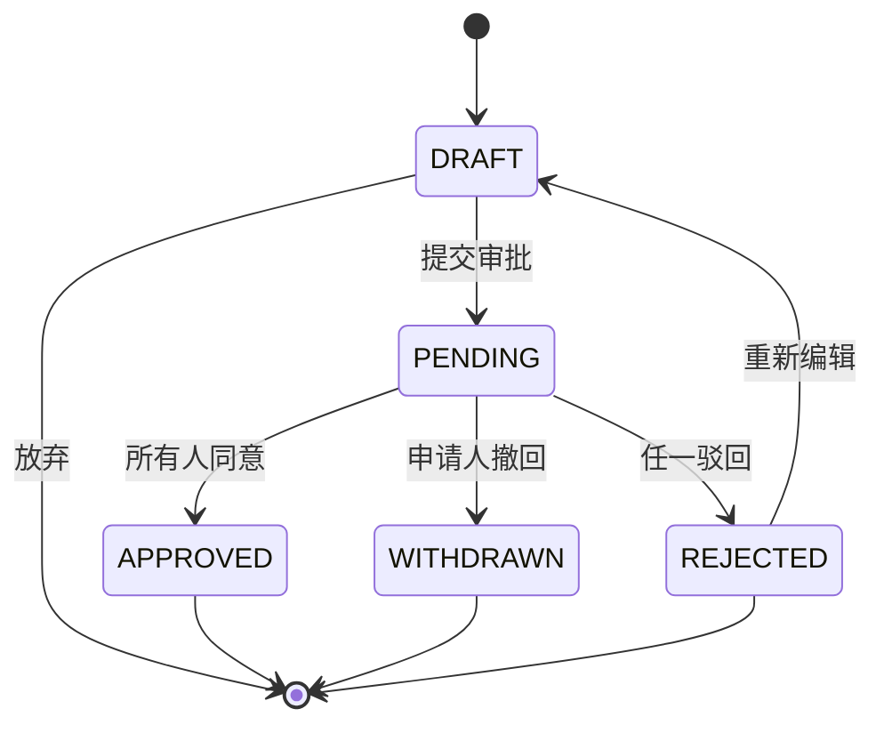

# Example 02 · 功能级内部工具

> **典型场景**：公司内部工具新增一个功能模块（如审批工作流）。
> **触发词**："做一个功能" / "加个模块" / "内部工具"
> **产出规模**：6-8 份文档，约 1.5-3 万字 + 5-8 张 Mermaid 图

---

## 项目背景

- **产品**：内部审批中心（虚构）—— 员工请假 / 报销 / 用车 / 采购审批
- **目标用户**：100 人规模公司全员
- **核心价值**：替代纸质 / 邮件审批，5 分钟提交，1 天内响应
- **本次范围**：审批流引擎 + 4 类审批模板（请假/报销/用车/采购）
- **开发周期**：3 周

---

## 文档清单（6 份 - 简化版）

```
01-prd.md                  PRD 主文档（6 章简化版）
02-state-machine.md        状态机（审批流：草稿/审批中/通过/驳回/撤回）
03-api-spec.md             API 文档（10 个接口）
04-db-design.md            数据库设计（3 张表）
05-test-cases.md           测试用例（30 个）
06-task-breakdown.md       任务拆分（12 个任务）
```

> 相比 Example 01 页面级方案，**省去了 14 份文档**——行业分析、ADR、用户研究等"沿用"或"省略"。

---

## 关键章节节选（PRD §1 背景与目标）

```markdown
## 1. 背景与目标

### 1.1 业务背景
公司当前审批依赖邮件 + 纸质单据，平均耗时 3 天，丢失率 15%。
员工体验差，管理者无法实时查看进度。

### 1.2 产品目标
- 提交审批 ≤ 5 分钟
- 平均审批时长 ≤ 1 天
- 流程可追溯，100% 留痕

### 1.3 范围
**包含**：请假 / 报销 / 用车 / 采购 4 类审批模板
**不包含**：会议预订、名片申请（下一迭代）
```

---

## 关键章节节选（状态机）



---

## 关键章节节选（API - 提交审批）

```yaml
POST /api/v1/approvals
description: 提交审批
auth: required
body:
  templateCode: string 必填  # LEAVE / REIMBURSE / CAR / PURCHASE
  title: string 必填
  content: object 必填
    # 模板相关字段（动态）
  approvers: bigint[] 必填  # 审批人 userId 列表（有序）
responses:
  200:
    approvalId: bigint
  400: INVALID_TEMPLATE
  401: UNAUTHORIZED
  403: NO_PERMISSION
```

---

## 关键章节节选（任务拆分）

| # | 任务 | 工时 | Owner |
|---|---|---|---|
| 1 | 审批引擎核心（状态机+流转） | 3d | 张三 |
| 2 | 4 类审批模板配置 | 1d | 李四 |
| 3 | 提交审批 API + Webhook | 1d | 张三 |
| 4 | 审批列表 / 详情前端 | 2d | 王五 |
| 5 | 审批通知（站内信 + 邮件） | 1d | 王五 |
| 6 | 数据库表 + 迁移脚本 | 0.5d | 李四 |
| 7 | 测试用例 + 联调 | 2d | 赵六 |
| 8 | 部署 + 监控 | 0.5d | 张三 |

---

## 经验教训

1. **6 章简化版够用**：复杂场景（页面/行业/ADR）省略后，**重点强化 状态机 + API + DB** 三件套。
2. **状态机是审批系统的灵魂**：必画，**且与代码 enum 严格 1:1**（详见 anti-patterns §16）。
3. **Webhook 通知提前设计**：审批流强依赖实时通知（站内信 / 邮件 / IM），必须在 API 设计阶段就考虑。
4. **模板配置 vs 代码硬编码**：4 类模板建议**配置化**（DB 存模板 schema），便于后续扩展（如新增"会议预订"）。
5. **审批人有顺序问题**：`approvers: [userA, userB]` 是串行还是并行？必在 PRD 明确（推荐串行 + 支持会签/或签配置）。
6. **撤回/驳回后状态可编辑**：设计为 `REJECTED → DRAFT` 而非 `REJECTED → [*]`，体验更好。
7. **审计日志不可省**：每步操作记 `approval_log` 表（操作人/时间/动作/备注），合规要求。

> 功能级方案适合 **"内部工具 / 中后台 / 单模块功能"**。完整产品用 Example 01，**纯 API 服务**用 Example 03。
