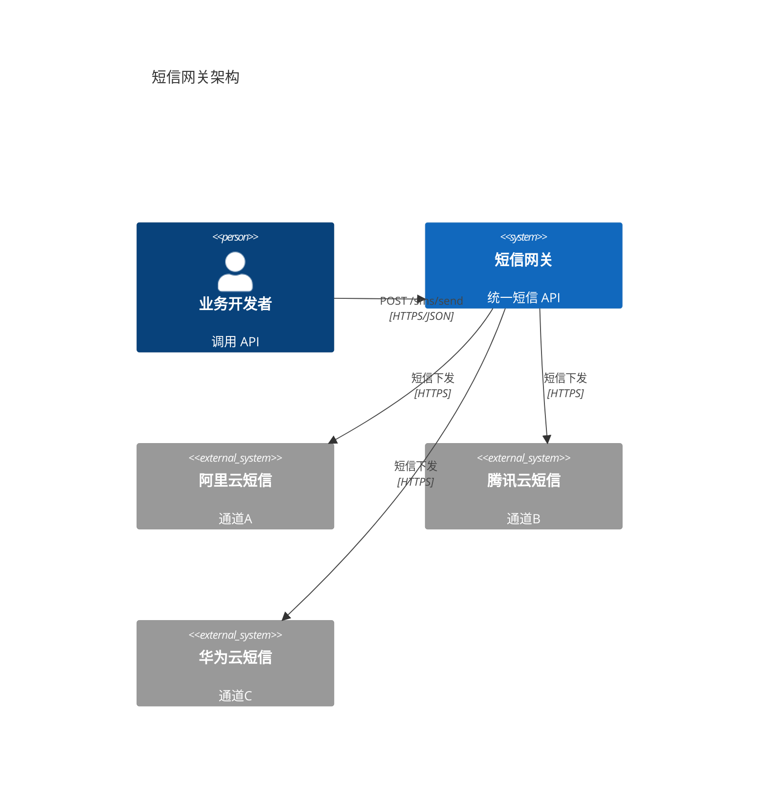

# Example 03 · 纯后端 API 服务

> **典型场景**：微服务、对外 API、Serverless 函数。
> **触发词**："做个 API" / "微服务" / "后端接口" / "BaaS"
> **产出规模**：5-6 份文档，约 0.8-1.5 万字 + 3-5 张 Mermaid 图

---

## 项目背景

- **产品**：短信网关服务（虚构）—— 对接阿里云/腾讯云/华为云短信，统一对外 API
- **目标用户**：公司内部各业务线、第三方合作方
- **核心价值**：统一接入、多通道容灾、发送成功率 ≥ 99.5%、TPS 1000
- **本次范围**：REST API + Webhook + 管理后台最小化
- **开发周期**：2 周

---

## 文档清单（5 份 - 极简版）

```
01-api-spec.md         OpenAPI 3.0 规范（4 个核心接口）
02-architecture.md     系统架构（C4 Container + 部署图）
03-db-design.md        数据库设计（2 张表：短信记录 + 通道配置）
04-test-cases.md       测试用例（15 个，含性能/容灾）
05-deployment.md       部署 + 监控 + 告警
```

> 比 Example 02 还少：连 PRD 都合并到 API 文档 §0 背景段。**纯后端服务的核心是"接口 + 架构 + 部署"**。

---

## 关键章节节选（API 规范）

```yaml
openapi: 3.0.3
info:
  title: 短信网关 API
  version: 1.0.0
paths:
  /api/v1/sms/send:
    post:
      summary: 发送短信
      security: [{bearerAuth: []}]
      requestBody:
        required: true
        content:
          application/json:
            schema:
              $ref: '#/components/schemas/SendRequest'
      responses:
        '200':
          description: 发送成功（已加入队列）
          content:
            application/json:
              schema:
                $ref: '#/components/schemas/SendResponse'
        '400': {description: 参数错误}
        '429': {description: 限流}
        '500': {description: 系统异常}
components:
  schemas:
    SendRequest:
      type: object
      required: [phone, templateCode, params]
      properties:
        phone: {type: string, pattern: '^1[3-9]\d{9}$'}
        templateCode: {type: string}
        params: {type: object, additionalProperties: {type: string}}
    SendResponse:
      type: object
      properties:
        messageId: {type: string, format: uuid}
        status: {type: string, enum: [QUEUED, SENT, FAILED]}
```

---

## 关键章节节选（架构图）



---

## 关键章节节选（数据库）

```sql
-- 短信发送记录
CREATE TABLE sms_record (
    id BIGINT PRIMARY KEY AUTO_INCREMENT,
    message_id CHAR(36) NOT NULL UNIQUE,         -- UUID
    user_id BIGINT NOT NULL,                     -- 业务调用方
    phone VARCHAR(20) NOT NULL,
    template_code VARCHAR(50) NOT NULL,
    content TEXT NOT NULL,                       -- 渲染后内容
    channel VARCHAR(20) NOT NULL,                -- ALIYUN / TXYUN / HWYUN
    status VARCHAR(20) NOT NULL DEFAULT 'QUEUED',-- QUEUED/SENT/FAILED
    error_code VARCHAR(20),
    cost DECIMAL(10,4),                          -- 成本
    sent_at TIMESTAMP,
    created_at TIMESTAMP NOT NULL DEFAULT CURRENT_TIMESTAMP,
    INDEX idx_user_created (user_id, created_at),
    INDEX idx_status (status)
);

-- 通道配置（多通道权重）
CREATE TABLE sms_channel (
    id INT PRIMARY KEY AUTO_INCREMENT,
    channel_code VARCHAR(20) NOT NULL UNIQUE,
    weight INT NOT NULL DEFAULT 100,             -- 权重，0=禁用
    daily_quota INT NOT NULL DEFAULT 100000,
    config_json JSON NOT NULL,                   -- accessKey 等
    enabled TINYINT NOT NULL DEFAULT 1
);
```

---

## 关键章节节选（测试用例）

| # | 类型 | 用例 | 预期 |
|---|---|---|---|
| 1 | 功能 | 正常发送（单通道） | messageId 返回，状态 QUEUED |
| 2 | 功能 | 多通道权重分配 | 按 weight 比例分配 |
| 3 | 异常 | 手机号格式错 | 400 INVALID_PHONE |
| 4 | 异常 | 模板未注册 | 400 TEMPLATE_NOT_FOUND |
| 5 | 限流 | 单用户 100 QPS | 第 101 次返回 429 |
| 6 | 容灾 | 通道 A 故障 | 自动切到 B/C |
| 7 | 容灾 | 通道 A 恢复 | 流量回切 |
| 8 | 性能 | 1000 TPS 持续 5 分钟 | P95 ≤ 200ms，错误率 < 0.1% |
| 9 | 安全 | 鉴权失败 | 401 UNAUTHORIZED |
| 10 | 安全 | SQL 注入 | 拒绝执行 |
| ... | ... | ... | ... |

---

## 经验教训

1. **纯 API 服务不需要 PRD 16 章**：直接用 OpenAPI + 简短背景段（1 页）足够。
2. **OpenAPI 3.0 规范是"接口单一真相源"**：mock / 文档 / 客户端 SDK 全部从它生成。
3. **多通道容灾是核心**：必须做权重分配 + 故障自动切换 + 配额管理，不能依赖单一通道。
4. **性能基准必量化**：TPS 1000、P95 ≤ 200ms、错误率 < 0.1%，缺一不可（详见 anti-patterns §13）。
5. **成本字段必记录**：`cost DECIMAL(10,4)` 计费，短信虽便宜但量大了费用惊人。
6. **Webhook 回调 vs 轮询**：让调用方提供回调 URL 优于反复查询状态。
7. **限流必须设计**：按 userId / IP / 全局三层限流，避免被刷爆。
8. **监控告警是生命线**：通道失败率 > 5% → 短信告警值班人，P0 故障 5 分钟内响应。

> 纯后端 API 服务适合 **"微服务 / BaaS / 中间件 / 工具 API"**。配合前端用 Example 01，需要业务功能用 Example 02。
