# 08 · Mermaid 语法速查表

> openPRD 全套文档（20+ 份）平均使用 Mermaid 图 ≥ 8 张。本文档是**团队 wiki 级别的速查表**——遇到不会画的图来查即可。

---

## 0. 文档目的

openPRD 体系强制使用 Mermaid 描述流程 / 时序 / 状态 / 架构等（详见 `reference/07-anti-patterns.md` §4）。原因：

- 文本即图（无外部图片依赖）
- GitHub / GitLab / VSCode 原生渲染
- 版本可控（diff 即变更）
- 学习成本低（声明式）

**本文档目的**：

- 18 种 Mermaid 图的最小可用语法
- 每个图给"语法 + 示例 + 适用场景"
- 汇总常见错误（语法 / 引号 / 中文标点）
- 推荐工具链

> 速查 ≠ 完整文档。Mermaid 官方文档（mermaid.js.org）覆盖所有细节，本文档专注"够用就好"。

---

## 1. 流程图（flowchart）

**适用**：业务流程、决策树、系统架构（轻量）

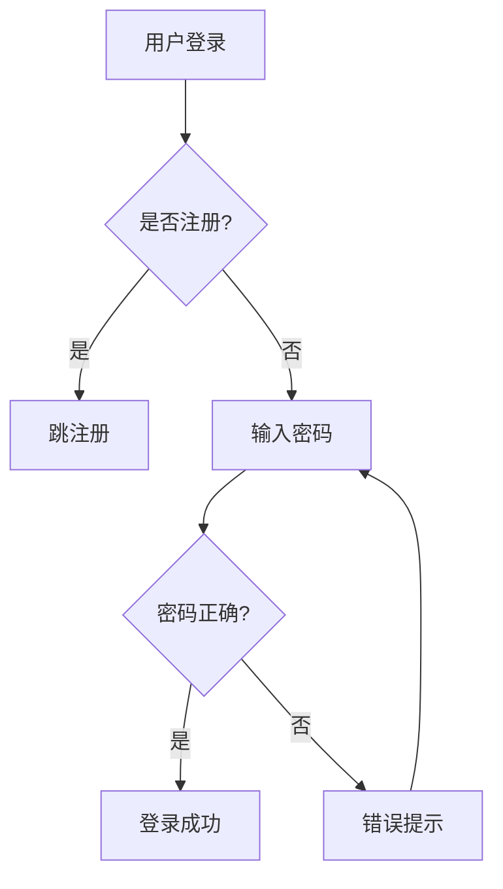

**语法要点**：

- `TD`（top-down）/ `LR`（left-right）/ `BT`（bottom-top）/ `RL`（right-left）
- 节点形状：`[]` 矩形 / `()` 圆角 / `{}` 菱形 / `[/]/` 平行四边形 / `[(())` 圆形 / `[[]]` 子程序
- 连线：`-->` 实线 / `-.->` 虚线 / `==>` 加粗 / `--text-->` 带文本
- 子图：

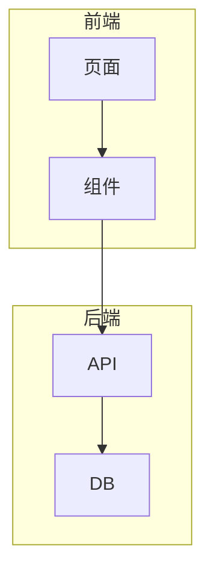

---

## 2. 时序图（sequenceDiagram）

**适用**：跨服务调用、API 交互、协议流程

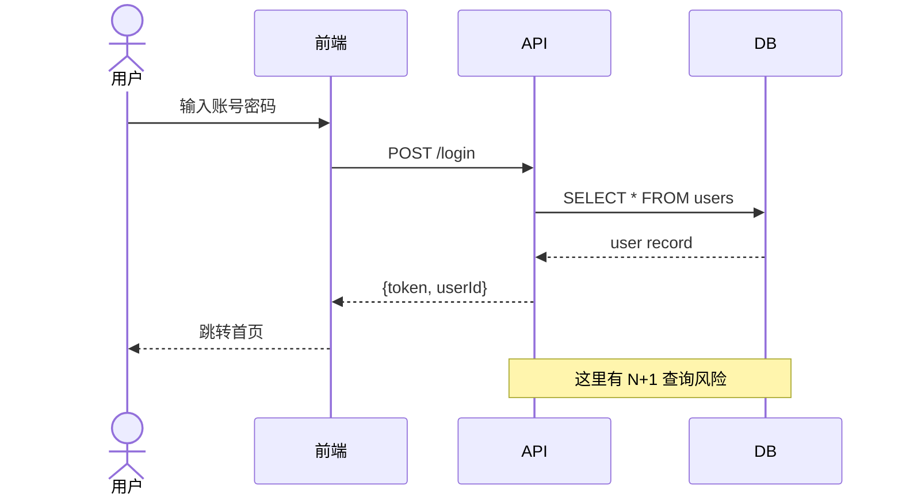

**语法要点**：

- `actor` 角色 / `participant` 服务
- 消息类型：`->` 实线 / `-->` 虚线 / `->>` 实线箭头 / `-->>` 虚线箭头
- 控制结构：`loop` / `alt` / `opt` / `par` / `critical` / `break`
- 注释：`Note over A,B: 内容`
- 激活：`activate` / `deactivate`

---

## 3. ER 图（erDiagram）

**适用**：数据库设计、领域模型

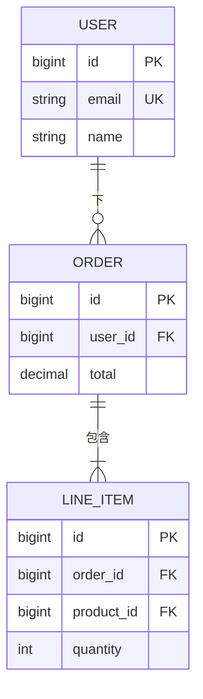

**语法要点**：

- 关系：`||--||` 一对一 / `||--o{` 一对多 / `||--|{` 一对多（必填） / `}o--o{` 多对多
- 字段标注：`PK` / `FK` / `UK`
- Crow's Foot 也可：`}|..|{` 等

---

## 4. 状态机（stateDiagram-v2）

**适用**：订单状态、审批流程、生命周期

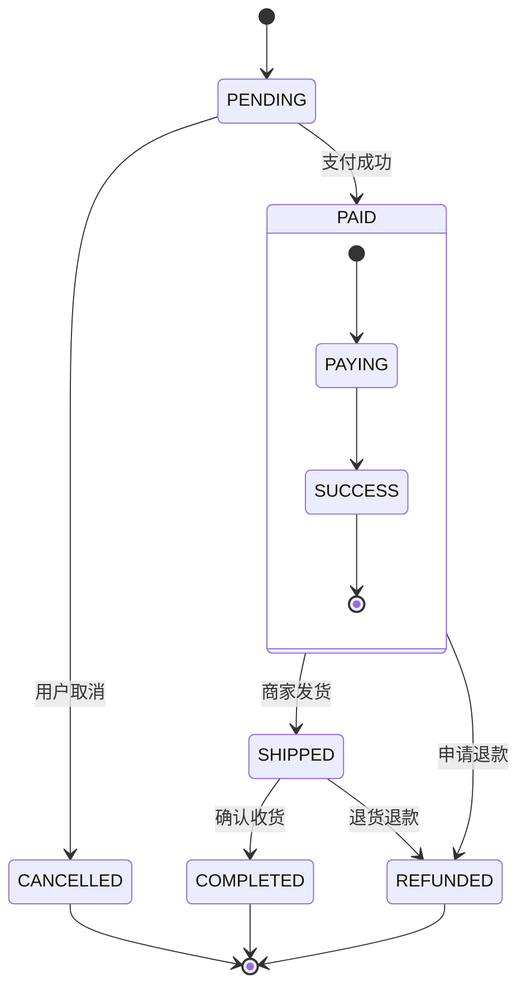

**语法要点**：

- `[*]` 起始 / 终止
- 嵌套：`state X { ... }`
- 转移条件：`A --> B : 条件`
- 注释：`%% 注释`

---

## 5. 类图（classDiagram）

**适用**：OOP 设计、领域模型

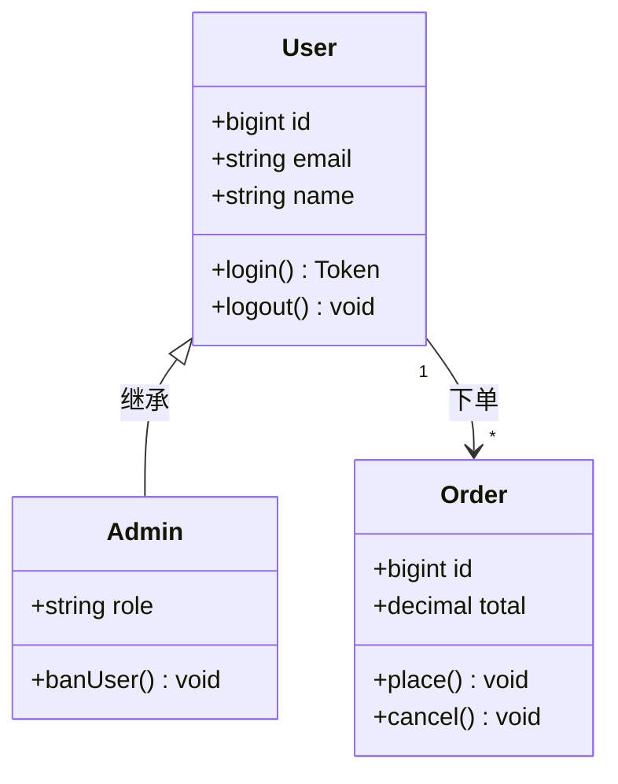

**语法要点**：

- 可见性：`+` public / `-` private / `#` protected
- 关系：`<|--` 继承 / `*--` 组合 / `o--` 聚合 / `-->` 关联 / `..>` 依赖 / `..|>` 实现
- 抽象方法：`*method()`

---

## 6. 甘特图（gantt）

**适用**：项目排期、里程碑

```mermaid
gantt
    title openPRD 实施排期
    dateFormat  YYYY-MM-DD
    section 阶段一
    用户研究     :a1, 2026-06-01, 5d
    行业分析     :a2, after a1, 3d
    section 阶段二
    PRD 编写     :b1, after a2, 7d
    评审         :milestone, b2, 1d
    section 阶段三
    API 设计     :c1, after b1, 5d
    DB 设计      :c2, after b1, 5d
```

**语法要点**：

- `dateFormat` 时间格式
- `section` 分组
- 任务：`任务 :id, 开始, 持续`
- 里程碑：`milestone, id, 1d`
- 依赖：`after id` / `until id`

---

## 7. 饼图（pie）

**适用**：占比展示

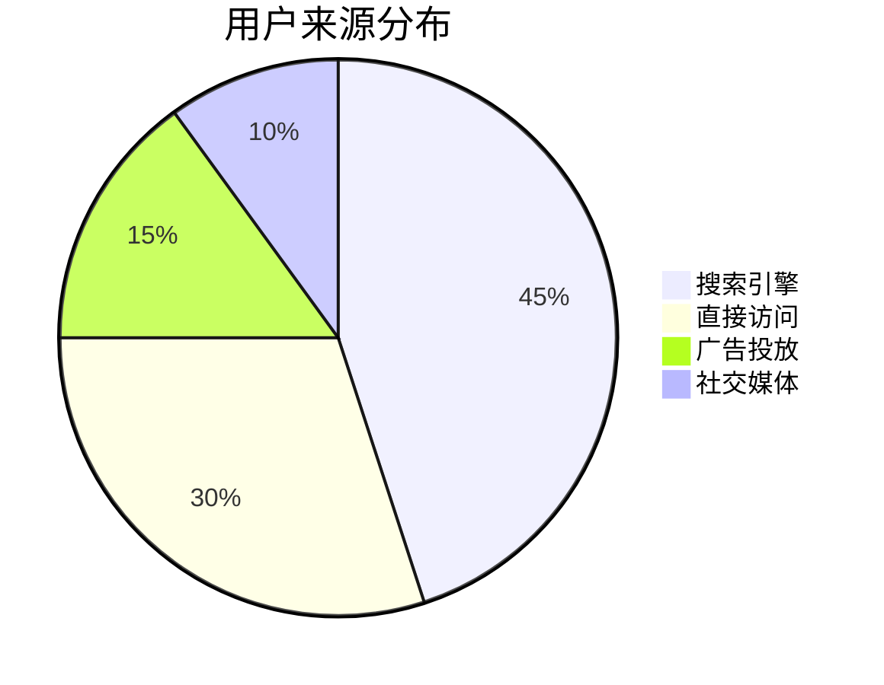

**语法要点**：

- `showData` 在图表上显示数值（v10+）

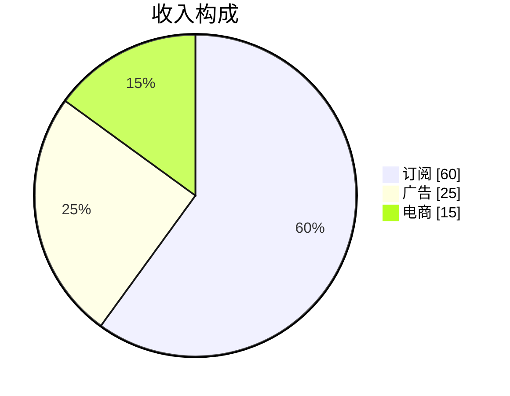

---

## 8. 雷达图（radar）— Experimental

**适用**：多维度对比（如性能基准）

```mermaid
radar
    title 性能对比
    axis 性能, 稳定性, 易用性, 安全性, 可维护性
    curve a{系统A}[80, 70, 90, 85, 75]
    curve b{系统B}[70, 85, 80, 90, 85]
```

> 注：Mermaid v10+ 实验性功能，渲染可能不稳定。

---

## 9. 用户旅程（journey）

**适用**：用户体验地图

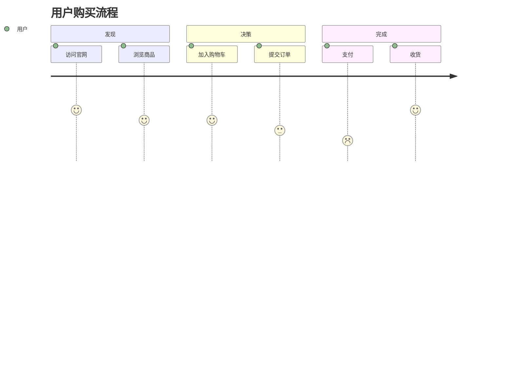

**语法要点**：

- `section` 阶段
- `任务 : 评分: 角色`（评分 1-5）

---

## 10. 四象限图（quadrantChart）

**适用**：优先级矩阵、技术选型

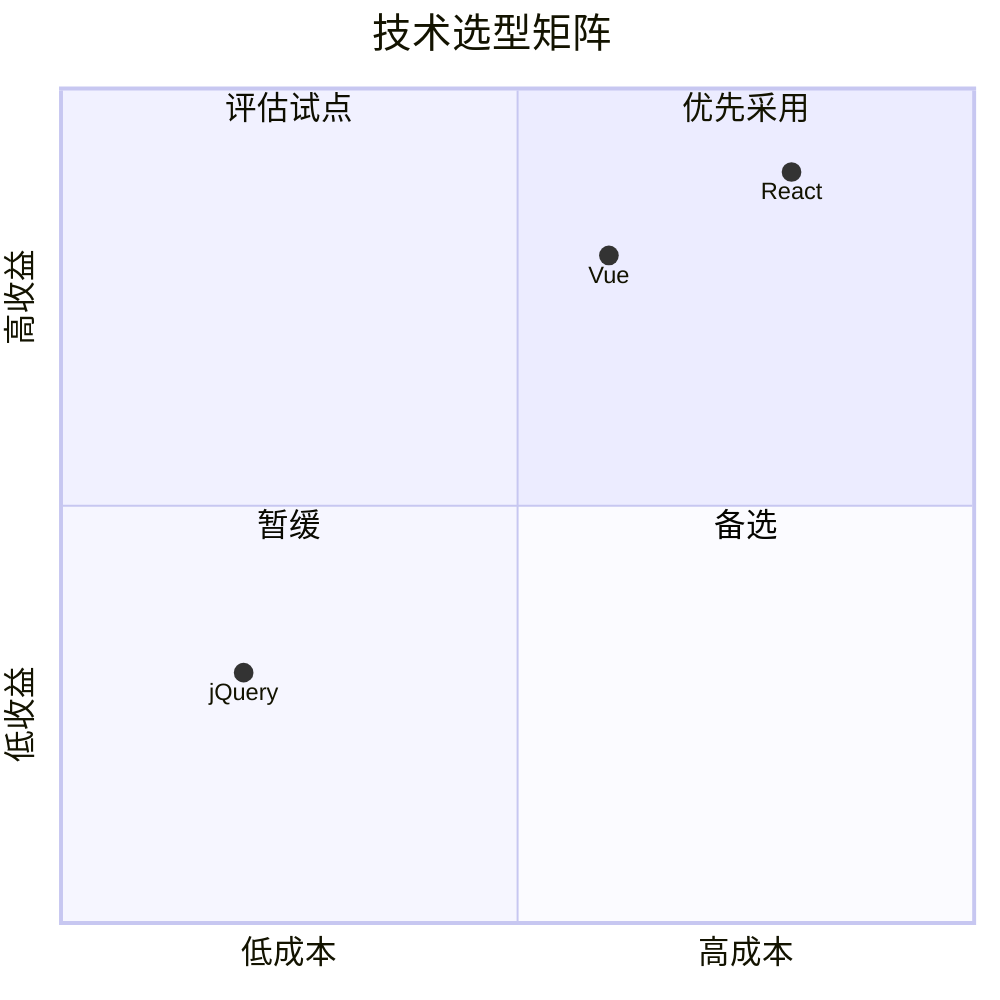

**语法要点**：

- 4 个象限
- 项：`名称: [x, y]`（坐标 0-1）

---

## 11. Git 图（gitGraph）

**适用**：分支策略、版本发布

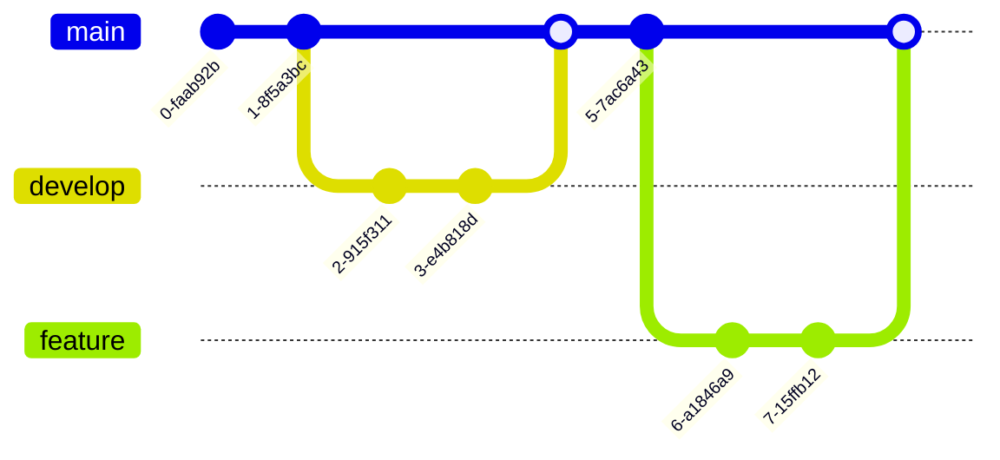

**语法要点**：

- `commit` 提交
- `branch` / `checkout` / `merge`
- `tag` 版本

---

## 12. 思维导图（mindmap）

**适用**：头脑风暴、知识结构

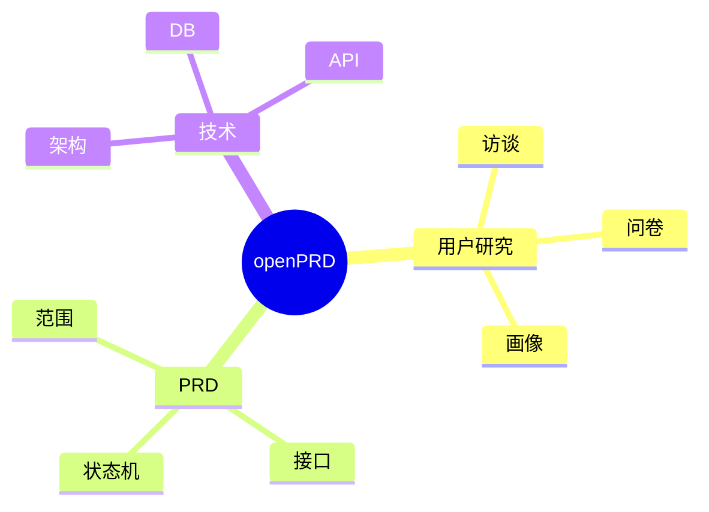

**语法要点**：

- `root` 根节点
- 缩进表示层级
- 节点形状：`()` 圆 / `[]` 方 / `())` 云 / `{{}}` 六边形

---

## 13. 需求图（requirementDiagram）

**适用**：需求追踪、依赖关系

```mermaid
requirementDiagram
    requirement 登录 {
        id: 1
        text: 支持邮箱密码登录
        risk: medium
        verifymethod: test
    }
    requirement 第三方登录 {
        id: 2
        text: 支持 Google 登录
        risk: low
        verifymethod: demo
    }
    功能 用户认证 {
        id: 3
        text: 用户认证模块
    }
    登录 -satisfies- 用户认证
    第三方登录 -satisfies- 用户认证
```

---

## 14. C4 架构图

**适用**：系统架构（Context / Container / Component / Dynamic）

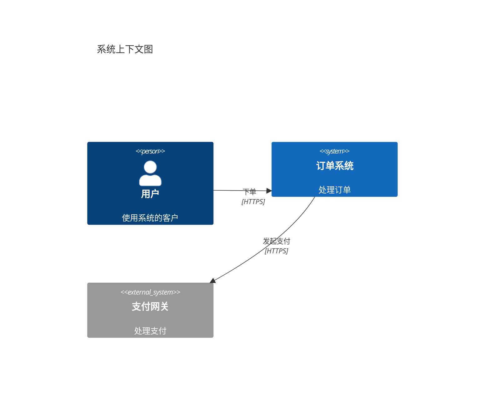

**语法要点**：

- `C4Context` / `C4Container` / `C4Component` / `C4Dynamic` / `C4Deployment`
- `Person` / `System` / `System_Ext` / `Container` / `ContainerDb`
- `Rel` / `Rel_Back` / `Rel_Neighbor` / `Rel_Down` / `Rel_Up`

---

## 15. 时间线（timeline）

**适用**：里程碑、历史回顾

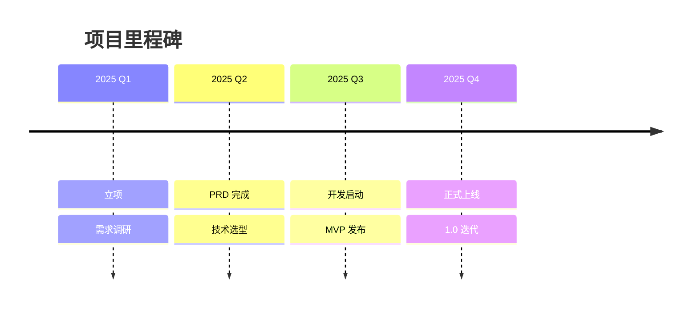

---

## 16. ZenUML

**适用**：时序图（更强表达力）

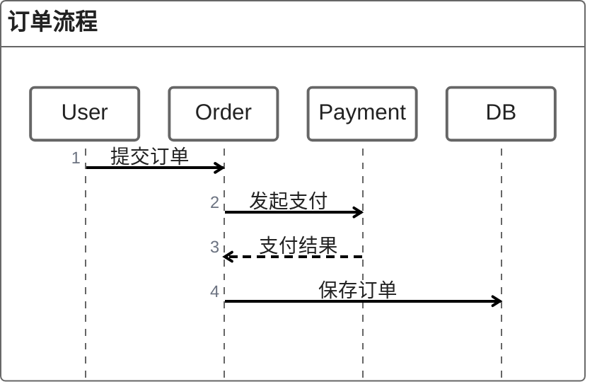

> 备选 sequenceDiagram 的 DSL。语法接近自然语言。

---

## 17. 常见错误

### 17.1 语法错误

- **中英标点混用**：Mermaid 节点文字用中文 `（）` `，` 通常 OK，但保留关键字必须用 ASCII
- **节点 ID 含特殊字符**：避免 `@#$`，用 `id1`、`id2`
- **未闭合子图**：`subgraph ... end` 必须成对
- **连线两端节点不存在**：A --> B 但 A 未定义

### 17.2 引号问题


含特殊字符的文本必须用 `""` 包裹。

### 17.3 中文标点

- 节点文字可用中文：`A[用户登录]`
- 但**避免**中文标点 `，。` 在关键字位置（如 `subgraph 用户` OK，但 `loop 用户, 每秒` 会报错）
- 解决：英文逗号 + 空格，或用 `""` 包裹

### 17.4 缩进与空格

- 子图必须缩进
- 时序图 `Note` 顶格写
- 流程图连线前后空格非强制，但推荐 `A --> B`

### 17.5 版本兼容

- 不同 Mermaid 版本语法略有差异
- `stateDiagram-v2`（必须带 `-v2`）
- `flowchart` 优于旧版 `graph`
- GitHub 默认 Mermaid v9，GitLab v10

---

## 18. 工具链

### 18.1 在线编辑器

- **Mermaid Live**：https://mermaid.live/ — 官方编辑器，实时预览
- **Mermaid Chart**：https://www.mermaidchart.com/ — 协作版（付费）

### 18.2 IDE 插件

- **VSCode**：
  - `Markdown Preview Mermaid Support`（官方）
  - `Mermaid Preview`（实时预览）
  - `Mermaid Markdown Syntax Highlighting`（语法高亮）
- **JetBrains**：
  - `Mermaid plugin`（IDEA / WebStorm）
- **Obsidian**：
  - 原生支持 Mermaid

### 18.3 文档嵌入

- **GitHub / GitLab**：代码块写 ` ```mermaid ` 即可
- **Notion**：原生支持
- **Confluence**：用 Markdown 宏 + Mermaid 插件
- **飞书 / 钉钉文档**：原生支持
- **Docusaurus**：插件 `docusaurus-plugin-mermaid`

### 18.4 校验工具

- **mermaid-cli（mmdc）**：本地命令行渲染为 PNG/SVG

```bash
npm install -g @mermaid-js/mermaid-cli
mmdc -i input.mmd -o output.svg
```

- **markdownlint**：检查代码块语言标记

### 18.5 CI 集成

- GitHub Actions：`mermaid-cli` 渲染所有图
- 失败原因：语法错误、版本不兼容
- 配套脚本：`scripts/validate-mermaid.sh`

---

## 附录：速查表

| 场景 | 图类型 | 关键字 |
|---|---|---|
| 业务流程 | flowchart | `flowchart TD` |
| 接口调用 | sequenceDiagram | `sequenceDiagram` |
| 数据库 | erDiagram | `erDiagram` |
| 状态流转 | stateDiagram | `stateDiagram-v2` |
| 面向对象 | classDiagram | `classDiagram` |
| 项目排期 | gantt | `gantt` |
| 数据占比 | pie | `pie` |
| 用户旅程 | journey | `journey` |
| 优先级 | quadrantChart | `quadrantChart` |
| 分支策略 | gitGraph | `gitGraph` |
| 脑暴 | mindmap | `mindmap` |
| 需求追踪 | requirementDiagram | `requirementDiagram` |
| 架构 | C4Context | `C4Context` |
| 里程碑 | timeline | `timeline` |

> 18 种图覆盖 95% 的 PRD 场景，其余 5% 用文本描述。
