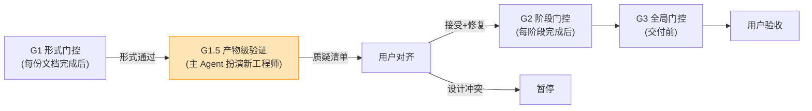

# 17 · G1.5 产物级验证（Product-Level Verification）

> 📖 **使用说明**:本文档定义 **G1.5 产物级验证**规则——介于 G1(形式)与 G2(阶段)之间的"主 Agent 扮演新工程师抽样复述"门控。
>
> **Why this exists**:G1 形式门控查"文件存在、章节齐全、字段齐备",但 PRD 写完不等于能落地。G1.5 是主 Agent 扮演"新来的工程师"角色,抽样验证产物是否真的能跑通——文档过 G1 不代表读者能据此实现,过 G1.5 才代表能。
>
> **触发顺序**:G1 形式 → G1.5 产物 → G2 阶段 → G3 全局。G1.5 必须先于 G2 通过。

---

## 0. 文档目的

- **形式 vs 产物的双层验证**:G1 验"文档结构",G1.5 验"业务逻辑可落地"
- **产物质疑而非通过/不通过**:输出"质疑清单"返回用户对齐,不直接给 ✅/❌
- **抽样而非全检**:每份核心文档抽 3-5 处,效率与质量平衡
- **可执行规则**:每条质疑配"位置 + 问题 + 建议修复方向"

---

## 1. G1 vs G1.5 区别

| 维度 | G1 (形式) | G1.5 (产物) |
|------|-----------|-------------|
| **查什么** | 文档存在 / 章节数 / 字段数 / Mermaid 图存在 / 占位符比例 | 业务逻辑闭环 / 状态机无死锁 / 跨文档字段流转 / P0 US 实现路径 |
| **方法** | `grep` / `wc` / 模板自检脚本 | 抽样复述 + 对照验证 + 信息缺口标记 |
| **角色** | 静态规则检查器 | 主 Agent 扮演"新来的工程师" |
| **通过标准** | 文件存在且结构完整(数量达标) | 主 Agent 能"复述"出实现路径且与文档自洽 |
| **失败后果** | 修文档(补章节/补字段/删占位符) | 修设计(或标"待澄清"返回用户对齐) |
| **输出** | ✅/❌ 通过/不通过 | 质疑清单(问题列表 + 建议修复方向) |
| **触发时机** | 每份文档产出后 | G1 通过后、G2 启动前 |

> **关键洞察**:G1 通过 ≠ 可落地。例如 06-PRD §3.2 US-05 "用户取消订单"在 G1 下"章节存在、字段齐全"即通过,但 G1.5 会问:"取消后支付如何退款?",这是 G1 查不出的设计缺口。

---

## 2. 抽样规则

### 2.1 抽样数量(按文档重要性)

| 文档级别 | 文档清单 | 抽样数 |
|----------|----------|--------|
| **核心** | 06-PRD(及 06a-06h)、03-接口文档、12-数据库设计 | 5 处 / 份 |
| **关键** | 02-项目整体说明、11-Mock 数据、07-测试用例、05-任务拆分 | 3 处 / 份 |
| **辅助** | 04-前端指南、09-后端指南、10-前端交互、13-架构设计 | 1-2 处 / 份 |
| **调研类** | 用户调研、14-行业/竞品/标杆/合规/技术趋势 | 2 处 / 份(查"是否能支撑设计决策") |

### 2.2 抽样内容(每处抽样必含 3 类)

每个抽样点都要走完 3 类验证:

1. **端到端实现路径**:1 个 P0 用户故事从 UI → 接口 → DB → Mock 是否信息自洽
2. **状态转换闭环**:1 个核心业务规则的状态机是否含全部 入态/出态/异常态
3. **跨文档字段流转**:1 个字段在 06-PRD/03-接口/12-DB/11-Mock 4 处的拼写/类型/语义是否一致

> **示例**(取自 examples/02 审批工作流):
> - 抽样点 1:US-03 "员工提交审批" → 走 06-PRD §3 → 03-API `POST /approvals` → 12-DB `approvals` 表 → 11-Mock 是否 4 处自洽
> - 抽样点 2:状态机 `DRAFT → PENDING → APPROVED/REJECTED/WITHDRAWN` → 验"WITHDRAWN 后能否重新编辑?","REJECTED → DRAFT 谁触发?"
> - 抽样点 3:字段 `approvers: bigint[]` → 在 06-PRD §3.2(业务字段)、03-API(请求体)、12-DB(表字段)、11-Mock(示例数据) 4 处类型是否一致

---

## 3. 验证方法(主 Agent 操作步骤)

### 3.1 准备阶段(每次 G1.5 启动前)

1. 列出本次需 G1.5 验证的文档清单(按 §2.1)
2. 为每份文档预定抽样点(由主 Agent 自动选,优先 P0 US)
3. 加载 `reference/15-five-field-crosscheck.md` 作为字段一致性参考

### 3.2 抽样验证步骤(每个抽样点)

**步骤 1:扮演新工程师提问**

主 Agent 选定 1 个 P0 US,**不**复述 PRD 原文,问:
> "如果我是新来的工程师,刚拿到这份文档,看完这个 US 我会怎么实现?"

**步骤 2:走查链路**

按以下顺序走查,标记"信息缺口":
- 06-PRD §X.Y(US 描述) → **问**:US 写清楚 触发/前置/主流程/异常分支了吗?
- → 03-接口文档(对应 API) → **问**:API 路径/参数/响应/错误码是否够新工程师直接编码?
- → 12-数据库设计(对应表) → **问**:表字段是否覆盖 US 所有数据需求?有无遗漏?
- → 11-Mock 数据(对应示例) → **问**:Mock 数据是否真实反映业务场景(不是 `{"foo":"bar"}` 占位)?

**步骤 3:标记信息缺口**

发现以下任意一种 → 记录为质疑:
- US 没说明白("用户取消订单"未定义"取消后是否退款")
- 字段未定义(US 提到 "审批历史",但 12-DB 无 `approval_log` 表)
- 状态转移条件缺失(状态机有 `REJECTED → DRAFT`,但未说明谁触发、能否覆盖原数据)
- 跨文档字段不一致(06-PRD 叫 `userId`,03-API 叫 `user_id`,12-DB 叫 `uid`)
- 异常分支未覆盖(US 主流程清晰,但"并发提交"/"网络中断后恢复"未提)
- 时序耦合未说明(API 顺序依赖未画时序图)

**步骤 4:输出质疑清单**

**不输出**"通过/不通过",**输出**"质疑清单"(见 §4 格式)。质疑清单交给用户对齐:
- 用户接受 → 进入修复(补 US / 加字段 / 改状态机) → 重跑 G1.5
- 用户认为不是问题 → 在 PRD 加"备注:已与用户确认 XX 不需补充"
- 用户与设计冲突 → 暂停交付,标"设计冲突"返回用户重新决策

---

## 4. 输出格式(质疑清单)

### 4.1 单文档质疑清单格式

```markdown
## G1.5 质疑清单 — <文档名>

**抽样配置**:抽样 N 处,覆盖 P0 US M 个 / 核心规则 K 个 / 跨文档字段 J 个

| # | 位置 | 类型 | 问题 | 建议修复 | 优先级 |
|---|------|------|------|----------|--------|
| 1 | 06-PRD §3.2 US-05 | US 未覆盖异常 | "用户取消订单"未定义"取消后支付是否退款" | 补 US-05 扩展流;或在 03-接口加 /refund 接口 | P0 |
| 2 | 12-DB `approvals` 表 | 字段缺失 | US-03 提到"审批历史"但表无 `approval_log` 字段 | 新增 `approval_log` 表(approver_id/action/comment/created_at) | P0 |
| 3 | 03-API `POST /approvals` | 跨文档不一致 | 06-PRD `approvers` 是 `bigint[]`,03-API 请求体是 `number[]` | 统一为 `bigint[]` 或在 03-API 加类型映射说明 | P1 |
| 4 | 06-PRD §状态机 | 状态转移条件缺失 | `REJECTED → DRAFT` 未说明谁触发、能否覆盖原数据 | 补"申请人在 7 天内可重新编辑,超时则归档" | P1 |
| 5 | 11-Mock | Mock 不真实 | Mock 数据是 `{"foo":"bar"}` 占位,无真实业务场景 | 至少 3 条 Mock 反映"请假/报销/采购"3 类真实场景 | P2 |

**总结**:5 项质疑(P0×2 / P1×2 / P2×1)。建议:
1. P0 项必修(否则下游开发会卡住)
2. P1 项与用户对齐后修复
3. P2 项在开发前补齐即可

**G1.5 状态**:⚠️ 待用户对齐 / ✅ 已对齐通过 / ❌ 设计冲突(暂停交付)
```

### 4.2 全局 G1.5 汇总报告(交付前主 Agent 输出)

```markdown
## G1.5 产物级验证汇总报告

### 抽样覆盖
- 核心文档:06-PRD(5 处) / 03-接口(5 处) / 12-DB(5 处)
- 关键文档:02-项目整体(3 处) / 11-Mock(3 处) / 07-测试(3 处) / 05-任务(3 处)
- 辅助文档:04 / 09 / 10 / 13(各 1 处)
- **总抽样**:N 处

### 质疑统计
| 文档 | P0 | P1 | P2 | 总数 |
|------|----|----|----|------|
| 06-PRD | 2 | 1 | 0 | 3 |
| 03-接口 | 1 | 1 | 1 | 3 |
| 12-DB | 1 | 0 | 1 | 2 |
| ... | | | | |
| **合计** | 5 | 3 | 2 | 10 |

### 修复路径
- P0 项(5):必修,涉及业务闭环或下游阻塞
- P1 项(3):与用户对齐后修复
- P2 项(2):开发前补齐即可

### 用户对齐结果
- [✅/⚠️/❌] 用户已确认接受质疑清单
- [✅/⚠️/❌] 设计冲突已解决
- [✅/⚠️/❌] 修复后已重跑 G1.5

### G1.5 结论
- ✅ **通过**:质疑清单已与用户对齐,P0 项已修复,可进入 G2
- ⚠️ **待对齐**:N 项质疑待用户裁决
- ❌ **暂停**:M 项设计冲突,需重新设计
```

---

## 5. 触发条件

| 模式 | 文档清单 | G1.5 是否必走 | 抽样数 |
|------|----------|---------------|--------|
| **完整模式 - 页面级** | 16 份 | ✅ **必走** | 核心 5 / 关键 3 / 辅助 1-2 |
| **完整模式 - 功能级** | 14 份 | ✅ 推荐走 | 核心 3 / 关键 2 / 辅助 1 |
| **简化模式 - 页面级** | 9 份 | ✅ **必走**(06 必抽 5 处) | 仅 06 抽 5 处,03/12 抽 3 处 |
| **简化模式 - 功能级** | 6-8 份 | ⚠️ 推荐走(06 必抽 3 处) | 仅 06 抽 3 处 |

> **规则总结**:
> - 页面级方案:**G1.5 必走**(因为页面方案复杂,信息缺口风险高)
> - 功能级方案:**G1.5 推荐走**(简单功能可降到 06 抽 3 处)
> - 用户明确"快速原型"标记 → G1.5 可降到 06 抽 1 处(仅查"P0 US 是否能实现")

---

## 6. 与 G1/G2/G3 的关系

### 6.1 门控顺序



### 6.2 升级关系

| G 级 | 输入 | 输出 | 升级条件 |
|------|------|------|----------|
| G1 → G1.5 | G1 ✅ 形式通过 | G1.5 启动 | 文件齐全、章节完整、占位符 < 5% |
| G1.5 → G2 | G1.5 质疑清单已与用户对齐 + P0 项已修复 | G2 启动 | 用户接受质疑清单 + 修复完成 |
| G2 → G3 | G2 ✅ 阶段通过 + G1.5 ✅ 已通过 | G3 启动 | 所有阶段产出齐备且通过形式+产物双层 |
| G3 → 交付 | G3 ✅ 全局通过 | 用户验收 | 跨文档一致 + 价值密度达标 |

### 6.3 不通过的处理

| 失败级别 | 处理路径 |
|----------|----------|
| G1 不过 | 修文档(补章节/补字段/删占位符)→ 重跑 G1 |
| G1.5 不过(质疑未对齐) | 输出质疑清单 → 与用户对齐 → 修设计/补 US → 重跑 G1.5 |
| G1.5 不过(设计冲突) | 暂停交付 → 标"设计冲突" → 返回用户重新决策 |
| G2 不过 | 重跑对应阶段的 subagent → 重跑 G2 |
| G3 不过 | 列冲突点 → 返工关键文档 → 重跑 G3 |

> **关键**:G1.5 不过不会"硬性失败",而是"产出质疑清单返回用户"。这与 G1/G2/G3 的"硬性 ✅/❌"形成互补:形式可机械化检查,产物必须人工对齐。

---

## 7. 抽样案例(取自 examples/02)

### 7.1 案例 1:US-03 "员工提交审批" 端到端验证

**主 Agent 扮演新工程师提问**:"我是新来的,看完 US-03 怎么实现?"

| 走查节点 | 文档对应位置 | 信息缺口 | 质疑 |
|----------|--------------|----------|------|
| US 描述 | 06-PRD §3.3 US-03 | US 写了"员工提交审批"但未说"重复提交如何处理" | Q1: 同一员工 5 分钟内重复提交同一审批,是否要去重? |
| API 入口 | 03-API `POST /approvals` | 请求体 `approvers: bigint[]` 没说"是否允许空" | Q2: `approvers` 为空时返回什么错误码? |
| DB 写入 | 12-DB `approvals` 表 | 表无 `version` 字段 | Q3: 并发更新如何避免覆盖?需要乐观锁字段吗? |
| Mock 数据 | 11-Mock `approvals.mock.json` | 只有 1 条 Mock,无"驳回""撤回"案例 | Q4: 补充驳回/撤回案例,覆盖状态机所有分支 |

**质疑清单**:
| # | 位置 | 问题 | 建议修复 | P |
|---|------|------|----------|---|
| 1 | 06-PRD §3.3 US-03 | 重复提交未定义 | 补"5分钟内重复提交去重(基于业务唯一键)" | P0 |
| 2 | 03-API `POST /approvals` | `approvers` 空值未定义 | 加错误码 400 INVALID_APPROVERS | P1 |
| 3 | 12-DB `approvals` 表 | 缺乐观锁 | 加 `version int default 0` 字段 | P1 |
| 4 | 11-Mock | Mock 案例不全 | 补驳回/撤回 2 条 Mock | P2 |

### 7.2 案例 2:状态机 `REJECTED → DRAFT` 闭环验证

**主 Agent 扮演新工程师提问**:"REJECTED → DRAFT 谁触发?数据怎么处理?"

走查 06-PRD §5 状态机 → 发现:
- 转移条件:无说明
- 数据保留:无说明
- 时效:无说明

**质疑**:
| # | 位置 | 问题 | 建议修复 | P |
|---|------|------|----------|---|
| 1 | 06-PRD §5 状态机 | `REJECTED → DRAFT` 转移条件缺失 | 补"申请人 7 天内可点击'重新编辑',7 天后归档" | P0 |
| 2 | 06-PRD §5 | 重新编辑时数据保留策略未说 | 补"保留原内容,清空审批意见,版本号 +1" | P1 |
| 3 | 03-API | 无 `POST /approvals/{id}/reopen` 接口 | 加 reopen 接口 | P0 |

### 7.3 案例 3:字段 `approvers` 跨文档一致性

**主 Agent 扮演新工程师走查 4 处**:

| 文档 | 字段定义 | 类型 | 备注 |
|------|----------|------|------|
| 06-PRD §3 | `approvers: 审批人列表` | bigint[] | "有序" |
| 03-API 请求体 | `approvers: number[]` | number[] | 类型不一致 |
| 12-DB | `approvers_json: json` | json | 序列化存储,类型不直观 |
| 11-Mock | `"approvers": [1001, 1002]` | number[] | OK |

**质疑**:
| # | 位置 | 问题 | 建议修复 | P |
|---|------|------|----------|---|
| 1 | 03-API vs 06-PRD | 类型不一致(bigint[] vs number[]) | 统一为 `Array<bigint as string>`,加说明 | P1 |
| 2 | 12-DB | json 存储,前端解析时类型可能丢失 | 加说明"前端必须 BigInt 转换,避免精度问题" | P1 |

---

## 8. 检查清单(主 Agent 跑 G1.5 前必看)

- [ ] 已加载本文档 + `reference/15-five-field-crosscheck.md`
- [ ] 已确定本次 G1.5 文档清单(按 §2.1)
- [ ] 已为每份文档选定 3-5 个抽样点(优先 P0 US)
- [ ] 已为每个抽样点准备"走查链路"模板
- [ ] 知道质疑清单的输出格式(§4)
- [ ] 知道与用户对齐的 3 种结果(接受 / 备注 / 设计冲突)
- [ ] 知道 G1.5 不过的处理(标"待澄清"返回用户,不硬性 ❌)

---

## 9. 与其他门控的引用

- **G1 形式门控规则**:见 `reference/05-quality-gates.md` §2
- **G2 阶段门控规则**:见 `reference/05-quality-gates.md` §3
- **G3 全局门控规则**:见 `reference/05-quality-gates.md` §4
- **自检清单(单一来源)**:见 `reference/13-quality-selfcheck.md`
- **5 字段交叉对比**:见 `reference/15-five-field-crosscheck.md`(G1.5 抽样必查)
- **常见 pitfalls**:见 `reference/16-common-pitfalls.md`(G1.5 质疑灵感来源)

---

*本文档是 G1.5 产物级验证的规则手册。G1 → G1.5 → G2 → G3 是 openPRD 的完整门控链路,任何一层失败都需修复后再进入下一层。*
