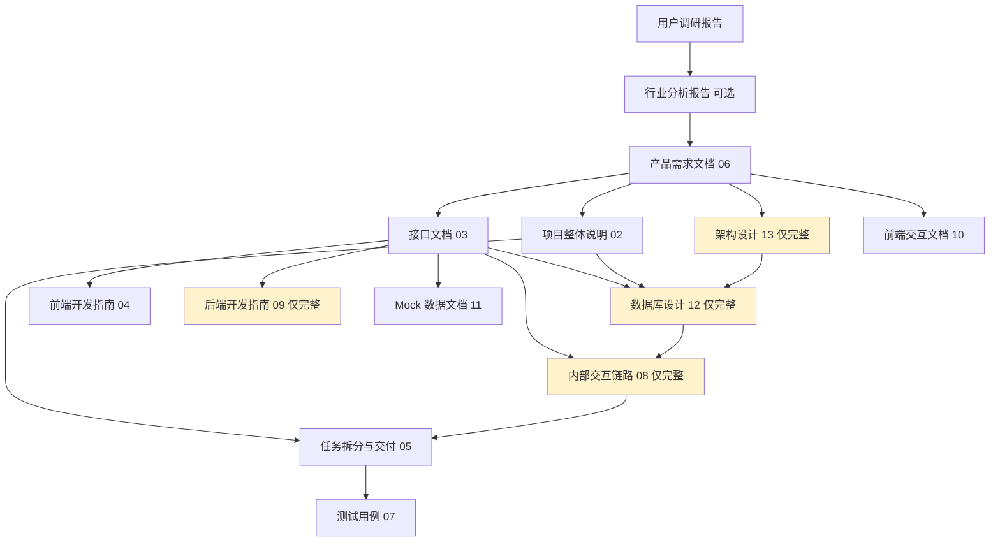

# openPRD 文档模板索引

本文档提供 openPRD 技能输出的完整文档模板索引和使用指南。

---

> 📖 **使用指南**：在开始一个新项目的文档产出前，先通读本文档，了解各模板的用途和依赖关系。
>
> 📌 **一页纸摘要**:
> 1. 看完这页能回答:本项目要产出哪 N 份文档?哪份先写?简化模式 vs 完整模式差什么?
> 2. 文档定位:技能级入口,所有 33 个文档模板的总索引
> 3. 核心动作:按 §0.3 产出顺序执行,按 §1 各文档说明分配
> 4. 何时使用:开始新项目 / 不知道某个内容放哪个文档
> 5. 不要用于:具体模板填写要点(各模板 §0 内)
>
> 🔗 **关键引用**: `reference/12-value-matrix.md` (文档价值矩阵) · [`reference/13-quality-selfcheck.md`](../reference/13-quality-selfcheck.md) (质量自检) · [`reference/14-mode-tag-table.md`](../reference/14-mode-tag-table.md) (模式标签) · [`reference/15-five-field-crosscheck.md`](../reference/15-five-field-crosscheck.md) (5 字段交叉对比) · [`reference/16-common-pitfalls.md`](../reference/16-common-pitfalls.md) (跨子技能常见错误)

---

## 0. 模板总览

⭐ **关键决策**：
- **21 份文档按"主/完整/可选"3 模式分类**：通用（16 份）+ 仅完整（4 份）+ 可选（1 份）
- **产出顺序 6 步**：调研 → 行业分析 → PRD → 整体说明 → 接口/架构 → 后续文档
- **依赖关系**：PRD 是源头，接口文档是前后端契约，DB/架构依赖接口，其他依赖 PRD+接口
- **何时不需要本索引**：单页级 / 极简内部工具 / 1-2 人小项目（直接用 6 章功能级模板）

### 0.0 本文档价值

> **回答的核心问题**：本项目有哪些文档？怎么找？
>
> **不回答什么**：具体功能、API、测试细节（各专项文档内）
>
> **价值判定**：新人 5 分钟能找到任意文档
>
> **所属阶段**：管理（项目入口）

### 0.1 模板列表

| # | 文档名称 | 文件名 | 产出阶段 | 核心用途 | 模式 |
|---|----------|--------|----------|----------|------|
| 1 | 项目入口文档 | 01-README.md | 项目启动 | 项目导航、文档索引 | 通用 |
| 2 | 项目整体说明 | 02-项目整体说明.md | 需求分析 | 背景、架构、目标 | 通用 |
| 3 | 接口文档 | 03-接口文档.md | 方案设计 | API 定义、前后端契约 | 通用 |
| 4 | 前端开发指南 | 04-前端开发指南.md | 开发准备 | 前端规范、组件使用 | 通用 |
| 5 | 任务拆分与交付 | 05-任务拆分与交付.md | 项目规划 | 任务分解、测试、部署 | 通用 |
| 6 | 产品需求文档 | 06-产品需求文档.md | 需求分析 | 功能需求、非功能需求 | 通用 |
| 7 | 测试用例 | 07-测试用例.md | 测试阶段 | 测试用例、测试结果 | 通用 |
| 8 | 内部交互链路 | 08-内部交互链路.md | 方案设计 | 前后端交互、状态流转 | 仅完整 |
| 9 | 后端开发指南 | 09-后端开发指南.md | 开发准备 | 后端规范、技术栈 | 仅完整 |
| 10 | 前端交互文档 | 10-前端交互文档.md | 方案设计 | 组件交互、页面流转、动画 | 通用 |
| 11 | Mock 数据文档 | 11-Mock数据文档.md | 开发准备 | Mock 数据结构与示例 | 通用 |
| 12 | 数据库设计 | 12-数据库设计.md | 方案设计 | 表结构、索引、约束 | 仅完整 |
| 13 | 架构设计 | 13-架构设计.md | 方案设计 | 整体架构、技术选型 | 仅完整 |
| 14 | 行业分析报告 | 14-行业分析报告.md | 调研阶段 | 行业特点、流程、标杆 | 可选 |
| 15 | FigmaMake 提示词 | FigmaMake-Prompt.md | 设计阶段 | 设计还原代码生成 | 通用 |
| 16 | 用户调研报告 | 用户调研报告模板.md | 调研阶段 | 用户研究结果 | 通用 |
| 17 | A/B 测试设计 | 15-ab-test-design.md | 方案设计 | 实验假设 / 流量分配 / 显著性检验 / RACI | 通用 |
| 18 | 商业模式画布 BMC | 16-business-model-canvas.md | 调研/设计 | 9 宫格画布 / 客户细分 / 价值主张 / 收入流 | 通用 |
| 19 | 用户旅程地图 CJM | 17-customer-journey-map.md | 调研/设计 | 阶段划分 / 触点 / 情绪曲线 / 痛点 / 机会 | 通用 |
| 20 | 上线后复盘 PLR | 18-post-launch-review.md | 复盘 | 30/60/90 天指标 / ROI / OKR / Lessons Learned | 通用 |
| 21 | 风险矩阵热力图 | 19-risk-matrix-heatmap.md | 管理 | 风险登记 / Likelihood×Impact 4×4 / 应对策略 | 通用 |
| 22 | **架构脑图(v4.4)** | **20-架构脑图.md** | 展示阶段 | **业务+产品 2 张脑图 × 4 格式(Mermaid/MD/JSON/XMind)** | **通用** |

> 📝 **模式说明**：
> - **通用**：完整模式 + 简化模式都产出
> - **仅完整**：仅后端同时实现模式下产出
> - **可选**：根据行业需要选择产出

### 0.2 模板关系图



### 0.3 产出顺序

| 顺序 | 文档 | 前置条件 | 模式 |
|------|------|----------|------|
| 1 | 用户调研报告 | 调研完成 | 通用 |
| 2 | 行业分析报告 | 行业了解 | 可选 |
| 3 | 产品需求文档 | 需求明确 | 通用 |
| 4 | 项目整体说明 | 产品需求确定 | 通用 |
| 5 | 接口文档 | 产品需求确定 | 通用 |
| 6 | 架构设计 | 产品需求确定 | 仅完整 |
| 7 | 数据库设计 | 接口文档完成 | 仅完整 |
| 8 | 内部交互链路 | 接口文档完成 | 仅完整 |
| 9 | 任务拆分与交付 | 项目整体说明完成 | 通用 |
| 10 | 前端开发指南 | 接口文档完成 | 通用 |
| 11 | 后端开发指南 | 接口文档完成 | 仅完整 |
| 12 | 前端交互文档 | 产品需求确定 | 通用 |
| 13 | Mock 数据文档 | 接口文档完成 | 通用 |
| 14 | 测试用例 | 接口文档完成 | 通用 |
| 15 | FigmaMake 提示词 | 设计稿完成 | 通用 |

---

## 1. 文档说明

### 1.1 01-README.md（项目入口）

| 项目 | 说明 |
|------|------|
| 用途 | 项目文档的入口和导航 |
| 作者 | 通常是项目经理或技术负责人 |
| 受众 | 所有项目成员 |
| 模式 | 通用 |

### 1.2 02-项目整体说明

| 项目 | 说明 |
|------|------|
| 用途 | 描述项目背景、架构、目标 |
| 核心问题 | 这个项目解决什么问题？为什么？ |
| 受众 | 全体成员，包括业务、技术、测试 |
| 重点 | 架构图、流程图、目标对齐 |
| 模式 | 通用 |

### 1.3 03-接口文档

| 项目 | 说明 |
|------|------|
| 用途 | 定义前后端 API 契约 |
| 核心问题 | 前端怎么调？后端返回什么？ |
| 受众 | 前端开发、后端开发、测试 |
| 重点 | 请求/响应示例、错误码、字段说明 |
| 模式 | 通用（简化模式下为 Mock 接口契约） |

### 1.4 04-前端开发指南

| 项目 | 说明 |
|------|------|
| 用途 | 前端开发的技术规范和组件使用 |
| 核心问题 | 前端代码怎么写？用什么组件？ |
| 受众 | 前端开发 |
| 重点 | 组件用法、样式规范、API 调用 |
| 模式 | 通用 |

### 1.5 05-任务拆分与交付

| 项目 | 说明 |
|------|------|
| 用途 | 任务分解、测试规划、部署规划 |
| 核心问题 | 要做哪些事？谁来做？多久完成？ |
| 受众 | 项目经理、开发、测试、运维 |
| 重点 | 任务分解、工时估算、里程碑 |
| 模式 | 通用（简化模式不含部署方案） |

### 1.6 06-产品需求文档

| 项目 | 说明 |
|------|------|
| 用途 | 记录产品功能需求 |
| 核心问题 | 要做什么功能？做成什么样？ |
| 受众 | 产品、开发、测试 |
| 重点 | 功能详细描述、验收标准 |
| 模式 | 通用 |

### 1.7 07-测试用例

| 项目 | 说明 |
|------|------|
| 用途 | 测试用例设计和测试结果 |
| 核心问题 | 怎么测？测什么？结果如何？ |
| 受众 | 测试、开发 |
| 重点 | 用例设计、缺陷统计、测试结论 |
| 模式 | 通用（简化模式只含前端用例） |

### 1.8 08-内部交互链路

| 项目 | 说明 |
|------|------|
| 用途 | 描述前后端交互流程 |
| 核心问题 | 数据怎么传的？状态怎么变的？ |
| 受众 | 前端开发、后端开发 |
| 重点 | 时序图、状态流转图、异常处理 |
| 模式 | **仅完整模式** |

### 1.9 09-后端开发指南

| 项目 | 说明 |
|------|------|
| 用途 | 后端开发的技术规范和分层架构 |
| 核心问题 | 后端代码怎么写？用什么框架？ |
| 受众 | 后端开发 |
| 重点 | 目录结构、代码规范、错误处理 |
| 模式 | **仅完整模式** |

### 1.10 10-前端交互文档

| 项目 | 说明 |
|------|------|
| 用途 | 前端组件交互、页面流转、动画规范 |
| 核心问题 | 组件怎么交互？页面怎么跳转？动画怎么做？ |
| 受众 | 前端开发、设计 |
| 重点 | 组件交互、状态管理、表单交互 |
| 模式 | 通用 |

### 1.11 11-Mock 数据文档

| 项目 | 说明 |
|------|------|
| 用途 | 定义 Mock 数据结构、接口 Mock、异常 Mock |
| 核心问题 | Mock 数据长什么样？怎么模拟异常？ |
| 受众 | 前端开发、测试 |
| 重点 | 数据结构、Mock 接口、异常场景 |
| 模式 | 通用（简化模式必产） |

### 1.12 12-数据库设计

| 项目 | 说明 |
|------|------|
| 用途 | 定义数据库表结构、索引、约束 |
| 核心问题 | 数据怎么存？表关系是什么？ |
| 受众 | 后端开发、DBA |
| 重点 | ER 图、表结构、索引设计 |
| 模式 | **仅完整模式** |

### 1.13 13-架构设计

| 项目 | 说明 |
|------|------|
| 用途 | 整体架构、技术选型、关键流程 |
| 核心问题 | 整体怎么搭？技术栈怎么选？ |
| 受众 | 技术负责人、架构师 |
| 重点 | 架构图、技术选型、ADR |
| 模式 | **仅完整模式** |

### 1.14 14-行业分析报告

| 项目 | 说明 |
|------|------|
| 用途 | 分析行业特点、典型流程、标杆产品 |
| 核心问题 | 行业规律是什么？标杆怎么做？ |
| 受众 | 产品、业务、技术 |
| 重点 | 业务流程、术语、监管要求 |
| 模式 | 可选（涉及特定行业时） |

### 1.15 FigmaMake 提示词

| 项目 | 说明 |
|------|------|
| 用途 | 设计还原的代码生成提示词 |
| 核心问题 | 设计稿怎么转成代码？ |
| 受众 | 前端开发、设计 |
| 重点 | 颜色规范、布局规范、组件样式 |
| 模式 | 通用 |

### 1.16 用户调研报告

| 项目 | 说明 |
|------|------|
| 用途 | 记录用户研究结果 |
| 核心问题 | 用户是谁？需求是什么？ |
| 受众 | 产品、设计 |
| 重点 | 用户画像、需求分析、关键洞察 |
| 模式 | 通用 |

---

## 2. 填写规范

### 2.1 通用占位符

| 占位符 | 说明 | 替换值示例 |
|--------|------|------------|
| `[项目名称]` | 项目名 | 智能客服系统、订单管理 |
| `[模块名称]` | 模块名 | 用户管理、订单管理 |
| `[行业名称]` | 行业名 | 电商、医疗、金融 |
| `[需求名称]` | 需求名 | 智能客服系统 |
| `[Your Name]` | 作者名 | 张三 |
| `YYYY-MM-DD` | 日期 | 2026-06-01 |
| `[说明]` | 需要填写的说明性内容 | 实际描述 |

### 2.2 颜色验证

⚠️ **重要**：前端相关模板中的颜色值必须验证实际源码：

```javascript
// 验证位置：src/styles/GlobalStyled.jsx
const colors = {
  primary: '#635BFF',    // 主操作色
  success: '#15b79f',   // 成功色 ⚠️ 不是 #10b981
  danger: '#fb5248',     // 危险色
  textPrimary: '#212636', // 主文字
  textSecondary: '#667085', // 辅助文字
};
```

### 2.3 优先级定义

| 优先级 | 含义 | 行动 |
|--------|------|------|
| P0 | 必须完成 | 阻塞上线 |
| P1 | 重要 | 尽快完成 |
| P2 | 一般 | 正常迭代 |
| P3 | 可选 | 资源允许时 |

### 2.4 交付模式

| 模式 | 含义 | 产出范围 |
|------|------|----------|
| **完整模式** | 后端同时实现 | 16 个模板中标记为"通用"+"仅完整" |
| **简化模式** | 只考虑前端 | 16 个模板中标记为"通用" |

---

## 3. 常见问题

### 3.1 Q: 模板可以调整吗？

A: 可以。模板是通用规范，根据项目实际情况增删章节。

### 3.2 Q: 文档之间有冲突怎么办？

A: 以接口文档为准。因为接口文档是前后端的正式契约。

### 3.3 Q: 模板内容太多，可以简化吗？

A: 可以。但必须保留核心章节（用粗体标注的）。详情参考各模板的「填写指南」。

### 3.4 Q: 简化模式下哪些文档不产出？

A: 不产出 08（内部交互链路）、09（后端开发指南）、12（数据库设计）、13（架构设计）。其余 12 个文档都需产出。

### 3.5 Q: 行业分析报告什么时候需要？

A: 当项目涉及特定行业（医疗/金融/教育/政务等）有强监管或行业特性时需要。一般 2C 产品可不产。

---

## 4. 版本管理

| 版本 | 日期 | 更新内容 |
|------|------|----------|
| 1.0 | YYYY-MM-DD | 初始版本 |

---

*本索引由 openPRD 技能自动生成*


## 摘要(降级输出,200 字内)

> 模板定位摘要(全受众可见)。完整定义见下方各章。
> 模板定位:0.0 本文档价值

**模板说明**:`openPRD 文档模板索引`

**关键数字/对象**:见完整版

**完整版见**:`00-INDEX.md`(主受众可访问)
