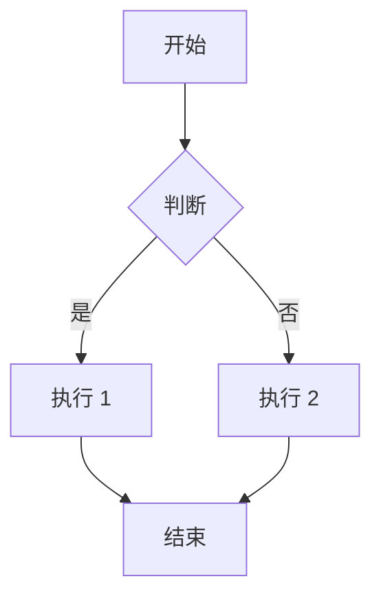
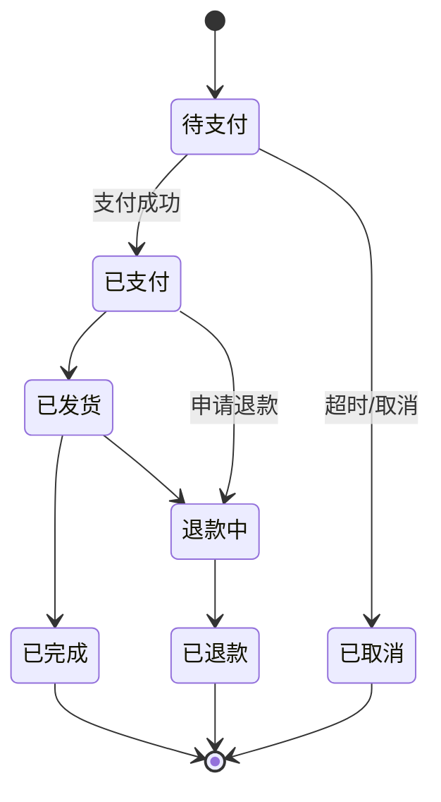
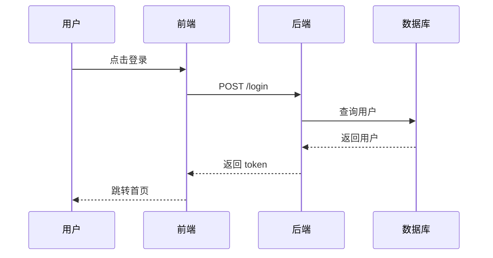
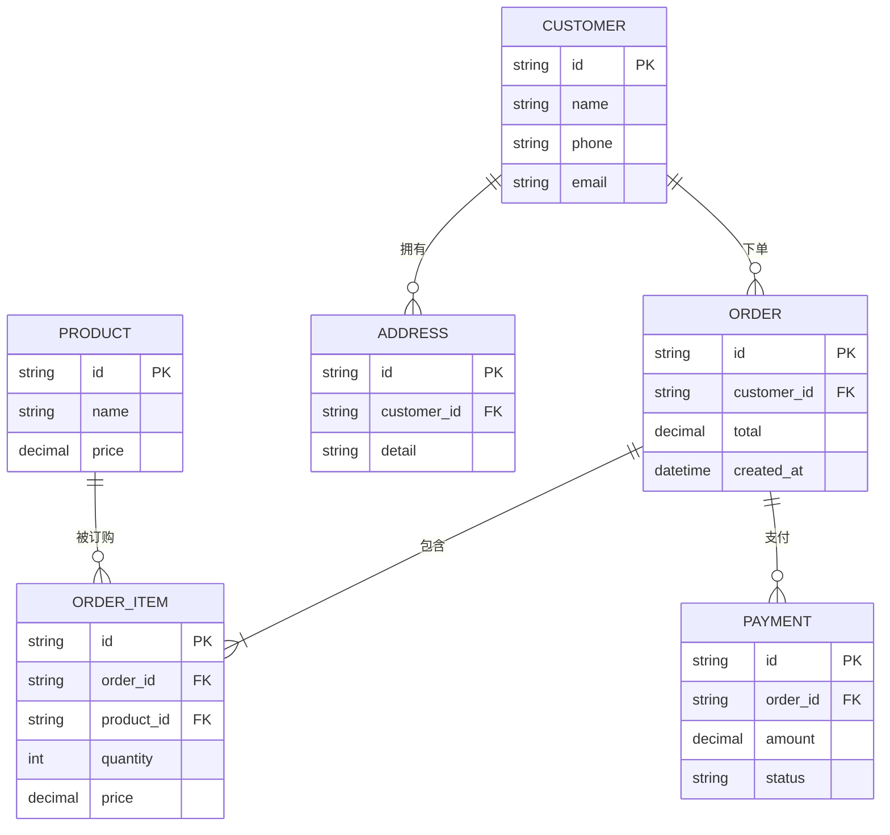
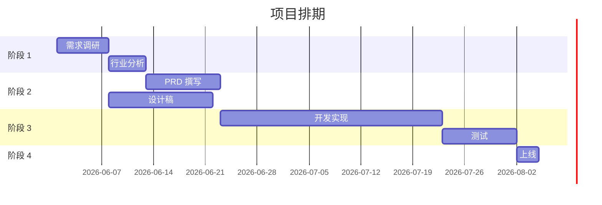
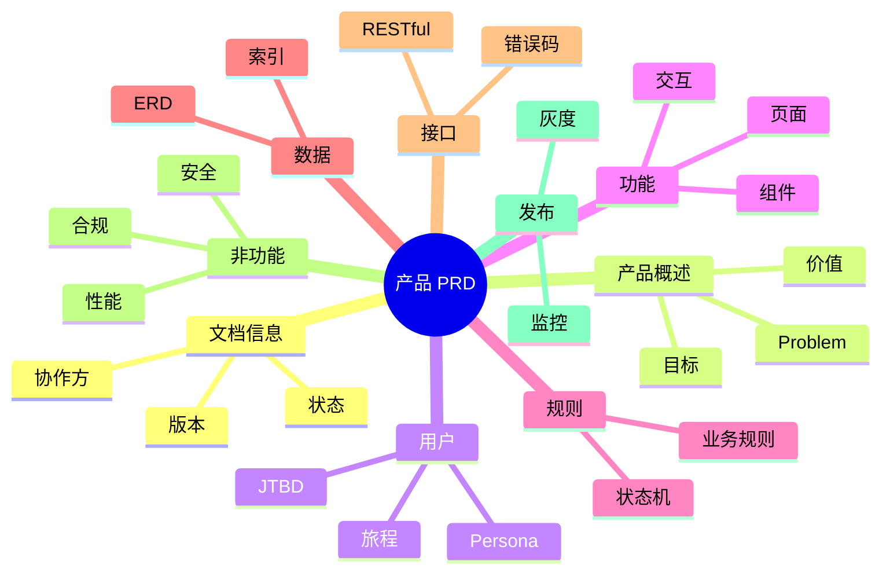
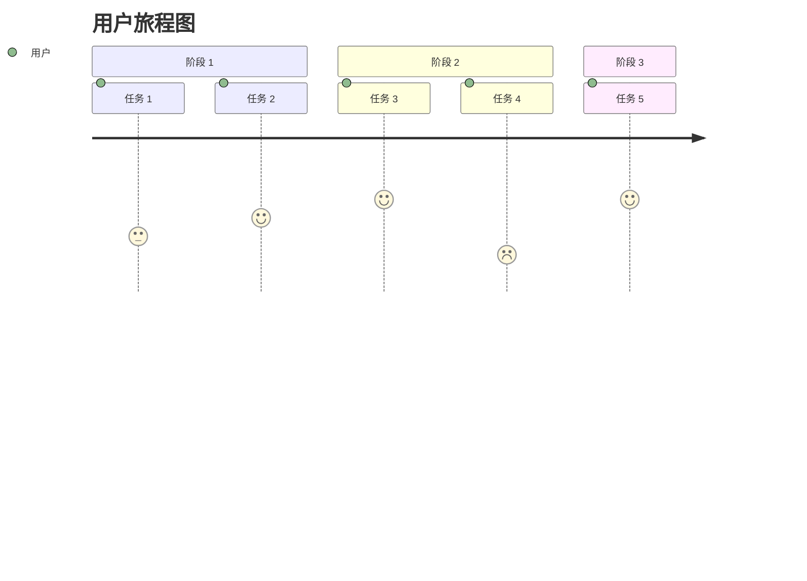
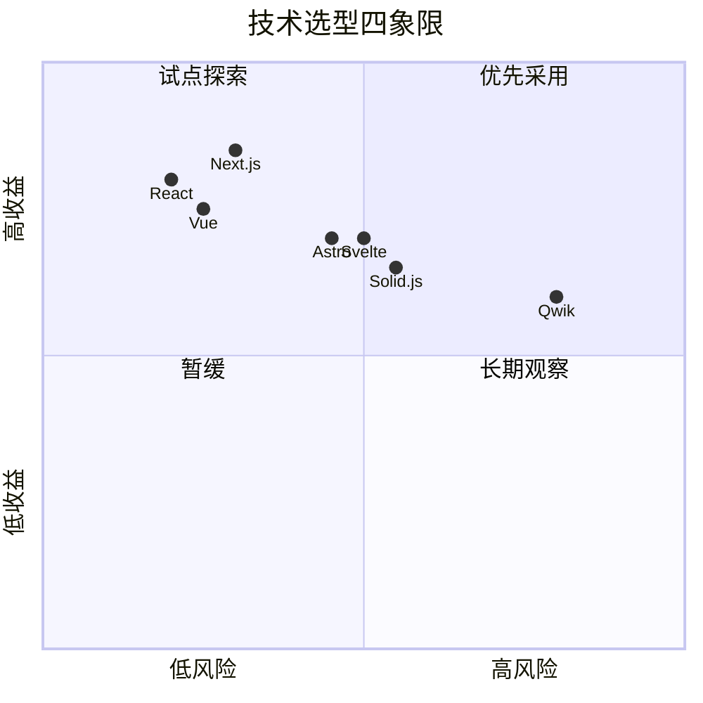
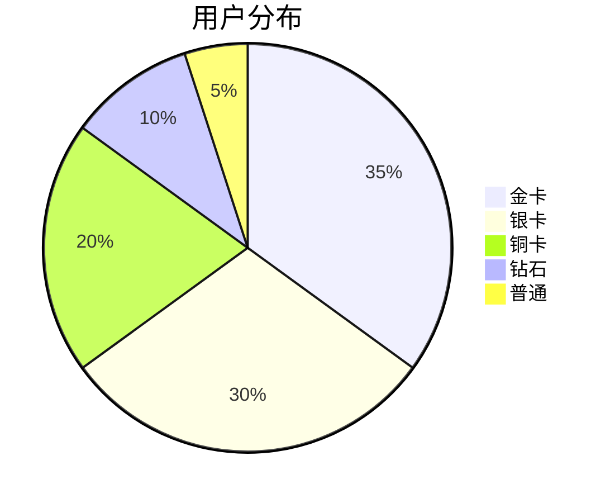
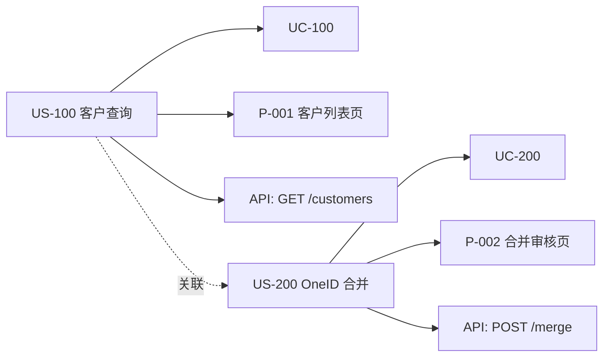

# 视觉化分析模板集（参考工具）

> 📖 **使用说明**：本文档是**集中式的视觉化模板参考**，供 openPRD 各 subagent 在生成文档时**引用**。
> 各模板文档（如 06-PRD、14-行业分析报告、02-项目整体说明）**不需要重复定义这些工具**，直接链接到本文档即可。
>
> **Why 集中式**：避免模板碎片化，确保所有分析工具**风格统一、命名一致**。

---

> 📌 **一页纸摘要**:
> 1. 看完这页能回答:怎么画波特五力?SWOT?Mermaid 怎么写?视觉化模板有哪些?
> 2. 文档定位:参考工具集,集中式视觉化模板
> 3. 核心动作:12 大分析工具 + Mermaid 模板库
> 4. 何时使用:任何 subagent 需要画图时直接引用
> 5. 不要用于:具体分析内容(各模板自身)
>
> 🔗 **关键引用**: [`reference/08-mermaid-syntax.md`](../reference/08-mermaid-syntax.md) (Mermaid 语法) · [`reference/12-value-matrix.md`](../reference/12-value-matrix.md) (模板价值) · [`reference/13-quality-selfcheck.md`](../reference/13-quality-selfcheck.md) (模板自检)

---

## 目录

1. [波特五力分析](#1-波特五力分析)
2. [PEST 分析](#2-pest-分析)
3. [SWOT 矩阵](#3-swot-矩阵)
4. [价值主张画布](#4-价值主张画布)
5. [商业模式画布](#5-商业模式画布)
6. [技术成熟度曲线](#6-技术成熟度曲线-gartner-hype-cycle)
7. [用户故事地图](#7-用户故事地图)
8. [服务蓝图](#8-服务蓝图)
9. [RACI 矩阵](#9-raci-矩阵)
10. [Mermaid 图模板库](#10-mermaid-图模板库)
11. [Kano 模型](#11-kano-模型)
12. [AARRR 漏斗](#12-aarrr-漏斗)

---

## 1. 波特五力分析

> 📌 **适用**：14-行业分析报告 / 02-项目整体说明
> 🎯 **目的**：分析行业竞争结构、识别机会与威胁

### 模板

```markdown
## 波特五力分析

### 1.1 行业现有竞争强度（高/中/低）
- 竞争对手数量：[X 家]
- 市场集中度：[CR3 = X%]
- 增长率：[X% / 年]
- 差异化程度：[高/中/低]
- 退出壁垒：[高/中/低]
- **综合判断**：🔴 高 / 🟡 中 / 🟢 低

### 1.2 潜在进入者威胁
- 进入壁垒（资金/技术/牌照/品牌）：[高/中/低]
- 政策门槛：[高/中/低]
- 规模经济效应：[有/无]
- 预期回报：[高/中/低]
- **综合判断**：🔴 高 / 🟡 中 / 🟢 低

### 1.3 替代品威胁
- 替代品 1：[名称] + [替代率] + [价格优势]
- 替代品 2：[名称] + [替代率] + [价格优势]
- 用户转换成本：[高/中/低]
- **综合判断**：🔴 高 / 🟡 中 / 🟢 低

### 1.4 供应商议价能力
- 供应商数量：[多/中/少]
- 转换成本：[高/中/低]
- 差异化程度：[高/中/低]
- 前向整合能力：[强/弱]
- **综合判断**：🔴 强 / 🟡 中 / 🟢 弱

### 1.5 购买者议价能力
- 客户数量：[多/中/少]
- 客户集中度：[CR3 = X%]
- 产品差异化：[高/中/低]
- 价格敏感度：[高/中/低]
- 后向整合能力：[强/弱]
- **综合判断**：🔴 强 / 🟡 中 / 🟢 弱

### 1.6 五力综合结论

| 力量 | 强度 | 对本项目的影响 |
|------|------|----------------|
| 现有竞争 | 🔴/🟡/🟢 | [影响] |
| 潜在进入 | 🔴/🟡/🟢 | [影响] |
| 替代品 | 🔴/🟡/🟢 | [影响] |
| 供应商 | 🔴/🟡/🟢 | [影响] |
| 购买者 | 🔴/🟡/🟢 | [影响] |
```

---

## 2. PEST 分析

> 📌 **适用**：14-行业分析报告（宏观环境）
> 🎯 **目的**：分析政治/经济/社会/技术 4 大宏观因素

### 模板

```markdown
## PEST 宏观环境分析

### 2.1 政治（Political）
- 政策导向：[相关政策 1 + 影响]
- 法规约束：[相关法规 1 + 影响]
- 政府投入：[财政/项目/补贴]
- 国际关系：[国际贸易/数据跨境]
- **关键机会**：[...]
- **关键风险**：[...]

### 2.2 经济（Economic）
- GDP 增长率：[X%]
- 行业增长率：[X% / 年]
- 通胀/利率：[X%]
- 汇率：[人民币 / 美元]
- 消费能力：[人均可支配收入]
- 资本市场：[PE/VC 活跃度]
- **关键机会**：[...]
- **关键风险**：[...]

### 2.3 社会（Social）
- 人口结构：[老龄化 / Z 世代 / 城镇化]
- 消费习惯：[线上 / 线下 / 移动 / 直播]
- 价值观变化：[隐私意识 / 体验至上 / 性价比]
- 教育水平：[高等教育普及率]
- 文化特征：[本地化 / 国际化]
- **关键机会**：[...]
- **关键风险**：[...]

### 2.4 技术（Technological）
- 颠覆性技术：[AI / 区块链 / IoT / 5G / 量子]
- 研发投入：[R&D / 营收]
- 专利布局：[头部企业专利数]
- 技术成熟度：[技术成熟度曲线位置]
- **关键机会**：[...]
- **关键风险**：[...]

### 2.5 PEST 综合结论

| 维度 | 关键驱动 | 时间窗口 | 对本项目的影响 |
|------|----------|----------|----------------|
| P | [...] | [...] | [...] |
| E | [...] | [...] | [...] |
| S | [...] | [...] | [...] |
| T | [...] | [...] | [...] |
```

---

## 3. SWOT 矩阵

> 📌 **适用**：02-项目整体说明 / 06-PRD 价值主张 / 14-竞品分析
> 🎯 **目的**：综合分析内外部优劣势

### 模板

```markdown
## SWOT 矩阵

| | **机会（O）** | **威胁（T）** |
|---|---|---|
| | O1: [...] | T1: [...] |
| | O2: [...] | T2: [...] |
| | O3: [...] | T3: [...] |
| **优势（S）** | **SO 战略（增长）** | **ST 战略（防御）** |
| S1: [...] | [用优势抢机会] | [用优势规避威胁] |
| S2: [...] | [...] | [...] |
| S3: [...] | [...] | [...] |
| **劣势（W）** | **WO 战略（转型）** | **WT 战略（回避）** |
| W1: [...] | [补短板抢机会] | [回避劣势 + 威胁] |
| W2: [...] | [...] | [...] |
| W3: [...] | [...] | [...] |

### 战略选择

| 战略类型 | 优先级 | 具体动作 |
|----------|--------|----------|
| **SO 增长** | P0 | [...] |
| **ST 防御** | P1 | [...] |
| **WO 转型** | P1 | [...] |
| **WT 回避** | P2 | [...] |
```

---

## 4. 价值主张画布

> 📌 **适用**：06-PRD 第 2 章（产品概述）
> 🎯 **目的**：明确产品为客户创造的价值

### 模板

```markdown
## 价值主张画布（Value Proposition Canvas）

### 客户面（Customer Profile）

#### 客户任务（Customer Jobs）
- **功能性任务**：[用户要完成的具体事情]
- **社会性任务**：[用户在他人面前的形象/地位]
- **情感性任务**：[用户希望获得的感受]

#### 痛点（Pains）
- **重要性极高**：[必须解决的痛点]
- **重要性高**：[严重影响体验的痛点]
- **一般**：[小痛点]

#### 期望收益（Gains）
- **必需收益**：[不做不行的收益]
- **期望收益**：[做了会更好的收益]
- **惊喜收益**：[超出预期的收益]

### 产品面（Value Map）

#### 产品和服务（Products & Services）
- **核心产品**：[主要功能]
- **配套服务**：[支持/培训/咨询]

#### 痛点缓解（Pain Relievers）
- **对应极高痛点**：[如何解决]
- **对应高痛点**：[如何解决]

#### 收益创造（Gain Creators）
- **对应必需收益**：[如何实现]
- **对应期望收益**：[如何实现]
- **对应惊喜收益**：[如何实现]

### 契合度（Fit）

| 维度 | 契合度 | 说明 |
|------|--------|------|
| 痛点缓解 | ⭐⭐⭐⭐⭐ / ⭐⭐⭐ / ⭐⭐ / ⭐ | [...] |
| 收益创造 | ⭐⭐⭐⭐⭐ / ⭐⭐⭐ / ⭐⭐ / ⭐ | [...] |
| **综合** | [...] | 是否值得做？|
```

---

## 5. 商业模式画布

> 📌 **适用**：02-项目整体说明
> 🎯 **目的**：描述商业模式的 9 大要素

### 模板

```markdown
## 商业模式画布（Business Model Canvas）

### 5.1 客户细分（CS - Customer Segments）
- CS1: [主要客户群]
- CS2: [次要客户群]
- CS3: [潜在客户群]

### 5.2 价值主张（VP - Value Propositions）
- VP1: [核心价值]
- VP2: [辅助价值]

### 5.3 渠道（CH - Channels）
- 触达：如何让客户知道我们
- 评估：如何让客户评估我们
- 购买：如何让客户购买
- 交付：如何交付价值
- 售后：如何提供售后

### 5.4 客户关系（CR - Customer Relationships）
- 自助服务
- 自动化服务
- 社区
- 1v1 客户经理
- VIP 服务

### 5.5 收入来源（RS - Revenue Streams）
- RS1: [收入来源 1 + 价格模型]
- RS2: [收入来源 2 + 价格模型]
- RS3: [收入来源 3 + 价格模型]

### 5.6 关键资源（KR - Key Resources）
- 物理资源：[服务器/设备]
- 知识产权：[专利/数据/算法]
- 人力资源：[团队/顾问]
- 财务资源：[资金/融资]

### 5.7 关键活动（KA - Key Activities）
- KA1: [核心活动 1]
- KA2: [核心活动 2]
- KA3: [核心活动 3]

### 5.8 重要伙伴（KP - Key Partnerships）
- KP1: [战略合作伙伴]
- KP2: [供应商]
- KP3: [渠道伙伴]

### 5.9 成本结构（CS - Cost Structure）
- 固定成本：[人力/场地/设备]
- 变动成本：[云服务/营销/获客]
- 规模经济：[单位成本随规模下降]
- 范围经济：[多业务共享资源]
```

---

## 6. 技术成熟度曲线 (Gartner Hype Cycle)

> 📌 **适用**：14-技术趋势 / 02-项目整体说明
> 🎯 **目的**：判断技术发展阶段，规避早期陷阱

### 模板

```markdown
## 技术成熟度曲线

### 6.1 关键判断维度
- **触发期**（Innovation Trigger）：媒体过度关注，概念大于实际
- **期望膨胀期**（Peak of Inflated Expectations）：早期成功故事，掩盖大量失败
- **幻灭低谷**（Trough of Disillusionment）：实施失败，舆论转向负面
- **复苏爬升期**（Slope of Enlightenment）：实际应用浮现，第二/三代产品成熟
- **生产成熟期**（Plateau of Productivity）：主流采用，市场稳定

### 6.2 本项目涉及技术

| 技术 | 当前阶段 | 距成熟期 | 选型建议 |
|------|----------|----------|----------|
| [技术 1] | 触发期 / 膨胀期 / 幻灭期 / 爬升期 / 成熟期 | [X 年] | [建议] |
| [技术 2] | [...] | [...] | [...] |
| [技术 3] | [...] | [...] | [...] |

### 6.3 选型原则
- **核心业务**：优先成熟期（避免风险）
- **差异化能力**：可选爬升期（建立壁垒）
- **试点项目**：可尝试膨胀期（验证能力）
- **避免**：幻灭低谷（投入大、收益少）
```

---

## 7. 用户故事地图

> 📌 **适用**：06-PRD 第 3 章（用户与需求）/ 06b-用户与需求.md
> 🎯 **目的**：把 US 按"用户活动的时间线"组织

### 模板

```markdown
## 用户故事地图

```
时间线 →     阶段 1     阶段 2     阶段 3     阶段 4     阶段 5
            ↓          ↓          ↓          ↓          ↓
[主线]      [...]      [...]      [...]      [...]      [...]
            ↑          ↑          ↑          ↑          ↑
[支线 1]    [...]      [...]      [...]
            ↑          ↑          ↑
[支线 2]    [...]      [...]      [...]
```

| 时间线 | 主线（必做） | 支线 1 | 支线 2 |
|--------|------------|--------|--------|
| 阶段 1 | [...] | [...] | [...] |
| 阶段 2 | [...] | [...] | [...] |
| 阶段 3 | [...] | [...] | [...] |
| 阶段 4 | [...] | [...] | — |
| 阶段 5 | [...] | [...] | — |

**MVP 范围**：主线 + 支线 1
**二期范围**：支线 2
**三期范围**：[未来扩展]
```

---

## 8. 服务蓝图

> 📌 **适用**：06-PRD 第 3 章（用户旅程）/ 06b-用户与需求.md
> 🎯 **目的**：可视化端到端服务流程

### 模板

```markdown
## 服务蓝图（Service Blueprint）

### 8.1 服务流程图

```
[用户行为]      [前台互动]      [后台处理]      [支持流程]
[可见层]        [可见层]        [不可见层]      [不可见层]

1. 用户访问     → 1.1 展示首页   → 1.2 后台认证   → 1.3 IT 运维
2. 用户搜索     → 2.1 搜索框     → 2.2 调用搜索   → 2.4 数据团队
3. 用户下单     → 3.1 结算页     → 3.2 订单创建   → 3.3 财务系统
4. 用户支付     → 4.1 收银台     → 4.2 支付调用   → 4.3 支付对账
5. 用户收到     → 5.1 物流查询   → 5.2 物流 API   → 5.4 客服团队
```

### 8.2 分层说明

| 层级 | 描述 | 触点 |
|------|------|------|
| **用户行为** | 用户做了什么 | UI/物理 |
| **前台互动** | 用户看到/接触的服务 | UI/客服 |
| **后台处理** | 服务人员/系统做什么 | 后端系统 |
| **支持流程** | 内部支撑流程 | 内部团队 |

### 8.3 关键触点

- 触点 1：[名称] + [用户期望] + [实际提供] + [差距]
- 触点 2：[...] + [...] + [...] + [...]
- 触点 3：[...] + [...] + [...] + [...]
```

---

## 9. RACI 矩阵

> 📌 **适用**：02-项目整体说明 / 05-任务拆分
> 🎯 **目的**：明确角色与职责分工

### 模板

```markdown
## RACI 矩阵

**RACI 定义**：
- **R（Responsible）执行**：实际完成任务
- **A（Accountable）问责**：最终负责（每个任务只能 1 个 A）
- **C（Consulted）咨询**：提供意见（双向沟通）
- **I（Informed）知会**：被通知结果（单向沟通）

| 任务 / 角色 | PM | Tech Lead | Designer | QA | 业务 | 客服 | 法务 |
|------------|----|-----------|---------|----|----|------|------|
| 需求调研 | A | C | C | I | R | I | I |
| 方案设计 | A | R | R | C | C | I | I |
| 开发实现 | I | A | C | I | I | I | I |
| 测试验收 | A | C | I | R | C | I | I |
| 上线发布 | R | A | I | C | I | I | C |
| 客服培训 | C | I | I | I | A | R | I |
| 合规审核 | C | C | I | I | I | I | A/R |
```

---

## 10. Mermaid 图模板库

> 📌 **适用**：所有文档
> 🎯 **目的**：用 Mermaid 提供可视化

### 10.1 流程图（Flowchart）



### 10.2 状态机（State Diagram）



### 10.3 时序图（Sequence Diagram）



### 10.4 ER 图（Entity Relationship）



### 10.5 甘特图（Gantt）



### 10.6 思维导图（Mindmap）



### 10.7 用户旅程图（Journey Map）



### 10.8 四象限图（Quadrant）



### 10.9 饼图（Pie）



### 10.10 需求跟踪（Requirement Graph）



---

## 11. Kano 模型

> 📌 **适用**：02-项目整体说明（功能优先级）/ 06-PRD
> 🎯 **目的**：区分必备/期望/兴奋/无差异/反向 5 类需求

### 模板

```markdown
## Kano 模型分析

| Kano 类别 | 定义 | 用户态度 | 设计策略 |
|-----------|------|----------|----------|
| **必备型（M）** | 没有会严重不满，有了不会更满意 | 理所当然 | 必须做到 100% |
| **期望型（O）** | 有了会更满意，没有会不满 | 越多越好 | 持续优化 |
| **兴奋型（A）** | 没有不会不满，有了会很惊喜 | 锦上添花 | 创新突破 |
| **无差异型（I）** | 有没有都无所谓 | 漠不关心 | 可不做 |
| **反向型（R）** | 有了反而不满意 | 反感 | 避免 |

### 本项目功能分类

| 功能 | Kano 类别 | 优先级 | 设计策略 |
|------|-----------|--------|----------|
| 客户列表查询 | M（必备） | P0 | 必须做到 100% |
| 智能推荐客群 | O（期望）| P1 | 持续优化 |
| AI 自动文案 | A（兴奋）| P1 | 创新突破 |
| 多语言支持 | I（无差异）| P3 | 可延后 |
| ... | ... | ... | ... |
```

---

## 12. AARRR 漏斗

> 📌 **适用**：06-PRD 第 2 章（目标与成功）
> 🎯 **目的**：拆解增长指标

### 模板

```markdown
## AARRR 增长漏斗

```mermaid
funnel
    Acquisition  ->|100%| Activation
    Activation   ->|40%| Retention
    Retention    ->|60%| Revenue
    Revenue      ->|30%| Referral
    Referral     ->|20%| Acquisition
```

| 阶段 | 指标 | 公式 | 基准 | 3 月目标 | 6 月目标 | 12 月目标 |
|------|------|------|------|----------|----------|-----------|
| **A 获取** | 日新增用户 | 新增注册数 / 日 | X | X × 2 | X × 5 | X × 10 |
| **A 激活** | 7 日激活率 | 7 日内有 X 行为 / 7 日新增 | X% | X% + 10 | X% + 20 | X% + 30 |
| **R 留存** | 30 日留存率 | 30 日后仍活跃 / 30 日新增 | X% | X% + 10 | X% + 20 | X% + 30 |
| **R 收入** | 月活付费率 | 月付费用户 / 月活 | X% | X% + 5 | X% + 10 | X% + 15 |
| **R 推荐** | 邀请转化率 | 通过邀请注册 / 总邀请 | X% | X% + 3 | X% + 5 | X% + 10 |
```

---

## 📋 使用指南

### 引用方式

在模板中需要时，**直接引用本文档**：

```markdown
> 📖 **参考工具**：见 [00-visualization-templates.md](./00-visualization-templates.md) 第 X 节 [波特五力分析]
```

### 选择标准

| 工具 | 适用场景 | 必用文档 |
|------|----------|----------|
| 波特五力 | 行业分析 | 14-行业分析报告 |
| PEST | 宏观环境 | 14-行业分析报告 |
| SWOT | 优劣势 | 02-项目整体说明、06-PRD |
| 价值主张画布 | 产品价值 | 06-PRD 第 2 章 |
| 商业模式画布 | 商业模式 | 02-项目整体说明 |
| 技术成熟度曲线 | 技术选型 | 14-技术趋势 |
| 用户故事地图 | US 组织 | 06b-用户与需求 |
| 服务蓝图 | 端到端流程 | 06b-用户与需求 |
| RACI | 角色职责 | 02-项目整体说明、05-任务拆分 |
| Mermaid | 所有可视化 | 所有 |
| Kano | 功能优先级 | 02-项目整体说明、06-PRD |
| AARRR | 增长指标 | 06-PRD 第 2 章 |

### 输出要求

每个 subagent 在生成文档时：
1. 检查**是否需要**这些工具
2. 如需要，**优先引用**本文档（不重复定义）
3. 在文档中**标注引用链接**（便于用户跳转）
4. 避免在多个模板中**重复定义**同一工具

---

*本文档由**产品经理**维护，新增工具时遵循"集中定义、按需引用"原则。*


## 摘要(降级输出,200 字内)

> 模板定位摘要(全受众可见)。完整定义见下方各章。
> 模板定位:模板

**模板说明**:`视觉化分析模板集（参考工具）`

**关键数字/对象**:见完整版

**完整版见**:`00-visualization-templates.md`(主受众可访问)
