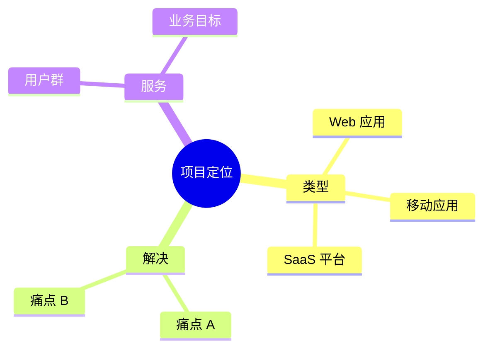

# [项目名称]

| 版本 | 日期 | 作者 | 说明 |
|------|------|------|------|
| 1.0 | YYYY-MM-DD | [Your Name] | 初始版本 |

---

> 📖 **本文件说明**：本文件是项目的入口文档，提供项目导航、文档索引、快速开始指引。
>
> 📌 **一页纸摘要**:
> 1. 看完这页能回答:项目是啥?从哪个文档开始?角色对应哪个文档?
> 2. 文档定位:项目级入口,所有 33 个文档的总索引
> 3. 核心动作:新成员按 §3 快速开始上手,按 §4 文档索引跳转
> 4. 何时使用:加入项目第一天 / 找某个文档不知道放哪时
> 5. 不要用于:具体功能(→06)、API(→03)
>
> 🔗 **关键引用**: `reference/12-value-matrix.md` (文档价值矩阵) · [`reference/13-quality-selfcheck.md`](../reference/13-quality-selfcheck.md) (质量自检) · `00-INDEX.md` (全文档索引)

---

## 0. 填写指南

### 0.0 本文档价值

> **回答的核心问题**：从哪开始？先看什么？角色怎么读？
>
> **不回答什么**：具体功能设计（→06）、API（→03）
>
> **价值判定**：新成员按 README 读完即可开始工作
>
> **所属阶段**：管理（项目入口）

### 0.1 文档用途

| 用途 | 说明 |
|------|------|
| 项目导航 | 提供项目整体介绍和快速入口 |
| 文档索引 | 列出所有相关文档的链接 |
| 快速开始 | 帮助新成员快速上手项目 |
| 状态报告 | 提供项目当前状态和进度 |

### 0.2 填写原则

| 原则 | 说明 |
|------|------|
| 简洁 | 入口文档不应过长 |
| 链接 | 通过链接跳转到详细文档 |
| 更新 | 文档变更时同步更新 |
| 导航 | 优先提供导航而非详细内容 |

---

## 1. 项目简介

⭐ **关键决策**：
- **项目一句话定义**：业务做什么（不要写"基于 XX 技术构建..."）
- **目标用户 3 类内**：避免"所有需要 X 的人"
- **核心价值 3 条内**：用动词开头（"提升 X 效率"）
- **避免技术细节**：README 给"非技术读者"看，技术栈单独章节

### 1.1 一句话介绍



> 📝 **如何填写**：用一句话概括这个项目。

```
[项目名称] 是一个 [项目类型]，用于 [解决什么问题]，帮助 [目标用户] [实现什么价值]。
```

### 1.2 项目背景

> 📝 **如何填写**：简要说明项目背景，不超过 3 段。

| 项目 | 说明 |
|------|------|
| 业务背景 | [为什么做这个项目] |
| 现存问题 | [当前痛点是什么] |
| 驱动因素 | [什么推动了这个项目] |

### 1.3 核心功能

| 功能 | 说明 | 优先级 |
|------|------|--------|
| [功能1] | [简述] | P0 |
| [功能2] | [简述] | P0 |
| [功能3] | [简述] | P1 |

---

## 2. 技术栈

### 2.1 前端技术栈

| 技术 | 版本 | 用途 |
|------|------|------|
| [框架] | [版本] | UI 框架 |
| [组件库] | [版本] | 组件库 |
| [状态管理] | [版本] | 状态管理 |
| [构建工具] | [版本] | 构建 |

### 2.2 后端技术栈

> 📝 **本节仅在完整模式下填写**

| 技术 | 版本 | 用途 |
|------|------|------|
| [语言] | [版本] | 开发语言 |
| [框架] | [版本] | Web 框架 |
| [数据库] | [版本] | 数据存储 |
| [缓存] | [版本] | 缓存 |

### 2.3 部署技术栈

| 技术 | 版本 | 用途 |
|------|------|------|
| [容器] | [版本] | 容器化 |
| [编排] | [版本] | 容器编排 |
| [CI/CD] | [版本] | 持续集成 |

---

## 3. 快速开始

### 3.1 环境要求

| 环境 | 版本 | 说明 |
|------|------|------|
| Node.js | 18+ | 前端开发 |
| Java | 17+ | 后端开发（如有） |
| MySQL | 8.0+ | 数据库（如有） |
| Redis | 6.x+ | 缓存（如有） |

### 3.2 安装步骤

```bash
# 1. 克隆代码
git clone [仓库地址]

# 2. 进入目录
cd [项目目录]

# 3. 安装依赖
# 前端
cd web && npm install
# 后端（如有）
cd server && mvn install

# 4. 启动开发环境
# 前端
npm run dev
# 后端（如有）
mvn spring-boot:run
```

### 3.3 访问地址

| 环境 | 地址 | 说明 |
|------|------|------|
| 开发环境 | http://localhost:3000 | 本地开发 |
| 测试环境 | https://test.example.com | 测试联调 |
| 生产环境 | https://www.example.com | 正式环境 |

---

## 4. 文档索引

### 4.1 项目文档

| 文档 | 说明 | 链接 |
|------|------|------|
| 项目整体说明 | 背景、架构、目标 | [02-项目整体说明.md](./02-项目整体说明.md) |
| 产品需求文档 | 功能需求、验收标准 | [06-产品需求文档.md](./06-产品需求文档.md) |
| 接口文档 | API 定义 | [03-接口文档.md](./03-接口文档.md) |
| 任务拆分与交付 | 任务分解、测试、部署 | [05-任务拆分与交付.md](./05-任务拆分与交付.md) |

### 4.2 前端文档

| 文档 | 说明 | 链接 |
|------|------|------|
| 前端开发指南 | 前端规范、组件使用 | [04-前端开发指南.md](./04-前端开发指南.md) |
| 前端交互文档 | 组件交互、页面流转 | [10-前端交互文档.md](./10-前端交互文档.md) |
| Mock 数据文档 | Mock 数据结构 | [11-Mock数据文档.md](./11-Mock数据文档.md) |
| FigmaMake 提示词 | 设计还原 | [FigmaMake-Prompt.md](./FigmaMake-Prompt.md) |

### 4.3 后端文档

> 📝 **仅在完整模式下显示**

| 文档 | 说明 | 链接 |
|------|------|------|
| 内部交互链路 | 前后端交互 | [08-内部交互链路.md](./08-内部交互链路.md) |
| 后端开发指南 | 后端规范、技术栈 | [09-后端开发指南.md](./09-后端开发指南.md) |
| 数据库设计 | 表结构、索引 | [12-数据库设计.md](./12-数据库设计.md) |
| 架构设计 | 系统架构 | [13-架构设计.md](./13-架构设计.md) |

### 4.4 测试与质量

| 文档 | 说明 | 链接 |
|------|------|------|
| 测试用例 | 测试用例 | [07-测试用例.md](./07-测试用例.md) |
| 用户调研报告 | 用户研究 | [用户调研报告.md](./用户调研报告.md) |
| 行业分析报告 | 行业分析 | [14-行业分析报告.md](./14-行业分析报告.md) |

---

## 5. 项目状态

### 5.1 当前进度

| 阶段 | 状态 | 完成时间 |
|------|------|----------|
| 需求调研 | ☐ 进行中 / ✅ 已完成 | YYYY-MM-DD |
| 方案设计 | ☐ 进行中 / ✅ 已完成 | YYYY-MM-DD |
| 开发实现 | ☐ 进行中 / ✅ 已完成 | YYYY-MM-DD |
| 测试验收 | ☐ 进行中 / ✅ 已完成 | YYYY-MM-DD |
| 部署上线 | ☐ 进行中 / ✅ 已完成 | YYYY-MM-DD |

### 5.2 版本规划

| 版本 | 计划时间 | 主要功能 |
|------|----------|----------|
| V1.0 | YYYY-MM-DD | 核心功能 |
| V2.0 | YYYY-MM-DD | [扩展功能] |
| V3.0 | YYYY-MM-DD | [高级功能] |

---

## 6. 团队成员

| 角色 | 姓名 | 职责 | 联系方式 |
|------|------|------|----------|
| 产品经理 | [姓名] | 需求管理 | [@邮箱] |
| 前端开发 | [姓名] | 前端开发 | [@邮箱] |
| 后端开发 | [姓名] | 后端开发 | [@邮箱] |
| 测试工程师 | [姓名] | 测试 | [@邮箱] |
| 设计师 | [姓名] | UI/UX | [@邮箱] |

---

## 7. 贡献指南

### 7.1 开发流程

```
1. 创建任务 → 2. 开发实现 → 3. 自测 → 4. Code Review → 5. 合并 → 6. 部署
```

### 7.2 提交规范

| 类型 | 说明 | 示例 |
|------|------|------|
| feat | 新功能 | feat: 添加用户登录 |
| fix | 修复 | fix: 修复分页bug |
| docs | 文档 | docs: 更新README |
| style | 格式 | style: 格式化代码 |
| refactor | 重构 | refactor: 重构用户服务 |
| test | 测试 | test: 添加单元测试 |

### 7.3 分支规范

| 分支 | 用途 |
|------|------|
| main | 主分支（生产） |
| develop | 开发分支 |
| feature/* | 功能分支 |
| hotfix/* | 紧急修复 |

---

## 8. 常见问题

### 8.1 如何获取帮助？

| 渠道 | 说明 |
|------|------|
| 项目文档 | 先查阅本文档和相关文档 |
| 团队沟通 | [Slack/钉钉/企业微信群] |
| Issue | [GitHub Issue 地址] |

### 8.2 如何反馈 Bug？

1. 在 [Issue 平台] 创建 Issue
2. 描述：复现步骤、预期结果、实际结果、截图
3. 标签：bug、优先级

### 8.3 如何提交功能建议？

1. 在 [Issue 平台] 创建 Feature Request
2. 描述：使用场景、期望方案、替代方案
3. 标签：enhancement

---

## 9. 许可证

```
[项目许可证信息]
Copyright © [年份] [公司名称]
```

---

## 10. 变更记录

| 版本 | 日期 | 变更内容 | 作者 |
|------|------|----------|------|
| 1.0 | YYYY-MM-DD | 初始版本 | [Your Name] |
| 1.1 | YYYY-MM-DD | [变更说明] | [Your Name] |

---

## 11. README 检查清单

> ✅ **完成后逐项检查，确保 README 有效**

| 检查项 | 状态 |
|--------|------|
| 一句话介绍清晰 | ☐ |
| 技术栈版本准确 | ☐ |
| 快速开始可在干净环境跑通 | ☐ |
| 所有文档链接有效 | ☐ |
| 项目状态及时更新 | ☐ |
| 团队成员信息完整 | ☐ |
| 贡献指南可执行 | ☐ |
| 常见问题覆盖核心疑问 | ☐ |

---

*本文档是项目入口，请保持简洁和导航性。*


## 摘要(降级输出,200 字内)

> 模板定位摘要(全受众可见)。完整定义见下方各章。
> 模板定位:0.0 本文档价值

**模板说明**:`[项目名称]`

**关键数字/对象**:见完整版

**完整版见**:`01-README.md`(主受众可访问)
