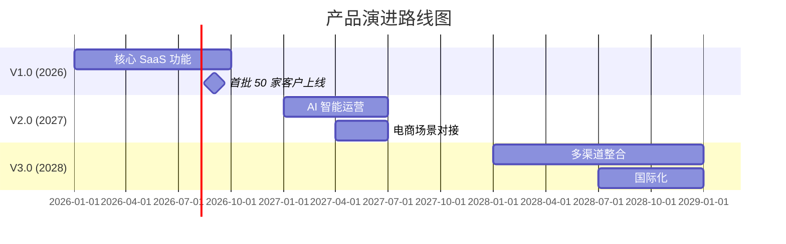
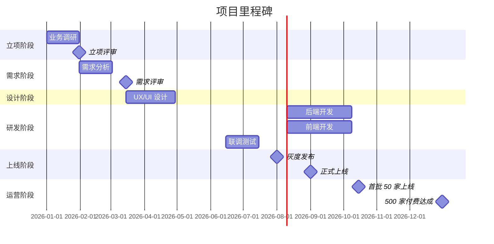
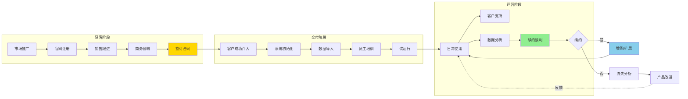
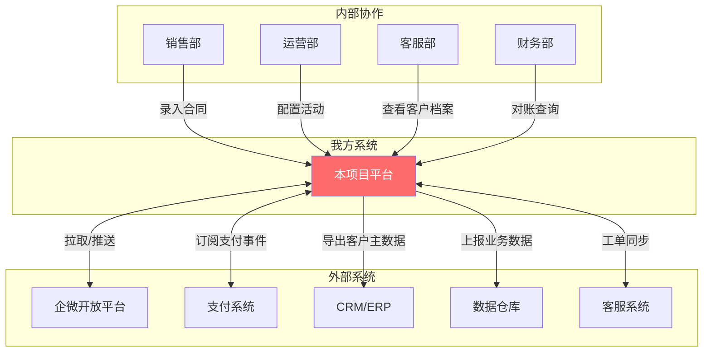
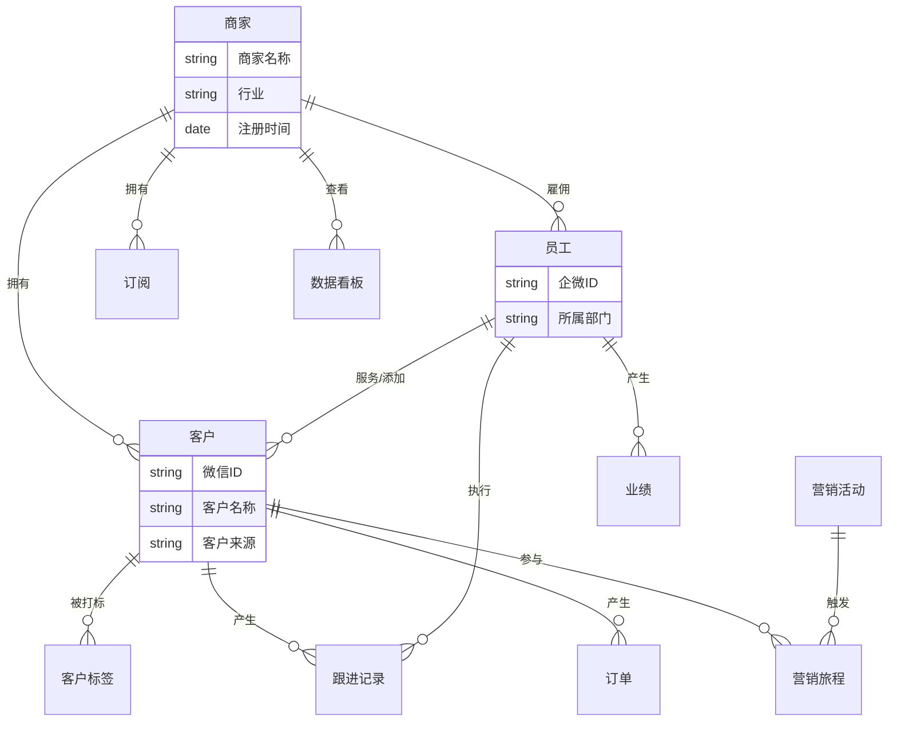
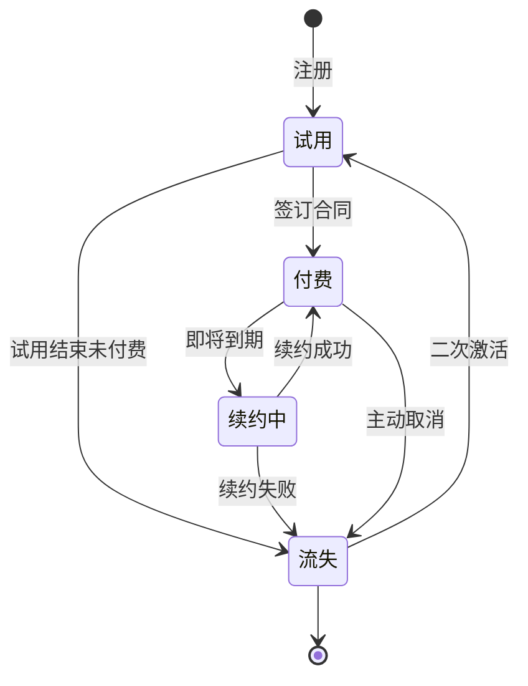
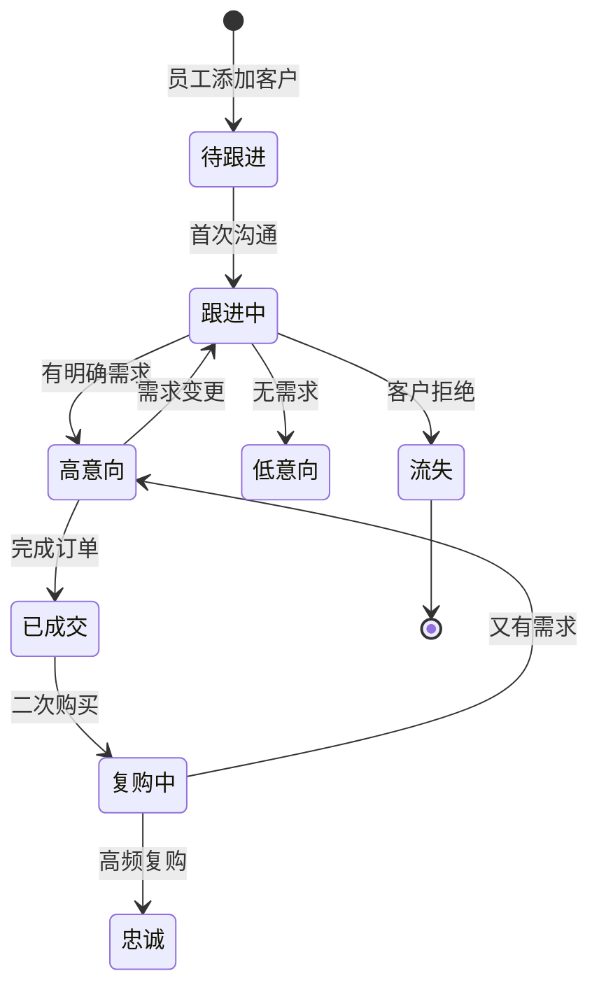
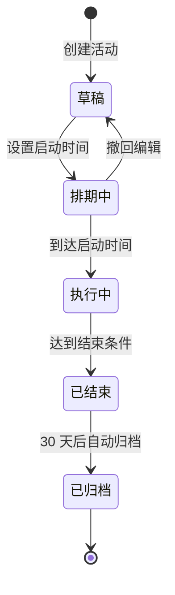

# [项目名称] - 项目整体说明

>  **文档定位**：本文档是项目的"商业计划书 + 路线图"，服务对象是**产品经理、业务方、决策者**，而非开发工程师。
>
>  **核心问题回答**：
> 1. 我们为什么要做这个项目？（Why）
> 2. 做成什么样算成功？（What）
> 3. 哪些做、哪些不做？（Scope）
> 4. 何时做、谁来做？（When / Who）
> 5. 风险在哪、怎么应对？（Risk）
>
>  **一页纸摘要**:
> 1. 看完这页能回答:Why/What/Scope/When-Who/Risk 5 个核心问题
> 2. 文档定位:设计级(产品级),商业计划书 + 路线图
> 3. 核心动作:11 大章节,业务核心流程 + 核心实体 + 设计原则 + 风险
> 4. 何时使用:项目立项 / 高管评审 / 跨部门对齐
> 5. 不要用于:API 契约(→03)、数据库设计(→12)、技术选型(→13)
>
>  **关键引用**: `reference/12-value-matrix.md` (文档价值矩阵) · [`reference/13-quality-selfcheck.md`](../reference/13-quality-selfcheck.md) (11 类 50 项自检) · [`reference/15-five-field-crosscheck.md`](../reference/15-five-field-crosscheck.md) (5字段必含项)
>
>  **配套文档**（技术细节请查阅）：
> - 接口契约 → 详见 `03-接口文档.md`
> - 数据库设计 → 详见 `12-数据库设计.md`
> - 架构与技术选型 → 详见 `13-架构设计.md`
> - 行业与竞品分析 → 详见 `14-行业分析报告.md`
> - 用户调研结论 → 详见 `用户调研报告.md`

---

## 0. 填写指南

### 0.0 本文档价值

> **回答的核心问题**：项目是什么？为谁？边界？干系人？里程碑？
>
> **不回答什么**：API 契约（→03）、数据库设计（→12）、技术选型（→13）
>
> **价值判定**：高管 5 分钟听懂项目范围，研发明确是否参与
>
> **所属阶段**：设计（产品级）

### 0.1 文档结构

| 章节 | 内容 | 主笔 |
|------|------|------|
| 1. 文档信息 | 版本、修订、评审 | PM |
| 2. 项目概述 | 一句话定位、背景、战略对齐 | PM |
| 3. 项目目标 | OKR + DOR + 指标体系 | PM |
| 4. 项目范围 | In Scope / Out of Scope / 未来 | PM |
| 5. 干系人与角色 | 团队 + RACI + 决策机制 | PM |
| 6. 关键里程碑 | 时间线 + 交付物 + 评审 | PM |
| 7. 业务核心流程 | 端到端 + 关键场景 + 跨域 | PM |
| 8. 业务核心实体 | 实体关系 + 实体说明 + 状态 | PM + 数据 |
| 9. 设计原则 | 体验/业务/合规/可扩展 | PM + 架构 |
| 10. 风险与依赖 | 业务/外部/资源 + 监控 | PM |
| 11. 验收检查清单 | 11 大类 50+ 项 | 全体 |

---

## 1. 文档信息

### 1.1 文档版本

| 项目 | 内容 |
|------|------|
| 文档名称 | [项目名称] - 项目整体说明 |
| 文档版本 | V1.0 |
| 密级 | 内部公开 / 部门受限 / 公司机密 |
| 归口部门 | [产品部 / 业务部 / XXX] |
| 当前状态 | 草稿 / 评审中 / 已发布 / 已归档 |

### 1.2 修订记录

| 版本 | 日期 | 修订人 | 修订内容 | 审核人 |
|------|------|--------|----------|--------|
| 0.1 | YYYY-MM-DD | 张三 | 初稿，完成章节 1-3 | - |
| 0.5 | YYYY-MM-DD | 张三 | 完成全部章节，提交评审 | 李四 |
| 1.0 | YYYY-MM-DD | 张三 | 根据评审意见修订，正式发布 | 李四、王五 |
| 1.1 | YYYY-MM-DD | 张三 | 范围调整：增加 XX 业务场景 | 李四 |

>  **填写示例**：
> - 初稿：内容未经评审，仅供内部讨论。
> - 正式版：经所有干系人签字确认，作为项目基线。

### 1.3 评审记录

| 评审日期 | 评审类型 | 评审委员 | 主要意见 | 处理结果 |
|----------|----------|----------|----------|----------|
| YYYY-MM-DD | 立项评审 | CEO、CTO、产品VP、业务负责人 | 范围过大，建议 V1.0 仅覆盖核心场景 | 已采纳，拆分 V1/V2/V3 |
| YYYY-MM-DD | 需求评审 | 产品、研发、测试、业务代表 | 流程图缺少异常分支 | 已补充 |
| YYYY-MM-DD | 上线评审 | 安全、合规、法务、运维 | 缺少数据合规说明 | 已补充第 9.3 节 |

---

## 2. 项目概述

### 2.1 一句话定位

用**一句话**说清楚项目是什么、为谁服务、解决什么问题、提供什么核心价值。

>  **填写示例**：
> - **「灵犀 SCRM」**：为品牌零售商家提供"私域流量精细化运营"的一体化 SaaS 平台，帮助商家在企微生态内实现"引流-转化-复购"全链路客户经营。
> - **「智运」TMS**：为三方物流企业打造的智能运输管理平台，通过算法调度降低 15% 运力成本。
> - **本项目**：[项目名称] 是一款为 [目标客户] 提供 [核心能力] 的 [产品形态]，帮助用户解决 [核心痛点]，实现 [业务价值]。

**黄金圈法则**检查清单：
| 圈层 | 问题 | 你的回答 |
|------|------|----------|
| Why（为什么） | 为什么要做？ | [市场/客户/战略驱动因素] |
| How（怎么做） | 提供什么独特价值？ | [差异化能力/商业模式] |
| What（是什么） | 产品形态是什么？ | [App/SaaS/平台/工具] |

### 2.2 业务背景

#### 2.2.1 行业与市场

| 维度 | 现状描述 | 数据/来源 |
|------|----------|-----------|
| 市场规模 | 2025 年 XX 市场规模达 XXX 亿元 | 艾瑞 / 灼识咨询 / 公司战略报告 |
| 增长速度 | 年复合增长率 XX% | 同上 |
| 客户群体 | 核心客户是 XX 行业的 XX 角色 | 用户调研 |
| 渗透率 | 当前线上化率仅 XX% | 行业白皮书 |

>  **填写示例**：
> 国内 SCRM 市场 2024 年规模约 80 亿元，年增速 25%，但渗透率不足 20%，预计 2026 年突破 150 亿元，是品牌零售数字化的核心赛道。

#### 2.2.2 客户痛点

| 痛点 | 痛点描述 | 影响业务指标 | 客户原声（来自调研） |
|------|----------|--------------|----------------------|
| 痛点 1 | 客户加微后无系统化跟进 | 客户流失率 > 60% | "加了微信就忘，不知道客户想买什么" |
| 痛点 2 | 营销活动无法精准触达 | 活动 ROI < 0.5 | "群发消息客户就拉黑" |
| 痛点 3 | 客户数据散落在 Excel/微信 | 复购率难提升 | "我不知道哪些是高价值客户" |

>  痛点需来自真实调研，详见 `用户调研报告.md`。

#### 2.2.3 机会窗口

| 机会 | 时效性 | 我方优势 | 风险/挑战 |
|------|--------|----------|-----------|
| 企微生态用户规模突破 8 亿 | 未来 12-18 个月 | 已有 3 个 KA 客户试点 | 头部厂商（微伴、尘锋）已占据 |
| 监管要求企业合规留存客户数据 | 持续 | 自研数据中台 | 第三方 SaaS 厂商合规能力强 |
| AI 大模型降低运营成本 | 长期 | 内部 AI 中台已就绪 | 技术演进路径不确定 |

### 2.3 战略对齐

> 说明本项目在公司年度战略中的位置，让所有干系人理解"为什么要投入资源做这个"。

| 公司年度战略 | 本项目的关系 | 本项目对战略的贡献 |
|--------------|--------------|---------------------|
| 战略 1：SaaS 化转型 | 承接战略 | 首个真正 SaaS 化产品，建立 SaaS 运营能力 |
| 战略 2：占领零售客户 | 直接服务 | 切入品牌零售商家，覆盖 50 万+ 商家 |
| 战略 3：降本增效 | 间接贡献 | 商家使用本平台后，预计降低 30% 运营成本 |

>  **填写示例**：
> 公司 2026 年战略主题为"客户经营智能化"，本项目承接"私域 SaaS 赛道"，是公司从"项目交付"向"产品订阅"商业模式转型的首个旗舰产品。

---

## 3. 项目目标

### 3.1 业务目标（OKR）

> 使用 **1 个 Objective（目标）+ 3-5 个 Key Result（关键结果）** 框架，目标要"野心勃勃"，KR 要"可量化"。

#### O（目标，本期最重要的事）

>  **示例**：O：将「灵犀 SCRM」打造为品牌零售商家在企微生态的首选私域工具，在 2026 Q3 前成为细分 Top 3 玩家。

#### KR（关键结果，衡量目标达成度）

| KR 编号 | 关键结果 | 当前基线 | 目标值 | 衡量方式 | 负责人 |
|---------|----------|----------|--------|----------|--------|
| KR1 | 付费商家数 | 0 | ≥ 500 家 | 订阅系统数据 | 销售 VP |
| KR2 | 商家月活跃率（MAU/付费商家） | - | ≥ 70% | 埋点数据 | 产品 VP |
| KR3 | 客户续约率（次年） | - | ≥ 80% | 财务系统 | 客户成功 VP |
| KR4 | 平均获客成本（CAC） | - | ≤ ¥3,000 | 市场+财务 | 市场 VP |
| KR5 | NPS（净推荐值） | - | ≥ 40 | 季度调研 | 产品 VP |

> ⚠ **SMART 检查**：每个 KR 必须 Specific（具体）、Measurable（可衡量）、Achievable（有挑战但可达）、Relevant（与 O 相关）、Time-bound（有时限）。

### 3.2 成功定义（Definition of Realized Value）

> 上线后多久、达到什么标准，本项目算"真正成功"。

| 时间节点 | 阶段成功标准 | 衡量指标 | 责任人 |
|----------|--------------|----------|--------|
| **T+30 天**（上线 1 个月） | 系统稳定运行 | P0/P1 故障 < 3 次；首屏加载 < 2s | 研发负责人 |
| **T+90 天**（上线 3 个月） | 业务跑通 | ≥ 50 家付费商家；MAU ≥ 50% | 业务负责人 |
| **T+180 天**（上线 6 个月） | 价值兑现 | 续约率 ≥ 70%；NPS ≥ 30 | CEO |
| **T+365 天**（上线 1 年） | 战略达成 | OKR 全部达成 | 董事会 |

>  **填写示例**：
> - 短期成功（T+30）：系统稳定、Bug 率低于 0.5%、核心商家上线。
> - 长期成功（T+365）：达到 OKR 全部目标，并形成"获客-转化-续约"飞轮。

### 3.3 衡量指标体系（Metrics Framework）

> 用一组核心指标持续监控项目健康度，避免"上线即结束"。

| 指标类别 | 指标名称 | 定义 | 目标值 | 监控频率 |
|----------|----------|------|--------|----------|
| **增长** | 付费商家数 | 累计订阅商家 | 500 | 每周 |
| **增长** | 新增 ARR | 月度经常性收入 | ¥100 万 | 每周 |
| **活跃** | 月活跃率 MAU | 月活商家/付费商家 | 70% | 每周 |
| **活跃** | 人均使用时长 | 日均使用分钟数 | ≥ 15 min | 每周 |
| **留存** | 续约率 | 次年续约/到期商家 | 80% | 每季度 |
| **质量** | P0 故障数 | 阻断性故障 | < 1/月 | 每日 |
| **质量** | 客户满意度 CSAT | 客服评分 | ≥ 4.5/5 | 每月 |
| **商业** | LTV/CAC | 客户终身价值/获客成本 | ≥ 3 | 每季度 |

---

## 4. 项目范围

> 明确"做"与"不做"是项目管理的灵魂。本节用于**对抗范围蔓延（Scope Creep）**。

### 4.1 必须包含（In Scope）

> V1.0 必须交付的功能/场景，按优先级排序。

| 优先级 | 模块 | 核心场景 | 验收标准 | 备注 |
|--------|------|----------|----------|------|
| P0（必须有） | 客户管理 | 客户档案、客户标签、客户分组 | 商家可批量导入 10 万级客户 | - |
| P0（必须有） | 会话存档 | 企微会话合规存档 | 存档覆盖率 100%，可检索 | 合规硬要求 |
| P0（必须有） | 营销 SOP | 自动化营销旅程 | 支持 5 类模板，跟进率 ≥ 60% | - |
| P1（应该有） | 数据看板 | 客户/员工/业绩多维分析 | 10+ 维度可视化 | - |
| P1（应该有） | 渠道活码 | 一码多渠道统计 | 支持 5 种渠道，自动归因 | - |
| P2（可以有） | AI 客户画像 | 大模型自动打标 | 准确率 ≥ 80% | 创新点 |

> ⭐ **决策点 2: P0 范围划定**
> - **决策**: 客户管理 + 会话存档 + 营销 SOP 三模块为 P0
> - **决策理由**: 客户管理是地基(没有它其他无从谈起),会话存档是合规硬要求(不做无法销售),营销 SOP 是商业化核心卖点
> - **风险**: 三模块工作量超出 V1 周期;如砍其一,商业化卖点丢失
> - **应对**: 客户管理精简到 10 万级(非全功能),会话存档聚焦覆盖率不追求全检索,营销 SOP 限定 5 类模板
>
>  **为什么这样设计**: P0 必须满足"不做则不发版",三模块恰好覆盖"获客-留存-合规"全链路
>
> ### 备选方案
> - **方案 A: 4 模块 P0 (加数据看板)** - 商业化更完整;问题:4 模块必爆期
> - **方案 B: 2 模块 P0 (砍营销 SOP)** - 工期可控;问题:商业化卖点不突出
> - **方案 C (当前): 3 模块 P0** - 平衡工期与商业化 ✅

### 4.2 不包含（Out of Scope）

> 明确**不做**的事，避免后期被业务方反复"加需求"。

| 不做的事 | 不做的原因 | 后续规划 |
|----------|------------|----------|
| 不做电商交易下单 | 与公司主业务线冲突，定位为"工具" | V2.0 评估 |
| 不做 ERP 库存管理 | 已有第三方厂商成熟方案 | 对接金蝶/用友 |
| 不做小程序商城 | 商家已有公众号/小程序 | V2.0 |
| 不支持抖音/小红书渠道 | 资源聚焦企微生态 | V3.0 |
| 不做私有化部署 | SaaS 模式是商业模式核心 | V3.0 大客户专版 |
| 不做国际化/多语言 | 客户 100% 国内商家 | 视出海业务再启动 |

> ⚠ **重要**：此节是项目边界承诺，业务方提出的"Out of Scope"需求需走 V2 立项流程。

### 4.3 未来规划（Roadmap）

> 给出 V1.0 → V2.0 → V3.0 的演进方向，让业务方看到完整蓝图。

| 版本 | 时间 | 主题 | 核心增量 | 商业目标 |
|------|------|------|----------|----------|
| **V1.0** | 2026 Q1-Q3 | SaaS MVP | 客户管理、会话存档、营销 SOP、数据看板 | 验证商业模式，500 家付费 |
| **V1.5** | 2026 Q4 | 体验优化 | 移动端、AI 辅助 | 提升 MAU 至 75% |
| **V2.0** | 2027 H1 | AI 智能 | AI 客户画像、智能营销文案、销售预测 | 续约率 85%，ARPU 提升 30% |
| **V2.5** | 2027 H2 | 业务对接 | 电商交易、ERP 对接 | 切入中大型客户 |
| **V3.0** | 2028 H1-H2 | 平台化 | 多渠道（抖音/小红书）、开放 API、私有化 | 拓展 KA 客户，出海准备 |

---

## 5. 干系人与角色

> 明确"谁参与、谁决策、谁负责"，减少沟通摩擦。

### 5.1 项目团队

| 角色 | 姓名 | 部门 | 职责 | 投入度 |
|------|------|------|------|--------|
| 项目发起人（Sponsor） | [CEO/VP 姓名] | 公司高层 | 战略决策、资源协调、最终拍板 | 5% |
| 项目负责人（Owner） | [PMO/产品总监] | 产品部 | 端到端负责项目交付 | 100% |
| 产品经理 | [姓名] | 产品部 | 需求分析、PRD 撰写、产品决策 | 100% |
| 业务负责人 | [业务总监] | 业务部 | 业务方代表、需求决策、商业成功 | 50% |
| 技术负责人 | [架构师] | 研发部 | 技术选型、架构设计、技术风险 | 50% |
| 研发组长（前端/后端/测试） | [姓名] | 研发部 | 研发执行、代码质量 | 100% |
| 设计师 | [姓名] | 设计部 | UX/UI 设计、品牌一致性 | 50% |
| 客户成功 | [姓名] | 运营部 | 商家培训、运营支持、续约 | 50%（上线后 100%） |
| 市场 | [姓名] | 市场部 | 品牌推广、获客、内容 | 30% |
| 财务/法务 | [姓名] | 财务部 | 商务合同、合规审查 | 10% |

>  **填写示例**：在 5-10 人核心团队中，关键角色（产品/业务/技术负责人）必须确定 1 主 1 备，避免单点风险。

### 5.2 RACI 责任矩阵

> **R**esponsible（执行）、**A**ccountable（最终负责）、**C**onsulted（需咨询）、**I**nformed（需知会）。

| 活动 | 产品 | 业务 | 技术 | 设计 | 财务 | 高层 |
|------|------|------|------|------|------|------|
| 需求定义 | R | A | C | C | I | I |
| 商业目标 | C | R | I | I | C | A |
| 技术选型 | C | I | A/R | I | I | I |
| UI 设计 | C | C | I | A/R | I | I |
| 商务定价 | C | R | I | I | A | C |
| 上线发布 | R | C | A | I | I | I |
| 客户验收 | C | A | R | I | I | I |

### 5.3 决策机制

> 减少"开会无结论、决策无依据"。

| 决策类型 | 决策者 | 决策方式 | 升级路径 |
|----------|--------|----------|----------|
| 战略级（项目方向、终止、范围大改） | 项目发起人 | 发起人会议 | 董事会 |
| 战术级（需求优先级、版本节奏） | 项目负责人 | 周会决策 | 发起人 |
| 执行级（具体功能实现方案） | 产品+技术负责人 | 双 Owner 共识 | 项目负责人 |
| 紧急级（P0 故障、合规事件） | 技术负责人 | 1 小时内响应 | 发起人 |

| 会议类型 | 频率 | 参与人 | 目的 |
|----------|------|--------|------|
| 站会 | 每日 15 分钟 | 研发组 | 同步进度、识别阻塞 |
| 周会 | 每周 1 小时 | 全体项目组 | 进度汇报、决策项 |
| 月度评审 | 每月 2 小时 | + 高层 | 阶段评审、战略对齐 |
| 季度复盘 | 每季度 4 小时 | 全体 | 经验沉淀、规划下季 |

---

## 6. 关键里程碑

### 6.1 整体时间线

>  **填写示例**：
> - 关键日期：M1 立项（1/31）、M2 需求冻结（3/15）、M3 设计冻结（4/30）、M4 灰度（8/1）、M5 正式上线（9/1）。
> - 不可移动日期：[双 11 前必须上线]、[春节前完成 X 闭环]。

> ⭐ **决策点 1: 里程碑粒度（阶段级 vs 特性级）**
> - **决策**：里程碑以"阶段"为粒度（立项/需求/设计/研发/测试/灰度/上线/运营 8 个）
> - **决策理由**：阶段粒度对齐 PMO 评审节奏，可与月度/季度汇报直接对接；细到特性会增加 3-5 倍维护成本
> - **风险**：阶段内多特性并行时，关键路径不清晰
> - **应对**：在阶段交付物表（§6.2）中列出每阶段内的"关键特性"，作为子粒度
>
>  **为什么这样设计**: 阶段粒度是行业标准（CMMI / PMBOK），既不过粗失去参考价值，也不过细增加维护成本
>
> ### 备选方案
> - **方案 A: 季度级（粗）**：仅 4 个季度节点。✅ 优势：极少维护。❌ 风险：颗粒度过粗，无法支撑月度评审
> - **方案 B: 阶段级（当前）**：8 个阶段节点。✅ 优势：标准、对齐 PMO。❌ 风险：阶段内并行项不清晰
> - **方案 C: 特性级（细）**：每个 P0 特性一个节点。✅ 优势：精细。❌ 风险：维护成本高（3-5 倍），跨特性依赖复杂

### 6.2 阶段交付物

| 阶段 | 起始 | 结束 | 持续 | 主要交付物 | 验收方 |
|------|------|------|------|------------|--------|
| 立项阶段 | 2026-01-01 | 2026-01-31 | 4 周 | 立项申请书、ROI 评估、行业分析 | 发起人 |
| 需求阶段 | 2026-02-01 | 2026-03-15 | 6 周 | 用户调研报告、PRD、原型图 | 业务方 |
| 设计阶段 | 2026-03-16 | 2026-04-30 | 6 周 | 视觉规范、UI Kit、交互文档 | 产品+设计 |
| 研发阶段 | 2026-05-01 | 2026-07-31 | 13 周 | 可运行系统、单元测试、技术文档 | 研发负责人 |
| 测试阶段 | 2026-07-15 | 2026-08-15 | 4 周 | 测试报告、Bug List、性能报告 | 测试负责人 |
| 灰度阶段 | 2026-08-01 | 2026-08-31 | 4 周 | 灰度数据、首批商家反馈 | 业务方 |
| 正式上线 | 2026-09-01 | - | - | 上线公告、运维手册、培训材料 | 全体 |
| 运营阶段 | 2026-09-01 | 持续 | - | 运营周报、月度数据、NPS 调研 | 业务方 |

### 6.3 关键评审节点

> 在项目关键转折点设置"质量门"，避免"做到哪算哪"。

| 评审节点 | 时间 | 评审委员 | 进入条件 | 不通过的处理 |
|----------|------|----------|----------|--------------|
| **G1 立项评审** | 2026-01-31 | 发起人 + 高管 | 商业计划书、ROI 评估、风险评估完成 | 重新论证或终止 |
| **G2 需求冻结评审** | 2026-03-15 | 业务方 + 产品 | PRD 评审通过、范围锁定 | 走变更流程 |
| **G3 设计冻结评审** | 2026-04-30 | 产品 + 设计 + 业务 | UI 定稿、交互定稿 | 走变更流程 |
| **G4 代码冻结评审** | 2026-07-31 | 技术 + 产品 | P0/P1 Bug 全部修复、性能达标 | 延期 |
| **G5 上线评审** | 2026-08-25 | 安全 + 合规 + 运维 + 业务 | 安全扫描通过、合规审查通过、应急预案就绪 | 延期 |
| **G6 复盘评审** | 2026-10-15 | 全体 | 上线数据收集完成 | 制定改进计划 |

---

## 7. 业务核心流程（高层）

### 7.1 端到端业务流程

> 展示从"客户接触"到"客户成功"的全链路，体现项目的**业务价值流**。

**关键业务节点说明**：

| 阶段 | 关键节点 | 业务价值 | 涉及部门 |
|------|----------|----------|----------|
| 获客 | 签订合同 | 完成 ARR | 市场+销售 |
| 交付 | 试运行 | 商家可使用 | 客户成功+研发 |
| 运营 | 续约谈判 | 收入延续 | 客户成功+销售 |
| 增值 | 增购/扩展 | ARR 增长 | 销售+产品 |

### 7.2 关键场景清单

> 列出 V1.0 必须支持的 5-10 个核心业务场景，每个场景描述业务目标、角色、结果。

| 场景编号 | 场景名称 | 业务目标 | 关键角色 | 业务结果 |
|----------|----------|----------|----------|----------|
| S1 | 商家首次接入 | 1 周内完成数据导入 | 客户成功、商家管理员 | 商家可看到历史客户 |
| S2 | 客户精准营销 | 提升活动转化率 | 运营、商家 | 营销 ROI > 1.5 |
| S3 | 销售过程管理 | 提升跟进效率 | 销售、商家 | 日均跟进客户数 +50% |
| S4 | 员工离职交接 | 客户资产不流失 | 商家管理员 | 客户 100% 重新分配 |
| S5 | 会话合规存档 | 满足监管要求 | 法务、商家 | 存档可检索、可导出 |
| S6 | 多维数据看板 | 数据驱动决策 | 商家高管 | 实时查看经营指标 |
| S7 | 客户投诉处理 | 提升客户满意度 | 客服、客户 | 24 小时内响应 |

>  **示例场景 S2「客户精准营销」详情**：
> - **业务背景**：某美妆品牌希望对高价值客户推送新品试用装。
> - **触发条件**：运营在系统中创建"新品试用"营销活动。
> - **业务规则**：自动筛选"近 90 天消费 ≥ ¥5,000 且未购买新品类"客户。
> - **业务结果**：3 天内触达 1,200 名客户，转化率 12%。

### 7.3 跨系统/跨部门协作流程

> 体现项目不是"独立系统"，而是嵌入在更大的业务生态中。

| 协作对象 | 协作内容 | 协作频率 | 责任人 | 风险点 |
|----------|----------|----------|--------|--------|
| 企微开放平台 | 拉取员工/客户/会话数据 | 实时 | 研发 | API 限流、字段变更 |
| 支付系统 | 订阅扣费、对账 | 每日 | 财务+研发 | 支付失败导致服务中断 |
| 客服系统 | 工单/会话打通 | 实时 | 客服+研发 | 数据同步延迟 |
| 销售/运营/客服 | 流程审批、数据查看 | 每日 | 各部门接口人 | 培训不到位导致误用 |

---

## 8. 业务核心实体

> 本节描述**业务概念**，不涉及字段、表结构等数据库设计。
> 字段与表结构 → 详见 `12-数据库设计.md`。

### 8.1 业务全景（实体关系图）

### 8.2 核心实体说明

> 描述每个业务实体的**业务定义、生命周期、关键关联**，而非技术字段。

#### 8.2.1 商家（Tenant）

| 维度 | 说明 |
|------|------|
| **业务定义** | 平台的使用主体，购买订阅并管理自己的员工、客户、数据 |
| **业务生命周期** | 试用 → 付费 → 续约 → 流失/扩展 |
| **关键业务属性** | 商家名称、行业、规模、订阅版本、付费方式 |
| **核心业务规则** | 数据完全隔离；一个商家不可见其他商家数据 |
| **与产品形态的关系** | 平台按"商家"计费，1 个商家 = 1 个租户 |

#### 8.2.2 员工（Staff）

| 维度 | 说明 |
|------|------|
| **业务定义** | 商家在平台内可登录、操作系统的用户 |
| **业务生命周期** | 邀请 → 激活 → 在职 → 离职 |
| **关键业务属性** | 角色（管理员/销售/客服）、所属部门、权限 |
| **核心业务规则** | 离职时客户需"一键转移"给其他员工 |
| **与产品形态的关系** | 决定"席位"计费（部分版本按席位） |

#### 8.2.3 客户（Customer）

| 维度 | 说明 |
|------|------|
| **业务定义** | 商家私域中的真实用户，沉淀自企微 |
| **业务生命周期** | 加微 → 跟进 → 成交 → 复购 → 流失/忠诚 |
| **关键业务属性** | 客户标签、来源、价值分层、跟进阶段 |
| **核心业务规则** | 同一微信用户对同一商家唯一；客户所有权可转移 |
| **与产品形态的关系** | 平台最核心的"数据资产" |

#### 8.2.4 营销活动（Campaign）

| 维度 | 说明 |
|------|------|
| **业务定义** | 商家为达成营销目标而创建的运营动作 |
| **业务生命周期** | 草稿 → 排期 → 执行中 → 已结束 → 已归档 |
| **关键业务属性** | 目标客户群、触达方式（SOP）、预算、转化目标 |
| **核心业务规则** | 一个活动可触发多个客户旅程 |

#### 8.2.5 跟进记录（Follow-up）

| 维度 | 说明 |
|------|------|
| **业务定义** | 员工与客户的单次沟通/服务记录 |
| **业务生命周期** | 待跟进 → 已跟进 → 已成单/未成单 |
| **关键业务属性** | 跟进方式、跟进结果、关联客户/订单 |
| **核心业务规则** | 必须关联客户；可关联订单 |

#### 8.2.6 订阅（Subscription）

| 维度 | 说明 |
|------|------|
| **业务定义** | 商家购买平台服务的合约 |
| **业务生命周期** | 试用 → 付费 → 续费 → 终止 |
| **关键业务属性** | 套餐类型、有效期、席位、客户数上限 |
| **核心业务规则** | 到期前 30 天提醒；过期后功能受限 |

### 8.3 状态生命周期

> 关键业务对象的状态流转，**只描述业务状态，不涉及实现细节**。

#### 8.3.1 商家状态

#### 8.3.2 客户跟进状态

#### 8.3.3 营销活动状态

---

## 9. 设计原则

> 本节是产品/业务原则，**不是技术选型**。技术选型 → 详见 `13-架构设计.md`。

### 9.1 用户体验原则

> 商家（管理员、销售）和终端客户的体验原则。

| 原则 | 含义 | 实践要求 | 反例 |
|------|------|----------|------|
| **3 步原则** | 商家完成核心任务不超过 3 步 | 主要操作路径 ≤ 3 次点击 | 客户导入需要 5+ 步 |
| **零学习成本** | 商家无需培训即可上手 | 关键功能有引导 | 新功能上线没指引 |
| **移动优先** | 80% 商家在手机端使用 | 移动端体验 ≥ PC 端 | 移动端只读不可写 |
| **数据透明** | 商家随时看到自己的数据 | 关键指标实时展示 | 数据 T+1 才更新 |
| **容错友好** | 误操作可恢复 | 关键操作有二次确认/撤销 | 删除不可逆 |

>  **填写示例**：
> "我们坚信：**好的工具是无感的**。商家不需要学习'如何用系统'，而是'自然地完成业务'。"

### 9.2 业务原则

| 原则 | 含义 | 业务影响 |
|------|------|----------|
| **客户资产属于商家** | 数据所有权归商家，不可被平台占有 | 数据可一键导出；商家流失数据可带走 |
| **多租户完全隔离** | 不同商家数据严格隔离 | 任何 Bug 不可跨租户影响 |
| **业务连续性优先** | 不能因为系统问题导致商家业务中断 | 高可用 ≥ 99.9%；故障 30 分钟恢复 |
| **可定价可商业化** | 任何功能上线前需考虑商业价值 | 免费功能克制；增值功能清晰 |
| **合规先行** | 涉及客户数据/资金的功能，合规审查前置 | 会话存档、个人信息保护 |

> ⭐ **决策点 3: 多租户隔离级别**
> - **决策**: 共享数据库 + 共享 Schema + tenant_id 隔离(应用层 RLS)
> - **决策理由**: B 端 SaaS 主流方案,运维简单,成本可控;1000+ 租户可支撑
> - **风险**: 应用层 RLS 漏写一条 SQL 即可能数据串号
> - **应对**: MyBatis 拦截器自动注入 tenant_id 条件,Code Review 红线
>
>  **为什么这样设计**: 物理隔离(独立库)成本 ×10 不适合规模化,共享库+应用层隔离是 B 端 SaaS 行业最佳实践
>
> ### 备选方案
> - **方案 A: 独立数据库(物理隔离)** - 最安全;问题:成本高(>1000 库)、运维复杂
> - **方案 B: 独立 Schema** - 中等安全;问题:跨 Schema 查询难、迁移成本
> - **方案 C (当前): 共享 Schema + tenant_id** - 性价比最高 ✅
> - **方案 D: 共享 Schema + 数据库 RLS** - 最强(类似 Supabase);问题:框架支持有限

### 9.3 合规与安全原则

| 类别 | 法规/标准 | 我方义务 | 影响范围 |
|------|-----------|----------|----------|
| **数据合规** | 《个人信息保护法》 | 商家数据所有权、客户授权、数据本地化 | 全平台 |
| **数据合规** | 《数据安全法》 | 数据分级、加密、脱敏 | 数据存储/传输 |
| **行业合规** | 《微信外部链接管理规范》 | 不可诱导分享、不可违规外链 | 营销 SOP |
| **金融合规** | 《非银行支付机构条例》 | 资金流透明、可追溯 | 订阅支付 |
| **安全标准** | 等保三级 | 安全建设、年度测评 | 全平台 |
| **行业认证** | ISO 27001（如适用） | 信息安全管理体系 | 研发/运维流程 |

> ⚠ **红线清单**（不可触碰）：
> - 不可留存客户密码、支付敏感信息。
> - 不可未经授权访问员工/客户的非工作聊天记录。
> - 不可将商家数据用于训练自有模型（需商家授权）。

### 9.4 可扩展原则

| 原则 | 含义 | 业务场景示例 |
|------|------|--------------|
| **业务可扩展** | 新增一个业务场景不应推翻现有架构 | 未来支持抖音渠道时，不重写营销 SOP |
| **客户规模可扩展** | 系统可承载商家从 100 → 100,000 客户 | 客户列表查询性能不降级 |
| **地域可扩展** | 支持多地域部署（出海准备） | 数据合规可分区域存储 |
| **客户类型可扩展** | 从 SMB 到 KA 客户都适用 | KA 客户有专属套餐、私有化部署选项 |
| **生态可扩展** | 可对接第三方系统 | 开放 API、SDK、Webhook |

---

## 10. 风险与依赖

### 10.1 业务风险

| 风险编号 | 风险描述 | 可能性 | 影响度 | 风险等级 | 应对策略 | 责任人 |
|----------|----------|--------|--------|----------|----------|--------|
| B1 | 商家付费意愿不足 | 中 | 高 | 🔴 高 | 早期引入 5 家种子客户共创；调整定价 | 业务负责人 |
| B2 | 头部厂商（竞品）快速跟进 | 高 | 中 | 🟡 中 | 聚焦差异化场景；建立客户切换成本 | 产品负责人 |
| B3 | 企微政策变化，影响核心功能 | 中 | 高 | 🔴 高 | 多渠道预案；定期与企微团队沟通 | 技术负责人 |
| B4 | 商家数据迁移成本高，决策慢 | 高 | 中 | 🟡 中 | 提供一键迁移工具 + 人工陪跑 | 客户成功 |
| B5 | 销售线索转化率低 | 中 | 中 | 🟡 中 | 与市场部共建 SD（销售开发）体系 | 销售负责人 |
| B6 | 客户成功团队能力不足 | 中 | 高 | 🔴 高 | 提前 2 个月组建团队 + 培训 | HR+业务 |

>  **风险矩阵**：
> - 🔴 高 = 立即制定应对计划
> - 🟡 中 = 持续监控，定期评审
> - 🟢 低 = 记录在案，季度回顾

### 10.2 外部依赖

| 依赖对象 | 依赖内容 | 重要性 | 替代方案 | 关键时间点 |
|----------|----------|--------|----------|------------|
| **企微开放平台** | 客户/员工/会话数据接口 | 🔴 关键 | 无替代 | 持续 |
| **支付通道（微信支付）** | 订阅扣费 | 🔴 关键 | 银联/对公转账 | 上线前 1 个月 |
| **短信/邮件通道** | 验证码、提醒 | 🟡 重要 | 多通道冗余 | 上线前 2 周 |
| **云服务（云厂商）** | 计算、存储、CDN | 🔴 关键 | 多云架构 | 上线前 |
| **第三方数据合规审查** | 等保测评、合规咨询 | 🟡 重要 | 内部法务 | 上线前 3 个月 |
| **设计资源** | Figma、原型 | 🟡 重要 | 外包 | 持续 |
| **AI 模型服务** | AI 客户画像、智能文案 | 🟢 一般 | 自研/采购 | V2.0 |

### 10.3 资源风险

| 风险类型 | 风险描述 | 影响 | 应对措施 |
|----------|----------|------|----------|
| **人员风险** | 关键人员（产品/技术负责人）离职 | 项目延期、方向偏差 | 1 主 1 备；关键文档不依赖个人 |
| **人员风险** | 研发招聘困难，进度延期 | 上线延期 | 提前 3 个月启动招聘；外部供应商备份 |
| **预算风险** | 云服务/营销费用超预算 | 现金流压力 | 季度预算评审；分阶段投入 |
| **时间风险** | 关键里程碑（双 11/春节）错过 | 损失 1 年机会窗口 | 倒推排期；预留 20% buffer |
| **质量风险** | Bug 频发导致客户流失 | 口碑受损 | 强制代码评审；测试覆盖率 ≥ 80% |
| **合规风险** | 违规导致罚款/下架 | 业务停摆 | 法务前置审查；合规清单 |

### 10.4 风险监控机制

| 监控项 | 频率 | 监控方式 | 升级条件 | 升级对象 |
|--------|------|----------|----------|----------|
| 风险登记册评审 | 双周 | 风险负责人更新 | 风险等级上升 | 项目负责人 |
| 关键依赖健康度 | 月度 | 服务可用性 + SLA | 服务降级或停服 | 技术负责人 |
| 预算执行 | 月度 | 财务系统 | 超预算 10% | 发起人 |
| 关键人员状态 | 月度 | 1-on-1 | 人员提出离职 | HR + 项目负责人 |
| 竞品动态 | 双周 | 市场情报 | 竞品重大更新 | 产品负责人 |

---

## 11. 验收检查清单

> 文档完成或项目节点评审时，逐项检查。**11 大类共 60+ 检查项**。

### 11.1 文档信息完整性

| # | 检查项 | 状态 |
|---|--------|------|
| 1 | 文档版本号、密级、归口部门已填写 | ☐ |
| 2 | 修订记录完整（版本、日期、修订人、内容、审核人） | ☐ |
| 3 | 评审记录完整（评审日期、类型、委员、意见、结果） | ☐ |
| 4 | 文档已通过所有干系人签字 | ☐ |

### 11.2 项目概述

| # | 检查项 | 状态 |
|---|--------|------|
| 5 | 一句话定位清晰，能在 30 秒内向陌生人讲清楚 | ☐ |
| 6 | 业务背景包含行业现状、客户痛点、机会窗口 | ☐ |
| 7 | 与公司年度战略对齐关系明确 | ☐ |
| 8 | 数据来源标注（行业报告、用户调研、专家访谈等） | ☐ |

### 11.3 项目目标（OKR）

| # | 检查项 | 状态 |
|---|--------|------|
| 9 | O 目标清晰、激励人心、有挑战性 | ☐ |
| 10 | KR 数量 3-5 个，可量化、有负责人、有衡量方式 | ☐ |
| 11 | 成功定义（DOR）有明确时间节点和标准 | ☐ |
| 12 | 指标体系完整（增长、活跃、留存、质量、商业） | ☐ |

### 11.4 项目范围

| # | 检查项 | 状态 |
|---|--------|------|
| 13 | In Scope 列表完整，已按优先级排序 | ☐ |
| 14 | Out of Scope 明确，避免范围蔓延 | ☐ |
| 15 | Out of Scope 已被业务方认可签字 | ☐ |
| 16 | 未来规划（V2/V3）方向清晰 | ☐ |

### 11.5 干系人与角色

| # | 检查项 | 状态 |
|---|--------|------|
| 17 | 项目团队角色完整（产品/业务/技术/设计/客户成功） | ☐ |
| 18 | 关键角色（Owner、业务、技术负责人）有 1 主 1 备 | ☐ |
| 19 | RACI 责任矩阵覆盖核心活动 | ☐ |
| 20 | 决策机制清晰（决策者、方式、升级路径） | ☐ |
| 21 | 会议节奏（站会/周会/月会/季度）已约定 | ☐ |

### 11.6 关键里程碑

| # | 检查项 | 状态 |
|---|--------|------|
| 22 | 整体时间线（甘特图）已绘制 | ☐ |
| 23 | 阶段交付物清单完整，每阶段有验收方 | ☐ |
| 24 | 关键评审节点（G1-G6）已设置 | ☐ |
| 25 | 不可移动日期已标注 | ☐ |
| 26 | 时间 buffer 已预留（建议 ≥ 20%） | ☐ |

### 11.7 业务核心流程

| # | 检查项 | 状态 |
|---|--------|------|
| 27 | 端到端业务流程图（Mermaid）已绘制，覆盖获客→交付→运营 | ☐ |
| 28 | 关键场景清单（5-10 个）已列出 | ☐ |
| 29 | 跨系统/跨部门协作流程已识别 | ☐ |
| 30 | 异常分支（流失、合规、紧急情况）已考虑 | ☐ |

### 11.8 业务核心实体

| # | 检查项 | 状态 |
|---|--------|------|
| 31 | 业务实体关系图（ER 图）已绘制，业务视角 | ☐ |
| 32 | 核心实体说明完整（定义、生命周期、关键属性、规则） | ☐ |
| 33 | 关键业务对象的状态生命周期图（stateDiagram）已绘制 | ☐ |
| 34 | 实体定义与下游 `12-数据库设计.md` 一致（业务概念 → 表结构） | ☐ |

### 11.9 设计原则

| # | 检查项 | 状态 |
|---|--------|------|
| 35 | 用户体验原则有具体实践要求 | ☐ |
| 36 | 业务原则体现产品价值观和商业逻辑 | ☐ |
| 37 | 合规与安全原则覆盖主要法规和红线 | ☐ |
| 38 | 可扩展原则面向未来 1-2 年业务演进 | ☐ |
| 39 | 设计原则与下游 `13-架构设计.md` 的技术原则一致 | ☐ |

### 11.10 风险与依赖

| # | 检查项 | 状态 |
|---|--------|------|
| 40 | 业务风险已识别 ≥ 5 项，按风险矩阵分级 | ☐ |
| 41 | 每个高风险（🔴）有应对策略和责任人 | ☐ |
| 42 | 外部依赖清单完整（企微、支付、云、合规等） | ☐ |
| 43 | 资源风险（人员/预算/时间/质量）已识别 | ☐ |
| 44 | 风险监控机制（频率、升级条件）已建立 | ☐ |

### 11.11 战略一致性与签字确认

| # | 检查项 | 状态 |
|---|--------|------|
| 45 | 文档与其他文档（03/12/13/14/PRD）已交叉引用 | ☐ |
| 46 | 文档已被产品/业务/技术/财务四方评审 | ☐ |
| 47 | 文档已被发起人（高层）签字确认 | ☐ |
| 48 | 文档已发布至知识库，团队可访问 | ☐ |
| 49 | 文档变更需走评审流程，已约定 | ☐ |
| 50 | 文档与公司年度战略一致，已通过战略评审 | ☐ |

---

## 附录 A：文档变更记录

| 日期 | 变更类型 | 变更内容 | 变更人 |
|------|----------|----------|--------|
| YYYY-MM-DD | 新增 | 初始版本发布 | 张三 |
| YYYY-MM-DD | 修订 | 范围调整：增加 XX | 张三 |
| YYYY-MM-DD | 重大修订 | V2 规划变更 | 李四 |

## 附录 B：相关文档索引

| 文档 | 关系 | 链接 |
|------|------|------|
| `01-README.md` | 项目入口 | → 详见 01-README.md |
| `03-接口文档.md` | API 契约 | → 详见 03-接口文档.md |
| `06-产品需求文档.md` | 详细 PRD | → 详见 06-产品需求文档.md |
| `12-数据库设计.md` | 数据结构 | → 详见 12-数据库设计.md |
| `13-架构设计.md` | 技术选型与架构 | → 详见 13-架构设计.md |
| `14-行业分析报告.md` | 行业与竞品 | → 详见 14-行业分析报告.md |
| `用户调研报告.md` | 用户洞察 | → 详见 用户调研报告.md |

---

> ✅ **文档完成度自检**：完成所有填写后，请按 11.1-11.11 章节逐项打勾，确保 50 项检查项全部通过。
>
>  **下一步行动**：
> 1. 发起评审会议，召集全部干系人。
> 2. 根据评审意见修订至 V1.0 正式版。
> 3. 同步下游文档（PRD/接口/数据库/架构）的负责人，启动详细设计。

## 摘要(降级输出,200 字内)

> 模板定位摘要(全受众可见)。完整定义见下方各章。
> 模板定位:0.0 本文档价值

**模板说明**:`[项目名称] - 项目整体说明`

**关键数字/对象**:见完整版

**完整版见**:`02-项目整体说明.md`(主受众可访问)
