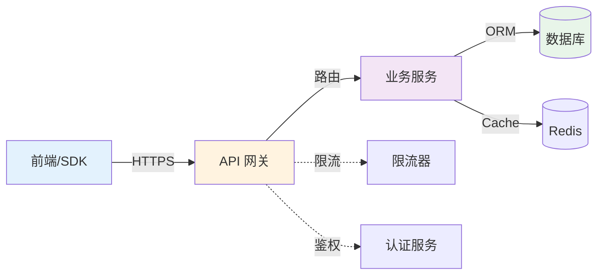
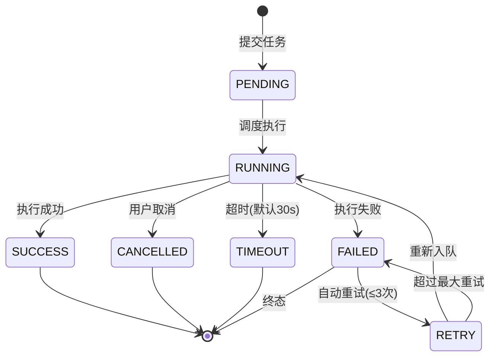

# [项目名称] - 接口文档

| 版本 | 日期 | 作者 | 说明 |
|------|------|------|------|
| 1.0 | YYYY-MM-DD | Your Name | 初始版本 |

---

>  **填写指南**：本文档规范 API 接口设计，是前后端联调的重要依据。
>
>  **一页纸摘要**:
> 1. 看完这页能回答:有哪些 API?请求/响应长啥样?错误码是什么?
> 2. 文档定位:设计级(技术级),前后端契约
> 3. 核心动作:认证 + CRUD + 错误码 + Mock 自动化
> 4. 何时使用:前后端联调 / 第三方对接 / 接口评审
> 5. 不要用于:UI(→04/10)、数据模型(→12)
>
>  **关键引用**: `reference/12-value-matrix.md` (接口文档价值) · [`reference/13-quality-selfcheck.md`](../reference/13-quality-selfcheck.md) (5 段必含自检) · [`reference/15-five-field-crosscheck.md`](../reference/15-five-field-crosscheck.md) (5 字段交叉)

## 0. 填写指南

### 0.0 本文档价值

> **回答的核心问题**：前后端 API 契约是什么？怎么对？
>
> **不回答什么**：数据库表结构（→12）、业务逻辑（→06）
>
> **价值判定**：前后端各自拿着文档可独立开发，联调无歧义
>
> **所属阶段**：开发（技术级）

### 0.1 文档用途

| 用途 | 说明 |
|------|------|
| 接口定义 | 明确每个接口的请求/响应格式 |
| 前端开发 | 前端根据文档封装 API |
| 后端开发 | 后端根据文档实现接口 |
| 联调依据 | 前后端联调的参考标准 |
| 测试依据 | 接口测试的参考 |

### 0.2 填写原则

| 原则 | 说明 | 示例 |
|------|------|------|
| 完整性 | 每个接口都有完整的请求/响应示例 | 不省略可选字段 |
| 一致性 | 同类接口格式一致 | 分页结构统一 |
| 可执行 | 示例代码可直接使用 | 字段类型准确 |
| 版本化 | API 有版本控制 | /api/v1/xxx |

### 0.3 接口命名规范

| 类型 | 命名规则 | 示例 |
|------|----------|------|
| 获取列表 | /{module}/list | POST /user/list |
| 获取详情 | /{module}/{id} | GET /user/1 |
| 新增 | /{module}/create | POST /user/create |
| 更新 | /{module}/{id} | PUT /user/1 |
| 删除 | /{module}/{id} | DELETE /user/1 |
| 批量操作 | /{module}/batch-{action} | POST /user/batch-delete |

### 0.4 HTTP 方法选择

⭐ **关键决策**：采用 **RESTful 风格**（GET/POST/PUT/DELETE 严格按 HTTP 语义），**不**使用 `/getUser` `/deleteUser` 这类 RPC 风格 URL。
- **理由**：HTTP 方法自带幂等性约束，CDN/代理/中间件可针对性缓存 GET，符合 OpenAPI 3.0 规范
- **权衡**：开发需要理解 REST 语义（学习成本 vs 长期可维护性）
- **例外**：批量操作、复杂查询（多条件筛选）可用 POST + `/search` 命名

| 方法 | 适用场景 | 幂等性 |
|------|----------|--------|
| GET | 查询，无副作用 | ✅ 幂等 |
| POST | 创建，有副作用 | ❌ 非幂等 |
| PUT | 更新，全量更新 | ✅ 幂等 |
| DELETE | 删除 | ✅ 幂等 |

---

## 1. 接口概述



### 1.1 基本信息

| 项目 | 内容 |
|------|------|
| 接口前缀 | `/api/v1/` |
| Base URL | `https://api.example.com` |
| 认证方式 | Bearer Token |
| 数据格式 | JSON |
| 字符编码 | UTF-8 |

### 1.2 认证与授权

所有接口请求必须在 Header 中携带 Token：

```http
Authorization: Bearer <token>
Content-Type: application/json
```

**Token 获取方式**：
```http
POST /api/v1/auth/login
Content-Type: application/json

{
  "username": "string",
  "password": "string"
}
```

**Token 刷新方式**：
```http
POST /api/v1/auth/refresh
Content-Type: application/json

{
  "refreshToken": "string"
}
```

**响应示例**：
```json
{
  "code": 200,
  "data": {
    "accessToken": "eyJhbGciOiJIUzI1NiIsInR5cCI6IkpXVCJ9...",
    "refreshToken": "eyJhbGciOiJIUzI1NiIsInR5cCI6IkpXVCJ9...",
    "expiresIn": 7200
  },
  "message": "success"
}
```

### 1.3 通用请求头

| Header | 必填 | 说明 | 示例 |
|--------|------|------|------|
| Authorization | 是 | Bearer Token | `Bearer eyJhbGciOiJIUzI1NiIs...` |
| Content-Type | 是 | 请求数据类型 | `application/json` |
| Accept | 否 | 接受数据类型 | `application/json` |
| X-Request-ID | 否 | 请求唯一ID，用于链路追踪 | `uuid-v4` |
| X-Timestamp | 否 | 时间戳（秒） | `1706745600` |

### 1.4 通用响应格式

**成功响应**：
```json
{
  "code": 200,
  "data": {},
  "message": "success",
  "requestId": "uuid-v4",
  "timestamp": 1706745600000
}
```

**分页响应**：
```json
{
  "code": 200,
  "data": {
    "list": [],
    "pagination": {
      "page": 1,
      "pageSize": 10,
      "total": 100,
      "totalPages": 10
    }
  },
  "message": "success"
}
```

**错误响应**：
```json
{
  "code": 400,
  "data": null,
  "message": "参数错误：username 不能为空",
  "requestId": "uuid-v4",
  "timestamp": 1706745600000
}
```

---

## 2. 接口列表

### 2.1 接口总览

| 接口 | 路径 | 方法 | 认证 | 说明 |
|------|------|------|------|------|
| 登录 | /auth/login | POST | 否 | 用户登录 |
| 刷新Token | /auth/refresh | POST | 否 | 刷新Token |
| 登出 | /auth/logout | POST | 是 | 用户登出 |
| 获取列表 | /xxx/list | POST | 是 | 分页查询 |
| 获取详情 | /xxx/{id} | GET | 是 | 获取单条记录 |
| 新增 | /xxx/create | POST | 是 | 创建数据 |
| 更新 | /xxx/{id} | PUT | 是 | 更新数据 |
| 删除 | /xxx/{id} | DELETE | 是 | 删除数据 |
| 批量删除 | /xxx/batch-delete | POST | 是 | 批量删除 |
| 导出 | /xxx/export | POST | 是 | 导出数据 |
| 导入模板 | /xxx/import-template | GET | 是 | 下载导入模板 |
| 导入 | /xxx/import | POST | 是 | 导入数据 |
| 统计数据 | /xxx/stats | GET | 是 | 获取统计 |
| 上传文件 | /upload/file | POST | 是 | 文件上传 |
| 上传图片 | /upload/image | POST | 是 | 图片上传 |

---

## 3. 接口详情

### 3.1 认证接口

#### 3.1.1 用户登录

**请求**
```http
POST /api/v1/auth/login
Content-Type: application/json

{
  "username": "string",
  "password": "string",
  "captcha": "string",
  "captchaKey": "string"
}
```

**请求参数**
| 参数 | 类型 | 必填 | 说明 |
|------|------|------|------|
| username | string | 是 | 用户名/手机号/邮箱 |
| password | string | 是 | 密码（加密传输） |
| captcha | string | 否 | 图形验证码 |
| captchaKey | string | 否 | 验证码Key |

**响应**
```json
{
  "code": 200,
  "data": {
    "userId": 1,
    "username": "admin",
    "nickname": "管理员",
    "avatar": "https://example.com/avatar.png",
    "roles": ["admin"],
    "permissions": ["*:*:*"],
    "accessToken": "eyJhbGciOiJIUzI1NiIsInR5cCI6IkpXVCJ9...",
    "refreshToken": "eyJhbGciOiJIUzI1NiIsInR5cCI6IkpXVCJ9...",
    "expiresIn": 7200
  },
  "message": "登录成功"
}
```

**错误码**
| 错误码 | 说明 | 处理建议 |
|--------|------|----------|
| 10001 | 用户名或密码错误 | 提示用户名或密码错误 |
| 10002 | 账号已被禁用 | 联系管理员 |
| 10003 | 验证码错误 | 刷新验证码重试 |
| 10004 | 验证码已过期 | 刷新验证码重试 |

---

#### 3.1.2 刷新Token

**请求**
```http
POST /api/v1/auth/refresh
Content-Type: application/json

{
  "refreshToken": "string"
}
```

**响应**
```json
{
  "code": 200,
  "data": {
    "accessToken": "eyJhbGciOiJIUzI1NiIsInR5cCI6IkpXVCJ9...",
    "refreshToken": "eyJhbGciOiJIUzI1NiIsInR5cCI6IkpXVCJ9...",
    "expiresIn": 7200
  },
  "message": "刷新成功"
}
```

---

### 3.2 列表查询接口

#### 3.2.1 分页查询

**请求**
```http
POST /api/v1/xxx/list
Authorization: Bearer <token>
Content-Type: application/json

{
  "page": 1,
  "pageSize": 10,
  "keyword": "string",
  "status": 1,
  "startDate": "2024-01-01",
  "endDate": "2024-12-31",
  "sortField": "createTime",
  "sortOrder": "desc"
}
```

**请求参数**
| 参数 | 类型 | 必填 | 说明 |
|------|------|------|------|
| page | int | 否 | 页码，默认1 |
| pageSize | int | 否 | 每页条数，默认10，最大100 |
| keyword | string | 否 | 关键词搜索（匹配name/title等字段） |
| status | int | 否 | 状态筛选 |
| startDate | string | 否 | 开始日期，YYYY-MM-DD |
| endDate | string | 否 | 结束日期，YYYY-MM-DD |
| sortField | string | 否 | 排序字段，默认createTime |
| sortOrder | string | 否 | 排序方向：asc/desc，默认desc |

**响应**
```json
{
  "code": 200,
  "data": {
    "list": [
      {
        "id": 1,
        "name": "示例数据",
        "status": 1,
        "statusText": "正常",
        "creator": {
          "id": 1,
          "name": "管理员"
        },
        "createTime": "2024-01-15 10:30:00",
        "updateTime": "2024-01-15 10:30:00"
      }
    ],
    "pagination": {
      "page": 1,
      "pageSize": 10,
      "total": 100,
      "totalPages": 10
    }
  },
  "message": "success"
}
```

---

### 3.3 数据操作接口

#### 3.3.1 获取详情

**请求**
```http
GET /api/v1/xxx/{id}
Authorization: Bearer <token>
```

**路径参数**
| 参数 | 类型 | 必填 | 说明 |
|------|------|------|------|
| id | int | 是 | 数据ID |

**响应**
```json
{
  "code": 200,
  "data": {
    "id": 1,
    "name": "示例数据",
    "code": "CODE001",
    "status": 1,
    "statusText": "正常",
    "description": "详细描述...",
    "config": {
      "key1": "value1",
      "key2": "value2"
    },
    "tags": ["标签1", "标签2"],
    "attachments": [
      {
        "id": 1,
        "name": "附件1.pdf",
        "url": "https://example.com/files/xxx.pdf",
        "size": 1024000,
        "mimeType": "application/pdf"
      }
    ],
    "creator": {
      "id": 1,
      "name": "管理员"
    },
    "createTime": "2024-01-15 10:30:00",
    "updater": {
      "id": 1,
      "name": "管理员"
    },
    "updateTime": "2024-01-15 10:30:00"
  },
  "message": "success"
}
```

---

#### 3.3.2 新增数据

**请求**
```http
POST /api/v1/xxx/create
Authorization: Bearer <token>
Content-Type: application/json

{
  "name": "string",
  "code": "string",
  "status": 1,
  "description": "string",
  "config": {
    "key1": "value1"
  }
}
```

**请求参数**
| 参数 | 类型 | 必填 | 说明 |
|------|------|------|------|
| name | string | 是 | 名称，2-50字符 |
| code | string | 是 | 编码，唯一标识 |
| status | int | 否 | 状态，默认1 |
| description | string | 否 | 描述，最大500字符 |
| config | object | 否 | 配置信息 |

**响应**
```json
{
  "code": 200,
  "data": {
    "id": 1,
    "name": "示例数据",
    "code": "CODE001"
  },
  "message": "创建成功"
}
```

---

#### 3.3.3 更新数据

**请求**
```http
PUT /api/v1/xxx/{id}
Authorization: Bearer <token>
Content-Type: application/json

{
  "name": "string",
  "status": 1,
  "description": "string",
  "config": {
    "key1": "newValue"
  }
}
```

**路径参数**
| 参数 | 类型 | 必填 | 说明 |
|------|------|------|------|
| id | int | 是 | 数据ID |

**请求参数**
| 参数 | 类型 | 必填 | 说明 |
|------|------|------|------|
| name | string | 否 | 名称 |
| status | int | 否 | 状态 |
| description | string | 否 | 描述 |
| config | object | 否 | 配置信息 |

**响应**
```json
{
  "code": 200,
  "data": null,
  "message": "更新成功"
}
```

---

#### 3.3.4 删除数据

**请求**
```http
DELETE /api/v1/xxx/{id}
Authorization: Bearer <token>
```

**路径参数**
| 参数 | 类型 | 必填 | 说明 |
|------|------|------|------|
| id | int | 是 | 数据ID |

**响应**
```json
{
  "code": 200,
  "data": null,
  "message": "删除成功"
}
```

---

#### 3.3.5 批量删除

**请求**
```http
POST /api/v1/xxx/batch-delete
Authorization: Bearer <token>
Content-Type: application/json

{
  "ids": [1, 2, 3]
}
```

**请求参数**
| 参数 | 类型 | 必填 | 说明 |
|------|------|------|------|
| ids | int[] | 是 | ID数组，最多50个 |

**响应**
```json
{
  "code": 200,
  "data": {
    "successCount": 3,
    "failCount": 0,
    "failIds": []
  },
  "message": "批量删除完成"
}
```

---

### 3.4 导入导出接口

#### 3.4.1 下载导入模板

**请求**
```http
GET /api/v1/xxx/import-template
Authorization: Bearer <token>
```

**响应**
二进制文件流（Excel格式 .xlsx）

---

#### 3.4.2 导出数据

**请求**
```http
POST /api/v1/xxx/export
Authorization: Bearer <token>
Content-Type: application/json

{
  "format": "xlsx",
  "fields": ["id", "name", "status", "createTime"],
  "keyword": "string",
  "startDate": "2024-01-01",
  "endDate": "2024-12-31"
}
```

**请求参数**
| 参数 | 类型 | 必填 | 说明 |
|------|------|------|------|
| format | string | 否 | 导出格式：xlsx/csv，默认xlsx |
| fields | string[] | 否 | 导出的字段，默认全部 |
| keyword | string | 否 | 关键词筛选 |
| startDate | string | 否 | 开始日期 |
| endDate | string | 否 | 结束日期 |

**响应**
二进制文件流（Excel格式）

---

#### 3.4.3 导入数据

**请求**
```http
POST /api/v1/xxx/import
Authorization: Bearer <token>
Content-Type: multipart/form-data

file: [Excel文件]
```

**响应**
```json
{
  "code": 200,
  "data": {
    "taskId": "IMPORT-20240115-001",
    "total": 100,
    "successCount": 98,
    "failCount": 2,
    "failReason": [
      {"row": 5, "reason": "名称不能为空"},
      {"row": 10, "reason": "编码重复"}
    ]
  },
  "message": "导入完成"
}
```

---

### 3.5 文件上传接口

#### 3.5.1 上传文件

**请求**
```http
POST /api/v1/upload/file
Authorization: Bearer <token>
Content-Type: multipart/form-data

file: [文件]
folder: string
```

**请求参数**
| 参数 | 类型 | 必填 | 说明 |
|------|------|------|------|
| file | file | 是 | 上传的文件，最大100MB |
| folder | string | 否 | 存储目录，默认 `/general` |

**允许的文件类型**：
- 文档：`doc`, `docx`, `pdf`, `xls`, `xlsx`, `ppt`, `pptx`, `txt`
- 图片：`jpg`, `jpeg`, `png`, `gif`, `bmp`, `webp`, `svg`
- 压缩包：`zip`, `rar`, `7z`, `tar`, `gz`
- 其他：`csv`

**响应**
```json
{
  "code": 200,
  "data": {
    "fileId": "FILE-20240115-001",
    "fileName": "document.pdf",
    "fileUrl": "https://cdn.example.com/files/xxx.pdf",
    "fileSize": 1024000,
    "mimeType": "application/pdf",
    "uploadTime": "2024-01-15 10:30:00"
  },
  "message": "上传成功"
}
```

---

#### 3.5.2 上传图片

**请求**
```http
POST /api/v1/upload/image
Authorization: Bearer <token>
Content-Type: multipart/form-data

file: [图片文件]
folder: string
compress: boolean
maxWidth: int
maxHeight: int
```

**请求参数**
| 参数 | 类型 | 必填 | 说明 |
|------|------|------|------|
| file | file | 是 | 上传的图片，最大10MB |
| folder | string | 否 | 存储目录，默认 `/images` |
| compress | boolean | 否 | 是否压缩，默认true |
| maxWidth | int | 否 | 最大宽度，默认1920 |
| maxHeight | int | 否 | 最大高度，默认1080 |

**允许的图片类型**：`jpg`, `jpeg`, `png`, `gif`, `webp`, `bmp`

**响应**
```json
{
  "code": 200,
  "data": {
    "fileId": "IMG-20240115-001",
    "fileName": "photo.jpg",
    "fileUrl": "https://cdn.example.com/images/xxx.jpg",
    "thumbnailUrl": "https://cdn.example.com/images/thumb/xxx.jpg",
    "fileSize": 512000,
    "width": 1920,
    "height": 1080,
    "uploadTime": "2024-01-15 10:30:00"
  },
  "message": "上传成功"
}
```

---

### 3.6 统计接口

#### 3.6.1 获取统计

**请求**
```http
GET /api/v1/xxx/stats
Authorization: Bearer <token>
```

**响应**
```json
{
  "code": 200,
  "data": {
    "total": 1000,
    "today": 50,
    "yesterday": 45,
    "growth": 11.1,
    "trend": [
      {"date": "2024-01-10", "count": 40},
      {"date": "2024-01-11", "count": 45},
      {"date": "2024-01-12", "count": 50}
    ],
    "byStatus": [
      {"status": 1, "label": "正常", "count": 800},
      {"status": 0, "label": "禁用", "count": 200}
    ],
    "byType": [
      {"type": "A", "label": "类型A", "count": 600},
      {"type": "B", "label": "类型B", "count": 400}
    ]
  },
  "message": "success"
}
```

---

## 4. 错误码

### 4.1 通用错误码

| 错误码 | 说明 | 处理建议 |
|--------|------|----------|
| 200 | 成功 | - |
| 400 | 请求参数错误 | 检查请求参数格式和必填项 |
| 401 | 未授权/Token过期 | 重新登录获取Token |
| 403 | 无权限 | 检查用户权限配置 |
| 404 | 数据不存在 | 检查请求的ID是否正确 |
| 405 | 请求方法不允许 | 检查HTTP方法是否正确 |
| 408 | 请求超时 | 网络状况不佳，重试 |
| 409 | 数据冲突 | 检查数据是否重复 |
| 410 | 资源已被删除 | 刷新数据列表 |
| 413 | 请求体过大 | 减小请求数据量 |
| 415 | 不支持的媒体类型 | 检查Content-Type |
| 422 | 数据验证失败 | 查看message具体字段错误 |
| 429 | 请求过于频繁 | 降低请求频率 |
| 500 | 服务器内部错误 | 联系技术支持 |
| 502 | 网关错误 | 服务不可用，联系技术支持 |
| 503 | 服务维护中 | 稍后重试 |
| 504 | 网关超时 | 服务响应超时，重试 |

### 4.2 业务错误码

| 错误码 | 说明 | 处理建议 |
|--------|------|----------|
| 10001 | 用户名或密码错误 | 检查用户名密码 |
| 10002 | 账号已被禁用 | 联系管理员 |
| 10003 | Token已过期 | 调用refresh接口 |
| 10004 | RefreshToken已过期 | 重新登录 |
| 20001 | 数据已存在 | 检查唯一字段是否重复 |
| 20002 | 数据被引用无法删除 | 先删除关联数据 |
| 20003 | 数据状态不允许操作 | 检查数据状态 |
| 20004 | 超出数量限制 | 清理已有数据 |
| 30001 | 文件类型不支持 | 检查文件类型 |
| 30002 | 文件大小超限 | 减小文件大小 |
| 30003 | 文件损坏 | 重新上传 |
| 40001 | 导入数据格式错误 | 下载模板按要求填写 |
| 40002 | 导入数据行数超限 | 减少导入数据量 |

---

## 5. 枚举值

### 5.1 状态枚举

| 值 | 显示 | 说明 |
|----|------|------|
| 0 | 禁用 | 不可用状态 |
| 1 | 启用 | 正常使用 |

### 5.2 操作类型枚举

| 值 | 显示 | 说明 |
|----|------|------|
| 1 | 创建 | 新建数据 |
| 2 | 更新 | 修改数据 |
| 3 | 删除 | 删除数据 |
| 4 | 导出 | 导出数据 |
| 5 | 导入 | 导入数据 |
| 6 | 启用 | 启用数据 |
| 7 | 禁用 | 禁用数据 |

### 5.3 日志类型枚举

| 值 | 显示 | 说明 |
|----|------|------|
| 1 | 操作日志 | 用户操作记录 |
| 2 | 登录日志 | 登录登出记录 |
| 3 | 系统日志 | 系统自动记录 |
| 4 | 异常日志 | 异常情况记录 |

---

## 6. 限流与校验

### 6.1 接口限流规则

| 接口类型 | 限流规则 | 说明 |
|----------|----------|------|
| 通用接口 | 100次/分钟 | 单用户每分钟最多100次 |
| 文件上传 | 10次/分钟 | 单用户每分钟最多10次 |
| 导出/导入 | 5次/小时 | 单用户每小时最多5次 |
| 登录接口 | 5次/分钟 | 单IP每分钟最多5次 |

**触发限流后的响应**：
```json
{
  "code": 429,
  "message": "请求过于频繁，请稍后重试",
  "data": {
    "retryAfter": 60
  }
}
```

### 6.2 数据校验规则

| 字段类型 | 校验规则 |
|----------|----------|
| 用户名 | 3-20字符，字母数字下划线 |
| 邮箱 | 符合邮箱格式 |
| 手机号 | 符合中国大陆手机号格式 |
| 密码 | 8-20字符，包含字母和数字 |
| 身份证 | 符合身份证格式校验 |
| URL | 符合URL格式 |
| 日期 | YYYY-MM-DD 格式 |
| 日期时间 | YYYY-MM-DD HH:mm:ss 格式 |
| IP地址 | 符合IPv4/IPv6格式 |

---

## 7. Webhook（可选）

当数据发生变更时，系统通过Webhook主动推送通知：

**推送格式**：
```json
{
  "event": "xxx.created",
  "timestamp": 1706745600000,
  "data": {
    "id": 1,
    "name": "示例"
  }
}
```

**事件类型**：
| 事件 | 说明 |
|------|------|
| xxx.created | 数据创建 |
| xxx.updated | 数据更新 |
| xxx.deleted | 数据删除 |
| xxx.status_changed | 状态变更 |

**签名验证**：
```http
X-Signature: sha256=<签名>
X-Timestamp: <时间戳>

// 签名计算方式
signature = HMAC-SHA256(timestamp + "." + body, secretKey)
```

---

## 8. 接口文档检查清单

> ✅ **完成后逐项检查，确保接口文档可作为前后端联调依据**

| 检查项 | 状态 |
|--------|------|
| 每个接口都有完整 URL + Method | ☐ |
| 请求头/请求体字段都已说明 | ☐ |
| 响应体字段含类型 + 必填 + 说明 | ☐ |
| 错误码完整（含业务码） | ☐ |
| 至少一个成功 + 一个失败示例 | ☐ |
| 限流/防刷规则已说明 | ☐ |
| 鉴权方式已标注 | ☐ |
| 与 06 产品需求字段对齐 | ☐ |
| 与 12 数据库表字段对齐（仅完整） | ☐ |
| Mock 示例可执行 | ☐ |

---

## 20. API 版本管理

>  **核心目标**：API 演进过程中保持**向后兼容**，让旧客户端不因新版本发布而崩溃。

### 20.1 版本管理方式对比

| 方式 | 示例 | 优势 | 劣势 | 适用 |
|------|------|------|------|------|
| **URL 路径** | `/api/v1/orders`、`/api/v2/orders` | 直观、缓存友好 | URL 冗余 | **推荐**（最主流） |
| **请求头** | `Accept: application/vnd.api.v2+json` | URL 干净 | 调试不友好 | 内部 API |
| **查询参数** | `/api/orders?version=2` | 灵活 | 污染 URL | 不推荐 |
| **域名** | `api.v2.example.com` | 完全隔离 | 维护成本高 | 大型平台 |

**推荐方案**：URL 路径 + 语义化版本（`/api/v1`、`/api/v2`）

### 20.2 版本演进策略

| 策略 | 描述 | 适用 |
|------|------|------|
| **URL 多版本共存** | v1、v2 同时运行 | 推荐 |
| **Header 灰度** | `X-API-Version: 2` 部分用户 | 细粒度 |
| **A/B 测试** | 按用户分版本对比 | 数据驱动 |
| **重定向** | 旧版本 301 跳新版本 | 简单迁移 |
| **强制升级** | 旧版本返回 410 Gone | 旧版本下线 |

### 20.3 兼容性原则

| 操作 | 是否兼容 | 处理 |
|------|----------|------|
| **新增字段** | ✅ 兼容 | 旧客户端忽略新字段 |
| **新增接口** | ✅ 兼容 | - |
| **新增可选参数** | ✅ 兼容 | - |
| **删除字段** | ❌ 破坏 | 标记 deprecated 后再删 |
| **修改字段类型** | ❌ 破坏 | 只能新增字段不删旧 |
| **修改必填 → 可选** | ✅ 兼容 | - |
| **修改可选 → 必填** | ❌ 破坏 | - |
| **修改字段含义** | ❌ 破坏 | - |
| **删除接口** | ❌ 破坏 | 走弃用流程 |

### 20.4 弃用（Deprecation）流程

```
1. 标记 deprecated
   ↓
2. 响应头添加：Sunset, Deprecation
   ↓
3. 文档标注 + 告警通知（邮件/飞书）
   ↓
4. 观察 30~90 天（无调用后下线）
   ↓
5. 返回 410 Gone
   ↓
6. 删除代码
```

**HTTP 弃用响应头**：
```http
HTTP/1.1 200 OK
Deprecation: true
Sunset: Wed, 01 Jan 2025 00:00:00 GMT
Link: </api/v2/orders>; rel="successor-version"
Warning: 299 - "This API is deprecated, please migrate to v2"
```

### 20.5 API 版本管理清单

| 检查项 | 状态 |
|--------|------|
| 版本策略已选型（推荐 URL） | ☐ |
| 版本演进流程已定义 | ☐ |
| 兼容性原则已文档化 | ☐ |
| 弃用流程已建立（标记 → 通知 → 下线） | ☐ |
| 旧版本监控（调用量、错误率） | ☐ |
| 强制升级时间表已规划 | ☐ |

---

## 21. 限流策略

>  **核心目标**：保护系统不被流量打挂，提供**有损服务**而非完全不可用。

### 21.1 限流算法

⭐ **关键决策**：**API 网关层用滑动窗口**（推荐），**应用层兜底用令牌桶**（应对突发）。
- **滑动窗口** = 平滑 + 内存可控（推荐默认）
- **令牌桶** = 允许短时突发（适合用户体验优先场景，如秒杀、抢购）
- **漏桶** = 强制匀速（出口限流场景，不推荐 API 网关）
- **固定窗口** = 仅用于内部管理接口（实现最简）
- **滑动日志** = 精确但内存爆炸，仅金融/支付场景考虑

| 算法 | 原理 | 优点 | 缺点 | 适用 |
|------|------|------|------|------|
| **固定窗口** | 1 分钟内累计计数 | 简单 | 边界突刺 | 简单场景 |
| **滑动窗口** | 多个小窗口加权 | 平滑 | 略复杂 | **API 网关** |
| **令牌桶** | 匀速放令牌 | 允许突发 | 略复杂 | 通用 |
| **漏桶** | 出口恒定 | 强制匀速 | 无法应对突发 | 流量整形 |
| **滑动日志** | 记录每条时间戳 | 精确 | 内存大 | 小流量 |

### 21.2 限流维度

| 维度 | 优先级 | 配置 | 示例 |
|------|--------|------|------|
| **IP** | 高 | `100次/分钟` | 防爬虫、防刷 |
| **用户** | 高 | `50次/秒` | 防止单个用户过多请求 |
| **租户** | 中 | `10000次/小时` | SaaS 多租户 |
| **接口** | 中 | `1000 QPS` | 全局接口保护 |
| **全局** | 低 | `100000 QPS` | 系统级兜底 |
| **业务** | 中 | 登录 5次/分，支付 10次/秒 | 业务定制 |
| **地域** | 低 | 境外 100/秒 | 地域差异 |

### 21.3 多级限流架构

```
客户端
   ↓
CDN/WAF（边缘限流，1万 QPS）
   ↓
API 网关（接口级限流，5000 QPS）
   ↓
Nginx（应用层限流，3000 QPS）
   ↓
应用服务（用户/IP 级限流，1000 QPS）
   ↓
数据库（连接池、查询超时，500 QPS）
```

### 21.4 限流响应规范

**HTTP 状态码**：
- `429 Too Many Requests` — 限流命中
- `503 Service Unavailable` — 服务过载
- `509 Bandwidth Limit Exceeded` — 带宽超限（扩展）

**响应格式**：
```json
{
  "code": 429,
  "message": "请求过于频繁，请稍后重试",
  "data": {
    "retryAfter": 60,
    "limit": 100,
    "remaining": 0,
    "resetAt": 1706745600
  },
  "requestId": "uuid"
}
```

**响应头**（IETF 标准）：
```http
HTTP/1.1 429 Too Many Requests
Retry-After: 60
X-RateLimit-Limit: 100
X-RateLimit-Remaining: 0
X-RateLimit-Reset: 1706745600
X-RateLimit-Reset-After: 60
```

### 21.5 限流策略清单

| 检查项 | 状态 |
|--------|------|
| 限流算法已选型 | ☐ |
| 限流维度已定义 | ☐ |
| 多级限流架构已设计 | ☐ |
| 限流阈值已评估（基于压测） | ☐ |
| 限流响应格式已规范（含 Retry-After） | ☐ |
| 限流监控告警已接入 | ☐ |
| 限流白名单/黑名单已实现 | ☐ |

---

## 22. 批量接口设计

>  **核心目标**：减少请求次数、提升性能，但避免**单次请求过大**导致超时。

### 22.1 批量接口设计原则

| 原则 | 说明 |
|------|------|
| **数量限制** | 单次最多 50 ~ 1000（按接口类型） |
| **部分成功** | 返回成功/失败明细，不因部分失败而全失败 |
| **异步优先** | 大批量操作走异步（详见 §23） |
| **幂等保证** | 客户端可安全重试 |
| **进度查询** | 异步任务提供进度接口 |
| **结果回调** | 支持 Webhook 通知完成 |

### 22.2 同步批量 vs 异步批量

| 维度 | 同步批量 | 异步批量 |
|------|----------|----------|
| 数据量 | ≤ 100 | > 100 |
| 响应时间 | 立即返回 | 秒级返回 taskId |
| 适用 | 实时反馈 | 后台处理 |
| 进度查询 | 无 | 必需 |
| 结果通知 | 响应体内 | Webhook / 轮询 |

### 22.3 批量创建示例

**请求**：
```http
POST /api/v1/orders/batch-create
Content-Type: application/json
Authorization: Bearer <token>

{
  "items": [
    { "name": "订单1", "amount": 100.00 },
    { "name": "订单2", "amount": 200.00 },
    { "name": "订单3", "amount": 300.00 }
  ]
}
```

**响应**：
```json
{
  "code": 200,
  "message": "批量创建完成",
  "data": {
    "successCount": 2,
    "failCount": 1,
    "successList": [
      { "index": 0, "id": 1001, "name": "订单1" },
      { "index": 1, "id": 1002, "name": "订单2" }
    ],
    "failList": [
      { "index": 2, "reason": "金额超限：30000 超过 9999" }
    ]
  }
}
```

### 22.4 异步批量（百万级）

**请求**：
```http
POST /api/v1/orders/batch-import-async
Content-Type: multipart/form-data

file: orders.xlsx  // 或
{
  "items": [...1000条]  // 1000+ 推荐异步
}
```

**响应**（立即返回）：
```json
{
  "code": 202,
  "message": "任务已提交",
  "data": {
    "taskId": "IMPORT-20240115-001",
    "total": 10000,
    "estimatedTime": 60
  }
}
```

**进度查询**：
```http
GET /api/v1/tasks/IMPORT-20240115-001
```
```json
{
  "code": 200,
  "data": {
    "taskId": "IMPORT-20240115-001",
    "status": "running",
    "progress": 65,
    "processed": 6500,
    "total": 10000,
    "successCount": 6450,
    "failCount": 50
  }
}
```

### 22.5 批量接口清单

| 检查项 | 状态 |
|--------|------|
| 同步批量上限已定义（≤100） | ☐ |
| 部分成功响应已规范 | ☐ |
| 异步批量机制已具备 | ☐ |
| 进度查询接口已实现 | ☐ |
| Webhook 回调已支持 | ☐ |
| 幂等性已保证 | ☐ |

---

## 23. 异步任务

>  **核心目标**：处理长耗时任务，避免客户端**超时等待**。

### 23.1 异步通信方案对比

⭐ **关键决策**：**任务进度推送优先 SSE**（单向、低复杂度、断线自动重连），**仅在双向交互场景用 WebSocket**。
- **轮询/长轮询**：作为兜底（浏览器/网络不支持 SSE 时降级）
- **SSE 适用**：任务进度、日志流、订单状态变更（90% 异步场景）
- **WebSocket 适用**：IM、协作编辑、实时游戏（必须双向）
- **Webhook**：服务端到第三方系统的回调（异步任务完成通知首选）
- **MQ**：服务端到服务端（不直接面向前端）

| 方案 | 方向 | 实时性 | 复杂度 | 适用 |
|------|------|--------|--------|------|
| **轮询** | 客户端 → 服务端 | 低 | 低 | 简单任务 |
| **长轮询（Long Polling）** | 客户端 → 服务端 | 中 | 中 | 兼容性好的"准实时" |
| **SSE（Server-Sent Events）** | 服务端 → 客户端 | 高 | 中 | 单向推送（通知/进度） |
| **WebSocket** | 双向 | 高 | 高 | IM、协作、实时游戏 |
| **Webhook 回调** | 服务端 → 客户端 | 高 | 中 | 异步任务完成通知 |
| **MQ 广播** | 服务端 → 服务端 | 高 | 中 | 微服务 |

### 23.2 任务状态机

⭐ **关键决策**：**6 状态机 + RETRY 闭环**（FAILED → RETRY → RUNNING），**最多 3 次重试**后强制 FAILED，避免无限重试拖垮系统。



### 23.3 异步任务接口

**1. 提交任务**：
```http
POST /api/v1/tasks
Content-Type: application/json

{
  "type": "export_orders",
  "params": { "startDate": "2024-01-01", "endDate": "2024-12-31" },
  "callbackUrl": "https://myapp.com/webhook"  // 可选
}
```
```json
{
  "code": 200,
  "data": {
    "taskId": "TASK-20240115-001",
    "status": "pending",
    "createdAt": "2024-01-15T10:30:00Z"
  }
}
```

**2. 查询任务**：
```http
GET /api/v1/tasks/TASK-20240115-001
```
```json
{
  "code": 200,
  "data": {
    "taskId": "TASK-20240115-001",
    "type": "export_orders",
    "status": "running",
    "progress": 45,
    "result": null,
    "error": null,
    "startedAt": "2024-01-15T10:30:01Z",
    "estimatedFinishAt": "2024-01-15T10:35:00Z"
  }
}
```

**3. Webhook 回调**（任务完成时）：
```http
POST https://myapp.com/webhook
Content-Type: application/json
X-Signature: sha256=<HMAC签名>

{
  "taskId": "TASK-20240115-001",
  "status": "success",
  "result": {
    "fileUrl": "https://cdn.example.com/exports/orders-20240115.xlsx",
    "fileSize": 1024000
  },
  "completedAt": "2024-01-15T10:32:15Z"
}
```

### 23.4 SSE 实时进度（前端示例）

**服务端**：
```javascript
// Express SSE
app.get('/api/v1/tasks/:id/progress', (req, res) => {
  res.setHeader('Content-Type', 'text/event-stream');
  res.setHeader('Cache-Control', 'no-cache');
  res.setHeader('Connection', 'keep-alive');

  const interval = setInterval(async () => {
    const progress = await getTaskProgress(req.params.id);
    res.write(`data: ${JSON.stringify(progress)}\n\n`);
    if (progress.status === 'success' || progress.status === 'failed') {
      clearInterval(interval);
      res.end();
    }
  }, 1000);

  req.on('close', () => clearInterval(interval));
});
```

**客户端**：
```javascript
const eventSource = new EventSource(`/api/v1/tasks/${taskId}/progress`);
eventSource.onmessage = (e) => {
  const progress = JSON.parse(e.data);
  console.log('Progress:', progress.progress, '%');
  if (progress.status === 'success') eventSource.close();
};
```

### 23.5 WebSocket 双向实时

**典型场景**：聊天、协作编辑、实时大屏

```javascript
// 客户端
const ws = new WebSocket('wss://api.example.com/ws/orders');
ws.onopen = () => ws.send(JSON.stringify({ action: 'subscribe', topic: 'order_updates' }));
ws.onmessage = (e) => {
  const event = JSON.parse(e.data);
  console.log('收到推送:', event);
};

// 服务端（Spring WebSocket）
@MessageMapping("/orders")
@SendTo("/topic/orders")
public OrderEvent handle(OrderEvent event) {
  return orderService.process(event);
}
```

### 23.6 异步任务清单

| 检查项 | 状态 |
|--------|------|
| 任务状态机已设计 | ☐ |
| 任务提交/查询接口已实现 | ☐ |
| 进度查询机制已具备 | ☐ |
| Webhook 回调已支持 | ☐ |
| SSE/WebSocket 已按需实现 | ☐ |
| 任务超时已设置 | ☐ |
| 失败重试策略已定义 | ☐ |
| 任务清理策略已制定（保留期） | ☐ |

---

## 24. OpenAPI 3.0 规范

>  **核心目标**：用**标准化的机器可读格式**描述 API，自动生成文档/SDK/Mock/测试。

### 24.1 OpenAPI 文档结构

```yaml
openapi: 3.0.3
info:
  title: 订单服务 API
  description: 订单服务接口文档
  version: 1.0.0
  contact:
    name: API Team
    email: api@example.com

servers:
  - url: https://api.example.com/api/v1
    description: 生产环境
  - url: https://dev-api.example.com/api/v1
    description: 测试环境

tags:
  - name: 订单
    description: 订单管理相关接口

paths:
  /orders/list:
    post:
      tags: [订单]
      summary: 订单分页查询
      operationId: listOrders
      requestBody:
        required: true
        content:
          application/json:
            schema:
              $ref: '#/components/schemas/OrderListRequest'
      responses:
        '200':
          description: 成功
          content:
            application/json:
              schema:
                $ref: '#/components/schemas/OrderListResponse'

components:
  schemas:
    OrderListRequest:
      type: object
      properties:
        page: { type: integer, default: 1, minimum: 1 }
        pageSize: { type: integer, default: 10, minimum: 1, maximum: 100 }
        keyword: { type: string }
        status: { type: integer }
      required: [page, pageSize]

    OrderListResponse:
      type: object
      properties:
        code: { type: integer, example: 200 }
        data:
          type: object
          properties:
            list:
              type: array
              items: { $ref: '#/components/schemas/Order' }
            pagination: { $ref: '#/components/schemas/Pagination' }
        message: { type: string }

  securitySchemes:
    bearerAuth:
      type: http
      scheme: bearer
      bearerFormat: JWT

security:
  - bearerAuth: []
```

### 24.2 自动生成工具

| 工具 | 语言 | 生成内容 | 备注 |
|------|------|----------|------|
| **Swagger Codegen** | 多语言 | SDK、客户端、Server Stub | OpenAPI 官方 |
| **OpenAPI Generator** | 多语言 | SDK、客户端、文档 | Swagger Codegen 继任 |
| **Knife4j** | Java | 增强 Swagger UI | 国内推荐 |
| **Swagger UI** | - | 可视化文档 | 经典 |
| **Redoc** | - | 三栏式文档 | 美观 |
| **Stoplight Elements** | - | 现代文档 | 商业化 |
| **NSwag** | .NET | C# 客户端 | .NET 生态 |
| **openapi-typescript** | TypeScript | 类型定义 | 前端首选 |

### 24.3 Spring Boot 集成

**依赖**：
```xml
<dependency>
    <groupId>org.springdoc</groupId>
    <artifactId>springdoc-openapi-starter-webmvc-ui</artifactId>
    <version>2.3.0</version>
</dependency>
```

**Controller 注解**：
```java
@Operation(summary = "创建订单", tags = {"订单"})
@ApiResponses({
    @ApiResponse(responseCode = "200", description = "成功"),
    @ApiResponse(responseCode = "400", description = "参数错误"),
    @ApiResponse(responseCode = "401", description = "未登录")
})
@PostMapping("/create")
public Result<Long> create(
    @Parameter(description = "创建请求", required = true)
    @Valid @RequestBody CreateRequest request) {
    return Result.success(orderService.create(request));
}
```

**配置**：
```yaml
springdoc:
  api-docs:
    path: /v3/api-docs
  swagger-ui:
    path: /swagger-ui.html
    tags-sorter: alpha
    operations-sorter: method
  packages-to-scan: com.example.controller
```

### 24.4 SDK 自动生成

```bash
# TypeScript
npx @openapitools/openapi-generator-cli generate \
  -i https://api.example.com/v3/api-docs \
  -g typescript-axios \
  -o ./src/api

# Python
openapi-generator-cli generate \
  -i openapi.yaml \
  -g python \
  -o ./client-python

# Java
openapi-generator-cli generate \
  -i openapi.yaml \
  -g java \
  -o ./client-java
```

### 24.5 OpenAPI 清单

| 检查项 | 状态 |
|--------|------|
| OpenAPI 文档已托管（与代码同仓库） | ☐ |
| 自动生成工具已选型 | ☐ |
| API 变更自动同步 | ☐ |
| SDK 已自动生成（按需） | ☐ |
| 文档已部署（Swagger UI/Redoc） | ☐ |
| 文档版本与 API 版本一致 | ☐ |

---

## 25. 错误码体系

>  **核心目标**：建立**统一、可读、可追溯**的错误码体系，让前端能精准处理异常。

### 25.1 错误码设计原则

| 原则 | 说明 |
|------|------|
| **唯一** | 每个错误场景有唯一码 |
| **可读** | 业务方能看懂（如 `ORDER_NOT_FOUND`） |
| **稳定** | 错误码不变，仅 message 可变 |
| **可分类** | 段位区分大类（10xxx 系统、20xxx 业务） |
| **可国际化** | message 走 i18n key，前端翻译 |

### 25.2 错误码分段

| 段位 | 类别 | 说明 |
|------|------|------|
| **0** | 成功 | 0 / 200 |
| **1xxxx** | 系统错误 | 10001 系统异常、10002 服务不可用 |
| **2xxxx** | 鉴权错误 | 20001 未登录、20002 Token 过期 |
| **3xxxx** | 权限错误 | 30001 无权限、30002 数据越权 |
| **4xxxx** | 参数错误 | 40001 参数缺失、40002 参数格式错 |
| **5xxxx** | 业务错误 | 50001 库存不足、50002 订单不存在 |
| **6xxxx** | 第三方错误 | 60001 支付失败、60002 短信发送失败 |
| **9xxxx** | 限流熔断 | 90001 限流、90002 熔断 |

### 25.3 错误响应结构

**标准错误响应**：
```json
{
  "code": 50001,
  "message": "订单不存在",
  "data": null,
  "errors": [
    {
      "field": "orderId",
      "code": "REQUIRED",
      "message": "订单ID不能为空"
    }
  ],
  "traceId": "7a3b4c5d6e7f8a9b",
  "timestamp": 1706745600000,
  "documentation": "https://docs.example.com/errors/50001"
}
```

| 字段 | 必填 | 说明 |
|------|------|------|
| `code` | ✅ | 业务错误码（数字或字符串） |
| `message` | ✅ | 人类可读消息（i18n key 或直接文本） |
| `data` | ❌ | 错误相关数据 |
| `errors` | ❌ | 字段级错误（用于表单校验） |
| `traceId` | ✅ | 链路追踪 ID |
| `timestamp` | ✅ | 时间戳 |
| `documentation` | ❌ | 错误说明文档链接 |

### 25.4 错误码枚举表

| 错误码 | HTTP 状态 | message | 说明 | 处理建议 |
|--------|-----------|---------|------|----------|
| 0 / 200 | 200 | success | 成功 | - |
| 10001 | 500 | 系统繁忙，请稍后重试 | 兜底系统异常 | 客户端重试 |
| 10002 | 503 | 服务暂时不可用 | 熔断/降级 | 客户端降级 |
| 20001 | 401 | 请先登录 | 未登录 | 跳转登录 |
| 20002 | 401 | Token 已过期 | Token 失效 | 刷新 Token |
| 20003 | 401 | RefreshToken 已过期 | 强制重新登录 | 跳转登录 |
| 30001 | 403 | 无权限访问 | 权限不足 | 提示用户 |
| 40001 | 400 | 参数错误 | 参数缺失/格式错 | 表单提示 |
| 40002 | 400 | 请求过于频繁 | 限流 | 显示 Retry-After |
| 50001 | 404 | 订单不存在 | 业务对象不存在 | 刷新列表 |
| 50002 | 400 | 订单状态不允许操作 | 状态机错误 | 提示用户 |
| 50003 | 400 | 库存不足 | 业务校验 | 提示用户 |
| 50004 | 409 | 订单已存在 | 唯一性冲突 | 提示用户 |
| 60001 | 502 | 支付失败 | 第三方错误 | 重试或提示 |
| 90001 | 429 | 请求过于频繁 | 限流 | 退避后重试 |
| 90002 | 503 | 服务熔断中 | 熔断 | 客户端兜底 |

### 25.5 错误码清单

| 检查项 | 状态 |
|--------|------|
| 错误码分段方案已定义 | ☐ |
| 错误码枚举表已维护 | ☐ |
| 错误响应结构已统一 | ☐ |
| 错误码与 HTTP 状态映射已规范 | ☐ |
| 错误码文档已自动生成 | ☐ |
| 客户端错误处理逻辑已规范 | ☐ |

---

## 26. Mock 自动化

>  **核心目标**：从 API 文档**自动生成** Mock，减少手写工作，保持 Mock 与文档同步。

### 26.1 Mock 自动化链路

```
OpenAPI 文档
   ├── Swagger UI（可视化）
   ├── Swagger Editor（编辑）
   ↓ 自动生成
   ├── Mock Server（Prism / WireMock）
   ├── SDK / Client（多语言）
   ├── 测试用例（Postman / Dredd）
   └── 类型定义（TypeScript / JSON Schema）
```

### 26.2 数据驱动 Mock

**OpenAPI Schema 中定义示例**：
```yaml
components:
  schemas:
    Order:
      type: object
      example:
        id: 1001
        orderNo: "ORD202401150001"
        amount: 1999.00
        status: 1
        createdAt: "2024-01-15T10:30:00Z"
      properties:
        id: { type: integer }
        orderNo: { type: string, pattern: '^ORD\\d{14}$' }
        amount: { type: number, format: float, minimum: 0 }
        status: { type: integer, enum: [0, 1, 2, 3] }
        createdAt: { type: string, format: date-time }
```

**Prism（基于 OpenAPI 的 Mock 服务器）**：
```bash
npm install -g @stoplight/prism-cli

# 启动 mock
prism mock openapi.yaml --port 3001

# 请求会自动返回符合 schema 的 mock 响应
curl http://localhost:3001/orders/list
```

### 26.3 契约测试（Pact）

**消费者驱动契约**：
```javascript
// 消费者：定义期望
const { PactV3 } = require('@pact-foundation/pact');
const provider = new PactV3({ consumer: 'WebApp', provider: 'OrderAPI' });

describe('Order API', () => {
  it('returns orders list', async () => {
    await provider.given('has orders')
      .uponReceiving('a request for orders')
      .withRequest({ method: 'POST', path: '/orders/list', body: { page: 1 } })
      .willRespondWith({
        status: 200,
        body: { code: 200, data: { list: Like([...]) } }
      });

    await provider.verify();
  });
});
```

**流程**：
```
消费者写契约 → 生成 pact 文件 → 提供方验证 → 提供方实现 → CI 验证
```

### 26.4 自动化工作流

```yaml
# GitHub Actions: 文档 → Mock 部署
name: Deploy Mock

on:
  push:
    paths: [openapi.yaml]

jobs:
  deploy-mock:
    runs-on: ubuntu-latest
    steps:
      - uses: actions/checkout@v4
      - name: Validate OpenAPI
        run: npx @apidevtools/swagger-cli validate openapi.yaml
      - name: Deploy Mock
        run: |
          docker build -t mock-server -f Dockerfile.mock .
          docker push registry.example.com/mock-server
          kubectl set image deployment/mock mock=registry.example.com/mock-server:latest
```

### 26.5 录制回放（高级）

```
真实环境录制 → 离线回放 → 自动化测试
```

**工具**：
- **Hoverfly**：轻量、Java/Go 双语
- **WireMock**：Java 生态完善
- **VCR**（Python）、**VCR.js**（Node）：录制 HTTP 交互

### 26.6 Mock 自动化清单

| 检查项 | 状态 |
|--------|------|
| OpenAPI 文档是 Mock 数据源 | ☐ |
| Mock 与文档自动同步 | ☐ |
| 契约测试已建立（Pact/Schemathesis） | ☐ |
| Mock 服务 CI 自动化 | ☐ |
| 录制回放能力已具备（高级） | ☐ |

---

## 27. 接口安全

>  **核心目标**：保障 API 通信**机密性、完整性、身份认证、权限控制、防滥用**。

### 27.1 认证方案对比

⭐ **关键决策**：**自研系统用 JWT**（无状态、分布式友好），**第三方登录/开放平台用 OAuth 2.0**，**服务间调用用 mTLS 或 API Key + IP 白名单**。
- **JWT 选型**：Access Token 短（15min）+ Refresh Token 长（7d）+ 黑名单机制（解决"无法撤销"问题）
- **OAuth 2.0 选型**：仅在需要"代表用户操作第三方资源"时用（如 GitHub 登录）
- **API Key 限制**：必须配 IP 白名单 + 定期轮换 + 最小权限
- **mTLS 适用**：内部微服务、跨集群调用

| 方案 | 原理 | 优势 | 劣势 | 适用 |
|------|------|------|------|------|
| **API Key** | 静态密钥 | 简单 | 泄露后无法撤销 | 服务间调用 |
| **Basic Auth** | 用户名密码 base64 | 简单 | 不安全 | 内部测试 |
| **JWT** | 无状态 Token | 分布式友好 | 无法撤销 | **REST API 主流** |
| **OAuth 2.0** | 授权框架 | 标准、生态完善 | 流程复杂 | 第三方授权 |
| **OIDC** | OAuth + 身份 | 标准身份认证 | 较新 | 现代应用 SSO |
| **HMAC 签名** | 共享密钥签名 | 抗重放 | 需双方协调 | Webhook |
| **mTLS** | 双向证书 | 强安全 | 证书管理复杂 | 微服务内部 |
| **Session/Cookie** | 服务端会话 | 简单 | 不适合移动端 | Web |

### 27.2 OAuth 2.0 流程

```
┌──────┐                                ┌──────────┐                ┌──────────┐
│用户  │                                │ 授权服务  │                │ 资源服务  │
└──┬───┘                                └────┬─────┘                └────┬─────┘
   │  1. 请求授权                            │                            │
   │─────────────────────────────────────>  │                            │
   │  2. 登录 + 同意授权                     │                            │
   │<────────────────────────────────────── │                            │
   │  3. 授权码                             │                            │
   │<────────────────────────────────────── │                            │
   │  4. 授权码换 Token                     │                            │
   │─────────────────────────────────────>  │                            │
   │                                        │  5. 返回 access_token       │
   │<────────────────────────────────────── │                            │
   │  6. 携带 Token 访问资源                                            │
   │───────────────────────────────────────────────────────────────────>
   │                                                                     │
   │  7. 返回资源                                                        │
   │<───────────────────────────────────────────────────────────────────
```

**Grant Types**：
- `authorization_code` — 标准 Web 流程
- `client_credentials` — 服务间调用
- `password` — 已不推荐
- `refresh_token` — 刷新 Token

### 27.3 JWT 最佳实践

**Token 结构**（Header.Payload.Signature）：
```json
// Header
{ "alg": "HS256", "typ": "JWT" }

// Payload
{
  "sub": "user-1001",
  "name": "张三",
  "roles": ["user", "admin"],
  "tenantId": "t-1001",
  "iat": 1706745600,
  "exp": 1706752800,
  "jti": "uuid-v4"
}
```

**最佳实践**：
| 维度 | 规范 |
|------|------|
| 算法 | RS256（非对称） > HS256（共享密钥） |
| Payload | **不放敏感信息**（密码、token） |
| 过期时间 | access: 15min ~ 2h，refresh: 7d ~ 30d |
| 撤销 | 黑名单（Redis） / 短过期 + refresh |
| 存储 | Web: HttpOnly Cookie；移动端: Secure Storage |
| 传输 | Authorization: Bearer <token> |
| 签名密钥 | 强随机 ≥ 256 bit，**不硬编码** |

**双 Token 机制**：
```
access_token  (短期，15min，访问 API)
refresh_token (长期，7-30d，刷新 access_token)
```

### 27.4 接口安全防护

| 威胁 | 防护 |
|------|------|
| **XSS** | 输入转义、CSP 头、HttpOnly Cookie |
| **SQL 注入** | 参数化查询、ORM、白名单 |
| **CSRF** | SameSite Cookie、CSRF Token、Origin 校验 |
| **DDoS** | CDN、WAF、限流 |
| **爬虫** | 限流、验证码、IP 黑名单 |
| **重放攻击** | nonce、时间戳、签名 |
| **中间人** | HTTPS（HSTS）、mTLS |
| **越权** | 鉴权校验（每个接口）、数据归属校验 |
| **暴力破解** | 验证码、登录限流、密码复杂度 |

### 27.5 IP 白名单

```yaml
# 配置示例
security:
  ip-whitelist:
    enabled: true
    rules:
      - path: /api/v1/admin/**
        ips:
          - 10.0.0.0/8        # 内网
          - 192.168.0.0/16
          - 60.205.123.45     # 固定 IP
      - path: /api/v1/internal/**
        ips:
          - 10.0.0.0/8
```

### 27.6 HTTPS 与证书

| 配置 | 规范 |
|------|------|
| 协议 | 强制 HTTPS（HTTP 301 → HTTPS） |
| TLS 版本 | TLS 1.2+（禁用 SSLv3、TLS 1.0/1.1） |
| 证书 | Let's Encrypt / 商业 CA |
| HSTS | `Strict-Transport-Security: max-age=31536000; includeSubDomains` |
| 加密套件 | 强加密（ECDHE-RSA-AES256-GCM-SHA384） |

### 27.7 接口安全清单

| 检查项 | 状态 |
|--------|------|
| 认证方案已选型（推荐 JWT） | ☐ |
| Token 签发/刷新/撤销机制完整 | ☐ |
| OAuth 2.0 / OIDC 已按需集成 | ☐ |
| HTTPS 已强制 | ☐ |
| 限流/防爬/CAPTCHA 已部署 | ☐ |
| SQL 注入/XSS/CSRF 已防护 | ☐ |
| 越权（水平/垂直）已防护 | ☐ |
| 敏感操作二次验证（支付/修改密码） | ☐ |
| 安全审计日志已记录 | ☐ |
| IP 白名单已按需配置 | ☐ |


## 摘要(降级输出,200 字内)

> 模板定位摘要(全受众可见)。完整定义见下方各章。
> 模板定位:0.0 本文档价值

**模板说明**:`[项目名称] - 接口文档`

**关键数字/对象**:见完整版

**完整版见**:`03-接口文档.md`(主受众可访问)
