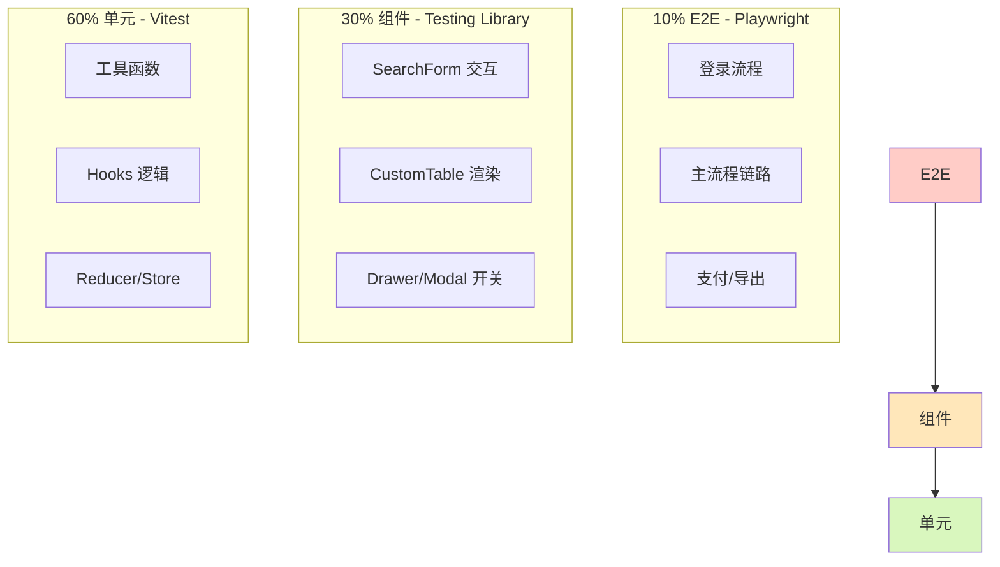

# [项目名称] - 前端开发指南

| 版本 | 日期 | 作者 | 说明 |
|------|------|------|------|
| 1.0 | YYYY-MM-DD | Your Name | 初始版本 |

---

>  **填写指南**：本文档规范前端开发的技术标准，包含 UI 规范、组件规范、交互规范三大部分。
>
>  **一页纸摘要**:
> 1. 看完这页能回答:前端怎么写?用什么组件?UI/交互规范是什么?
> 2. 文档定位:开发级(技术级),前端规范手册
> 3. 核心动作:UI 规范 + 组件规范 + 交互规范 + 微前端/移动端
> 4. 何时使用:前端开发日常 / Code Review / 新人上手
> 5. 不要用于:具体交互细节(→10)、UI 还原(→FigmaMake)
>
>  **关键引用**: `reference/12-value-matrix.md` (前端规范价值) · [`reference/13-quality-selfcheck.md`](../reference/13-quality-selfcheck.md) (组件自检) · [`reference/15-five-field-crosscheck.md`](../reference/15-five-field-crosscheck.md) (5 字段交叉)

## 0. 填写指南

### 0.0 本文档价值

> **回答的核心问题**：前端怎么实现？技术栈？规范？Mock 怎么用？
>
> **不回答什么**：后端实现（→09）、具体页面交互（→10）
>
> **价值判定**：前端工程师按指南即可开工
>
> **所属阶段**：开发（技术级）

### 0.1 文档结构

本文档分为三大板块，可根据项目需要选择性填写：

| 板块 | 内容 | 必填 |
|------|------|------|
| **UI 规范** | 视觉设计：颜色、字体、布局、间距 | ✅ |
| **组件规范** | 组件使用：表单、表格、抽屉、空状态 | ✅ |
| **交互规范** | 用户体验：动效、反馈、状态、提示 | ✅ |

### 0.2 填写说明

| 章节 | 填写内容 | 参考来源 |
|------|----------|----------|
| 1. 技术栈 | 当前项目使用的技术版本 | package.json |
| 2. 项目结构 | 实际的项目目录结构 | src/ 目录 |
| 3. UI 规范 | 颜色、字体、布局、间距 | GlobalStyled.jsx |
| 4. 组件规范 | 组件使用方式和示例 | 现有组件封装 |
| 5. 交互规范 | 动效、反馈、提示等 | 产品需求 |

---

## 1. 技术栈

⭐ **关键决策**：**React 18 + Ant Design 5 + styled-components + React Query**（B 端内部工具推荐组合）。
- **React 18**：并发渲染（Suspense/Transition），团队熟悉度
- **Ant Design 5**：B 端组件覆盖 80% 场景（Table/Form/Modal 全套）
- **styled-components**：组件级样式隔离 + 动态主题
- **React Query**：服务端状态管理（替代 Redux 80% 场景）
- **MSW**：Mock 服务（支持开发/测试双场景）
- **ECharts**：复杂图表（Dashboard/统计页必选）

```mermaid
flowchart TB
    subgraph 基础层
        React[React 18]
        Router[React Router]
        State[Zustand / Redux]
    end
    subgraph UI 层
        Antd[Ant Design 5]
        Styled[styled-components]
        Icons[@ant-design/icons]
    end
    subgraph 数据层
        Axios[Axios]
        MSW[MSW Mock]
        RQ[React Query]
    end
    subgraph 工具层
        ECharts[ECharts 5]
        Dayjs[Day.js]
        Hooks[ahooks]
    end
    React --> Antd
    React --> State
    React --> Axios
    Antd --> Styled
    Antd --> Icons
    Axios --> MSW
    React --> RQ
    style React fill:#61dafb
    style Antd fill:#ff7875
```

| 技术 | 版本 | 说明 |
|------|------|------|
| React | 18.x | 框架 |
| Ant Design | 5.x | UI组件库 |
| styled-components | 6.x | 样式方案 |
| echarts | 5.x | 图表（按需引入） |

---

## 2. 项目结构

遵循 `Component + Styled + Service` 三合一模式：

```
pages/{ModuleName}/
├── {ModuleName}.jsx          # 视图组件
├── {ModuleName}Styled.jsx    # styled-components样式
├── components/                # 子组件目录
│   ├── {SubComponent}.jsx
│   └── {SubComponent}Styled.jsx
├── hooks/                    # 自定义 Hooks 目录
│   └── use{ModuleName}Service.js
├── utils/                    # 工具函数目录
│   └── index.js
└── index.js                  # 统一导出
```

---

## 3. UI 规范

>  **填写要点**：UI 规范描述"长什么样"，包括颜色、文字、布局、间距。

### 3.1 颜色系统

>  **状态说明**：`✅ 已验证` = 与源码一致 | `❌ 不匹配` = 需修正 | `⏳ 待验证` = 未对照源码

#### 3.1.1 主色板（必须验证 GlobalStyled.jsx）

| 用途 | 色值 | RGB值 | 代码来源 | 状态 |
|------|------|-------|----------|------|
| **主操作色** | #635BFF | rgb(99,91,255) | GlobalStyled.jsx | ⏳ |
| 主操作 hover | #e5e4ff | - | GlobalStyled.jsx | ⏳ |
| **成功色** | #15b79f | rgb(21,183,159) | GlobalStyled.jsx | ⏳ |
| 成功 hover | #19d2b6 | - | GlobalStyled.jsx | ⏳ |
| **危险色** | #fb5248 | rgb(251,82,72) | GlobalStyled.jsx | ⏳ |
| 危险 hover | #fc746d | - | GlobalStyled.jsx | ⏳ |

⚠ **注意**：
- 成功色是 `#15b79f`，**不是** `#10b981`
- 颜色必须从 GlobalStyled.jsx 源码验证，不要使用近似值

#### 3.1.2 文字色板

| 用途 | 色值 | RGB值 | 代码来源 | 状态 |
|------|------|-------|----------|------|
| **主文字** | #212636 | rgb(33,38,54) | GlobalStyled.jsx | ⏳ |
| **辅助文字** | #667085 | rgb(102,112,133) | GlobalStyled.jsx | ⏳ |
| 占位文字 | #c4c9d4 | - | GlobalStyled.jsx | ⏳ |
| 反色文字 | #ffffff | - | GlobalStyled.jsx | ⏳ |

#### 3.1.3 背景色板

| 用途 | 色值 | 代码来源 | 状态 |
|------|------|----------|------|
| **页面背景** | #f9fafb | LayoutStyled.jsx | ⏳ |
| **卡片背景** | #ffffff | 各页面 Styled | ⏳ |
| 信息卡片背景 | #f9fafb | 各页面 Styled | ⏳ |
| 表格表头背景 | #fafafa | CustomTableStyled | ⏳ |
| 提示说明背景 | #f0f9ff | 各页面 Styled | ⏳ |
| 错误提示背景 | #fef2f2 | 各页面 Styled | ⏳ |

#### 3.1.4 边框色板

| 用途 | 色值 | 代码来源 | 状态 |
|------|------|----------|------|
| **表格边框** | #DCDFE4 | GlobalStyled.jsx | ⏳ |
| 分割线 | #f0f0f0 | 各页面 Styled | ⏳ |
| 错误提示边框 | #fecaca | 各页面 Styled | ⏳ |

### 3.2 字体系统

#### 3.2.1 字体族

| 用途 | 字体 |
|------|------|
| 全局字体 | Microsoft YaHei, Helvetica Neue, Arial, sans-serif |

#### 3.2.2 字号字重

| 元素 | 字号 | 字重 | 颜色 | 行高 |
|------|------|------|------|------|
| 页面大标题 | 20px | 400 | #212636 | 28px |
| 卡片标题 | 16px | **600** | #212636 | 24px |
| 正文强调 | 14px | **500** | #212636 | 20px |
| 正文 | 14px | 400 | #212636 | 20px |
| 辅助/标签 | 12px | 400 | #667085 | 16px |

### 3.3 间距系统

⭐ **关键决策**：**8 倍数栅格**（4/8/12/16/24/32/48px），**禁止 5/7/9/13 等非栅格数值**。
- **理由**：8 倍数对齐像素网格（避免亚像素模糊），与主流设计工具（Figma/Sketch）默认栅格一致
- **例外**：4px 用于 icon 内边距、极小间距

| 用途 | 数值 | 说明 |
|------|------|------|
| **页面内边距** | 24px | 容器内边距 |
| **卡片间距** | 24px | 卡片之间距离 |
| **元素间距** | 16px | 元素之间距离 |
| 网格间距 | 16px | 网格元素间距 |
| 表单项间距 | 12px | 表单内间距 |
| 紧凑间距 | 8px | 小间距 |
| 极小间距 | 4px | 最小间距 |

### 3.4 圆角系统

| 用途 | 数值 |
|------|------|
| 卡片圆角 | **8px** |
| 按钮圆角 | **8px** |
| 输入框圆角 | **8px** |
| 标签圆角 | 4px |
| 小按钮圆角 | 4px |

### 3.5 布局系统

| 用途 | 数值 |
|------|------|
| **内容区最大宽度** | 1392px |
| **内容区最小宽度** | 916px |
| **页面背景色** | #f9fafb |
| **侧边栏宽度** | 220px（如有） |

### 3.6 阴影系统

| 用途 | 数值 |
|------|------|
| 卡片阴影 | 0 1px 3px rgba(0,0,0,0.08) |
| 弹窗阴影 | 0 4px 12px rgba(0,0,0,0.15) |
| 下拉阴影 | 0 2px 8px rgba(0,0,0,0.12) |

---

## 4. 组件规范

⭐ **关键决策**：**5 个核心组件 + 2 个扩展组件**（StatCard/Empty/Modal/Drawer/SearchForm + CustomTable/Tag），业务页面基于这 7 个组件拼装，禁止"每个页面自己造轮子"。
- **SearchForm**：所有列表页的查询区域统一样式
- **CustomTable**：支持固定列/排序/分页/批量操作/列设置
- **Drawer**：详情页首选（PC 端，桌面空间充足）
- **Modal**：表单/确认弹窗（破坏性操作必须二次确认）
- **StatCard**：Dashboard 统计卡片
- **Empty**：空状态（无数据/无搜索结果/无权限）
- **Tag**：状态/分类标签

>  **填写要点**：组件规范描述"用什么组件"，包括组件的使用方式和示例。

### 4.1 搜索表单 (SearchForm)

#### 使用场景
列表页的筛选查询区域

#### 代码示例

```jsx
import SearchForm from 'src/components/SearchForm';

// 基础用法
<SearchForm
  defaultValues={{ status: '', keyword: '' }}
  buttonsInline={false}
  items={[
    {
      key: 'keyword',
      label: '关键词',
      render: <Input placeholder="请输入关键词" />,
    },
    {
      key: 'status',
      label: '状态',
      render: (
        <Select placeholder="请选择状态">
          <Select.Option value="">全部</Select.Option>
          <Select.Option value="1">启用</Select.Option>
          <Select.Option value="0">禁用</Select.Option>
        </Select>
      ),
    },
    {
      key: 'dateRange',
      label: '时间范围',
      render: <DatePicker.RangePicker />,
    },
  ]}
  onQuery={(values) => console.log('查询:', values)}
  onReset={() => console.log('重置')}
/>
```

#### 参数说明

| 参数 | 类型 | 必填 | 说明 |
|------|------|------|------|
| defaultValues | Object | 否 | 默认值 |
| items | Array | 是 | 表单项配置 |
| onQuery | Function | 是 | 查询回调 |
| onReset | Function | 否 | 重置回调 |
| buttonsInline | Boolean | 否 | 按钮是否一行展示 |

### 4.2 表格 (CustomTable)

#### 使用场景
列表页的数据展示

#### 代码示例

```jsx
import CustomTable from 'src/components/CustomTable';

const columns = [
  { title: 'ID', dataIndex: 'id', width: 80 },
  { title: '名称', dataIndex: 'name' },
  { title: '状态', dataIndex: 'status', render: (val) => statusMap[val] },
  { title: '创建时间', dataIndex: 'createdAt' },
  {
    title: '操作',
    width: 120,
    render: (text, record) => (
      <Space>
        <span className="primary" onClick={() => handleEdit(record)}>编辑</span>
        <span className="danger" onClick={() => handleDelete(record)}>删除</span>
      </Space>
    ),
  },
];

<CustomTable
  columns={columns}
  dataSource={data}
  loading={loading}
  rowKey="id"
  pagination={{
    current: page,
    pageSize: pageSize,
    total: total,
    onChange: (p, ps) => handlePageChange(p, ps),
  }}
/>
```

#### 列配置说明

| 配置项 | 说明 | 注意事项 |
|--------|------|----------|
| title | 列标题 | - |
| dataIndex | 数据字段 | 与接口返回字段一致 |
| width | 列宽度 | **建议给每列设置宽度** |
| render | 自定义渲染 | 用于状态、按钮等 |
| sorter | 排序配置 | 用于可排序列 |

### 4.3 详情抽屉 (Drawer)

#### 使用场景
查看详情、快捷编辑

#### 代码示例

```jsx
import Drawer from 'src/components/Drawer';

<Drawer
  title="详情"
  width={560}
  open={drawerVisible}
  onClose={() => setDrawerVisible(false)}
>
  <DetailContent>
    <DetailItem label="字段1" value={detailData.field1} />
    <DetailItem label="字段2" value={detailData.field2} />
    <DetailItem label="状态" value={statusMap[detailData.status]} />
  </DetailContent>
</Drawer>
```

#### 参数说明

| 参数 | 类型 | 必填 | 说明 |
|------|------|------|------|
| title | string | 是 | 抽屉标题 |
| width | number | 否 | 抽屉宽度，默认 560 |
| open | boolean | 是 | 是否打开 |
| onClose | function | 是 | 关闭回调 |

### 4.4 空状态 (Empty)

#### 使用场景
无数据时、加载失败时

#### 代码示例

```jsx
import Empty from 'src/components/Empty';

// 无数据空状态
<Empty title="暂无数据" hasDesc={true} desc="请先创建数据" />

// 加载失败空状态
<Empty
  type="error"
  title="加载失败"
  desc="点击重新加载"
  onRetry={() => loadData()}
/>
```

### 4.5 统计卡片 (StatCard)

#### 使用场景
概览页的数据统计展示

#### 代码示例

```jsx
import StatCard from 'src/components/StatCard';

<StatCardGrid columns={4} gap={16}>
  <StatCard
    title="总数量"
    value={stats.total}
    icon={<TotalIcon />}
    trend={{ value: 12, direction: 'up' }}
  />
  <StatCard
    title="已完成"
    value={stats.completed}
    icon={<CompletedIcon />}
    color="success"
  />
  <StatCard
    title="处理中"
    value={stats.processing}
    icon={<ProcessingIcon />}
    color="processing"
  />
  <StatCard
    title="失败"
    value={stats.failed}
    icon={<FailedIcon />}
    color="danger"
  />
</StatCardGrid>
```

### 4.6 弹窗/确认 (Modal)

#### 使用场景
重要操作确认、详情展示

#### 代码示例

```jsx
import { Modal } from 'antd';

// 确认弹窗
Modal.confirm({
  title: '确认删除',
  content: '删除后数据无法恢复，是否确认？',
  okText: '确认',
  cancelText: '取消',
  okType: 'danger',
  onOk: () => handleDelete(),
});

// 自定义内容弹窗
<Modal
  title="详情"
  open={modalVisible}
  onCancel={() => setModalVisible(false)}
  footer={null}
  width={600}
>
  <DetailContent>...</DetailContent>
</Modal>
```

---

## 5. 交互规范

> 💫 **填写要点**：交互规范描述"怎么动、怎么反馈"，包括动效、反馈、状态、提示。

### 5.1 动效规范

#### 5.1.1 过渡动效

| 动效类型 | 时长 | 缓动函数 | 使用场景 |
|----------|------|----------|----------|
| 快速过渡 | 150ms | ease-out | 按钮 hover、颜色变化 |
| 标准过渡 | 200ms | ease-in-out | 展开/收起、显示/隐藏 |
| 慢速过渡 | 300ms | ease-in-out | 页面切换、复杂动画 |

#### 5.1.2 页面动效

| 动效 | 参数 | 说明 |
|------|------|------|
| 页面进入 | fade + slide-up, 300ms | 内容区淡入上移 |
| 列表加载 | fade-in, 200ms | 数据逐行淡入 |
| 卡片加载 | fade-in, 150ms | 卡片依次淡入 |

#### 5.1.3 组件动效

| 组件 | 动效 | 参数 |
|------|------|------|
| 抽屉 | slide-in-right | width: 560px, 200ms |
| 弹窗 | fade + scale | 200ms, scale 0.95→1 |
| 下拉 | fade + slide-down | 150ms |
| 折叠 | height transition | 200ms |
| 按钮 | scale 0.98 on press | 100ms |

### 5.2 反馈规范

#### 5.2.1 操作反馈

| 操作 | 反馈形式 | 反馈内容 |
|------|----------|----------|
| 按钮点击 | 缩放 + 颜色变化 | scale 0.98, 颜色加深 |
| 提交成功 | 消息提示 | "操作成功" |
| 提交失败 | 错误提示 | 红色文字说明原因 |
| 加载中 | Loading 态 | 显示 spinner |

#### 5.2.2 消息提示

| 类型 | 使用场景 | 时长 | 位置 |
|------|----------|------|------|
| 成功提示 | 操作成功 | 3s | 顶部居中 |
| 错误提示 | 操作失败 | 手动关闭 | 顶部居中 |
| 警告提示 | 警告信息 | 5s | 顶部居中 |
| 加载提示 | 异步操作 | 手动关闭 | 内容区中央 |

### 5.3 状态规范

#### 5.3.1 通用状态

| 状态值 | 显示名称 | 颜色 | Ant Design Tag |
|--------|----------|------|----------------|
| pending | 待处理 | #f59e0b | warning |
| processing | 处理中 | #3b82f6 | processing |
| completed | 已完成 | #15b79f | success |
| failed | 失败 | #fb5248 | error |
| cancelled | 已取消 | #667085 | default |

#### 5.3.2 布尔状态

| 状态值 | 显示名称 | 颜色 |
|--------|----------|------|
| true | 是 | #15b79f |
| false | 否 | #fb5248 |

#### 5.3.3 操作按钮状态

| 状态 | 样式 |
|------|------|
| 可操作 | className="primary" |
| 禁用 | className="disabled" |
| 危险操作 | className="danger" |
| 辅助操作 | className="gray" |

### 5.4 加载规范

#### 5.4.1 页面加载

| 场景 | 加载方式 | 说明 |
|------|----------|------|
| 首次进入 | Skeleton 骨架屏 | 模拟内容布局 |
| 刷新数据 | Loading overlay | 局部加载 |
| 切换分页 | 表格 loading | 表格区域加载 |

#### 5.4.2 按钮加载

| 场景 | 反馈 |
|------|------|
| 表单提交中 | 按钮显示 loading，禁止重复点击 |
| 异步操作 | 按钮禁用，显示 spinner |

### 5.5 表单交互规范

#### 5.5.1 校验交互

| 触发时机 | 反馈形式 | 颜色 |
|----------|----------|------|
| 失焦时校验 | 红色边框 + 错误提示 | #fb5248 |
| 聚焦时清除 | 清除错误状态 | - |
| 提交时校验 | 滚动到第一个错误 | - |

#### 5.5.2 必填标识

- 必填字段用红色星号 `*` 标识
- 星号颜色：#fb5248
- 位置：字段标签右侧

### 5.6 响应式规范

| 断点 | 宽度 | 布局变化 |
|------|------|----------|
| 超大屏 | > 1400px | 最大宽度 1392px 居中 |
| 大屏 | 1200-1400px | 正常宽度 |
| 中屏 | 992-1200px | 表格列宽调整 |
| 小屏 | 768-992px | 卡片单列 |
| 平板 | < 768px | 抽屉宽度 100% |

---

## 6. 页面布局模板

>  **填写要点**：描述页面的布局结构，包括容器、卡片、组件的层级关系。

### 6.1 概览页模板

```
页面容器 (padding 24px, background #f9fafb, min-height 100vh)
├── 页面标题 (20px, margin-bottom 16px)
├── 统计卡片网格 (grid 4列, gap 16px, margin-bottom 24px)
│   ├── 统计卡片1
│   ├── 统计卡片2
│   ├── 统计卡片3
│   └── 统计卡片4
├── 图表卡片 (margin-bottom 24px)
│   └── ECharts 图表 (height 300px)
└── 列表卡片
    └── CustomTable 表格
```

### 6.2 列表页模板

```
页面容器 (padding 24px, background #f9fafb, min-height 100vh)
├── 页面标题 (20px, margin-bottom 16px)
├── 搜索卡片 (background #fff, padding 16px, margin-bottom 16px)
│   └── SearchForm 搜索表单
├── 表格卡片 (background #fff, padding 16px)
│   ├── CustomTable 表格
│   └── 分页器 (右对齐, margin-top 16px)
└── 详情抽屉 (Drawer, width 560px, 右侧滑入)
```

### 6.3 表单页模板

```
页面容器 (padding 24px, background #f9fafb, min-height 100vh)
├── 页面标题 (20px, margin-bottom 16px)
├── 表单卡片 (background #fff, padding 24px)
│   ├── Form 表单
│   │   ├── 基础信息区域
│   │   ├── 扩展信息区域
│   │   └── 附件上传区域
│   └── 操作按钮区域 (flex, 右对齐, margin-top 24px)
│       ├── 取消按钮
│       └── 提交按钮
```

---

## 7. 注意事项

### 7.1 必须遵守

1. **必须使用 Ant Design 组件**，不要使用原生 HTML 元素
2. **颜色必须验证 GlobalStyled.jsx**，不要使用近似值
3. **搜索表单使用 SearchForm 组件**
4. **表格使用 CustomTable 组件**
5. **遵循三合一模式**：组件 + Styled + Service
6. **API 必须统一封装**

### 7.2 常见错误

| 错误 | 正确做法 |
|------|----------|
| 使用 `<button>` | 使用 `<Button>` |
| 使用 `<input>` | 使用 `<Input>` |
| 硬编码颜色 #10b981 | 使用 #15b79f |
| 直接使用 antd Table | 使用 CustomTable |
| API 写在组件里 | 统一封装 |

### 7.3 性能注意

| 注意项 | 说明 |
|--------|------|
| useEffect 依赖 | 必须声明依赖数组 |
| 大列表分页 | 不要一次加载全部 |
| 表单提交 | 禁用按钮防重复 |
| useMemo/useCallback | 合理使用避免重渲染 |

---

## 8. 参考资源

### 8.1 源码位置

| 规范内容 | 代码文件 |
|----------|----------|
| 全局颜色 | src/styles/GlobalStyled.jsx |
| 页面布局 | src/styles/LayoutStyled.jsx |
| 组件封装 | src/components/ |

### 8.2 学习资源

| 资源 | 链接 |
|------|------|
| Ant Design | https://ant.design/docs/react/introduce |
| styled-components | https://styled-components.com/docs |
| React 官方 | https://react.dev |

---

## 9. 前端开发指南检查清单

> ✅ **完成后逐项检查，确保开发指南可作为开发依据**

### 9.1 设计规范

| 检查项 | 状态 |
|--------|------|
| 色板已从 GlobalStyled.jsx 源码验证 | ☐ |
| 字号规范已定义 | ☐ |
| 间距规范已定义 | ☐ |
| 组件样式已统一 | ☐ |

### 9.2 代码规范

| 检查项 | 状态 |
|--------|------|
| 命名规范已说明 | ☐ |
| 目录结构已绘制 | ☐ |
| ESLint 配置已记录 | ☐ |
| 提交规范已定义 | ☐ |

### 9.3 业务组件

| 检查项 | 状态 |
|--------|------|
| 通用组件 API 已说明 | ☐ |
| 业务组件使用示例完整 | ☐ |
| 常用 Hook 已封装 | ☐ |

### 9.4 联调对接

| 检查项 | 状态 |
|--------|------|
| API 封装模式已说明 | ☐ |
| Mock 方案已定义 | ☐ |
| 错误处理有规范 | ☐ |

---

## 10. 微前端架构

### 10.1 方案选型

| 方案 | 原理 | 适用场景 | 优点 | 缺点 |
|------|------|----------|------|------|
| **qiankun** | 基于 single-spa + HTML Entry | 多技术栈共存 | 成熟、文档全 | 沙箱开销大、样式隔离需手动 |
| **MicroApp** (京东) | 类 Web Component | React/Vue 混合 | 零依赖、API 简洁 | 生态较新 |
| **Module Federation** | Webpack 5 原生 | 单一技术栈 | 性能优、共享依赖 | 强耦合 Webpack、Vite 需插件 |
| **Wujie** (腾讯) | Web Component + iframe 沙箱 | 极致隔离 | 完美样式/JS 隔离 | iframe 性能损失 |
| **EMP** (字节) | Module Federation 微前端 | 字节系 | 字节内部验证 | 社区较小 |

**选型建议**：
- 老项目接入 → qiankun
- 全新项目、React/Vue 混合 → MicroApp
- 单一技术栈、追求性能 → Module Federation
- 跨团队老系统 → Wujie

### 10.2 qiankun 落地要点

```javascript
// 主应用注册
import { registerMicroApps, start } from 'qiankun';

registerMicroApps([
  {
    name: 'sub-app-customer',
    entry: '//localhost:7001',
    container: '#subapp-container',
    activeRule: '/customer',
    props: { token: getToken() }
  }
]);

start({ sandbox: { strictStyleIsolation: true } });
```

**关键配置**：
- `sandbox.strictStyleIsolation` - 严格样式隔离（基于 Shadow DOM）
- `prefetch: 'all'` - 预加载所有子应用
- `props` - 父子通信（推荐替代全局状态）

### 10.3 父子通信模式

| 方式 | 适用 | 性能 |
|------|------|------|
| **props 传值** | 简单数据 | 高 |
| **全局 EventBus** | 跨应用事件 | 中 |
| **Shared Store** (Redux/Zustand) | 复杂共享 | 需对齐依赖 |
| **URL 参数** | 路由级共享 | 高 |

---

## 11. 移动端适配

### 11.1 方案对比

| 方案 | 原理 | 适用 | 性能 |
|------|------|------|------|
| **H5 + rem/vw** | CSS 媒体查询 + 视口单位 | 营销页、活动页 | 高 |
| **PWA** | Service Worker + Manifest | 离线可用站点 | 高 |
| **uni-app** | 一码多端编译 | 全端覆盖 | 中 |
| **Taro** | React 语法多端编译 | 熟悉 React 团队 | 中 |
| **原生 + 小程序** | 双端原生 | 性能敏感 | 高 |
| **React Native / Flutter** | 跨端原生渲染 | App 优先 | 高 |

### 11.2 视口与 rem 适配

```javascript
// rem 适配方案（750 设计稿）
function setRem() {
  const baseSize = 100; // 1rem = 100px 设计稿
  const baseWidth = 750; // 设计稿宽度
  const scale = document.documentElement.clientWidth / baseWidth;
  document.documentElement.style.fontSize = baseSize * Math.min(scale, 2) + 'px';
}
window.addEventListener('resize', setRem);
setRem();
```

**PostCSS 配置**：
```javascript
// postcss.config.js
module.exports = {
  plugins: {
    'postcss-px-to-viewport': {
      unitToConvert: 'px',
      viewportWidth: 750,
      unitPrecision: 5,
      propList: ['*'],
      viewportUnit: 'vw',
      fontViewportUnit: 'vw',
    }
  }
};
```

### 11.3 安全区域适配

```css
/* iPhone 刘海屏 */
.safe-area-top { padding-top: env(safe-area-inset-top); }
.safe-area-bottom { padding-bottom: env(safe-area-inset-bottom); }

/* 底部 Home Indicator */
.home-indicator { margin-bottom: env(safe-area-inset-bottom); }
```

---

## 12. 性能优化

### 12.1 性能指标 Core Web Vitals

| 指标 | 目标值 | 含义 |
|------|--------|------|
| **LCP** (Largest Contentful Paint) | ≤ 2.5s | 最大内容渲染时间 |
| **INP** (Interaction to Next Paint) | ≤ 200ms | 交互响应 |
| **CLS** (Cumulative Layout Shift) | ≤ 0.1 | 视觉稳定性 |
| **FCP** (First Contentful Paint) | ≤ 1.8s | 首次内容渲染 |
| **TTFB** (Time to First Byte) | ≤ 800ms | 首字节时间 |

### 12.2 首屏加载优化

| 优化项 | 手段 | 预期收益 |
|--------|------|----------|
| **资源体积** | 路由级 code splitting、Tree Shaking | -30%~50% |
| **图片优化** | WebP/AVIF、懒加载、CDN | -50% 体积 |
| **字体优化** | font-display: swap、子集化 | -100ms FCP |
| **关键 CSS** | inline critical CSS、async 其余 | -200ms LCP |
| **骨架屏** | 占位降低 CLS | CLS < 0.1 |
| **SSR/SSG** | Next.js / Nuxt | LCP -50% |

### 12.3 打包优化

```javascript
// vite.config.ts 关键配置
export default defineConfig({
  build: {
    rollupOptions: {
      output: {
        manualChunks: {
          'react-vendor': ['react', 'react-dom'],
          'antd-vendor': ['antd'],
          'echarts-vendor': ['echarts']
        }
      }
    },
    chunkSizeWarningLimit: 600,
    minify: 'terser',
    terserOptions: { compress: { drop_console: true } }
  },
  resolve: {
    alias: { '@': fileURLToPath(new URL('./src', import.meta.url)) }
  }
});
```

**包体积红线**：
- 主包 gzipped ≤ 250KB
- 单路由 lazy chunk ≤ 100KB
- 三方库按需引入

### 12.4 懒加载策略

| 类型 | 实现 |
|------|------|
| **路由级** | `lazy(() => import('./Page'))` |
| **组件级** | `lazy(() => import('./HeavyComponent'))` |
| **图片级** | `loading="lazy"` + IntersectionObserver |
| **数据级** | SWR/React Query 按需请求 |

### 12.5 CDN 加速

```
HTML/CSS/JS      →  static.cdn.com（CDN）
图片/视频/字体   →  oss.cdn.com（OSS + CDN）
API 请求        →  api.example.com（独立域名）
第三方库         →  unpkg.com / jsdelivr
```

### 12.6 HTTP/3 与现代协议

```nginx
# Nginx HTTP/3 配置
add_header Alt-Svc 'h3=":443"; ma=86400';
listen 443 quic;
```

**预连接**：
```html
<link rel="preconnect" href="https://api.example.com">
<link rel="dns-prefetch" href="https://cdn.example.com">
```

---

## 13. 无障碍 A11y

### 13.1 WCAG 2.1 等级

| 等级 | 要求 | 适用 |
|------|------|------|
| **A** | 基本可访问性 | 必达 |
| **AA** | 行业标准 | 必达（推荐） |
| **AAA** | 增强 | 可选 |

### 13.2 关键规则

| 规则 | 要求 |
|------|------|
| 颜色对比度 | 正文 ≥ 4.5:1，大字 ≥ 3:1 |
| 键盘可访问 | 所有交互可用 Tab + Enter/Space |
| 焦点可见 | 焦点环清晰可见 |
| ARIA 标签 | 复杂组件用 aria-label/role |
| 替代文本 | img 必有 alt |
| 跳转链接 | 提供"跳到主内容" |

### 13.3 常见组件 A11y 实践

```html
<!-- 按钮 -->
<button aria-label="关闭" aria-pressed="false">×</button>

<!-- 表单 -->
<label for="email">邮箱</label>
<input id="email" type="email" aria-describedby="email-help" aria-required="true">
<span id="email-help">用于接收通知</span>

<!-- 模态框 -->
<div role="dialog" aria-modal="true" aria-labelledby="dialog-title">
  <h2 id="dialog-title">确认删除？</h2>
</div>

<!-- 加载状态 -->
<div role="status" aria-live="polite">加载中...</div>

<!-- 错误提示 -->
<div role="alert">表单验证失败</div>
```

### 13.4 屏幕阅读器测试

- **NVDA** (Windows, 免费)
- **VoiceOver** (macOS, 内置)
- **TalkBack** (Android, 内置)

---

## 14. 国际化 i18n

### 14.1 库选型

| 库 | 框架 | 特点 |
|----|------|------|
| **react-intl** | React | 强大、支持 ICU |
| **react-i18next** | React | 灵活、插件丰富 |
| **vue-i18n** | Vue | Vue 官方 |
| **Lingui** | 任意 | 编译时、性能优 |

### 14.2 完整 i18n 架构

```
locales/
├── zh-CN.json      # 简体中文
├── en-US.json      # 美式英语
├── zh-HK.json      # 繁体（香港）
├── ja-JP.json      # 日语
└── ar-SA.json      # 阿拉伯语（RTL）
```

**约定**：
- 键名用 `模块.子模块.功能.文本` 形式，如 `customer.list.title`
- 文本含占位符：`"你好, {name}"` → `formatMessage({id}, {name: '张三'})`
- 数字/日期/货币用 `Intl` API

### 14.3 切换与 RTL

```javascript
// 语言切换
import { IntlProvider } from 'react-intl';
import zhCN from './locales/zh-CN.json';

<IntlProvider locale="zh-CN" messages={zhCN}>
  <App />
</IntlProvider>
```

```css
/* RTL 适配 */
[dir="rtl"] .sidebar { right: 0; left: auto; }
[dir="rtl"] .icon-arrow-right::before { content: '←'; }
```

### 14.4 文案管理平台

| 平台 | 特点 |
|------|------|
| **i18next** | 配合 Locize 平台 |
| **Crowdin** | 协作翻译、机器翻译 |
| **Lokalise** | 开发者友好、CI 集成 |
| **Phrase** | 企业级、SDK 多 |
| **自研** | 简单项目、JSON 文件 + Git |

---

## 15. 深色模式

### 15.1 三种实现方式

| 方式 | 优点 | 缺点 |
|------|------|------|
| **CSS 变量** | 简单、零运行时 | 需手动覆盖 |
| **CSS-in-JS Theme** | 类型安全 | 运行时开销 |
| **Tailwind dark:** | 工具类丰富 | 配置文件大 |

### 15.2 CSS 变量方案

```css
:root {
  --color-bg: #ffffff;
  --color-text: #212636;
  --color-border: #f0f0f0;
}

[data-theme="dark"] {
  --color-bg: #1a1a1a;
  --color-text: #e5e7eb;
  --color-border: #374151;
}

body {
  background: var(--color-bg);
  color: var(--color-text);
  transition: background 0.2s, color 0.2s;
}
```

### 15.3 监听系统偏好

```javascript
const darkModeQuery = window.matchMedia('(prefers-color-scheme: dark)');
const isDark = darkModeQuery.matches;

document.documentElement.setAttribute('data-theme', isDark ? 'dark' : 'light');
darkModeQuery.addEventListener('change', e => {
  document.documentElement.setAttribute('data-theme', e.matches ? 'dark' : 'light');
});
```

### 15.4 持久化用户选择

```javascript
// localStorage 优先，缺失时跟随系统
function getTheme() {
  const stored = localStorage.getItem('theme');
  if (stored) return stored;
  return window.matchMedia('(prefers-color-scheme: dark)').matches ? 'dark' : 'light';
}
```

---

## 16. 前端测试

### 16.1 测试金字塔

⭐ **关键决策**：**60/30/10 比例**（单元 60% / 组件 30% / E2E 10%），**E2E 只覆盖核心 5 路径**（登录/主流程/支付/导出/权限）避免维护成本爆炸。



### 16.2 Vitest 单元测试

```typescript
import { describe, it, expect } from 'vitest';
import { formatPrice } from './utils';

describe('formatPrice', () => {
  it('formats cents to CNY', () => {
    expect(formatPrice(12345)).toBe('¥123.45');
  });
  it('handles zero', () => {
    expect(formatPrice(0)).toBe('¥0.00');
  });
});
```

### 16.3 Testing Library 组件测试

```typescript
import { render, screen } from '@testing-library/react';
import userEvent from '@testing-library/user-event';
import { SearchForm } from './SearchForm';

it('submits search query', async () => {
  const onSearch = vi.fn();
  render(<SearchForm onSearch={onSearch} />);
  
  await userEvent.type(screen.getByRole('textbox'), 'hello');
  await userEvent.click(screen.getByRole('button', { name: '搜索' }));
  
  expect(onSearch).toHaveBeenCalledWith('hello');
});
```

### 16.4 Playwright E2E 测试

```typescript
import { test, expect } from '@playwright/test';

test('user can login and view dashboard', async ({ page }) => {
  await page.goto('/login');
  await page.fill('input[name=username]', 'admin');
  await page.fill('input[name=password]', 'pass');
  await page.click('button[type=submit]');
  
  await expect(page).toHaveURL(/dashboard/);
  await expect(page.getByRole('heading', { name: '欢迎' })).toBeVisible();
});
```

### 16.5 覆盖率要求

| 类型 | 覆盖率目标 |
|------|-----------|
| 工具函数 | ≥ 90% |
| 业务组件 | ≥ 70% |
| 页面组件 | ≥ 50% |
| 整体 | ≥ 60% |

---

## 17. 前端安全

⭐ **关键决策**：**React 默认转义 + 严格 CSP + 不用 dangerouslySetInnerHTML**，**Cookie SameSite=Strict + CSRF Token**。
- **XSS**：用户输入永远不可信，列表/详情渲染走 React 文本插值（自动转义）
- **CSRF**：POST/PUT/DELETE 必须带 CSRF Token（从 Cookie 读 + Header 校验）
- **SRI**：CDN 资源加 integrity 哈希，防篡改
- **npm**：CI 必须跑 `npm audit` + `npm outdated` 阻断高危依赖

### 17.1 XSS 防御

| 风险 | 防御 |
|------|------|
| **存储型** | React 默认转义、避免 `dangerouslySetInnerHTML` |
| **反射型** | 不读取 URL 参数直接渲染 |
| **DOM 型** | 不用 `eval`、不用 `Function`、不用 `innerHTML` |

**CSP 配置**：
```http
Content-Security-Policy: default-src 'self'; script-src 'self' 'nonce-{random}'; style-src 'self' 'unsafe-inline'; img-src 'self' data: https:;
```

### 17.2 CSRF 防御

| 手段 | 实现 |
|------|------|
| **SameSite Cookie** | `Set-Cookie: session=xxx; SameSite=Strict; Secure; HttpOnly` |
| **CSRF Token** | 隐藏字段 + 服务端校验 |
| **Origin 验证** | 服务端检查 `Origin`/`Referer` |
| **双重提交 Cookie** | Cookie + Header 一致性 |

### 17.3 SRI 资源完整性

```html
<script src="https://cdn.example.com/lib.js"
  integrity="sha384-{hash}"
  crossorigin="anonymous"></script>
```

### 17.4 敏感信息处理

| 场景 | 措施 |
|------|------|
| **Token 存储** | `httpOnly` Cookie > `sessionStorage` > `localStorage` |
| **前端脱敏** | 手机号 `138****5678`、身份证 `110***********1234` |
| **日志过滤** | console.log 移除敏感字段 |
| **错误信息** | 生产环境不暴露堆栈 |

### 17.5 npm 安全

```bash
# 检查依赖漏洞
npm audit
npm audit fix

# 检查过期依赖
npx npm-check-updates

# Snyk 深度扫描
npx snyk test
```

**lock 文件必提交**（避免供应链漂移）

---

## 段完成度自检（更新）

- [x] 1-9. 原基础章节完整
- [x] 10. 微前端架构方案已选型
- [x] 11. 移动端适配方案已确定
- [x] 12. 性能指标有基线 + 优化策略
- [x] 13. A11y 达 WCAG AA 等级
- [x] 14. i18n 至少支持中英文
- [x] 15. 深色模式可切换
- [x] 16. 测试金字塔三层覆盖
- [x] 17. 安全规范（XSS/CSRF/SRI）已说明

**下游依赖**：
- 13-架构设计.md：依赖本章 → 部署 + 监控
- 09-后端开发指南.md：依赖本章 → 接口契约


## 摘要(降级输出,200 字内)

> 模板定位摘要(全受众可见)。完整定义见下方各章。
> 模板定位:0.0 本文档价值

**模板说明**:`[项目名称] - 前端开发指南`

**关键数字/对象**:见完整版

**完整版见**:`04-前端开发指南.md`(主受众可访问)
