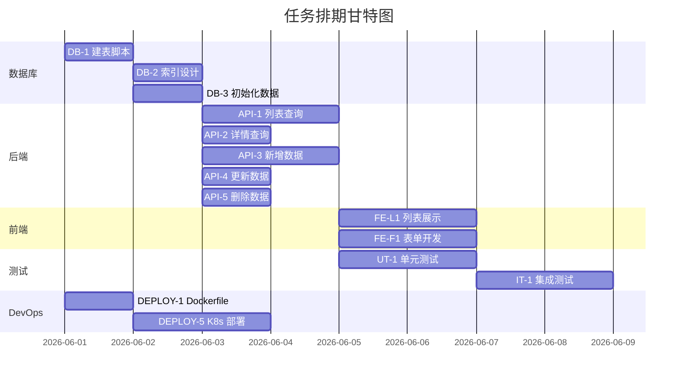

# [项目名称] - 任务拆分与交付

| 版本 | 日期 | 作者 | 说明 |
|------|------|------|------|
| 1.0 | YYYY-MM-DD | Your Name | 初始版本 |

---

> 📖 **填写指南**：本文档用于任务分解、测试规划、部署规划，是开发、测试、运维的重要参考。
>
> 📌 **一页纸摘要**:
> 1. 看完这页能回答:谁、什么时间、做什么任务、怎么验收?
> 2. 文档定位:管理级,可直接拿来做排期
> 3. 核心动作:DB→后端→前端→测试→DevOps 5 段,每任务 1-3 天 + 验收标准
> 4. 何时使用:项目启动会 / 每周排期 / 跨团队协作对齐
> 5. 不要用于:具体怎么实现(→04/09)、需求定义(→06)
>
> 🔗 **关键引用**: [`reference/13-quality-selfcheck.md`](../reference/13-quality-selfcheck.md) (任务粒度自检) · [`reference/15-five-field-crosscheck.md`](../reference/15-five-field-crosscheck.md) (5字段必含项) · [`reference/16-common-pitfalls.md`](../reference/16-common-pitfalls.md) (任务拆分常见错误)

---

## 0. 填写指南

### 0.0 本文档价值

> **回答的核心问题**：谁、什么时间、做什么任务、怎么验收？
> **不回答什么**：具体怎么做（→04/09）、需求定义（→06）
> **价值判定**：项目经理拿来即可排期，每个任务有负责人 + 验收标准
> **所属阶段**：管理

### 0.1 文档用途

| 章节 | 用途 |
|------|------|
| 数据库设计 | 定义数据表结构、索引、约束 |
| 后端任务 | 后端开发任务分解 |
| 前端任务 | 前端开发任务分解 |
| 测试任务 | 单元测试、集成测试、E2E 测试 |
| DevOps | CI/CD 流水线、部署、监控 |

### 0.2 任务优先级定义

| 优先级 | 定义 | 说明 |
|--------|------|------|
| P0 | 最高 | 阻塞流程，必须优先完成 |
| P1 | 高 | 核心功能，影响主流程 |
| P2 | 中 | 重要功能，不阻塞主流程 |
| P3 | 低 | 辅助功能，可延后 |

### 0.3 工时估算原则

| 类型 | 估算方法 | 说明 |
|------|----------|------|
| 开发 | 经验值 × 1.5 | 考虑调试、联调时间 |
| 测试 | 开发工时 × 0.3 | 功能测试占开发 30% |
| 缓冲 | 总工时 × 0.2 | 应对变更和风险 |

### 0.4 依赖关系

| 符号 | 含义 | 说明 |
|------|------|------|
| - | 无依赖 | 可立即开始 |
| 任务ID | 依赖某任务 | 必须等待前置任务完成 |
| 1,2,3 | 并行依赖 | 等待多个前置任务 |

### 0.5 任务排期甘特图



---

## 1. 数据库设计

⭐ **关键决策**：
- **任务粒度 1-3 天**：> 3 天必再拆（验收节点 = 任务边界）
- **依赖关系必标**：每个任务标"前置任务"和"产出物"
- **并行任务数 ≤ 3**：人月 > 3 必调整，避免单点瓶颈
- **工时含 30% buffer**：开发 5 天 + 测试 2 天 + Buffer 2 天 = 9 天

### 1.1 ER 实体关系图

```
[使用 Mermaid 或 ASCII 绘制完整 ER 图]

示例：
erDiagram
    USER ||--o{ TASK : "拥有"
    TASK ||--o{ COMMENT : "包含"
    USER {
        uuid id PK
        string name
        string email
        string role
        timestamp created_at
    }
    TASK {
        uuid id PK
        uuid user_id FK
        string title
        string status
        timestamp due_date
        timestamp created_at
    }
```

### 1.2 数据表结构

#### 1.2.1 [表名A] (主表)

| 字段名 | 类型 | 约束 | 默认值 | 说明 |
|--------|------|------|--------|------|
| id | BIGINT | PK, AUTO_INCREMENT | - | 主键 |
| uuid | VARCHAR(36) | UNIQUE, NOT NULL | - | 业务主键（UUID） |
| [field_name] | [TYPE] | [约束] | [默认值] | [字段说明] |
| created_by | VARCHAR(36) | NOT NULL | - | 创建人 UUID |
| created_at | DATETIME | NOT NULL | CURRENT_TIMESTAMP | 创建时间 |
| updated_by | VARCHAR(36) | NULL | - | 更新人 UUID |
| updated_at | DATETIME | NOT NULL | CURRENT_TIMESTAMP ON UPDATE | 更新时间 |
| deleted_at | DATETIME | NULL | - | 软删除时间 |

#### 1.2.2 [表名B] (从表/关联表)

| 字段名 | 类型 | 约束 | 默认值 | 说明 |
|--------|------|------|--------|------|
| id | BIGINT | PK, AUTO_INCREMENT | - | 主键 |
| [foreign_key] | BIGINT | FK, NOT NULL | - | 外键关联 [表名A] |
| [field_name] | [TYPE] | [约束] | [默认值] | [字段说明] |
| ... | | | | |

### 1.3 索引设计

| 表名 | 索引名称 | 字段 | 类型 | 唯一 | 说明 |
|------|----------|------|------|------|------|
| [表名A] | idx_[table]_[field] | [field] | BTREE | 否 | [说明] |
| [表名A] | uk_[table]_[field] | [field] | BTREE | 是 | [说明] |
| [表名B] | idx_[table]_[field] | [field1],[field2] | BTREE | 否 | 联合索引 |

### 1.4 字段枚举值定义

| 表名 | 字段 | 枚举值 | 显示名称 | 说明 |
|------|------|--------|----------|------|
| [表名A] | status | pending | 待处理 | 初始状态 |
| [表名A] | status | processing | 处理中 | 处理中 |
| [表名A] | status | completed | 已完成 | 已完成 |
| [表名A] | status | cancelled | 已取消 | 已取消 |
| [表名A] | priority | P0 | 紧急 | 最高优先级 |
| [表名A] | priority | P1 | 高 | 高优先级 |
| [表名A] | priority | P2 | 中 | 中优先级 |
| [表名A] | priority | P3 | 低 | 低优先级 |

### 1.5 数据校验规则

| 字段 | 校验类型 | 规则 | 错误提示 |
|------|----------|------|----------|
| 手机号 | 正则 | ^1[3-9]\d{9}$ | 请输入正确的手机号 |
| 邮箱 | 正则 | ^[\w.-]+@[\w.-]+\.\w+$ | 请输入正确的邮箱 |
| 身份证 | 正则 | ^[1-9]\d{5}(18|19|20)\d{2}(0[1-9]|1[0-2])(0[1-9]|[12]\d|3[01])\d{3}[\dXx]$ | 请输入正确的身份证号 |
| 金额 | 范围 | > 0 且 <= 999999999.99 | 金额必须在有效范围内 |
| 密码 | 长度 | 8-32 位 | 密码长度8-32位 |

### 1.6 软删除与数据隔离

| 策略 | 实现方式 | 说明 |
|------|----------|------|
| 软删除 | deleted_at IS NULL | 仅查询 deleted_at IS NULL 的记录 |
| 数据隔离 | tenant_id / org_id | 多租户/多组织数据隔离字段 |
| 级联删除 | 应用层处理 | 删除前检查关联数据 |

---

## 2. 后端任务拆分

### 2.1 数据库任务

| 序号 | 任务描述 | 预计工时 | 依赖 | 状态 | 验收标准 |
|------|----------|----------|------|------|----------|
| DB-1 | 编写 DDL 建表脚本 | 0.5d | - | ⏳ | 脚本可执行，无语法错误 |
| DB-2 | 设计并创建索引 | 0.5d | DB-1 | ⏳ | 索引符合查询模式 |
| DB-3 | 编写初始化数据脚本 | 0.5d | DB-1 | ⏳ | 包含基础数据、枚举值 |
| DB-4 | 数据库评审（DBA review） | 0.5d | DB-1 | ⏳ | 通过 DBA 审核 |

### 2.2 API 任务

#### 2.2.1 认证相关

| 序号 | 任务描述 | 预计工时 | 依赖 | 状态 | 验收标准 |
|------|----------|----------|------|------|----------|
| AUTH-1 | 登录接口 /api/auth/login | 1d | - | ⏳ | 返回 token，密码加密传输 |
| AUTH-2 | 登出接口 /api/auth/logout | 0.5d | AUTH-1 | ⏳ | token 失效 |
| AUTH-3 | Token 刷新 /api/auth/refresh | 0.5d | AUTH-1 | ⏳ | 返回新 token |
| AUTH-4 | 获取当前用户 /api/auth/me | 0.5d | AUTH-1 | ⏳ | 返回用户信息 |

#### 2.2.2 业务接口

| 序号 | 任务描述 | API 路径 | 预计工时 | 依赖 | 状态 | 验收标准 |
|------|----------|----------|----------|------|------|----------|
| API-1 | 列表查询 | GET /api/v1/{module} | 1d | DB-1 | ⏳ | 分页、筛选、排序正常 |
| API-2 | 详情查询 | GET /api/v1/{module}/{id} | 0.5d | DB-1 | ⏳ | 返回完整数据 |
| API-3 | 新增数据 | POST /api/v1/{module} | 1d | DB-1 | ⏳ | 校验通过后写入 |
| API-4 | 更新数据 | PUT /api/v1/{module}/{id} | 0.5d | API-2 | ⏳ | 部分更新，字段级 |
| API-5 | 删除数据 | DELETE /api/v1/{module}/{id} | 0.5d | API-2 | ⏳ | 软删除 |
| API-6 | 批量删除 | POST /api/v1/{module}/batch-delete | 0.5d | DB-1 | ⏳ | 批量软删除 |
| API-7 | 统计接口 | GET /api/v1/{module}/stats | 0.5d | DB-1 | ⏳ | 返回统计数据 |
| API-8 | 导出数据 | GET /api/v1/{module}/export | 1d | API-1 | ⏳ | Excel/CSV 格式 |
| API-9 | 导入数据 | POST /api/v1/{module}/import | 1d | DB-1 | ⏳ | 支持模板下载、错误报告 |
| API-10 | 文件上传 | POST /api/v1/upload | 1d | - | ⏳ | 返回文件 URL |

### 2.3 业务逻辑任务

| 序号 | 任务描述 | 预计工时 | 依赖 | 状态 | 验收标准 |
|------|----------|----------|------|------|----------|
| BL-1 | 数据校验逻辑 | 1d | API-3,4 | ⏳ | 所有校验规则生效 |
| BL-2 | 状态流转逻辑 | 1d | API-3,4 | ⏳ | 状态机正确流转 |
| BL-3 | 消息通知逻辑 | 0.5d | API-3,4 | ⏳ | 触发通知 |
| BL-4 | 审计日志记录 | 0.5d | API-3,4,5 | ⏳ | 记录操作日志 |

---

## 3. 前端任务拆分

### 3.1 骨架与基础设施

| 序号 | 任务描述 | 预计工时 | 依赖 | 状态 | 验收标准 |
|------|----------|----------|------|------|----------|
| FE-0 | 项目脚手架/路由配置 | 0.5d | - | ⏳ | 页面可访问 |
| FE-1 | 创建页面组件骨架 | 0.5d | FE-0 | ⏳ | 目录结构符合规范 |
| FE-2 | 配置环境变量 | 0.25d | FE-0 | ⏳ | dev/staging/prod 环境分离 |
| FE-3 | API 请求封装 | 0.5d | - | ⏳ | 统一错误处理、token 自动附加 |

### 3.2 页面开发

#### 3.2.1 列表页

| 序号 | 任务描述 | 预计工时 | 依赖 | 状态 | 验收标准 |
|------|----------|----------|------|------|----------|
| FE-L1 | 列表数据获取与展示 | 1d | FE-3 | ⏳ | 数据与接口一致 |
| FE-L2 | 分页组件 | 0.5d | FE-L1 | ⏳ | 页码/条数切换正常 |
| FE-L3 | 搜索筛选表单 | 1d | FE-L1 | ⏳ | 筛选条件正确拼接 |
| FE-L4 | 排序功能 | 0.5d | FE-L1 | ⏳ | 点击排序正常 |
| FE-L5 | 刷新与重置 | 0.5d | FE-L3 | ⏳ | 刷新重置正常 |
| FE-L6 | 空状态展示 | 0.25d | FE-L1 | ⏳ | 无数据时显示空态 |
| FE-L7 | 加载状态 | 0.25d | FE-L1 | ⏳ | Loading 态正常 |

#### 3.2.2 详情页/抽屉

| 序号 | 任务描述 | 预计工时 | 依赖 | 状态 | 验收标准 |
|------|----------|----------|------|------|----------|
| FE-D1 | 详情数据获取与展示 | 1d | FE-3 | ⏳ | 所有字段正确展示 |
| FE-D2 | 关联数据加载 | 0.5d | FE-D1 | ⏳ | 关联信息正确加载 |
| FE-D3 | 展开收起动画 | 0.5d | FE-D1 | ⏳ | 动画流畅无错位 |

#### 3.2.3 表单页

| 序号 | 任务描述 | 预计工时 | 依赖 | 状态 | 验收标准 |
|------|----------|----------|------|------|----------|
| FE-F1 | 表单布局与基础字段 | 1d | FE-3 | ⏳ | 布局与设计稿一致 |
| FE-F2 | 表单校验（必填/格式/唯一性） | 1d | FE-F1 | ⏳ | 所有校验生效 |
| FE-F3 | 提交逻辑（新增/编辑） | 1d | FE-F2 | ⏳ | 成功失败提示明确 |
| FE-F4 | 数据回填（编辑模式） | 0.5d | FE-F1 | ⏳ | 编辑时数据正确 |
| FE-F5 | 文件上传组件 | 1d | - | ⏳ | 上传进度、预览、删除 |
| FE-F6 | 权限控制（字段禁用/隐藏） | 0.5d | FE-F1 | ⏳ | 不同角色权限正确 |

### 3.3 样式与交互

| 序号 | 任务描述 | 预计工时 | 依赖 | 状态 | 验收标准 |
|------|----------|----------|------|------|----------|
| FE-S1 | 全局样式适配（GlobalStyled） | 0.5d | - | ⏳ | 主色、字体、间距正确 |
| FE-S2 | 响应式布局适配 | 0.5d | FE-L1 | ⏳ | 常用分辨率正常 |
| FE-S3 | 动效与过渡 | 0.5d | FE-L1 | ⏳ | 动画流畅自然 |

---

## 4. 测试任务拆分

### 4.1 单元测试

| 序号 | 测试对象 | 测试内容 | 预计工时 | 依赖 | 状态 | 覆盖率目标 |
|------|----------|----------|----------|------|------|------------|
| UT-1 | 数据校验函数 | 必填校验、格式校验、范围校验 | 0.5d | API-3,4 | ⏳ | 100% |
| UT-2 | 状态流转逻辑 | 有效流转、无效流转 | 0.5d | BL-2 | ⏳ | 100% |
| UT-3 | 数据转换函数 | 实体与 DTO 转换 | 0.5d | API-1,2 | ⏳ | 100% |
| UT-4 | 工具函数 | 通用工具函数 | 0.5d | - | ⏳ | 100% |
| UT-5 | Service 层 | 业务逻辑单元 | 1d | BL-1,2 | ⏳ | 80%+ |

### 4.2 集成测试

| 序号 | 测试场景 | 测试内容 | 预计工时 | 依赖 | 状态 | 验收标准 |
|------|----------|----------|----------|------|------|----------|
| IT-1 | 列表查询流程 | 筛选→排序→分页→返回 | 1d | API-1 | ⏳ | 全流程正确 |
| IT-2 | 新增数据流程 | 表单校验→创建→返回→列表更新 | 1d | API-3 | ⏳ | 全流程正确 |
| IT-3 | 更新数据流程 | 表单预填→校验→更新→返回→列表更新 | 1d | API-4 | ⏳ | 全流程正确 |
| IT-4 | 删除数据流程 | 确认→软删除→列表更新 | 0.5d | API-5 | ⏳ | 全流程正确 |
| IT-5 | 导入数据流程 | 下载模板→填写→上传→错误报告→成功 | 1d | API-9 | ⏳ | 全流程正确 |
| IT-6 | 认证流程 | 登录→token→接口调用→登出 | 0.5d | AUTH-1,2 | ⏳ | 全流程正确 |

### 4.3 E2E 测试

| 序号 | 测试场景 | 测试步骤 | 预计工时 | 依赖 | 状态 | 验收标准 |
|------|----------|----------|----------|------|------|----------|
| E2E-1 | 登录登出 | 登录→验证→登出→验证 | 0.5d | AUTH-1,2 | ⏳ | 通过 |
| E2E-2 | 完整 CRUD | 新增→列表→详情→编辑→删除 | 1d | API-1~5 | ⏳ | 全流程通过 |
| E2E-3 | 异常流程 | 未登录访问→重定向登录 | 0.5d | FE-0 | ⏳ | 正确拦截 |
| E2E-4 | 权限验证 | 无权限操作→正确拦截 | 0.5d | FE-F6 | ⏳ | 正确拦截 |
| E2E-5 | 导入导出 | 导出→下载→导入→验证 | 0.5d | API-8,9 | ⏳ | 数据一致 |

### 4.4 性能测试

| 序号 | 测试场景 | 测试指标 | 目标值 | 预计工时 | 状态 |
|------|----------|----------|--------|----------|------|
| PT-1 | 列表接口响应 | P95 延迟 | ≤500ms | 0.5d | ⏳ |
| PT-2 | 大数据量渲染 | 10000 条数据渲染时间 | ≤2s | 0.5d | ⏳ |
| PT-3 | 并发压力 | 100 并发请求 | 成功率 ≥99% | 0.5d | ⏳ |
| PT-4 | 内存泄漏 | 长时间使用 | 无明显增长 | 0.5d | ⏳ |

---

## 5. DevOps 与部署

### 5.1 环境规划

| 环境 | 用途 | 域名示例 | 配置级别 | 发布方式 |
|------|------|----------|----------|----------|
| dev | 开发联调 | dev-api.example.com | 最低 | 手动部署 |
| test | 测试验收 | test-api.example.com | 测试 | 手动部署 |
| staging | 预发布 | staging-api.example.com | 生产级 | 自动部署 |
| production | 生产环境 | api.example.com | 生产级 | 蓝绿发布 |

### 5.2 CI/CD 流水线

```
[使用 ASCII 绘制完整流水线图]

┌─────────────────────────────────────────────────────────────────┐
│                        CI/CD Pipeline                            │
├─────────────────────────────────────────────────────────────────┤
│                                                                   │
│  ┌──────────┐    ┌──────────┐    ┌──────────┐    ┌──────────┐  │
│  │   Git    │───▶│  Build   │───▶│  Test    │───▶│  Deploy  │  │
│  │  Push    │    │          │    │  Unit    │    │  Staging │  │
│  └──────────┘    └──────────┘    └──────────┘    └──────────┘  │
│       │              │              │                           │
│       │              │         ┌─────┴─────┐                    │
│       │              │         │  Coverage │                    │
│       │              │         │   Check   │                    │
│       │              │         └───────────┘                    │
│       │              │                                      │
│       │              ▼                                      │
│       │         ┌──────────┐    ┌──────────┐                 │
│       │         │ Security │───▶│  Deploy  │                 │
│       │         │  Scan    │    │   Prod   │                 │
│       │         └──────────┘    └──────────┘                 │
│       │                                                        │
│       ▼                                                        │
│  ┌──────────────────────────────────┐                          │
│  │         Rollback (if needed)      │                          │
│  └──────────────────────────────────┘                          │
└─────────────────────────────────────────────────────────────────┘
```

### 5.3 部署任务清单

| 序号 | 任务描述 | 预计工时 | 依赖 | 状态 | 验收标准 |
|------|----------|----------|------|------|----------|
| DEPLOY-1 | 编写 Dockerfile | 0.5d | - | ⏳ | 镜像构建成功 |
| DEPLOY-2 | 编写 docker-compose.yml | 0.5d | DEPLOY-1 | ⏳ | 本地环境可用 |
| DEPLOY-3 | 配置 CI 流水线 | 1d | DEPLOY-1 | ⏳ | 代码提交自动构建 |
| DEPLOY-4 | 配置 CD 流水线 | 1d | DEPLOY-3 | ⏳ | 标签触发自动部署 |
| DEPLOY-5 | 编写 K8s 部署清单 | 1d | DEPLOY-4 | ⏳ | 滚动升级正常 |
| DEPLOY-6 | 配置告警规则 | 0.5d | DEPLOY-5 | ⏳ | 异常及时告警 |
| DEPLOY-7 | 配置日志收集 | 0.5d | DEPLOY-5 | ⏳ | 日志可查询 |
| DEPLOY-8 | 部署文档编写 | 0.5d | DEPLOY-5 | ⏳ | 可执行可回滚 |

### 5.4 监控与告警

| 监控项 | 指标 | 告警阈值 | 处理方式 |
|--------|------|----------|----------|
| 接口可用性 | HTTP 2xx 比例 | < 99% | 触发告警 |
| 接口响应时间 | P95 延迟 | > 1s | 触发告警 |
| 接口错误率 | 5xx 比例 | > 1% | 触发告警 |
| CPU 使用率 | CPU % | > 80% 持续 5min | 触发告警 |
| 内存使用率 | Memory % | > 85% 持续 5min | 触发告警 |
| 磁盘使用率 | Disk % | > 80% | 触发告警 |
| 数据库连接 | DB 连接数 | > 80% 最大连接 | 触发告警 |
| 业务指标 | [自定义指标] | [阈值] | 触发告警 |

### 5.5 回滚方案

| 场景 | 回滚方式 | 预计工时 | 操作步骤 |
|------|----------|----------|----------|
| 部署失败 | K8s rollback | 5min | kubectl rollout undo |
| 严重 Bug | 蓝绿切换 | 10min | 切换流量到旧版本 |
| 数据库问题 | 数据回滚 | 30min | 执行回滚 SQL |

---

## 6. 交付清单

### 6.1 代码交付

#### 后端

| 目录/文件 | 类型 | 说明 |
|------------|------|------|
| src/main/java/com/example/[module]/ | 目录 | 模块主目录 |
| src/main/java/com/example/[module]/controller/ | 目录 | Controller 层 |
| src/main/java/com/example/[module]/service/ | 目录 | Service 层 |
| src/main/java/com/example/[module]/repository/ | 目录 | Repository 层 |
| src/main/java/com/example/[module]/entity/ | 目录 | 实体类 |
| src/main/java/com/example/[module]/dto/ | 目录 | DTO 类 |
| src/main/java/com/example/[module]/vo/ | 目录 | VO 类 |
| src/main/java/com/example/[module]/config/ | 目录 | 配置类 |
| src/main/resources/db/migration/ | 目录 | Flyway 迁移脚本 |
| src/test/java/com/example/[module]/ | 目录 | 测试代码 |

#### 前端

| 目录/文件 | 类型 | 说明 |
|------------|------|------|
| src/pages/{module}/ | 目录 | 页面组件 |
| src/pages/{module}/{ModuleName}.jsx | 文件 | 主页面 |
| src/pages/{module}/{ModuleName}Styled.jsx | 文件 | 样式文件 |
| src/pages/{module}/components/ | 目录 | 子组件 |
| src/pages/{module}/hooks/ | 目录 | 自定义 Hooks |
| src/pages/{module}/utils/ | 目录 | 工具函数 |
| src/pages/{module}/index.js | 文件 | 导出 |
| src/api/{module}.js | 文件 | API 封装 |
| src/api/index.js | 文件 | API 统一导出 |
| src/routes/config.js | 文件 | 路由配置 |
| src/utils/request.js | 文件 | Axios 封装 |

#### DevOps

| 目录/文件 | 类型 | 说明 |
|------------|------|------|
| Dockerfile | 文件 | 容器构建文件 |
| docker-compose.yml | 文件 | 本地开发环境 |
| Jenkinsfile | 文件 | Jenkins 流水线 |
| .github/workflows/ | 目录 | GitHub Actions 流水线 |
| k8s/ | 目录 | Kubernetes 部署清单 |
| deploy/ | 目录 | 部署脚本 |

### 6.2 文档交付

| 文件 | 状态 | 说明 |
|------|------|------|
| README.md | ✅ | 项目入口文档 |
| 00-项目整体说明.md | ✅ | 背景架构说明 |
| 01-设计方案.md | ✅ | 技术设计方案 |
| 02-数据库设计.md | ✅ | 数据库详细设计 |
| 03-接口文档.md | ✅ | API 接口定义 |
| 04-前端开发指南.md | ✅ | 前端开发规范 |
| 05-任务拆分与交付.md | ✅ | 本文档 |
| 06-产品需求文档.md | ✅ | 产品需求 |
| 07-测试用例.md | ✅ | 测试用例文档 |
| 08-内部交互链路.md | ✅ | 前后端交互定义 |
| FigmaMake-Prompt.md | ✅ | 设计还原提示词 |

### 6.3 资源交付

| 文件 | 状态 | 说明 |
|------|------|------|
| figma-assets/*.svg | ✅ | SVG 图标资源 |
| figma-assets/*.png | ✅ | PNG 图片资源 |
| mock-data.json | ✅ | Mock 数据文件 |
| test-data.sql | ✅ | 测试数据 SQL |

---

## 7. 验收标准

### 7.1 功能验收

#### 列表页
| 验收项 | 验收条件 | 测试方法 |
|--------|----------|----------|
| 数据展示 | 列表数据与接口响应一致，无数据错位 | 对比接口返回数据与页面渲染 |
| 分页 | 页码切换、每页条数设置正常 | 点击分页、修改每页条数 |
| 搜索筛选 | 筛选条件正确拼接到请求参数 | 填写条件后查看 Network 请求 |
| 加载状态 | 加载中显示 Loading 态 | 限速或模拟慢请求 |
| 空状态 | 无数据时显示空状态插图 | 删除条件后筛选 |
| 排序 | 排序图标点击正常 | 点击排序后查看数据顺序 |
| 刷新 | 刷新按钮重新请求数据 | 点击刷新后对比数据 |
| 批量选择 | 多选框正常，选中状态正确 | 选择后查看操作按钮可用性 |

#### 详情页/抽屉
| 验收项 | 验收条件 | 测试方法 |
|--------|----------|----------|
| 数据完整性 | 所有字段正确展示 | 对比接口返回 |
| 展开收起 | 动画流畅，无样式错位 | 反复展开收起 |
| 状态重置 | 关闭后重新打开数据正确 | 关闭再打开 |
| 关联数据 | 关联信息正确加载 | 查看关联字段是否有点击 |

#### 表单页
| 验收项 | 验收条件 | 测试方法 |
|--------|----------|----------|
| 必填校验 | 未填写时提示正确 | 提交空表单 |
| 格式校验 | 手机号/邮箱等格式校验 | 输入错误格式 |
| 唯一性校验 | 重复数据提示正确 | 输入已存在数据 |
| 提交反馈 | 成功/失败提示明确 | 模拟成功失败 |
| 数据回填 | 编辑时表单数据正确 | 编辑已有数据 |
| 权限控制 | 无权限时字段禁用/隐藏 | 用不同角色测试 |

### 7.2 性能验收

| 验收项 | 验收条件 | 目标值 | 测试方法 |
|--------|----------|--------|----------|
| 页面首次加载 | 页面可见时间 | ≤2s | Lighthouse/Performance |
| 列表请求 | 接口返回时间 | ≤1s | Network 面板 |
| 操作响应 | 按钮点击到反馈 | ≤200ms | 体感测试 |
| 大数据量 | 1000+ 条数据列表流畅度 | 无卡顿 | 渲染性能 Profile |
| 内存占用 | 长时间使用内存 | 无泄漏 | Memory Profile |

### 7.3 安全验收

| 验收项 | 验收条件 | 测试方法 |
|--------|----------|----------|
| SQL 注入 | 参数化查询，注入失败 | 使用 SQL 注入payload测试 |
| XSS 攻击 | 特殊字符转义，无脚本执行 | 注入script标签测试 |
| CSRF | Token 校验，跨域请求被拦截 | 模拟跨域请求 |
| 越权访问 | 无权限接口返回 403 | 直接调用接口测试 |
| 敏感数据 | 手机号/身份证等脱敏展示 | 查看响应是否脱敏 |
| 密码安全 | 密码加密存储，不明文传输 | 查看数据库存储 |

### 7.4 样式验收

| 验收项 | 验收条件 | 验证依据 |
|--------|----------|----------|
| 布局 | 与设计稿一致 | Figma 设计稿 |
| 颜色 | 与 GlobalStyled.jsx 一致 | #635BFF 主色、#15b79f 成功色 |
| 组件 | 使用 Ant Design 组件 | 不使用原生 input/button |
| 响应式 | 不同分辨率下正常 | 常用分辨率测试 |
| 字体 | 字体、字号与设计一致 | 设计标注 |
| 间距 | 元素间距与设计一致 | 量规测量 |

### 7.5 接口验收

| 验收项 | 验收条件 | 测试方法 |
|--------|----------|----------|
| API 路径 | 与接口文档一致 | 对比 03-接口文档.md |
| 请求方法 | GET/POST 正确 | Network 面板 |
| 请求参数 | 必填参数完整 | 去掉参数后测试 |
| 响应格式 | 与文档一致 | 对比响应结构 |
| 错误码 | 错误码正确处理 | 模拟错误响应 |
| Token | 登录 token 正确携带 | 查看请求头 |
| 敏感数据 | 手机号/身份证等脱敏 | 查看响应是否脱敏 |

---

## 8. 里程碑

| 里程碑 | 预计时间 | 说明 | 交付物 |
|--------|----------|------|--------|
| M1: 需求确认 | YYYY-MM-DD | 需求文档评审通过 | PRD、调研报告 |
| M2: 设计完成 | YYYY-MM-DD | 技术方案评审通过 | 设计文档、接口文档 |
| M3: 数据库完成 | YYYY-MM-DD | DDL 执行通过 | 数据库设计文档 |
| M4: 骨架完成 | YYYY-MM-DD | 页面结构、路由搭建 | 可运行骨架 |
| M5: 核心功能 | YYYY-MM-DD | 列表、详情、CRUD | 完整功能 |
| M6: 联调完成 | YYYY-MM-DD | 前后端接口联调 | 集成完成 |
| M7: 测试完成 | YYYY-MM-DD | 功能测试通过 | 测试报告 |
| M8: 性能达标 | YYYY-MM-DD | 性能测试达标 | 性能报告 |
| M9: 部署上线 | YYYY-MM-DD | 生产环境发布 | 上线报告 |
| M10: 验收通过 | YYYY-MM-DD | UAT 通过 | 验收报告 |

---

## 9. 工时汇总

### 9.1 按模块汇总

| 模块 | 任务数 | 总工时 | 说明 |
|------|--------|--------|------|
| 数据库 | 4 | 2d | |
| 后端 API | 14 | 10d | |
| 业务逻辑 | 4 | 3d | |
| 前端骨架 | 3 | 1.25d | |
| 前端列表页 | 7 | 4.25d | |
| 前端详情页 | 3 | 2d | |
| 前端表单页 | 6 | 5d | |
| 前端样式 | 3 | 1.5d | |
| 单元测试 | 5 | 3d | |
| 集成测试 | 6 | 5d | |
| E2E 测试 | 5 | 3d | |
| 性能测试 | 4 | 2d | |
| DevOps | 8 | 5.5d | |
| **合计** | **72** | **47.5d** | |

### 9.2 关键路径

```
需求确认 → 设计完成 → 数据库完成 → 骨架完成
                                              ↓
                                    前后端并行开发
                                              ↓
                                      联调完成
                                              ↓
                                    测试+部署上线
```

**关键路径总工期**: XXd（取决于团队规模与并行度）

---

## 10. 风险登记

| 风险描述 | 发生概率 | 影响程度 | 应对措施 |
|----------|----------|----------|----------|
| 第三方接口集成延迟 | 中 | 高 | 预留 buffer，提前对接 |
| 需求变更 | 高 | 中 | 变更流程控制，版本管理 |
| 人员变动 | 低 | 高 | 文档完备，知识传递 |
| 技术难点 | 中 | 中 | 预研阶段攻克，技术验证 |
| 测试环境不稳定 | 中 | 中 | 专人维护，自动化恢复 |

---

---

## 11. 分阶段任务清单补充（可选）

> 📖 **本章节为高级用法，非必填项**
>
> 如需更清晰的阶段划分，可参考以下结构组织任务。

### 11.1 阶段划分原则

| 阶段 | 说明 | 特点 |
|------|------|------|
| Foundation | 基础设施搭建 | 依赖最少，可最先开始 |
| Core Implementation | 核心功能实现 | 主要开发工作 |
| Integration | 集成联调 | 前后端对接 |
| Quality | 质量保证 | 测试、修复 |
| Deployment | 部署上线 | 发布、监控 |

### 11.2 分阶段任务模板

```markdown
## Phase 1: Foundation（基础设施）

1. [数据库建表 DDL]
2. [项目脚手架/路由配置]
3. [API 请求封装]
4. [全局样式配置]

## Phase 2: Core Implementation（核心实现）

5. [后端：业务接口实现]
6. [前端：列表页开发]
7. [前端：详情页开发]
8. [前端：表单页开发]

## Phase 3: Integration（集成联调）

9. [前后端接口联调]
10. [异常流程联调]
11. [权限联调]

## Phase 4: Quality（质量保证）

12. [单元测试]
13. [集成测试]
14. [E2E 测试]
15. [Bug 修复]

## Phase 5: Deployment（部署上线）

16. [部署到测试环境]
17. [UAT 验收]
18. [部署到生产环境]
19. [监控验证]
```

### 11.3 使用建议

| 适用场景 | 说明 |
|----------|------|
| 大型项目 | 阶段划分便于进度跟踪 |
| 团队协作 | 阶段节点明确交付物 |
| 敏捷迭代 | 每个 Sprint 一个阶段 |

### 11.4 里程碑对照

| 里程碑 | 对应阶段 |
|--------|----------|
| M1: 需求确认 | - |
| M2: 设计完成 | - |
| M3: 数据库完成 | Phase 1 |
| M4: 骨架完成 | Phase 1 |
| M5: 核心功能 | Phase 2 |
| M6: 联调完成 | Phase 3 |
| M7: 测试完成 | Phase 4 |
| M8: 性能达标 | Phase 4 |
| M9: 部署上线 | Phase 5 |
| M10: 验收通过 | - |

---

## 12. 任务验收检查清单

> ✅ **任务完成前请逐项检查**

### 12.1 数据库任务

| 检查项 | 状态 | 说明 |
|--------|------|------|
| DDL 脚本可执行 | ☐ | 无语法错误 |
| 索引符合查询模式 | ☐ | 覆盖常用查询 |
| 外键关系正确 | ☐ | 无循环依赖 |
| 枚举值完整 | ☐ | 与业务一致 |
| 软删除字段存在 | ☐ | deleted_at |

### 12.2 后端任务

| 检查项 | 状态 | 说明 |
|--------|------|------|
| 接口路径正确 | ☐ | 与接口文档一致 |
| 请求方法正确 | ☐ | GET/POST/PUT/DELETE |
| 参数校验生效 | ☐ | 必填、格式、范围 |
| 响应格式正确 | ☐ | 与接口文档一致 |
| 错误码正确 | ☐ | 400/401/403/404/500 |
| 事务正确 | ☐ | rollbackOnException |
| 日志记录 | ☐ | 关键操作有日志 |

### 12.3 前端任务

| 检查项 | 状态 | 说明 |
|--------|------|------|
| 页面可访问 | ☐ | 路由正确 |
| 数据展示正确 | ☐ | 与接口一致 |
| 分页/筛选/排序正常 | ☐ | 功能正常 |
| 表单校验生效 | ☐ | 所有规则 |
| 提交反馈明确 | ☐ | 成功/失败提示 |
| Loading 态正常 | ☐ | 加载中反馈 |
| 空状态正常 | ☐ | 无数据时显示 |
| 权限控制正确 | ☐ | 不同角色正确 |

### 12.4 测试任务

| 检查项 | 状态 | 说明 |
|--------|------|------|
| 单元测试覆盖 P0 逻辑 | ☐ | 覆盖率 ≥ 80% |
| 集成测试覆盖核心流程 | ☐ | 全流程通过 |
| E2E 测试覆盖主流程 | ☐ | 自动化通过 |
| 性能测试达标 | ☐ | P95 ≤ 目标值 |
| 安全测试通过 | ☐ | 无注入漏洞 |

### 12.5 部署任务

| 检查项 | 状态 | 说明 |
|--------|------|------|
| Dockerfile 可构建 | ☐ | 镜像构建成功 |
| CI 流水线正常 | ☐ | 代码提交自动触发 |
| CD 部署正常 | ☐ | 标签触发部署 |
| 回滚方案验证 | ☐ | 可执行回滚 |
| 监控告警配置 | ☐ | 异常可告警 |
| 文档更新 | ☐ | 部署文档最新 |

---

## 12. 任务拆分与交付检查清单

> ✅ **完成后逐项检查，确保任务拆分可执行**

| 检查项 | 状态 |
|--------|------|
| 任务粒度 1-3 天 | ☐ |
| 每个任务有明确验收标准 | ☐ |
| 任务负责人已分配 | ☐ |
| 任务依赖关系已标注 | ☐ |
| 里程碑与版本规划对齐 | ☐ |
| 数据库设计已就位（仅完整模式） | ☐ |
| 部署方案已就位（仅完整模式） | ☐ |
| 与 06 产品需求覆盖度一致 | ☐ |
| 与 07 测试用例一一对应 | ☐ |

---

*本文档基于项目模板自动生成，实际工时需根据实际情况调整。*


## 摘要(降级输出,200 字内)

> 模板定位摘要(全受众可见)。完整定义见下方各章。
> 模板定位:0.0 本文档价值

**模板说明**:`[项目名称] - 任务拆分与交付`

**关键数字/对象**:见完整版

**完整版见**:`05-任务拆分与交付.md`(主受众可访问)
