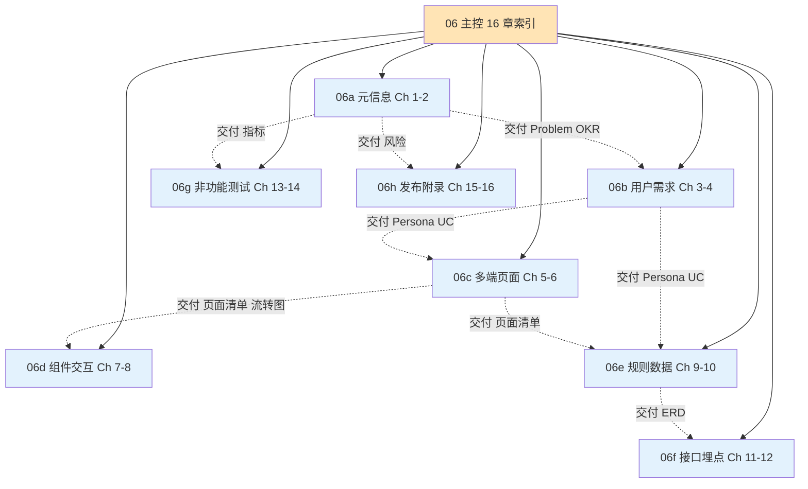

# [项目名称] - 产品需求文档（PRD）

| 版本 | 日期 | 作者 | 说明 |
|------|------|------|------|
| **3.0** | YYYY-MM-DD | [Your Name] | **页面级方案体系：16 章 PRD + 8 段并行模板（06a-06h）** |
| 2.0 | YYYY-MM-DD | [Your Name] | 二次优化版：Problem Statement / Non-Goals / Acceptance Criteria / Deep Module |
| 1.1 | YYYY-MM-DD | [Your Name] | [修订说明] |
| 1.0 | YYYY-MM-DD | [Your Name] | 初始版本 |

---

>  **本文档定位**：由**产品经理**主笔，是产品从概念到落地的核心交付物。
> 本文档采用 **8 段并行生成架构**（06a-06h），**主控文件作为索引入口**，各子段含独立章节内容。
>
> **触发条件**：当用户原始消息含"页面"、"页面方案"、"页面清单"、"详细的方案"等触发词时，**必须按本 16 章 PRD 体系**生成（详见 [SKILL.md](../SKILL.md) 章节"⚠ 页面级方案强制要求"）。
>
> **技术实现方案**（接口、表结构、灰度回滚、压测、性能指标具体值）由研发团队基于本 PRD 在 [03-接口文档.md](./03-接口文档.md)、[12-数据库设计.md](./12-数据库设计.md)、[13-架构设计.md](./13-架构设计.md) 等专项文档中落地。
>
>  **一页纸摘要**:
> 1. 看完这页能回答:做不做?做什么?怎么做能赢?上线后怎么办?
> 2. 文档定位:设计级,16 章页面级 PRD 体系主控文件
> 3. 核心动作:由 8 段(06a-06h)并行生成,主控仅作索引
> 4. 何时使用:页面级方案 / 客户交付 / 商业项目
> 5. 不要用于:技术实现(→03/12/13)、内部快迭代(用 6 章)
>
>  **关键引用**: `reference/12-value-matrix.md` (16 章价值) · [`reference/13-quality-selfcheck.md`](../reference/13-quality-selfcheck.md) (页面级自检 11 项) · [`reference/15-five-field-crosscheck.md`](../reference/15-five-field-crosscheck.md) (5字段必含项)

---

## 0. 填写指南

### 0.0 本文档价值

> **回答的核心问题**：
> 1. 我们要为谁创造什么独特价值？（2.x 价值主张 + 3.x Persona）
> 2. 用户为什么雇佣我们而不是竞品？（2.2 竞品对照 + 3.4 JTBD）
> 3. 我们要达成什么业务结果？（2.3 NSM + AARRR + OKR）
> 4. 做什么 / 不做什么 / 未来做什么？（2.4 In/Out/未来）
> 5. 用户在哪些页面、用什么组件、什么交互完成操作？（5-7 章）
> 6. 业务规则、数据模型、接口、埋点、非功能怎么约束？（8-13 章）
> 7. 上线后怎么发布、监控、回滚？（14-15 章）
>
> **不回答什么**：API 怎么设计（→03）、数据怎么存（→12）、技术选型（→13）、灰度回滚（→13/09）。**价值判定**：用户读完后能完整评审"该不该做 / 做什么 / 怎么做能赢 / 上线后怎么办"。

### 0.1 16 章文档结构

| 章节 | 内容 | 主笔 | 子段 |
|------|------|------|------|
| 1. 文档元信息 | PRD ID/版本/状态/协作人/审批人 | PM | [06a](./06a-产品需求-元信息与概述.md) |
| 2. 产品概述 | Problem + 价值主张 + 目标与成功 + 范围 | PM | [06a](./06a-产品需求-元信息与概述.md) |
| 3. 用户与需求 | 角色 + Persona + 旅程 + JTBD + US | PM | [06b](./06b-产品需求-用户与需求.md) |
| 4. 用户用例 | UC 模板 + 基本流 + 扩展流 + 规则引用 | PM | [06b](./06b-产品需求-用户与需求.md) |
| 5. 多端策略 | 终端差异矩阵 + 降级策略 | PM + 设计 | [06c](./06c-产品需求-多端与页面结构.md) |
| 6. **信息架构与页面结构** ⭐ | 页面树 + 页面清单（11 字段）+ 生命周期 + 流转图 | PM + 设计 | [06c](./06c-产品需求-多端与页面结构.md) |
| 7. **设计系统与组件库** ⭐ | 基础组件 + 复合组件 + 业务组件（5 维度） | PM + 设计 | [06d](./06d-产品需求-组件库与交互.md) |
| 8. **交互细节与微交互** ⭐ | 页面交互矩阵（8 状态）+ 手势 + 动效 + 声音 | PM + 设计 | [06d](./06d-产品需求-组件库与交互.md) |
| 9. 业务逻辑与规则引擎 | 规则 + 状态机 + 决策表 + 并发幂等 | PM + 业务 | [06e](./06e-产品需求-业务规则与数据.md) |
| 10. 数据模型 | ERD + 实体字段 + 索引 + 迁移 | PM + 数据 | [06e](./06e-产品需求-业务规则与数据.md) |
| 11. 接口契约 | RESTful 详细定义 + 分页 + 幂等 + 错误码 | PM + 后端 | [06f](./06f-产品需求-接口与埋点.md) |
| 12. 数据埋点与分析 | 事件设计表 + 属性 + 上报策略 | PM + 数据 | [06f](./06f-产品需求-接口与埋点.md) |
| 13. 非功能需求 | 性能 + 安全 + 兼容 + 隐私合规 | PM + 架构 | [06g](./06g-产品需求-非功能与测试.md) |
| 14. 测试策略 | 测试金字塔 + 基于 US 的测试场景 | PM + QA | [06g](./06g-产品需求-非功能与测试.md) |
| 15. 项目与发布管理 | 里程碑 + 灰度 + 回滚 + 监控 | PM + 运维 | [06h](./06h-产品需求-发布与附录.md) |
| 16. 附录 | 术语表 + FAQ + 待确认事项 | PM | [06h](./06h-产品需求-发布与附录.md) |

> ⭐ **页面级方案的关键 3 章**：第 6/7/8 章直接决定 PRD 是否"够细"。任何一项缺失 = PRD 不合格。

### 0.2 页面级 vs 功能级方案 决策表

| 维度 | 功能级方案 | 页面级方案（默认推荐）|
|------|-----------|---------------------|
| **触发词** | "功能清单"、"需求文档"、"PRD" | "页面方案"、"出页面"、"详细的方案"、"页面清单" |
| **PRD 章节数** | 6 章 | **16 章** |
| **PRD 文档量** | ~15KB | **≥ 50KB** |
| **页面清单** | ❌ | ✅ **必含**（所有页面+11 字段）|
| **组件库** | ❌ | ✅ **必含**（每个组件含变体/状态）|
| **交互矩阵** | ❌ | ✅ **必含**（每个页面 8 状态）|
| **数据模型** | ❌ | ✅ **必含**（ERD + 字段 + 索引）|
| **接口契约** | 简化 | ✅ 详细（错误码/分页/幂等）|
| **模板拆分** | 06 主文档 | **06 主 + 06a-h 共 9 份** |
| **适用场景** | 内部产品快迭代、文档要求低 | **客户交付、商业项目、复杂系统（推荐默认）**|

> ⭐ **决策点 4: 页面级 vs 功能级**
> - **决策**: 默认走页面级 16 章体系(50KB+),功能级 6 章作为快速内部迭代逃生口
> - **决策理由**: 客户交付/商业项目对 PRD 完整性要求高,9 段并行能压缩生成时间
> - **风险**: 页面级过重,小项目 PM 维护成本高
> - **应对**: §0.2 决策表给 PM 明确判断准则
>
>  **为什么这样设计**: 触发词("页面"/"出页面")是 PM 真实诉求,功能级无法满足"页面清单"+"组件库"+"交互矩阵"

### 0.3 优先级定义

| 优先级 | 业务定义 | 行动 |
|--------|----------|------|
| **P0** | 不做不能上线；核心场景未跑通 | 阻塞上线，**无 P0 不发版** |
| **P1** | 做了能显著提升体验/转化 | 上线后 1-2 周补齐 |
| **P2** | 体验加分项 | 列入下个迭代 |
| **P3** | 探索性需求 | 资源允许时启动 |

### 0.4 产品 vs 技术边界

| 在 PRD 中（产品视角） | 在专项文档中（技术视角） |
|----------------------|------------------------|
| 字段名、业务含义、是否必填 | 字段类型、长度、格式、校验规则 |
| 页面布局、字段位置、可见性 | 组件实现、DOM 结构、样式细节 |
| 用户操作与系统响应 | 性能指标（延迟、并发）、实现方案 |
| 用户视角的异常体验 | 错误码、错误处理、降级策略 |
| 业务规则描述 | 业务规则的代码实现、单元测试 |
| 业务指标（北极星、KPI） | 埋点字段定义、数据采集技术方案 |
| 数据实体的业务含义 | **数据库表结构、索引、约束（→12）** |
| **MVP 范围、上线节奏** | **灰度策略、回滚预案、压测值（→13 或 09）** |
| 兼容性诉求 | 浏览器/系统版本、polyfill 方案 |
| Acceptance Criteria 业务可观察结果 | 自动化测试脚本、性能压测报告 |

>  **原则**：PM 写"做什么、为什么、达到什么效果"；**数据库实体、灰度策略、回滚预案等技术细节由研发团队基于本 PRD 在专项文档中落地**。

### 0.5 字段说明（在 PRD 中的颗粒度）

PRD 中字段说明仅需 PM 关注的部分：

| 字段属性 | 说明 |
|----------|------|
| 字段名 | 业务上的名称（中文为主，英文辅助） |
| 业务含义 | 这个字段在业务上代表什么、为什么存在 |
| 是否必填 | 业务上是否要求用户提供 |
| 来源 | 用户输入 / 系统带入 / 后台计算 / 外部获取 |
| 用户可见性 | 用户能看到、还是仅后台可见 |
| 备注 | 业务上的特殊说明 |

>  字段类型、长度、格式、校验规则等**技术细节**在 [12-数据库设计.md](./12-数据库设计.md) 和 [03-接口文档.md](./03-接口文档.md) 中定义。

### 0.6 Deep Module 设计原则（必读）

| 维度 | 深模块（推荐） | 浅模块（避免） |
|------|---------------|---------------|
| **接口** | 简洁、稳定 | 暴露大量内部细节 |
| **功能密度** | 一个模块封装大量能力 | 一个模块只做一件事 |
| **跨模块调用** | 少（接口清晰后调用方不用关心内部） | 多（一个操作要串 5 个模块） |
| **价值感知** | 用户能清晰感知"这个模块解决一类问题" | 用户感觉"做了但没什么用" |
| **示例** | "VIP 客服中心"模块：含身份识别/专属坐席/优先排队/补偿券/满意度，一站式 | "登录"模块、"识别"模块、"排队"模块各拆一个，调用链极长 |

**判断标准**：如果一个模块的"对外接口 + 功能列表"写完后，**看不出这个模块在产品中独立存在的价值**——大概率是浅模块，需要合并到上层。

---

## X. 文档拆分说明

>  **本章节面向使用本模板的 agent / PM**：本文档采用 **8 段并行生成架构**（06a-06h），8 个 subagent 分别生成对应子段，主控文件作为索引入口。该架构可将单 agent 串行生成 ~3-4 分钟降至并行 ~1-1.5 分钟。

### X.1 文件结构

### X.2 文档总览（8 段在 16 章节中的映射）

| 段 | 子段文件 | 章节范围 | 章节数 | 预估行数 | 关键产出 |
|----|----------|----------|--------|----------|----------|
| **06a 元信息** | [06a](./06a-产品需求-元信息与概述.md) | 1-2 | 2 | ~280 | 文档元信息 + Problem + 价值 + 目标 |
| **06b 用户** | [06b](./06b-产品需求-用户与需求.md) | 3-4 | 2 | ~550 | Persona + JTBD + US + UC |
| **06c 多端+页面** | [06c](./06c-产品需求-多端与页面结构.md) | 5-6 | 2 | ~400 | 终端差异 + 页面清单（11 字段）+ 流转图 |
| **06d 组件+交互** | [06d](./06d-产品需求-组件库与交互.md) | 7-8 | 2 | ~500 | 组件库（5 维度）+ 交互矩阵（8 状态）|
| **06e 规则+数据** | [06e](./06e-产品需求-业务规则与数据.md) | 9-10 | 2 | ~480 | 规则 + 状态机 + ERD + 实体字段 |
| **06f 接口+埋点** | [06f](./06f-产品需求-接口与埋点.md) | 11-12 | 2 | ~420 | RESTful + 错误码 + 事件埋点 |
| **06g 非功能+测试** | [06g](./06g-产品需求-非功能与测试.md) | 13-14 | 2 | ~380 | 性能 + 安全 + 兼容 + 测试金字塔 |
| **06h 发布+附录** | [06h](./06h-产品需求-发布与附录.md) | 15-16 | 2 | ~340 | 里程碑 + 灰度 + 监控 + 术语表 + FAQ |

> **合计**：1 份主控 + 8 份子段 = **9 份文档**，PRD 总量 **≥ 50KB**（页面级方案强制要求）。

### X.3 段间契约表

> **段间契约**定义了每段"从上一段拿什么 / 给下一段留什么"——确保 8 个 subagent 并行生成时，下游段能拿到上游段的关键决策。

| 段 | 起止章节 | 从上一段拿什么 | 给下一段留什么 |
|----|----------|----------------|----------------|
| **06a 元信息** | 1-2 | （起始段，无前置依赖） | 2.1 核心问题、2.2 价值主张、2.3 OKR/NSM/AARRR、2.4 In/Out |
| **06b 用户** | 3-4 | 06a 的 2.1 痛点 → 3.x Persona；2.2 价值 → 3.4 JTBD；2.4 范围 → 4.x UC | 3.6 US 列表、4.2 UC 列表 |
| **06c 多端+页面** | 5-6 | 06b 的 3.2 Persona 设备偏好 → 5.x 终端差异；3.6 US → 6.x 页面清单 | 6.2 页面清单（11 字段）、6.4 流转图 |
| **06d 组件+交互** | 7-8 | 06c 的 6.2 页面清单 → 7.x 组件引用；6.4 流转图 → 8.x 交互矩阵 | 7.x 组件库清单、8.1 交互矩阵 |
| **06e 规则+数据** | 9-10 | 06b 的 4.2 UC 扩展流 → 9.x 业务规则；06c 的 6.x 页面 → 9.x 状态机 | 10.x ERD、实体字段 |
| **06f 接口+埋点** | 11-12 | 06e 的 10.x 数据模型 → 11.x 接口字段；06b 的 3.6 US → 12.x 埋点事件 | 11.x 接口契约、12.x 埋点表 |
| **06g 非功能+测试** | 13-14 | 06a 的 2.3 指标 → 13.x 性能需求；06b 的 3.6 US → 14.x 测试场景 | （终端段，输出为验收依据）|
| **06h 发布+附录** | 15-16 | 06a 的 2.4 风险 → 15.x 风险应对；所有段的术语 → 16.1 术语表 | （终端段，输出为发布依据）|

### X.4 主 agent 调用范式

主 agent 在调用 8 个 subagent 并行生成时，给每个 subagent：

1. **子段文件路径**（写入目标）
2. **主控文件路径**（用于读取第 0 章填写指南和段间契约）
3. **项目上下文**（来自上游文档 01-05）
4. **该段的输入契约**（本段需要从上一段拿什么）
5. **页面级方案标识**（`pageLevel: true` 时强制 16 章 50KB 模式）

每个子段文件的开头和结尾都有"段头契约块 / 段尾交接块"明确对接点；主 agent 完成 8 段后可对子段做一致性校验（参考 16.4 跨文档一致性章节）。

### X.5 页面级方案自检清单

> **交付前 100% 通过**，否则视为不合格：

- [ ] **页面清单**：所有页面都列出（每个页面含 11 字段：名称/路径/类型/是否需登录/页面状态/SEO/分享/相关US/关联UC/预加载/权限）
- [ ] **组件库**：每个基础组件有变体/尺寸/状态/交互/可访问性
- [ ] **交互矩阵**：每个页面有 8 状态（初始/加载/空数据/错误/网络错误/服务器错误/无权限/成功）
- [ ] **数据模型**：每个实体含字段表（字段名/类型/约束/说明）+ 索引 + ERD
- [ ] **接口契约**：每个接口含请求/响应/错误码/超时/重试/幂等
- [ ] **页面流转图**：Mermaid 流程图，含正常/异常分支
- [ ] **业务规则**：每条规则编号 + 触发条件 + 逻辑 + 输出 + 异常
- [ ] **状态机**：核心对象（订单/客户/支付）含状态枚举 + 转移条件
- [ ] **埋点**：每个 P0 功能含事件设计（事件名/属性/触发时机）
- [ ] **测试用例**：每个 P0 US 含 Given-When-Then 测试场景
- [ ] **PRD 文档量**：≥ 50KB（页面级方案强制）

---

*本文档由**产品经理**主笔，业务、技术、设计、测试、客服、增长协作评审。文档更新需在评审记录中留痕。*

## 摘要(降级输出,200 字内)

> 模板定位摘要(全受众可见)。完整定义见下方各章。
> 模板定位:0.0 本文档价值

**核心决策**:
- **页面级方案的关键 3 章**:第 6/7/8 章直接决定 PRD 是否"够细"。任何一项缺失 = PRD 不合格。

**关键数字/对象**:见完整版

**完整版见**:`06-产品需求文档.md`(主受众可访问)
