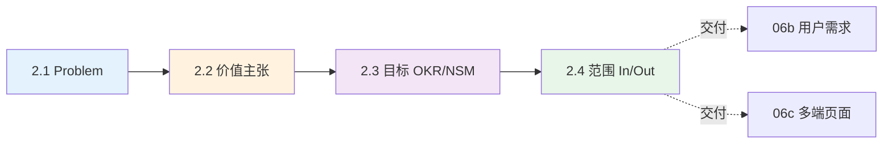

# 06a 段：[项目名称] - 产品需求文档 · 元信息与产品概述（第 1-2 章）

> 本文件是 [06-产品需求文档.md](./06-产品需求文档.md) 主控文档的**子段 1**。
> **核心章节**：第 1 章 文档元信息、第 2 章 产品概述
>
> 📌 **一页纸摘要**:
> 1. 看完这页能回答:做不做?为什么做?做多大量?不做什么?
> 2. 文档定位:设计级(产品级),06 主控的子段 1
> 3. 核心动作:1.x 文档元信息 + 2.1 Problem + 2.2 价值 + 2.3 目标 + 2.4 范围
> 4. 何时使用:页面级方案启动 / PRD 立项
> 5. 不要用于:技术实现(→03/12/13)、UI 细节(→06d)
>
> 🔗 **关键引用**: `reference/12-value-matrix.md` (价值矩阵) · `reference/13-quality-selfcheck.md` (元信息自检) · `reference/15-five-field-crosscheck.md` (5字段交叉)

| 子段版本 | 日期 | 作者 | 说明 |
|----------|------|------|------|
| **3.0a** | YYYY-MM-DD | [Your Name] | 段 1：第 1-2 章 - 文档元信息 + 产品概述 |

---

## 段头契约

- **本段输入**：（起始段，无前置依赖）
- **本段输出**：
  - 1.x 文档元信息（PRD ID / 版本 / 状态 / 协作人 / 审批人）
  - 2.1 Problem Statement（现状 / 痛点 / 机会窗口）
  - 2.2 价值主张（一句话 + Value Prop Canvas + 竞品对照）
  - 2.3 目标与成功（OKR / NSM 北极星 / AARRR 漏斗 / DOR）
  - 2.4 范围与 Non-Goals（In Scope / Out of Scope / 未来 / 假设）
- **主控文件**：[06-产品需求文档.md](./06-产品需求文档.md)
- **章节范围**：1-2
- **下游依赖**：所有后续段均依赖本段（核心问题、价值、目标、范围）

---

## 1. 文档元信息

### 1.1 PRD 基本信息

| 字段 | 值 | 说明 |
|------|----|------|
| **PRD ID** | PRD-{项目代号}-{年份}-{序号} | 如 `PRD-CDP-2026-001` |
| **产品名称** | [产品名] | — |
| **版本** | [主版本.次版本.修订号] | 语义化版本 |
| **状态** | 草稿 / 评审中 / 已通过 / 归档 | 文档生命周期 |
| **密级** | 公开 / 内部 / 机密 / 绝密 | 决定访问权限 |
| **创建日期** | YYYY-MM-DD | — |
| **最后更新** | YYYY-MM-DD | — |
| **下次评审** | YYYY-MM-DD | 评审周期建议 2 周 |

### 1.2 协作与审批

| 角色 | 姓名/组 | 职责 | 状态 |
|------|---------|------|------|
| **产品负责人（PM）** | [Your Name] | 主笔、协调、决策 | 进行中 |
| **业务负责人** | [业务方] | 业务输入、需求确认 | 待评审 |
| **技术负责人** | [Tech Lead] | 技术可行性、依赖识别 | 待评审 |
| **设计负责人** | [Designer] | 体验方案、UI 还原 | 待评审 |
| **测试负责人** | [QA Lead] | 验收标准、测试策略 | 待评审 |
| **运营负责人** | [Ops] | 客服、增长、灰度 | 待评审 |
| **法务/合规** | [Legal] | 隐私、合规、风险 | 待评审 |
| **最终审批** | [VP/GM] | 上线决策 | 待评审 |

### 1.3 版本历史

| 版本 | 日期 | 作者 | 变更说明 |
|------|------|------|----------|
| 1.0 | YYYY-MM-DD | [Author] | 初始版本 |
| 1.1 | YYYY-MM-DD | [Author] | 修订内容 |
| 2.0 | YYYY-MM-DD | [Author] | 重大重构（背景：...） |
| **3.0** | YYYY-MM-DD | [Author] | **页面级方案体系：拆分 8 段、引入 16 章（详见主控）** |

### 1.4 关联文档

| 文档 | 路径 | 关系 |
|------|------|------|
| 用户调研报告 | [用户调研报告.md] | 上游（用户需求输入）|
| 行业分析报告 | [14-行业分析报告.md] | 上游（行业上下文）|
| 项目整体说明 | [02-项目整体说明.md] | 平行（项目蓝图）|
| 接口文档 | [03-接口文档.md] | 下游（技术契约）|
| 数据库设计 | [12-数据库设计.md] | 下游（数据模型）|
| 架构设计 | [13-架构设计.md] | 下游（技术选型）|
| 测试用例 | [07-测试用例.md] | 下游（验收标准）|
| 任务拆分 | [05-任务拆分与交付.md] | 下游（排期与责任）|

---

## 2. 产品概述

### 2.1 Problem Statement（核心问题）

> 🏗️ **填写要点**：回答 3 个问题：现状是什么？核心问题是什么？为什么"现在"是机会窗口？
> **原则**：问题要"具体到能识别解决方案的边界"，避免空话（如"用户体验差"）。

> ⭐ **决策点 5: Problem Statement 5W1H 框架**
> - **决策**: 用 What/Who/When/Where/Why/How 6 维描述核心问题
> - **决策理由**: 5W1H 能避免"空话式问题"(如"体验差"),逼出可量化根因
> - **风险**: 过度结构化导致 PM 写得不自然
> - **应对**: 5W1H 写完后再写 1 段自然语言总结(200 字内)
>
> 💡 **为什么这样设计**: 5W1H 是 PM 行业标准,问题是"具体到能识别解决方案的边界"

#### 2.1.1 现状描述

- **行业背景**：[行业当前阶段、典型模式、关键趋势]
- **用户现状**：[目标用户当前如何解决问题、用什么工具/方式]
- **业务现状**：[公司/部门当前的数据规模、业务量、组织架构]
- **技术现状**：[现有系统、技术栈、数据基础]

#### 2.1.2 核心问题（用 5W1H 描述）

| 维度 | 内容 |
|------|------|
| **What（什么问题）** | [用户/业务遇到的具体问题] |
| **Who（谁遇到）** | [受影响的具体用户/角色/部门] |
| **When（何时发生）** | [频率、场景、触发条件] |
| **Where（在何处）** | [业务环节、地理位置、触达渠道] |
| **Why（为什么发生）** | [根因：技术/流程/组织/市场] |
| **How（影响多大）** | [量化影响：损失的成本/机会/满意度] |

#### 2.1.3 机会窗口

- **为什么是现在**：[市场/技术/政策的窗口期，可被量化（如 3 年内必须完成）]
- **如果不做会怎样**：[1 年 / 3 年 / 5 年的恶化趋势]
- **做了能拿到的红利**：[市场/效率/合规红利的量化预估]

### 2.2 价值主张

> 🏗️ **填写要点**：用 1 句话说清楚"为什么用户选我们、不选竞品/不用旧方案"。

#### 2.2.1 一句话价值主张

> **[产品名]** 是面向 **[目标用户]** 的 **[产品类别]**，通过 **[核心能力]** 解决 **[核心问题]**，带来 **[可量化价值]**。

**模板**（Geoffrey Moore 风格）：
> For [目标用户] who [用户痛点/需求], [产品名] is a [产品类别] that [关键能力/差异化]. Unlike [竞品/旧方案], our product [核心差异化优势].

#### 2.2.2 Value Proposition Canvas（价值主张画布）

| 维度 | 内容 |
|------|------|
| **Customer Jobs（客户要完成的事）** | 功能性：... 社会性：... 情感性：... |
| **Pains（痛点）** | 重要性极高：... 重要性高：... 一般：... |
| **Gains（期望收益）** | 必需收益：... 期望收益：... 惊喜收益：... |
| **Products & Services（产品和服务）** | 核心产品：... 配套服务：... |
| **Pain Relievers（痛点缓解）** | 对应极高痛点：... 对应高痛点：... |
| **Gain Creators（收益创造）** | 对应必需收益：... 对应期望收益：... 对应惊喜收益：... |

#### 2.2.3 竞品对照矩阵

> 🏗️ **必含**：列出 ≥ 3 个直接竞品 + ≥ 2 个替代方案（用户当前在用的方案）。

| 维度 | 我们的产品 | 竞品 A | 竞品 B | 旧方案（用户当前在用）|
|------|-----------|--------|--------|---------------------|
| **核心定位** | | | | |
| **目标用户** | | | | |
| **核心能力 1** | | | | |
| **核心能力 2** | | | | |
| **差异化优势** | | | | |
| **价格** | | | | |
| **部署方式** | | | | |
| **生态/集成** | | | | |
| **用户口碑** | | | | |
| **NPS 评分** | | | | |

### 2.3 目标与成功

> 🏗️ **填写要点**：用 OKR 描述目标，NSM 锁定北极星指标，AARRR 拆解增长漏斗。

#### 2.3.1 OKR（目标与关键结果）

| 目标（Objective） | 关键结果（Key Result） | 衡量方式 | 负责人 | 截止 |
|------------------|----------------------|----------|--------|------|
| **O1：让 XX 用户更愿意留存** | KR1：3 个月留存率从 30% 提升到 50% | 埋点 + 业务数据 | PM | 3 个月 |
| | KR2：日活用户从 1 万提升到 5 万 | DAU 看板 | 运营 | 3 个月 |
| **O2：降低获客成本** | KR1：CAC 从 100 元降到 30 元 | 财务系统 | 增长 | 6 个月 |
| | KR2：注册转化率从 5% 提升到 15% | 埋点 | 增长 | 6 个月 |
| **O3：提升商业化效率** | KR1：客单价从 50 元提升到 80 元 | 订单系统 | 业务 | 12 个月 |

#### 2.3.2 NSM（北极星指标）

> **核心原则**：NSM 必须同时反映"用户价值"和"商业价值"，且能前瞻性预测业务成败。

| 项目 | 内容 |
|------|------|
| **北极星指标** | [如：每周完成 X 行为的活跃用户数] |
| **为什么是它** | [用户行为 X 直接关联留存/转化/收入] |
| **基准值** | [当前值：... 目标值：... 截止：...] |
| **关联指标** | [上游：活跃用户数；下游：留存率、ARPU] |

#### 2.3.3 AARRR 漏斗（增长指标拆解）

| 阶段 | 指标 | 基准 | 3 个月目标 | 6 个月目标 | 12 个月目标 |
|------|------|------|-----------|-----------|-----------|
| **Acquisition（获客）** | 日新增用户 | X | X × 2 | X × 5 | X × 10 |
| **Activation（激活）** | 7 日激活率 | X% | X% + 10 | X% + 20 | X% + 30 |
| **Retention（留存）** | 30 日留存率 | X% | X% + 10 | X% + 20 | X% + 30 |
| **Revenue（收入）** | 月活用户付费率 | X% | X% + 5 | X% + 10 | X% + 15 |
| **Referral（推荐）** | 邀请转化率 | X% | X% + 3 | X% + 5 | X% + 10 |

#### 2.3.4 DOR（Definition of Ready，需求就绪定义）

> **目的**：确保需求进入开发前已具备充分条件。

| 检查项 | 通过标准 |
|--------|----------|
| 用户价值 | 是否明确解决了用户的某个痛点/需求？ |
| 业务价值 | 是否能贡献到 OKR 的某个 KR？ |
| 可衡量 | 是否有可观测的指标判断成功？ |
| 可实现 | 技术可行性已评估，依赖已识别？ |
| 优先级 | 已与业务方确认 P0/P1/P2 优先级？ |
| 范围清晰 | In Scope / Out of Scope 明确？ |
| 验收标准 | 是否能写出 Given-When-Then 测试场景？ |
| 数据埋点 | 关键行为是否已规划埋点？ |

### 2.4 范围与 Non-Goals

#### 2.4.1 In Scope（本次要做）

> 🏗️ **列出本次明确要做的所有能力/模块**，每条都要可交付、可验收。

| # | 能力/模块 | 优先级 | 验收标准 |
|---|----------|--------|----------|
| 1 | [能力 1 描述] | P0 | [Given-When-Then] |
| 2 | [能力 2 描述] | P0 | [Given-When-Then] |
| 3 | [能力 3 描述] | P1 | [Given-When-Then] |
| 4 | ... | ... | ... |

#### 2.4.2 Out of Scope（本次明确不做）

> 🏗️ **显式列出不做的事**，避免范围蔓延。

| # | 能力/模块 | 不做的原因 | 未来是否做 |
|---|----------|-----------|-----------|
| 1 | [能力 X] | [技术/资源/时间约束] | 未来 Q3 做 |
| 2 | [能力 Y] | [商业优先级低] | 不做 |
| 3 | [能力 Z] | [依赖其他项目] | 阻塞解除后做 |

#### 2.4.3 未来 Roadmap

| 时间 | 能力/模块 | 阶段 |
|------|----------|------|
| 3 个月 | [能力 A] | 二期 |
| 6 个月 | [能力 B] | 三期 |
| 12 个月 | [能力 C] | 远期 |

#### 2.4.4 假设与风险

| 假设 | 影响范围 | 验证方式 | 风险等级 |
|------|----------|----------|----------|
| [假设 1：用户愿意为 X 付费] | 商业模型 | 上线后 1 个月数据 | 🔴 高 |
| [假设 2：技术方案可行] | 工程实现 | 技术 PoC | 🟡 中 |
| [假设 3：竞品不会快速跟进] | 商业窗口 | 竞品监控 | 🟡 中 |
| [假设 4：法规不会变化] | 合规 | 法务月报 | 🟢 低 |

---

## 📋 段完成度自检

- [ ] 1.1 PRD 元信息：8 个必填字段齐全
- [ ] 1.2 协作审批：≥ 5 个角色 + 最终审批人
- [ ] 1.3 版本历史：≥ 3 个版本记录
- [ ] 1.4 关联文档：≥ 5 个上下游文档
- [ ] 2.1 Problem Statement：5W1H 完整 + 机会窗口量化
- [ ] 2.2 价值主张：1 句话 + Value Prop Canvas + ≥ 5 个竞品对照
- [ ] 2.3 目标与成功：OKR ≥ 3 + NSM 1 个 + AARRR 5 阶段 + DOR 8 项
- [ ] 2.4 范围：In ≥ 5 + Out ≥ 3 + 未来 ≥ 2 + 假设 ≥ 3

**段价值**：本段产出后，所有下游段（06b-06h）可以**基于明确的问题和目标**展开设计：
- 06b 用户与需求：基于 2.1 痛点定义 Persona 与 US
- 06c 多端与页面：基于 2.3 NSM 拆解页面与触点
- 06d 组件库：基于 2.2 竞品对照定义差异化体验
- 06e 业务规则：基于 2.4 In/Out 范围划定规则边界
- 06f 接口埋点：基于 2.3 AARRR 设计埋点事件
- 06g 非功能测试：基于 2.1 痛点推导性能/可用性需求
- 06h 发布附录：基于 2.4 假设与风险制定应对

**下游依赖**：
- 06b-产品需求-用户与需求.md：依赖本段 → Persona / US / UC
- 所有后续段：依赖本段 → 价值锚点 / 目标 / 范围

## 摘要(降级输出,200 字内)

> 模板定位摘要(全受众可见)。完整定义见下方各章。
> 模板定位:1.1 PRD 基本信息

**模板说明**:`06a 段：[项目名称] - 产品需求文档 · 元信息与产品概述（第 1-2 章）`

**关键数字/对象**:见完整版

**完整版见**:`06a-产品需求-元信息与概述.md`(主受众可访问)
