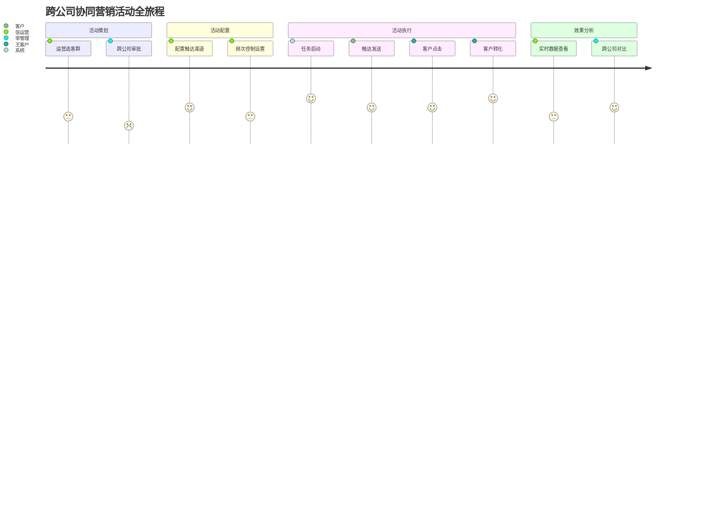

# 06b 段：[项目名称] - 产品需求文档 · 用户与需求（第 3-4 章）

> 本文件是 [06-产品需求文档.md](./06-产品需求文档.md) 主控文档的**子段 2**。
> **核心章节**：第 3 章 用户与需求、第 4 章 用户用例
>
> 📌 **一页纸摘要**:
> 1. 看完这页能回答:用户是谁?用户为什么雇佣我们?用户做什么?怎么做?
> 2. 文档定位:设计级(产品级),06 主控的子段 2
> 3. 核心动作:Persona + JTBD + US + UC 4 大工具
> 4. 何时使用:页面级方案的用户层 / PRD 需求拆解
> 5. 不要用于:UI 细节(→06d)、数据模型(→06e)
>
> 🔗 **关键引用**: `reference/12-value-matrix.md` (US 价值矩阵) · `reference/13-quality-selfcheck.md` (US 自检) · `reference/15-five-field-crosscheck.md` (5字段交叉)

| 子段版本 | 日期 | 作者 | 说明 |
|----------|------|------|------|
| **3.0b** | YYYY-MM-DD | [Your Name] | 段 2：第 3-4 章 - 用户画像 + 用户故事 + 用户用例 |

---

## 段头契约

- **本段输入**：
  - 06a 的 **2.1 核心问题** → 3.x Persona 的痛点来源
  - 06a 的 **2.2 价值主张** → 3.x JTBD 的"雇佣理由"
  - 06a 的 **2.4 范围** → 4.x UC 的边界
- **本段输出**：
  - 3.1 用户角色总览
  - 3.2 用户画像（Persona，≥ 3 类）
  - 3.3 用户旅程地图
  - 3.4 Jobs to be Done（JTBD）
  - 3.5 用户故事地图
  - 3.6 用户故事（US，Given-When-Then）
  - 3.7 故事拆分与排期
  - 4.1 UC 模板说明
  - 4.2 核心 UC 列表
- **主控文件**：[06-产品需求文档.md](./06-产品需求文档.md)
- **章节范围**：3-4
- **下游依赖**：06c（页面）依赖 3.6 US；06d（组件/交互）依赖 3.3 旅程图；06e（规则）依赖 4.2 UC

---

## 3. 用户与需求

### 3.1 用户角色总览

> 🏗️ **填写要点**：列出所有用户角色，区分内/外、一线/管理、个人/组织。

| # | 角色名 | 角色类别 | 业务身份 | 关键诉求 | 优先级 |
|---|--------|----------|----------|----------|--------|
| 1 | [角色 1] | 一线运营 | 分公司运营专员 | 提升客户触达效率 | P0 |
| 2 | [角色 2] | 一线客服 | 集团客服 | 快速查询客户信息 | P0 |
| 3 | [角色 3] | 业务管理 | 分公司总监 | 监控团队 KPI | P1 |
| 4 | [角色 4] | 集团管理 | 集团管理员 | 跨公司数据洞察 | P1 |
| 5 | [角色 5] | 终端用户 | C 端客户 | 收到合适的营销信息 | P2 |
| 6 | ... | ... | ... | ... | ... |

### 3.2 用户画像（Persona）

> 🏗️ **每类 Persona 必须含**：基础属性 + 业务背景 + 痛点 + 目标 + 触达偏好 + 行为特征。
> **原则**：Persona 要"具体到能共情"——避免"30 岁男性"这种无差异描述。

#### Persona 1：[姓名]（一线运营）

| 维度 | 描述 |
|------|------|
| **照片** | [参考头像或 Figma 链接] |
| **姓名** | 张运营（化名）|
| **年龄/性别** | 32 岁 / 女 |
| **居住地** | 一线城市（上海/广州/深圳）|
| **学历** | 本科 |
| **职业** | 港航集团 XX 分公司运营专员 |
| **工作年限** | 3-5 年 |
| **收入** | 8-12K/月 |
| **技术能力** | 中等：会使用 Excel、CRM、短信平台，但不会写 SQL |
| **业务背景** | 负责会员运营 + 营销活动执行 + 日常客诉处理 |
| **关键 KPI** | 月触达任务完成数 + 活动转化率 + 客诉处理时长 |
| **核心痛点** | ① 找客户像大海捞针（不知道哪些客户值得触达） ② 跨公司客户信息不一致（张三在船公司是金卡，在物流公司却是普通） ③ 活动频次难以把控（怕打扰客户导致投诉） ④ 活动效果数据滞后 2 天 |
| **核心目标** | 每月完成 20 个有效触达任务 + 转化率 > 5% + 客诉 < 1% |
| **触达偏好** | 工作时间 9-12、14-18（避开午休和下班）；企微 > 短信 > 电话 |
| **典型一天** | 9:00 看昨日活动数据 → 10:00 选客户群（30 分钟） → 11:00 配置活动并启动 → 14:00 处理客诉 → 16:00 写日报 → 18:00 加班核对未触达客户 |
| **使用频率** | 工作日每天使用 4-6 小时 |
| **常用设备** | PC（80%）+ 企微移动端（20%）|
| **对产品的态度** | 期待但谨慎（被太多工具坑过，希望简单易用） |

#### Persona 2：[姓名]（集团管理员）

| 维度 | 描述 |
|------|------|
| **姓名** | 李管理（化名）|
| **年龄/性别** | 40 岁 / 男 |
| **职业** | 港航集团总部客户运营总监 |
| **业务背景** | 统筹 5 家分公司的客户运营 + 跨公司协同触达审批 + 集团级数据看板 |
| **核心痛点** | ① 看不清全局（5 家分公司数据分散在 5 个系统） ② 跨公司协同审批流长 ③ 集团统一活动效果评估难 ④ 数据导出后再分析效率低 |
| **核心目标** | 实时掌握集团客户全貌 + 推动 5 家公司协同作战 + 集团级营销活动 ROI > 8% |
| **使用频率** | 每周 2-3 次深度使用 + 每日看关键指标 |
| **常用设备** | PC（90%，需要大屏数据看板）+ iPad（10%，移动审批）|

#### Persona 3：[姓名]（C 端客户）

| 维度 | 描述 |
|------|------|
| **姓名** | 王客户（化名）|
| **年龄/性别** | 35 岁 / 男 |
| **居住地** | 二线城市（杭州/成都）|
| **职业** | 中小企业主，物流公司老板 |
| **业务背景** | 每月通过港航集团发 10-20 个集装箱，对船期/价格/舱位敏感 |
| **核心痛点** | ① 收到的营销信息太多且不相关（"您可能有兴趣..."式骚扰） ② 跨公司重复接电话（船公司打了，物流公司又打） ③ 投诉渠道不清晰 |
| **核心目标** | 收到合适的、有价值的信息（如"您关心的东南亚航线舱位紧张"），减少骚扰 |
| **使用设备** | 微信 90% + PC 10% |
| **对产品的态度** | 功利（不感兴趣就立刻退出，被打扰就投诉）|

### 3.3 用户旅程地图

> 🏗️ **必含**：至少 1 个核心旅程（端到端），含阶段/行为/触点/痛点/机会/情绪曲线。

#### 旅程示例：跨公司协同营销活动



| 阶段 | 行为 | 触点 | 用户想法 | 痛点 | 情绪（1-5）| 机会点 |
|------|------|------|----------|------|----------|--------|
| **活动策划** | 选客群 | PC - 客户列表 | "这个客群 1 万人，有没有金卡？跨公司的？历史投诉过？" | 客群筛选条件 30+ 个，复杂 | 😟 2 | 智能推荐客群 + 客群预览 |
| **活动策划** | 跨公司审批 | PC - 审批流 | "需要走集团审批吗？要多久？" | 审批流程不清晰 | 😐 3 | 流程可视化 + SLA 提醒 |
| **活动配置** | 配置触达渠道 | PC - 活动编辑器 | "短信还是企微？哪个转化高？" | 不知道历史数据 | 😊 4 | 渠道效果对比 |
| **活动配置** | 频次控制 | PC - 频次设置 | "这个客户最近被触达过吗？超限了吗？" | 不知道频次状态 | 😟 2 | 自动频次校验 + 提示 |
| **活动执行** | 任务启动 | PC - 任务监控 | "启动了，要看实时进度" | 黑盒执行 | 😊 4 | 实时进度看板 |
| **活动执行** | 触达发送 | 微信 - 客户 | "这条信息值不值得看？" | 文案不相关 | 😟 2 | 智能文案生成 |
| **活动执行** | 客户点击 | 微信 - H5 | "能不能快速操作？" | 加载慢 | 😐 3 | 极简落地页 |
| **活动执行** | 客户转化 | 微信 - 表单 | "还要填什么？" | 表单字段太多 | 😐 3 | 智能默认值 |
| **效果分析** | 实时数据 | PC - 看板 | "转化怎么样？要不要暂停？" | 延迟 30 分钟 | 😊 4 | 实时数据流 |
| **效果分析** | 跨公司对比 | PC - 集团看板 | "船公司 vs 物流公司，哪个 ROI 高？" | 数据分散 | 😐 3 | 跨公司对比视图 |

### 3.4 Jobs to be Done（JTBD）

> 🏗️ **必含**：每个核心 Persona 对应 ≥ 3 个 JTBD，遵循 "When... I want to... So I can..." 模板。

#### 张运营（运营专员）的 JTBD

| # | 情境（When） | 动机（I want to） | 结果（So I can）| 优先级 |
|---|-------------|-------------------|----------------|--------|
| 1 | 当我需要为活动选客户时 | 快速圈出高价值客群 | 不用花 1 小时人工筛选 | P0 |
| 2 | 当我配置跨公司活动时 | 知道频次限制和审批要求 | 一次性通过审批 | P0 |
| 3 | 当客户投诉时 | 看到完整触达历史 | 快速定位问题 | P0 |
| 4 | 当活动进行中 | 实时看到转化效果 | 及时调整策略 | P1 |
| 5 | 当我做活动复盘时 | 拿到 ROI 和对比数据 | 写汇报材料 | P1 |

#### 李管理（集团总监）的 JTBD

| # | 情境（When） | 动机（I want to） | 结果（So I can）| 优先级 |
|---|-------------|-------------------|----------------|--------|
| 1 | 当我审批跨公司活动时 | 看到风险评估和影响范围 | 决策有依据 | P0 |
| 2 | 当我看集团数据时 | 一屏看到 5 家公司的关键指标 | 不需要切换 5 个系统 | P0 |
| 3 | 当子公司申请资源时 | 快速审批跨公司协同 | 不耽误业务 | P1 |
| 4 | 当我做季度规划时 | 拿到跨公司协同的 ROI | 优化资源配置 | P1 |

#### 王客户（C 端客户）的 JTBD

| # | 情境（When） | 动机（I want to） | 结果（So I can）| 优先级 |
|---|-------------|-------------------|----------------|--------|
| 1 | 当我收到营销信息时 | 立刻知道是否与我相关 | 决定是否点击 | P0 |
| 2 | 当我想投诉时 | 找到最简单的投诉入口 | 立刻解决问题 | P0 |
| 3 | 当我需要查询订单时 | 一次看到所有分公司的订单 | 不用切换多个系统 | P1 |

### 3.5 用户故事地图

> 🏗️ **目的**：把 US 按"用户活动的时间线"组织，识别 MVP 范围。

#### 故事地图示例：营销活动管理

```
时间线 →     活动策划     活动配置     活动执行     效果分析     活动复盘
             ↓           ↓           ↓           ↓           ↓
[主线]      选客群        配渠道        启动         实时数据     ROI 分析
            ↑           ↑           ↑           ↑           ↑
[支线1]    跨公司审批    频次控制     异常处理     调整策略     报告生成
            ↑           ↑           ↑
[支线2]    客群预览      A/B 测试     暂停/恢复
```

| 时间线 | 主线（必做） | 支线 1 | 支线 2 |
|--------|------------|--------|--------|
| 活动策划 | 选客群 | 跨公司审批 | 客群预览 |
| 活动配置 | 配渠道 | 频次控制 | A/B 测试 |
| 活动执行 | 启动 | 异常处理 | 暂停/恢复 |
| 效果分析 | 实时数据 | 调整策略 | — |
| 活动复盘 | ROI 分析 | 报告生成 | — |

**MVP 范围**：主线 + 支线 1 = 8 个 US

### 3.6 用户故事（US）

> 🏗️ **格式**：As a [角色] / I want to [能力] / So that [价值]
> **必含**：每个 US 有 Given-When-Then 验收标准 + 优先级 + 关联 UC。

> ⭐ **决策点 6: US 颗粒度**
> - **决策**: US 写到"可在一个 Sprint 完成"粒度(1-3 人天)
> - **决策理由**: 颗粒度过粗无法排期,过细陷入"任务清单"陷阱
> - **风险**: PM 难以判断"对"的颗粒度
> - **应对**: INVEST 原则自检 - 独立/可协商/有价值/可估算/小/可测
>
> 💡 **为什么这样设计**: US 是"需求沟通单元"而非"开发任务",颗粒度以"业务可估算"为准

#### US-100：客户列表查询

- **作为** 一线运营 张运营
- **我希望** 在客户列表中按 RFM 分层、客户标签、跨公司身份等多维度筛选
- **以便于** 快速圈出营销活动的高价值客群
- **优先级**：P0
- **关联 UC**：UC-100
- **验收标准**（Given-When-Then）：

  **场景 1：正常查询**
  - **Given** 系统中已有 1 万客户，包含 RFM 分层（金/银/铜）
  - **When** 我选择"RFM = 金卡" + "近 30 天活跃" + "跨公司身份 = 2 家公司" 点击搜索
  - **Then** 系统返回匹配的客户列表（≤ 500 条），含客户名称、RFM、活跃度、所属公司

  **场景 2：空数据**
  - **Given** 搜索条件下没有匹配客户
  - **When** 我点击搜索
  - **Then** 系统显示空状态插画 + "暂无匹配客户" + "调整筛选条件" 按钮

  **场景 3：导出**
  - **Given** 当前查询结果有 500 条客户
  - **When** 我点击"导出 Excel"
  - **Then** 系统创建异步导出任务，返回 taskId，前端显示进度条，完成后下载 CSV

#### US-200：OneID 合并

- **作为** 一线运营 张运营
- **我希望** 系统自动识别可能为同一人的多个身份（同名 + 相似手机号），并提示合并
- **以便于** 避免重复触达同一客户
- **优先级**：P0
- **关联 UC**：UC-200
- **验收标准**：

  **场景 1：强关联自动合并**
  - **Given** 两个客户身份证号完全一致
  - **When** 数据接入系统时
  - **Then** 系统自动合并为同一个 OneID，生成审计日志

  **场景 2：弱关联提示合并**
  - **Given** 两个客户姓名 + 手机号后 4 位一致，置信度 70-90%
  - **When** 数据接入系统时
  - **Then** 系统进入审核队列，运营人员可人工确认是否合并

  **场景 3：合并冲突**
  - **Given** 客户 A 正在被合并
  - **When** 另一运营同时点击合并
  - **Then** 系统返回 4001 错误码 + 提示"该客户正在被合并"

#### US-300：营销活动创建

- **作为** 一线运营 张运营
- **我希望** 通过可视化编辑器配置活动（选客群 + 配渠道 + 设时间）
- **以便于** 不依赖技术即可发起营销活动
- **优先级**：P0
- **关联 UC**：UC-300
- **验收标准**：

  **场景 1：正常创建**
  - **Given** 已有客群"近 30 天金卡活跃客户"
  - **When** 我选择客群 → 选择渠道（短信/企微）→ 设置时间 → 点击启动
  - **Then** 系统创建活动任务，状态为"待执行"

  **场景 2：频次超限**
  - **Given** 客群中 30% 客户近 7 天已被触达 > 4 次
  - **When** 我点击启动
  - **Then** 系统提示"3001 频次超限"，列出拦截明细，运营可选择"跳过超限客户"或"申请 VIP 豁免"

  **场景 3：跨公司审批**
  - **Given** 客群中含 50% 跨公司客户
  - **When** 我点击启动
  - **Then** 系统提示"5002 需集团审批"，自动提交审批流

#### US-400：活动效果实时看板

- **作为** 一线运营 张运营
- **我希望** 看到活动的实时转化漏斗（已发送 / 已送达 / 已读 / 已点击 / 已转化）
- **以便于** 及时调整活动策略
- **优先级**：P1
- **关联 UC**：UC-400
- **验收标准**：

  **场景 1：实时数据**
  - **Given** 活动已启动 1 小时
  - **When** 我打开活动详情
  - **Then** 系统显示 5 步漏斗图，数据延迟 ≤ 30 秒

#### US-500：集团跨公司客户全貌

- **作为** 集团总监 李管理
- **我希望** 一屏看到 5 家分公司的客户规模、活跃度、价值分布
- **以便于** 不需要切换系统就能掌握全局
- **优先级**：P0
- **关联 UC**：UC-500
- **验收标准**：

  **场景 1：集团总览**
  - **Given** 5 家分公司已接入
  - **When** 我进入集团驾驶舱
  - **Then** 系统显示 5 家分公司的客户总数、活跃率、跨公司客户数、价值分布

#### US-600：客户 360° 详情

- **作为** 一线运营 张运营
- **我希望** 看到客户的完整画像（基础信息 + 跨公司身份 + 行为轨迹 + 触达历史 + 价值分层）
- **以便于** 在做活动/客服时一目了然
- **优先级**：P0
- **关联 UC**：UC-600
- **验收标准**：

  **场景 1：完整画像**
  - **Given** 客户 OneID 已合并 2 家分公司的身份
  - **When** 我打开客户详情
  - **Then** 系统显示：基础信息（脱敏） + 跨公司身份徽章 + 行为时间线 + 触达历史 + RFM 标签

### 3.7 故事拆分与排期

| US 编号 | 标题 | 优先级 | 估算（人天）| Sprint | Epic |
|--------|------|--------|------------|--------|------|
| US-100 | 客户列表查询 | P0 | 5 | Sprint 1 | 客户中心 |
| US-200 | OneID 合并 | P0 | 8 | Sprint 1 | 数据基础 |
| US-300 | 营销活动创建 | P0 | 10 | Sprint 2 | 营销自动化 |
| US-400 | 活动效果实时看板 | P1 | 3 | Sprint 2 | 营销自动化 |
| US-500 | 集团跨公司客户全貌 | P0 | 5 | Sprint 1 | 集团驾驶舱 |
| US-600 | 客户 360° 详情 | P0 | 8 | Sprint 1 | 客户中心 |
| ... | ... | ... | ... | ... | ... |

---

## 4. 用户用例（Use Case）

### 4.1 UC 模板说明

> 🏗️ **每条 UC 必含字段**：
> - UC 编号、名称、目标角色、前置条件、后置条件
> - 基本流（步骤）
> - 扩展流（异常分支）
> - 业务规则引用（→ 06e 9.x）
> - 关联 US（→ 3.6）
> - 关联页面（→ 06c 6.x）
> - 优先级

### 4.2 核心 UC 列表

#### UC-100：客户列表查询

| 字段 | 内容 |
|------|------|
| **UC 编号** | UC-100 |
| **UC 名称** | 客户列表多维查询 |
| **目标角色** | 一线运营 |
| **前置条件** | 1. 用户已登录 2. 用户有"客户查看"权限 |
| **后置条件** | 用户看到匹配的客户列表 |
| **基本流** | 1. 用户进入客户列表页 2. 设置筛选条件（RFM、标签、活跃度、跨公司） 3. 点击"搜索" 4. 系统返回匹配列表 5. 用户可翻页、排序、查看详情 |
| **扩展流 1** | 筛选后无数据：显示空状态 + 调整筛选条件引导 |
| **扩展流 2** | 筛选后 > 1000 条：显示"结果过多，请缩小范围" + 自动推荐筛选条件 |
| **扩展流 3** | 网络错误：显示重试按钮 + 自动上报 Sentry |
| **扩展流 4** | 跨公司数据权限不足：仅返回本分公司数据 + 提示"无跨公司权限" |
| **业务规则引用** | BR-USER-001（用户→会员转化）、BR-MEMBER-002（等级升级） |
| **关联 US** | US-100 |
| **关联页面** | 客户列表页（→ 06c 6.2） |
| **优先级** | P0 |
| **验收标准** | 5 个测试场景（见 06g 14.2） |

#### UC-200：OneID 合并

| 字段 | 内容 |
|------|------|
| **UC 编号** | UC-200 |
| **UC 名称** | OneID 身份合并 |
| **目标角色** | 系统自动 / 一线运营（弱关联确认） |
| **前置条件** | 1. 数据接入完成 2. 身份匹配规则已配置 |
| **后置条件** | OneID 归一，生成审计日志 |
| **基本流** | 1. 数据接入 2. 身份匹配（证件号/手机号/姓名+设备指纹） 3. 强关联自动合并 4. 弱关联进入审核队列 5. 运营人工审核 6. 确认后合并 |
| **扩展流 1** | 合并冲突：返回 4001 + 加分布式锁 |
| **扩展流 2** | 跨公司合并：需集团审批（5002） |
| **扩展流 3** | 合并回滚：保留 30 天可回滚（→ 06e 9.4） |
| **业务规则引用** | BR-IDENTITY-001（合并规则）、BR-IDENTITY-002（回滚规则） |
| **关联 US** | US-200 |
| **关联页面** | OneID 审核页、客户详情页 |
| **优先级** | P0 |

#### UC-300：营销活动执行

| 字段 | 内容 |
|------|------|
| **UC 编号** | UC-300 |
| **UC 名称** | 营销活动一键执行 |
| **目标角色** | 一线运营 |
| **前置条件** | 1. 活动已创建 2. 客群已圈定 3. 渠道已配置 4. 频次校验通过 |
| **后置条件** | 活动任务进入执行状态 |
| **基本流** | 1. 运营点击"启动活动" 2. 系统进行频次校验 3. 校验通过 → 创建任务 4. 异步执行 5. 实时推送进度 |
| **扩展流 1** | 频次超限（3001）：显示拦截明细 + 申请豁免 |
| **扩展流 2** | 客群为空（S3）：提示"客群为空" |
| **扩展流 3** | 跨公司审批（5002）：自动提交审批 |
| **扩展流 4** | 任务执行中异常：自动重试 3 次 + 上报 |
| **业务规则引用** | BR-CAMPAIGN-001（频次规则）、BR-CAMPAIGN-002（审批规则） |
| **关联 US** | US-300 |
| **关联页面** | 活动编辑页、活动监控页 |
| **优先级** | P0 |

---

## 📋 段完成度自检

- [ ] 3.1 角色总览：≥ 5 个角色（覆盖一线/管理/客户/外部）
- [ ] 3.2 Persona：≥ 3 个 Persona，每个含 10+ 维度
- [ ] 3.3 用户旅程：≥ 1 个核心旅程 + Mermaid 图 + 10 行阶段表
- [ ] 3.4 JTBD：每个核心 Persona ≥ 3 个 JTBD
- [ ] 3.5 故事地图：主线 + ≥ 2 支线 + MVP 范围
- [ ] 3.6 US：每个 P0 US 含 Given-When-Then 验收
- [ ] 3.7 故事排期：估算人天 + Sprint 归属
- [ ] 4.2 UC：每个核心 P0 US 对应 UC，含基本流 + ≥ 3 扩展流

**段价值**：本段产出后，UX/UI 可以**直接基于 Persona 和旅程图**展开：
- 06c 信息架构：基于 3.3 旅程的"阶段"组织菜单
- 06c 页面清单：基于 3.6 US 拆出页面
- 06d 组件库：基于 3.2 Persona 的设备偏好选择组件
- 06e 业务规则：基于 4.2 UC 的扩展流定义规则
- 06g 测试用例：基于 3.6 US 的 Given-When-Then 写测试

**下游依赖**：
- 06c-产品需求-多端与页面结构.md：依赖本段 → 页面清单/流转图
- 06d-产品需求-组件库与交互.md：依赖本段 → Persona 设备偏好 / 旅程情绪曲线
- 06e-产品需求-业务规则与数据.md：依赖本段 → UC 扩展流 / 业务规则
- 06g-产品需求-非功能与测试.md：依赖本段 → US 的 Given-When-Then 测试场景


## 摘要(降级输出,200 字内)

> 模板定位摘要(全受众可见)。完整定义见下方各章。
> 模板定位:3.1 用户角色总览

**模板说明**:`06b 段：[项目名称] - 产品需求文档 · 用户与需求（第 3-4 章）`

**关键数字/对象**:见完整版

**完整版见**:`06b-产品需求-用户与需求.md`(主受众可访问)
