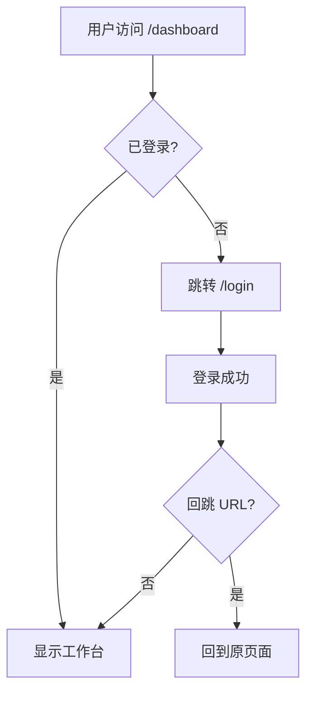
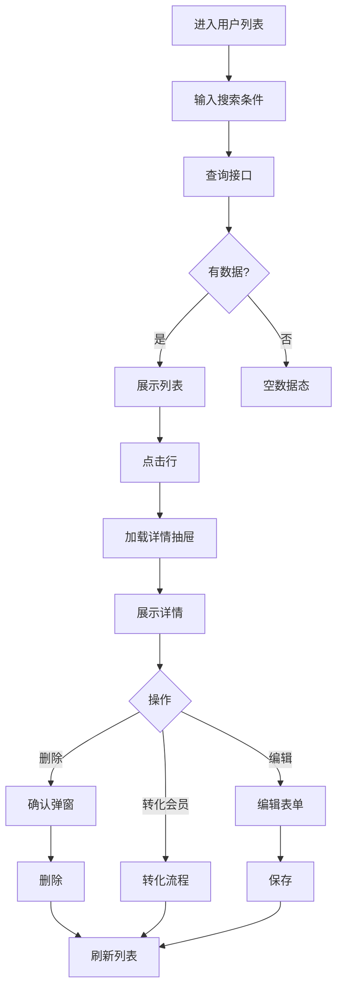
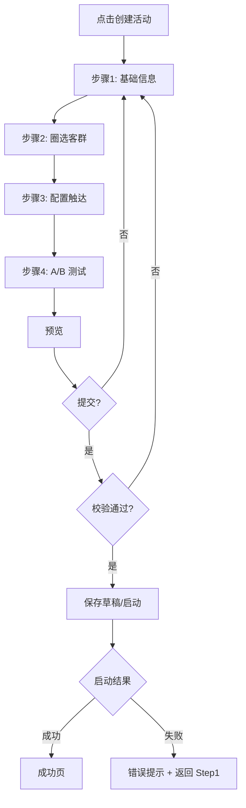
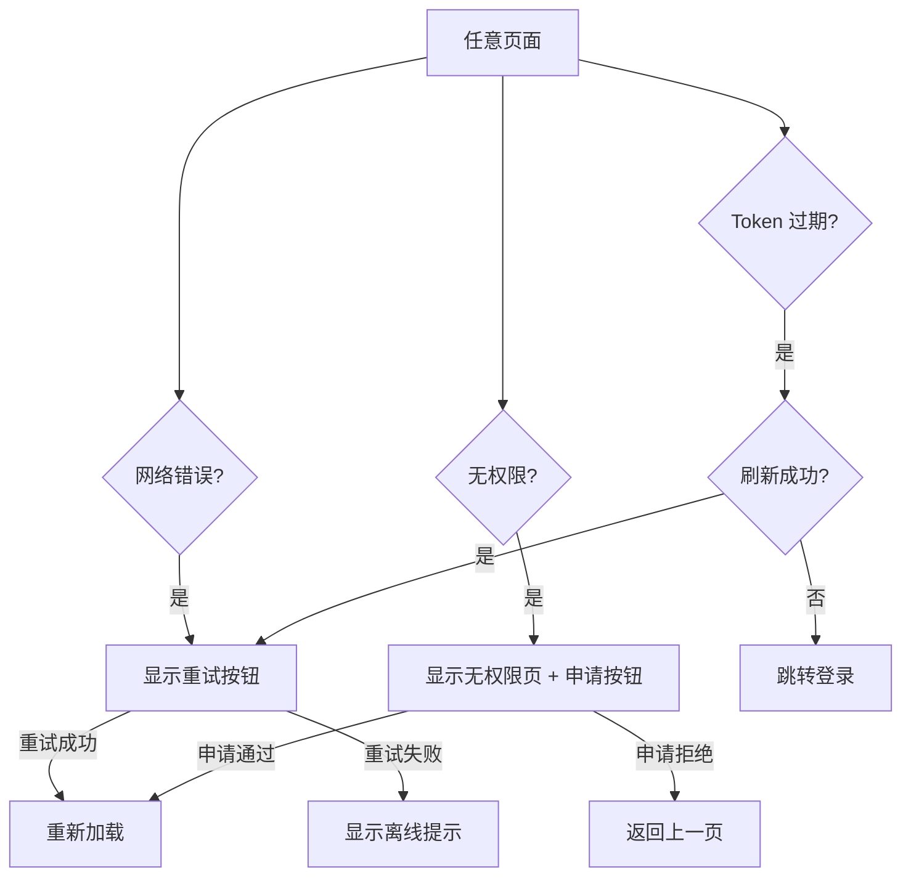

# 06c 段：[项目名称] - 产品需求文档 · 多端策略与页面结构（第 5-6 章）

> 本文件是 [06-产品需求文档.md](./06-产品需求文档.md) 主控文档的**子段 3**。
> **核心章节**：第 5 章 多端策略、第 6 章 信息架构与页面结构
> **关键产出**：完整页面清单（Sitemap）+ 页面流转图（Navigation Flow）
>
> 📌 **一页纸摘要**:
> 1. 看完这页能回答:页面有几张?怎么流转?多端差异是什么?
> 2. 文档定位:设计级,06 主控的子段 3(页面级方案的核心)
> 3. 核心动作:终端差异矩阵 + 页面清单(11 字段) + 流转图
> 4. 何时使用:页面级方案的信息架构 / 多端适配
> 5. 不要用于:组件库(→06d)、接口(→06f)
>
> 🔗 **关键引用**: `reference/12-value-matrix.md` (页面清单价值) · `reference/13-quality-selfcheck.md` (11 字段自检) · `reference/15-five-field-crosscheck.md` (5字段交叉)

| 子段版本 | 日期 | 作者 | 说明 |
|----------|------|------|------|
| **3.0c** | YYYY-MM-DD | [Your Name] | 段 3：第 5-6 章 - 多端策略 + 信息架构 + 页面清单 |

---

## 段头契约

- **本段输入**：
  - 06b 的 **2.x 用户画像** → 5.x 终端差异分析的使用场景
  - 06b 的 **3.x 用户故事** → 6.x 页面清单的页面范围
  - 06b 的 **4.x 用例** → 6.x 页面流转图的步骤来源
- **本段输出**：
  - 5.x 多端策略（终端差异矩阵 + 设计降级 + 适配策略）
  - 6.1 信息架构树
  - 6.2 **完整页面清单**（每页含 11 字段）
  - 6.3 页面生命周期
  - 6.4 页面间流转逻辑（含 Mermaid 流程图）
- **主控文件**：[06-产品需求文档.md](./06-产品需求文档.md)
- **章节范围**：5-6

---

## 5. 多端策略与适配

### 5.1 终端差异分析表

> 🏗️ **填写要点**：必须包含所有目标终端，列出 10+ 维度的差异。

| 对比维度 | PC Web | 移动 H5 | 微信小程序 | App（iOS & Android）|
|----------|--------|---------|------------|-----|
| **屏幕尺寸** | >= 1024px | 320-428px | 同 H5 | 多分辨率 |
| **交互方式** | 鼠标悬停、右键 | 触摸、滑动手势 | 同 H5+长按 | 手势+系统级返回 |
| **输入方式** | 键盘、精确点击 | 软键盘、语音 | 同 H5 | 同 H5+生物识别 |
| **授权能力** | 低，需弹窗 | 低 | 获取微信头像/手机号 | 高（通知、相册、定位）|
| **支付方式** | 扫码或网页支付 | 唤起 JSAPI | wx.requestPayment | IAP/原生支付 |
| **推送能力** | 浏览器通知 | 有限 | 服务通知、订阅消息 | 系统推送 |
| **性能瓶颈** | 不限 | 弱网环境优先 | 包大小限制（2M） | 内存、电量 |
| **离线能力** | 几乎不能 | PWA 可缓存 | 小程序缓存 | 本地存储 |
| **更新机制** | 刷新即用 | 即时 | 审核通过后 | 应用商店审核 |
| **登录方式** | 账号密码/SSO | 短信/微信 | 微信一键登录 | 手机/微信/Apple ID |

### 5.2 设计降级与适配策略

> **降级原则**：低频使用 → 跳转 H5 → 提示下载 App。

| 功能 | 全端 | PC | H5 | 小程序 | App | 降级方案 |
|------|------|----|----|--------|-----|----------|
| 客户 360° 详情 | ✅ | ✅ | ✅ | ✅ | ✅ | — |
| 数据看板 | ✅ | ✅ | ✅ | ⚠️ 简化 | ✅ | 小程序仅核心指标 |
| 大文件上传 | ✅ | ✅ | ⚠️ | ❌ | ✅ | 小程序/H5 走微信 JS-SDK |
| 蓝牙打印 | ✅ | ❌ | ❌ | ❌ | ✅ | 仅 App 端支持 |
| 实时音视频 | ✅ | ⚠️ | ⚠️ | ❌ | ✅ | 仅 App 端支持 |

### 5.3 特殊场景适配

| 场景 | 适配策略 |
|------|----------|
| 弱网环境 | 缓存上一次数据展示 + 接口失败时允许重试 + 骨架屏 |
| 横屏（Pad）| 桌面布局居中 + 两侧留白 |
| 小屏手机 | 表格转卡片、抽屉宽度 100% |
| 高 DPI 屏 | 提供 @2x/@3x 图标 |
| 深色模式 | 颜色变量两套，CSS 媒体查询切换 |

---

## 6. 信息架构与页面结构 ⭐（**最关键**）

> ⚠️ **本章节是 2026-06-03 用户反馈"PRD 太粗"的核心修复点**。
> 必须按下面模板输出**所有页面**，不允许遗漏。

### 6.1 页面树状图（网站地图）

> 🏗️ **填写要点**：用缩进表示层级，标注哪些页面需要登录、哪些页面是弹窗/抽屉。

```
[产品名]
├─ 公共页
│   ├─ 登录页 /login
│   ├─ 找回密码 /forgot-password
│   └─ 错误页 404 / 500
├─ 工作台（需登录）
│   ├─ 集团驾驶舱 /dashboard/group
│   ├─ 我的工作台 /dashboard/my
│   └─ 待办中心 /workspace/todo
├─ 客户管理
│   ├─ 用户列表 /user/list
│   │   └─ 用户详情 /user/:id（抽屉）
│   ├─ 会员列表 /member/list
│   │   └─ 会员详情 /member/:id（抽屉）
│   └─ 客户 360° /customer/:oneId/profile
├─ 数据治理
│   ├─ OneID 审核 /governance/oneid-review
│   ├─ 标签管理 /governance/tags
│   │   └─ 标签详情 /governance/tags/:id
│   └─ 客群圈选 /governance/segments
│       └─ 客群详情 /governance/segments/:id
├─ 营销中心
│   ├─ 优惠券 /marketing/coupons
│   │   ├─ 优惠券详情（抽屉）
│   │   └─ 优惠券创建 /marketing/coupons/new
│   ├─ 积分管理 /marketing/points
│   ├─ 抽奖活动 /marketing/lottery
│   ├─ 裂变活动 /marketing/fission
│   └─ MA 自动化 /marketing/automation
│       └─ 营销活动详情 /marketing/campaigns/:id
├─ 企微运营
│   ├─ 活码管理 /wecom/qrcode
│   ├─ 客户列表 /wecom/customers
│   ├─ 消息推送 /wecom/messages
│   ├─ 客户群 /wecom/groups
│   └─ SOP 配置 /wecom/sop
├─ 数据看板
│   ├─ L1 集团驾驶舱 /analytics/l1
│   ├─ L2 运营分析台 /analytics/l2
│   └─ L3 智能洞察 /analytics/l3
├─ 跨公司协同
│   ├─ 权限管理 /cross/permissions
│   ├─ 协同触达 /cross/touch
│   └─ 效果归因 /cross/attribution
└─ 系统管理
    ├─ 用户管理 /system/users
    ├─ 角色权限 /system/roles
    ├─ 字典管理 /system/dict
    └─ 审计日志 /system/audit
```

**标注说明**：
- `[需登录]`：需登录才能访问
- `（抽屉）`：在父页面以 Drawer 形式打开，不占独立路由
- `（弹窗）`：在父页面以 Modal 形式打开

### 6.2 完整页面清单（每页含 11 字段）⭐⭐

> ⚠️ **强制要求**：每个页面**必须**包含以下 11 个字段。缺一个视为"页面级方案不完整"。

#### 页面 1：用户列表页

| 属性 | 内容 |
|------|------|
| **页面名称** | 用户列表页 |
| **路由（PC）** | `/user/list` |
| **小程序路径** | `pages/user/list` |
| **所属模块** | 客户管理 |
| **页面类型** | 主页面（带搜索 + 表格 + 抽屉） |
| **是否需登录** | ✅ 是（拦截未登录跳转登录页） |
| **预加载策略** | 进入前预拉取用户数（轻量） |
| **页面状态** | 加载中、正常、空数据、网络错误、服务器错误、无权限 |
| **SEO 要求** | 否（后台管理） |
| **分享设置** | 禁止分享 |
| **相关用户故事** | US-100, US-101 |
| **关联用例** | UC-USER-LIST-001 |

#### 页面 2：用户详情抽屉

| 属性 | 内容 |
|------|------|
| **页面名称** | 用户详情抽屉 |
| **路由（PC）** | `/user/:id`（以 Drawer 形式打开，width: 720px） |
| **所属模块** | 客户管理 |
| **页面类型** | 抽屉（右侧滑入） |
| **是否需登录** | ✅ 是 |
| **预加载策略** | 列表点击行时预拉取详情 |
| **页面状态** | 加载中、正常、空数据、网络错误、服务器错误 |
| **相关用户故事** | US-100 |
| **关联用例** | UC-USER-DETAIL-001 |

#### 页面 3：客户 360° 详情

| 属性 | 内容 |
|------|------|
| **页面名称** | 客户 360° 详情 |
| **路由（PC）** | `/customer/:oneId/profile` |
| **所属模块** | 客户管理 |
| **页面类型** | 主页面（Tab 切换：基本信息/消费记录/标签/触达历史/权益） |
| **是否需登录** | ✅ 是 |
| **预加载策略** | 进入前预拉取基本信息（其他 Tab 按需） |
| **页面状态** | 加载中、正常、空数据、网络错误、无权限（跨公司） |
| **相关用户故事** | US-022 |
| **关联用例** | UC-CUSTOMER-360-001 |
| **特殊说明** | 跨公司访问需校验权限，违规时显示无权限 |

#### 页面 4-20：按上述模板继续填写

> 🏗️ **填写要点**：
> - 列出**所有**页面（主页面 + 弹窗 + 抽屉 + 内嵌 H5）
> - 每个页面独立一张表格
> - 复杂页面（多 Tab/多状态）需特别说明

### 6.3 页面生命周期

> 🏗️ **填写要点**：定义页面进入、离开、显示、隐藏时的行为，前端可直接参考。

#### 6.3.1 PC Web 端（基于 React/Vue）

| 生命周期 | 时机 | 行为 |
|----------|------|------|
| `onLoad` | 路由匹配 | 读取 URL 参数 + 发起首屏接口 + 显示骨架屏 |
| `onMounted` | DOM 挂载 | 绑定事件 + 启动轮询（如果有）|
| `onActivated` | keep-alive 激活 | 刷新数据（可配置是否刷新）|
| `onDeactivated` | keep-alive 失活 | 暂停轮询 + 暂停动画 |
| `onUnmounted` | 组件销毁 | 清理定时器 + 解绑事件 + 取消未完成请求 |

#### 6.3.2 移动端 H5 / 小程序（基于生命周期函数）

| 生命周期 | 时机 | 行为 |
|----------|------|------|
| `onLoad` | 页面加载 | 读取参数 + 发起接口 |
| `onShow` | 页面显示 | 刷新数据（如从后台切回）|
| `onReady` | 首次渲染 | 隐藏 loading + 绑定事件 |
| `onHide` | 页面隐藏 | 暂停轮询 + 保存草稿 |
| `onUnload` | 页面销毁 | 清理定时器 + 提交未保存数据 |

### 6.4 页面间流转逻辑（Navigation Flow）⭐

> 🏗️ **填写要点**：用 Mermaid 语法描述，必须包含**正常流**和**异常分支**（未登录/无权限/操作失败）。

#### 6.4.1 登录后流程



#### 6.4.2 客户管理流程



#### 6.4.3 营销活动创建流程



#### 6.4.4 异常流程



---

## 📋 段完成度自检

- [ ] 第 5 章：多端差异表已填写
- [ ] 第 5 章：降级策略已明确
- [ ] 第 6.1 节：页面树状图已绘制
- [ ] **第 6.2 节：所有页面均含 11 字段（强制）**
- [ ] 第 6.3 节：页面生命周期已定义
- [ ] 第 6.4 节：页面流转图已绘制（≥ 3 个核心流程 + 异常流）

**段价值**：本段产出后，前端可以**直接开始**：
- 路由设计
- 页面骨架搭建
- 跳转逻辑实现
- 多端适配方案

**下游依赖**：
- 06d 段：依赖本段的页面清单 → 推导组件库和交互矩阵
- 06e 段：依赖本段的页面 → 推导业务规则与数据模型
- 04-前端开发指南.md：依赖本段 → 制定前端规范
- 10-前端交互文档.md：依赖本段 → 详细交互实现


## 摘要(降级输出,200 字内)

> 模板定位摘要(全受众可见)。完整定义见下方各章。
> 模板定位:5.1 终端差异分析表

**核心决策**:
- **强制要求**:每个页面**必须**包含以下 11 个字段。缺一个视为"页面级方案不完整"。
- **填写要点**:用 Mermaid 语法描述，必须包含**正常流**和**异常分支**（未登录/无权限/操作失败）。

**关键数字/对象…
