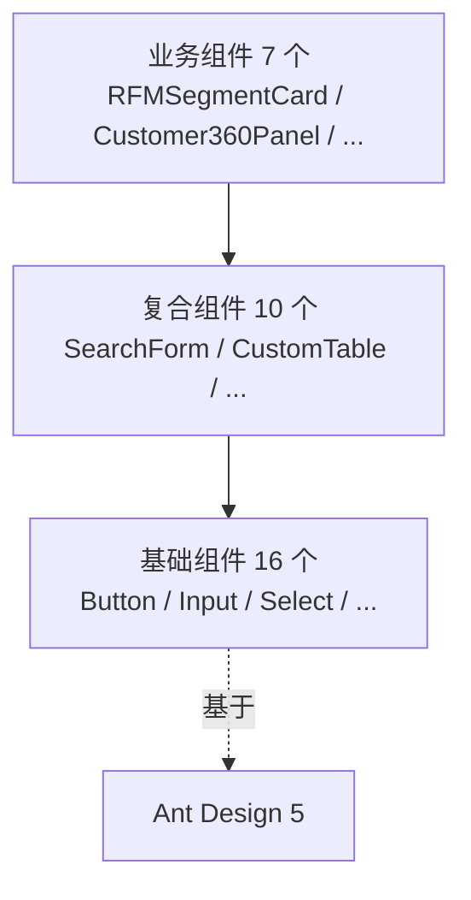

# 06d 段：[项目名称] - 产品需求文档 · 组件库与交互（第 7-8 章）

> 本文件是 [06-产品需求文档.md](./06-产品需求文档.md) 主控文档的**子段 4**。
> **核心章节**：第 7 章 设计系统与组件库、第 8 章 交互细节与微交互
> **关键产出**：完整组件库清单 + 页面级交互状态矩阵 + 动效规范
> **优先级**：⭐⭐⭐ **用户最关心的部分，直接决定 PRD 是否"够细"**
>
> 📌 **一页纸摘要**:
> 1. 看完这页能回答:用什么组件?组件什么状态?交互怎么动?
> 2. 文档定位:设计级,06 主控的子段 4(用户最关心的部分)
> 3. 核心动作:组件库 5 维度 + 交互矩阵 8 状态 + 动效规范
> 4. 何时使用:页面级方案的 UI/交互层
> 5. 不要用于:技术实现(→04/10)、业务流程(→06e)
>
> 🔗 **关键引用**: `reference/12-value-matrix.md` (组件库价值) · `reference/13-quality-selfcheck.md` (8 状态自检) · `reference/15-five-field-crosscheck.md` (5字段交叉)

| 子段版本 | 日期 | 作者 | 说明 |
|----------|------|------|------|
| **3.0d** | YYYY-MM-DD | [Your Name] | 段 4：第 7-8 章 - 组件库 + 交互矩阵 + 动效 |

---

## 段头契约

- **本段输入**：
  - 06c 的 **6.2 页面清单** → 7.x 组件库的页面引用
  - 06c 的 **6.4 页面流转图** → 8.x 交互矩阵的页面状态
  - 06b 的 **4.x 用例** → 8.x 交互矩阵的步骤来源
- **本段输出**：
  - 7.1 基础组件库（变体/尺寸/状态/交互/可访问性）
  - 7.2 复合组件库
  - 7.3 业务组件库
  - 8.1 **页面级交互状态矩阵**（每页 8 状态）
  - 8.2 手势与触控交互
  - 8.3 动效规范
  - 8.4 声音与振动
- **主控文件**：[06-产品需求文档.md](./06-产品需求文档.md)
- **章节范围**：7-8

---

## 7. 设计系统与组件库 ⭐

### 7.0 组件库总览

> 🏗️ **填写要点**：先列出**所有**组件，再逐个定义。组件分三层：
> - **基础组件**（原子级）：按钮、输入框、下拉框等
> - **复合组件**（分子级）：搜索表单、数据表格、卡片等
> - **业务组件**（业务级）：RFM 分层卡、跨品类推荐位等

| 类别 | 组件名 | 数量 | 引用页面 |
|------|--------|------|----------|
| **基础组件** | Button / Input / Select / DatePicker / Modal / Drawer / Toast / Tabs / Tag / Tooltip / Pagination / Upload / Switch / Radio / Checkbox / Form | 16 | 所有页面 |
| **复合组件** | SearchForm / CustomTable / StatCard / ChartCard / Empty / ErrorBoundary / Loading / ConfirmDialog / CascadeSelector / RichEditor | 10 | 所有页面 |
| **业务组件** | RFMSegmentCard / Customer360Panel / WeComQRCode / TouchFrequencyBar / CrossCategoryRecommend / MultiCompanyBadge / IdentityMergeAlert | 7 | 业务页面 |

---

### 7.1 基础组件（原子级）

> 🏗️ **填写要点**：每个组件必须包含 5 个维度：**变体** / **尺寸** / **状态** / **交互** / **可访问性**。

#### 7.1.1 Button（按钮）

| 维度 | 说明 |
|------|------|
| **变体** | 主按钮（Primary）、次按钮（Default）、文字按钮（Text）、危险按钮（Danger）、虚线按钮（Dashed）、链接按钮（Link）|
| **尺寸** | 大（48px）、中（40px，**默认**）、小（32px）、迷你（24px）|
| **状态** | 默认（default）、悬停（hover）、点击（active）、禁用（disabled）、加载中（loading）、成功（success，1.5s 后恢复）|
| **交互** | 点击触发回调；点击后**立即 disabled**，直至接口返回或超时（5s）后自动恢复 |
| **可访问性** | 支持键盘 Enter / Space；有 focus 样式（蓝色 2px 边框）；loading 状态有 aria-busy |

#### 7.1.2 Input（输入框）

| 维度 | 说明 |
|------|------|
| **类型** | text / number / password / phone / idCard / email / url / search / textarea |
| **变体** | 基础输入框、带前缀图标、带后缀图标、带清除按钮（×）、带字数统计 |
| **尺寸** | 大（48px）、中（40px，**默认**）、小（32px）|
| **状态** | 默认、聚焦、填写中、校验失败（红框 + 错误文案）、禁用、只读 |
| **校验** | 实时校验（输入时）vs 失焦校验（onBlur）；错误文案位置：下方 4px 间距 |
| **可访问性** | label 关联；错误信息用 aria-describedby |

#### 7.1.3 Select（下拉选择）

| 维度 | 说明 |
|------|------|
| **变体** | 单选、多选、级联、可搜索、可清空 |
| **尺寸** | 大、中、小（同 Input）|
| **状态** | 默认、聚焦、打开下拉、选中、禁用 |
| **交互** | 单选：选择后自动关闭；多选：选择后保持打开；级联：父级变化时清空子级 |
| **特殊** | 大数据量（>1000）使用虚拟滚动；远程搜索需配置 debounce（300ms）|

#### 7.1.4 DatePicker（日期选择）

| 维度 | 说明 |
|------|------|
| **变体** | 日期、日期+时间、日期范围、日期时间范围、年份、月份、周 |
| **快捷选项** | 今天、昨天、近 7 天、近 30 天、本周、本月、上月、近 3 个月、自定义 |
| **状态** | 默认、聚焦、选择中、已选、禁用日期、范围跨月 |
| **交互** | 范围选择：先选起点，再选终点；可清除 |
| **格式** | 显示 `YYYY-MM-DD HH:mm:ss`（按用户偏好可改）|

#### 7.1.5 Modal（模态框）

| 维度 | 说明 |
|------|------|
| **变体** | 居中模态（width: 520px）、全屏模态（width: 90%）、抽屉模态（右侧 720px）、确认模态（带图标）|
| **结构** | 标题区（48px）+ 内容区（自适应）+ 操作区（72px）|
| **状态** | 关闭、打开、加载中 |
| **交互** | 点击遮罩默认**不关闭**（避免误操作），需显式按钮关闭；ESC 键关闭；操作区有"取消"+"确定" |
| **可访问性** | 焦点陷阱（Tab 循环）；打开时焦点自动落在第一个可聚焦元素；关闭后焦点回到触发元素 |

#### 7.1.6 Drawer（抽屉）

| 维度 | 说明 |
|------|------|
| **变体** | 右侧抽屉（**默认**，width: 560px / 720px / 920px）、左侧抽屉、顶部抽屉 |
| **结构** | 标题栏（48px + 关闭按钮）+ 内容区 + （可选）底部操作栏 |
| **状态** | 关闭、打开中、已打开、关闭中 |
| **交互** | 从右向左滑入（300ms）；点击遮罩关闭（**与 Modal 不同**）；ESC 关闭 |
| **应用** | 详情查看（如用户详情、订单详情、券详情）|

#### 7.1.7 Toast / Message（轻提示）

| 维度 | 说明 |
|------|------|
| **类型** | 成功（绿色 ✓）、错误（红色 ✗）、警告（黄色 ⚠）、信息（蓝色 ℹ）、加载中（旋转图标）|
| **位置** | 顶部居中（**默认**）/ 中间居中 / 底部居中 |
| **时长** | 成功/信息：2s；错误/警告：3s；加载中：持续到手动关闭 |
| **可关闭** | 加载中支持手动关闭；其他自动消失 |
| **最多同时** | 3 个（超出排队）|

#### 7.1.8 Table（表格）

| 维度 | 说明 |
|------|------|
| **变体** | 基础表格、可排序、可筛选、可分页、斑马纹、边框、紧凑 |
| **列类型** | 文本、数字、日期、状态（Tag）、操作（按钮组）、链接、自定义渲染 |
| **行操作** | 单选 / 多选 / 悬停高亮 / 展开行 |
| **空状态** | 显示空数据插画 + "暂无数据"文案 + "新建"按钮（如适用）|
| **加载** | 骨架屏（行 × 5）+ 顶部进度条 |

#### 7.1.9 Form（表单）

| 维度 | 说明 |
|------|------|
| **布局** | 水平（label 左对齐，width: 120px）、垂直（label 顶部）、行内 |
| **校验** | 失焦校验 + 提交校验；错误信息聚合在提交按钮上方（弹窗形式）|
| **提交** | 提交按钮 loading；成功后 Toast 提示 + 关闭弹窗/跳转；失败后按钮恢复 + 字段级错误 |
| **草稿** | 复杂表单支持自动保存草稿（每 30s）|

#### 7.1.10 Tabs（标签页）

| 维度 | 说明 |
|------|------|
| **变体** | 基础（横线）、卡片、胶囊、垂直（左侧菜单）|
| **位置** | 顶部（**默认**）、底部、左侧、右侧 |
| **交互** | 切换时显示 loading；超过 5 个 Tab 显示"更多"下拉 |
| **数据加载** | 切换时按需加载（lazy）；已加载过缓存数据 |

#### 7.1.11 Tag（标签）

| 维度 | 说明 |
|------|------|
| **变体** | 基础（圆角矩形 4px）、胶囊（圆角 12px）、可关闭（带 ×）、可点击（带 hover）|
| **颜色** | 蓝/绿/红/黄/灰（语义化）、预设 7 色 |
| **尺寸** | 默认、小 |
| **应用** | 状态标识、标签展示、筛选条件展示 |

#### 7.1.12 Upload（上传）

| 维度 | 说明 |
|------|------|
| **方式** | 点击选择 / 拖拽 / 粘贴截图 |
| **限制** | 大小（默认 10MB）、格式（默认全部）、数量（默认 1 个）|
| **预览** | 图片：缩略图；文档：图标 + 文件名 |
| **进度** | 上传中显示进度条 + 百分比；失败显示重试 |
| **存储** | 上传到 OSS，返回 URL；表单提交时携带 URL |

#### 7.1.13 Pagination（分页）

| 维度 | 说明 |
|------|------|
| **变体** | 基础（首页/上页/页码/下页/末页 + 总数 + 跳转）、简洁（仅上/下页 + 总数）|
| **每页大小** | 默认 20，可选 10/20/50/100 |
| **页码过多** | 超过 7 页显示省略号（...）|

#### 7.1.14 Cascader（级联选择）

| 维度 | 说明 |
|------|------|
| **应用** | 省市区、公司-部门、品类-商品 |
| **层级** | 支持 2-4 级；可配置是否允许只选父级 |
| **交互** | 鼠标悬停展开子级（PC）；点击展开（移动）|
| **搜索** | 支持关键字搜索所有层级 |

#### 7.1.15 Empty（空状态）

| 维度 | 说明 |
|------|------|
| **变体** | 默认插画、迷你插画、无插画（仅文字）|
| **结构** | 插画（120×120）+ 标题（16px）+ 描述（14px，灰）+ 操作按钮（可选）|
| **应用** | 列表无数据、搜索无结果、过滤后无数据（文案不同）|

#### 7.1.16 其他基础组件

简要列出（**详细规范在 04-前端开发指南.md**）：

- **Switch**（开关）：尺寸大/小、状态默认/开/关/禁用、支持文字+图标
- **Radio**（单选）：垂直/水平、按钮样式
- **Checkbox**（多选）：垂直/水平、半选状态
- **Tooltip**（气泡提示）：方向上/下/左/右、延迟 200ms、最大宽度 250px
- **Popconfirm**（气泡确认）：用于轻量确认（删除等）
- **Progress**（进度条）：线形/圆形/仪表盘、颜色按进度变化
- **Avatar**（头像）：图片/文字/图标、尺寸 24/32/40/64/80
- **Badge**（徽标）：数字/小红点/文字

---

### 7.2 复合组件（分子级）

> 🏗️ **填写要点**：复合组件由基础组件组合而成，必须说明**组成**、**入参**、**事件回调**、**空/错状态**。

#### 7.2.1 SearchForm（搜索表单）

| 维度 | 说明 |
|------|------|
| **组成** | 多个 Form.Item + 搜索/重置按钮 + 折叠/展开按钮 |
| **入参** | fields 数组（field: name, label, type, options, defaultValue）、onSearch、onReset |
| **折叠** | 超过 3 个字段默认折叠，点击"展开"显示全部 |
| **空状态** | 无（搜索表单本身无需空状态）|
| **应用** | 所有列表页（用户列表、订单列表、券列表等）|

#### 7.2.2 CustomTable（数据表格）

| 维度 | 说明 |
|------|------|
| **组成** | SearchForm（可选） + Table + Pagination |
| **入参** | columns、api、params、pageSize、onRowClick |
| **特性** | 支持列设置（显示/隐藏、宽度调整）、列固定、合计行、虚拟滚动（>1000 行）|
| **空状态** | 复用 Empty 组件；搜索无结果 vs 无数据文案不同 |
| **应用** | 所有需要列表展示的页面 |

#### 7.2.3 StatCard（统计卡片）

| 维度 | 说明 |
|------|------|
| **组成** | 图标 + 标题 + 数值 + 同比/环比（带 ↑↓ 颜色）|
| **变体** | 基础（白底）、渐变（蓝/绿/红）、紧凑 |
| **交互** | 可点击跳转（hover 高亮 + 点击跳转）|
| **应用** | 数据看板、首页概览 |

#### 7.2.4 ChartCard（图表卡片）

| 维度 | 说明 |
|------|------|
| **组成** | 标题 + 操作区（导出/全屏/时间筛选）+ 图表 + 数据源标注 |
| **图表类型** | 折线、柱状、饼图、雷达、漏斗、地图、热力图（ECharts）|
| **交互** | 缩放、图例筛选、悬浮 tooltip、点击下钻 |
| **加载** | 骨架屏（与图表等高）|
| **空状态** | "暂无数据" + "调整时间范围"提示 |

#### 7.2.5 ConfirmDialog（确认弹窗）

| 维度 | 说明 |
|------|------|
| **变体** | 危险（红色标题 + 红色按钮）、警告（黄色）、普通（蓝色）|
| **结构** | 图标 + 标题 + 描述 + 取消/确定按钮 |
| **应用** | 删除确认、批量操作确认、敏感操作二次确认 |

#### 7.2.6 Empty（业务空态）

> 与 7.1.15 的区别：业务空态可定制插画 + 业务文案 + CTA 按钮。

#### 7.2.7 Loading（加载）

| 维度 | 说明 |
|------|------|
| **变体** | 全屏 loading、组件级 loading、骨架屏、进度条 |
| **应用** | 页面初始化 loading、列表 loading、按钮 loading、表格 loading |

#### 7.2.8 ErrorBoundary（错误边界）

| 维度 | 说明 |
|------|------|
| **触发** | 子组件 JS 报错时捕获 |
| **降级** | 显示错误插画 + "出错了" + "刷新"按钮 |
| **上报** | 自动上报错误到 Sentry/监控 |

#### 7.2.9 CascadeSelector（级联选择器）

> 与 Cascader 类似，但用于业务场景（如公司-部门、品类-商品）。

#### 7.2.10 RichEditor（富文本）

> 用于活动描述、营销文案编辑。

---

### 7.3 业务组件（业务级）

> 🏗️ **填写要点**：业务组件是本项目特有的，需详细定义。

#### 7.3.1 RFMSegmentCard（RFM 分层卡）

| 维度 | 说明 |
|------|------|
| **结构** | 标题（4 象限名）+ 客户数 + 占比 + 平均消费 + 缩略趋势图 |
| **变体** | 重要价值、重要发展、重要保持、一般客户（4 色）|
| **交互** | 点击跳转客群详情；可加入对比 |
| **应用** | 运营分析台、客群圈选首页 |

#### 7.3.2 Customer360Panel（客户 360° 面板）

| 维度 | 说明 |
|------|------|
| **结构** | 头部基本信息 + 6 个 Tab（消费/标签/触达/权益/订单/客群）|
| **数据** | 基础信息、累计消费、偏好航线、流失风险、最近触达 |
| **操作** | 加入客群、发送触达、调整等级、查看完整画像 |
| **应用** | 客服工作台、运营触达前查看 |

#### 7.3.3 WeComQRCode（企微活码）

| 维度 | 说明 |
|------|------|
| **结构** | 二维码 + 渠道标识 + 添加按钮 + 欢迎语预览 |
| **渠道** | 大湾出发、琶洲、川岛、PTMS 等（按公司配置）|
| **统计** | 添加数、转化率 |
| **应用** | 企微运营首页、引流页 |

#### 7.3.4 TouchFrequencyBar（触达频次条）

| 维度 | 说明 |
|------|------|
| **结构** | 横向条形图：全局上限 / 分公司上限 / 渠道上限 |
| **颜色** | 绿色（< 70%）/ 黄色（70-90%）/ 红色（> 90% 即将超限）|
| **交互** | hover 显示详细次数；点击跳转频次配置 |
| **应用** | 触达执行前检查 |

#### 7.3.5 CrossCategoryRecommend（跨品类推荐位）

| 维度 | 说明 |
|------|------|
| **结构** | 标题 + 推荐位（卡片/横向滚动）|
| **数据源** | AI 推荐引擎（协同过滤 + 深度学习）|
| **场景** | 购票后 1h 内显示、购票前 24h 显示、非购票期显示 |
| **A/B 测试** | AI 推荐 vs 热门推荐 |
| **应用** | 营销活动页、用户中心首页 |

#### 7.3.6 MultiCompanyBadge（多公司标识）

| 维度 | 说明 |
|------|------|
| **结构** | 标签 + 公司名 |
| **应用** | 客户列表中标识"多公司归属"客户 |
| **颜色** | 按公司配置（蓝/绿/红/黄）|

#### 7.3.7 IdentityMergeAlert（OneID 合并告警）

| 维度 | 说明 |
|------|------|
| **结构** | 警告图标 + "疑似同一人" + 详情 + 合并/拆分按钮 |
| **置信度** | 70-90% 黄色 / > 90% 绿色（建议合并）/< 70% 灰色 |
| **应用** | OneID 审核队列、客户详情 |

---

## 8. 交互细节与微交互 ⭐

### 8.1 页面级交互状态矩阵 ⭐⭐

> ⚠️ **强制要求**：每个核心页面**必须**列出 8 个状态的交互处理。这是用户最关心的"页面方案细不细"的关键。

#### 8.1.1 状态枚举

| 状态 | 编号 | 说明 |
|------|------|------|
| 初始 | S0 | 页面首次进入，未发起任何请求 |
| 加载中 | S1 | 接口请求中，显示骨架屏/loading |
| 正常 | S2 | 数据加载成功，正常展示 |
| 空数据 | S3 | 接口返回空（如列表无数据）|
| 网络错误 | S4 | 网络断开/超时（status: 0 / 408）|
| 服务器错误 | S5 | 5xx 错误 |
| 无权限 | S6 | 403 错误（跨公司/功能未授权）|
| 业务异常 | S7 | 4xx 业务错误（如参数错误）|

#### 8.1.2 客户列表页 - 8 状态矩阵

| 状态 | 视觉表现 | 用户可操作 | 接口调用 | 失败处理 | 加载态 |
|------|----------|------------|----------|----------|--------|
| **S0 初始** | 显示骨架屏（行 × 10）| 无 | `GET /crm/customers` 触发 | — | 骨架屏 |
| **S1 加载中** | 骨架屏 + 顶部进度条 | 无（可取消）| 请求中 | — | 骨架屏 |
| **S2 正常** | 列表 + 分页器 | 搜索/筛选/翻页/查看详情/批量操作 | 成功返回 | — | — |
| **S3 空数据** | 空插画 + "暂无客户" + "新建客户"按钮 | 点击"新建" | — | — | — |
| **S4 网络错误** | 网络错误插画 + "网络异常" + "重试"按钮 | 点击"重试" | 重新发起 | — | 重试中 |
| **S5 服务器错误** | 服务器错误插画 + "服务异常" + "刷新"按钮 | 点击"刷新" | 重新发起 | 自动上报 Sentry | 刷新中 |
| **S6 无权限** | 无权限插画 + "无访问权限" + "申请权限"按钮 | 点击"申请" | 发起申请 | 申请结果 toast 提示 | 申请中 |
| **S7 业务异常** | 顶部 toast 错误提示 + 列表回退到 S0 | 同 S0 | 重新发起 | — | 骨架屏 |

#### 8.1.3 客户 360° 详情 - 8 状态矩阵

| 状态 | 视觉表现 | 用户可操作 | 接口调用 | 失败处理 |
|------|----------|------------|----------|----------|
| **S0 初始** | 头部骨架屏 + Tab 骨架屏 | 无 | `GET /crm/customer/:oneId` | — |
| **S1 加载中** | 全屏 loading | 取消 | 请求中 | — |
| **S2 正常** | 完整信息 + 6 Tab 可切换 | 切换 Tab / 加入客群 / 触达 | 各 Tab 按需加载 | — |
| **S3 空数据** | "该客户暂无消费记录" | 无 | — | — |
| **S4 网络错误** | 网络错误插画 | 重试 | 重新发起 | — |
| **S5 服务器错误** | 服务器错误 | 刷新 | 重新发起 | 自动上报 |
| **S6 无权限** | "无访问权限" + 申请 | 申请 | 发起申请 | — |
| **S7 业务异常** | toast + 回退 S0 | — | 重新发起 | — |

#### 8.1.4 营销活动创建页 - 8 状态矩阵

| 状态 | 视觉表现 | 用户可操作 | 接口调用 | 失败处理 |
|------|----------|------------|----------|----------|
| **S0 初始** | 4 步骤 Step 组件 + 第一步表单 | 填写/下一步 | 无 | — |
| **S1 加载中** | 提交按钮 loading | 无 | 提交中 | — |
| **S2 正常** | 步骤完成 + 预览 | 提交/上一步/保存草稿 | 提交 | — |
| **S3 空数据** | "客群为空" + "请圈选客群" | 返回步骤 2 | — | — |
| **S4 网络错误** | 步骤 1 顶部网络错误 | 重试 | 重新发起 | — |
| **S5 服务器错误** | 错误 toast | 重试 | 重新发起 | 自动上报 |
| **S6 无权限** | "无营销权限" | 申请 | 发起申请 | — |
| **S7 业务异常** | 步骤内字段错误 + 顶部 toast | 修改 | 重新发起 | — |

#### 8.1.5 其他核心页面

> 🏗️ **填写要点**：按上述模板继续填写，至少覆盖：
> - 用户列表 / 用户详情
> - 会员列表 / 会员详情
> - 客群圈选 / 客群详情
> - 优惠券列表 / 优惠券创建
> - 看板（L1/L2/L3）
> - 跨公司协同页
> - 系统管理页

### 8.2 手势与触控交互（移动端）

| 手势 | 触发阈值 | 视觉反馈 | 是否可撤销 | 应用场景 |
|------|----------|----------|------------|----------|
| **左滑删除** | 滑动距离 > 60px | 露出删除按钮（红）| ✅（自动撤销）| 列表项 |
| **下拉刷新** | 下拉距离 > 80px | 旋转图标 | — | 列表/详情 |
| **长按** | 持续 500ms | 出现操作菜单 | ✅（松开取消）| 列表项 |
| **双指缩放** | 双指距离变化 | 实时缩放 | — | 图片/图表 |
| **拖拽排序** | 移动 10px 触发 | 抬起占位 | ✅ | 列表排序 |
| **边缘右滑返回** | 边缘 20px 内滑动 | 页面右移 | — | 所有页面（与系统手势冲突时禁用）|

### 8.3 动效规范

| 动效类型 | 时长 | 缓动函数 | 应用场景 |
|----------|------|----------|----------|
| **微交互** | 150ms | ease-out | 按钮点击、hover、focus |
| **组件动画** | 200-250ms | ease-in-out | 模态框、抽屉、Tooltip |
| **页面转场** | 300ms | ease-in-out | 路由切换 |
| **复杂动画** | 400-500ms | ease-in-out | 图表展开、骨架屏渐变 |
| **数据更新** | 200ms | linear | 数字滚动、列表插入 |

#### 8.3.1 页面进入/离开

- **进入**：fade + slide-up 30px，300ms ease-out
- **离开**：fade + slide-down 20px，200ms ease-in

#### 8.3.2 模态框/抽屉

- **模态出现**：scale 0.95 → 1 + fade，200ms ease-out
- **模态关闭**：scale 1 → 0.95 + fade，150ms ease-in
- **抽屉出现**：translateX 100% → 0，300ms ease-out
- **抽屉关闭**：translateX 0 → 100%，250ms ease-in

#### 8.3.3 列表操作

- **新增项**：slide-down 30px + fade，250ms
- **删除项**：collapse height + fade，200ms
- **排序变化**：FLIP 动画（First-Last-Invert-Play），300ms

#### 8.3.4 加载/骨架

- **骨架屏**：浅灰块 + 1.5s 周期 shimmer 动画
- **数字变化**：滚动 200ms（适合大数字）
- **进度条**：连续 200ms 渐变

### 8.4 声音与振动（可选）

| 场景 | 声音 | 振动 |
|------|------|------|
| **支付成功** | 短促"叮"（可关闭）| 短振（50ms）|
| **错误** | 低沉"咚" | 中振（200ms）|
| **新消息** | 短"叮" | 短振（50ms）|
| **签到成功** | "叮咚" | 短振（50ms）|

> **可访问性**：默认关闭，用户主动开启；声音与振动**分别**可配置。

---

## 📋 段完成度自检

- [ ] 7.0 组件库总览（3 类组件清单）
- [ ] **7.1 基础组件：16 个组件，每个含 5 维度（变体/尺寸/状态/交互/可访问性）**
- [ ] 7.2 复合组件：10 个组件（每个含组成/入参/事件/空错态）
- [ ] 7.3 业务组件：≥ 5 个项目特有业务组件
- [ ] **8.1 页面级交互状态矩阵：≥ 4 个核心页面 8 状态矩阵**
- [ ] 8.2 手势与触控交互（移动端 ≥ 5 个手势）
- [ ] 8.3 动效规范（5 类动效 + 4 种场景）
- [ ] 8.4 声音与振动（可选）

**段价值**：本段产出后，前端可以**直接开始**：
- 组件库搭建
- 页面状态机实现
- 交互动效实现
- 多端适配

**下游依赖**：
- 04-前端开发指南.md：依赖本段 → 制定前端规范
- 10-前端交互文档.md：依赖本段 → 详细交互实现
- 11-Mock数据文档.md：依赖本段 → Mock 数据结构

**未填写时的回退检查**：
- ❌ 如果本段 < 30KB，视为"页面级方案不完整"
- ❌ 如果组件库 < 16 个基础组件，视为"页面级方案不完整"
- ❌ 如果交互状态矩阵 < 4 个核心页面，视为"页面级方案不完整"

## 摘要(降级输出,200 字内)

> 模板定位摘要(全受众可见)。完整定义见下方各章。
> 模板定位:7.0 组件库总览

**核心决策**:
- **填写要点**:先列出**所有**组件，再逐个定义。组件分三层：
- **强制要求**:每个核心页面**必须**列出 8 个状态的交互处理。这是用户最关心的"页面方案细不细"的关键。

**关键数字/对象**:见完整版

**完整版见**:`…
