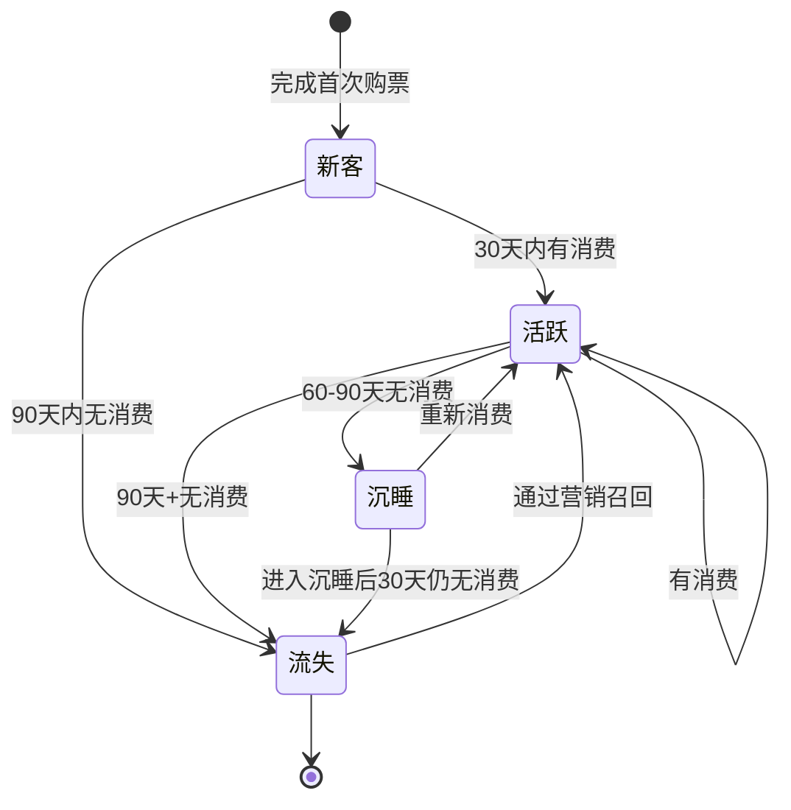
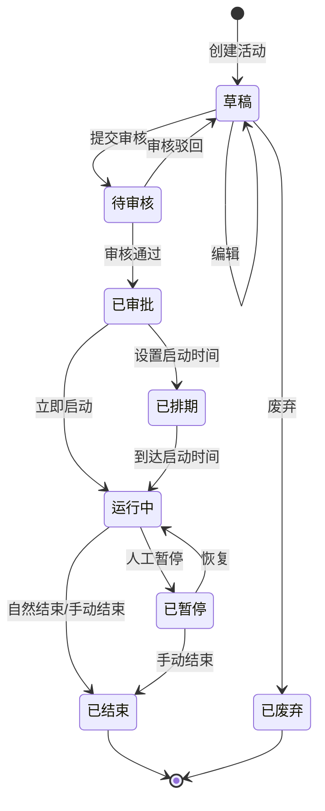
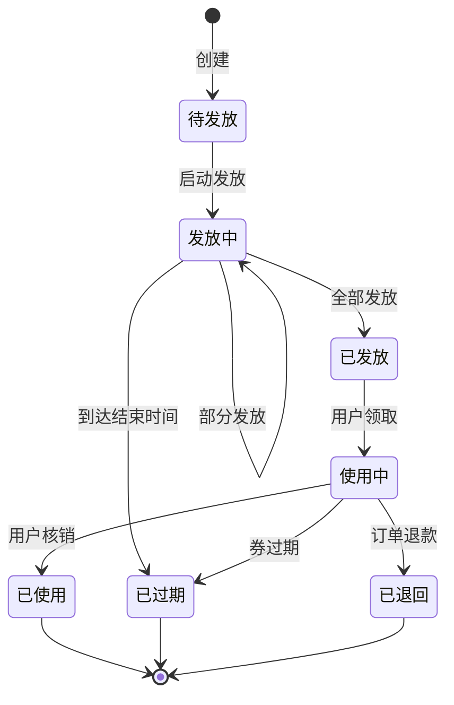
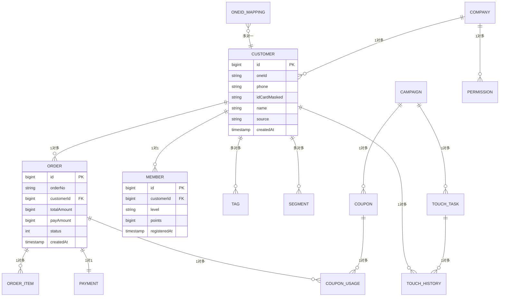

# 06e 段：[项目名称] - 产品需求文档 · 业务规则与数据（第 9-10 章）

> 本文件是 [06-产品需求文档.md](./06-产品需求文档.md) 主控文档的**子段 5**。
> **核心章节**：第 9 章 业务逻辑与规则引擎、第 10 章 数据模型
>
> 📌 **一页纸摘要**:
> 1. 看完这页能回答:业务怎么流转?数据怎么存?规则怎么算?
> 2. 文档定位:设计级,06 主控的子段 5(逻辑层 + 数据层)
> 3. 核心动作:业务规则 + 状态机 + 决策表 + ERD + 实体字段
> 4. 何时使用:页面级方案的逻辑/数据层
> 5. 不要用于:UI(→06d)、接口(→06f)、DB 物理设计(→12)
>
> 🔗 **关键引用**: `reference/12-value-matrix.md` (规则价值) · `reference/13-quality-selfcheck.md` (状态机自检) · `reference/15-five-field-crosscheck.md` (5字段交叉)

| 子段版本 | 日期 | 作者 | 说明 |
|----------|------|------|------|
| **3.0e** | YYYY-MM-DD | [Your Name] | 段 5：第 9-10 章 - 业务规则 + 状态机 + 数据模型 |

---

## 段头契约

- **本段输入**：
  - 06b 的 **4.x 用例** → 9.x 规则的来源
  - 06c 的 **6.x 页面** → 9.x 状态机的对象
  - 06d 的 **8.x 交互** → 9.x 并发/幂等的需求
- **本段输出**：
  - 9.1 业务规则定义
  - 9.2 状态机图
  - 9.3 决策表
  - 9.4 并发与幂等性设计
  - 10.1 实体关系图（ERD）
  - 10.2 实体详细字段定义
  - 10.3 索引建议
  - 10.4 数据迁移与版本
- **主控文件**：[06-产品需求文档.md](./06-产品需求文档.md)
- **章节范围**：9-10

---

## 9. 业务逻辑与规则引擎

⭐ **关键决策**：
- **规则编号规范**：`BR-{模块}-{序号}`，如 `BR-USER-001`（模块简写 + 3 位序号）
- **每条规则必含 5 字段**：触发条件 / 输入参数 / 逻辑步骤 / 输出结果 / 异常处理
- **规则 vs 状态机 vs 决策表 选型**：简单条件用规则 / 状态流转用状态机 / 多条件组合用决策表
- **禁止"业务逻辑写在代码里没文档"**：所有 P0 规则必须落到本文档

### 9.1 业务规则定义

> 🏗️ **填写要点**：每条规则必须编号、明确触发条件、逻辑、输出、异常。

#### 规则 BR-USER-001：用户→会员转化条件

- **触发**：用户完成首次购票
- **输入**：userId、ticketOrderId
- **逻辑**：
  1. 检查用户是否已注册（isRegistered = false 才转化）
  2. 通过短信/企微发送转化引导（含注册链接）
  3. 用户点击链接完成注册
  4. 触发新会员积分奖励（首单 +100 积分）
  5. 写入"用户转化记录"表
- **输出**：会员 ID + 转化时间
- **异常**：短信发送失败 → 标记重试（最多 3 次）
- **备注**：转化周期 7 天，7 天内未注册标记为"流失待唤醒"

#### 规则 BR-MEMBER-002：会员等级自动升级

- **触发**：用户每次完成消费
- **输入**：userId、consumeAmount、consumeTime
- **逻辑**：
  1. 累计近 12 个月消费金额
  2. 对照等级阈值表：
     - 银卡：累计 ≥ 1000
     - 金卡：累计 ≥ 5000
     - 钻石：累计 ≥ 20000
  3. 达到新阈值 → 升级 + 写入等级变更记录
  4. 发送升级通知（站内信 + 短信）
- **输出**：newLevel、upgradeTime
- **异常**：升级同一天内重复触发 → 去重
- **备注**：等级降级需人工审核（不自动降）

#### 规则 BR-RFM-003：RFM 客户分层

- **触发**：每日凌晨 2:00 定时任务
- **输入**：全量客户消费记录
- **逻辑**：
  1. 计算 R（最近消费距今天数）、F（消费频次）、M（消费金额）
  2. R/F/M 分别打分（1-5 分）
  3. R+F+M 总分 ≥ 13 → 重要价值
  4. 总分 10-12 → 重要发展
  5. 总分 7-9 → 重要保持
  6. 总分 < 7 → 一般客户
- **输出**：每个客户的 RFM 分层
- **异常**：数据缺失 → 标记"待补全"，不参与分层
- **备注**：阈值可配置（运营人员可调）

#### 规则 BR-TOUCH-004：触达频次控制

- **触发**：每次发起触达任务
- **输入**：targetUserId、channel、company
- **逻辑**：
  1. 检查全局上限：单客户月触达 ≤ 4 次（跨公司 + 跨渠道）
  2. 检查分公司上限：单客户同分公司月触达 ≤ 2 次
  3. 检查渠道上限：单客户同渠道月触达 ≤ 1 次
  4. 任一触发即拦截，返回 429 错误码
- **输出**：触达成功 / 拦截 + 原因
- **异常**：VIP 客户可豁免部分限制（需配置）
- **备注**：阈值可配置；配置变更需审批

#### 规则 BR-ONECOMPANY-005：跨公司数据隔离

- **触发**：任何数据查询/修改
- **输入**：operatorId、targetCompanyId、accessType
- **逻辑**：
  1. 查询操作员的 companyId
  2. 若 targetCompanyId = operator.companyId → 放行
  3. 若 targetCompanyId ≠ operator.companyId → 检查"跨公司共享配置"
  4. 若已配置共享 → 按共享范围放行
  5. 若未配置 → 返回 403 错误码
- **输出**：放行 / 拒绝 + 原因
- **异常**：集团管理员可看全量
- **备注**：审计日志记录所有跨公司访问

### 9.2 状态机图

⭐ **关键决策**：
- **状态数 ≤ 8 个**：超过考虑拆分为多状态机
- **必含终态**：每个状态机至少有 1 个终态（SUCCESS/FAILED/CLOSED）
- **禁止循环**：除了 RETRY 闭环，**禁止其他循环引用**（会导致状态机死锁）
- **状态转移必带守卫条件**：每个箭头标注"何时能转"

#### 9.2.1 客户生命周期状态机

| 状态 | 进入条件 | 离开条件 | 营销策略 |
|------|----------|----------|----------|
| 新客 | 首次购票 | 30天内有/无消费 | 新客礼包 + 引导转化 |
| 活跃 | 30天内有消费 | 持续消费 / 60-90天无消费 | 常规营销 + 积分加倍 |
| 沉睡 | 60-90天无消费 | 重新消费 / 持续沉睡 | 沉睡唤醒券 + 1v1关怀 |
| 流失 | 90天+无消费 | 营销召回成功 | 召回券 + 调研问卷 |

#### 9.2.2 营销活动状态机

| 状态 | 进入条件 | 操作权限 |
|------|----------|----------|
| 草稿 | 创建 | 创建者、运营 |
| 待审核 | 提交审核 | 创建者 |
| 已审批 | 审核通过 | 审核人 |
| 已排期 | 设置启动时间 | 运营 |
| 运行中 | 启动 | 系统/运营 |
| 已暂停 | 暂停 | 运营总监 |
| 已结束 | 结束 | 系统/运营 |
| 已废弃 | 废弃 | 创建者 |

#### 9.2.3 优惠券状态机

### 9.3 决策表

#### 表 DT-DISCOUNT-001 会员折扣决策表

| 用户等级 | 订单金额 | 活动期 | 是否节假日 | 折扣% |
|----------|----------|--------|------------|-------|
| 钻石 | ≥ 5000 | 是 | 是 | 25% |
| 钻石 | ≥ 5000 | 是 | 否 | 20% |
| 钻石 | ≥ 5000 | 否 | — | 15% |
| 钻石 | < 5000 | — | — | 10% |
| 金卡 | ≥ 3000 | — | — | 10% |
| 金卡 | < 3000 | — | — | 5% |
| 银卡 | ≥ 1000 | — | — | 3% |
| 银卡 | < 1000 | — | — | 0% |
| 普通 | — | — | — | 0% |

#### 表 DT-CHANNEL-001 触达渠道决策表

| 客群类型 | 触达目的 | 首选渠道 | 备选渠道 | 时段 |
|----------|----------|----------|----------|------|
| 高价值客户 | 重要通知 | 企微 1v1 | 短信 | 9-11 / 14-16 / 19-21 |
| 沉睡客户 | 唤醒 | 短信 | 企微群发 | 19-21 |
| 新客 | 转化 | 企微 1v1 | 小程序 push | 10-12 / 20-22 |
| 一般客户 | 营销 | 短信 | 小程序 banner | 12-14 / 18-20 |
| VIP | 专属服务 | 企微 1v1 | 专属客服电话 | 任何时段 |

### 9.4 并发与幂等性设计

#### 9.4.1 关键场景

| 场景 | 并发问题 | 解决方案 |
|------|----------|----------|
| 库存扣减 | 同一 SKU 被多订单同时扣减 | Redis 预扣 + Lua 脚本原子操作 |
| 优惠券发放 | 限量券被超额领取 | Redis 原子递减 + 异步落库 |
| 积分扣减 | 同一订单重复扣减 | 唯一索引（order_id） + 乐观锁 |
| OneID 合并 | 同一客户被多线程同时合并 | 分布式锁（按 customerId 加锁）|
| 触达执行 | 同一客群被多次触发 | 幂等键（segmentId + triggerTime）|
| 订单创建 | 重复提交导致多订单 | 唯一请求 token + 后端唯一索引 |

#### 9.4.2 幂等性设计

| 接口 | 幂等性保证 |
|------|------------|
| 创建订单 | 唯一请求 token + 订单号唯一索引 |
| 支付回调 | 流水号去重表 + 状态机幂等 |
| OneID 合并 | 分布式锁 + 操作日志 |
| 触达执行 | 幂等键（segmentId+userId+triggerTime）|
| 数据导入 | 文件 hash 去重 + 批次号 |

#### 9.4.3 分布式事务

| 场景 | 解决方案 |
|------|----------|
| 购票 + 积分 + 券核销 | Saga 模式 + 补偿机制 |
| OneID 合并 + 标签更新 | 异步消息（最终一致）|
| 跨公司数据共享 | TCC 模式（Try-Confirm-Cancel）|

---

## 10. 数据模型

⭐ **关键决策**：
- **实体设计 3 范式优先**：避免数据冗余；性能瓶颈处适度反范式（如宽表/汇总表）
- **必含 4 字段**：每实体都有 id（主键）/ createdAt / updatedAt / isDeleted（软删）
- **关系映射**：1:1 用外键 / 1:N 用外键 / N:M 用中间表
- **禁止**：JSON 字段滥用（仅用于真正非结构化数据，如配置项）

### 10.1 实体关系图（ERD）

> 🏗️ **填写要点**：用 Mermaid ER 语法描述核心实体关系。

### 10.2 实体详细字段定义

#### 实体 1：客户（CUSTOMER）

| 字段名 | 类型 | 约束 | 说明 |
|--------|------|------|------|
| id | bigint | PK, 自增 | 内部主键 |
| one_id | varchar(32) | unique, not null | OneID，全局唯一 |
| phone | varchar(20) | not null, encrypted | 手机号（AES-256 加密） |
| phone_masked | varchar(20) | not null | 脱敏手机号（138****5678）|
| id_card | varchar(32) | encrypted | 身份证号（AES-256 加密） |
| id_card_masked | varchar(32) | not null | 脱敏身份证号 |
| name | varchar(50) | | 姓名（可空）|
| name_masked | varchar(50) | | 脱敏姓名（张*）|
| gender | tinyint | | 性别 0未知 1男 2女 |
| age_range | varchar(20) | | 年龄段（18-24, 25-30...）|
| source | varchar(50) | not null | 来源系统（DAWAN/PAZHOU...）|
| source_company | varchar(50) | not null | 归属公司 |
| registered | tinyint | not null, default 0 | 是否已注册 0否 1是 |
| registered_at | datetime | | 注册时间 |
| created_at | datetime | not null | 创建时间 |
| updated_at | datetime | not null | 更新时间 |
| version | int | not null, default 0 | 乐观锁版本号 |

#### 实体 2：会员（MEMBER）

| 字段名 | 类型 | 约束 | 说明 |
|--------|------|------|------|
| id | bigint | PK, 自增 | 内部主键 |
| customer_id | bigint | FK, unique, not null | 关联客户（1对1）|
| member_no | varchar(32) | unique, not null | 会员号 |
| level | varchar(20) | not null, default 'NORMAL' | 等级：NORMAL/SILVER/GOLD/DIAMOND |
| points | bigint | not null, default 0 | 当前积分 |
| points_total | bigint | not null, default 0 | 累计积分 |
| registered_at | datetime | not null | 注册时间 |
| expired_at | datetime | | 会员到期时间（默认永不过期）|
| level_updated_at | datetime | | 上次等级变更时间 |
| created_at | datetime | not null | |
| updated_at | datetime | not null | |
| version | int | not null, default 0 | 乐观锁版本号 |

#### 实体 3：订单（ORDER）

| 字段名 | 类型 | 约束 | 说明 |
|--------|------|------|------|
| id | bigint | PK, 自增 | 内部主键 |
| order_no | varchar(32) | unique, not null | 订单号（雪花算法）|
| customer_id | bigint | FK, not null | 关联客户 |
| source_company | varchar(50) | not null | 来源公司 |
| route_code | varchar(50) | not null | 航线编码 |
| total_amount | bigint | not null | 订单总金额（分）|
| discount_amount | bigint | not null, default 0 | 优惠金额（分）|
| pay_amount | bigint | not null | 实付金额（分）|
| status | tinyint | not null, default 0 | 状态 0待支付 1已支付 2已退 3已取消 |
| purchase_time | datetime | not null | 购票时间 |
| travel_time | datetime | not null | 出行时间 |
| created_at | datetime | not null | |
| updated_at | datetime | not null | |
| version | int | not null, default 0 | 乐观锁 |

#### 实体 4：触达历史（TOUCH_HISTORY）

| 字段名 | 类型 | 约束 | 说明 |
|--------|------|------|------|
| id | bigint | PK, 自增 | |
| customer_id | bigint | FK, not null | 关联客户 |
| campaign_id | bigint | FK | 关联活动（可空，手动触达为空）|
| channel | varchar(20) | not null | 渠道：SMS/WECOM/MINIAPP |
| content_id | bigint | | 内容模板 ID |
| content_snapshot | text | | 内容快照（防止模板修改影响历史）|
| sent_at | datetime | not null | 发送时间 |
| delivered_at | datetime | | 送达时间 |
| read_at | datetime | | 阅读时间 |
| click_at | datetime | | 点击时间 |
| convert_at | datetime | | 转化时间 |
| status | tinyint | not null | 状态 0待发送 1已发 2失败 3已读 4已点击 5已转化 |
| error_msg | varchar(500) | | 失败原因 |
| company | varchar(50) | not null | 触达分公司（多公司归属时记录）|
| created_at | datetime | not null | |

#### 实体 5：客群（SEGMENT）

| 字段名 | 类型 | 约束 | 说明 |
|--------|------|------|------|
| id | bigint | PK, 自增 | |
| name | varchar(100) | not null | 客群名称 |
| description | text | | 描述 |
| conditions | json | not null | 圈选条件（JSON）|
| customer_count | bigint | not null, default 0 | 客户数 |
| cross_company_count | json | | 跨公司客户数（{DAWAN: 100, PAZHOU: 50}）|
| status | tinyint | not null, default 0 | 状态 0草稿 1已计算 2已归档 |
| created_by | bigint | not null | 创建人 |
| created_at | datetime | not null | |
| updated_at | datetime | not null | |
| last_calculated_at | datetime | | 最近计算时间 |

#### 实体 6：优惠券（COUPON）

| 字段名 | 类型 | 约束 | 说明 |
|--------|------|------|------|
| id | bigint | PK, 自增 | |
| name | varchar(100) | not null | 券名称 |
| type | varchar(20) | not null | 类型：AMOUNT_OFF/DISCOUNT/FREE |
| amount | bigint | | 满减金额（分）|
| discount | decimal(3,2) | | 折扣（0.85 = 8.5 折）|
| threshold | bigint | not null, default 0 | 使用门槛（分）|
| total_count | bigint | not null | 发行总量 |
| used_count | bigint | not null, default 0 | 已使用量 |
| valid_start | datetime | not null | 有效期开始 |
| valid_end | datetime | not null | 有效期结束 |
| target_segment_id | bigint | | 目标客群（可空，全量发放）|
| status | tinyint | not null, default 0 | 状态 0待发放 1发放中 2已发放 3已过期 |
| company | varchar(50) | not null | 发行公司 |

#### 实体 7：OneID 映射（ONEID_MAPPING）

| 字段名 | 类型 | 约束 | 说明 |
|--------|------|------|------|
| id | bigint | PK, 自增 | |
| one_id | varchar(32) | not null, indexed | OneID |
| system_customer_id | varchar(64) | not null | 业务系统客户 ID |
| system_code | varchar(50) | not null | 业务系统编码（DAWAN/PAZHOU...）|
| confidence | decimal(3,2) | not null | 置信度（0-1）|
| match_reason | varchar(50) | not null | 匹配原因：SAME_ID_CARD/SAME_PHONE/AI_MATCH |
| created_at | datetime | not null | |
| uk_system_mapping | | unique(system_code, system_customer_id) | 唯一约束 |

#### 实体 8：跨公司权限（PERMISSION）

| 字段名 | 类型 | 约束 | 说明 |
|--------|------|------|------|
| id | bigint | PK, 自增 | |
| source_company | varchar(50) | not null | 源公司（数据所有方）|
| target_company | varchar(50) | not null | 目标公司（数据访问方）|
| access_type | varchar(20) | not null | 访问类型：READ/WRITE |
| field_scope | varchar(200) | not null | 字段范围（* 或 phone,name）|
| valid_start | date | not null | 生效开始 |
| valid_end | date | not null | 生效结束 |
| approved_by | bigint | not null | 审批人 |
| approver_name | varchar(50) | not null | 审批人姓名 |
| created_at | datetime | not null | |
| uk_share | | unique(source_company, target_company) | 唯一约束 |

### 10.3 索引建议

| 索引名 | 字段 | 类型 | 用途 |
|--------|------|------|------|
| `uk_customer_one_id` | one_id | unique | OneID 查询 |
| `idx_customer_phone` | phone(encrypted) | 普通 | 手机号查询（加密后查询性能较低，可考虑 hash 索引）|
| `idx_customer_source_company` | source_company | 普通 | 分公司客户查询 |
| `idx_customer_registered` | registered, registered_at | 普通 | 注册用户列表 |
| `uk_member_customer_id` | customer_id | unique | 会员查询 |
| `uk_member_no` | member_no | unique | 会员号查询 |
| `idx_order_customer` | customer_id, purchase_time | 普通 | 用户订单列表 |
| `idx_order_status_expire` | status, expire_time | 普通 | 过期订单扫描 |
| `idx_touch_customer` | customer_id, sent_at | 普通 | 用户触达历史 |
| `idx_touch_company_time` | company, sent_at | 普通 | 分公司触达统计 |
| `idx_segment_status` | status, updated_at | 普通 | 客群列表 |
| `idx_coupon_status` | status, valid_end | 普通 | 券到期扫描 |
| `uk_oneid_one_id` | one_id | unique | OneID 映射查询 |
| `uk_oneid_system` | system_code, system_customer_id | unique | 系统客户 ID 反查 |
| `uk_permission` | source_company, target_company | unique | 权限去重 |

### 10.4 数据迁移与版本

#### 历史数据迁移

| 数据源 | 数据量 | 迁移方式 | 预计耗时 | 负责人 |
|--------|--------|----------|----------|--------|
| 大湾出发 | 280 万 | 数据库直连 + Canal | 8h | 后端 |
| 智帆系统 | 150 万 | 数据库直连 | 6h | 后端 |
| 水运平台 | 100 万 | CSV 导入 | 4h | 数据 |
| PTMS 港口小程序 | 320 万 | API 批量拉取 | 12h | 后端 |
| 中免（外部） | 待确认 | 专题对接 | TBD | 业务 |

**迁移流程**：
1. **试迁移**：抽取 1 万条样本，验证字段映射、数据质量
2. **数据清洗**：去重、格式化、补全
3. **质量评分**：完整性、准确性、一致性、唯一性、时效性
4. **全量迁移**：分批导入，每批 10 万条
5. **校验**：抽样比对源数据与目标数据
6. **切换**：双写期（1 个月）→ 单写切换

**字段映射示例**：

| 业务系统字段 | 目标字段 | 转换规则 |
|--------------|----------|----------|
| `mobile_no` | phone | 加密 + 去前缀 86 |
| `id_card_no` | id_card | 加密 |
| `user_name` | name | 直接映射 |
| `created_date` | created_at | ISO 8601 格式 |
| `member_level` | level | 映射字典（NORMAL→NORMAL, VIP1→SILVER, VIP2→GOLD, VIP3→DIAMOND）|

---

## 📋 段完成度自检

- [ ] 9.1 业务规则：≥ 5 条规则，每条含 6 字段（编号/触发/输入/逻辑/输出/异常）
- [ ] 9.2 状态机：≥ 3 个核心对象的状态机
- [ ] 9.3 决策表：≥ 2 个决策表
- [ ] 9.4 并发与幂等：≥ 3 个场景
- [ ] 10.1 ERD：含 ≥ 8 个实体 + 关系
- [ ] 10.2 实体字段：≥ 8 个实体，每个含字段表
- [ ] 10.3 索引：≥ 10 个索引
- [ ] 10.4 数据迁移：含迁移流程和字段映射

**段价值**：本段产出后，后端可以**直接开始**：
- 数据库表结构设计
- 业务逻辑实现
- 并发场景处理
- 数据迁移

**下游依赖**：
- 12-数据库设计.md：依赖本段 → 详细 DDL
- 09-后端开发指南.md：依赖本段 → 业务实现规范

## 摘要(降级输出,200 字内)

> 模板定位摘要(全受众可见)。完整定义见下方各章。
> 模板定位:9.1 业务规则定义

**模板说明**:`06e 段：[项目名称] - 产品需求文档 · 业务规则与数据（第 9-10 章）`

**关键数字/对象**:见完整版

**完整版见**:`06e-产品需求-业务规则与数据.md`(主受众可访问)
