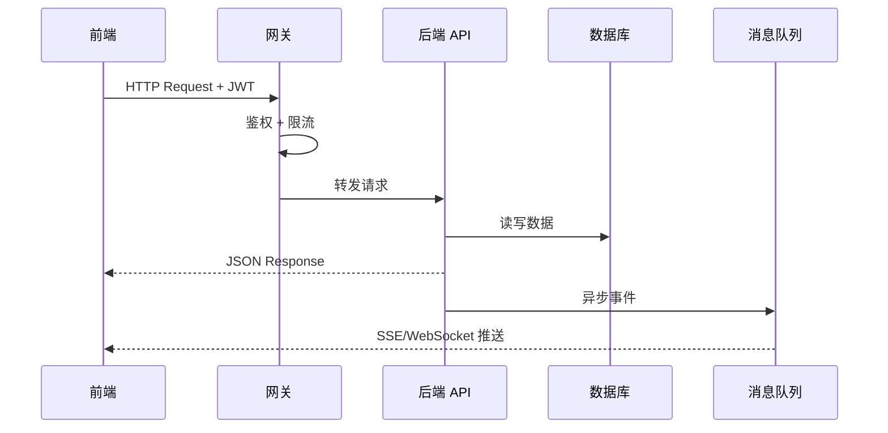

# 06f 段：[项目名称] - 产品需求文档 · 接口契约与埋点（第 11-12 章）

> 本文件是 [06-产品需求文档.md](./06-产品需求文档.md) 主控文档的**子段 6**。
> **核心章节**：第 11 章 接口契约、第 12 章 数据埋点与分析
>
> 📌 **一页纸摘要**:
> 1. 看完这页能回答:API 长啥样?上报什么事件?
> 2. 文档定位:设计级,06 主控的子段 6(契约层)
> 3. 核心动作:RESTful 详细定义 + 错误码 + 幂等 + 事件埋点
> 4. 何时使用:页面级方案的 API 契约 / 埋点设计
> 5. 不要用于:DB 表结构(→12)、技术实现(→09)
>
> 🔗 **关键引用**: `reference/12-value-matrix.md` (接口价值) · `reference/13-quality-selfcheck.md` (错误码自检) · `reference/15-five-field-crosscheck.md` (5字段交叉)

| 子段版本 | 日期 | 作者 | 说明 |
|----------|------|------|------|
| **3.0f** | YYYY-MM-DD | [Your Name] | 段 6：第 11-12 章 - 接口契约 + 数据埋点 |

---

## 段头契约

- **本段输入**：
  - 06e 的 **10.x 数据模型** → 11.x 接口字段定义
  - 06c 的 **6.x 页面** → 11.x 接口路径与请求
  - 06b 的 **3.x US** → 12.x 埋点事件
- **本段输出**：
  - 11.1 接口规范总则
  - 11.2 核心接口详细定义
  - 11.3 分页与排序
  - 11.4 文件上传
  - 11.5 错误码体系
  - 11.6 API 版本管理
  - 12.1 埋点事件设计表
  - 12.2 用户属性与标签
  - 12.3 全埋点策略
  - 12.4 数据质量要求
- **主控文件**：[06-产品需求文档.md](./06-产品需求文档.md)
- **章节范围**：11-12

---

## 11. 接口契约

⭐ **关键决策**：
- **RESTful 风格**（GET/POST/PUT/DELETE 严格按 HTTP 语义），复杂查询用 POST + `/search`
- **统一响应格式**：`{ code, message, data }`，**禁止直接返回裸数据**
- **分页规范**：列表查询必传 `pageNum` (1-based) + `pageSize` (默认 20，最大 100)
- **错误码分级**：4 位数字 = 业务域(2位) + 错误类型(2位)，如 `2001` = 用户域登录失败
- **必含字段**：5 字段(userId/status/必填规则/错误码/P0 功能名)必须 6 文档交叉一致(见 reference/15)

### 11.0 接口调用流程



### 11.1 接口规范总则

| 项目 | 规范 |
|------|------|
| **协议** | HTTPS（TLS 1.3） |
| **风格** | RESTful |
| **请求方法** | GET（查询）、POST（创建）、PUT（更新）、DELETE（删除）、PATCH（部分更新）|
| **数据格式** | application/json; charset=utf-8 |
| **字符编码** | UTF-8 |
| **时间格式** | ISO 8601（2026-06-03T10:30:00+08:00）|
| **金额单位** | 整数分（避免浮点精度）|
| **分页参数** | pageNum（从 1 开始）、pageSize（默认 20，最大 200）|
| **排序参数** | orderBy=field:asc，多字段逗号分隔 |
| **认证** | JWT（Bearer Token）+ SSO |
| **限流** | 查询 100/秒，写入 20/秒，导入 5/小时，导出 10/小时 |
| **幂等性** | POST 接口需支持 Idempotency-Key 请求头 |

### 11.2 核心接口详细定义

#### 接口 1：获取客户列表

```yaml
接口名称: 获取客户列表
方法: GET
路径: /api/v1/crm/customers
认证: Bearer Token
请求参数:
  query:
    pageNum: 1              # int 必填 默认1
    pageSize: 20            # int 必填 默认20 最大200
    keyword: 张三            # string 可选 搜索姓名/手机号
    source: DAWAN           # string 可选 来源系统
    registered: true        # bool 可选 是否注册
    level: GOLD             # string 可选 会员等级
    segmentId: 123          # long 可选 客群ID
    orderBy: createdAt:desc # string 可选 排序
请求头:
  Authorization: Bearer {token}
  X-Tenant-Id: {公司ID}
  X-Request-Id: {UUID}
成功响应 (200):
  {
    "code": 0,
    "message": "success",
    "data": {
      "total": 8500000,
      "list": [
        {
          "customerId": 100001,
          "oneId": "OID_888888",
          "phoneMasked": "138****5678",
          "nameMasked": "张*",
          "source": "DAWAN",
          "sourceCompany": "DAWAN",
          "registered": true,
          "level": "GOLD",
          "totalAmount": 18600.00,
          "lastPurchaseAt": "2026-05-20T14:30:00+08:00",
          "createdAt": "2023-05-15T10:00:00+08:00"
        }
      ],
      "pageNum": 1,
      "pageSize": 20
    },
    "traceId": "abc-123-def"
  }
失败响应:
  - 401: 未认证
  - 403: 无权限（跨公司）
  - 429: 请求过于频繁
  - 500: 服务器错误
超时时间: 5s
重试策略: GET可重试1次
幂等性: GET天然幂等
备注: 列表中敏感字段（手机号、姓名、身份证）已脱敏
```

#### 接口 2：客户 360° 详情

```yaml
接口名称: 客户360°详情
方法: GET
路径: /api/v1/crm/customer/{oneId}/profile
认证: Bearer Token
路径参数:
  oneId: OID_888888       # string 必填
请求头: 同上
成功响应 (200):
  {
    "code": 0,
    "data": {
      "oneId": "OID_888888",
      "basicInfo": {
        "phoneMasked": "138****5678",
        "nameMasked": "张*",
        "gender": "M",
        "ageRange": "30-35",
        "idCardMasked": "440***********1234"
      },
      "memberInfo": {
        "memberNo": "M_20260001",
        "level": "GOLD",
        "points": 18500,
        "registeredAt": "2023-05-15T10:00:00+08:00"
      },
      "consumption": {
        "totalAmount": 18600.00,
        "totalCount": 28,
        "avgPrice": 664.29,
        "lastPurchaseAt": "2026-05-20T14:30:00+08:00",
        "preferredRoute": "SZX-ZUH",
        "preferredTime": "WEEKEND_MORNING"
      },
      "tags": [
        {"tagId": "TAG_RFM_VALUE", "tagName": "RFM 重要价值", "value": "重要价值"},
        {"tagId": "TAG_AI_LOSS", "tagName": "流失预警", "value": 0.08}
      ],
      "segments": [
        {"segmentId": "SEG_001", "segmentName": "RFM 重要价值"},
        {"segmentId": "SEG_002", "segmentName": "活跃期"}
      ],
      "touchHistory": [...],
      "orderHistory": [...],
      "pointsHistory": [...]
    }
  }
失败响应:
  - 403: 无权限（跨公司数据，需配置共享）
  - 404: 客户不存在
  - 500: 服务器错误
超时: 3s
幂等性: GET天然幂等
```

#### 接口 3：圈选客群

```yaml
接口名称: 客群圈选
方法: POST
路径: /api/v1/cdp/segments/circle
请求体:
  {
    "name": "高频跨境+沉睡客户",
    "description": "高频跨境购票但最近90天无消费",
    "conditions": {
      "logic": "AND",
      "rules": [
        {"type": "TAG", "tagId": "TAG_ROUTE_HEAVY", "operator": "EQ", "value": "true"},
        {"type": "TAG", "tagId": "TAG_CRUISE_USER", "operator": "EQ", "value": "false"},
        {"type": "RFM", "field": "R", "operator": "GT", "value": 90},
        {"type": "ORDER", "field": "routeCode", "operator": "IN", "value": ["SZX-HKM", "SZX-MFM"]}
      ]
    }
  }
成功响应 (200):
  {
    "code": 0,
    "data": {
      "segmentId": "SEG_20260603_001",
      "name": "高频跨境+沉睡客户",
      "totalCount": 15234,
      "crossCompanyCount": {
        "DAWAN": 8234,
        "PAZHOU": 3500,
        "CHUANDAO": 2500,
        "NANSHA": 1000
      },
      "preview": "前100名客户..."
    }
  }
幂等性: 需 X-Idempotency-Key 请求头
超时: 30s（客群计算可能耗时）
重试: 不可重试
```

#### 接口 4：触达任务执行

```yaml
接口名称: 触达任务执行
方法: POST
路径: /api/v1/crm/touch/execute
请求体:
  {
    "segmentId": "SEG_20260603_001",
    "channel": "WECOM",
    "contentTemplateId": "TPL_WELCOME",
    "touchRules": {
      "priorityCompany": "DAWAN",
      "exclusiveHours": 48,
      "frequencyLimit": {
        "global": 4,
        "company": 2,
        "channel": 1
      }
    },
    "abTest": {
      "enabled": true,
      "groups": [
        {"name": "A组", "ratio": 0.5, "contentVariantId": "V1"},
        {"name": "B组", "ratio": 0.5, "contentVariantId": "V2"}
      ]
    }
  }
成功响应 (200):
  {
    "code": 0,
    "data": {
      "taskId": "T_20260603_001",
      "totalCount": 15234,
      "estimatedDuration": 3600,
      "frequencyCheckPassed": true,
      "blockedCount": 234,
      "blockedReasons": {
        "GLOBAL_LIMIT": 100,
        "COMPANY_LIMIT": 80,
        "CHANNEL_LIMIT": 54
      }
    }
  }
幂等性: 需 X-Idempotency-Key 请求头
超时: 10s
备注: 触达任务异步执行，本接口返回任务创建结果
```

#### 接口 5：OneID 合并（强关联）

```yaml
接口名称: OneID 合并
方法: POST
路径: /api/v1/cdp/oneid/merge
请求体:
  {
    "primaryCustomerId": 100001,
    "mergeCustomerIds": [100002, 100003],
    "matchReason": "SAME_ID_CARD",
    "confidence": 0.99
  }
成功响应 (200):
  {
    "code": 0,
    "data": {
      "oneId": "OID_888888",
      "mergedCount": 2,
      "mergedAt": "2026-06-03T10:30:00+08:00"
    }
  }
幂等性: 需 X-Idempotency-Key
超时: 5s
并发: 分布式锁（按 primaryCustomerId 加锁）
```

### 11.3 分页与排序

#### 11.3.1 分页参数

| 参数 | 说明 | 默认 | 范围 |
|------|------|------|------|
| `pageNum` | 页码 | 1 | ≥ 1 |
| `pageSize` | 每页大小 | 20 | 1-200 |

#### 11.3.2 响应格式

```json
{
  "code": 0,
  "data": {
    "list": [...],
    "total": 15234,
    "pageNum": 1,
    "pageSize": 20,
    "totalPages": 762,
    "hasNext": true,
    "hasPrev": false
  }
}
```

#### 11.3.3 排序参数

```
orderBy=field1:asc,field2:desc
```

支持多字段、升降序混合。

### 11.4 文件上传

#### 11.4.1 直传 OSS 流程

```yaml
# Step 1: 获取上传凭证
POST /api/v1/file/upload-token
请求体:
  {
    "fileName": "客户列表.csv",
    "fileSize": 1024000,
    "contentType": "text/csv",
    "purpose": "DATA_IMPORT"
  }
响应:
  {
    "uploadUrl": "https://oss.xxx/upload",
    "ossKey": "import/2026/06/03/xxx.csv",
    "expireAt": "2026-06-03T11:30:00+08:00"
  }

# Step 2: 前端 PUT 到 OSS
PUT {uploadUrl}
Body: <file binary>

# Step 3: 通知后端上传完成
POST /api/v1/file/upload-complete
请求体:
  {
    "ossKey": "import/2026/06/03/xxx.csv",
    "purpose": "DATA_IMPORT"
  }
```

#### 11.4.2 限制

- **格式**：CSV、XLSX、PDF、PNG、JPG
- **大小**：默认 50MB，导入类 200MB
- **数量**：单次最多 10 个文件

### 11.5 错误码体系

⭐ **关键决策**：
- **错误码 4 位数字** = 业务域(2位) + 错误类型(2位)
  - 业务域：10-用户 / 20-订单 / 30-支付 / 40-商品
  - 错误类型：01-参数错误 / 02-未授权 / 03-权限不足 / 04-资源不存在 / 05-系统错误
- **HTTP 状态码 vs 业务错误码分离**：HTTP 4xx/5xx 表示请求级，业务错误码表示业务规则
- **错误响应统一**：`{ code: 2001, message: "用户未登录", data: null, traceId: "xxx" }`

#### 11.5.1 错误码分层

| 段 | 含义 | 例子 |
|----|------|------|
| 0 | 成功 | 0 |
| 1xxx | 通用系统错误 | 1001参数错误、1002未授权、1003无权限、1004资源不存在、1005系统错误 |
| 2xxx | 用户/客户模块 | 2001客户不存在、2002手机号已注册、2003身份证已注册 |
| 3xxx | 触达/营销模块 | 3001触达频次超限、3002营销活动未开始、3003优惠券已领完 |
| 4xxx | OneID/数据治理 | 4001OneID冲突、4002合并失败、4003数据质量低 |
| 5xxx | 跨公司/权限 | 5001无跨公司权限、5002权限审批中、5003权限已过期 |
| 6xxx | AI/推荐 | 6001推荐服务不可用、6002AI标签刷新失败 |
| 9xxx | 第三方调用 | 9001短信网关超时、9002企微API失败 |

#### 11.5.2 错误响应格式

```json
{
  "code": 3001,
  "message": "触达频次超限",
  "data": null,
  "traceId": "abc-123-def",
  "errorDetail": {
    "limitType": "GLOBAL",
    "currentCount": 4,
    "limitCount": 4,
    "suggestion": "该客户本月触达已达上限，请下月再试或申请 VIP 豁免"
  }
}
```

### 11.6 API 版本管理

- **策略**：URL 路径版本（`/api/v1/`, `/api/v2/`）
- **废弃流程**：
  1. 提前 3 个月公告
  2. 过渡期双版本支持
  3. 调用方监控迁移
  4. 强制下线下线
- **向后兼容**：新增字段（可选）可向后兼容；删除/修改字段需新版本

---

## 12. 数据埋点与分析

⭐ **关键决策**：
- **3 类埋点策略**：代码埋点（精确，重要事件）/ 全埋点（量小事件）/ 可视化埋点（运营自助）
- **P0 事件每条含 7 字段**：标识 / 中文名 / 触发时机 / 属性 / 类型 / 必传 / 用途
- **属性命名规范**：snake_case，**禁止驼峰/拼音**
- **必传 vs 可选**：核心分析字段必传（如 customerId），辅助字段可选
- **数据质量红线**：丢包率 > 5% 必须告警；同一事件属性定义变更需版本管理

### 12.1 埋点事件设计表

> 🏗️ **填写要点**：每个 P0 事件必须含 7 个字段：标识/中文名/触发时机/属性/类型/必传/用途。

| 事件标识 | 事件中文名 | 触发时机 | 属性 | 类型 | 必传 | 用途 |
|----------|------------|----------|------|------|------|------|
| `page_view` | 页面浏览 | 页面加载完成 | pageId, pageName, referrer | string, string, string | 是 | 流量分析 |
| `customer_list_view` | 客户列表浏览 | 列表页加载 | companyId, filterConditions | string, json | 是 | 列表使用频次 |
| `customer_detail_view` | 客户详情浏览 | 详情页打开 | customerId, oneId, viewSource | long, string, string | 是 | 详情使用频次 |
| `customer_360_view` | 客户360°浏览 | 360°页打开 | customerId, tabName, loadTime | long, string, int | 是 | 360°使用分析 |
| `segment_create` | 客群创建 | 圈选提交 | segmentId, customerCount, conditions | long, int, json | 是 | 圈选使用 |
| `segment_export` | 客群导出 | 导出完成 | segmentId, customerCount, format | long, int, string | 是 | 导出使用 |
| `campaign_create` | 营销活动创建 | 创建提交 | campaignId, type, channel, customerCount | long, string, string, int | 是 | 营销使用 |
| `campaign_execute` | 营销活动执行 | 执行触发 | campaignId, channel, targetCount | long, string, int | 是 | 营销执行 |
| `campaign_complete` | 营销活动完成 | 活动结束 | campaignId, reachCount, convertCount, roi | long, int, int, decimal | 是 | 营销效果 |
| `touch_send` | 触达发送 | 触达发出 | touchId, channel, customerId | long, string, long | 是 | 触达量 |
| `touch_open` | 触达打开 | 用户打开 | touchId, openTime | long, datetime | 是 | 打开率 |
| `touch_click` | 触达点击 | 用户点击 | touchId, clickElement, clickTime | long, string, datetime | 是 | 点击率 |
| `touch_convert` | 触达转化 | 用户转化 | touchId, conversionType, conversionValue | long, string, decimal | 是 | 转化率 |
| `coupon_grant` | 优惠券发放 | 券发放 | couponId, customerId, amount | long, long, long | 是 | 券发放 |
| `coupon_use` | 优惠券使用 | 券核销 | couponId, customerId, orderId, discountAmount | long, long, long, long | 是 | 券核销 |
| `wecom_qrcode_scan` | 企微活码扫描 | 扫描活码 | qrcodeId, channel, scanTime | long, string, datetime | 是 | 引流分析 |
| `wecom_friend_add` | 企微好友添加 | 添加好友 | customerId, channel, addTime | long, string, datetime | 是 | 引流转化 |
| `dashboard_view` | 数据看板浏览 | 看板加载 | dashboardLevel, dimensions, filters | string, json, json | 是 | 看板使用 |
| `dashboard_drill_down` | 数据下钻 | 点击下钻 | fromLevel, toLevel, path | string, string, string | 是 | 下钻路径 |
| `dashboard_export` | 数据导出 | 导出完成 | dashboardLevel, format | string, string | 是 | 导出使用 |
| `ai_recommend_show` | AI 推荐展示 | 推荐位渲染 | recommendId, customerId, position | long, long, string | 是 | 推荐曝光 |
| `ai_recommend_click` | AI 推荐点击 | 用户点击 | recommendId, customerId | long, long | 是 | 推荐点击 |

### 12.2 用户属性与标签

#### 12.2.1 用户静态属性

| 属性 | 类型 | 来源 | 用途 |
|------|------|------|------|
| `registerTime` | datetime | 用户表 | 用户生命周期 |
| `registerSource` | string | 用户表 | 渠道分析 |
| `gender` | string | 用户表 | 人口统计 |
| `ageRange` | string | 用户表 | 人口统计 |
| `city` | string | 用户表 | 地域分析 |
| `device` | string | 设备表 | 设备分析 |

#### 12.2.2 用户动态属性

| 属性 | 类型 | 计算方式 | 更新频率 |
|------|------|----------|----------|
| `totalAmount` | decimal | 累计消费 | T+1 |
| `totalCount` | int | 累计消费次数 | T+1 |
| `lastPurchaseAt` | datetime | 最近消费 | 实时 |
| `lastTouchAt` | datetime | 最近触达 | 实时 |
| `points` | long | 当前积分 | 实时 |
| `level` | string | 当前等级 | 实时 |
| `lifecycle` | string | 新客/活跃/沉睡/流失 | T+1 |
| `rfmSegment` | string | RFM 分层 | T+1 |

#### 12.2.3 用户标签

| 标签 | 类型 | 数量级 | 计算方式 |
|------|------|--------|----------|
| 基础属性 | string | 5+ | 注册时填写 |
| 消费特征 | string/number | 10+ | 订单聚合 |
| 行为偏好 | string | 8+ | 行为埋点聚合 |
| 会员价值 | string | 5+ | 会员系统 |
| AI 预测 | number | 200+ | 机器学习模型 |

### 12.3 全埋点策略

#### 12.3.1 全埋点范围

- 所有按钮点击（自动采集 `data-track-id`）
- 所有页面浏览
- 表单提交
- 列表项点击

#### 12.3.2 自定义埋点范围

- 业务流程关键节点（如圈选提交、触达发送）
- 业务指标（如转化金额、ROI）
- AI 推荐效果

#### 12.3.3 元素标识规范

- HTML 元素加 `data-track-id="btn_submit_order"`
- ID 命名：`{模块}_{动作}_{对象}`，如 `customer_create_btn`、`campaign_execute_btn`
- 全局唯一，可追溯到 PRD

### 12.4 数据质量要求

| 指标 | 要求 |
|------|------|
| 上报成功率 | > 99% |
| 重复上报率 | < 0.1% |
| 字段缺失率 | < 0.5% |
| 事件丢失率 | < 0.01% |
| 上报延迟 | P95 < 1s |

### 12.5 数据应用闭环

```
埋点采集 → 实时计算（CEP） → 数仓（ODS/DWD/DWS/ADS）→ BI 看板
                                                ↓
                                      触发自动化营销（MA）
                                                ↓
                                         触达用户 → 再次埋点
```

---

## 📋 段完成度自检

- [ ] 11.1 接口规范总则：12 项基础规范
- [ ] 11.2 核心接口：≥ 5 个核心接口，每个含 8 字段（请求/响应/错误码/超时/重试/幂等/备注/示例）
- [ ] 11.3 分页与排序：参数 + 响应格式
- [ ] 11.4 文件上传：直传 OSS 流程
- [ ] 11.5 错误码体系：分层错误码（≥ 6 段）
- [ ] 11.6 API 版本管理：策略 + 废弃流程
- [ ] 12.1 埋点事件：≥ 15 个核心事件，每个含 7 字段
- [ ] 12.2 用户属性：静态 + 动态 + 标签
- [ ] 12.3 全埋点策略：范围 + 标识规范
- [ ] 12.4 数据质量：5 项指标

**段价值**：本段产出后，可以**直接开始**：
- 前端接口对接
- 后端接口实现
- 埋点 SDK 接入
- 数据看板搭建

**下游依赖**：
- 03-接口文档.md：依赖本段 → 详细 API 契约
- 11-Mock数据文档.md：依赖本段 → Mock 数据
- 04-前端开发指南.md：依赖本段 → 埋点规范


## 摘要(降级输出,200 字内)

> 模板定位摘要(全受众可见)。完整定义见下方各章。
> 模板定位:11.0 接口调用流程

**模板说明**:`06f 段：[项目名称] - 产品需求文档 · 接口契约与埋点（第 11-12 章）`

**关键数字/对象**:见完整版

**完整版见**:`06f-产品需求-接口与埋点.md`(主受众可访问)
