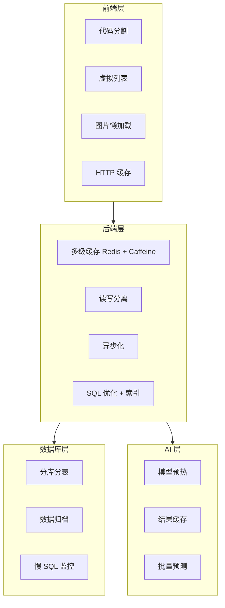

# 06g 段：[项目名称] - 产品需求文档 · 非功能需求与测试（第 13-14 章）

> 本文件是 [06-产品需求文档.md](./06-产品需求文档.md) 主控文档的**子段 7**。
> **核心章节**：第 13 章 非功能需求、第 14 章 测试策略
>
> 📌 **一页纸摘要**:
> 1. 看完这页能回答:性能/安全/兼容达标?怎么测?测什么?
> 2. 文档定位:设计级,06 主控的子段 7(质量层)
> 3. 核心动作:性能指标 + 安全规范 + 兼容要求 + 测试金字塔
> 4. 何时使用:页面级方案的非功能层
> 5. 不要用于:具体实现(→09)、具体测试(→07)
>
> 🔗 **关键引用**: `reference/12-value-matrix.md` (非功能价值) · `reference/13-quality-selfcheck.md` (性能自检) · `reference/15-five-field-crosscheck.md` (5字段交叉)

| 子段版本 | 日期 | 作者 | 说明 |
|----------|------|------|------|
| **3.0g** | YYYY-MM-DD | [Your Name] | 段 7：第 13-14 章 - 非功能需求 + 测试策略 |

---

## 段头契约

- **本段输入**：
  - 06c 的 **6.x 页面** → 13.x 性能/兼容性
  - 06b 的 **3.x US** → 14.x 测试用例
  - 06e 的 **9.x 规则** → 14.x 测试场景
- **本段输出**：
  - 13.1 性能需求
  - 13.2 安全需求
  - 13.3 可用性与容错
  - 13.4 兼容性
  - 13.5 隐私合规
  - 13.6 国际化
  - 14.1 测试金字塔
  - 14.2 基于 US 的测试用例
  - 14.3 测试数据与 Mock
  - 14.4 性能测试
  - 14.5 兼容性测试
- **主控文件**：[06-产品需求文档.md](./06-产品需求文档.md)
- **章节范围**：13-14

---

## 13. 非功能需求

⭐ **关键决策**：
- **性能 4 指标必定义**：P95 响应时间（< 2s）/ QPS 峰值 / 并发用户数 / 可用性 SLA（99.9%）
- **性能优化 4 层**：前端（缓存/懒加载）/ 网络（CDN/压缩）/ 应用（连接池/异步）/ DB（索引/SQL 优化）
- **安全 OWASP Top 10 必检**：注入/XSS/CSRF/越权/敏感数据/日志泄露 等
- **可用性 4 个 9 含义**：99.9% = 年停机 < 8.76h，99.99% = < 52min（成本差 10 倍）
- **兼容性矩阵**：浏览器 × 操作系统 × 设备型号（**禁止"全兼容"**）

### 13.0 性能优化分层



### 13.1 性能需求

#### 13.1.1 前端性能

| 指标 | PC Web | 移动 H5 | 小程序 |
|------|--------|---------|--------|
| 首屏加载（FP） | ≤ 1s | ≤ 1.5s | ≤ 1s |
| 首屏可交互（FCP） | ≤ 1.5s | ≤ 2s | ≤ 1.5s |
| 页面切换 | ≤ 300ms | ≤ 300ms | ≤ 300ms |
| 列表滚动 | 60fps | 60fps | 60fps |
| 包大小 | ≤ 3MB（gzip）| ≤ 1MB | ≤ 2MB |
| 图片懒加载 | ✅ | ✅ | ✅ |
| CDN 加速 | ✅ | ✅ | ✅ |

#### 13.1.2 后端性能

| 接口类别 | P95 响应 | P99 响应 | 并发 |
|----------|----------|----------|------|
| 查询接口（轻量）| ≤ 200ms | ≤ 500ms | 1000 QPS |
| 查询接口（重量）| ≤ 500ms | ≤ 1s | 200 QPS |
| 写入接口 | ≤ 500ms | ≤ 1s | 100 QPS |
| 数据导入 | ≤ 5min/100万条 | — | 1 任务/租户 |
| 数据导出 | ≤ 30s/10万条 | — | 5 QPS/租户 |
| 看板查询 | ≤ 3s | ≤ 5s | 50 QPS |
| AI 预测 | ≤ 1s | ≤ 2s | 100 QPS |

#### 13.1.3 数据接入

| 指标 | 要求 |
|------|------|
| API 推送延迟 | ≤ 5min |
| Canal 同步延迟 | ≤ 1min |
| ETL 迁移速度 | ≥ 1万条/秒 |
| 数据延迟（端到端）| ≤ 5min |

#### 13.1.4 容量

| 指标 | 要求 |
|------|------|
| 总客户数 | ≥ 1亿 |
| 日活用户 | ≥ 100万 |
| 日订单量 | ≥ 500万 |
| 触达任务并发 | ≥ 100 |
| 看板并发用户 | ≥ 500 |

#### 13.1.5 性能优化策略

- **前端**：代码分割、按需加载、虚拟列表、图片懒加载、骨架屏、缓存（HTTP Cache + LocalStorage + Memory）
- **后端**：多级缓存（Redis + Caffeine）、读写分离、连接池、异步化、SQL 优化、索引
- **数据库**：分库分表、归档历史数据、慢 SQL 监控
- **AI**：模型预热、结果缓存、批量预测

### 13.2 安全需求

⭐ **关键决策**：
- **认证 3 选 1**：JWT（自研 REST API）/ OAuth 2.0（第三方授权）/ mTLS（服务间）
- **OWASP Top 10 必检项**：SQL 注入 / XSS / CSRF / 越权 / 敏感数据泄露 / 日志泄露 / SSRF
- **数据脱敏规则**：身份证/手机/银行卡 必脱敏（如 `138****1234`）
- **HTTPS 强制**：所有 API 必须 HTTPS，HTTP 自动 301 跳转
- **密钥管理**：API Key/Secret 必用 Vault / 密钥管理服务，**禁止明文写在 config 文件**

#### 13.2.1 认证与授权

| 项目 | 要求 |
|------|------|
| 认证 | JWT + SSO 单点登录 |
| 密码 | 8 位以上 + 复杂度要求 + bcrypt 加密 |
| 二次验证 | 重要操作（如删除、导出 ≥ 10万条）需短信验证 |
| 密码策略 | 90 天强制修改、5 次错误锁定 |
| Token 过期 | 30 分钟（可刷新至 7 天）|
| 权限模型 | RBAC + 数据权限（行级）|

#### 13.2.2 数据安全

| 项目 | 要求 |
|------|------|
| 传输 | 全站 HTTPS（TLS 1.3） |
| 存储 | 敏感数据 AES-256 加密（手机号、身份证号）|
| 脱敏 | 列表展示脱敏（138****5678、440***********1234、张*）|
| 日志 | 不记录明文敏感数据 |
| 备份 | 每日全量备份 + 实时 binlog |
| 加密算法 | 国密 SM4（可选）+ AES-256 |

#### 13.2.3 应用安全

| 威胁 | 防护 |
|------|------|
| SQL 注入 | 参数化查询 + ORM + WAF |
| XSS | 输入过滤 + 输出转义 + CSP |
| CSRF | Token 验证 + SameSite Cookie |
| DDoS | WAF + CDN + 限流 |
| 越权 | 前后端双重校验（前端按钮隐藏 + 后端接口鉴权）|
| 文件上传 | 格式校验 + 大小限制 + 病毒扫描 |

#### 13.2.4 业务安全

| 项目 | 要求 |
|------|------|
| 防刷 | 图形验证码（登录/注册）+ 滑块验证（高频接口）|
| 风控 | 异常登录检测（异地/IP 异常）+ 大额消费风控 |
| 审计 | 所有写操作记录审计日志（保留 3 年）|
| 数据导出审批 | ≥ 10万条需审批 |

### 13.3 可用性与容错

#### 13.3.1 可用性指标

| 指标 | 要求 |
|------|------|
| 系统可用性 | ≥ 99.9%（核心功能）|
| 计划内停机 | ≤ 4小时/月（凌晨 2-6 点）|
| 故障恢复 RTO | ≤ 30min |
| 数据恢复 RPO | ≤ 5min |

#### 13.3.2 弱网/容错

| 场景 | 处理 |
|------|------|
| 网络断开 | 缓存上次数据 + 提示用户 + 重连后自动重试 |
| 接口超时 | 自动重试 1 次（GET 类） + 用户提示 |
| 接口 5xx | 显示友好错误页 + 重试按钮 + 自动上报 Sentry |
| 接口 4xx | 字段级错误提示 |
| 服务降级 | 关键功能不可用时，提供简化版本（如导出失败时返回 CSV 链接）|
| 限流 | 429 错误 + "请求过于频繁" + 倒计时 |

#### 13.3.3 灰度与回滚

| 项目 | 要求 |
|------|------|
| 灰度策略 | 1% → 10% → 50% → 100% |
| 灰度维度 | 用户 ID 尾号、地域、新老用户、分公司 |
| 回滚时间 | ≤ 5min（数据库 + 应用 + 配置）|
| Feature Flag | 核心新功能支持远程开关 |

### 13.4 兼容性

#### 13.4.1 浏览器

| 浏览器 | 最低版本 |
|--------|----------|
| Chrome | 100+ |
| Edge | 100+ |
| Firefox | 90+ |
| Safari | 14+ |
| 360 浏览器 | 兼容模式 |
| 微信内置 | 最新 |

#### 13.4.2 操作系统

| OS | 最低版本 |
|----|----------|
| Windows | 10/11 |
| macOS | 12+ |
| iOS | 14+ |
| Android | 9+ |

#### 13.4.3 屏幕

| 设备 | 分辨率 |
|------|--------|
| PC | 1280×720+（推荐 1920×1080）|
| 移动 H5 | 320×568+ |
| Pad | 1024×768+（横屏适配）|
| 折屏 | 适配内屏 + 外屏切换 |

### 13.5 隐私合规

#### 13.5.1 法律合规

| 法律 | 重点要求 |
|------|----------|
| 《个人信息保护法》 | 明示同意、最小化采集、加密存储、可删除 |
| 《数据安全法》 | 数据分级分类、脱敏、审计、跨境管控 |
| 《网络安全法》 | 实名认证、日志留存 ≥ 6 个月 |
| 港澳法规 | 跨境数据流动需审批、客户明确授权 |

#### 13.5.2 隐私设计

| 项目 | 要求 |
|------|------|
| 隐私政策 | 首次进入弹窗 + 用户主动可查看 |
| 用户授权 | 显式勾选（默认不勾选）|
| 数据删除 | 注销账户 7 日内删除 / 匿名化 |
| 数据导出 | 用户可申请导出个人数据（GDPR）|
| Cookie | 首次访问弹窗，可拒绝 |
| 第三方 SDK | 明确告知 + 用户授权 |

#### 13.5.3 实名制合规

- **最小化采集**：仅采集业务必需字段
- **加密存储**：身份证号 AES-256
- **访问审计**：所有读操作记录日志
- **权限隔离**：客服只能看脱敏数据，看明文需审批
- **数据保留**：3 年，超期匿名化处理

### 13.6 国际化（可选）

| 项目 | 要求 |
|------|------|
| 文案 | i18n 资源文件，支持中/英 |
| 日期 | ISO 8601 + 时区 |
| 货币 | 整数分 + 多币种（CNY/HKD/MOP）|
| 数字 | 千分位 + 小数位 |
| 布局 | RTL 语言支持（预留）|

---

## 14. 测试策略

⭐ **关键决策**：
- **测试金字塔 60/30/10**：单元 60% / 集成 30% / E2E 10%
- **E2E 必含 5 路径**：登录 / 主流程 / 支付 / 导出 / 权限（覆盖 80% 用户路径）
- **测试数据 3 原则**：独立性（每用例独立）/ 可重现（固定种子）/ 隔离（不污染生产）
- **Mock 边界**：外部依赖必 Mock（API/DB/时间），业务逻辑不 Mock
- **覆盖率红线**：核心模块 ≥ 80%，工具类 ≥ 90%，**UI 组件 ≥ 60%**

### 14.1 测试金字塔

```
        /\
       /E2E\         10%
      /------\       - Playwright + Cypress
     /集成测试 \      20%
    /----------\     - 接口测试 + 数据库交互
   /  单元测试  \    70%
  /--------------\   - 业务逻辑 + 工具函数
```

| 层级 | 范围 | 工具 | 覆盖率要求 |
|------|------|------|------------|
| **单元测试** | 业务逻辑、工具函数 | Jest / Mocha | 核心代码 ≥ 80% |
| **集成测试** | 接口契约、数据库交互、第三方 Mock | Postman / Newman + Junit | 100% 核心接口 |
| **E2E** | 核心用户路径 | Playwright / Cypress | 100% P0 路径 |
| **手动探索** | 异常场景、UI 适配 | — | 按需 |
| **UAT** | 业务方按用例验收 | — | 100% P0 |

### 14.2 基于用户故事的测试用例

> 🏗️ **填写要点**：每个 P0/P1 US 必须含 Given-When-Then 格式的测试场景。

#### US-100 用户列表查询

| 场景 | 前置条件 | 步骤 | 预期结果 | 优先级 |
|------|----------|------|----------|--------|
| 正常查询 | 已登录、有 100 条数据 | 输入搜索条件 → 点击搜索 | 返回匹配的列表 + 分页 | P0 |
| 空数据 | 搜索结果为空 | 输入"不存在的姓名" | 显示空数据插画 + "暂无数据" | P0 |
| 网络错误 | 网络断开 | 点击搜索 | 显示网络错误 + 重试按钮 | P0 |
| 服务器错误 | 后端 500 | 点击搜索 | 显示服务器错误 + 刷新按钮 | P0 |
| 无权限 | 跨公司查询 | 切换到其他公司 | 显示无权限 + 申请按钮 | P0 |
| 大数据量 | 10万条数据 | 查询所有 | 列表加载 ≤ 3s + 虚拟滚动 | P1 |
| 排序 | — | 点击列名排序 | 按指定字段排序 | P1 |
| 导出 | — | 点击导出 | 下载 CSV + 后台异步导出 | P1 |
| 翻页 | — | 点击下一页 | 加载下一页数据 | P1 |
| 多选 | — | 勾选多条 | 显示批量操作按钮 | P2 |

#### US-200 OneID 合并

| 场景 | 前置条件 | 步骤 | 预期结果 | 优先级 |
|------|----------|------|----------|--------|
| 强关联合并 | 同一身份证号 | 点击合并 | OneID 归一 + 审计日志 | P0 |
| 弱关联审核 | 置信度 70-90% | 进入审核队列 | 显示待审列表 + 详情 | P0 |
| 合并冲突 | 同时合并同一客户 | 并发点击 | 第二个请求返回 4001 错误 | P0 |
| 合并回滚 | 误合并 | 申请回滚 | OneID 拆分 + 审计日志 | P1 |
| 跨公司合并 | 跨公司客户 | 提交合并 | 需审批（5002 错误）| P1 |

#### US-310 营销活动执行

| 场景 | 前置条件 | 步骤 | 预期结果 | 优先级 |
|------|----------|------|----------|--------|
| 正常执行 | 客群 1万 | 点击执行 | 任务创建 + 异步执行 | P0 |
| 频次超限 | 部分客户已超 | 点击执行 | 返回 3001 + 拦截明细 | P0 |
| 客群为空 | 客群 0 | 点击执行 | 返回 S3 空数据 + 提示 | P0 |
| A/B 测试 | 配置 2 组 | 点击执行 | 按比例分组 + 置信度跟踪 | P1 |
| 灰度启动 | 配置 1% | 启动 | 仅 1% 用户收到 | P1 |

#### US-100 用户→会员转化

| 场景 | 前置条件 | 步骤 | 预期结果 | 优先级 |
|------|----------|------|----------|--------|
| 正常转化 | 首次购票 | 触发 | 发送短信 + 引导注册 | P0 |
| 已注册 | 已是会员 | 触发 | 跳过转化流程 | P0 |
| 短信失败 | 短信网关超时 | 触发 | 标记重试（最多 3 次）| P0 |
| 7天未转化 | 触发 7 天 | — | 标记"流失待唤醒"| P1 |
| 重新转化 | 已流失 | 营销召回 | 重新进入转化流程 | P2 |

### 14.3 测试数据与 Mock

#### 14.3.1 测试数据准备

| 数据类型 | 准备方式 | 数量 | 来源 |
|----------|----------|------|------|
| 客户 | 自动化脚本生成 + 脱敏生产数据 | 1万+ | 工厂类 |
| 订单 | 历史数据脱敏 | 5万+ | 备份 |
| 触达 | 模拟生成 | 1000+ | 工厂类 |
| 客群 | 预设固定客群 | 50 | 手工 |
| 会员 | 覆盖各等级 | 100/等级 | 工厂类 |

#### 14.3.2 Mock 服务

| Mock 对象 | 实现 | 用途 |
|-----------|------|------|
| 短信网关 | Mock 服务器（返回成功/失败/超时）| 测试触达 |
| 企微 API | Mock 服务器 | 测试企微功能 |
| 支付网关 | Mock 服务器（成功/失败/退款）| 测试支付 |
| OSS | Mock 服务器 | 测试文件上传 |
| AI 模型 | 预设返回值 | 测试推荐 |

#### 14.3.3 测试场景

| 场景 | 实现 |
|------|------|
| 网络断开 | Charles 断网 / Chrome DevTools |
| 接口超时 | Postman 设置超时 / Mock 服务 |
| 接口 500 | Mock 服务返回 500 |
| 数据冲突 | 构造并发场景 |
| 大量数据 | 工厂类批量生成 |

### 14.4 性能测试

#### 14.4.1 压测指标

| 场景 | 目标 | 工具 |
|------|------|------|
| 登录 | 1000 并发 ≤ 2s | JMeter / k6 |
| 客户查询 | 1000 QPS P95 ≤ 500ms | JMeter / k6 |
| 营销活动执行 | 100 并发任务 | k6 |
| 数据看板 | 500 并发 P95 ≤ 3s | JMeter / k6 |
| 数据导入 | 100万条 ≤ 30min | 自研脚本 |
| AI 推荐 | 1000 QPS P95 ≤ 1s | k6 |

#### 14.4.2 测试场景

- **基准测试**：单接口压测
- **峰值测试**：2x 日常流量
- **耐久测试**：持续 1 小时
- **突发测试**：瞬间 10x 流量

### 14.5 兼容性测试

#### 14.5.1 浏览器兼容矩阵

| 浏览器 | Windows | macOS |
|--------|---------|-------|
| Chrome 100+ | ✅ | ✅ |
| Chrome 最新 | ✅ | ✅ |
| Edge 100+ | ✅ | ✅ |
| Firefox 90+ | ✅ | ✅ |
| Safari 14+ | — | ✅ |
| 360 浏览器 | ✅ | — |
| 微信内置 | — | — |

#### 14.5.2 设备兼容矩阵

| 设备 | 屏幕 | 状态 |
|------|------|------|
| iPhone SE | 320×568 | ✅ |
| iPhone 14 | 390×844 | ✅ |
| iPhone 14 Pro Max | 430×932 | ✅ |
| iPad | 1024×768 | ✅ |
| iPad Pro | 1024×1366 | ✅ |
| Android - 小米 | 360×640 | ✅ |
| Android - 华为 | 360×780 | ✅ |
| Android - 三星 | 412×915 | ✅ |

#### 14.5.3 测试方法

- 自动化：Playwright 多浏览器 + Appium 移动端
- 手动：真机测试
- 云测试：BrowserStack / Sauce Labs

### 14.6 安全测试

| 项目 | 工具 | 频率 |
|------|------|------|
| 漏洞扫描 | OWASP ZAP | 每周 |
| 渗透测试 | 第三方 | 季度 |
| 依赖漏洞扫描 | npm audit / Snyk | 每次构建 |
| 代码审计 | SonarQube | 每次 PR |
| SQL 注入 | sqlmap | 季度 |

---

## 📋 段完成度自检

- [ ] 13.1 性能：前端/后端/数据接入/容量 4 维度
- [ ] 13.2 安全：认证授权/数据/应用/业务 4 维度
- [ ] 13.3 可用性：可用性指标/弱网容错/灰度回滚
- [ ] 13.4 兼容性：浏览器/操作系统/屏幕 3 维度
- [ ] 13.5 隐私合规：法律/隐私设计/实名制
- [ ] 14.1 测试金字塔：5 层级
- [ ] 14.2 测试用例：每个 P0 US 至少 5 个场景
- [ ] 14.3 测试数据：Mock 服务 + 场景
- [ ] 14.4 性能测试：≥ 6 个核心场景
- [ ] 14.5 兼容性：浏览器 + 设备
- [ ] 14.6 安全测试：5 项

**段价值**：本段产出后，测试团队可以**直接开始**：
- 测试用例设计
- 自动化测试脚本
- 性能压测
- 兼容性测试

**下游依赖**：
- 07-测试用例.md：依赖本段 → 详细测试步骤
- 09-后端开发指南.md：依赖本段 → 性能/安全规范
- 04-前端开发指南.md：依赖本段 → 性能/兼容性规范


## 摘要(降级输出,200 字内)

> 模板定位摘要(全受众可见)。完整定义见下方各章。
> 模板定位:13.0 性能优化分层

**模板说明**:`06g 段：[项目名称] - 产品需求文档 · 非功能需求与测试（第 13-14 章）`

**关键数字/对象**:见完整版

**完整版见**:`06g-产品需求-非功能与测试.md`(主受众可访问)
