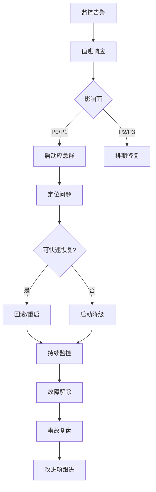

# 06h 段：[项目名称] - 产品需求文档 · 项目发布与附录（第 15-16 章）

> 本文件是 [06-产品需求文档.md](./06-产品需求文档.md) 主控文档的**子段 8**。
> **核心章节**：第 15 章 项目与发布管理、第 16 章 附录
>
> 📌 **一页纸摘要**:
> 1. 看完这页能回答:怎么发布?怎么回滚?术语是什么?
> 2. 文档定位:设计级,06 主控的子段 8(收口层)
> 3. 核心动作:里程碑 + 灰度 + 回滚 + 监控 + 术语表
> 4. 何时使用:页面级方案的发布层 / 交付物收口
> 5. 不要用于:技术实施(→09/13)、测试执行(→07)
>
> 🔗 **关键引用**: `reference/12-value-matrix.md` (发布价值) · `reference/13-quality-selfcheck.md` (发布自检) · `reference/15-five-field-crosscheck.md` (5字段交叉)

| 子段版本 | 日期 | 作者 | 说明 |
|----------|------|------|------|
| **3.0h** | YYYY-MM-DD | [Your Name] | 段 8：第 15-16 章 - 发布管理 + 附录 |

---

## 段头契约

- **本段输入**：所有上游段（06a-06g）的关键输出
- **本段输出**：
  - 15.1 里程碑与排期
  - 15.2 发布策略
  - 15.3 监控与报警
  - 15.4 上线后验证 Checklist
  - 16.1 术语表
  - 16.2 参考资料
  - 16.3 FAQ
  - 16.4 待确认事项
- **主控文件**：[06-产品需求文档.md](./06-产品需求文档.md)
- **章节范围**：15-16

---

## 15. 项目与发布管理

⭐ **关键决策**：
- **6 阶段标准节奏**：需求评审(D-30) → 设计(D-25) → 开发(D-15) → 联调(D-5) → 上线(D0) → 复盘(D+7)
- **每个阶段含 4 字段**：产出 / 责任人 / 截止 / 备注（"按情况" 不算备注）
- **里程碑必含验收标准**：D0 上线 ≠ "发布按钮按一下" — 必含功能验证清单 + 监控就位确认
- **风险预案**：每个里程碑标"如果延期 N 天"的备选方案

### 15.1 里程碑与排期

> 🏗️ **填写要点**：每个阶段含产出、责任人、截止、备注。

| 阶段 | 产出 | 责任人 | 截止 | 备注 |
|------|------|--------|------|------|
| **需求评审** | PRD 评审通过 | PM | D-30 | 邀请业务、技术、设计、测试 |
| **设计评审** | 设计稿定稿 | UI/UX | D-25 | 高保真 + 交互说明 |
| **技术方案** | 方案文档 + 评审 | 技术负责人 | D-20 | 含架构、数据库、接口 |
| **任务拆分** | 任务列表 | PM + Tech Lead | D-18 | 1-3 天/任务 |
| **开发** | 代码完成 + 自测 | 前端/后端 | D-10 | 分模块提测 |
| **联调** | 前后端联调完成 | 开发 | D-7 | Mock 切真实接口 |
| **测试** | 测试报告 | QA | D-3 | 无 P0/P1 bug |
| **产品验收** | 体验通过 | PM | D-2 | UAT 报告 |
| **灰度发布** | 1% → 10% → 50% | 运维 | D-1 | 监控核心指标 |
| **全量上线** | 所有用户可用 | 运维 | D-Day | 通知 + 文档发布 |
| **线上监控** | 无严重报警 | 所有人 | 持续 | 7×24 监控 |

### 15.2 发布策略

#### 15.2.1 灰度规则

| 阶段 | 比例 | 时长 | 关注指标 |
|------|------|------|----------|
| 内部灰度 | 员工账号 | 1 天 | 核心功能可用 |
| 1% 灰度 | 1% 用户 | 1 天 | 错误率 < 0.5% |
| 10% 灰度 | 10% 用户 | 2 天 | 错误率 < 0.3% |
| 50% 灰度 | 50% 用户 | 3 天 | 错误率 < 0.1% |
| 100% 上线 | 全量 | — | — |

**灰度维度**：
- 用户 ID 尾号（如 1% = 尾号 0-9 中随机 1 个）
- 地域（按省份）
- 新老用户
- 分公司

#### 15.2.2 Feature Flag

- **核心新功能必须配置 Feature Flag**
- 远程开关，支持实时上下线
- 灰度期间默认关闭，可按灰度维度开启

#### 15.2.3 回滚方案

| 层级 | 回滚步骤 | 预计耗时 |
|------|----------|----------|
| **应用回滚** | K8s 回滚到上一个版本 | ≤ 2min |
| **数据库回滚** | 备份恢复 + binlog 回放 | ≤ 10min |
| **配置回滚** | 配置中心历史版本回滚 | ≤ 1min |
| **缓存清理** | Redis flush（按需）| ≤ 30s |
| **CDN 刷新** | 刷新静态资源 | ≤ 5min |

**回滚决策**：
- 错误率 > 1% 持续 5min
- 核心功能 P0 故障
- 性能下降 > 50%
- 安全漏洞

### 15.3 监控与报警

#### 15.3.1 监控指标

| 类别 | 指标 | 阈值 | 报警 |
|------|------|------|------|
| **接口** | QPS | 按接口基线 | 偏离 ±50% 报警 |
| **接口** | 错误率 | ≤ 0.5% | > 0.5% 报警 |
| **接口** | P95 响应 | 按接口基线 | 翻倍 报警 |
| **业务** | 触达成功率 | ≥ 99% | < 99% 报警 |
| **业务** | 客群计算成功率 | ≥ 99.5% | < 99% 报警 |
| **业务** | 数据接入延迟 | ≤ 5min | > 5min 报警 |
| **资源** | CPU 使用率 | ≤ 70% | > 80% 报警 |
| **资源** | 内存使用率 | ≤ 80% | > 90% 报警 |
| **资源** | 磁盘使用率 | ≤ 80% | > 85% 报警 |
| **资源** | 数据库连接数 | ≤ 80% | > 80% 报警 |

#### 15.3.2 报警渠道

- **P0 故障**：电话 + 短信 + 企微（oncall 工程师）
- **P1 故障**：短信 + 企微（oncall 工程师 + 技术负责人）
- **P2 警告**：企微群（运维 + 开发）
- **P3 提示**：邮件（日报）

#### 15.3.3 监控工具

- **指标**：Prometheus + Grafana
- **日志**：ELK（Elasticsearch + Logstash + Kibana）
- **链路追踪**：SkyWalking / Jaeger
- **错误监控**：Sentry
- **业务监控**：自研大盘（基于 06f 埋点）

### 15.4 上线后验证 Checklist

#### 15.4.1 上线前 1 天

- [ ] 备份数据库
- [ ] 备份配置文件
- [ ] 通知所有相关方
- [ ] 准备回滚脚本
- [ ] 准备值班人员

#### 15.4.2 上线中

- [ ] 灰度发布 1%
- [ ] 监控核心指标 30min
- [ ] 灰度发布 10%
- [ ] 监控核心指标 2h
- [ ] 灰度发布 50%
- [ ] 监控核心指标 6h

#### 15.4.3 上线后 24h

- [ ] 核心流程回归测试
- [ ] 埋点数据回传正确
- [ ] 真实金额小笔验证
- [ ] 错误日志无新增异常
- [ ] 性能指标符合预期
- [ ] 用户反馈渠道畅通

#### 15.4.4 上线后 7 天

- [ ] 数据周报
- [ ] 用户反馈汇总
- [ ] 性能基线对比
- [ ] Bug 统计与修复
- [ ] 功能开关清理（100% 后关闭）
- [ ] 项目复盘会议

### 15.5 风险与应对

| 风险 | 等级 | 应对 |
|------|------|------|
| 数据迁移失败 | 🔴 高 | 分批迁移 + 双写期 1 个月 + 校验脚本 |
| 跨公司数据冲突 | 🟡 中 | 集团统一规则 + 权限审批 + 审计 |
| AI 模型冷启动 | 🟡 中 | 规则标签优先 + AI 标签二期 |
| 性能不达标 | 🟡 中 | 性能压测 + 容量评估 + 弹性扩容 |
| 实名制合规 | 🔴 高 | 法务早期介入 + 加密 + 脱敏 + 审计 |
| 业务方接受度 | 🟡 中 | 试点先行 + 培训赋能 + 反馈机制 |
| 第三方接口不可用 | 🟡 中 | 监控 + 降级 + 备用方案 |

---

## 16. 附录

### 16.1 术语表

| 术语 | 英文 | 解释 |
|------|------|------|
| **CDP** | Customer Data Platform | 客户数据平台，汇聚全渠道客户数据 |
| **CRM** | Customer Relationship Management | 客户关系管理系统 |
| **OneID** | One Identifier | 跨系统统一身份识别 |
| **RFM** | Recency/Frequency/Monetary | 客户价值分层模型 |
| **AIPL** | Awareness/Interest/Purchase/Loyalty | 客户旅程阶段模型 |
| **MA** | Marketing Automation | 营销自动化 |
| **LTV** | Life Time Value | 客户终身价值 |
| **SSO** | Single Sign On | 单点登录 |
| **ETL** | Extract/Transform/Load | 数据抽取转换加载 |
| **AI 标签** | AI-predicted Tag | 基于机器学习自动生成的预测标签 |
| **客群分层** | Customer Segmentation | 按 RFM 等模型分层 |
| **触达疲劳度** | Touch Frequency Fatigue | 触达频次控制，避免客户被骚扰 |
| **协同触达** | Collaborative Touch | 多分公司合作触达同一客户 |
| **归因分析** | Attribution Analysis | 多触点贡献度分析 |
| **桶** | Bucket | 数据分桶（如按天、按地域）|
| **金卡** | Gold Member | 会员等级 |
| **钻石** | Diamond Member | 最高会员等级 |
| **DAU** | Daily Active Users | 日活跃用户数 |
| **MAU** | Monthly Active Users | 月活跃用户数 |
| **QPS** | Queries Per Second | 每秒查询数 |
| **P95** | 95th Percentile | 95% 请求在此时间内完成 |
| **RTO** | Recovery Time Objective | 恢复时间目标 |
| **RPO** | Recovery Point Objective | 数据恢复点目标 |
| **WAF** | Web Application Firewall | Web 应用防火墙 |
| **JWT** | JSON Web Token | 跨域认证令牌 |
| **CSRF** | Cross-Site Request Forgery | 跨站请求伪造 |
| **XSS** | Cross-Site Scripting | 跨站脚本攻击 |
| **CSP** | Content Security Policy | 内容安全策略 |
| **GRPC** | gRPC Remote Procedure Call | 高性能 RPC 框架 |
| **OSS** | Object Storage Service | 对象存储服务 |

### 16.2 参考资料

| 文档类型 | 文档名 | 链接 |
|----------|--------|------|
| 设计稿 | Figma 设计稿 | [链接] |
| 技术方案 | 13-架构设计.md | [链接] |
| 接口文档 | 03-接口文档.md | [链接] |
| 数据埋点 | 11-Mock数据文档.md | [链接] |
| 测试用例 | 07-测试用例.md | [链接] |
| 任务拆分 | 05-任务拆分与交付.md | [链接] |
| 行业分析 | 14-行业分析报告.md | [链接] |
| 用户调研 | 用户调研报告.md | [链接] |
| 集团原始方案 | 港航客户关系管理系统建设方案.pptx | [内部链接] |
| 相关法规 | 《个人信息保护法》 | [链接] |
| 相关法规 | 《数据安全法》 | [链接] |
| 第三方文档 | 企微开放平台 | [链接] |
| 第三方文档 | 阿里云 OSS | [链接] |

### 16.3 FAQ（开发常见问题预见）

**Q1：为什么订单金额用 int 存分？**
A：避免浮点精度问题（如 0.1 + 0.2 = 0.30000000000000004）。所有金额字段一律用 int 表示分，前端展示时除以 100。

**Q2：手机号、身份证号如何加密？**
A：使用 AES-256-GCM 模式加密，加密密钥存储在 KMS 中。明文仅在业务必要时刻解密（如发送短信），列表展示一律脱敏。

**Q3：OneID 合并冲突如何处理？**
A：采用分布式锁（按 customerId 加锁），并发合并时第二个请求返回 4001 错误码，前端提示"该客户正在被合并"。

**Q4：触达频次超限如何降级？**
A：返回 3001 错误码 + 拦截明细，运营可选择：(1) 跳过该客户 (2) 申请 VIP 豁免 (3) 调整阈值后重试。

**Q5：客群计算耗时如何处理？**
A：客群计算异步化，前端提交后返回 taskId，通过 WebSocket 推送进度。计算完成后通知用户。

**Q6：跨公司数据访问如何审计？**
A：所有跨公司访问记录到 audit_log 表（操作人、目标客户、访问字段、原因），保留 3 年，集团可实时查询。

**Q7：AI 标签冷启动如何处理？**
A：AI 标签需 ≥ 6 个月历史数据训练；冷启动期使用规则标签替代；标签模型 T+1 自动刷新，效果监控看板跟踪。

**Q8：性能压测如何做？**
A：使用 k6 / JMeter 模拟 1k-10k 并发；关注 P95 响应、错误率、QPS 上限；记录压测结果到性能基线表。

**Q9：如何处理港澳客户数据合规？**
A：港澳客户数据加密存储 + 不出境；用户授权单独管理；敏感操作（查看身份证）需额外审批。

**Q10：如何做 OneID 合并回滚？**
A：合并操作前先备份 OneID 映射；合并后保留 30 天可回滚；回滚时重新拆分 OneID + 恢复映射。

### 16.4 待确认事项

> 🏗️ **填写要点**：列出 PRD 中还需要和业务方/技术方确认的开放性问题。

| # | 待确认事项 | 负责人 | 截止 | 状态 |
|---|------------|--------|------|------|
| 1 | 会员等级阈值（银卡/金卡/钻石的具体金额）| 业务 | D-25 | 待确认 |
| 2 | 跨公司共享审批人是谁（运营总监/集团管理员）| 业务 | D-25 | 待确认 |
| 3 | 触达频次上限（全局 4 次/分公司 2 次是否合理）| 业务 | D-25 | 待确认 |
| 4 | 历史数据保留周期（3 年是否符合法规）| 法务 | D-20 | 待确认 |
| 5 | AI 模型部署方式（自研/采购）| 技术 | D-20 | 待确认 |
| 6 | OneID 匹配规则（证件号相同 + 手机号不同是否合并）| 业务 | D-25 | 待确认 |
| 7 | 客户 360° 是否包含订单详情（涉及敏感数据）| 业务+法务 | D-20 | 待确认 |
| 8 | 触达黑名单机制（如何管理投诉客户）| 业务 | D-25 | 待确认 |
| 9 | 集团驾驶舱数据刷新频率（实时/每小时）| 技术 | D-20 | 待确认 |
| 10 | 灰度发布维度（按分公司/用户 ID）| 运维 | D-15 | 待确认 |

---

## 📋 段完成度自检

- [ ] 15.1 里程碑：≥ 10 个阶段
- [ ] 15.2 发布策略：灰度 + Feature Flag + 回滚
- [ ] 15.3 监控报警：4 类别指标 + 4 渠道
- [ ] 15.4 上线 Checklist：4 阶段（1 天前/中/后 24h/7 天）
- [ ] 15.5 风险应对：≥ 5 个风险
- [ ] 16.1 术语表：≥ 25 个术语
- [ ] 16.2 参考资料：≥ 10 个文档
- [ ] 16.3 FAQ：≥ 8 个常见问题
- [ ] 16.4 待确认：≥ 5 个开放问题

**段价值**：本段产出后，项目管理可以**直接开始**：
- 排期管理
- 灰度发布
- 监控报警
- 风险应对

**下游依赖**：
- 05-任务拆分与交付.md：依赖本段 → 详细任务
- 13-架构设计.md：依赖本段 → 部署 + 监控

---

## 17. 容量规划

⭐ **关键决策**：
- **峰值 QPS 公式**：DAU × 操作频次 / 86400 × 峰值倍数（6-10倍）
- **预留 30% buffer**：所有容量指标（CPU/内存/磁盘/连接池）至少留 30% 余量
- **3 档压测**：基准压测（1x）/ 容量压测（2x）/ 极限压测（5x 找拐点）
- **降级方案**：超容量时启动降级（关闭非核心功能 → 限流 → 排队）

### 17.1 容量评估模型

| 维度 | 公式 | 示例 |
|------|------|------|
| **日活用户** | 业务方预估 / 历史数据 | 10 万 DAU |
| **峰值 QPS** | DAU × 操作频次 / 高峰时段秒数 | 10w × 0.5 / 14400 ≈ 3.5 QPS（核心） |
| **平均 QPS** | DAU × 操作频次 / 86400 | 10w × 0.5 / 86400 ≈ 0.6 QPS |
| **峰值倍数** | 峰值 QPS / 平均 QPS | 6-10 倍 |
| **单实例承载** | 压测得出 P95 + QPS 上限 | 200 QPS @ 200ms |
| **最小实例数** | 峰值 QPS / 单实例承载 × 1.5（冗余） | 3.5 / 200 × 1.5 = 1 台 |

### 17.2 资源申请清单

| 资源 | 规格 | 数量 | 环境 | 备注 |
|------|------|------|------|------|
| 应用服务器 | 4C8G | 4 | 生产 | 滚动发布，2 台最小 |
| 数据库（主） | 8C32G SSD | 1 | 生产 | 主库 |
| 数据库（从） | 8C32G SSD | 2 | 生产 | 读写分离 |
| Redis | 4C16G | 3 | 生产 | 1 主 2 从 |
| Elasticsearch | 8C32G | 3 | 生产 | 集群 |
| OSS | - | - | - | 按需 |
| CDN | - | - | - | 流量包 |
| 监控 | - | 1 套 | - | Grafana + Prometheus |

### 17.3 弹性伸缩策略

| 指标 | 阈值 | 动作 |
|------|------|------|
| CPU > 70% 持续 5min | +1 实例 | HPA 扩容 |
| CPU < 30% 持续 10min | -1 实例 | HPA 缩容 |
| 内存 > 80% 持续 5min | +1 实例 | 立即扩容 |
| QPS > 80% 设计容量 | 告警 + 预案扩容 | 通知 |

**预热**：业务高峰前 1h 提前扩容到 1.5x

---

## 18. SLA 与可用性

### 18.1 SLA 等级

| 等级 | 可用性 | 适用 | 年度不可用 |
|------|--------|------|------------|
| **L1** | 99.99% | 核心金融、支付 | ≤ 52.6 分钟 |
| **L2** | 99.9% | 业务核心 | ≤ 8.76 小时 |
| **L3** | 99.5% | 内部系统 | ≤ 43.8 小时 |
| **L4** | 99% | 工具类 | ≤ 87.6 小时 |
| **L5** | 95% | 实验性 | ≤ 438 小时 |

### 18.2 RTO / RPO

| 灾难级别 | RTO（恢复时间） | RPO（数据丢失） | 应对 |
|----------|------------------|------------------|------|
| **机房故障** | 30 分钟 | 5 分钟 | 同城双活 |
| **城市级灾难** | 4 小时 | 30 分钟 | 异地灾备 |
| **数据损坏** | 4 小时 | 1 小时 | 备份恢复 |
| **误操作** | 1 小时 | 0 | binlog 回滚 |

### 18.3 多活架构

```
请求 → 流量调度（DNS / SLB）
  ├─ 北京机房（主）
  │   ├─ 应用集群
  │   ├─ DB 主
  │   └─ Redis 主
  ├─ 上海机房（备）
  │   ├─ 应用集群
  │   ├─ DB 从（异步复制）
  │   └─ Redis 从
  └─ 异地灾备（冷备）
      └─ 定期快照
```

---

## 19. 应急响应预案

⭐ **关键决策**：
- **3 级故障响应**：P0(全站不可用,30min 必响应) / P1(核心功能不可用,2h 必响应) / P2(非核心受影响,24h 响应)
- **4 步应急流程**：发现 → 定位 → 止血 → 复盘
- **回滚预案**：每次发布必须保留上一版本镜像 + 1 分钟内可回滚的脚本
- **值班机制**：7x24 排班表，覆盖 P0 故障响应


### 19.1 故障分级

| 级别 | 影响 | 响应时间 | 通知范围 |
|------|------|----------|----------|
| **P0** | 核心功能完全不可用，影响 > 30% 用户 | 5 分钟 | CEO + 全员 |
| **P1** | 核心功能部分受影响 | 15 分钟 | 技术总监 + 相关团队 |
| **P2** | 非核心功能不可用 | 30 分钟 | 技术负责人 + 团队 |
| **P3** | 体验问题、Bug | 4 小时 | 团队内 |

### 19.2 应急流程



### 19.3 常见故障 Runbook

#### 19.3.1 数据库连接池耗尽
1. 监控：连接数 > 80% 告警
2. 即时：紧急扩容 + 重启空闲连接
3. 排查：定位慢 SQL + 优化索引
4. 改进：增加连接池监控 + 自动扩容

#### 19.3.2 缓存击穿
1. 监控：Redis 命中率 < 90%
2. 即时：临时永不过期 + 限流
3. 排查：定位热点 key
4. 改进：互斥锁 + 预热 + 多级缓存

#### 19.3.3 第三方接口超时
1. 监控：调用成功率 < 99%
2. 即时：启动降级（默认值/缓存）
3. 排查：联系第三方
4. 改进：增加熔断器 + 备用方案

### 19.4 事故复盘模板

| 字段 | 内容 |
|------|------|
| 故障 ID | INC-20260101-001 |
| 故障时间 | 2026-01-01 10:00 - 11:30 |
| 影响范围 | 1000 用户，订单提交失败 |
| 根本原因 | DB 慢查询导致连接池耗尽 |
| 应急措施 | 扩容 + 限流 + 索引优化 |
| 改进项 | 1) 慢查询监控 2) 索引评审 3) 限流 |
| 责任分工 | 张三（owner）、李四（verify）|
| 完成时间 | 2026-01-08 |

---

## 20. 培训与文档交付

### 20.1 文档交付清单

| 文档 | 受众 | 形式 | 时机 |
|------|------|------|------|
| PRD | 全员 | Markdown + 评审会议 | D-30 |
| 技术方案 | 开发 | Markdown + 评审 | D-20 |
| 接口文档 | 开发、测试 | Swagger / Markdown | D-15 |
| 部署文档 | 运维 | Markdown + 实操 | D-10 |
| 用户手册 | 业务方 | Markdown + 视频 | D-5 |
| 运维手册 | 运维 | Markdown | D-5 |
| FAQ | 全员 | Confluence | D-3 |
| Release Notes | 全员 | Markdown | D-Day |

### 20.2 培训计划

| 培训对象 | 内容 | 形式 | 时长 |
|----------|------|------|------|
| 业务运营 | 操作手册、常见问题 | 现场 + 录屏 | 2h |
| 一线客服 | 故障报修流程、用户答疑 | 现场 | 1h |
| 运维值班 | 部署、监控、应急 | 实操 | 4h |
| 开发团队 | 技术方案、代码评审 | 会议 | 1h |

### 20.3 知识传递

- [ ] Wiki / Confluence 知识库建好
- [ ] README 完整
- [ ] FAQ 录入
- [ ] 录屏存档
- [ ] 培训签到表

---

## 21. 数据迁移与回退

### 21.1 数据迁移策略

| 阶段 | 内容 | 风险 | 措施 |
|------|------|------|------|
| **D-30 ~ D-20** | 数据摸底 | 低 | 全量统计 + 抽样 |
| **D-20 ~ D-10** | 迁移脚本开发 | 中 | 单元测试 + 灰度 |
| **D-10 ~ D-5** | 全量演练 | 高 | 生产环境 dry-run |
| **D-5 ~ D-Day** | 正式迁移 | 极高 | 双写 + 校验 + 回退预案 |

### 21.2 双写期方案

```
┌─────────┐      ┌─────────┐
│ 旧系统   │ ←──→ │ 新系统   │  （双写 1 个月）
└────┬────┘      └────┬────┘
     │                │
     └──── → 校验脚本 → 对比
```

**校验指标**：
- 记录数差异 < 0.01%
- 关键字段 100% 一致
- 业务查询结果差异 < 0.1%

### 21.3 回退条件

- 校验差异持续 > 1%
- 新系统错误率 > 1%
- 业务方明确反馈体验问题
- 高层决策

### 21.4 回退流程

1. 停止新系统写入
2. 切换流量到旧系统
3. 数据修正（差异部分回写旧系统）
4. 业务验证
5. 故障复盘

---

## 22. 安全发布清单

### 22.1 发布前安全检查

- [ ] SAST 扫描（SonarQube）通过
- [ ] DAST 扫描（OWASP ZAP）通过
- [ ] 依赖漏洞扫描（npm audit / Snyk）通过
- [ ] 敏感信息检查（API key、密码）已脱敏
- [ ] HTTPS 证书有效
- [ ] CSP 头部配置
- [ ] WAF 规则已更新
- [ ] 限流配置已上线
- [ ] 数据加密已验证
- [ ] 日志脱敏已配置

### 22.2 发布后安全验证

- [ ] 渗透测试已通过（重大版本）
- [ ] 安全审计日志开启
- [ ] 异常登录监控开启
- [ ] DDoS 防护已启用
- [ ] 备份恢复演练完成

### 22.3 权限最小化

| 角色 | 权限范围 |
|------|----------|
| 开发 | 只读 + 自有命名空间 |
| 测试 | 只读 + 测试环境 |
| 运维 | 部署 + 监控 |
| DBA | 数据库管理（生产审批）|
| 安全 | 审计 + 应急响应 |

---

## 段完成度自检（更新）

- [x] 15.1 里程碑
- [x] 15.2 发布策略
- [x] 15.3 监控报警
- [x] 15.4 上线 Checklist
- [x] 15.5 风险应对
- [x] 16.1-16.4 附录（术语/参考/FAQ/待确认）
- [x] 17. 容量规划（评估模型 + 资源清单 + 弹性）
- [x] 18. SLA 与可用性（5 级 + RTO/RPO + 多活）
- [x] 19. 应急响应（分级 + 流程 + Runbook + 复盘）
- [x] 20. 培训与文档交付
- [x] 21. 数据迁移与回退
- [x] 22. 安全发布清单

**完整价值**：本段产出后，覆盖项目全生命周期（计划→开发→发布→运维→退役）


## 摘要(降级输出,200 字内)

> 模板定位摘要(全受众可见)。完整定义见下方各章。
> 模板定位:15.1 里程碑与排期

**模板说明**:`06h 段：[项目名称] - 产品需求文档 · 项目发布与附录（第 15-16 章）`

**关键数字/对象**:见完整版

**完整版见**:`06h-产品需求-发布与附录.md`(主受众可访问)
