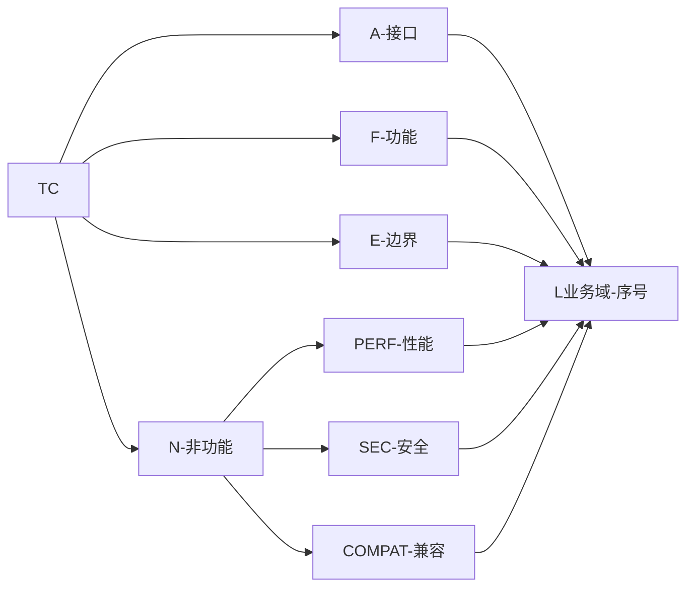

# [项目名称] - 测试用例

| 版本 | 日期 | 作者 | 说明 |
|------|------|------|------|
| 1.0 | YYYY-MM-DD | Your Name | 初始版本 |
| 1.1 | YYYY-MM-DD | Your Name | 升级为结构化用例块（testcase-generator 风格） |
| 1.2 | YYYY-MM-DD | Your Name | 拆分文档为 1 主控 + 3 子段，支持并行生成 |

> 📌 **一页纸摘要**:
> 1. 看完这页能回答:测什么?怎么测?预期是什么?
> 2. 文档定位:测试级,1 主控 + 3 子段(07a/07b/07c)并行生成
> 3. 核心动作:TC-A 接口 + TC-F 功能 + TC-E 边界 + TC-N-PERF/SEC/COMPAT
> 4. 何时使用:测试执行 / 回归测试 / 验收测试
> 5. 不要用于:需求定义(→06)、自动化代码(→09/04)
>
> 🔗 **关键引用**: `reference/12-value-matrix.md` (测试用例价值) · [`reference/13-quality-selfcheck.md`](../reference/13-quality-selfcheck.md) (用例自检) · [`reference/15-five-field-crosscheck.md`](../reference/15-five-field-crosscheck.md) (5 字段交叉)

---

## 0. 填写指南

⭐ **关键决策**：
- **3 段并行产出**：07a 核心（P0 主路径）/ 07b 扩展（P1-P2 辅助）/ 07c 边界（异常 + 性能 + 安全 + 兼容）
- **用例覆盖率红线**：P0 主路径 100% / 核心模块 ≥ 80% / 工具类 ≥ 90% / UI 组件 ≥ 60%
- **测试金字塔 60/30/10**：单元 60% / 集成 30% / E2E 10%（仅覆盖 5 关键路径）
- **用例 8 字段**：编号 / 标题 / 前置 / 输入 / 步骤 / 预期 / 优先级 / 自动化

### 0.0 本文档价值

> **回答的核心问题**：怎么验证做对了？哪些场景必测？预期是什么？
> **不回答什么**：业务定义（→06）、API 设计（→03）
> **价值判定**：QA 按用例执行即可验收，P0 必过
> **所属阶段**：测试

### 0.1 用例编号规范



| 编号前缀 | 含义 | 测试类型归属 | 示例 |
|----------|------|--------------|------|
| **TC-A-{NN}** | API / 接口测试 | 2. 接口测试 | TC-A-LIST-001 |
| **TC-F-{NN}** | Functional / 功能测试 | 3. 功能测试 | TC-F-LIST-001 |
| **TC-E-{NN}** | Edge / Exception（边界、异常、并发） | 4. 边界测试 | TC-E-INPUT-001 |
| **TC-N-PERF-{NN}** | Non-functional Performance / 性能 | 5. 性能测试 | TC-N-PERF-API-001 |
| **TC-N-SEC-{NN}** | Non-functional Security / 安全 | 6. 安全测试 | TC-N-SEC-001 |
| **TC-N-COMPAT-{NN}** | Non-functional Compatibility / 兼容 | 5.x 兼容性测试 | TC-N-COMPAT-001 |

> 命名补充：第二段代表业务域（如 LIST/DETAIL/FORM/LOGIN），第三段为该域下的顺序号。**全局唯一**，禁止复用。

### 0.2 优先级

| 等级 | 含义 | 执行要求 | 典型场景 |
|------|------|----------|----------|
| **P0** | 核心主路径 | 必过，阻塞发布 | 登录、CRUD 主流程、支付 |
| **P1** | 重要功能 | 必过 | 筛选、排序、详情展示 |
| **P2** | 一般功能 | 抽样通过 | 导出、批量操作 |
| **P3** | 边缘 / 体验 | 时间允许 | UI 微动效、文案 |

### 0.3 用例状态

| 状态 | 图标 | 含义 |
|------|------|------|
| 待执行 | ⏳ | 已编写未跑过 |
| 通过 | ✅ | 实际结果 = 预期结果 |
| 失败 | ❌ | 实际结果 ≠ 预期结果 |
| 阻塞 | 🚫 | 前置缺陷或环境问题 |
| 跳过 | ⏭️ | 本轮不执行 |

### 0.4 场景类型比例

| 场景类型 | 图标 | 比例要求 | 含义 |
|----------|------|----------|------|
| **正向**（Happy Path） | 🟢 | ≥ 60% | 合法输入、正常流程 |
| **反向**（Negative） | 🔴 | ≥ 25% | 非法输入、错误路径、权限不足 |
| **边界**（Boundary） | 🟡 | ≥ 15% | 临界值、零值、极值 |

### 0.5 用例结构化块模板

每条用例统一使用以下结构（不再用一行业务表格）：

```markdown
#### TC-{PREFIX}-{DOMAIN}-{NN} {用例名称}

| 字段 | 内容 |
|------|------|
| **测试目的** | 业务目标（说明为什么测，不只是"测什么字段"） |
| **场景类型** | 🟢 正向 / 🔴 反向 / 🟡 边界 |
| **优先级** | P0 / P1 / P2 / P3 |
| **前置条件** | 账号、Token、数据状态、网络环境等具体条件 |
| **测试数据** | 具体的输入值、参数、文件、URL，不能用占位符 |
| **测试步骤** | 1. 步骤一<br>2. 步骤二<br>3. 步骤三 |
| **预期结果** | 1. HTTP 状态码<br>2. 返回字段值<br>3. UI 表现<br>4. 性能指标（具体数值） |
| **实际结果** | [执行时填写] |
| **状态** | ⏳ 待执行 / ✅ 通过 / ❌ 失败 / 🚫 阻塞 |
```

### 0.6 编写要求

- **测试目的**：写"业务目标"而非"技术描述"。例如"验证库存不足时阻止下单"而非"验证 quantity 字段校验"。
- **测试数据**：必须是**具体值**。`输入 51 字符的字符串`而不是`输入超长字符`；`page=0, pageSize=0`而不是`非法参数`。
- **预期结果**：必须**可验证**。包含 HTTP 码、字段值、UI 文案、性能数值；不要写"返回正确"或"展示正常"。
- **测试步骤**：可被**初学者无歧义**执行，包括点击哪个按钮、传什么参数、看哪个字段。
- **可追溯**：每条 P0/P1 用例必须在 `06-产品需求.md` 中有对应需求编号。

> **0.7 测试环境、0.8 测试数据准备、§3-6 用例、§7-8 汇总/附录、§9 检查清单、索引附录** —— 已拆分至 `07c-测试用例-边界异常.md`，因这些内容服务于非功能测试与测试运营阶段。

---

## X. 文档拆分说明

为加速文档产出，本测试用例文档按**优先级 + 模块类型**双维度拆分为 1 主控 + 3 子段，支持 3 个 subagent 并行生成：

| 段 | 文件 | 角色 | 优先级 | 预计行数 |
|----|------|------|--------|----------|
| 主控 | `07-测试用例.md`（本文） | 索引 / 填写指南 / 段契约 | — | ~120 行 |
| 07a 核心模块 | `07a-测试用例-核心模块.md` | TC-A + TC-F P0 | P0 | ~580 行 |
| 07b 扩展模块 | `07b-测试用例-扩展模块.md` | TC-F P1 + P2 | P1 / P2 | ~230 行 |
| 07c 边界异常 | `07c-测试用例-边界异常.md` | TC-E + TC-N-PERF + TC-N-SEC + TC-N-COMPAT + 附录 | P0-P3 | ~560 行 |

### 段间契约表

| 段 | 用例类型 | 优先级 | 编号前缀 | 输入 | 输出 |
|----|----------|--------|----------|------|------|
| 07a 核心模块 | TC-A-* + TC-F P0 | P0 | TC-A-* + TC-F-*-NNN P0 | 06-产品需求.md §核心流程 + 03-接口文档.md | API + UI 主路径用例（44 条） |
| 07b 扩展模块 | TC-F P1 + P2 | P1 + P2 | TC-F-*-NNN P1-P2 | 06-产品需求.md §次要功能 + 07a 已确定的功能 | UI 次要/集成用例（11 条） |
| 07c 边界异常 | TC-E + TC-N-* | P0-P3 | TC-E-* / TC-N-PERF-* / TC-N-SEC-* / TC-N-COMPAT-* | 07a/07b 已确定的功能 + 09-后端开发指南.md + 10-前端交互文档.md + 0.7-0.8 测试环境/数据 | 边界/性能/安全/兼容用例（37 条） + 汇总 + 附录 |

### 用例编号分配规则

- **TC-A-{DOMAIN}-{NN}**：07a 独占，编号空间 TC-A-AUTH-001 ~ TC-A-DELETE-003（共 28 条）
- **TC-F-{DOMAIN}-{NN}**：07a 与 07b 共享编号空间
  - 07a 仅含 **P0** 用例：LOGIN-001~003、LIST-001/002/003/004/007、DETAIL-001/002/004、FORM-001/002/004/005/006（共 16 条）
  - 07b 仅含 **P1 + P2** 用例：LOGIN-004/005、LIST-005/006/008/009、DETAIL-003、FORM-003/007/008/009（共 11 条）
  - 同一域（如 LOGIN）的编号在两段中**不重复**（已存在则从 004 起递增）
- **TC-E-{DOMAIN}-{NN}** / **TC-N-PERF-{DOMAIN}-{NN}** / **TC-N-SEC-{NN}** / **TC-N-COMPAT-{NN}**：07c 独占

### 并行生成指引

- 3 个子段文件**内容独立**，可由 3 个 subagent 并行生成
- 每个 subagent 只需读取本主控文件 + 段头契约 + 对应输入文档（如 06 PRD / 03 接口）
- 段头契约块（< 10 行）写在每个子段文件开头，段尾交接块（< 10 行）写在末尾
- 汇总表（§7.1 测试执行情况）由 07c 段统一维护，引用 07a/07b 已交付的用例数

---

## 子段文件路径

- **核心模块**：`templates/07a-测试用例-核心模块.md`
- **扩展模块**：`templates/07b-测试用例-扩展模块.md`
- **边界异常**：`templates/07c-测试用例-边界异常.md`


## 摘要(降级输出,200 字内)

> 模板定位摘要(全受众可见)。完整定义见下方各章。
> 模板定位:0.0 本文档价值

**模板说明**:`[项目名称] - 测试用例`

**关键数字/对象**:见完整版

**完整版见**:`07-测试用例.md`(主受众可访问)
