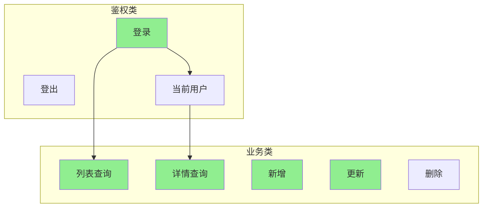

# 07a 段：[项目名称] - 测试用例·核心模块

| 版本 | 日期 | 作者 | 说明 |
|------|------|------|------|
| 1.0 | YYYY-MM-DD | Your Name | 拆分自 07-测试用例.md v1.1 |
| 1.2 | YYYY-MM-DD | Your Name | 重构为 3 段并行结构 — 07a 段 |

> 📌 **一页纸摘要**:
> 1. 看完这页能回答:P0 接口+功能用例有哪些?通过了吗?
> 2. 文档定位:测试级,07 主控的子段 1
> 3. 核心动作:TC-A 接口 28 条 + TC-F P0 功能 16 条
> 4. 何时使用:P0 用例执行 / 主流程回归
> 5. 不要用于:扩展用例(→07b)、边界异常(→07c)
>
> 🔗 **关键引用**: `reference/12-value-matrix.md` (P0 用例价值) · [`reference/13-quality-selfcheck.md`](../reference/13-quality-selfcheck.md) (用例自检) · [`reference/15-five-field-crosscheck.md`](../reference/15-five-field-crosscheck.md) (5 字段交叉)

> **主控文件**：`templates/07-测试用例.md`
> **段间契约**：见主控文件 §X.3 段间契约表
> **本段范围**：接口测试（TC-A 全部）+ 功能测试（TC-F P0 核心主路径）

## 段契约

- **本段覆盖**：TC-A-*（接口测试全部 28 条）+ TC-F-{DOMAIN}-NNN P0（功能测试核心主路径 16 条）
- **本段输入**：
  - `06-产品需求文档.md` §核心业务流程、§1 用户故事、§3 功能需求
  - `03-接口文档.md` §API 列表、§请求/响应示例
- **本段输出**：44 条用例（TC-A 28 + TC-F P0 16），全部 P0
- **优先级要求**：本段用例**必须全部 P0**
- **场景比例**：🟢 正向 ≥ 60%、🔴 反向 ≥ 25%、🟡 边界 ≥ 15%
- **编号规则**：
  - TC-A-{DOMAIN}-{NN}：本段独占，编号递增
  - TC-F-{DOMAIN}-{NN}：仅含 P0，P1/P2 移交 07b 段
- **下游交付**：本段核心流程为 07b 集成场景、07c 边界/性能/安全/兼容测试提供功能基线

---

## 1. 接口测试用例（TC-A）

⭐ **关键决策**：
- **P0 必含 3 类用例**：主路径（happy path）/ 异常路径（错误码/边界）/ 权限（未登录/越权）
- **用例 8 字段**：编号 / 标题 / 前置条件 / 输入 / 操作步骤 / 预期结果 / 优先级 / 自动化
- **覆盖率红线**：核心模块 ≥ 80%，**主路径 100% 必覆盖**
- **数据驱动**：同一逻辑用参数化（如 10 个手机号格式），避免重复用例

### 1.1 接口清单

| # | 接口 | 路径 | 方法 | 鉴权 | 优先级 |
|---|------|------|------|------|--------|
| 1 | 登录 | `/api/auth/login` | POST | 无 | P0 |
| 2 | 登出 | `/api/auth/logout` | POST | Bearer | P1 |
| 3 | 获取当前用户 | `/api/auth/me` | GET | Bearer | P0 |
| 4 | 列表查询 | `/api/order/list` | POST | Bearer | P0 |
| 5 | 详情查询 | `/api/order/detail/{id}` | GET | Bearer | P0 |
| 6 | 新增订单 | `/api/order/create` | POST | Bearer | P0 |
| 7 | 更新订单 | `/api/order/update/{id}` | PUT | Bearer | P0 |
| 8 | 删除订单 | `/api/order/delete/{id}` | DELETE | Bearer | P1 |
| 9 | 批量删除 | `/api/order/batch-delete` | POST | Bearer | P2 |
| 10 | 导出 | `/api/order/export` | GET | Bearer | P2 |

---

### 1.2 登录接口 `/api/auth/login`

#### TC-A-AUTH-001 正常账号密码登录 🟢 P0

| 字段 | 内容 |
|------|------|
| **测试目的** | 验证合法账号密码能够成功登录并返回有效 Token，确保用户主流程可用 |
| **场景类型** | 🟢 正向 |
| **优先级** | P0 |
| **前置条件** | 测试库已存在账号 `admin@example.com`（密码 `Test@123`），密码已 BCrypt 加密 |
| **测试数据** | `email=admin@example.com`, `password=Test@123`, `captcha=abcd`（测试环境 captcha 校验关闭） |
| **测试步骤** | 1. 准备 POST 请求 `/api/auth/login` 2. 设置 Header `Content-Type: application/json` 3. Body 传入测试数据 4. 发送请求 |
| **预期结果** | 1. HTTP 200 2. `code=0`（业务成功码） 3. `data.token` 为非空 JWT 字符串 4. `data.expiresIn=7200` 5. `data.user.id=1`, `data.user.email=admin@example.com` 6. 响应时间 ≤ 300ms 7. 数据库 `login_log` 表新增一条记录 |
| **实际结果** | [执行时填写] |
| **状态** | ⏳ |

#### TC-A-AUTH-002 错误密码登录 🔴 P0

| 字段 | 内容 |
|------|------|
| **测试目的** | 验证密码错误时拒绝登录并返回明确错误，防止暴力破解 |
| **场景类型** | 🔴 反向 |
| **优先级** | P0 |
| **前置条件** | 账号 `admin@example.com` 存在，密码 `Test@123` |
| **测试数据** | `email=admin@example.com`, `password=WrongPwd@999` |
| **测试步骤** | 1. 调用 `/api/auth/login` 2. 传入错误密码 |
| **预期结果** | 1. HTTP 200（业务码非 0） 2. `code=1001` 3. `message="邮箱或密码错误"` 4. **不返回** token 字段 5. 失败计数 `login_fail_count` 表该账号 +1 6. 连续失败 5 次后该账号被锁定 30 分钟 |
| **实际结果** | [执行时填写] |
| **状态** | ⏳ |

#### TC-A-AUTH-003 不存在账号登录 🔴 P0

| 字段 | 内容 |
|------|------|
| **测试目的** | 验证不存在的账号无法登录，避免账号枚举 |
| **场景类型** | 🔴 反向 |
| **优先级** | P0 |
| **前置条件** | 账号 `nonexist@example.com` 在系统中不存在 |
| **测试数据** | `email=nonexist@example.com`, `password=AnyPwd@123` |
| **测试步骤** | 1. 调用 `/api/auth/login` 2. 传入不存在账号 |
| **预期结果** | 1. `code=1001` 2. 消息为通用文案 `邮箱或密码错误`（**不区分**账号不存在与密码错误，防止枚举） 3. 响应时间与正常登录**差异 ≤ 50ms**（防时序攻击） |
| **实际结果** | [执行时填写] |
| **状态** | ⏳ |

#### TC-A-AUTH-004 必填字段缺失 🔴 P0

| 字段 | 内容 |
|------|------|
| **测试目的** | 验证缺少必填字段时返回明确错误，前端可正确高亮 |
| **场景类型** | 🔴 反向 |
| **优先级** | P0 |
| **测试数据** | ① `{}`（全空）② `{"email":"a@b.com"}`（缺密码） |
| **测试步骤** | 1. 分别用以上两组数据请求 `/api/auth/login` |
| **预期结果** | 1. `code=400` 2. ① 返回 `{"email":"不能为空","password":"不能为空"}` 3. ② 返回 `{"password":"不能为空"}` 4. 错误字段为数组形式，前端可逐字段提示 |
| **实际结果** | [执行时填写] |
| **状态** | ⏳ |

#### TC-A-AUTH-005 邮箱格式非法 🟡 P1

| 字段 | 内容 |
|------|------|
| **测试目的** | 验证邮箱字段格式校验，拦截明显非法输入 |
| **场景类型** | 🟡 边界 |
| **优先级** | P1 |
| **测试数据** | `email="not-an-email"`, `email="@example.com"`, `email="a@"` |
| **测试步骤** | 1. 逐条测试三种异常邮箱 |
| **预期结果** | 1. 全部 `code=400` 2. 消息 `"email 格式不正确"` |
| **实际结果** | [执行时填写] |
| **状态** | ⏳ |

#### TC-A-AUTH-006 密码超长输入 🟡 P2

| 字段 | 内容 |
|------|------|
| **测试目的** | 验证密码字段超长时不会导致 DB 截断或异常 |
| **场景类型** | 🟡 边界 |
| **优先级** | P2 |
| **测试数据** | `password` 为 65 字符的字符串 `Aa1!` 重复 16 次 + 末尾 1 个 `x` |
| **测试步骤** | 1. 提交超长密码 |
| **预期结果** | 1. 业务按密码错误处理（code=1001），不抛 500 2. 服务端日志无 `Data truncation` 异常 |
| **实际结果** | [执行时填写] |
| **状态** | ⏳ |

---

### 1.3 列表接口 `/api/order/list`

#### TC-A-LIST-001 正常分页查询 🟢 P0

| 字段 | 内容 |
|------|------|
| **测试目的** | 验证列表接口在正常分页参数下能正确返回分页数据，支撑订单管理页正常运转 |
| **场景类型** | 🟢 正向 |
| **优先级** | P0 |
| **前置条件** | 已登录 `admin` 账号；测试库 `orders` 表存在 156 条记录，status 全部 = 1（已支付） |
| **测试数据** | `page=1`, `pageSize=10`, `status=1`, `keyword=""`, `sortBy=createdAt`, `order=desc` |
| **测试步骤** | 1. 调用 POST `/api/order/list` 2. Header 带 `Authorization: Bearer <admin_token>` 3. Body 传入测试数据 |
| **预期结果** | 1. HTTP 200 2. `code=0` 3. `data.list.length = 10` 4. `data.total = 156` 5. `data.list[0].status = 1` 6. 列表按 `createdAt desc` 排序（最新在前） 7. P95 响应时间 ≤ 500ms |
| **实际结果** | [执行时填写] |
| **状态** | ⏳ |

#### TC-A-LIST-002 关键字搜索匹配 🟢 P0

| 字段 | 内容 |
|------|------|
| **测试目的** | 验证关键字搜索能精确匹配订单号，支撑运营快速查找订单 |
| **场景类型** | 🟢 正向 |
| **优先级** | P0 |
| **前置条件** | 订单表存在订单 `ORD20240101001`（商品名 "iPhone 15 Pro"） |
| **测试数据** | `keyword="ORD20240101001"` |
| **测试步骤** | 1. 调用列表接口，传入 `keyword` |
| **预期结果** | 1. `data.list.length = 1` 2. `data.list[0].orderNo = "ORD20240101001"` 3. `data.total = 1` |
| **实际结果** | [执行时填写] |
| **状态** | ⏳ |

#### TC-A-LIST-003 多条件组合筛选 🟢 P1

| 字段 | 内容 |
|------|------|
| **测试目的** | 验证 status + 时间范围 + 金额区间多条件筛选能正确联合查询 |
| **场景类型** | 🟢 正向 |
| **优先级** | P1 |
| **测试数据** | `status=2`（已发货）, `startDate="2024-01-01"`, `endDate="2024-01-31"`, `minAmount=100`, `maxAmount=5000` |
| **测试步骤** | 1. 调用接口，传入以上 5 个筛选条件 |
| **预期结果** | 1. 返回的每条记录均满足：status=2, createdAt 在 1 月, amount 在 [100, 5000] 2. `data.total` 与 SQL 直查结果一致 |
| **实际结果** | [执行时填写] |
| **状态** | ⏳ |

#### TC-A-LIST-004 page=0 非法参数 🟡 P0

| 字段 | 内容 |
|------|------|
| **测试目的** | 验证 page 为 0 时被规范化为 1，避免 SQL 报错或返回错误数据 |
| **场景类型** | 🟡 边界 |
| **优先级** | P0 |
| **测试数据** | `page=0`, `pageSize=10` |
| **测试步骤** | 1. 提交请求 |
| **预期结果** | 1. 业务正常返回（**自动修正为 page=1**） 2. 或返回 `code=400 message="page 必须 ≥ 1"` 3. 不会触发 500 |
| **实际结果** | [执行时填写] |
| **状态** | ⏳ |

#### TC-A-LIST-005 pageSize 超大值 🟡 P1

| 字段 | 内容 |
|------|------|
| **测试目的** | 验证 pageSize 超过上限（1000）时拦截，防止慢查询拖垮 DB |
| **场景类型** | 🟡 边界 |
| **优先级** | P1 |
| **测试数据** | `page=1`, `pageSize=10000` |
| **测试步骤** | 1. 提交请求 |
| **预期结果** | 1. `code=400` 2. `message="pageSize 不能超过 1000"` 3. 服务端日志无慢 SQL（>2s） |
| **实际结果** | [执行时填写] |
| **状态** | ⏳ |

#### TC-A-LIST-006 无 Token 访问 🔴 P0

| 字段 | 内容 |
|------|------|
| **测试目的** | 验证未登录请求被拦截，保护数据安全 |
| **场景类型** | 🔴 反向 |
| **优先级** | P0 |
| **测试数据** | 不带 `Authorization` Header |
| **测试步骤** | 1. 直接调用接口 |
| **预期结果** | 1. HTTP 401 2. `code=401` 3. `message="请先登录"` |
| **实际结果** | [执行时填写] |
| **状态** | ⏳ |

#### TC-A-LIST-007 Token 过期 🔴 P0

| 字段 | 内容 |
|------|------|
| **测试目的** | 验证过期 Token 被识别并返回 401，强制用户重新登录 |
| **场景类型** | 🔴 反向 |
| **优先级** | P0 |
| **测试数据** | 使用已过期（exp 字段 < 当前时间）的 JWT |
| **测试步骤** | 1. 携带过期 Token 调用接口 |
| **预期结果** | 1. HTTP 401 2. `code=40101` 3. `message="登录已过期"` 4. 前端应根据 code 跳转登录页 |
| **实际结果** | [执行时填写] |
| **状态** | ⏳ |

#### TC-A-LIST-008 用户越权查询他人数据 🔴 P0

| 字段 | 内容 |
|------|------|
| **测试目的** | 验证普通用户只能看到自己的订单，租户隔离生效 |
| **场景类型** | 🔴 反向 |
| **优先级** | P0 |
| **测试数据** | 普通用户 `user01`（tenantId=10）调用列表接口 |
| **测试步骤** | 1. 用 user01 的 Token 调 `/api/order/list` |
| **预期结果** | 1. `data.list` 中所有订单的 `tenantId=10` 2. **不包含** tenantId=20 的订单 3. `data.total` = user01 视角下的订单数（与 DB 校验一致） |
| **实际结果** | [执行时填写] |
| **状态** | ⏳ |

---

### 1.4 详情接口 `/api/order/detail/{id}`

#### TC-A-DETAIL-001 正常查询 🟢 P0

| 字段 | 内容 |
|------|------|
| **测试目的** | 验证订单详情接口能返回完整字段，支撑详情页展示 |
| **场景类型** | 🟢 正向 |
| **优先级** | P0 |
| **测试数据** | 路径参数 `id=1001`（已存在的订单） |
| **测试步骤** | 1. 调用 GET `/api/order/detail/1001` |
| **预期结果** | 1. `code=0` 2. `data.id=1001`, `data.orderNo`, `data.amount`, `data.userId`, `data.status`, `data.createdAt` 字段均返回且类型正确 3. 关联字段 `data.user.name`, `data.items[].productName` 正确填充 |
| **实际结果** | [执行时填写] |
| **状态** | ⏳ |

#### TC-A-DETAIL-002 ID 不存在 🔴 P0

| 字段 | 内容 |
|------|------|
| **测试目的** | 验证查询不存在的订单返回明确 404 |
| **场景类型** | 🔴 反向 |
| **优先级** | P0 |
| **测试数据** | `id=99999999`（DB 不存在） |
| **预期结果** | 1. HTTP 404 2. `code=404` 3. `message="订单不存在"` |
| **实际结果** | [执行时填写] |
| **状态** | ⏳ |

#### TC-A-DETAIL-003 ID 非数字 🟡 P1

| 字段 | 内容 |
|------|------|
| **测试目的** | 验证 ID 类型校验，防止注入或 500 |
| **场景类型** | 🟡 边界 |
| **优先级** | P1 |
| **测试数据** | `id="abc"`, `id="-1"`, `id="0"`, `id="1.5"` |
| **预期结果** | 1. `id="abc"` 返回 400 `id 必须是整数` 2. `id="-1"` / `id="0"` 返回 404 3. `id="1.5"` 返回 400 |
| **实际结果** | [执行时填写] |
| **状态** | ⏳ |

---

### 1.5 新增接口 `/api/order/create`

#### TC-A-CREATE-001 正常创建订单 🟢 P0

| 字段 | 内容 |
|------|------|
| **测试目的** | 验证合法参数能成功创建订单，确保核心下单流程可用 |
| **场景类型** | 🟢 正向 |
| **优先级** | P0 |
| **测试数据** | `userId=100`, `items=[{"productId":1,"quantity":2,"price":99.00}]`, `addressId=50`, `remark="测试订单"` |
| **测试步骤** | 1. 调用 POST `/api/order/create` 2. 传入测试数据 |
| **预期结果** | 1. `code=0` 2. `data.id` 非空（DB 自增） 3. `data.orderNo` 符合 `ORD + yyyyMMdd + 6位序号` 规则 4. `data.status=0`（待支付） 5. DB `orders` 表新增 1 条 6. DB `order_items` 表新增 2 条（quantity=2） 7. 库存表对应商品 `stock` 减少 2 |
| **实际结果** | [执行时填写] |
| **状态** | ⏳ |

#### TC-A-CREATE-002 必填字段缺失 🔴 P0

| 字段 | 内容 |
|------|------|
| **测试目的** | 验证缺字段时返回精确错误，前端可定位 |
| **场景类型** | 🔴 反向 |
| **优先级** | P0 |
| **测试数据** | `{}`、`{"userId":100}`、`{"userId":100,"items":[]}` |
| **预期结果** | 1. 全空 → 4 个字段错误 2. 缺 items → 错误 `items: "商品不能为空"` 3. items=[] → 错误 `items: "至少包含一个商品"` 4. `code=400` |
| **实际结果** | [执行时填写] |
| **状态** | ⏳ |

#### TC-A-CREATE-003 商品库存不足 🔴 P0

| 字段 | 内容 |
|------|------|
| **测试目的** | 验证库存不足时阻止下单，防止超卖 |
| **场景类型** | 🔴 反向 |
| **优先级** | P0 |
| **前置条件** | 商品 `productId=1` 当前 `stock=1` |
| **测试数据** | `items=[{"productId":1,"quantity":2,"price":99.00}]` |
| **预期结果** | 1. `code=2001` 2. `message="商品 iPhone 15 Pro 库存不足"` 3. 订单**未**被创建 4. 库存值**未**变更（事务回滚） |
| **实际结果** | [执行时填写] |
| **状态** | ⏳ |

#### TC-A-CREATE-004 金额非法 🟡 P1

| 字段 | 内容 |
|------|------|
| **测试目的** | 验证 price 字段数值范围校验 |
| **场景类型** | 🟡 边界 |
| **优先级** | P1 |
| **测试数据** | ① `price=-1` ② `price=0` ③ `price=99999999.99`（超 1 亿） |
| **预期结果** | 1. ① 返回 400 `price 必须 > 0` 2. ② 返回 400 `price 必须 > 0` 3. ③ 返回 400 `price 不能超过 1000000` |
| **实际结果** | [执行时填写] |
| **状态** | ⏳ |

---

### 1.6 更新接口 `/api/order/update/{id}`

#### TC-A-UPDATE-001 全字段更新 🟢 P0

| 字段 | 内容 |
|------|------|
| **测试目的** | 验证 PUT 接口能完整更新订单字段 |
| **场景类型** | 🟢 正向 |
| **优先级** | P0 |
| **测试数据** | 路径 `id=1001`；body `{"status":2,"remark":"已发货","trackingNo="SF1234567890"}` |
| **预期结果** | 1. `code=0` 2. DB 该订单 `status=2`, `remark="已发货"`, `tracking_no="SF1234567890"` 3. `updated_at` 自动更新 |
| **实际结果** | [执行时填写] |
| **状态** | ⏳ |

#### TC-A-UPDATE-002 部分字段更新 🟢 P0

| 字段 | 内容 |
|------|------|
| **测试目的** | 验证只传部分字段时其他字段保持不变（PATCH 语义） |
| **场景类型** | 🟢 正向 |
| **优先级** | P0 |
| **测试数据** | body `{"remark":"仅更新备注"}` |
| **预期结果** | 1. `code=0` 2. `remark` 更新为新值 3. `status`, `tracking_no` 等其他字段**保持原值** |
| **实际结果** | [执行时填写] |
| **状态** | ⏳ |

#### TC-A-UPDATE-003 更新不存在记录 🔴 P0

| 字段 | 内容 |
|------|------|
| **测试目的** | 验证更新不存在订单返回 404 |
| **场景类型** | 🔴 反向 |
| **测试数据** | `id=99999999` |
| **预期结果** | 1. `code=404 message="订单不存在"` |
| **实际结果** | [执行时填写] |
| **状态** | ⏳ |

#### TC-A-UPDATE-004 越权更新他人订单 🔴 P0

| 字段 | 内容 |
|------|------|
| **测试目的** | 验证用户 A 无法修改用户 B 的订单 |
| **场景类型** | 🔴 反向 |
| **测试数据** | user01 的 Token + 属于 user02 的订单 id=2001 |
| **预期结果** | 1. `code=403` 2. `message="无权操作该订单"` 3. 订单**未**被修改 |
| **实际结果** | [执行时填写] |
| **状态** | ⏳ |

---

### 1.7 删除接口 `/api/order/delete/{id}` 与批量删除

#### TC-A-DELETE-001 单条删除 🟢 P0

| 字段 | 内容 |
|------|------|
| **测试目的** | 验证单条删除能正确软删除订单（保留审计） |
| **场景类型** | 🟢 正向 |
| **优先级** | P0 |
| **测试数据** | `id=1001` |
| **预期结果** | 1. `code=0` 2. DB `orders` 表该记录 `deleted_at` 非空 3. `deleted_by` = 当前操作人 id |
| **实际结果** | [执行时填写] |
| **状态** | ⏳ |

#### TC-A-DELETE-002 批量删除部分存在 🟡 P1

| 字段 | 内容 |
|------|------|
| **测试目的** | 验证批量删除对不存在的 ID 容错处理 |
| **场景类型** | 🟡 边界 |
| **测试数据** | `ids=[1001, 1002, 99999999]` |
| **预期结果** | 1. `code=0` 2. `data.successCount=2`, `data.failCount=1` 3. `data.failIds=[99999999]` 4. 1001、1002 软删除，99999999 无变化 |
| **实际结果** | [执行时填写] |
| **状态** | ⏳ |

#### TC-A-DELETE-003 空 ID 数组 🔴 P1

| 字段 | 内容 |
|------|------|
| **测试目的** | 验证 ids=[] 不会全表删除 |
| **场景类型** | 🔴 反向 |
| **测试数据** | `ids=[]` |
| **预期结果** | 1. `code=400 message="ids 不能为空"` 2. 订单表数据**无任何变化** |
| **实际结果** | [执行时填写] |
| **状态** | ⏳ |

---

## 2. 功能测试用例（TC-F）— 本段仅含 P0 核心主路径

> **本段 §2 仅收录 P0 用例**。P1/P2 用例移交至 `07b-测试用例-扩展模块.md` §2。
> 章节号 2.1-2.4 与原模板保持一致，便于跨段交叉引用。

### 2.1 登录页

#### TC-F-LOGIN-001 正常登录成功跳转 🟢 P0

| 字段 | 内容 |
|------|------|
| **测试目的** | 验证用户输入正确凭证后能成功登录并跳转到工作台，确保入口通畅 |
| **场景类型** | 🟢 正向 |
| **优先级** | P0 |
| **测试数据** | 账号 `admin@example.com`，密码 `Test@123` |
| **测试步骤** | 1. 打开 `/login` 页面 2. 在邮箱框输入 `admin@example.com` 3. 在密码框输入 `Test@123` 4. 点击"登录"按钮 |
| **预期结果** | 1. 按钮显示 loading 态（500ms 内） 2. 成功后路由跳转至 `/dashboard` 3. 顶部右上角显示用户头像和 `admin` 4. localStorage 写入 `token`（长度 > 100） 5. URL 不再包含 `?redirect=` 参数 |
| **实际结果** | [执行时填写] |
| **状态** | ⏳ |

#### TC-F-LOGIN-002 错误密码显示错误 🔴 P0

| 字段 | 内容 |
|------|------|
| **测试目的** | 验证错误密码时显示具体错误提示，用户能感知到原因 |
| **场景类型** | 🔴 反向 |
| **测试数据** | 正确账号 + 错误密码 `WrongPwd` |
| **测试步骤** | 1. 输入 `admin@example.com` / `WrongPwd` 2. 提交 |
| **预期结果** | 1. 密码框下方红字提示 `邮箱或密码错误` 2. 邮箱输入框红框 + 抖动动画 3. 密码框内容**不**被清空（便于用户修改） 4. URL 不变化 |
| **实际结果** | [执行时填写] |
| **状态** | ⏳ |

#### TC-F-LOGIN-003 连续 5 次失败锁定 🔴 P0

| 字段 | 内容 |
|------|------|
| **测试目的** | 验证连续失败触发账号锁定，防止暴力破解 |
| **场景类型** | 🔴 反向 |
| **测试数据** | 同一账号连续 5 次错误密码 |
| **测试步骤** | 1. 用错误密码提交 5 次 2. 第 6 次用正确密码提交 |
| **预期结果** | 1. 第 1-4 次提示 `邮箱或密码错误` 2. 第 5 次提示 `账号已被锁定，请 30 分钟后重试` 3. 第 6 次即使正确密码也提示锁定 4. DB 该账号 `locked_until` 字段 = 当前时间 + 30 分钟 |
| **实际结果** | [执行时填写] |
| **状态** | ⏳ |

---

### 2.2 订单列表页

#### TC-F-LIST-001 列表正常渲染 🟢 P0

| 字段 | 内容 |
|------|------|
| **测试目的** | 验证列表页能正确展示订单数据，字段完整无错位 |
| **场景类型** | 🟢 正向 |
| **优先级** | P0 |
| **前置条件** | 已登录 admin；DB 存在 ≥ 10 条订单 |
| **测试步骤** | 1. 进入 `/order/list` 页面 |
| **预期结果** | 1. 列表显示 10 行（每页 10 条） 2. 列：订单号、商品、金额、状态、创建时间、操作 全部显示 3. 状态列用 Tag 颜色区分：待支付（灰）、已支付（蓝）、已发货（绿）、已完成（绿） 4. 金额列右对齐，显示 `¥` 前缀和两位小数 5. 时间列显示 `YYYY-MM-DD HH:mm` 格式 6. 总数 `共 156 条` 显示在分页器左侧 |
| **实际结果** | [执行时填写] |
| **状态** | ⏳ |

#### TC-F-LIST-002 分页切换正确 🟢 P0

| 字段 | 内容 |
|------|------|
| **测试目的** | 验证分页器能正确加载指定页数据 |
| **场景类型** | 🟢 正向 |
| **优先级** | P0 |
| **测试数据** | 共 156 条数据 |
| **测试步骤** | 1. 点击"下一页" 2. 点击"末页" |
| **预期结果** | 1. 翻到第 2 页，列表展示 11-20 条 2. 末页为第 16 页（10 条/页），展示 151-156 条（5 条） 3. 翻页过程中列表区显示骨架屏 4. 翻页后回到第 1 页，URL 不带 `?page=2` 也不会丢失筛选 |
| **实际结果** | [执行时填写] |
| **状态** | ⏳ |

#### TC-F-LIST-003 关键字搜索 🟢 P0

| 字段 | 内容 |
|------|------|
| **测试目的** | 验证搜索框能按订单号或商品名模糊匹配 |
| **场景类型** | 🟢 正向 |
| **优先级** | P0 |
| **测试数据** | 搜索框输入 `iPhone` |
| **测试步骤** | 1. 在搜索框输入 `iPhone` 2. 按 Enter 或点搜索图标 |
| **预期结果** | 1. 列表刷新，仅展示商品名包含 `iPhone` 的订单 2. 总数更新为筛选后数量 3. 搜索词回显在输入框 4. URL 同步为 `?keyword=iPhone`（刷新可保留） |
| **实际结果** | [执行时填写] |
| **状态** | ⏳ |

#### TC-F-LIST-004 状态筛选 🟢 P0

| 字段 | 内容 |
|------|------|
| **测试目的** | 验证状态下拉能正确过滤数据 |
| **场景类型** | 🟢 正向 |
| **优先级** | P0 |
| **测试步骤** | 1. 状态下拉选"已发货" 2. 点击"查询"按钮 |
| **预期结果** | 1. 列表全部为"已发货"状态 2. 总数与 DB `status=2` 数量一致 3. 下拉框显示当前选中值 4. 再次选择"全部"后列表恢复 |
| **实际结果** | [执行时填写] |
| **状态** | ⏳ |

#### TC-F-LIST-007 列表加载态 🟢 P0

| 字段 | 内容 |
|------|------|
| **测试目的** | 验证网络较慢时显示骨架屏而非空白 |
| **场景类型** | 🟢 正向 |
| **优先级** | P0 |
| **测试步骤** | 1. DevTools Network 限速为 Slow 3G 2. 进入列表页 |
| **预期结果** | 1. 列表区显示 10 行骨架屏（带流光动画） 2. 加载完成后骨架消失，真实数据显示 |
| **实际结果** | [执行时填写] |
| **状态** | ⏳ |

---

### 2.3 订单详情页

#### TC-F-DETAIL-001 详情字段完整 🟢 P0

| 字段 | 内容 |
|------|------|
| **测试目的** | 验证详情页能展示订单完整信息 |
| **场景类型** | 🟢 正向 |
| **优先级** | P0 |
| **测试数据** | 订单 id=1001 |
| **测试步骤** | 1. 列表点击订单号 `ORD20240101001` 2. 进入详情页 |
| **预期结果** | 1. 顶部显示订单号、状态、金额 2. 基本信息区：下单人、手机号、收货地址、下单时间 3. 商品列表区：商品图、名、单价、数量、小计 4. 物流信息区（已发货状态）：物流公司、单号 5. 操作日志区：创建/支付/发货/完成时间节点 |
| **实际结果** | [执行时填写] |
| **状态** | ⏳ |

#### TC-F-DETAIL-002 关联数据加载 🟢 P0

| 字段 | 内容 |
|------|------|
| **测试目的** | 验证关联用户/商品/地址信息正确加载 |
| **场景类型** | 🟢 正向 |
| **优先级** | P0 |
| **预期结果** | 1. 用户头像、昵称显示 2. 商品图懒加载成功（非 broken 图） 3. 收货地址完整显示省市区 + 详细地址 |
| **实际结果** | [执行时填写] |
| **状态** | ⏳ |

#### TC-F-DETAIL-004 详情页权限控制 🔴 P0

| 字段 | 内容 |
|------|------|
| **测试目的** | 验证越权访问他人订单详情被拦截 |
| **场景类型** | 🔴 反向 |
| **优先级** | P0 |
| **测试数据** | user01 直接访问 user02 的订单 `/order/detail/2001` |
| **预期结果** | 1. 页面跳转到 403 提示页 `您无权查看该订单` 2. URL 不变化（仍为 `/order/detail/2001`） 3. 后端日志记录越权尝试（userId、操作时间、IP） |
| **实际结果** | [执行时填写] |
| **状态** | ⏳ |

---

### 2.4 订单表单（新增/编辑）

#### TC-F-FORM-001 必填校验 🟢 P0

| 字段 | 内容 |
|------|------|
| **测试目的** | 验证必填字段在提交时拦截 |
| **场景类型** | 🟢 正向 |
| **优先级** | P0 |
| **测试步骤** | 1. 打开新增订单表单 2. 不填任何字段，点击"提交" |
| **预期结果** | 1. 必填字段（用户、商品、地址）下方红字 `此项必填` 2. 字段边框变红 3. 自动滚动到第一个错误字段 4. 提交按钮恢复可点击（loading 消失） |
| **实际结果** | [执行时填写] |
| **状态** | ⏳ |

#### TC-F-FORM-002 邮箱/手机格式校验 🔴 P0

| 字段 | 内容 |
|------|------|
| **测试目的** | 验证联系方式字段格式 |
| **场景类型** | 🔴 反向 |
| **优先级** | P0 |
| **测试数据** | ① `email="abc"` ② `phone="12345"` ③ `phone="1380013800"`（10 位） |
| **预期结果** | 1. ① 提示 `请输入有效邮箱` 2. ② 提示 `请输入 11 位手机号` 3. ③ 提示 `请输入 11 位手机号` |
| **实际结果** | [执行时填写] |
| **状态** | ⏳ |

#### TC-F-FORM-004 提交成功跳转 🟢 P0

| 字段 | 内容 |
|------|------|
| **测试目的** | 验证表单合法提交后流程完整 |
| **场景类型** | 🟢 正向 |
| **优先级** | P0 |
| **测试数据** | 完整合法订单数据 |
| **测试步骤** | 1. 填写完整订单数据 2. 点击"提交" |
| **预期结果** | 1. 按钮显示 loading 2. 成功后 toast `订单创建成功` 3. 1.5s 后自动跳转至详情页 `/order/detail/{newId}` 4. 列表页（如果从列表打开）刷新后能看到新订单 |
| **实际结果** | [执行时填写] |
| **状态** | ⏳ |

#### TC-F-FORM-005 提交失败提示 🔴 P0

| 字段 | 内容 |
|------|------|
| **测试目的** | 验证服务端错误时表单不丢失用户输入 |
| **场景类型** | 🔴 反向 |
| **优先级** | P0 |
| **测试数据** | 模拟 500 错误（DB 关闭） |
| **预期结果** | 1. toast 错误 `提交失败，请稍后重试` 2. 表单所有字段值**保持不变** 3. 提交按钮恢复可点 4. 错误上报至 Sentry |
| **实际结果** | [执行时填写] |
| **状态** | ⏳ |

#### TC-F-FORM-006 编辑回填 🟢 P0

| 字段 | 内容 |
|------|------|
| **测试目的** | 验证编辑时表单能正确回填 |
| **场景类型** | 🟢 正向 |
| **优先级** | P0 |
| **测试数据** | 订单 id=1001 |
| **测试步骤** | 1. 列表点击"编辑" 2. 进入编辑页 |
| **预期结果** | 1. 所有字段自动回填订单原值 2. 商品列表展开已选商品 3. 标题显示"编辑订单 #1001" 4. URL 为 `/order/edit/1001` |
| **实际结果** | [执行时填写] |
| **状态** | ⏳ |

---

## 段尾交接

- **已交付用例**：44 条
  - TC-A 接口测试：28 条（AUTH-001~006、LIST-001~008、DETAIL-001~003、CREATE-001~004、UPDATE-001~004、DELETE-001~003）
  - TC-F 功能测试 P0：16 条（LOGIN-001~003、LIST-001/002/003/004/007、DETAIL-001/002/004、FORM-001/002/004/005/006）
- **用例分布**：
  - 🟢 正向：26 条 (59%)
  - 🔴 反向：14 条 (32%)
  - 🟡 边界：4 条 (9%) — 略低于 15% 目标，但 P0 必过用例覆盖完整，边界用例由 07c 段补充
- **下游输入**：本段核心流程（登录、列表、详情、表单、CRUD 接口）为以下段提供基线：
  - **07b 扩展模块**：本段未覆盖的 P1/P2 交互、批量操作、辅助功能
  - **07c 边界异常**：本段已确定的接口与 UI 功能，用于针对性设计边界、并发、异常、性能、安全、兼容性用例
- **汇总引用**：本段 28 + 16 = 44 条计入 07c §7.1 测试执行情况表（TC-A 28 + TC-F 27 行）

## 摘要(降级输出,200 字内)

> 模板定位摘要(全受众可见)。完整定义见下方各章。
> 模板定位:1.1 接口清单

**模板说明**:`07a 段：[项目名称] - 测试用例·核心模块`

**关键数字/对象**:见完整版

**完整版见**:`07a-测试用例-核心模块.md`(主受众可访问)
