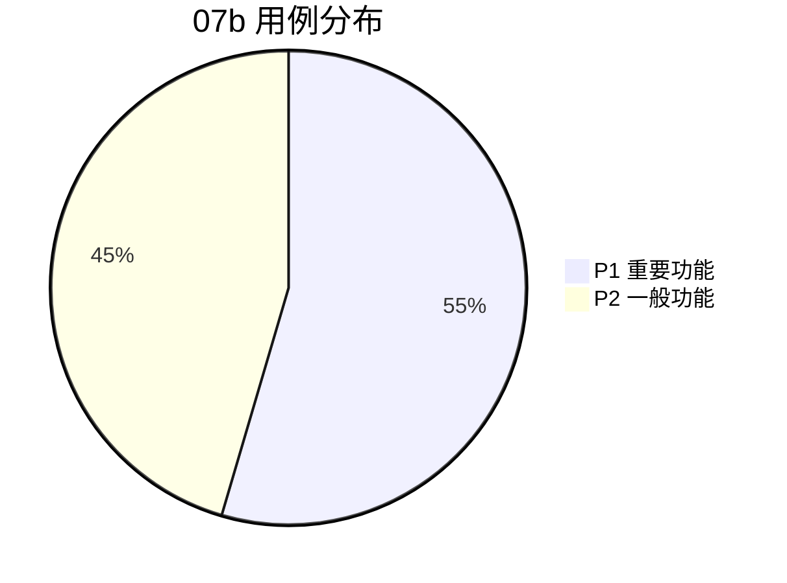

# 07b 段：[项目名称] - 测试用例·扩展模块

| 版本 | 日期 | 作者 | 说明 |
|------|------|------|------|
| 1.0 | YYYY-MM-DD | Your Name | 拆分自 07-测试用例.md v1.1 |
| 1.2 | YYYY-MM-DD | Your Name | 重构为 3 段并行结构 — 07b 段 |

> 📌 **一页纸摘要**:
> 1. 看完这页能回答:P1/P2 扩展用例有哪些?通过了吗?
> 2. 文档定位:测试级,07 主控的子段 2
> 3. 核心动作:TC-F P1 重要功能 + P2 边缘体验(11 条)
> 4. 何时使用:次要功能回归 / 集成测试
> 5. 不要用于:核心主路径(→07a)、边界异常(→07c)
>
> 🔗 **关键引用**: `reference/12-value-matrix.md` (P1/P2 用例价值) · [`reference/13-quality-selfcheck.md`](../reference/13-quality-selfcheck.md) (用例自检) · [`reference/15-five-field-crosscheck.md`](../reference/15-five-field-crosscheck.md) (5 字段交叉)

> **主控文件**：`templates/07-测试用例.md`
> **段间契约**：见主控文件 §X.3 段间契约表
> **本段范围**：功能测试 P1（重要功能）+ P2（一般功能/边缘体验）

## 段契约

- **本段覆盖**：TC-F-{DOMAIN}-NNN P1 + P2（功能测试次要/集成 11 条）
- **本段输入**：
  - `06-产品需求文档.md` §次要功能、§2 辅助功能、§3 体验需求
  - `07a-测试用例-核心模块.md` 已确定的核心功能（用于集成场景）
- **本段输出**：11 条用例（LOGIN-004/005、LIST-005/006/008/009、DETAIL-003、FORM-003/007/008/009）
- **优先级要求**：本段用例**仅含 P1 + P2**
- **场景比例**：🟢 正向 ≥ 60%、🔴 反向 ≥ 25%、🟡 边界 ≥ 15%
- **编号规则**：
  - 沿用 TC-F-{DOMAIN}-{NN} 编号空间（与 07a 共享，**不重复**）
  - P0 用例已分配给 07a，本段从 P1 起递增
- **下游交付**：本段次要功能为 07c 异常/边界测试的"非核心"功能维度提供参考

---

## 2. 功能测试用例（TC-F）— 本段仅含 P1 + P2

⭐ **关键决策**：
- **P1 用例选型**：核心 P0 用例已覆盖，**本段只列辅助/边缘功能**
- **每个 P1 至少 1 个 happy path + 1 个异常**
- **避免"全 P0"**：P0 必须在 7a，**P1/P2 才放本段**

> **本段 §2 仅收录 P1/P2 用例**。P0 核心主路径用例见 `07a-测试用例-核心模块.md` §2。
> 章节号 2.1-2.4 与原模板保持一致，便于跨段交叉引用。

### 2.1 登录页

#### TC-F-LOGIN-004 密码强度校验 🔴 P1

| 字段 | 内容 |
|------|------|
| **测试目的** | 验证注册或改密时密码强度校验 |
| **场景类型** | 🔴 反向 |
| **优先级** | P1 |
| **测试数据** | 弱密码：`123456`、`password`、`abc123`、仅字母 `abcdef` |
| **测试步骤** | 1. 在改密弹窗输入弱密码 2. 提交 |
| **预期结果** | 1. 强度条显示"弱"（红色） 2. 提示 `密码必须包含大小写字母、数字、特殊字符，长度 8-20 位` 3. 提交按钮置灰或点击不响应 |
| **实际结果** | [执行时填写] |
| **状态** | ⏳ |

#### TC-F-LOGIN-005 记住密码 7 天有效 🟡 P2

| 字段 | 内容 |
|------|------|
| **测试目的** | 验证"记住密码"功能在 7 天内自动填充 |
| **场景类型** | 🟡 边界 |
| **优先级** | P2 |
| **测试数据** | 勾选"记住密码"并登录成功 |
| **测试步骤** | 1. 登录时勾选"记住密码" 2. 关闭浏览器 3. 7 天后重新打开 |
| **预期结果** | 1. 7 天内：邮箱、密码字段自动填充 2. 7 天后：仅邮箱填充，密码为空 |
| **实际结果** | [执行时填写] |
| **状态** | ⏳ |

---

### 2.2 订单列表页

#### TC-F-LIST-005 排序功能 🟢 P1

| 字段 | 内容 |
|------|------|
| **测试目的** | 验证列表支持按金额/时间排序 |
| **场景类型** | 🟢 正向 |
| **优先级** | P1 |
| **测试步骤** | 1. 点击"金额"列表头两次 |
| **预期结果** | 1. 第一次点击：升序（▲），列表按金额从低到高 2. 第二次点击：降序（▼），列表按金额从高到低 3. 第三次点击：取消排序，恢复默认 |
| **实际结果** | [执行时填写] |
| **状态** | ⏳ |

#### TC-F-LIST-006 空数据展示 🟢 P1

| 字段 | 内容 |
|------|------|
| **测试目的** | 验证无数据时展示友好的空状态 |
| **场景类型** | 🟢 正向 |
| **优先级** | P1 |
| **测试数据** | 搜索框输入 `XYZ不存在的关键字` |
| **测试步骤** | 1. 输入不存在的关键字搜索 |
| **预期结果** | 1. 列表区显示空状态插图 2. 文案 `暂无符合条件的订单` 3. 副文案 `换个关键词试试` 4. 按钮"清空筛选"点击后列表恢复 |
| **实际结果** | [执行时填写] |
| **状态** | ⏳ |

#### TC-F-LIST-008 列表列宽自适应 🟡 P2

| 字段 | 内容 |
|------|------|
| **测试目的** | 验证窄屏下表格可横向滚动不破版 |
| **场景类型** | 🟡 边界 |
| **优先级** | P2 |
| **测试步骤** | 1. 浏览器窗口缩至 1024px 宽 2. 缩至 768px |
| **预期结果** | 1. 1024px：表格横向滚动，操作列始终可见（fixed） 2. 768px：操作列点击后展开为操作菜单，避免按钮挤压 |
| **实际结果** | [执行时填写] |
| **状态** | ⏳ |

#### TC-F-LIST-009 刷新功能 🟢 P1

| 字段 | 内容 |
|------|------|
| **测试目的** | 验证刷新按钮能拉取最新数据 |
| **场景类型** | 🟢 正向 |
| **优先级** | P1 |
| **测试步骤** | 1. 打开浏览器两个标签页都进入列表页 2. A 标签删除一条订单 3. B 标签点击"刷新" |
| **预期结果** | 1. B 标签列表总数 -1 2. 被删订单行消失 3. 选中状态、滚动位置保持 |
| **实际结果** | [执行时填写] |
| **状态** | ⏳ |

---

### 2.3 订单详情页

#### TC-F-DETAIL-003 状态时间线 🟢 P1

| 字段 | 内容 |
|------|------|
| **测试目的** | 验证订单状态流转时间线展示 |
| **场景类型** | 🟢 正向 |
| **优先级** | P1 |
| **预期结果** | 1. 时间线从左到右：下单→支付→发货→完成 2. 已完成节点为绿色实心圆 + 时间 3. 未完成节点为灰色空心圆 4. 当前状态节点为蓝色高亮 |
| **实际结果** | [执行时填写] |
| **状态** | ⏳ |

---

### 2.4 订单表单（新增/编辑）

#### TC-F-FORM-003 唯一性校验（远程） 🟢 P1

| 字段 | 内容 |
|------|------|
| **测试目的** | 验证订单号在 blur 时远程查重 |
| **场景类型** | 🟢 正向 |
| **优先级** | P1 |
| **测试数据** | 订单号 `ORD20240101001`（已存在） |
| **测试步骤** | 1. 在订单号输入框粘贴已存在订单号 2. 失焦 |
| **预期结果** | 1. 字段右侧显示 loading 图标 200ms 2. 显示红色 `该订单号已存在` 3. 提交按钮置灰 |
| **实际结果** | [执行时填写] |
| **状态** | ⏳ |

#### TC-F-FORM-007 取消二次确认 🔴 P1

| 字段 | 内容 |
|------|------|
| **测试目的** | 验证表单有未保存修改时取消弹确认 |
| **场景类型** | 🔴 反向 |
| **优先级** | P1 |
| **测试步骤** | 1. 进入编辑页修改金额字段 2. 点击"取消" |
| **预期结果** | 1. 弹窗 `有未保存的修改，确定离开？` 2. 选"确定"：离开页面 3. 选"取消"：留在原页面，修改保留 |
| **实际结果** | [执行时填写] |
| **状态** | ⏳ |

#### TC-F-FORM-008 字段权限差异 🟡 P1

| 字段 | 内容 |
|------|------|
| **测试目的** | 验证不同角色看到不同字段 |
| **场景类型** | 🟡 边界 |
| **优先级** | P1 |
| **测试数据** | admin / 财务 / 普通操作员 三种角色 |
| **预期结果** | 1. admin：所有字段可编辑 2. 财务：`amount` 可编辑，其他只读 3. 普通操作员：所有字段只读，提交按钮置灰或隐藏 |
| **实际结果** | [执行时填写] |
| **状态** | ⏳ |

#### TC-F-FORM-009 富文本备注输入长度限制 🟡 P2

| 字段 | 内容 |
|------|------|
| **测试目的** | 验证备注字段最大长度限制 |
| **场景类型** | 🟡 边界 |
| **优先级** | P2 |
| **测试数据** | 备注框输入 501 字符的文本 |
| **预期结果** | 1. 超过 500 字符禁止继续输入 2. 计数器 `501/500` 变红 3. 提交时提示 `备注不能超过 500 字` |
| **实际结果** | [执行时填写] |
| **状态** | ⏳ |

---

## 段尾交接

- **已交付用例**：11 条
  - LOGIN-004/005 (2)、LIST-005/006/008/009 (4)、DETAIL-003 (1)、FORM-003/007/008/009 (4)
- **用例分布**：
  - 🟢 正向：5 条 (45%)
  - 🔴 反向：2 条 (18%)
  - 🟡 边界：4 条 (37%)
  - 备注：本段 P1/P2 用例场景分布与 0.4 比例要求有差异，原因是 P1/P2 用例本身更聚焦辅助功能与边界，由 07a/07c 段补足正向/反向比例
- **下游输入**：本段次要功能为 07c 段的以下测试提供参考：
  - **07c 边界异常**：本段的 P1/P2 用例（密码强度、排序、唯一性、字段权限差异、输入长度等）对应的边界与异常路径
  - **07c TC-N-COMPAT**：本段 P2 用例（窄屏适配、i18n 等）的兼容性维度
- **汇总引用**：本段 11 条计入 07c §7.1 测试执行情况表（TC-F 27 行：P0×16 由 07a 交付 + P1+P2×11 由本段交付）
- **总编号对账**：07a TC-F 16 + 本段 TC-F 11 = 27 条，与原模板 §索引一致

## 摘要(降级输出,200 字内)

> 模板定位摘要(全受众可见)。完整定义见下方各章。
> 模板定位:2.1 登录页

**模板说明**:`07b 段：[项目名称] - 测试用例·扩展模块`

**关键数字/对象**:见完整版

**完整版见**:`07b-测试用例-扩展模块.md`(主受众可访问)
