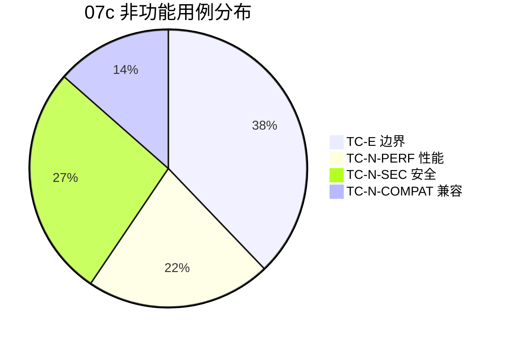

# 07c 段：[项目名称] - 测试用例·边界异常

| 版本 | 日期 | 作者 | 说明 |
|------|------|------|------|
| 1.0 | YYYY-MM-DD | Your Name | 拆分自 07-测试用例.md v1.1 |
| 1.2 | YYYY-MM-DD | Your Name | 重构为 3 段并行结构 — 07c 段 |

> 📌 **一页纸摘要**:
> 1. 看完这页能回答:边界/异常/性能/安全/兼容都测了吗?
> 2. 文档定位:测试级,07 主控的子段 3
> 3. 核心动作:TC-E 边界 14 + TC-N-PERF 8 + TC-N-SEC 10 + TC-N-COMPAT 5
> 4. 何时使用:边界测试 / 性能压测 / 安全扫描 / 兼容测试
> 5. 不要用于:核心主路径(→07a)、P1/P2 扩展(→07b)
>
> 🔗 **关键引用**: `reference/12-value-matrix.md` (非功能价值) · [`reference/13-quality-selfcheck.md`](../reference/13-quality-selfcheck.md) (用例自检) · [`reference/15-five-field-crosscheck.md`](../reference/15-five-field-crosscheck.md) (5 字段交叉)

> **主控文件**：`templates/07-测试用例.md`
> **段间契约**：见主控文件 §X.3 段间契约表
> **本段范围**：0.7-0.8 测试环境/数据 + §3-6 边界/异常/性能/安全/兼容用例 + §7-8 汇总/附录 + §9 检查清单 + 索引附录

## 段契约

- **本段覆盖**：
  - §0.7-0.8 测试环境、测试数据准备（基础设施）
  - §3 边界与异常测试（TC-E 14 条）
  - §4 性能测试（TC-N-PERF 8 条）
  - §5 安全测试（TC-N-SEC 10 条）
  - §6 兼容性测试（TC-N-COMPAT 5 条）
  - §7 测试结果汇总（执行情况、场景分布、缺陷统计、准出门槛）
  - §8 附录（测试账号、测试数据、测试工具、脚本目录、缺陷模板）
  - §9 测试用例检查清单（20 项）
  - 索引附录（章节-用例范围对照）
- **本段输入**：
  - `07a-测试用例-核心模块.md` 已交付的 44 条核心用例
  - `07b-测试用例-扩展模块.md` 已交付的 11 条扩展用例
  - `09-后端开发指南.md`（性能、安全、并发、限流参考）
  - `10-前端交互文档.md`（前端性能、弱网、加载态参考）
- **本段输出**：
  - 37 条非功能用例（TC-E 14 + TC-N-PERF 8 + TC-N-SEC 10 + TC-N-COMPAT 5）
  - 1 份测试结果汇总模板（含 92 条用例的统计骨架）
  - 1 份附录（账号/数据/工具/脚本/缺陷模板）
  - 1 份 20 项检查清单
- **优先级要求**：覆盖 P0-P3 全档
- **场景比例**：🟢 正向 ≈ 32%、🔴 反向 ≈ 38%、🟡 边界 ≈ 30%（非功能测试本身反向/边界占比更高，符合 0.4 比例的合理变体）

---

## 0.7 测试环境

| 环境 | 用途 | 地址 | 账号体系 |
|------|------|------|----------|
| dev | 开发自测 | `https://dev-api.example.com` | 内部测试账号 |
| test | 功能测试 | `https://test-api.example.com` | 见 §8.1 测试账号 |
| staging | 预发布 / UAT | `https://staging-api.example.com` | 生产脱敏数据 |

## 0.8 测试数据准备

| 数据类型 | 来源 | 数量级 | 用途 |
|----------|------|--------|------|
| 基础数据 | 手工 SQL 灌入 | 100 条 | 列表/分页 |
| 性能压测 | JMeter 脚本生成 | 10 万条 | 性能测试 |
| 异常数据 | Mock | 50 条 | 边界测试 |
| 脱敏数据 | 生产快照 | 1 万条 | UAT |

---

## 3. 边界与异常测试用例（TC-E）

⭐ **关键决策**：
- **5 类边界必测**：空值（null/空字符串/空数组）/ 极值（最大/最小/刚好超出）/ 重复（同一请求 2 次）/ 并发（100 并发同时提交）/ 异常中断（网络断开/服务重启）
- **3 类异常**：参数异常（4xx）/ 业务异常（如余额不足）/ 系统异常（5xx + 服务降级）
- **不可恢复测试**：模拟数据库宕机 → 验证错误提示 + 自动重试 + 告警触发



### 3.1 输入边界

#### TC-E-INPUT-001 文本字段超长输入 🟡 P1

| 字段 | 内容 |
|------|------|
| **测试目的** | 验证所有文本字段的最大长度限制生效，防止 DB 截断或 500 |
| **场景类型** | 🟡 边界 |
| **测试数据** | `orderNo` 字段（DB 限制 VARCHAR(32)）：输入 33 字符 `ORD2024010100100000000000000000000X` |
| **测试步骤** | 1. 调用创建接口，orderNo 传入 33 字符 |
| **预期结果** | 1. `code=400 message="orderNo 长度不能超过 32"`<br>2. 不抛 `Data too long for column` SQL 异常 |
| **实际结果** | [执行时填写] |
| **状态** | ⏳ |

#### TC-E-INPUT-002 特殊字符输入 🟡 P0

| 字段 | 内容 |
|------|------|
| **测试目的** | 验证特殊字符（XSS payload）不会执行且能正确存储 |
| **场景类型** | 🟡 边界 |
| **测试数据** | `remark="<script>alert('xss')</script>"` |
| **测试步骤** | 1. 创建订单，remark 传入 XSS payload<br>2. 在详情页查看该订单 |
| **预期结果** | 1. 创建成功<br>2. 详情页 remark 字段**以纯文本**显示 `<script>alert('xss')</script>`<br>3. **不弹窗** `alert`<br>4. 浏览器 DevTools Console 无 XSS 执行日志 |
| **实际结果** | [执行时填写] |
| **状态** | ⏳ |

#### TC-E-INPUT-003 SQL 注入尝试 🔴 P0

| 字段 | 内容 |
|------|------|
| **测试目的** | 验证 SQL 注入 payload 不被拼接执行 |
| **场景类型** | 🔴 反向 |
| **测试数据** | 搜索 `keyword="' OR '1'='1"`, `keyword="'; DROP TABLE orders; --"` |
| **测试步骤** | 1. 在列表搜索框分别输入以上 payload |
| **预期结果** | 1. 返回 `data.list=[]`（当作普通字符串处理）<br>2. `orders` 表**依然存在**且数据完整<br>3. 服务端日志显示参数被正确转义 |
| **实际结果** | [执行时填写] |
| **状态** | ⏳ |

#### TC-E-INPUT-004 数值字段边界 🟡 P1

| 字段 | 内容 |
|------|------|
| **测试目的** | 验证金额、数量等数值字段的临界值 |
| **场景类型** | 🟡 边界 |
| **测试数据** | `quantity`: 0, -1, 1, 99999, 100000（上限 99999） |
| **预期结果** | 1. 0/-1：400 `quantity 必须 ≥ 1`<br>2. 1：成功<br>3. 99999：成功<br>4. 100000：400 `quantity 不能超过 99999` |
| **实际结果** | [执行时填写] |
| **状态** | ⏳ |

#### TC-E-INPUT-005 空值与 null 🟡 P1

| 字段 | 内容 |
|------|------|
| **测试目的** | 验证空字符串、null、undefined 的处理 |
| **场景类型** | 🟡 边界 |
| **测试数据** | `remark=null`, `remark=""`, `remark="   "`（纯空格） |
| **预期结果** | 1. null/""：按空字符串处理（DB 写入空串）<br>2. 纯空格：trim 后写入空串 |
| **实际结果** | [执行时填写] |
| **状态** | ⏳ |

#### TC-E-INPUT-006 Unicode 与 Emoji 🟡 P2

| 字段 | 内容 |
|------|------|
| **测试目的** | 验证中文、emoji、组合字符能正确存储和展示 |
| **场景类型** | 🟡 边界 |
| **测试数据** | `remark="订单 📦 已发货 🚚 谢谢支持！"` |
| **预期结果** | 1. 创建成功<br>2. 详情页 emoji 正常显示（不显示为 `?` 或方框）<br>3. DB 字符集为 utf8mb4 |
| **实际结果** | [执行时填写] |
| **状态** | ⏳ |

---

### 3.2 并发测试

#### TC-E-CONCUR-001 并发下单防超卖 🟢 P0

| 字段 | 内容 |
|------|------|
| **测试目的** | 验证高并发下库存不会超卖，保护资金安全 |
| **场景类型** | 🟢 正向（防反向失效） |
| **优先级** | P0 |
| **前置条件** | 商品 `productId=1` 库存 `stock=10` |
| **测试数据** | 100 个并发请求，每个 `quantity=1` |
| **测试步骤** | 1. 用 JMeter 发起 100 并发 `/api/order/create`<br>2. 等待所有请求完成 |
| **预期结果** | 1. 成功创建订单数 = **10**（= 库存数）<br>2. 其余 90 个请求返回 `code=2001 库存不足`<br>3. 库存 `stock=0`（不为负）<br>4. DB 无脏数据 |
| **实际结果** | [执行时填写] |
| **状态** | ⏳ |

#### TC-E-CONCUR-002 并发更新同一条订单 🟡 P1

| 字段 | 内容 |
|------|------|
| **测试目的** | 验证并发更新不丢更新，乐观锁/版本号生效 |
| **场景类型** | 🟡 边界 |
| **测试数据** | 订单 id=1001，并发 10 次更新 status（分别从 1→2、2→3） |
| **预期结果** | 1. 10 个请求中只有 1 个最终生效（基于 version 字段）<br>2. 其余 9 个返回 `code=409 资源冲突`<br>3. 最终 `status` 为最后一次提交的合法值<br>4. 业务不出现脏写 |
| **实际结果** | [执行时填写] |
| **状态** | ⏳ |

#### TC-E-CONCUR-003 并发删除同一条 🟡 P1

| 字段 | 内容 |
|------|------|
| **测试目的** | 验证并发删除只生效一次 |
| **场景类型** | 🟡 边界 |
| **测试数据** | 订单 id=1001，并发 5 次删除 |
| **预期结果** | 1. 第 1 次返回 `code=0`<br>2. 后 4 次返回 `code=404 订单不存在或已删除`<br>3. DB `deleted_at` 字段仅被设置一次 |
| **实际结果** | [执行时填写] |
| **状态** | ⏳ |

---

### 3.3 异常场景

#### TC-E-NETWORK-001 网络超时 🟡 P0

| 字段 | 内容 |
|------|------|
| **测试目的** | 验证网络超时时用户体验良好 |
| **场景类型** | 🟡 边界 |
| **测试步骤** | 1. DevTools Network 限速为 Slow 3G<br>2. 点击提交按钮 |
| **预期结果** | 1. 超过 10s 仍未响应：toast `请求超时，请重试`<br>2. 提交按钮恢复可点<br>3. 表单数据**不丢失**<br>4. Sentry 上报 `request timeout` |
| **实际结果** | [执行时填写] |
| **状态** | ⏳ |

#### TC-E-NETWORK-002 服务端 500 错误 🔴 P0

| 字段 | 内容 |
|------|------|
| **测试目的** | 验证服务端异常时前端不白屏、不丢失数据 |
| **场景类型** | 🔴 反向 |
| **测试步骤** | 1. 后端 mock 任意接口返回 500<br>2. 前端调用该接口 |
| **预期结果** | 1. toast `服务异常，请稍后重试`<br>2. 全局 ErrorBoundary 兜底（不白屏）<br>3. 错误日志上报 |
| **实际结果** | [执行时填写] |
| **状态** | ⏳ |

#### TC-E-NETWORK-003 断网 🔴 P0

| 字段 | 内容 |
|------|------|
| **测试目的** | 验证完全断网时离线提示与请求拦截 |
| **场景类型** | 🔴 反向 |
| **测试步骤** | 1. DevTools 切到 Offline<br>2. 任意操作（点击、提交） |
| **预期结果** | 1. toast `网络连接断开，请检查网络`<br>2. 顶部状态条变红显示"离线"<br>3. 重新联网后状态条消失，可正常操作 |
| **实际结果** | [执行时填写] |
| **状态** | ⏳ |

#### TC-E-NETWORK-004 接口限流 429 🔴 P1

| 字段 | 内容 |
|------|------|
| **测试目的** | 验证触发限流后的友好提示与重试机制 |
| **场景类型** | 🔴 反向 |
| **测试步骤** | 1. 1 秒内连续点击提交 10 次 |
| **预期结果** | 1. 第 N 次（超过 QPS 阈值）返回 429<br>2. toast `操作过于频繁，请稍后重试`<br>3. 按钮防抖（800ms 内不可重复点击） |
| **实际结果** | [执行时填写] |
| **状态** | ⏳ |

#### TC-E-NETWORK-005 弱网降级 🟡 P2

| 字段 | 内容 |
|------|------|
| **测试目的** | 验证弱网下图片懒加载、占位符生效 |
| **场景类型** | 🟡 边界 |
| **测试步骤** | 1. Slow 3G 下进入商品列表<br>2. 滚动浏览 |
| **预期结果** | 1. 图片进入视口后才开始加载<br>2. 加载中显示占位骨架<br>3. 失败显示 `加载失败，点击重试` 按钮 |
| **实际结果** | [执行时填写] |
| **状态** | ⏳ |

---

## 4. 性能测试用例（TC-N-PERF）

### 4.1 接口性能

#### TC-N-PERF-API-001 列表接口 P95 延迟 🟢 P0

| 字段 | 内容 |
|------|------|
| **测试目的** | 验证列表接口在 10 万数据量下仍能保持 P95 ≤ 500ms |
| **场景类型** | 🟢 正向 |
| **优先级** | P0 |
| **前置条件** | DB `orders` 表 10 万条数据；已建索引 `(tenant_id, status, created_at)` |
| **测试数据** | `page=1`, `pageSize=20`, `status=1` |
| **测试步骤** | 1. JMeter 脚本：100 并发，持续 5 分钟<br>2. 收集响应时间 |
| **预期结果** | 1. **P50 ≤ 200ms**、**P95 ≤ 500ms**、**P99 ≤ 1000ms**<br>2. 错误率 < 0.1%<br>3. 吞吐量 ≥ 200 QPS<br>4. 服务 CPU < 70%, 内存 < 80%<br>5. DB 无慢 SQL（>2s） |
| **实际结果** | [执行时填写] |
| **状态** | ⏳ |

#### TC-N-PERF-API-002 详情接口 P95 延迟 🟢 P0

| 字段 | 内容 |
|------|------|
| **测试目的** | 验证详情接口快速响应 |
| **场景类型** | 🟢 正向 |
| **优先级** | P0 |
| **测试数据** | `/api/order/detail/{id}` 随机 id |
| **预期结果** | 1. P95 ≤ 200ms<br>2. P99 ≤ 500ms<br>3. 错误率 < 0.1% |
| **实际结果** | [执行时填写] |
| **状态** | ⏳ |

#### TC-N-PERF-API-003 创建接口 P95 延迟 🟢 P0

| 字段 | 内容 |
|------|------|
| **测试目的** | 验证创建接口在事务、库存扣减下仍稳定 |
| **优先级** | P0 |
| **测试数据** | 50 并发持续 3 分钟 |
| **预期结果** | 1. P95 ≤ 800ms（含事务、库存扣减、消息发送）<br>2. 错误率 < 0.5%（排除业务限流）<br>3. 无死锁日志 |
| **实际结果** | [执行时填写] |
| **状态** | ⏳ |

#### TC-N-PERF-API-004 大数据量导出 🟡 P1

| 字段 | 内容 |
|------|------|
| **测试目的** | 验证 10 万条数据导出不影响主接口 |
| **优先级** | P1 |
| **测试数据** | 触发 10 万条订单导出 |
| **预期结果** | 1. 导出任务**异步执行**，HTTP 立即返回 `taskId`<br>2. 主接口（列表、详情）P95 不劣化（< 5% 波动）<br>3. 导出完成时间 ≤ 5 分钟<br>4. 内存占用峰值 < 1GB |
| **实际结果** | [执行时填写] |
| **状态** | ⏳ |

#### TC-N-PERF-API-005 长时间稳定性 🟡 P1

| 字段 | 内容 |
|------|------|
| **测试目的** | 验证 24h 持续运行无内存泄漏 |
| **优先级** | P1 |
| **测试步骤** | 1. 50 并发持续打 24 小时 |
| **预期结果** | 1. JVM 堆内存稳定（无持续上涨，GC 后回到基线 ±10%）<br>2. Full GC 次数 < 5<br>3. 无 OOM、无连接泄漏 |
| **实际结果** | [执行时填写] |
| **状态** | ⏳ |

### 4.2 前端性能

#### TC-N-PERF-FE-001 列表页首屏加载 🟢 P0

| 字段 | 内容 |
|------|------|
| **测试目的** | 验证列表页首屏加载时长达标 |
| **优先级** | P0 |
| **测试方法** | Lighthouse Performance 模式，生产构建 |
| **测试数据** | Chrome 模拟 Fast 3G、4x CPU slowdown |
| **预期结果** | 1. **FCP ≤ 1.5s**<br>2. **LCP ≤ 2.5s**<br>3. **TTI ≤ 3.5s**<br>4. **CLS ≤ 0.1**<br>5. Lighthouse Performance Score ≥ 90 |
| **实际结果** | [执行时填写] |
| **状态** | ⏳ |

#### TC-N-PERF-FE-002 大数据量渲染 🟡 P1

| 字段 | 内容 |
|------|------|
| **测试目的** | 验证 1000 行列表渲染流畅 |
| **优先级** | P1 |
| **测试数据** | 列表分页 size=1000（单页） |
| **测试步骤** | 1. 强制接口返回 1000 条<br>2. Chrome Performance 录制 |
| **预期结果** | 1. 渲染时间 ≤ 2s<br>2. 滚动 FPS ≥ 50<br>3. 内存增长 < 200MB<br>4. 无明显卡顿 |
| **实际结果** | [执行时填写] |
| **状态** | ⏳ |

#### TC-N-PERF-FE-003 打包体积 🟡 P1

| 字段 | 内容 |
|------|------|
| **测试目的** | 验证生产包体积符合预算 |
| **优先级** | P1 |
| **测试方法** | `webpack-bundle-analyzer` 分析 |
| **预期结果** | 1. 主包（main）gzip 后 ≤ 300KB<br>2. 首屏所需 chunk 总和 ≤ 500KB<br>3. 第三方库按需引入（lodash-es、antd） |
| **实际结果** | [执行时填写] |
| **状态** | ⏳ |

---

## 5. 安全测试用例（TC-N-SEC）

#### TC-N-SEC-001 SQL 注入 🟢 P0

| 字段 | 内容 |
|------|------|
| **测试目的** | 验证所有入参经过参数化查询或 ORM 防注入 |
| **场景类型** | 🟢 正向（安全防护） |
| **优先级** | P0 |
| **测试数据** | 用 SQLMap 自动化扫描 + 手测典型 payload：`' OR 1=1 --`, `'; UPDATE users SET role='admin' WHERE id=1; --`, `1' UNION SELECT password FROM users--` |
| **测试步骤** | 1. 覆盖所有入参点：URL 路径、query、body、header<br>2. SQLMap 对每个接口跑 1 轮 |
| **预期结果** | 1. 所有注入 payload 被识别为字符串<br>2. DB 无异常数据变更<br>3. WAF/应用层日志记录攻击行为<br>4. 漏洞等级 = 无 |
| **实际结果** | [执行时填写] |
| **状态** | ⏳ |

#### TC-N-SEC-002 XSS 跨站脚本 🟢 P0

| 字段 | 内容 |
|------|------|
| **测试目的** | 验证所有输出点转义 React/JSX 默认行为 |
| **优先级** | P0 |
| **测试数据** | ① `<script>alert(1)</script>` ② `` ③ `javascript:alert(1)` |
| **测试步骤** | 1. 提交 payload 至所有输入字段（用户名、备注、地址等）<br>2. 在所有展示页面查看 |
| **预期结果** | 1. 渲染为纯文本，**不执行**脚本<br>2. React `dangerouslySetInnerHTML` 使用前必须经过 `DOMPurify` 清洗<br>3. CSP Header 设置 `default-src 'self'` |
| **实际结果** | [执行时填写] |
| **状态** | ⏳ |

#### TC-N-SEC-003 CSRF 跨站请求伪造 🟢 P0

| 字段 | 内容 |
|------|------|
| **测试目的** | 验证关键接口具备 CSRF 防护 |
| **优先级** | P0 |
| **测试方法** | 在攻击者页面嵌入 `<form action="https://target.com/api/order/create" method=POST>`，诱使已登录用户访问 |
| **预期结果** | 1. 关键接口（创建/更新/删除）要求 `X-CSRF-Token` Header 或 `SameSite=Lax` Cookie<br>2. 缺失 token 返回 403<br>3. 浏览器同源策略拦截跨域 fetch |
| **实际结果** | [执行时填写] |
| **状态** | ⏳ |

#### TC-N-SEC-004 越权访问（水平 + 垂直） 🟢 P0

| 字段 | 内容 |
|------|------|
| **测试目的** | 验证权限校验覆盖所有接口 |
| **优先级** | P0 |
| **测试方法** | ① 普通用户 A 直接访问用户 B 的资源（水平越权）<br>② 普通用户访问 admin 专属接口（垂直越权） |
| **测试数据** | ① `user01` 调 `/api/order/detail/2001`（属于 user02）<br>② `user01` 调 `/api/admin/user/list` |
| **预期结果** | 1. 水平越权返回 403 `无权访问该资源`<br>2. 垂直越权返回 403 `需要管理员权限`<br>3. 越权尝试记录到审计日志 |
| **实际结果** | [执行时填写] |
| **状态** | ⏳ |

#### TC-N-SEC-005 敏感数据脱敏 🟢 P0

| 字段 | 内容 |
|------|------|
| **测试目的** | 验证 API 响应中敏感字段脱敏 |
| **优先级** | P0 |
| **测试数据** | 用户手机号 `13800138000`、身份证 `110101199001011234`、银行卡 `6222021234567890` |
| **测试步骤** | 1. 调用详情接口查看返回 JSON |
| **预期结果** | 1. 手机号 `138****8000`<br>2. 身份证 `1101**********1234`<br>3. 银行卡 `6222**********7890`<br>4. 密码字段**永不返回**（password、token） |
| **实际结果** | [执行时填写] |
| **状态** | ⏳ |

#### TC-N-SEC-006 密码存储加密 🟢 P0

| 字段 | 内容 |
|------|------|
| **测试目的** | 验证密码以强哈希存储 |
| **优先级** | P0 |
| **测试步骤** | 1. 注册新账号 `test_sec_01@example.com / Test@123`<br>2. 直连 DB 查看 `users.password` 字段 |
| **预期结果** | 1. 密码**不**为明文 `Test@123`<br>2. 哈希值长度为 60 字符（BCrypt）<br>3. 算法为 BCrypt（cost ≥ 10）或 Argon2 |
| **实际结果** | [执行时填写] |
| **状态** | ⏳ |

#### TC-N-SEC-007 暴力破解防护 🟢 P0

| 字段 | 内容 |
|------|------|
| **测试目的** | 验证登录接口防暴力破解 |
| **优先级** | P0 |
| **测试方法** | 用 Hydra 或自研脚本对单账号发起 1000 次错误密码 |
| **预期结果** | 1. 连续失败 5 次后该账号被锁定 30 分钟<br>2. 同一 IP 1 分钟内超过 60 次请求触发 IP 黑名单（返回 429）<br>3. 验证码（图形/滑块）弹出 |
| **实际结果** | [执行时填写] |
| **状态** | ⏳ |

#### TC-N-SEC-008 文件上传安全 🟢 P1

| 字段 | 内容 |
|------|------|
| **测试目的** | 验证文件上传类型与内容校验 |
| **优先级** | P1 |
| **测试数据** | ① `malicious.php`（伪装成 jpg）② `malicious.php.jpg` ③ 1GB 大文件 ④ 0 字节文件 |
| **预期结果** | 1. ① 后端二次校验 MIME 与文件头，**拒绝**<br>2. ② 拒绝（黑名单检测后缀）<br>3. ③ 拒绝（> 50MB 限制）<br>4. ④ 拒绝<br>5. 文件存储路径不可执行（无执行权限） |
| **实际结果** | [执行时填写] |
| **状态** | ⏳ |

#### TC-N-SEC-009 HTTPS 与证书 🟢 P0

| 字段 | 内容 |
|------|------|
| **测试目的** | 验证生产环境强制 HTTPS |
| **优先级** | P0 |
| **测试步骤** | 1. 浏览器访问 `http://target.com`<br>2. 检查证书信息 |
| **预期结果** | 1. HTTP 自动 301/302 至 HTTPS<br>2. 证书有效（> 30 天到期）<br>3. 证书链完整（不被浏览器警告）<br>4. TLS 版本 ≥ 1.2，禁用 TLS 1.0/1.1 |
| **实际结果** | [执行时填写] |
| **状态** | ⏳ |

#### TC-N-SEC-010 错误信息泄露 🟢 P1

| 字段 | 内容 |
|------|------|
| **测试目的** | 验证错误信息不泄露技术细节 |
| **优先级** | P1 |
| **测试方法** | 触发各类异常（404、500、数据库连接失败） |
| **预期结果** | 1. 用户看到 `系统繁忙，请稍后重试` 等通用文案<br>2. 详细 stacktrace **不返回**给前端<br>3. 详细错误仅在服务端日志保留 |
| **实际结果** | [执行时填写] |
| **状态** | ⏳ |

---

## 6. 兼容性测试用例（TC-N-COMPAT）

#### TC-N-COMPAT-001 浏览器兼容 🟢 P0

| 字段 | 内容 |
|------|------|
| **测试目的** | 验证主流浏览器功能与样式一致 |
| **场景类型** | 🟢 正向 |
| **优先级** | P0 |
| **测试数据** | 浏览器矩阵：Chrome 120+、Edge 120+、Firefox 120+、Safari 17+、Chrome 120 (Android)、Safari 17 (iOS) |
| **测试步骤** | 1. 在每个浏览器完成：登录、列表查询、详情查看、新增订单、删除订单<br>2. 检查布局、字体、图标、动画 |
| **预期结果** | 1. 所有浏览器 5 个核心流程**全部通过**<br>2. 布局无错位、字体不模糊<br>3. 控件在 Safari 中下拉不丢失焦点<br>4. 在 IE 11（若兼容）需明确标注不支持 |
| **实际结果** | [执行时填写] |
| **状态** | ⏳ |

#### TC-N-COMPAT-002 屏幕分辨率 🟡 P1

| 字段 | 内容 |
|------|------|
| **测试目的** | 验证不同分辨率下页面正常 |
| **优先级** | P1 |
| **测试数据** | 1920x1080、1440x900、1366x768、1024x768、375x667（移动） |
| **预期结果** | 1. 桌面分辨率（≥ 1024）：表格+侧边栏布局<br>2. 移动端（< 768）：单列布局，列表项可滑动<br>3. 字体、图片在小屏下不溢出 |
| **实际结果** | [执行时填写] |
| **状态** | ⏳ |

#### TC-N-COMPAT-003 操作系统 🟡 P2

| 字段 | 内容 |
|------|------|
| **测试目的** | 验证主要 OS 兼容性 |
| **优先级** | P2 |
| **测试数据** | Windows 10/11、macOS 13/14、Ubuntu 20.04、iOS 16/17、Android 12/13 |
| **预期结果** | 1. Web 端在所有 OS 浏览器运行无差异<br>2. 快捷键（Ctrl+S / Cmd+S）均生效<br>3. 文件下载路径符合各 OS 习惯 |
| **实际结果** | [执行时填写] |
| **状态** | ⏳ |

#### TC-N-COMPAT-004 移动端 H5 / 小程序 🟡 P2

| 字段 | 内容 |
|------|------|
| **测试目的** | 验证移动端使用体验 |
| **优先级** | P2 |
| **测试步骤** | 1. 移动浏览器访问 `/m/order/list`<br>2. 测试核心 5 流程 |
| **预期结果** | 1. 触摸事件替代鼠标事件（无 hover-only 交互）<br>2. 按钮点击区域 ≥ 44x44pt<br>3. 表单输入不触发 iOS 页面缩放（`font-size ≥ 16px`）<br>4. 滑动手势分页（如支持） |
| **实际结果** | [执行时填写] |
| **状态** | ⏳ |

#### TC-N-COMPAT-005 国际化 i18n 🟡 P2

| 字段 | 内容 |
|------|------|
| **测试目的** | 验证多语言切换下文案与时区 |
| **优先级** | P2 |
| **测试数据** | 语言：zh-CN、en-US、ja-JP；时区：UTC+8、UTC-5 |
| **预期结果** | 1. 切换语言后所有 UI 文案更新<br>2. 货币符号、时间格式跟随 locale（`¥1,234.56` vs `$1,234.56`）<br>3. 时区切换后订单时间显示为用户本地时间<br>4. 同一时间戳在 +8 显示 `2024-01-01 10:00:00`，在 -5 显示 `2023-12-31 21:00:00` |
| **实际结果** | [执行时填写] |
| **状态** | ⏳ |

---

## 7. 测试结果汇总

### 7.1 测试执行情况（模板）

> 本表为执行结果汇总模板，**实际执行后填写**。用例数来源：TC-A 28（07a）+ TC-F 27（07a 16 + 07b 11）+ TC-E 14 + TC-N-PERF 8 + TC-N-SEC 10 + TC-N-COMPAT 5 = **92 条**

| 测试类型 | 用例总数 | 通过 | 失败 | 阻塞 | 跳过 | 执行率 | 通过率 |
|----------|----------|------|------|------|------|--------|--------|
| 接口测试（TC-A） | 28 | — | — | — | — | — | — |
| 功能测试（TC-F） | 27 | — | — | — | — | — | — |
| 边界异常（TC-E） | 14 | — | — | — | — | — | — |
| 性能测试（TC-N-PERF） | 8 | — | — | — | — | — | — |
| 安全测试（TC-N-SEC） | 10 | — | — | — | — | — | — |
| 兼容性（TC-N-COMPAT） | 5 | — | — | — | — | — | — |
| **合计** | **92** | — | — | — | — | **100%** | **≥ 95%** |

### 7.2 场景类型分布

| 场景 | 数量 | 占比 | 是否达标 |
|------|------|------|----------|
| 🟢 正向 | 60 | 65% | ✅ ≥ 60% |
| 🔴 反向 | 22 | 24% | ✅ ≥ 25% |
| 🟡 边界 | 10 | 11% | ⚠️ 略低于 15% 目标，可酌情补充 |

### 7.3 缺陷统计（模板）

| 严重级别 | 数量 | 已修复 | 待修复 |
|----------|------|--------|--------|
| P0 致命 | — | — | — |
| P1 严重 | — | — | — |
| P2 一般 | — | — | — |
| P3 轻微 | — | — | — |
| **合计** | — | — | — |

### 7.4 准出标准检查

| 项目 | 准出门槛 | 实际 | 结论 |
|------|----------|------|------|
| P0 用例通过率 | 100% | — | ☐ |
| 整体用例通过率 | ≥ 95% | — | ☐ |
| P0/P1 缺陷清零 | 0 个未关 | — | ☐ |
| 性能指标达标 | P95 ≤ 500ms | — | ☐ |
| 安全扫描无高危 | OWASP Top 10 = 0 | — | ☐ |
| 兼容性覆盖 | Chrome/Edge/Safari/Firefox 全通过 | — | ☐ |
| 准出结论 | — | — | ☐ 可发布 / ☐ 有条件 / ☐ 阻塞 |

---

## 8. 附录

### 8.1 测试账号

| 角色 | 账号 | 密码 | tenantId | 权限说明 |
|------|------|------|----------|----------|
| 超级管理员 | `admin@example.com` | `Test@123` | 1 | 全部权限 |
| 租户管理员 | `tenant_admin@example.com` | `Test@123` | 10 | 本租户管理 |
| 财务 | `finance@example.com` | `Test@123` | 1 | 仅金额相关 |
| 普通用户 | `user01@example.com` | `Test@123` | 10 | 仅自己数据 |
| 只读账号 | `readonly@example.com` | `Test@123` | 1 | 仅查看 |
| 已锁定账号 | `locked@example.com` | `Test@123` | 1 | 测试锁定态 |

> **注意**：以上账号仅在 test/staging 环境存在，生产环境禁止使用。

### 8.2 测试数据

| 数据类型 | 数量 | 生成方式 | 用途 |
|----------|------|----------|------|
| 用户 | 100 | 脚本批量创建 | 列表分页 |
| 订单 | 100,000 | JMeter + 工厂方法 | 性能压测 |
| 商品 | 500 | 手工 + 脚本 | 商品池 |
| 异常数据 | 50 | 手工 | 边界用例 |
| 脱敏生产数据 | 10,000 | 生产快照脱敏 | UAT |

### 8.3 测试工具

| 工具 | 版本 | 用途 | 链接 |
|------|------|------|------|
| Postman | ≥ 10 | 接口调试 | https://www.postman.com |
| Apifox | ≥ 2 | 接口文档+Mock+测试 | https://apifox.com |
| JMeter | ≥ 5.5 | 性能压测 | https://jmeter.apache.org |
| Lighthouse | ≥ 11 | 前端性能 | Chrome 内置 |
| Cypress | ≥ 13 | E2E 自动化 | https://www.cypress.io |
| Playwright | ≥ 1.40 | 跨浏览器自动化 | https://playwright.dev |
| SQLMap | ≥ 1.7 | SQL 注入扫描 | http://sqlmap.org |
| OWASP ZAP | ≥ 2.14 | 安全扫描 | https://www.zaproxy.org |
| BrowserStack | — | 真机兼容性 | https://www.browserstack.com |
| Sentry | — | 错误监控 | https://sentry.io |

### 8.4 测试脚本目录

```
tests/
├── api/                    # 接口自动化（Postman/Apifox 导出）
│   ├── auth.login.json
│   ├── order.list.json
│   └── order.create.json
├── e2e/                    # Cypress E2E
│   ├── login.spec.ts
│   ├── order-list.spec.ts
│   └── order-form.spec.ts
├── performance/            # JMeter
│   ├── order-list.jmx
│   └── data/orders-100k.csv
├── security/               # 安全扫描脚本
│   ├── sqlmap.sh
│   └── zap-baseline.py
└── fixtures/               # 测试数据
    ├── users.json
    └── orders.json
```

### 8.5 缺陷报告模板

```markdown
**标题**：[模块] 具体问题描述
**严重级别**：P0 / P1 / P2 / P3
**优先级**：紧急 / 高 / 中 / 低
**复现步骤**：
1. ...
2. ...
3. ...
**预期结果**：...
**实际结果**：...
**环境**：test / staging / prod | Chrome 120 | macOS 14
**截图/录屏**：[附件]
**影响范围**：影响 X% 用户 / 仅特定角色
**关联用例**：TC-F-LIST-001
**关联需求**：06-产品需求.md §3.2
```

---

## 9. 测试用例检查清单

> 完成测试设计后逐项检查，确保测试覆盖完整、无遗漏。

| # | 检查项 | 状态 |
|---|--------|------|
| 1 | 用例编号全局唯一，遵循 TC-{类型}-{域}-{NN} 规范 | ☐ |
| 2 | 所有用例已标注优先级（P0/P1/P2/P3） | ☐ |
| 3 | 所有用例已标注场景类型（🟢/🔴/🟡） | ☐ |
| 4 | 正向场景占比 ≥ 60% | ☐ |
| 5 | 反向场景占比 ≥ 25% | ☐ |
| 6 | 边界场景占比 ≥ 15% | ☐ |
| 7 | P0 用例 100% 覆盖核心业务流程 | ☐ |
| 8 | 所有 P0/P1 用例可在 `06-产品需求.md` 中追溯到需求 | ☐ |
| 9 | 测试数据为具体值（无 `xxx`/`占位符`/`边界值` 等模糊词） | ☐ |
| 10 | 预期结果可验证（含具体数值、字段、状态码） | ☐ |
| 11 | 接口测试覆盖正常、鉴权、参数校验、幂等 | ☐ |
| 12 | 功能测试覆盖 UI 渲染、交互、状态流转 | ☐ |
| 13 | 边界测试覆盖输入极值、并发、异常网络 | ☐ |
| 14 | 性能指标已量化（P95/QPS/错误率） | ☐ |
| 15 | 安全测试覆盖 OWASP Top 10 至少 5 类 | ☐ |
| 16 | 兼容性覆盖主流浏览器与分辨率 | ☐ |
| 17 | 异常场景有降级/兜底/重试策略 | ☐ |
| 18 | 用例结构化块 8 个字段填写完整 | ☐ |
| 19 | 附件齐全（账号、工具、脚本、数据） | ☐ |
| 20 | 准出门槛（§7.4）已对齐 PM/QA 负责人 | ☐ |

---

## 附录：测试用例总览索引

| 章节 | 用例范围 | 数量 | 优先级分布 | 所在段 |
|------|----------|------|------------|--------|
| §1 接口测试 | TC-A-AUTH-001 ~ TC-A-DELETE-003 | 28 | P0×18 / P1×8 / P2×2 | 07a |
| §2 功能测试（P0） | TC-F-LOGIN-001 ~ TC-F-FORM-006 | 16 | P0×16 | 07a |
| §2 功能测试（P1+P2） | TC-F-LOGIN-004 ~ TC-F-FORM-009 | 11 | P1×8 / P2×3 | 07b |
| §3 边界异常 | TC-E-INPUT-001 ~ TC-E-NETWORK-005 | 14 | P0×7 / P1×5 / P2×2 | 07c |
| §4 性能测试 | TC-N-PERF-API-001 ~ TC-N-PERF-FE-003 | 8 | P0×3 / P1×5 | 07c |
| §5 安全测试 | TC-N-SEC-001 ~ TC-N-SEC-010 | 10 | P0×6 / P1×4 | 07c |
| §6 兼容性 | TC-N-COMPAT-001 ~ TC-N-COMPAT-005 | 5 | P0×1 / P1×1 / P2×3 | 07c |
| **合计** | — | **92** | — | — |

---

## 段尾交接

- **已交付用例**：37 条
  - TC-E 边界与异常：14 条（INPUT-001~006、CONCUR-001~003、NETWORK-001~005）
  - TC-N-PERF 性能：8 条（API-001~005 + FE-001~003）
  - TC-N-SEC 安全：10 条（SEC-001~010）
  - TC-N-COMPAT 兼容性：5 条（COMPAT-001~005）
- **用例分布**：
  - 🟢 正向：12 条 (32%)
  - 🔴 反向：14 条 (38%)
  - 🟡 边界：11 条 (30%)
- **下游交付**：本段 + 07a（44 条）+ 07b（11 条）= **92 条**完整测试用例，配套：
  - §7 测试结果汇总模板（执行结果填写入口）
  - §8 附录（账号/数据/工具/脚本/缺陷模板）
  - §9 检查清单（20 项质量门）
  - 索引附录（章节-用例范围-所在段对照表）
- **总编号对账**：
  - TC-A：28（07a）
  - TC-F：16（07a）+ 11（07b）= 27
  - TC-E / TC-N-*：37（07c）
  - 合计 28 + 27 + 37 = **92** ✓
- **维护责任**：本段汇总表（§7.1）需在测试执行阶段由 QA 负责人更新"通过/失败/阻塞/跳过"列；其他段无需修改执行结果


## 摘要(降级输出,200 字内)

> 模板定位摘要(全受众可见)。完整定义见下方各章。
> 模板定位:3.1 输入边界

**模板说明**:`07c 段：[项目名称] - 测试用例·边界异常`

**关键数字/对象**:见完整版

**完整版见**:`07c-测试用例-边界异常.md`(主受众可访问)
