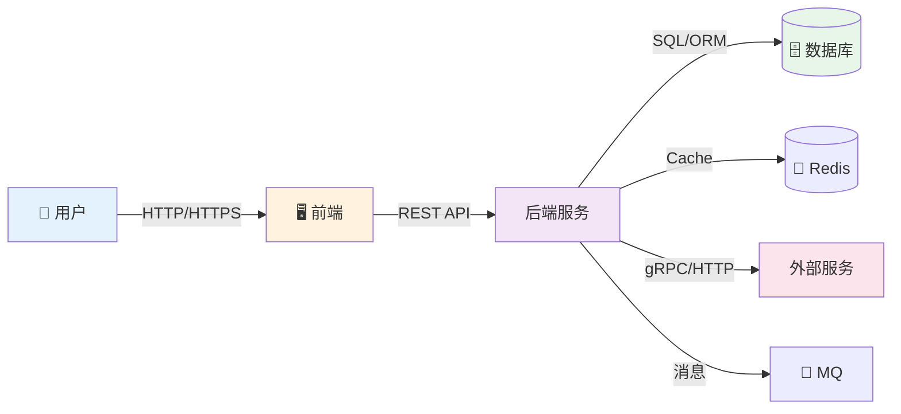
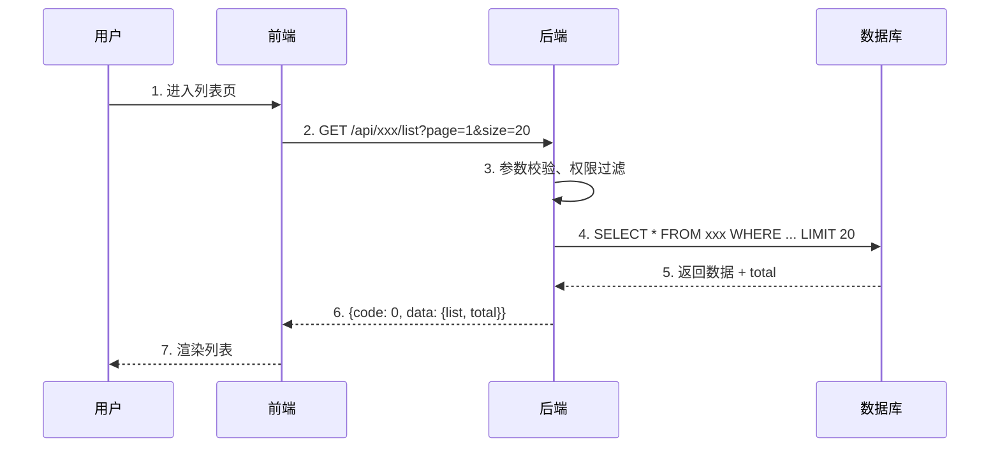

# [项目名称] - 内部交互链路

| 版本 | 日期 | 作者 | 说明 |
|------|------|------|------|
| 1.0 | YYYY-MM-DD | Your Name | 初始版本 |

---

>  **填写指南**：本文档描述前端、后端、数据库之间的交互流程，是前后端联调的重要参考。
>
>  **一页纸摘要**:
> 1. 看完这页能回答:跨模块/跨服务/跨团队的协作流程怎么走?异常怎么兜底?
> 2. 文档定位:设计级(产品级),端到端流程图 + 异常处理 + 性能安全
> 3. 核心动作:画系统交互图 + 核心流程时序图 + 状态机 + 异常处理
> 4. 何时使用:跨团队联调 / 复杂业务场景梳理 / 异常处理 SOP
> 5. 不要用于:单模块实现(→04/09)、API 详细字段(→03)
>
>  **关键引用**: [`reference/13-quality-selfcheck.md`](../reference/13-quality-selfcheck.md) (流程完整性自检) · [`reference/15-five-field-crosscheck.md`](../reference/15-five-field-crosscheck.md) (5字段必含项) · [`reference/16-common-pitfalls.md`](../reference/16-common-pitfalls.md) (时序图常见错误)

---

## 0. 填写指南

### 0.0 本文档价值

> **回答的核心问题**：跨模块/跨服务/跨团队的协作流程怎么走？异常怎么兜底？
> **不回答什么**：单模块实现（→04/09）、API 详细字段（→03）
> **价值判定**：复杂业务场景的端到端流程能跑通不漏节点
> **所属阶段**：设计（产品级）

### 0.1 文档结构

本文档分为四大板块：

| 板块 | 内容 | 必填 |
|------|------|------|
| **系统交互** | 架构、角色、调用约束 | ✅ |
| **核心流程** | 业务流程、状态流转 | ✅ |
| **异常处理** | 异常场景、降级策略 | ✅ |
| **性能安全** | 性能指标、安全考虑 | ✅ |

### 0.2 核心元素符号

| 元素 | 符号 | 说明 |
|------|------|------|
| 用户 | 👤 | 系统使用者 |
| 前端 | 🖥 | 管理后台前端 |
| 后端 |  | 后端服务 |
| 数据库 | 🗄 | 数据库/缓存 |
| 外部服务 |  | 第三方服务 |

---

## 1. 系统交互

⭐ **关键决策**：
- **系统边界 3 划法**：用户侧 / 业务侧 / 基础设施侧（禁止画 1 个大黑箱）
- **同步 vs 异步选型**：实时性要求 < 1s 用同步（如查询），> 1s 用异步（如导出/对账）
- **跨服务调用 3 必含**：超时设置（避免雪崩）/ 重试策略（幂等才重试）/ 降级方案（兜底返回）

>  **填写要点**：描述系统边界和角色关系。

### 1.1 架构定位



### 1.2 角色定义

| 角色 | 说明 | 在本模块中的职责 |
|------|------|------------------|
| 用户 | 使用系统的角色 | 操作前端界面 |
| 前端 | 管理后台前端 | 发送请求、渲染界面 |
| 后端 | 管理后台后端 | 处理业务逻辑、返回数据 |
| 外部服务 | 第三方服务（如有） | 提供数据或能力 |

### 1.3 调用约束

| 调用方向 | 是否允许 | 说明 |
|----------|----------|------|
| 用户 → 前端 | ✅ 允许 | 用户操作触发前端事件 |
| 前端 → 后端 | ✅ 允许 | API 调用 |
| 后端 → 数据库 | ✅ 允许 | 数据读写 |
| 前端 → 数据库 | ❌ **禁止** | 不允许跨层调用 |
| 后端 → 前端 | ❌ **禁止** | 后端不能直接操作前端 |
| 前端 → 外部服务 | ❌ **禁止** | 通过后端代理 |

### 1.4 数据流向

```
管理后台 ──查询──> 后端 ──查询──> 数据库
    │              │
    │              │ 聚合统计
    │              ▼
    │         七日趋势/统计
    │
    └──展示<────┘
```

---

## 2. 核心流程

> 📋 **填写要点**：用流程图描述核心业务流程，包含所有关键节点。

### 2.1 列表查询流程

#### 流程图



#### 详细步骤

| 步骤 | 操作 | 执行者 | 说明 |
|------|------|--------|------|
| 1 | 用户进入列表页 | 用户 | 触发页面加载 |
| 2 | 前端请求列表接口 | 前端 | GET/POST /api/xxx/list |
| 3 | 后端构建查询条件 | 后端 | 参数校验、权限过滤 |
| 4 | 后端查询数据库 | 后端 | SQL/ORM 查询 |
| 5 | 后端返回分页数据 | 后端 | {list: [], total: 0} |
| 6 | 前端渲染列表 | 前端 | 展示数据 |
| 7 | 用户查看列表 | 用户 | 完成 |

#### 时序图
```
用户        前端        后端       数据库
 │          │          │          │
 │  1.进入页面          │          │
 │─────────>│          │          │
 │          │  2.请求列表          │
 │          │─────────>│          │
 │          │          │  3.查询   │
 │          │          │─────────>│
 │          │          │<─────────│
 │          │<─────────│          │
 │<─────────│          │          │
 │          │          │          │
 │  4.查看列表          │          │
 │─────────>│          │          │
```

### 2.2 新增数据流程

#### 流程图
```
用户 ──> 前端 ──> 后端 ──> 数据库
  │                    │
  │ <─── 返回结果 ─────┘
  │
  │ <─── 提示成功
```

#### 详细步骤

| 步骤 | 操作 | 执行者 | 说明 |
|------|------|--------|------|
| 1 | 用户点击"新增" | 用户 | 打开表单 |
| 2 | 用户填写表单 | 用户 | 输入数据 |
| 3 | 用户提交表单 | 用户 | 触发校验 |
| 4 | 前端校验数据 | 前端 | 必填、格式校验 |
| 5 | 前端请求接口 | 前端 | POST /api/xxx/create |
| 6 | 后端校验数据 | 后端 | 业务校验、唯一性 |
| 7 | 后端写入数据库 | 后端 | INSERT |
| 8 | 后端返回结果 | 后端 | success/error |
| 9 | 前端提示用户 | 前端 | 成功/失败提示 |
| 10 | 前端跳转或刷新 | 前端 | 列表更新 |

### 2.3 查看详情流程

#### 流程图
```
用户 ──> 前端 ──> 后端 ──> 数据库
  │                    │
  │ <─── 返回数据 ─────┘
  │
  │ <─── 展示详情
```

### 2.4 更新数据流程

#### 流程图
```
用户 ──> 前端 ──> 后端 ──> 数据库
  │                    │
  │ <─── 返回结果 ─────┘
  │
  │ <─── 提示成功
```

### 2.5 删除数据流程

#### 流程图
```
用户 ──> 前端 ──> 后端 ──> 数据库
  │                    │
  │ <─── 返回结果 ─────┘
  │
  │ <─── 确认删除
```

---

## 3. 状态流转

⭐ **关键决策**：
- **状态机必含终态**：每个状态机至少有 1 个 SUCCESS/FAILED/CLOSED 终态
- **状态转移必带守卫**：每个箭头标注"何时能转"（权限/数据/时间窗口）
- **并发控制 3 选 1**：乐观锁（version 字段）/ 悲观锁（select for update）/ 分布式锁（Redis/ZK）
- **幂等性 3 件套**：唯一业务键 / 状态检查 / 30 分钟内允许重复请求


> 🔄 **填写要点**：描述数据的生命周期状态及其流转规则。

### 3.1 数据状态

#### 状态图
```
┌─────────┐    创建    ┌─────────┐
│  无数据  │ ───────> │   正常   │
└─────────┘           └─────────┘
                            │
                       更新/删除
                            │
                            ▼
                       ┌─────────┐
                       │ 已删除  │
                       └─────────┘
```

#### 状态说明

| 状态 | 说明 | 可进行的操作 |
|------|------|--------------|
| 正常 | 数据可用 | 更新、删除 |
| 已删除 | 软删除，数据不可见 | 管理员可恢复 |

### 3.2 任务状态（如有）

#### 状态图
```
                    ┌─────────┐
                    │  待执行  │ (PENDING)
                    └────┬────┘
                         │
                         ▼
              ┌─────────┐      ┌─────────┐
              │  失败    │ <── │  进行中  │ (RUNNING)
              └─────────┘      └────┬────┘
                                     │
                                     ▼
                              ┌─────────┐
                              │  已完成  │ (COMPLETED)
                              └─────────┘
```

#### 状态说明

| 状态 | 说明 | 进入条件 | 退出条件 |
|------|------|----------|----------|
| 待执行 | 等待处理 | 创建任务 | 任务开始 |
| 进行中 | 正在处理 | 任务被调度 | 处理完成/失败 |
| 已完成 | 成功结束 | 处理成功 | - |
| 失败 | 处理失败 | 异常终止 | 重试后重新执行 |

---

## 4. 异常处理

⭐ **关键决策**：
- **异常 3 类分级**：业务异常（可恢复，4xx）/ 系统异常（不可恢复，5xx）/ 第三方异常（降级处理）
- **超时设置**：内部 RPC 1-3s，外部 API 5-10s，**禁止无超时**
- **重试原则**：仅幂等操作可重试（GET/查询），写操作必须用"补偿"代替重试
- **熔断策略**：错误率 > 50% 触发熔断，30s 半开尝试


> ⚠ **填写要点**：描述各种异常场景的处理方式。

### 4.1 前端异常处理

| 场景 | 用户提示 | 处理方式 |
|------|----------|----------|
| 请求超时 | "网络超时，请重试" | 显示重试按钮 |
| 请求失败 | "请求失败，请稍后重试" | 记录日志 |
| 断网 | "网络已断开" | 监听网络恢复 |
| 登录过期 | "登录已过期，请重新登录" | 跳转登录页 |

### 4.2 后端异常处理

| 错误码 | 说明 | HTTP Status | 前端处理 |
|--------|------|--------------|----------|
| 400 | 参数错误 | 400 | 提示具体参数错误 |
| 401 | 未登录 | 401 | 跳转登录 |
| 403 | 无权限 | 403 | 提示无权限 |
| 404 | 数据不存在 | 404 | 提示数据不存在 |
| 500 | 服务器错误 | 500 | 提示稍后重试 |
| 429 | 请求过于频繁 | 429 | 提示稍后重试 |

### 4.3 降级处理

| 场景 | 降级策略 | 说明 |
|------|----------|------|
| 外部服务不可用 | 返回缓存数据 | 使用本地缓存 |
| 数据库连接失败 | 返回错误 | 提示服务不可用 |
| 接口超时 | 返回超时错误 | 不阻塞用户操作 |

### 4.4 异常流程图

```
请求发起
    │
    ▼
┌───────────┐
│  成功?    │
└─────┬─────┘
      │
  是  │  否
  ▼   │   ▼
返回  │ ┌────────────────┐
数据  │ │  错误分类处理   │
      │ └────────────────┘
          │
    ┌─────┼─────┐
    ▼     ▼     ▼
  网络   业务   服务
  错误   错误   器错
  误     误     误
    │     │     │
    ▼     ▼     ▼
  重试  提示  提示
  /弹   具体  稍后
  出错   错误  重试
```

---

## 5. 性能与安全

>  **填写要点**：描述性能指标和安全考虑。

### 5.1 性能指标

| 指标 | 目标值 | 说明 |
|------|--------|------|
| 列表接口响应时间 | < **500ms** | P95 |
| 详情接口响应时间 | < **300ms** | P95 |
| 前端渲染时间 | < **200ms** | - |
| 数据库查询时间 | < **100ms** | 单表查询 |
| 页面首次加载 | < **2s** | FCP |
| 页面交互响应 | < **200ms** | INP |

### 5.2 性能监控点

| 监控点 | 指标 | 告警阈值 |
|--------|------|----------|
| API 可用性 | HTTP 2xx 比例 | < 99% |
| API 延迟 | P95 延迟 | > 1s |
| API 错误率 | 5xx 比例 | > 1% |
| 前端加载 | FCP | > 2s |

### 5.3 安全考虑

| 安全点 | 实现方式 | 说明 |
|--------|----------|------|
| 接口认证 | Bearer Token | 请求头携带 |
| 参数校验 | 白名单校验 | 防止注入 |
| 敏感数据 | 脱敏返回 | 手机号、身份证等 |
| 操作日志 | 记录所有变更 | 审计追踪 |

### 5.4 安全流程图

```
请求 ──> Token 校验 ──> 参数校验 ──> 权限校验 ──> 业务处理
  │         │              │              │              │
  │         ▼              ▼              ▼              ▼
  │      401  失败     400 失败      403 失败       返回结果
  │      跳转登录       提示参数       提示权限
  │
  └── 脱敏处理 ◄────────────────────────────────┘
```

---

## 6. 接口依赖

### 6.1 内部接口

| 接口 | 调用方 | 提供方 | 说明 |
|------|--------|--------|------|
| /api/xxx/list | 前端 | 后端 | 列表查询 |
| /api/xxx/detail/{id} | 前端 | 后端 | 详情查询 |
| /api/xxx/create | 前端 | 后端 | 新增数据 |
| /api/xxx/update/{id} | 前端 | 后端 | 更新数据 |
| /api/xxx/delete/{id} | 前端 | 后端 | 删除数据 |

### 6.2 外部接口

| 接口 | 调用方 | 提供方 | 说明 |
|------|--------|--------|------|
| - | - | - | 如有外部服务调用 |

### 6.3 数据依赖

| 数据源 | 用途 | 更新频率 |
|--------|------|----------|
| 本地数据库 | 主数据 | 实时 |
| 缓存 | 热点数据 | 分钟级 |

---

## 7. 交互检查清单

> ✅ **填写完成后检查以下内容**

### 7.1 流程完整性

| 检查项 | 状态 |
|--------|------|
| 列表查询流程已绘制 | ☐ |
| 新增数据流程已绘制 | ☐ |
| 详情查看流程已绘制 | ☐ |
| 更新数据流程已绘制 | ☐ |
| 删除数据流程已绘制 | ☐ |

### 7.2 状态完整性

| 检查项 | 状态 |
|--------|------|
| 数据状态流转已定义 | ☐ |
| 任务状态流转已定义（如有） | ☐ |
| 状态说明完整 | ☐ |

### 7.3 异常完整性

| 检查项 | 状态 |
|--------|------|
| 前端异常处理已定义 | ☐ |
| 后端错误码已定义 | ☐ |
| 降级策略已定义 | ☐ |

---

*本文档用于前后端联调和问题排查。*


## 摘要(降级输出,200 字内)

> 模板定位摘要(全受众可见)。完整定义见下方各章。
> 模板定位:0.0 本文档价值

**模板说明**:`[项目名称] - 内部交互链路`

**关键数字/对象**:见完整版

**完整版见**:`08-内部交互链路.md`(主受众可访问)
