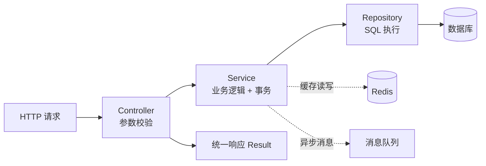
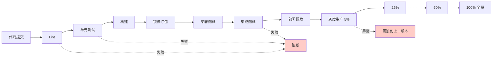

# [项目名称] - 后端开发指南

| 版本 | 日期 | 作者 | 说明 |
|------|------|------|------|
| 1.0 | YYYY-MM-DD | Your Name | 初始版本 |

---

>  **填写指南**：本文档规范后端开发的技术标准，包含技术栈、分层架构、API规范、数据库规范、安全规范。
>
>  **一页纸摘要**:
> 1. 看完这页能回答:后端怎么写?怎么分层?怎么缓存?怎么上 CI/CD?
> 2. 文档定位:开发级(技术级),后端规范手册
> 3. 核心动作:分层架构 + 缓存 + MQ + 分布式锁 + 限流 + 链路追踪
> 4. 何时使用:后端开发日常 / Code Review / 新人上手
> 5. 不要用于:API 字段(→03)、DB 物理设计(→12)
>
>  **关键引用**: `reference/12-value-matrix.md` (后端规范价值) · [`reference/13-quality-selfcheck.md`](../reference/13-quality-selfcheck.md) (分层自检) · [`reference/15-five-field-crosscheck.md`](../reference/15-five-field-crosscheck.md) (5 字段交叉)

## 0. 填写指南

### 0.0 本文档价值

> **回答的核心问题**：后端怎么实现？技术栈？规范？性能指标？安全？
> **不回答什么**：前端实现（→04）、产品定义（→06）
> **价值判定**：后端工程师按指南即可开工，接口与 03 一致
> **所属阶段**：开发（技术级）

### 0.1 文档结构

本文档分为六大板块：

| 板块 | 内容 | 必填 |
|------|------|------|
| **技术栈规范** | 语言、框架、版本 | ✅ |
| **分层架构** | Controller/Service/Repository | ✅ |
| **API设计规范** | RESTful 规范、命名、版本 | ✅ |
| **数据库规范** | 表设计、索引、约束 | ✅ |
| **安全规范** | 认证、授权、加密、审计 | ✅ |
| **日志规范** | 日志级别、格式、内容 | ✅ |

### 0.2 填写原则

| 原则 | 说明 |
|------|------|
| 语言一致性 | 使用统一的业务术语 |
| 可执行性 | 示例代码可直接使用 |
| 可验证性 | 有明确的验收标准 |

---

## 1. 技术栈规范

⭐ **关键决策**：**Java 17 + Spring Boot 3 + MyBatis-Plus + MySQL 8 + Redis 6 + RabbitMQ**（推荐 B 端业务系统组合）。
- **Java 17**：LTS 到 2029，性能优于 Java 8（虚拟线程预览）
- **Spring Boot 3**：Jakarta EE 9+，原生镜像支持
- **MyBatis-Plus**：国内最常用 ORM（vs JPA，复杂 SQL 更友好）
- **MySQL 8**：JSON 类型/窗口函数/降序索引
- **Redis 6**：缓存 + 分布式锁 + 限流
- **RabbitMQ**：业务消息（vs Kafka，大数据/日志场景才用 Kafka）
- **Knife4j**：Swagger 增强版（国内主流）

### 1.1 技术栈版本

| 层级 | 技术 | 版本 | 说明 |
|------|------|------|------|
| 语言 | Java | 17+ / Node.js | 根据项目选择 |
| 框架 | Spring Boot / Express | 3.x / 5.x | 根据项目选择 |
| ORM | MyBatis-Plus / Prisma | 3.5+ / 5.x | 根据项目选择 |
| 数据库 | MySQL / PostgreSQL | 8.0+ | 根据项目选择 |
| 缓存 | Redis | 6.x+ | 可选 |
| 消息队列 | RabbitMQ / Kafka | 最新稳定版 | 可选 |
| 日志 | SLF4J + Logback | - | - |
| 文档 | Swagger / Knife4j | - | API 文档 |

### 1.2 项目结构

#### Java (Spring Boot) 项目结构

```
src/main/java/com/example/{module}/
├── {ModuleName}Application.java     # 启动类
├── config/                         # 配置类
│   ├── WebConfig.java
│   ├── RedisConfig.java
│   └── SwaggerConfig.java
├── controller/                     # 控制层
│   ├── {ModuleName}Controller.java
│   └── dto/                       # 请求DTO
│       ├── CreateRequest.java
│       ├── UpdateRequest.java
│       └── QueryRequest.java
├── service/                        # 服务层
│   ├── {ModuleName}Service.java   # 接口
│   └── impl/                       # 实现
│       └── {ModuleName}ServiceImpl.java
├── repository/                    # 数据层
│   ├── {ModuleName}Repository.java
│   └── entity/                     # 实体
│       └── {ModuleName}.java
├── common/                         # 公共模块
│   ├── constant/                   # 常量
│   ├── enums/                      # 枚举
│   ├── exception/                  # 异常
│   └── util/                       # 工具
└── {ModuleName}ApplicationTests.java # 单元测试
```

#### Node.js (Express/Koa) 项目结构

```
src/
├── app.js / index.js               # 入口文件
├── config/                         # 配置
│   ├── index.js
│   ├── database.js
│   └── redis.js
├── controllers/                    # 控制器
│   └── {module}Controller.js
├── services/                       # 服务层
│   └── {module}Service.js
├── models/                         # 模型层
│   ├── {module}Model.js
│   └── index.js
├── routes/                          # 路由
│   ├── index.js
│   └── {module}Routes.js
├── middlewares/                    # 中间件
│   ├── auth.js
│   ├── errorHandler.js
│   └── validator.js
├── utils/                          # 工具
│   ├── logger.js
│   └── response.js
├── constants/                      # 常量
│   └── index.js
└── tests/                          # 测试
    └── {module}.test.js
```

---

## 2. 分层架构

### 2.1 分层职责

⭐ **关键决策**：**4 层架构（Controller / Service / Repository / Model）**，**严格单向依赖**（Controller → Service → Repository），禁止跨层调用（如 Controller 直接调 Repository）。
- **Controller**：薄薄一层，**禁止写业务逻辑**（仅参数校验 + 转发）
- **Service**：业务核心，事务边界
- **Repository**：仅 SQL 执行，**禁止拼装业务规则**
- **Model**：纯数据（Entity/DTO/VO），**禁止带方法**

| 层级 | 职责 | 不应该做什么 |
|------|------|-------------|
| **Controller** | 接收请求、参数校验、调用Service、返回响应 | 禁止写业务逻辑 |
| **Service** | 业务逻辑处理、事务管理 | 禁止直接操作数据库 |
| **Repository** | 数据访问、SQL执行 | 禁止写业务逻辑 |
| **Entity/DTO** | 数据模型 | 禁止写逻辑 |

### 2.2 分层调用关系



### 2.3 代码示例

#### Controller 层

```java
// Java Spring Boot
@RestController
@RequestMapping("/api/v1/xxx")
@RequiredArgsConstructor
public class XxxController {

    private final XxxService xxxService;

    @PostMapping
    public Result<Long> create(@Valid @RequestBody CreateRequest request) {
        Long id = xxxService.create(request);
        return Result.success(id);
    }

    @GetMapping("/{id}")
    public Result<XxxDetailVO> getById(@PathVariable Long id) {
        XxxDetailVO detail = xxxService.getById(id);
        return Result.success(detail);
    }

    @PutMapping("/{id}")
    public Result<Void> update(@PathVariable Long id,
                               @Valid @RequestBody UpdateRequest request) {
        xxxService.update(id, request);
        return Result.success();
    }

    @DeleteMapping("/{id}")
    public Result<Void> delete(@PathVariable Long id) {
        xxxService.delete(id);
        return Result.success();
    }
}
```

```javascript
// Node.js Express
const router = require('express').Router();
const { xxxService } = require('../services');

// 创建
router.post('/', async (req, res, next) => {
  try {
    const { body } = req;
    const id = await xxxService.create(body);
    res.success({ id });
  } catch (err) {
    next(err);
  }
});

// 获取详情
router.get('/:id', async (req, res, next) => {
  try {
    const { id } = req.params;
    const detail = await xxxService.getById(id);
    res.success(detail);
  } catch (err) {
    next(err);
  }
});

module.exports = router;
```

#### Service 层

```java
// Java
@Service
@RequiredArgsConstructor
public class XxxService {

    private final XxxRepository xxxRepository;

    @Transactional(rollbackFor = Exception.class)
    public Long create(CreateRequest request) {
        // 业务校验
        validateRequest(request);
        // 唯一性校验
        if (xxxRepository.existsByName(request.getName())) {
            throw new BusinessException("名称已存在");
        }
        // 创建
        Xxx entity = new Xxx();
        BeanUtils.copyProperties(request, entity);
        return xxxRepository.save(entity).getId();
    }

    public XxxDetailVO getById(Long id) {
        Xxx entity = xxxRepository.findById(id)
            .orElseThrow(() -> new NotFoundException("数据不存在"));
        return convertToDetailVO(entity);
    }

    @Transactional(rollbackFor = Exception.class)
    public void update(Long id, UpdateRequest request) {
        Xxx entity = xxxRepository.findById(id)
            .orElseThrow(() -> new NotFoundException("数据不存在"));
        BeanUtils.copyProperties(request, entity);
        xxxRepository.save(entity);
    }

    @Transactional(rollbackFor = Exception.class)
    public void delete(Long id) {
        xxxRepository.deleteById(id);
    }
}
```

```javascript
// Node.js
class XxxService {
  async create(data) {
    // 业务校验
    this.validateRequest(data);
    // 唯一性校验
    const exists = await this.checkExists(data.name);
    if (exists) {
      throw new BusinessError('名称已存在');
    }
    // 创建
    const result = await this.model.create(data);
    return result.id;
  }

  async getById(id) {
    const entity = await this.model.findById(id);
    if (!entity) {
      throw new NotFoundError('数据不存在');
    }
    return entity;
  }

  async update(id, data) {
    const entity = await this.getById(id);
    Object.assign(entity, data);
    await entity.save();
  }

  async delete(id) {
    await this.model.deleteById(id);
  }
}
```

---

## 3. API设计规范

### 3.1 RESTful 规范

| 方法 | 路径 | 说明 | 示例 |
|------|------|------|------|
| GET | /xxx | 查询列表 | GET /api/v1/users |
| GET | /xxx/{id} | 查询详情 | GET /api/v1/users/1 |
| POST | /xxx | 创建 | POST /api/v1/users |
| PUT | /xxx/{id} | 全量更新 | PUT /api/v1/users/1 |
| PATCH | /xxx/{id} | 部分更新 | PATCH /api/v1/users/1 |
| DELETE | /xxx/{id} | 删除 | DELETE /api/v1/users/1 |

### 3.2 命名规范

| 类型 | 规范 | 示例 |
|------|------|------|
| URL路径 | kebab-case | /user-info → /user-info |
| 参数名 | camelCase | userName |
| 响应字段 | camelCase | userName |
| 枚举值 | 小写下划线 | user_status |

### 3.3 响应格式

```json
{
  "code": 200,
  "data": {},
  "message": "success",
  "requestId": "uuid-v4",
  "timestamp": 1706745600000
}
```

| 字段 | 类型 | 说明 |
|------|------|------|
| code | number | 业务状态码 |
| data | object | 业务数据 |
| message | string | 提示信息 |
| requestId | string | 请求链路ID |
| timestamp | number | 时间戳 |

### 3.4 通用响应码

| 状态码 | 说明 |
|--------|------|
| 200 | 成功 |
| 400 | 参数错误 |
| 401 | 未登录 |
| 403 | 无权限 |
| 404 | 资源不存在 |
| 500 | 服务器错误 |

### 3.5 分页响应

```json
{
  "code": 200,
  "data": {
    "list": [],
    "pagination": {
      "page": 1,
      "pageSize": 10,
      "total": 100,
      "totalPages": 10
    }
  },
  "message": "success"
}
```

---

## 4. 数据库规范

### 4.1 表命名规范

| 类型 | 规范 | 示例 |
|------|------|------|
| 表名 | 小写下划线，复数名词 | sys_user |
| 主键 | id | id |
| 外键 | xxx_id | user_id |
| 索引 | idx_表名_字段 | idx_user_name |
| 唯一索引 | uk_表名_字段 | uk_user_name |

### 4.2 字段命名规范

| 类型 | 规范 | 示例 |
|------|------|------|
| 普通字段 | 小写下划线 | user_name |
| 状态字段 | xxx_status | status |
| 时间字段 | xxx_at / xxx_time | created_at |
| 布尔字段 | is_xxx | is_deleted |

### 4.3 表结构模板

```sql
CREATE TABLE `{table_name}` (
  `id` bigint NOT NULL AUTO_INCREMENT COMMENT '主键ID',
  `uuid` varchar(36) NOT NULL COMMENT '业务主键UUID',
  `{field1}` varchar(64) NOT NULL COMMENT '字段1',
  `{field2}` int DEFAULT NULL COMMENT '字段2',
  `status` tinyint NOT NULL DEFAULT '1' COMMENT '状态：1正常 0禁用',
  `created_by` varchar(36) DEFAULT NULL COMMENT '创建人',
  `created_at` datetime NOT NULL DEFAULT CURRENT_TIMESTAMP COMMENT '创建时间',
  `updated_by` varchar(36) DEFAULT NULL COMMENT '更新人',
  `updated_at` datetime NOT NULL DEFAULT CURRENT_TIMESTAMP ON UPDATE CURRENT_TIMESTAMP COMMENT '更新时间',
  `deleted_at` datetime DEFAULT NULL COMMENT '软删除时间',
  PRIMARY KEY (`id`),
  UNIQUE KEY `uk_{table_name}_uuid` (`uuid`),
  KEY `idx_{table_name}_{field}` (`{field}`)
) ENGINE=InnoDB DEFAULT CHARSET=utf8mb4 COMMENT='表注释';
```

### 4.4 字段类型选择

| 数据类型 | 使用场景 | 示例 |
|----------|----------|------|
| BIGINT | 主键、金额 | id, amount |
| VARCHAR | 字符串、有长度限制 | name, phone |
| TEXT | 长文本 | description, content |
| INT | 状态、枚举 | status, type |
| TINYINT | 布尔、状态 | is_deleted |
| DATETIME | 时间 | created_at, updated_at |
| DECIMAL | 精确金额 | price, balance |

---

## 5. 安全规范

### 5.1 认证授权

| 规范 | 说明 |
|------|------|
| Token认证 | Bearer Token 放在 Header |
| 权限校验 | 接口级别权限校验 |
| 敏感操作 | 需要二次验证 |

### 5.2 参数校验

| 规范 | 说明 |
|------|------|
| 必填校验 | @NotNull / @NotBlank |
| 格式校验 | @Pattern / @Email |
| 长度校验 | @Size |
| 范围校验 | @Min / @Max |

### 5.3 SQL注入防护

| 规范 | 说明 |
|------|------|
| 参数化查询 | 必须使用预编译语句 |
| 禁止拼接SQL | 禁止字符串拼接SQL |
| 白名单校验 | 字段名、排序字段白名单 |

### 5.4 敏感数据

| 数据类型 | 处理方式 |
|----------|----------|
| 密码 | BCrypt加密存储 |
| 手机号 | 脱敏返回 138****1234 |
| 身份证 | 脱敏返回 110101****1234 |
| 银行卡 | 加密存储 |

---

## 6. 日志规范

### 6.1 日志级别

| 级别 | 使用场景 |
|------|----------|
| ERROR | 异常、错误 |
| WARN | 警告、可恢复异常 |
| INFO | 重要业务节点 |
| DEBUG | 开发调试 |

### 6.2 日志格式

```
时间 | 级别 | traceId | 线程 | 类名 | 消息
2024-01-01 12:00:00.000 | INFO | abc123 | http-nio-8080 | c.o.e.c.UserController | 用户登录成功
```

### 6.3 日志内容规范

| 操作 | 必记字段 |
|------|----------|
| 用户登录 | userId, ip, device |
| 数据操作 | userId, dataId, action |
| 接口调用 | url, method, duration |
| 异常 | exception, stackTrace |

### 6.4 敏感信息

**禁止记录以下信息**：
- 密码
- Token
- 银行卡号
- 身份证号

---

## 7. 异常处理规范

### 7.1 异常分类

| 异常类型 | 说明 | HTTP状态码 |
|----------|------|-------------|
| BusinessException | 业务异常 | 400 |
| UnauthorizedException | 未登录 | 401 |
| ForbiddenException | 无权限 | 403 |
| NotFoundException | 资源不存在 | 404 |
| SystemException | 系统异常 | 500 |

### 7.2 异常处理示例

```java
// 全局异常处理
@RestControllerAdvice
public class GlobalExceptionHandler {

    @ExceptionHandler(BusinessException.class)
    public Result<Void> handleBusiness(BusinessException e) {
        log.warn("业务异常: {}", e.getMessage());
        return Result.fail(400, e.getMessage());
    }

    @ExceptionHandler(UnauthorizedException.class)
    public Result<Void> handleUnauthorized(UnauthorizedException e) {
        return Result.fail(401, "请先登录");
    }

    @ExceptionHandler(Exception.class)
    public Result<Void> handleSystem(Exception e) {
        log.error("系统异常", e);
        return Result.fail(500, "系统异常，请稍后重试");
    }
}
```

---

## 8. 常用工具类

### 8.1 响应封装

```java
// Java
public class Result<T> {
    private int code;
    private T data;
    private String message;
    private String requestId;
    private long timestamp;

    public static <T> Result<T> success(T data) {
        Result<T> result = new Result<>();
        result.setCode(200);
        result.setData(data);
        result.setMessage("success");
        result.setRequestId(getTraceId());
        result.setTimestamp(System.currentTimeMillis());
        return result;
    }

    public static <T> Result<T> fail(int code, String message) {
        Result<T> result = new Result<>();
        result.setCode(code);
        result.setMessage(message);
        result.setRequestId(getTraceId());
        result.setTimestamp(System.currentTimeMillis());
        return result;
    }
}
```

```javascript
// Node.js
class Response {
  static success(data, message = 'success') {
    return {
      code: 200,
      data,
      message,
      requestId: getTraceId(),
      timestamp: Date.now()
    };
  }

  static fail(code, message) {
    return {
      code,
      data: null,
      message,
      requestId: getTraceId(),
      timestamp: Date.now()
    };
  }
}

// 快捷方法
res.success = (data) => res.json(Response.success(data));
res.fail = (code, message) => res.json(Response.fail(code, message));
```

### 8.2 分页工具

```java
// Java
public PageResult<T> toPageResult(Page<T> page) {
    PageResult<T> result = new PageResult<>();
    result.setList(page.getRecords());
    result.setTotal(page.getTotal());
    result.setPage(page.getCurrent());
    result.setPageSize(page.getSize());
    result.setTotalPages(page.getPages());
    return result;
}
```

---

## 9. 注意事项

### 9.1 必须遵守

| 规范 | 说明 |
|------|------|
| 分层职责 | Controller不写业务，Repository不写业务 |
| 参数校验 | 必填字段必须校验 |
| 异常处理 | 所有异常必须捕获处理 |
| 日志记录 | 关键操作必须记录日志 |
| SQL安全 | 必须参数化查询 |

### 9.2 禁止事项

| 禁止 | 说明 |
|------|------|
| 禁止字符串拼接SQL | 必须参数化 |
| 禁止硬编码 | 使用常量或配置 |
| 禁止打印密码 | 日志中禁止 |
| 禁止业务逻辑放Controller | 必须放Service |

---

## 10. 参考资源

| 资源 | 链接 |
|------|------|
| Java代码规范 | Alibaba Java Coding Guidelines |
| RESTful设计 | RESTful API Design Guide |
| SQL编写规范 | SQL Performance Explained |

---

## 11. 后端开发指南检查清单

> ✅ **完成后逐项检查，确保开发指南可作为后端开发依据**

| 检查项 | 状态 |
|--------|------|
| 目录结构与代码分层清晰 | ☐ |
| 命名规范已定义 | ☐ |
| 数据库访问规范已说明 | ☐ |
| 缓存使用规范已定义 | ☐ |
| 错误处理统一规范 | ☐ |
| 日志规范完整 | ☐ |
| 安全规范已覆盖 | ☐ |
| 性能要求已量化 | ☐ |
| 与 03 接口文档字段一致 | ☐ |
| 与 12 数据库设计表结构一致 | ☐ |

---

## 12. 缓存策略

>  **核心目标**：降低数据库压力、提升响应速度、应对高并发。系统化设计缓存架构是后端高性能的基石。

### 12.1 多级缓存架构

⭐ **关键决策**：**3 级缓存（L1 进程内 + L2 Redis + L3 CDN）+ DB 兜底**，**总命中率目标 ≥ 95%**（L1 10% + L2 80% + L3 5%）。
- **L1 Caffeine**：配置、字典、热点 Key（TTL 5-30min）
- **L2 Redis**：业务聚合对象（TTL 30min-2h），**必须设过期时间**（防雪崩）
- **L3 CDN**：静态资源、首页 HTML（5-15min 边缘缓存）
- **缓存三大问题**：穿透（布隆过滤器）、雪崩（随机 TTL）、击穿（分布式锁）

| 层级 | 介质 | 容量 | 延迟 | 命中率目标 | 适用场景 |
|------|------|------|------|-----------|----------|
| **L1 进程内缓存** | Caffeine / Guava / Map | MB 级 | 纳秒级 | 5-15% | 配置、字典、热点数据 |
| **L2 分布式缓存** | Redis / Memcached | GB 级 | 毫秒级 | 70-85% | 业务对象、聚合数据 |
| **L3 边缘缓存** | CDN / Nginx | TB 级 | 10-50ms | 5-15% | 静态资源、首页、列表 |
| **DB 兜底** | MySQL | TB 级 | 10-100ms | 100% | 持久化数据 |

**典型读流程**：
```
请求 → L1 命中? ─ 是 → 返回
         │否
         ▼
       L2 命中? ─ 是 → 写回 L1 → 返回
         │否
         ▼
       L3 命中? ─ 是 → 写回 L2 → 写回 L1 → 返回
         │否
         ▼
       DB 查询 → 逐级回填 → 返回
```

### 12.2 缓存模式（Cache Pattern）

| 模式 | 读流程 | 写流程 | 一致性 | 适用 |
|------|--------|--------|--------|------|
| **Cache-Aside（旁路缓存）** | 应用先读 Cache，未命中读 DB 再回填 | 应用更新 DB，删除 Cache | 最终一致 | 最常用，80% 场景 |
| **Read-Through** | Cache 自己读 DB，应用透明 | 写 DB + 写 Cache | 最终一致 | 框架封装 |
| **Write-Through** | - | 写 Cache，Cache 同步写 DB | 强一致 | 低写入 |
| **Write-Behind** | - | 写 Cache，异步批量写 DB | 弱一致 | 高写入，容忍丢失 |
| **Refresh-Ahead** | Cache 提前刷新 | 异步刷新 | 最终一致 | 热点预热 |

**Cache-Aside 经典实现（Java）**：
```java
public XxxDetailVO getById(Long id) {
    String key = "xxx:" + id;
    // 1. 读 L1 (Caffeine)
    XxxDetailVO cached = caffeineCache.get(key);
    if (cached != null) return cached;
    // 2. 读 L2 (Redis)
    cached = redisTemplate.opsForValue().get(key);
    if (cached != null) {
        caffeineCache.put(key, cached);
        return cached;
    }
    // 3. 读 DB 并回填
    Xxx entity = xxxRepository.findById(id)
        .orElseThrow(() -> new NotFoundException("数据不存在"));
    cached = convertToVO(entity);
    redisTemplate.opsForValue().set(key, cached, 30, TimeUnit.MINUTES);
    caffeineCache.put(key, cached);
    return cached;
}

@Transactional
public void update(Long id, UpdateRequest request) {
    xxxRepository.update(id, request);
    // 延迟双删：先删再更新 DB 之后再次删除（应对主从延迟）
    redisTemplate.delete("xxx:" + id);
    scheduledExecutor.schedule(() -> redisTemplate.delete("xxx:" + id), 500, TimeUnit.MILLISECONDS);
}
```

### 12.3 缓存三大问题与防护

| 问题 | 现象 | 根因 | 解决方案 |
|------|------|------|----------|
| **缓存击穿** | 单个热点 key 过期瞬间被海量并发请求打到 DB | key 过期瞬间并发读 | 互斥锁（mutex）/ 逻辑过期 / singleflight |
| **缓存雪崩** | 大量 key 同时过期 / Redis 宕机 | 集中过期 / Redis 不可用 | TTL 随机化 / 多级缓存 / Redis 集群 / 熔断 |
| **缓存穿透** | 查询 DB 和 Cache 都不存在的数据 | 恶意请求 / 业务漏洞 | 布隆过滤器 / 缓存空值 / 参数校验 |

**雪崩防护 - TTL 随机化**：
```java
int baseTtl = 30;
int randomTtl = ThreadLocalRandom.current().nextInt(0, 10);
redisTemplate.opsForValue().set(key, value, baseTtl + randomTtl, TimeUnit.MINUTES);
```

**穿透防护 - 布隆过滤器**：
```java
// 启动时加载所有 ID 到 Bloom Filter
RBloomFilter<Long> bloomFilter = redisson.getBloomFilter("xxx:bf");
bloomFilter.tryInit(1000000L, 0.01);

public XxxDetailVO getById(Long id) {
    if (!bloomFilter.contains(id)) {
        throw new NotFoundException("数据不存在");
    }
    // ... 后续查询
}
```

### 12.4 Key 命名规范

| 维度 | 规范 | 示例 |
|------|------|------|
| 业务域 | `biz:` 前缀 | `order:` `user:` `product:` |
| 实体 | `实体:` | `order:detail:` |
| 维度 | `id` `list` `count` | `order:detail:1001` `order:list:hot` |
| 业务标签 | 状态/类型 | `order:list:status:1` |

**禁止**：
- 禁止使用动态拼接的 key（无法回收）
- 禁止无前缀 key（命名空间污染）
- 禁止 value > 1MB（大 key 阻塞）

### 12.5 缓存使用清单

| 检查项 | 状态 |
|--------|------|
| 缓存模式已选型（推荐 Cache-Aside） | ☐ |
| 缓存 TTL 包含随机化 | ☐ |
| 热点 key 已识别（监控大 key） | ☐ |
| 三类问题防护已实现 | ☐ |
| 缓存预热方案已定义 | ☐ |
| 缓存数据一致性方案已选型 | ☐ |

---

## 13. 消息队列

>  **核心目标**：异步解耦、削峰填谷、最终一致。MQ 是分布式系统集成的关键基础设施。

### 13.1 MQ 选型对比

| 维度 | Kafka | RabbitMQ | RocketMQ | Pulsar |
|------|-------|----------|----------|--------|
| 吞吐量 | 百万/秒 | 万级 | 十万/秒 | 百万/秒 |
| 延迟 | 5-100ms | 微秒级 | 5-50ms | 5-100ms |
| 消息可靠性 | 高（副本） | 高（ACK） | 极高（同步双写） | 高 |
| 事务消息 | ✅ 0.11+ | ❌ | ✅ 原生支持 | ✅ |
| 顺序消息 | 分区内 | 单队列 | ✅ 严格 | ✅ |
| 死信队列 | ❌ 需自实现 | ✅ 原生 | ✅ 原生 | ✅ |
| 适用场景 | 日志、大数据、流计算 | 业务解耦、复杂路由 | 金融级、电商交易 | 云原生、多租户 |
| 客户端语言 | 多语言 | 多语言 | Java 为主 | 多语言 |
| 运维成本 | 中 | 低 | 中 | 高 |

**选型建议**：
- **日志/埋点/数据管道** → Kafka
- **业务解耦/复杂路由** → RabbitMQ
- **金融级/订单/严格可靠** → RocketMQ
- **云原生/Serverless** → Pulsar

### 13.2 消息可靠性保障

```
┌────────┐   1.发送    ┌─────┐   2.存储    ┌────┐   3.消费    ┌────────┐
│Producer│ ──────────>│Broker│─────────>│ Queue│─────────>│Consumer│
└────────┘            └─────┘            └────┘            └────────┘
   ↑                      ↑                  ↑                  ↑
   └──── 7.重试/告警 ─────┴── 6.持久化 ────┴── 5.ACK ─────────┘
```

| 阶段 | 风险 | 保障手段 |
|------|------|----------|
| **生产** | 发送失败/丢失 | 本地消息表 / 事务消息 / 重试 + 死信 |
| **存储** | Broker 宕机数据丢失 | 副本 / fsync / 持久化 |
| **消费** | 消费失败/重复 | 手动 ACK / 幂等消费 / 失败重投 |

### 13.3 消息幂等性

| 方案 | 原理 | 适用 |
|------|------|------|
| **唯一索引** | 业务 ID 唯一约束 | 强幂等（创建场景） |
| **乐观锁** | version 字段 | 更新场景 |
| **Redis Set** | 消费前 setnx | 高吞吐（允许极小丢失） |
| **状态机** | 状态转移校验 | 状态流转 |
| **数据库去重表** | message_id 主键 | 通用 |

**Redis 幂等示例**：
```java
public void onMessage(Message message) {
    String msgId = message.getMsgId();
    String key = "mq:consumed:" + msgId;
    // SETNX 保证只有一次消费
    Boolean firstTime = redisTemplate.opsForValue().setIfAbsent(key, "1", 7, TimeUnit.DAYS);
    if (Boolean.FALSE.equals(firstTime)) {
        log.info("消息已消费，跳过: msgId={}", msgId);
        return;
    }
    try {
        doBusiness(message);
    } catch (Exception e) {
        redisTemplate.delete(key);  // 失败回滚，下次重试
        throw e;
    }
}
```

### 13.4 死信队列（DLQ）

**触发条件**：
- 消息被拒（basic.reject / basic.nack with requeue=false）
- 消息 TTL 过期
- 队列达到最大长度

**处理流程**：
```
主队列 → 消费失败 N 次 → 死信交换机 → 死信队列 → 人工/自动补偿
```

**RabbitMQ DLX 配置**：
```java
// 声明死信交换机和死信队列
@Bean
public Queue dlq() {
    return QueueBuilder.durable("order.dlq")
        .deadLetterExchange("order.dlx")
        .deadLetterRoutingKey("order.dlq")
        .build();
}

// 消费重试：失败 3 次后入死信
@RabbitListener(queues = "order.queue")
public void onMessage(OrderMessage msg, @Header(AmqpHeaders.DELIVERY_TAG) long tag, Channel channel) {
    try {
        process(msg);
        channel.basicAck(tag, false);
    } catch (Exception e) {
        long retryCount = redisTemplate.opsForValue().increment("retry:" + msg.getId());
        if (retryCount >= 3) {
            channel.basicNack(tag, false, false);  // 拒绝入死信
        } else {
            channel.basicNack(tag, false, true);  // 重新入队
        }
    }
}
```

### 13.5 MQ 使用清单

| 检查项 | 状态 |
|--------|------|
| MQ 选型已确认 | ☐ |
| 消息可靠性方案已设计 | ☐ |
| 消息幂等已实现 | ☐ |
| 死信队列已配置 | ☐ |
| 消费失败重试策略已定义 | ☐ |
| 消息顺序性已评估 | ☐ |
| 监控告警已接入（堆积/延迟/失败） | ☐ |

---

## 14. 分布式锁

⭐ **关键决策**：**Redis 分布式锁（Redlock 或 SETNX+Lua）为主，ZooKeeper 选型仅在强一致场景**。
- **Redis 锁（推荐）**：性能高（10w QPS），实现简单（Redisson 一行代码）
- **ZK 锁**：强一致但性能差（数千 QPS），仅金融/支付/库存核心链路用
- **DB 锁**：唯一索引 + `select for update`，**仅用作兜底**
- **避坑**：禁用 `SETNX + EXPIRE`（非原子，易死锁），必须用 `SET key value NX PX 30000`

>  **核心目标**：跨进程/跨服务的互斥访问控制，是分布式系统正确性的基石。

### 14.1 实现方式对比

| 方案 | 性能 | 可靠性 | 复杂度 | 适用 |
|------|------|--------|--------|------|
| **Redis SETNX** | 高 | 中 | 低 | 通用（最常见） |
| **Redisson** | 高 | 高 | 低 | 锁/读写锁/信号量/闭锁 |
| **ZooKeeper** | 中 | 高 | 高 | 强一致场景 |
| **MySQL 行锁** | 低 | 中 | 低 | 锁粒度小、低并发 |
| **Etcd** | 中 | 高 | 中 | K8s 生态 |

### 14.2 Redis 分布式锁关键问题

| 问题 | 现象 | 解决方案 |
|------|------|----------|
| **非原子加锁** | SETNX 后 EXPIRE 之前崩溃 → 死锁 | 用 `SET key value NX EX seconds` 原子命令 |
| **锁误删** | 线程 A 阻塞超时，锁过期被 B 持有，A 醒来误删 | value = uuid，释放前 GET 比对 + Lua 原子删除 |
| **锁续期** | 业务未完成锁已过期 | Redisson 看门狗自动续期 |
| **Redlock** | Redis 主从切换丢锁 | 多数派算法部署 5 个独立节点 |

**基础 Redis 分布式锁**：
```java
public boolean tryLock(String key, String requestId, int expireSeconds) {
    String result = redisTemplate.opsForValue().setIfAbsent(key, requestId, expireSeconds, TimeUnit.SECONDS);
    return Boolean.TRUE.equals(result);
}

public boolean releaseLock(String key, String requestId) {
    // Lua 脚本：判断 + 删除原子
    String lua = "if redis.call('get', KEYS[1]) == ARGV[1] then return redis.call('del', KEYS[1]) else return 0 end";
    Long result = redisTemplate.execute(new DefaultRedisScript<>(lua, Long.class), Collections.singletonList(key), requestId);
    return result != null && result > 0;
}
```

**Redisson 分布式锁（推荐）**：
```java
@Autowired
private RedissonClient redisson;

public void doWithLock(Long orderId) {
    RLock lock = redisson.getLock("order:lock:" + orderId);
    try {
        // 1. 默认 30s 自动续期（看门狗），waitTime=5s
        boolean acquired = lock.tryLock(5, 30, TimeUnit.SECONDS);
        if (!acquired) {
            throw new BusinessException("系统繁忙，请稍后重试");
        }
        // 2. 业务逻辑
        processOrder(orderId);
    } catch (InterruptedException e) {
        Thread.currentThread().interrupt();
    } finally {
        if (lock.isHeldByCurrentThread()) {
            lock.unlock();
        }
    }
}
```

### 14.3 Redlock 算法

**Antirez Redlock 步骤**（部署 5 个独立 Redis 节点）：
1. 记录开始时间 T1
2. 依次向 5 个节点 SETNX（超时 50ms）
3. 客户端记录 T2 = 当前时间
4. 当且仅当 ≥ N/2+1 节点加锁成功 且 (T2-T1) < 锁 TTL，视为加锁成功
5. 锁有效时间 = TTL - (T2-T1)
6. 加锁失败，向所有节点发 DEL

**生产建议**：
- 优先 Redisson 单 Redis（99% 场景够用）
- 强一致要求才上 Redlock
- 锁粒度要细（按业务 ID 锁）
- 避免锁内调用外部 HTTP

### 14.4 锁的注意事项

| 维度 | 原则 |
|------|------|
| **粒度** | 按业务 ID 锁，不锁整个表 |
| **超时** | 必须设 TTL，且 < 业务最大执行时间 |
| **可重入** | 同一线程可多次获取（Redisson 默认支持） |
| **公平性** | 必要时用 `RLock fairLock` |
| **避免** | 锁内 sleep / 锁内 HTTP / 锁内大事务 |

### 14.5 分布式锁清单

| 检查项 | 状态 |
|--------|------|
| 锁实现方案已选型 | ☐ |
| 锁粒度已细化（按业务 ID） | ☐ |
| 锁超时已设置（含续期） | ☐ |
| 锁误删防护已实现（Lua 脚本） | ☐ |
| 锁内业务无长耗时操作 | ☐ |
| 失败回退方案已定义 | ☐ |

---

## 15. 限流与熔断

>  **核心目标**：保护系统不被流量打挂，提供有损服务而非完全不可用。

### 15.1 限流算法

| 算法 | 原理 | 优点 | 缺点 | 适用 |
|------|------|------|------|------|
| **固定窗口** | 1 分钟内累计计数 | 简单 | 边界突刺 | 简单场景 |
| **滑动窗口** | 多个小窗口加权 | 平滑 | 略复杂 | 通用 API 限流 |
| **令牌桶** | 匀速放令牌，无令牌拒绝 | 允许突发 | 实现稍复杂 | 主流（Guava/Sentinel） |
| **漏桶** | 固定速率处理请求 | 绝对平滑 | 无法应对突发 | 流量整形 |
| **滑动日志** | 记录每条请求时间戳 | 精确 | 内存大 | 小流量精确控制 |

**令牌桶 vs 漏桶**：
- 令牌桶：**允许突发**（桶满则攒），适合 API 网关
- 漏桶：**强制匀速**（出口恒定），适合消息消费

### 15.2 限流维度

| 维度 | 示例 | 配置 |
|------|------|------|
| **QPS** | 单接口 1000 QPS | 1000 req/s |
| **并发数** | 单服务 500 并发 | sem = 500 |
| **IP** | 单 IP 100/分钟 | `ip:{addr}:limit` |
| **用户** | 单用户 50/秒 | `user:{id}:limit` |
| **租户** | 租户 A 10000/小时 | `tenant:{id}:quota` |
| **业务** | 登录 5/分钟、支付 10/秒 | 按接口配置 |
| **地域** | 境外 100/秒 | `geo:{region}:limit` |

### 15.3 熔断与降级

| 概念 | 定义 | 触发 |
|------|------|------|
| **熔断** | 下游异常时快速失败，避免雪崩 | 错误率/慢调用超阈值 |
| **降级** | 系统压力大时关闭非核心功能 | 手动开关/自动熔断 |
| **隔离** | 资源隔离（线程池/信号量） | 防止故障扩散 |
| **超时** | 上游调用设最大等待时间 | 防止慢调用拖死 |

**熔断三状态**：
```
       失败率超阈值
CLOSED ──────────────────> OPEN
   ↑                          │
   │ 探测成功                  │ 超时（默认 5s）
   │                          ↓
   └─────────────────── HALF_OPEN
```

### 15.4 工具选型对比

| 工具 | 语言生态 | 限流 | 熔断 | 降级 | 特点 |
|------|----------|------|------|------|------|
| **Sentinel（阿里）** | Java | ✅ | ✅ | ✅ | 规则化、实时控制台 |
| **Resilience4j** | Java/通用 | ✅ | ✅ | ✅ | 函数式、轻量 |
| **Hystrix** | Java | ✅ | ✅ | ✅ | 已停止维护 |
| **Guava RateLimiter** | Java | ✅ | ❌ | ❌ | 进程内令牌桶 |
| **Nginx limit_req** | - | ✅ | ❌ | ❌ | 边缘网关限流 |
| **Spring Cloud Gateway** | Java | ✅ | ✅ | ✅ | API 网关层 |

**Sentinel 集成示例**：
```java
// 1. 引入 spring-cloud-starter-alibaba-sentinel
// 2. 配置规则
@PostConstruct
public void initFlowRules() {
    List<FlowRule> rules = new ArrayList<>();
    FlowRule rule = new FlowRule("order:create")
        .setGrade(RuleConstant.FLOW_GRADE_QPS)
        .setCount(1000)  // 1000 QPS
        .setControlBehavior(RuleConstant.CONTROL_BEHAVIOR_WARM_UP);
    rules.add(rule);
    FlowRuleManager.loadRules(rules);
}

// 3. 资源定义
@SentinelResource(value = "order:create", blockHandler = "handleBlock")
public Long createOrder(CreateRequest request) {
    return orderService.create(request);
}

public Long handleBlock(CreateRequest request, BlockException ex) {
    throw new BusinessException("系统繁忙，请稍后重试");
}
```

### 15.5 限流清单

| 检查项 | 状态 |
|--------|------|
| 限流算法已选型 | ☐ |
| 限流维度已定义（IP/用户/接口/租户） | ☐ |
| 限流阈值已评估（基于压测） | ☐ |
| 熔断降级策略已制定 | ☐ |
| 限流后的响应已规范（HTTP 429） | ☐ |
| 限流监控已接入 | ☐ |

---

## 16. 链路追踪

>  **核心目标**：分布式系统调用链可视化，快速定位慢请求/错误根因。

### 16.1 核心概念

| 概念 | 定义 | 示例 |
|------|------|------|
| **Trace** | 一次完整请求的调用链 | 用户下单 → 网关 → 订单服务 → 支付服务 |
| **Span** | 链路中的一个节点 | OrderService.create 耗时 50ms |
| **TraceID** | 全局唯一链路 ID | `7a3b4c5d6e7f8a9b` |
| **SpanID** | 节点 ID | `0.1.2.3` |
| **ParentSpanID** | 父节点 ID | `0.1.2` |
| **Baggage** | 跨服务透传的自定义数据 | `tenantId=1001` |

```
Trace: 7a3b4c
├── Span: gateway        (10ms)    ID=0
│   └── Span: order      (50ms)    ID=0.1
│       ├── Span: db     (20ms)    ID=0.1.1
│       └── Span: pay    (30ms)    ID=0.1.2
│           └── Span: http (25ms)  ID=0.1.2.1
```

### 16.2 工具对比

| 工具 | 协议 | 采集 | 存储 | 优势 | 适用 |
|------|------|------|------|------|------|
| **OpenTelemetry** | OTLP | 统一 | 任意 | CNCF 标准，多语言 SDK | **新项目首选** |
| **Jaeger** | - | 客户端 | ES/Cassandra | UI 友好 | 中小型 |
| **Zipkin** | - | 客户端 | ES/MySQL | 轻量 | Java 简单场景 |
| **SkyWalking** | - | 自动探针 | ES/H2/MySQL | 自动埋点、APM | 国企/金融 |
| **Datadog** | SaaS | 自动 | SaaS | 全栈 SaaS | 海外付费 |

### 16.3 TraceID 传递

**HTTP Header 约定**（W3C TraceContext）：
```
traceparent: 00-7a3b4c5d6e7f8a9b0c1d2e3f4a5b6c7-1f2e3d4c5b6a7980-01
              ↑    ↑                              ↑
            ver  TraceID(32)                    SpanID(16)   flags
```

**Spring Boot 集成（OpenTelemetry）**：
```xml
<dependency>
    <groupId>io.opentelemetry.instrumentation</groupId>
    <artifactId>opentelemetry-spring-boot-starter</artifactId>
    <version>2.0.0</version>
</dependency>
```

```yaml
# application.yml
otel:
  service:
    name: order-service
  exporter:
    otlp:
      endpoint: http://jaeger:4317
  propagators: tracecontext,baggage
```

**手动埋点**：
```java
@Autowired private Tracer tracer;

public XxxDetailVO getById(Long id) {
    Span span = tracer.spanBuilder("getById").startSpan();
    try (Scope scope = span.makeCurrent()) {
        span.setAttribute("order.id", id);
        // 业务逻辑
        return doGet(id);
    } catch (Exception e) {
        span.recordException(e);
        span.setStatus(StatusCode.ERROR);
        throw e;
    } finally {
        span.end();
    }
}
```

**异步/消息队列 TraceID 透传**：
```java
// 生产：放入消息头
Message message = MessageBuilder.withBody(payload.getBytes())
    .setHeader("traceparent", tracer.currentSpan().getSpanContext().getTraceId())
    .build();
kafkaTemplate.send("order-event", message);

// 消费：恢复上下文
@KafkaListener(topics = "order-event")
public void onMessage(Message message) {
    String traceId = (String) message.getHeaders().get("traceparent");
    // 创建子 span 继续追踪
}
```

### 16.4 链路追踪清单

| 检查项 | 状态 |
|--------|------|
| 追踪协议已选型（OpenTelemetry） | ☐ |
| TraceID 跨服务透传已实现 | ☐ |
| 异步任务/消息队列 TraceID 透传 | ☐ |
| 慢请求阈值告警已配置 | ☐ |
| 错误链路聚合告警 | ☐ |
| 采样率已配置（高 QPS 1%-10%） | ☐ |

---

## 17. 单元测试规范

>  **核心目标**：保障代码质量、支撑重构、提高交付信心。

### 17.1 测试金字塔

```
        ╱╲
       ╱  ╲         E2E 测试 (10%) — 慢、脆、维护成本高
      ╱────╲
     ╱      ╲       集成测试 (30%) — 验证组件协作
    ╱────────╲
   ╱          ╲      单元测试 (60%) — 快、隔离、覆盖核心逻辑
  ╱────────────╲
```

### 17.2 覆盖率标准

| 层级 | 目标 | 说明 |
|------|------|------|
| **Service 层** | ≥ 80% | 核心业务逻辑 |
| **Controller 层** | ≥ 70% | 鉴权/参数校验/路由 |
| **Repository 层** | ≥ 60% | 关键 SQL/复杂查询 |
| **Utils/Common** | ≥ 90% | 工具类必须高覆盖 |
| **整体** | ≥ 70% | 门禁红线 |

**Maven 配置（Jacoco）**：
```xml
<plugin>
    <groupId>org.jacoco</groupId>
    <artifactId>jacoco-maven-plugin</artifactId>
    <version>0.8.11</version>
    <executions>
        <execution>
            <goals><goal>prepare-agent</goal></goals>
        </execution>
        <execution>
            <id>report</id>
            <phase>test</phase>
            <goals><goal>report</goal></goals>
        </execution>
    </executions>
</plugin>
```

### 17.3 单元测试示例

**JUnit 5 + Mockito**：
```java
@ExtendWith(MockitoExtension.class)
class OrderServiceTest {

    @InjectMocks private OrderService orderService;
    @Mock private OrderRepository orderRepository;
    @Mock private RedisTemplate<String, Object> redisTemplate;

    @Test
    @DisplayName("创建订单 - 成功")
    void create_Success() {
        // Given
        CreateRequest request = new CreateRequest();
        request.setName("测试订单");
        when(orderRepository.existsByName(anyString())).thenReturn(false);
        when(orderRepository.save(any(Order.class))).thenReturn(Order.builder().id(100L).build());

        // When
        Long id = orderService.create(request);

        // Then
        assertThat(id).isEqualTo(100L);
        verify(orderRepository).save(any(Order.class));
    }

    @Test
    @DisplayName("创建订单 - 名称重复")
    void create_DuplicateName_ThrowsException() {
        CreateRequest request = new CreateRequest();
        request.setName("重复");
        when(orderRepository.existsByName("重复")).thenReturn(true);

        assertThrows(BusinessException.class, () -> orderService.create(request));
    }
}
```

### 17.4 Testcontainers（集成测试）

**用于**：数据库/Redis/MQ 等外部依赖的真实集成测试

```java
@SpringBootTest
@Testcontainers
class OrderIntegrationTest {

    @Container
    static MySQLContainer<?> mysql = new MySQLContainer<>("mysql:8.0")
        .withDatabaseName("test")
        .withUsername("test")
        .withPassword("test");

    @Container
    static GenericContainer<?> redis = new GenericContainer<>("redis:7")
        .withExposedPorts(6379);

    @DynamicPropertySource
    static void registerProperties(DynamicPropertyRegistry registry) {
        registry.add("spring.datasource.url", mysql::getJdbcUrl);
        registry.add("spring.datasource.username", mysql::getUsername);
        registry.add("spring.datasource.password", mysql::getPassword);
        registry.add("spring.redis.host", redis::getHost);
        registry.add("spring.redis.port", redis::getFirstMappedPort);
    }

    @Test
    void testCreateOrderWithRealDb() {
        // 真实数据库测试
    }
}
```

### 17.5 测试规范

| 原则 | 说明 |
|------|------|
| **FIRST** | Fast / Independent / Repeatable / Self-validating / Timely |
| **AAA 模式** | Arrange（准备）/ Act（执行）/ Assert（断言） |
| **3A 命名** | `methodName_State_ExpectedBehavior` |
| **Mock 边界** | 第三方 HTTP、DB 外部依赖必须 Mock |
| **禁止** | 禁止 sleep / 禁止依赖外部网络 / 禁止共享状态 |

### 17.6 测试清单

| 检查项 | 状态 |
|--------|------|
| 覆盖率已配置（Jacoco/Istanbul） | ☐ |
| Service 层覆盖率 ≥ 80% | ☐ |
| 集成测试用 Testcontainers | ☐ |
| Mock 框架已选型（Mockito/Mock.js） | ☐ |
| 测试用例命名规范已统一 | ☐ |
| 失败用例不屏蔽（无 @Disabled） | ☐ |

---

## 18. CI/CD 流程

⭐ **关键决策**：**10 阶段流水线 + 失败阻断 + 灰度发布**（5% → 25% → 50% → 100%），**禁止跳阶段**（即使 P0 修复也走完整流程）。
- **必经 5 阶段**：Lint / 单元测试 / 构建 / 集成测试 / 灰度
- **灰度策略**：5% 流量观察 10min → 25% 观察 30min → 50% 观察 1h → 全量
- **回滚预案**：每个版本必须保留上一版本镜像，1 分钟内可回滚

>  **核心目标**：自动化构建、测试、部署，提升交付效率与质量。

### 18.1 流水线阶段



### 18.2 关键环节

| 阶段 | 工具 | 耗时目标 | 失败处理 |
|------|------|----------|----------|
| **Lint** | ESLint / Checkstyle / PMD | < 1min | 阻断 |
| **单元测试** | JUnit / Jest | < 5min | 阻断 |
| **构建** | Maven / npm | < 5min | 阻断 |
| **镜像打包** | Docker | < 3min | 阻断 |
| **安全扫描** | Trivy / Snyk | < 2min | 警告/阻断 |
| **部署测试** | K8s / Ansible | < 2min | 阻断 |
| **集成测试** | Postman / Jmeter | < 10min | 阻断 |

### 18.3 灰度发布策略

| 策略 | 描述 | 回滚 |
|------|------|------|
| **蓝绿部署** | 旧版本（蓝）100% 流量，新版本（绿）0%；切换瞬间切换 100% | 切回蓝环境（秒级） |
| **滚动发布** | K8s 默认，Pod 逐批替换（25% → 50% → 75% → 100%） | 自动回滚 |
| **金丝雀（Canary）** | 5% 流量到新版本，监控 30min 无异常切 100% | 切回旧版本（秒级） |
| **A/B 测试** | 按用户/地域分流，对比指标 | 切回 A |

### 18.4 回滚机制

| 维度 | 方案 |
|------|------|
| **代码回滚** | Git Revert / 重新部署前一版本 |
| **数据库回滚** | 兼容字段：可回滚；破坏性变更：必须双写 + 灰度 |
| **配置回滚** | 配置中心保留历史版本，一键回退 |
| **数据回滚** | 备份恢复（仅限核心表，慎用） |
| **回滚决策** | 监控告警 + 人工确认 → 触发回滚（5min 内完成） |

### 18.5 GitHub Actions 示例

```yaml
# .github/workflows/deploy.yml
name: Build & Deploy

on:
  push:
    branches: [main, release/*]
  pull_request:
    branches: [main]

jobs:
  test:
    runs-on: ubuntu-latest
    steps:
      - uses: actions/checkout@v4
      - uses: actions/setup-java@v4
        with:
          java-version: '17'
      - name: Lint
        run: mvn checkstyle:check
      - name: Unit Test
        run: mvn test -Dtest=*Test
      - name: Coverage
        run: mvn jacoco:report
      - uses: codecov/codecov-action@v3

  build:
    needs: test
    if: github.ref == 'refs/heads/main'
    runs-on: ubuntu-latest
    steps:
      - uses: actions/checkout@v4
      - name: Build & Push Image
        run: |
          docker build -t registry.example.com/app:${{ github.sha }} .
          docker push registry.example.com/app:${{ github.sha }}
      - name: Deploy to K8s
        run: |
          kubectl set image deployment/app app=registry.example.com/app:${{ github.sha }} -n production
          kubectl rollout status deployment/app -n production
```

### 18.6 CI/CD 清单

| 检查项 | 状态 |
|--------|------|
| 流水线已配置（GitHub Actions / GitLab CI） | ☐ |
| Lint + 单测 + 构建 自动化 | ☐ |
| 镜像构建 + 安全扫描 | ☐ |
| 灰度发布策略已选型 | ☐ |
| 回滚预案已制定（5min 内） | ☐ |
| 部署审批流已定义 | ☐ |
| 通知机制已接入（飞书/钉钉/Slack） | ☐ |

---

## 19. 性能压测

>  **核心目标**：验证系统容量、识别性能瓶颈、保证 SLA 达标。

### 19.1 压测工具对比

| 工具 | 语言 | 协议 | 优势 | 适用 |
|------|------|------|------|------|
| **wrk** | C | HTTP | 极致性能（百万 QPS） | 单机高并发基线 |
| **JMeter** | Java | 多协议 | GUI 完善、插件丰富 | 复杂场景、报表 |
| **Locust** | Python | HTTP | 编写 Python 脚本、分布式 | 灵活场景、CI 集成 |
| **k6** | Go | HTTP/gRPC | 现代化、JS 脚本 | DevOps 云原生 |
| **Gatling** | Scala | HTTP | 高性能、报表丰富 | 长期压测平台 |
| **ab (Apache Bench)** | C | HTTP | 极简 | 快速基线测试 |
| **Vegeta** | Go | HTTP | CLI 友好 | 简单持续压测 |

### 19.2 压测场景

| 场景 | 目的 | 重点指标 |
|------|------|----------|
| **基准（Benchmark）** | 单接口最优性能 | 最大 QPS、响应时间 |
| **峰值（Spike）** | 突发流量 | 限流生效、扩容时间 |
| **容量（Capacity）** | 找到系统极限 | 最大 QPS、错误率拐点 |
| **稳定性（Soak）** | 长时间运行 | 内存泄漏、连接数 |
| **并发（Concurrency）** | 并发竞争 | 锁竞争、死锁、DB 连接 |
| **混合（Mix）** | 模拟真实流量 | 综合 QPS、资源利用率 |

### 19.3 关键指标

| 指标 | 目标 | 工具 |
|------|------|------|
| **QPS / TPS** | 业务需求 | wrk / Locust |
| **响应时间** | P50/P95/P99 | 监控 / 压测工具 |
| **错误率** | < 0.1% | 压测工具 / 业务监控 |
| **CPU 使用率** | < 70% | Prometheus |
| **内存使用率** | < 80% | Prometheus |
| **DB 连接数** | < 80% 池容量 | Druid/Hikari 监控 |
| **慢 SQL** | 0 条（> 1s） | 慢日志 / APM |
| **GC 频率** | Full GC < 1次/小时 | GC 日志 |

### 19.4 压测示例（wrk + Lua）

```bash
# 1. 简单压测：30秒，4线程，200并发
wrk -t4 -c200 -d30s --latency http://api.example.com/orders

# 2. 带 Lua 脚本的复杂压测
wrk -t4 -c200 -d60s -s post.lua http://api.example.com/orders/create
```

```lua
-- post.lua
wrk.method = "POST"
wrk.headers["Content-Type"] = "application/json"
wrk.headers["Authorization"] = "Bearer test-token"

request = function()
    local body = string.format('{"name":"order-%d","amount":100}', math.random(1, 10000))
    return wrk.format("POST", nil, nil, body)
end

response = function(status, headers, body)
    if status ~= 200 then
        wrk.thread:get("errors"):increment()
    end
end
```

**Locust 示例（Python）**：
```python
from locust import HttpUser, task, between

class OrderUser(HttpUser):
    wait_time = between(0.5, 2)
    token = None

    def on_start(self):
        # 登录获取 token
        resp = self.client.post("/api/v1/auth/login", json={
            "username": "test", "password": "test"
        })
        self.token = resp.json()["data"]["accessToken"]

    @task(3)
    def list_orders(self):
        self.client.get("/api/v1/orders/list",
            headers={"Authorization": f"Bearer {self.token}"})

    @task(1)
    def create_order(self):
        self.client.post("/api/v1/orders/create",
            headers={"Authorization": f"Bearer {self.token}"},
            json={"name": "test", "amount": 100})
```

### 19.5 压测报告模板

```markdown
# 压测报告：[场景名称]

## 1. 测试环境
- 机器配置：8C16G × 3
- 网络：内网千兆
- DB：MySQL 8.0（4C8G 主从）
- Redis：6.x 集群

## 2. 测试场景
- 接口：POST /api/v1/orders/create
- 并发：1000 用户
- 持续时间：10 分钟

## 3. 测试结果
| 指标 | 数值 | 目标 | 是否达标 |
|------|------|------|----------|
| QPS | 5234 | ≥ 5000 | ✅ |
| P50 | 45ms | ≤ 100ms | ✅ |
| P95 | 180ms | ≤ 300ms | ✅ |
| P99 | 420ms | ≤ 500ms | ✅ |
| 错误率 | 0.05% | ≤ 0.1% | ✅ |
| CPU | 65% | ≤ 70% | ✅ |
| DB 连接 | 80/100 | ≤ 80/100 | ✅ |

## 4. 瓶颈分析
- 订单服务的 DB 写是瓶颈（主库 IO 80%）
- 建议：读写分离 + 异步落库

## 5. 优化建议
1. 订单详情走 Redis 缓存
2. 写操作改为批量异步
3. 增加从库分担读
```

### 19.6 性能压测清单

| 检查项 | 状态 |
|--------|------|
| 压测工具已选型 | ☐ |
| 压测场景已设计（基准/峰值/混合） | ☐ |
| 性能基线已记录 | ☐ |
| 压测报告已输出 | ☐ |
| 瓶颈已识别 | ☐ |
| 优化建议已落地 | ☐ |
| 压测纳入 CI（回归测试） | ☐ |


## 摘要(降级输出,200 字内)

> 模板定位摘要(全受众可见)。完整定义见下方各章。
> 模板定位:0.0 本文档价值

**模板说明**:`[项目名称] - 后端开发指南`

**关键数字/对象**:见完整版

**完整版见**:`09-后端开发指南.md`(主受众可访问)
