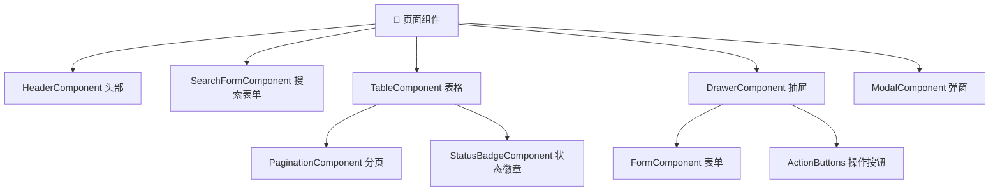

# [项目名称] - 前端交互文档

| 版本 | 日期 | 作者 | 说明 |
|------|------|------|------|
| 1.0 | YYYY-MM-DD | Your Name | 初始版本 |

---

>  **填写指南**：本文档描述前端内部的交互细节，包括组件交互、页面流转、状态管理、动画规范等。
>
>  **一页纸摘要**:
> 1. 看完这页能回答:组件怎么交互?页面怎么跳?状态怎么管?空态/异常态长什么样?
> 2. 文档定位:开发级(技术级),前端交互细节手册
> 3. 核心动作:组件交互 + 页面流转 + 状态管理 + 动画规范 + 异常/空态
> 4. 何时使用:前端开发 / 交互走查 / UI 还原
> 5. 不要用于:API 字段(→03)、业务需求(→06)
>
>  **关键引用**: `reference/12-value-matrix.md` (交互文档价值) · [`reference/13-quality-selfcheck.md`](../reference/13-quality-selfcheck.md) (交互自检) · [`reference/15-five-field-crosscheck.md`](../reference/15-five-field-crosscheck.md) (5 字段交叉)

---

## 0. 填写指南

### 0.0 本文档价值

> **回答的核心问题**：页面/组件/状态/异常/空态的交互细节是什么？
> **不回答什么**：后端逻辑（→09）、业务规则（→06）
> **价值判定**：交互设计师/前端开发拿来即可还原 UI 行为
> **所属阶段**：开发（技术级）

### 0.1 文档结构

本文档分为六大板块：

| 板块 | 内容 | 必填 |
|------|------|------|
| **组件交互** | 组件间交互、事件传递 | ✅ |
| **页面流转** | 页面跳转、路由参数、状态传递 | ✅ |
| **状态管理** | 全局状态、页面状态、数据流 | ✅ |
| **动画规范** | 过渡动画、微交互、加载状态 | ✅ |
| **表单交互** | 校验规则、提交逻辑、反馈提示 | ✅ |
| **异常处理** | 前端错误、空状态、网络异常 | ✅ |

### 0.2 核心元素符号

| 元素 | 符号 | 说明 |
|------|------|------|
| 页面 | 📄 | Page 组件 |
| 组件 |  | 可复用组件 |
| 状态 | 💾 | 状态数据 |
| 事件 | ⚡ | 用户操作/事件 |
| 动画 | 🎬 | 动画/过渡 |

---

## 1. 组件交互

⭐ **关键决策**：
- **组件层次 3 级**：页面组件（路由级）/ 容器组件（业务逻辑）/ 展示组件（纯 UI）
- **单向数据流**：父 → 子用 props，子 → 父用 callback，禁止子直接改父 state
- **状态归属 3 原则**：全局状态（Redux/Zustand）/ 页面级状态（useState）/ 组件级状态（useRef）

>  **填写要点**：描述组件之间的交互关系和事件传递。

### 1.1 组件层次结构



### 1.2 组件交互矩阵

| 触发组件 | 事件 | 响应组件 | 响应动作 |
|----------|------|----------|----------|
| SearchForm | onSearch | Table | 刷新列表数据 |
| Table | onRowClick | Drawer | 打开详情抽屉 |
| Table | onPageChange | Table | 切换分页 |
| Pagination | onChange | Table | 请求对应页数据 |
| Drawer | onSubmit | Table | 关闭并刷新 |
| Form | onValidateFail | Form | 显示校验错误 |

### 1.3 事件传递模式

#### 父子组件通信
```
props down, events up

父组件 ──props──> 子组件
  ▲                 │
  │                 │
  └───events───────┘
```

| 通信类型 | 实现方式 | 使用场景 |
|----------|----------|----------|
| 父→子 | props | 配置数据、回调函数 |
| 子→父 | 事件回调 | 用户操作、状态变化 |
| 兄弟 | 父组件中转 | 通过父组件传递 |

#### 跨级组件通信
| 方案 | 实现 | 适用场景 |
|------|------|----------|
| Context | React Context | 主题、用户信息 |
| 状态管理 | Redux/Zustand | 全局数据共享 |
| 事件总线 | EventEmitter | 低频跨组件通信 |

---

## 2. 页面流转

⭐ **关键决策**：
- **路由层级 3 档**：主路由（一级页面）/ 子路由（详情/列表）/ 弹层路由（Drawer/Modal 内容）
- **页面跳转 4 模式**：声明式（`<Link>`）/ 命令式（`navigate`）/ 弹层（不切路由）/ 替换（`replace`）
- **返回处理**：浏览器返回 + 应用内返回按钮必须一致（防"返回死循环"）
- **登录拦截**：未登录访问受保护页面 → 跳登录 + 登录后回原页面

> 📄 **填写要点**：描述页面之间的跳转关系和参数传递。

### 2.1 页面路由结构

```mermaid
flowchart LR
    Root[/首页] --> List[/list 列表页]
    Root --> Create[/create 创建页]
    Root --> Edit[/edit/:id 编辑页]
    Root --> Settings[/settings 设置页]
    List --> Detail[/list/:id 详情页]
    List -.跳转.-> Create
    Detail -.跳转.-> Edit
```

### 2.2 页面跳转流程

```
┌─────────┐    点击     ┌─────────┐    跳转     ┌─────────┐
│  列表页  │ ────────> │  详情页  │ ────────> │  编辑页  │
└─────────┘            └─────────┘            └─────────┘
     │                      │                      │
     │                      │                      │
     ▼                      ▼                      ▼
  router.push           router.push            router.push
  ?id=xxx               /edit/${id}           /list (返回)
```

### 2.3 页面间参数传递

#### URL 参数
| 场景 | 格式 | 示例 |
|------|------|------|
| 路径参数 | /:id | /edit/123 |
| 查询参数 | ?key=value | /list?status=1 |
| Hash | #section | /list#section |

#### 状态传递
| 方式 | 实现 | 适用场景 |
|------|------|----------|
| URL 状态 | query/params | 需分享链接 |
| Context | React Context | 同链路数据 |
| 状态管理 | Redux/Zustand | 全局共享 |
| 本地存储 | localStorage | 持久化数据 |

### 2.4 路由守卫

| 场景 | 检查内容 | 未通过处理 |
|------|----------|------------|
| 登录验证 | isAuthenticated | 跳转登录页 |
| 权限验证 | hasPermission | 跳转403页 |
| 角色验证 | hasRole | 跳转首页 |
| 表单未保存 | isDirty | 弹窗确认 |

---

## 3. 状态管理

> 💾 **填写要点**：描述应用状态的管理方式和数据流向。

### 3.1 状态分类

| 状态类型 | 说明 | 存储位置 | 示例 |
|----------|------|----------|------|
| **服务器状态** | 从后端获取的数据 | 状态管理库 | 用户列表、订单数据 |
| **UI 状态** | 组件内部状态 | 组件 State | 弹窗开关、选中行 |
| **URL 状态** | 路由相关状态 | URL | 当前页码、筛选条件 |
| **表单状态** | 表单输入状态 | 表单库/State | 输入值、校验错误 |
| **持久状态** | 需长期保存 | localStorage | 主题、语言偏好 |

### 3.2 数据获取策略

#### 缓存策略
| 策略 | 说明 | 实现 |
|------|------|------|
| Cache-First | 先用缓存，后请求 | SWR/React Query |
| Network-First | 先请求，后用缓存 | React Query |
| Stale-While-Revalidate | 返回旧数据，同时刷新 | SWR 默认 |

#### 加载状态
| 状态 | 触发条件 | UI 表现 |
|------|----------|----------|
| Initial | 页面首次加载 | 骨架屏/Spinner |
| Loading | 正在请求 | 骨架屏/按钮loading |
| Refreshing | 下拉刷新/上拉加载 | 刷新指示器 |
| Error | 请求失败 | 错误提示+重试 |

### 3.3 状态管理架构

```
┌─────────────────────────────────────────────────────────┐
│                      状态管理层                          │
├─────────────────────────────────────────────────────────┤
│                                                         │
│  ┌─────────────┐     ┌─────────────┐                  │
│  │   全局状态   │     │   页面状态   │                  │
│  │  (Redux等)  │     │  (useState) │                  │
│  └──────┬──────┘     └──────┬──────┘                  │
│         │                   │                          │
│         ▼                   ▼                          │
│  ┌─────────────────────────────────┐                   │
│  │         组件 Props/Context        │                   │
│  └─────────────────────────────────┘                   │
│                      │                                  │
│                      ▼                                  │
│              ┌───────────────┐                         │
│              │   UI 渲染层   │                         │
│              └───────────────┘                         │
└─────────────────────────────────────────────────────────┘
```

---

## 4. 动画规范

⭐ **关键决策**：
- **3 类动效时长**：微交互 100-200ms（如按钮反馈）/ 转场 200-400ms（如页面切换）/ 强调动效 400-800ms（如成功提示）
- **缓动函数 3 选 1**：linear（匀速，禁用）/ ease-out（减速，推荐默认）/ ease-in-out（加减速，弹层/抽屉）
- **性能红线**：60 FPS = 16.6ms/帧，超过 → 掉帧
- **可访问性**：尊重 `prefers-reduced-motion`，提供"关闭动画"开关

> 🎬 **填写要点**：描述界面动画和过渡效果的设计规范。

### 4.1 动画分类

| 类型 | 时长 | 缓动函数 | 使用场景 |
|------|------|----------|----------|
| **即时反馈** | 0-100ms | ease-out | 按钮点击、hover |
| **微交互** | 100-200ms | ease-in-out | 开关切换、选择 |
| **界面过渡** | 200-400ms | ease-in-out | 页面跳转、展开收起 |
| **状态切换** | 300-500ms | ease-out | 弹窗、抽屉 |
| **页面切换** | 400-600ms | ease-in-out | 路由切换 |

### 4.2 通用动画时长

```css
:root {
  /* 动画时长 */
  --duration-instant: 100ms;    /* 即时反馈 */
  --duration-fast: 150ms;       /* 快动画 */
  --duration-normal: 250ms;     /* 标准动画 */
  --duration-slow: 400ms;       /* 慢动画 */
  --duration-page: 500ms;       /* 页面切换 */

  /* 缓动函数 */
  --ease-default: cubic-bezier(0.4, 0, 0.2, 1);      /* 标准 */
  --ease-in: cubic-bezier(0.4, 0, 1, 1);             /* 减速 */
  --ease-out: cubic-bezier(0, 0, 0.2, 1);             /* 加速 */
  --ease-in-out: cubic-bezier(0.4, 0, 0.2, 1);      /* 头尾减速 */
  --ease-bounce: cubic-bezier(0.68, -0.55, 0.27, 1.55); /* 弹性 */
}
```

### 4.3 组件动画规范

#### 按钮点击
| 状态 | 动画 |
|------|------|
| hover | scale: 1.02, 100ms |
| active | scale: 0.98, 50ms |
| disabled | opacity: 0.5 |

#### 卡片悬浮
| 状态 | 动画 |
|------|------|
| hover | translateY(-2px), shadow增强, 150ms |

#### 弹窗/抽屉
| 元素 | 动画 |
|------|------|
| 背景遮罩 | opacity 0→0.5, 200ms |
| 内容进入 | translateY(20px)→0, opacity 0→1, 300ms |
| 关闭 | 反向播放, 200ms |

#### 列表加载
| 场景 | 动画 |
|------|------|
| 骨架屏 | shimmer动画, 1.5s循环 |
| 数据进入 | stagger动画, 每项延迟50ms |
| 空状态 | fadeIn, 300ms |

### 4.4 动画性能原则

| 原则 | 说明 |
|------|------|
| 使用 transform/opacity | 避免触发重排重绘 |
| will-change 谨慎使用 | 仅在动画前开启，结束后关闭 |
| 减少 paint 区域 | 避免动画元素层叠 |
| 优先 CSS 动画 | 简单动画用 CSS，复杂用 JS |

---

## 5. 表单交互

>  **填写要点**：描述表单的校验、提交和反馈机制。

### 5.1 表单状态

```
┌─────────────────────────────────────────────────────────┐
│                      表单生命周期                        │
├─────────────────────────────────────────────────────────┤
│                                                         │
│  初始化 ──> 用户输入 ──> 校验触发 ──> 提交验证          │
│     │          │             │             │             │
│     ▼          ▼             ▼             ▼             │
│  默认值     实时校验       错误提示    提交中/成功/失败    │
│                                                         │
└─────────────────────────────────────────────────────────┘
```

### 5.2 校验规则

| 校验类型 | 规则 | 错误提示示例 |
|----------|------|--------------|
| 必填 | value !== '' && value !== null | "请输入XXX" |
| 长度 | minLength / maxLength | "长度为X-Y个字符" |
| 格式 | pattern (手机/邮箱/身份证) | "格式不正确" |
| 范围 | min / max (数值/日期) | "数值范围为X-Y" |
| 重复 | 与其他字段对比 | "两次输入不一致" |
| 自定义 | 业务规则 | "XXX已存在" |

### 5.3 校验触发时机

| 触发时机 | 校验范围 | 使用场景 |
|----------|----------|----------|
| onChange | 当前字段 | 实时反馈 |
| onBlur | 当前字段 | 离开输入框 |
| onSubmit | 全部字段 | 提交时全面校验 |
| onValidate | 指定字段 | 特定业务场景 |

### 5.4 提交交互流程

```
用户点击提交
      │
      ▼
┌───────────┐     是     ┌────────────┐
│  表单校验  │ ────────> │ 显示错误提示 │
└─────┬─────┘           └────────────┘
      │ 否
      ▼
┌───────────┐     是     ┌────────────┐
│ 防重复提交  │ ────────> │ 按钮显示loading │
└─────┬─────┘           └────────────┘
      │ 否
      ▼
┌───────────┐
│  提交请求  │
└─────┬─────┘
      │
      ├── 成功 ──> 关闭弹窗/跳转 ──> 刷新列表
      │
      └── 失败 ──> 显示错误提示 ──> 恢复按钮
```

### 5.5 表单反馈规范

| 反馈类型 | 形式 | 时机 |
|----------|------|------|
| 成功 | Toast / 页面跳转 | 提交成功后 |
| 错误 | Inline 错误提示 | 校验失败 |
| 警告 | Inline 警告提示 | 业务规则警告 |
| 加载 | 按钮 loading | 提交中 |

---

## 6. 异常处理

> ⚠ **填写要点**：描述前端各种异常场景的处理方式。

### 6.1 异常分类

| 异常类型 | 说明 | 处理方式 |
|----------|------|----------|
| **网络异常** | 断网、请求超时 | 显示重试提示 |
| **请求错误** | 4xx/5xx 错误 | 显示错误信息 |
| **业务错误** | 后端返回的业务错误 | 显示后端message |
| **前端错误** | JS 异常、组件崩溃 | 降级显示、错误边界 |
| **权限错误** | 401/403 | 跳转登录/无权限页 |

### 6.2 空状态处理

| 场景 | 表现 | 说明 |
|------|------|------|
| **列表空** | 空状态插图 + 提示文案 + 操作按钮 | 引导用户创建 |
| **搜索无结果** | 空状态插图 + "未找到XXX" | 提示筛选条件 |
| **加载失败** | 错误插图 + 重试按钮 | 可retry |
| **未登录** | 跳转登录页 | - |

### 6.3 降级策略

| 异常场景 | 降级策略 | 备选方案 |
|----------|----------|----------|
| 组件崩溃 | Error Boundary 降级 | 显示简化版本 |
| 接口超时 | 使用缓存数据 | 显示"数据可能过期" |
| 图片加载失败 | 显示默认图 | placeholder |
| 第三方服务不可用 | 本地功能降级 | 提示服务暂不可用 |

### 6.4 异常流程图

```
用户操作
    │
    ▼
┌───────────┐
│  发送请求  │
└─────┬─────┘
      │
      ▼
┌───────────┐
│  收到响应  │
└─────┬─────┘
      │
      ├── 2xx ──> 解析数据 ──> 更新UI
      │
      ├── 4xx ──> 显示业务错误提示
      │
      ├── 401 ──> 跳转登录页
      │
      ├── 403 ──> 显示无权限提示
      │
      ├── 5xx ──> 显示服务异常提示
      │
      └── 网络错误 ──> 显示网络异常 + 重试按钮
```

---

## 7. 交互检查清单

> ✅ **填写完成后检查以下内容**

### 7.1 组件交互

| 检查项 | 状态 |
|--------|------|
| 组件层次结构已绘制 | ☐ |
| 组件交互矩阵已填写 | ☐ |
| 事件传递方式已明确 | ☐ |

### 7.2 页面流转

| 检查项 | 状态 |
|--------|------|
| 路由结构已定义 | ☐ |
| 页面跳转流程已绘制 | ☐ |
| 参数传递方式已明确 | ☐ |
| 路由守卫已定义 | ☐ |

### 7.3 状态管理

| 检查项 | 状态 |
|--------|------|
| 状态分类已完成 | ☐ |
| 数据获取策略已明确 | ☐ |
| 缓存策略已定义 | ☐ |

### 7.4 动画规范

| 检查项 | 状态 |
|--------|------|
| 动画时长已定义 | ☐ |
| 组件动画规范已填写 | ☐ |
| 动画性能原则已确认 | ☐ |

### 7.5 表单交互

| 检查项 | 状态 |
|--------|------|
| 校验规则已完整 | ☐ |
| 校验触发时机已明确 | ☐ |
| 提交流程已绘制 | ☐ |

### 7.6 异常处理

| 检查项 | 状态 |
|--------|------|
| 异常分类已完成 | ☐ |
| 空状态已定义 | ☐ |
| 降级策略已明确 | ☐ |

---

## 8. 手势交互

### 8.1 移动端手势清单

| 手势 | 触发 | 适用场景 | 阈值 |
|------|------|----------|------|
| **Tap** | 单击 | 按钮、链接 | - |
| **Long Press** | 长按 ≥ 500ms | 唤起操作菜单 | 500ms |
| **Swipe Left/Right** | 横向滑动 | 切换 Tab、删除项 | 距离 ≥ 40px |
| **Swipe Up/Down** | 纵向滑动 | 关闭弹窗、刷新 | 距离 ≥ 50px |
| **Pinch** | 双指缩放 | 图片预览、地图 | 比例 0.5-2 |
| **Double Tap** | 双击 | 点赞、放大 | 间隔 < 300ms |
| **Pan** | 拖拽 | 排序、可移动元素 | - |
| **Edge Swipe** | 边缘滑动 | 返回上一页 | 距边缘 < 20px |

### 8.2 阻尼与边界

```javascript
// 阻尼滑动（橡皮筋效果）
let startY = 0;
let currentY = 0;
const maxOffset = 80; // 最大偏移
const damping = 0.4; // 阻尼系数

function onPanMove(deltaY) {
  const offset = Math.min(Math.abs(deltaY) * damping, maxOffset);
  element.style.transform = `translateY(${deltaY > 0 ? offset : -offset}px)`;
}
```

### 8.3 滑动冲突处理

| 场景 | 优先级 | 处理 |
|------|--------|------|
| **横向滑动 vs 纵向滚动** | 横向 5px 锁定 | 早期判断方向 |
| **滑动删除 vs 滚动列表** | 边缘触发 | 距离判断 |
| **下拉刷新 vs 上滑** | Y > X 锁定 | 位移比例 |

---

## 9. 键盘可访问性

### 9.1 Tab 顺序规范

```
逻辑顺序：左 → 右 / 上 → 下
跳过装饰元素
跳过隐藏元素
跳转链接 → 主内容
跳转链接 → 主导航
```

```html
<a href="#main-content" class="skip-link">跳到主内容</a>
<main id="main-content" tabindex="-1">...</main>
```

### 9.2 快捷键设计

| 组合键 | 行为 | 场景 |
|--------|------|------|
| **Ctrl/Cmd + K** | 打开搜索 | 全局 |
| **Ctrl/Cmd + S** | 保存 | 表单 |
| **Esc** | 关闭弹窗/取消 | 全局 |
| **Enter** | 提交 | 表单 |
| **↑/↓** | 上下选择 | 列表 |
| **Space** | 翻页/多选 | 列表 |
| **?** | 显示快捷键帮助 | 全局 |

### 9.3 焦点管理

```javascript
// 模态框打开时锁定焦点
function trapFocus(container) {
  const focusable = container.querySelectorAll(
    'a, button, input, select, textarea, [tabindex]:not([tabindex="-1"])'
  );
  const first = focusable[0];
  const last = focusable[focusable.length - 1];
  
  container.addEventListener('keydown', (e) => {
    if (e.key === 'Tab') {
      if (e.shiftKey && document.activeElement === first) {
        e.preventDefault();
        last.focus();
      } else if (!e.shiftKey && document.activeElement === last) {
        e.preventDefault();
        first.focus();
      }
    }
    if (e.key === 'Escape') closeModal();
  });
  
  first.focus();
}
```

### 9.4 焦点环规范

```css
/* 自定义焦点环（避免浏览器默认丑样式） */
button:focus-visible,
a:focus-visible {
  outline: 2px solid #635BFF;
  outline-offset: 2px;
  border-radius: 2px;
}

/* 鼠标点击不显示，键盘 Tab 显示 */
button:focus:not(:focus-visible) {
  outline: none;
}
```

---

## 10. 动效库选型

### 10.1 库对比

| 库 | 体积 | 特点 | 适用 |
|----|------|------|------|
| **CSS Transition/Animation** | 0KB | 性能最优、声明式 | 简单过渡 |
| **Framer Motion** | ~50KB | 声明式 API、布局动画 | React 中等动效 |
| **GSAP** | ~70KB | 强大时间线、滚动触发 | 复杂序列 |
| **Lottie** | ~30KB + JSON | AE 导出的矢量动画 | 复杂插画动画 |
| **AutoAnimate** | ~5KB | 零代码、声明式 | 简单列表动画 |
| **Motion One** | ~10KB | Web Animations API 封装 | 轻量、高性能 |
| **React Spring** | ~30KB | 物理弹簧动画 | 弹性效果 |
| **Anime.js** | ~17KB | 轻量、通用 | 中等复杂度 |

### 10.2 选型决策树

```
是否简单状态切换？
├─ 是 → CSS Transition
└─ 否 → 是否需要布局动画？
   ├─ 是 → Framer Motion / Motion One
   └─ 否 → 是否需要时间线/序列？
      ├─ 是 → GSAP
      └─ 否 → 是否是设计师导出的复杂插画？
         ├─ 是 → Lottie
         └─ 否 → AutoAnimate / 简单 CSS
```

### 10.3 性能红线

| 动画属性 | 性能 |
|----------|------|
| **transform** (translate/scale/rotate) | ✅ GPU 加速 |
| **opacity** | ✅ GPU 加速 |
| **filter** | ⚠ 中等开销 |
| **width/height** | ❌ 触发重排 |
| **top/left** | ❌ 触发重排 |
| **background** | ❌ 触发重绘 |
| **box-shadow** | ⚠ 大面积卡顿 |

**规则**：动画只用 `transform` + `opacity`

---

## 11. 骨架屏

### 11.1 适用场景

| 场景 | 推荐 | 原因 |
|------|------|------|
| **首屏加载** | ✅ 强烈推荐 | 降低等待焦虑 |
| **列表加载** | ✅ 推荐 | 替代 spinner |
| **详情页加载** | ✅ 推荐 | 保持版位稳定 |
| **弹窗内容加载** | ⚠ 可选 | 弹窗本身可缓冲 |
| **按钮 loading** | ❌ 用 spinner | 范围小，无需骨架 |
| **图片加载** | ⚠ 模糊占位 | LQIP / 渐进式 |

### 11.2 实现方式

#### 方式 1：纯 CSS（推荐）

```css
.skeleton {
  background: linear-gradient(90deg, #f0f0f0 0%, #e0e0e0 50%, #f0f0f0 100%);
  background-size: 200% 100%;
  animation: skeleton-loading 1.5s infinite;
  border-radius: 4px;
}

@keyframes skeleton-loading {
  0% { background-position: 200% 0; }
  100% { background-position: -200% 0; }
}

.skeleton-text { height: 16px; margin: 8px 0; }
.skeleton-avatar { width: 40px; height: 40px; border-radius: 50%; }
.skeleton-button { width: 80px; height: 32px; }
```

#### 方式 2：React 组件

```jsx
<Skeleton active paragraph={{ rows: 4 }} title />
```

#### 方式 3：内容感知的智能骨架

```typescript
// 复用真实组件结构，isLoading=true 时渲染占位
<Table
  columns={columns.map(col => ({
    ...col,
    render: (val) => isLoading ? <Skeleton.Input active /> : col.render(val)
  }))}
  dataSource={isLoading ? Array(10).fill({}) : data}
/>
```

### 11.3 何时不用

- **数据 < 200ms** - 用户感知不到，避免闪烁
- **错误态** - 直接显示错误信息
- **空状态** - 显示空插画

---

## 12. 预加载策略

### 12.1 资源优先级

| 资源类型 | 优先级 | 加载方式 |
|----------|--------|----------|
| **关键 HTML/CSS** | Highest | 内联 |
| **首屏 JS** | High | preload |
| **字体** | High | preload + font-display: swap |
| **首屏图片** | High | preload (above-fold) |
| **路由级 JS** | Medium | prefetch（路由切换时） |
| **非首屏图片** | Low | lazy loading |
| **分析脚本** | Low | async / defer |

### 12.2 preload / prefetch / preconnect

```html
<!-- preload: 立即加载关键资源 -->
<link rel="preload" href="/critical.css" as="style">
<link rel="preload" href="/hero.jpg" as="image">
<link rel="preload" href="/font.woff2" as="font" crossorigin>

<!-- prefetch: 空闲时加载下一页面 -->
<link rel="prefetch" href="/next-page.js">

<!-- preconnect: 提前建立连接（DNS + TCP + TLS）-->
<link rel="preconnect" href="https://api.example.com">
<link rel="dns-prefetch" href="https://cdn.example.com">
```

### 12.3 路由级预加载

```typescript
// 鼠标悬停时预加载目标路由
<Link to="/detail" onMouseEnter={() => import('./DetailPage')}>
  查看详情
</Link>
```

### 12.4 智能预加载（视口内）

```javascript
// 视口内图片预加载
const observer = new IntersectionObserver((entries) => {
  entries.forEach(entry => {
    if (entry.isIntersecting) {
      const img = entry.target;
      img.src = img.dataset.src;
      observer.unobserve(img);
    }
  });
}, { rootMargin: '200px' }); // 提前 200px 触发

document.querySelectorAll('img[data-src]').forEach(img => observer.observe(img));
```

---

## 13. 虚拟滚动

### 13.1 库选型

| 库 | 框架 | 特点 |
|----|------|------|
| **react-virtuoso** | React | 强大、动态高度、表格/列表 |
| **react-window** | React | 轻量、基于 fixed size |
| **react-virtualized** | React | 老牌、API 复杂 |
| **@tanstack/react-virtual** | React | 现代、headless |
| **vue-virtual-scroller** | Vue | Vue 主流选择 |

### 13.2 何时用 vs 不用

| 数据量 | 推荐 |
|--------|------|
| **< 100 项** | 直接渲染 |
| **100-1000 项** | 分页 |
| **1000-10000 项** | 虚拟滚动 |
| **> 10000 项** | 虚拟滚动 + 分组 |

### 13.3 react-virtuoso 示例

```tsx
import { Virtuoso } from 'react-virtuoso';

<Virtuoso
  style={{ height: 600 }}
  data={list}
  itemContent={(index, item) => (
    <div className="list-item">{item.name}</div>
  )}
  followOutput="smooth"
/>
```

### 13.4 性能对比

| 列表长度 | 常规渲染 | 虚拟滚动 |
|----------|----------|----------|
| 100 | 16ms | 16ms |
| 1000 | 180ms | 18ms |
| 10000 | 2400ms（卡顿）| 22ms |
| 100000 | 崩溃 | 25ms |

---

## 14. 防抖与节流

### 14.1 核心区别

| 模式 | 触发 | 适用 |
|------|------|------|
| **防抖 Debounce** | 停止操作 N ms 后才执行 | 搜索输入、窗口 resize |
| **节流 Throttle** | 每 N ms 最多执行一次 | 滚动、mousemove |
| **前置节流 Leading** | 立即执行第一次 | 按钮防重复点击 |
| **后置节流 Trailing** | 操作结束后再执行一次 | 拖拽结束保存 |

### 14.2 通用实现

```typescript
// 防抖
export function debounce<T extends (...args: any[]) => any>(
  fn: T, delay: number
): T & { cancel: () => void } {
  let timer: ReturnType<typeof setTimeout> | null = null;
  const wrapped = ((...args: any[]) => {
    if (timer) clearTimeout(timer);
    timer = setTimeout(() => fn(...args), delay);
  }) as T & { cancel: () => void };
  wrapped.cancel = () => { if (timer) clearTimeout(timer); };
  return wrapped;
}

// 节流（leading + trailing）
export function throttle<T extends (...args: any[]) => any>(
  fn: T, interval: number
): T {
  let last = 0;
  let timer: ReturnType<typeof setTimeout> | null = null;
  return ((...args: any[]) => {
    const now = Date.now();
    const remaining = interval - (now - last);
    if (remaining <= 0) {
      if (timer) { clearTimeout(timer); timer = null; }
      last = now;
      fn(...args);
    } else if (!timer) {
      timer = setTimeout(() => {
        last = Date.now();
        timer = null;
        fn(...args);
      }, remaining);
    }
  }) as T;
}
```

### 14.3 典型场景与参数

| 场景 | 模式 | 延迟 |
|------|------|------|
| 搜索输入建议 | Debounce | 300ms |
| 表单提交防重复 | Leading Throttle | 1000ms |
| 滚动加载 | Throttle | 200ms |
| 窗口 resize | Debounce | 250ms |
| mousemove 跟随 | Throttle | 16ms (60fps) |
| 拖拽结束保存 | Trailing | 500ms |
| 实时校验 | Debounce | 500ms |

### 14.4 React Hook 封装

```typescript
import { useEffect, useMemo } from 'react';

export function useDebounce<T>(value: T, delay: number): T {
  const [debounced, setDebounced] = useState(value);
  useEffect(() => {
    const timer = setTimeout(() => setDebounced(value), delay);
    return () => clearTimeout(timer);
  }, [value, delay]);
  return debounced;
}

// 用法：避免每次输入都发请求
const debouncedKeyword = useDebounce(keyword, 300);
useEffect(() => {
  if (debouncedKeyword) fetchResults(debouncedKeyword);
}, [debouncedKeyword]);
```

---

## 段完成度自检（更新）

- [x] 1-7. 原基础章节完整
- [x] 8. 手势交互有规范
- [x] 9. 键盘可访问性符合 WCAG
- [x] 10. 动效库已选型
- [x] 11. 骨架屏策略明确
- [x] 12. 预加载策略分级
- [x] 13. 虚拟滚动按数据量决策
- [x] 14. 防抖/节流工具已封装

**下游依赖**：
- 04-前端开发指南.md：依赖本章 → 实际实现
- 06-PRD：依赖本章 → 交互细节落地


## 摘要(降级输出,200 字内)

> 模板定位摘要(全受众可见)。完整定义见下方各章。
> 模板定位:0.0 本文档价值

**模板说明**:`[项目名称] - 前端交互文档`

**关键数字/对象**:见完整版

**完整版见**:`10-前端交互文档.md`(主受众可访问)
