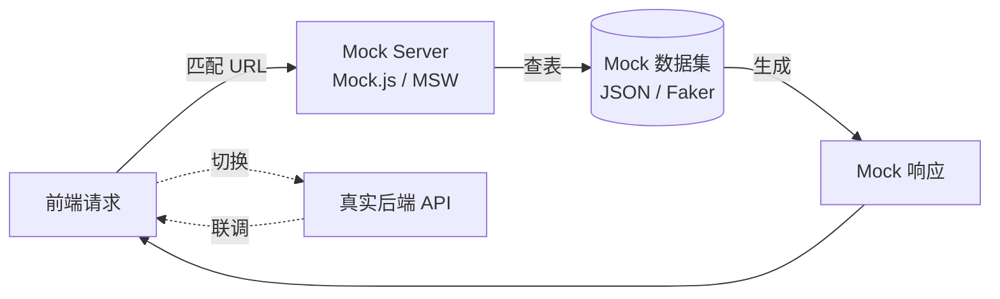

# [项目名称] - Mock数据文档

| 版本 | 日期 | 作者 | 说明 |
|------|------|------|------|
| 1.0 | YYYY-MM-DD | Your Name | 初始版本 |

---

> 📖 **填写指南**：本文档定义前端开发所需的 Mock 数据结构，确保前后端分离开发时的数据一致性。
>
> 📌 **一页纸摘要**:
> 1. 看完这页能回答:Mock 数据怎么造?接口怎么模拟?空/异常态怎么处理?
> 2. 文档定位:开发级(技术级),Mock 数据规范
> 3. 核心动作:数据结构 + 接口 Mock + 状态 Mock + Mock 工具
> 4. 何时使用:前端独立开发 / UI 演示 / 并行开发
> 5. 不要用于:API 字段(→03)、真实联调(联调阶段)
>
> 🔗 **关键引用**: `reference/12-value-matrix.md` (Mock 价值) · [`reference/13-quality-selfcheck.md`](../reference/13-quality-selfcheck.md) (Mock 自检) · [`reference/15-five-field-crosscheck.md`](../reference/15-five-field-crosscheck.md) (5 字段交叉)

---

## 0. 填写指南

### 0.0 本文档价值

> **回答的核心问题**：前端 mock 怎么搭？数据结构/接口 mock/状态 mock 是什么？
> **不回答什么**：真实联调（联调阶段）、后端实现（→09）
> **价值判定**：前端可独立开发/演示，无需等后端
> **所属阶段**：开发（技术级）

### 0.1 文档结构

本文档分为四大板块：

| 板块 | 内容 | 必填 |
|------|------|------|
| **数据结构** | 实体模型、字段定义 | ✅ |
| **接口Mock** | API响应格式、示例数据 | ✅ |
| **状态Mock** | 分页、筛选、空状态 | ✅ |
| **业务数据** | 贴近真实业务的数据 | ✅ |

### 0.2 Mock数据原则

| 原则 | 说明 |
|------|------|
| **真实性** | 数据要像真实业务场景 |
| **一致性** | 与接口文档字段一致 |
| **完整性** | 覆盖正常/异常/边界情况 |
| **可执行** | 可直接复制到代码中使用 |

### 0.3 Mock 数据流转



---

## 1. 数据结构

⭐ **关键决策**：
- **Mock 数据 3 原则**：真实性（接近生产格式，类型/嵌套一致）/ 多样性（覆盖正常/边界/异常）/ 一致性（同一字段在不同接口值要一致）
- **字段类型严格匹配**：与 03-接口文档 + 12-数据库设计 5 字段交叉一致（userId/status/必填/错误码/P0 名）
- **Faker.js vs 静态 JSON**：动态数据用 Faker（UUID/手机号/时间），固定数据用静态 JSON（如状态枚举）
- **避免过度 Mock**：仅 Mock 必要字段，其他字段让后端兜底（防止 Mock 与生产偏离）

> 📦 **填写要点**：定义每个业务实体的数据结构。

### 1.1 实体模型

| 实体名 | 说明 | 主键 |
|--------|------|------|
| User | 用户信息 | id |
| Order | 订单信息 | id |
| Product | 产品信息 | id |

### 1.2 字段类型定义

| 类型 | 格式 | 示例 |
|------|------|------|
| id | number | 1 |
| uuid | string | "550e8400-e29b-41d4-a716-446655440000" |
| name | string | "张三" |
| phone | string | "138****1234" |
| email | string | "zhangsan@example.com" |
| status | enum | 1 |
| amount | decimal | 199.00 |
| createdAt | datetime | "2024-01-01T12:00:00Z" |
| updatedAt | datetime | "2024-01-01T12:00:00Z" |
| deletedAt | datetime | null |

### 1.3 状态枚举

| 状态字段 | 枚举值 | 说明 |
|----------|--------|------|
| status | 1 | 正常/启用 |
| status | 0 | 禁用/停用 |
| status | -1 | 删除/注销 |
| orderStatus | 0 | 待支付 |
| orderStatus | 1 | 已支付 |
| orderStatus | 2 | 已取消 |
| orderStatus | 3 | 已退款 |

---

## 2. 接口Mock

> 📡 **填写要点**：定义每个接口的 Mock 响应格式和示例数据。

### 2.1 列表接口

**接口**: GET /api/v1/{module}/list

**Mock响应**:
```json
{
  "code": 200,
  "message": "success",
  "requestId": "mock-request-id-001",
  "timestamp": 1706745600000,
  "data": {
    "list": [
      {
        "id": 1,
        "name": "业务数据A",
        "status": 1,
        "createdAt": "2024-01-15T10:30:00Z"
      },
      {
        "id": 2,
        "name": "业务数据B",
        "status": 1,
        "createdAt": "2024-01-14T09:20:00Z"
      }
    ],
    "pagination": {
      "page": 1,
      "pageSize": 10,
      "total": 52,
      "totalPages": 6
    }
  }
}
```

### 2.2 详情接口

**接口**: GET /api/v1/{module}/detail/{id}

**Mock响应**:
```json
{
  "code": 200,
  "message": "success",
  "data": {
    "id": 1,
    "name": "业务数据A",
    "code": "CODE001",
    "status": 1,
    "description": "这是一条详细的业务数据描述",
    "config": {
      "enabled": true,
      "maxCount": 100
    },
    "createdBy": "admin",
    "createdAt": "2024-01-15T10:30:00Z",
    "updatedBy": "admin",
    "updatedAt": "2024-01-15T10:30:00Z"
  }
}
```

### 2.3 创建接口

**接口**: POST /api/v1/{module}/create

**Mock请求**:
```json
{
  "name": "新数据",
  "code": "NEW001",
  "description": "描述内容"
}
```

**Mock响应**:
```json
{
  "code": 200,
  "message": "创建成功",
  "data": {
    "id": 100
  }
}
```

### 2.4 更新接口

**接口**: PUT /api/v1/{module}/update/{id}

**Mock请求**:
```json
{
  "name": "更新后的名称",
  "description": "更新后的描述"
}
```

**Mock响应**:
```json
{
  "code": 200,
  "message": "更新成功"
}
```

### 2.5 删除接口

**接口**: DELETE /api/v1/{module}/delete/{id}

**Mock响应**:
```json
{
  "code": 200,
  "message": "删除成功"
}
```

---

## 3. 分页与筛选

> 🔍 **填写要点**：定义分页和筛选场景的 Mock 数据。

### 3.1 分页Mock

| 页码 | 数据量 | 说明 |
|------|--------|------|
| 第1页 | 10条 | 首页数据 |
| 中间页 | 10条 | 中间数据 |
| 最后一页 | 2条 | 不足10条的尾页 |
| 空列表 | 0条 | 无数据 |

**第1页Mock**:
```json
{
  "data": {
    "list": [/* 10条数据 */],
    "pagination": {
      "page": 1,
      "pageSize": 10,
      "total": 52,
      "totalPages": 6
    }
  }
}
```

**空列表Mock**:
```json
{
  "data": {
    "list": [],
    "pagination": {
      "page": 1,
      "pageSize": 10,
      "total": 0,
      "totalPages": 0
    }
  }
}
```

### 3.2 筛选Mock

| 筛选条件 | 结果数量 | 说明 |
|----------|----------|------|
| 全部 | 52条 | 不筛选 |
| 状态=正常 | 45条 | 筛选启用 |
| 状态=禁用 | 7条 | 筛选禁用 |
| 名称关键字 | 12条 | 搜索结果 |
| 日期范围 | 20条 | 时间筛选 |

**搜索结果Mock**:
```json
{
  "data": {
    "list": [/* 匹配的数据 */],
    "pagination": {
      "page": 1,
      "pageSize": 10,
      "total": 12,
      "totalPages": 2
    }
  }
}
```

---

## 4. 异常Mock

⭐ **关键决策**：
- **异常 Mock 必含 5 类**：网络异常（timeout/断网）/ 业务异常（4xx 错误码）/ 系统异常（5xx）/ 参数异常（参数校验失败）/ 权限异常（401/403）
- **错误码严格对齐**：与 03-接口文档 错误码体系一致（4 位数字 = 域 + 类型）
- **可重复触发**：通过 URL 参数 `?mockError=4001` 触发特定错误，**禁止改代码触发**
- **错误响应统一结构**：`{ code, message, data, traceId }`，traceId 用于排查

> ⚠️ **填写要点**：定义各种异常场景的 Mock 响应。

### 4.1 错误码定义

| code | message | 说明 |
|------|---------|------|
| 200 | success | 成功 |
| 400 | 参数错误 | 参数校验失败 |
| 401 | 请先登录 | 未登录 |
| 403 | 无权限访问 | 权限不足 |
| 404 | 数据不存在 | 资源不存在 |
| 500 | 系统异常 | 服务器错误 |

### 4.2 异常响应Mock

**参数错误 (400)**:
```json
{
  "code": 400,
  "message": "参数错误：名称不能为空",
  "data": null
}
```

**未登录 (401)**:
```json
{
  "code": 401,
  "message": "请先登录",
  "data": null
}
```

**无权限 (403)**:
```json
{
  "code": 403,
  "message": "无权限访问该资源",
  "data": null
}
```

**数据不存在 (404)**:
```json
{
  "code": 404,
  "message": "数据不存在",
  "data": null
}
```

**服务器错误 (500)**:
```json
{
  "code": 500,
  "message": "系统异常，请稍后重试",
  "data": null
}
```

### 4.3 业务异常Mock

```json
{
  "code": 400,
  "message": "该名称已存在，请更换",
  "data": null
}
```

---

## 5. 业务数据Mock

> 🎯 **填写要点**：提供贴近真实业务场景的 Mock 数据示例。

### 5.1 用户数据

```json
{
  "id": 1,
  "name": "李明",
  "phone": "138****5678",
  "email": "liming@company.com",
  "department": "技术部",
  "role": "管理员",
  "status": 1,
  "avatar": "https://api.dicebear.com/7.x/avataaars/svg?seed=LiMing",
  "createdAt": "2024-01-10T08:00:00Z"
}
```

### 5.2 订单数据

```json
{
  "id": 1001,
  "orderNo": "ORD202401150001",
  "customerName": "王五公司",
  "customerPhone": "139****8765",
  "productName": "企业版年度套餐",
  "amount": 19999.00,
  "status": 1,
  "payTime": "2024-01-15T14:30:00Z",
  "createdAt": "2024-01-15T14:00:00Z"
}
```

### 5.3 产品数据

```json
{
  "id": 101,
  "name": "专业版套餐",
  "code": "PROFESSIONAL",
  "price": 2999.00,
  "period": "year",
  "features": [
    "基础功能",
    "高级分析",
    "API接口",
    "专属客服"
  ],
  "status": 1,
  "stock": 999,
  "createdAt": "2024-01-01T00:00:00Z"
}
```

### 5.4 通知消息数据

```json
{
  "id": 1,
  "type": 1,
  "title": "订单已支付",
  "content": "您的订单 ORD202401150001 已支付成功",
  "isRead": false,
  "createdAt": "2024-01-15T14:35:00Z"
}
```

---

## 6. 状态数据Mock

> 💾 **填写要点**：定义各种状态的 Mock 数据。

### 6.1 下拉选项

```json
{
  "statusOptions": [
    { "value": 1, "label": "正常" },
    { "value": 0, "label": "禁用" }
  ],
  "orderStatusOptions": [
    { "value": 0, "label": "待支付" },
    { "value": 1, "label": "已支付" },
    { "value": 2, "label": "已取消" },
    { "value": 3, "label": "已退款" }
  ],
  "typeOptions": [
    { "value": 1, "label": "类型A" },
    { "value": 2, "label": "类型B" },
    { "value": 3, "label": "类型C" }
  ]
}
```

### 6.2 统计数据

```json
{
  "todayStats": {
    "orderCount": 156,
    "orderAmount": 258690.00,
    "newUsers": 42,
    "activeUsers": 1280
  }
}
```

### 6.3 趋势数据

```json
{
  "trendData": [
    { "date": "2024-01-10", "value": 120 },
    { "date": "2024-01-11", "value": 135 },
    { "date": "2024-01-12", "value": 128 },
    { "date": "2024-01-13", "value": 142 },
    { "date": "2024-01-14", "value": 156 },
    { "date": "2024-01-15", "value": 168 }
  ]
}
```

---

## 7. Mock数据代码示例

> 💻 **填写要点**：提供可直接使用的代码示例。

### 7.1 JavaScript/TypeScript Mock

```javascript
// mock/data.js
export const mockListData = {
  code: 200,
  message: 'success',
  data: {
    list: [
      {
        id: 1,
        name: '业务数据A',
        status: 1,
        createdAt: '2024-01-15T10:30:00Z'
      }
    ],
    pagination: {
      page: 1,
      pageSize: 10,
      total: 52,
      totalPages: 6
    }
  }
};

export const mockDetailData = {
  code: 200,
  message: 'success',
  data: {
    id: 1,
    name: '业务数据A',
    code: 'CODE001',
    status: 1,
    description: '这是一条详细的业务数据描述'
  }
};
```

### 7.2 Mock Service

```javascript
// mock/service.js
import { mockListData, mockDetailData } from './data';

export const mockService = {
  getList: (params) => {
    return new Promise((resolve) => {
      setTimeout(() => {
        resolve(mockListData);
      }, 300);
    });
  },

  getDetail: (id) => {
    return new Promise((resolve, reject) => {
      setTimeout(() => {
        if (id) {
          resolve(mockDetailData);
        } else {
          reject({ code: 404, message: '数据不存在' });
        }
      }, 300);
    });
  },

  create: (data) => {
    return new Promise((resolve) => {
      setTimeout(() => {
        resolve({ code: 200, message: '创建成功', data: { id: Date.now() } });
      }, 300);
    });
  },

  update: (id, data) => {
    return new Promise((resolve) => {
      setTimeout(() => {
        resolve({ code: 200, message: '更新成功' });
      }, 300);
    });
  },

  delete: (id) => {
    return new Promise((resolve) => {
      setTimeout(() => {
        resolve({ code: 200, message: '删除成功' });
      }, 300);
    });
  }
};
```

---

## 8. Mock检查清单

> ✅ **填写完成后检查以下内容**

### 8.1 数据完整性

| 检查项 | 状态 |
|--------|------|
| 实体模型已定义 | ☐ |
| 字段类型已明确 | ☐ |
| 状态枚举已定义 | ☐ |

### 8.2 接口Mock

| 检查项 | 状态 |
|--------|------|
| 列表接口Mock完整 | ☐ |
| 详情接口Mock完整 | ☐ |
| 创建接口Mock完整 | ☐ |
| 更新接口Mock完整 | ☐ |
| 删除接口Mock完整 | ☐ |

### 8.3 边界情况

| 检查项 | 状态 |
|--------|------|
| 分页Mock完整 | ☐ |
| 空列表Mock | ☐ |
| 筛选Mock | ☐ |
| 异常Mock | ☐ |

### 8.4 代码可用性

| 检查项 | 状态 |
|--------|------|
| Mock数据可直接复制使用 | ☐ |
| Mock Service可直接使用 | ☐ |
| 业务数据贴近真实场景 | ☐ |

---

*本文档用于前端Mock数据配置和开发参考。*

---

## 12. Mock 工具链对比

> 🎯 **核心目标**：选择适合团队与项目的 Mock 工具链，覆盖开发、联调、测试全场景。

### 12.1 Mock 工具全景

| 工具 | 类型 | 语言 | 拦截层 | 优势 | 适用 |
|------|------|------|--------|------|------|
| **Mock.js** | 数据生成 | JS | 前端 | 老牌、字段随机化强 | 简单前端 mock |
| **MSW（Mock Service Worker）** | 拦截 | JS/TS | Service Worker | 现代、TypeScript 友好 | 前端首选 |
| **json-server** | 假后端 | Node | HTTP | 零代码、CRUD 开箱即用 | 快速 demo |
| **Apifox** | 一体化平台 | - | HTTP | 接口文档+Mock+测试一体 | 全流程 |
| **YApi** | 接口管理 | Node | HTTP | 开源、Mock 强 | 国内团队 |
| **Swagger Mock** | 文档联动 | 多语言 | HTTP | 从 OpenAPI 自动生成 | 与文档同步 |
| **Postman Mock** | SaaS | - | HTTP | 团队协作 | 海外 |
| **Pact** | 契约测试 | 多语言 | HTTP | 消费者驱动 | 契约测试 |
| **WireMock** | 服务端 | Java | HTTP | 强大场景、录制回放 | 后端测试 |
| **Prism** | OpenAPI | Node | HTTP | 标准化、自动生成 | OpenAPI 体系 |
| **Mountebank** | 通用 | Node | 多协议 | 支持 TCP/HTTP/SMTP | 复杂集成 |
| **Hoverfly** | 服务端 | Go | HTTP/gRPC | 轻量、录制回放 | 微服务测试 |

### 12.2 选型决策树

```
项目阶段？
├── 原型/Demo
│   ├── json-server（最快）
│   └── Apifox（一键 Mock）
│
├── 前端开发（前后端并行）
│   ├── 现代栈 → MSW
│   ├── 老项目 → Mock.js
│   └── 接口已定 → Swagger Mock / Prism
│
├── 联调/测试
│   ├── 接口文档统一 → Apifox / YApi
│   ├── 契约测试 → Pact
│   └── 复杂场景 → WireMock / Mountebank
│
└── 长期
    ├── 一体化平台 → Apifox（推荐）
    ├── 自建平台 → YApi（开源）
    └── 国际化 → Postman / Stoplight
```

### 12.3 MSW 完整示例（推荐现代前端）

```typescript
// mocks/handlers.ts
import { http, HttpResponse } from 'msw';
import { db } from './db';

export const handlers = [
  // 列表查询
  http.get('/api/v1/orders/list', async ({ request }) => {
    const url = new URL(request.url);
    const page = Number(url.searchParams.get('page') || 1);
    const pageSize = Number(url.searchParams.get('pageSize') || 10);
    const status = url.searchParams.get('status');

    let orders = db.orders.getAll();
    if (status) orders = orders.filter(o => String(o.status) === status);

    return HttpResponse.json({
      code: 200,
      message: 'success',
      data: {
        list: orders.slice((page - 1) * pageSize, page * pageSize),
        pagination: { page, pageSize, total: orders.length, totalPages: Math.ceil(orders.length / pageSize) }
      }
    });
  }),

  // 创建
  http.post('/api/v1/orders/create', async ({ request }) => {
    const body = await request.json();
    const newOrder = db.orders.create({ ...body, id: Date.now() });
    return HttpResponse.json({ code: 200, message: '创建成功', data: { id: newOrder.id } });
  }),

  // 错误模拟
  http.get('/api/v1/orders/error', () => {
    return HttpResponse.json(
      { code: 500, message: '服务器错误', data: null },
      { status: 500 }
    );
  }),

  // 慢响应
  http.get('/api/v1/orders/slow', async () => {
    await delay(3000);
    return HttpResponse.json({ code: 200, data: [] });
  }),
];
```

```typescript
// mocks/browser.ts
import { setupWorker } from 'msw/browser';
import { handlers } from './handlers';
export const worker = setupWorker(...handlers);
```

```typescript
// main.tsx（开发环境启动）
if (import.meta.env.DEV) {
  const { worker } = await import('./mocks/browser');
  await worker.start();
}
```

### 12.4 Apifox 一体化工作流

```
接口设计（OpenAPI）
   ├── 字段类型
   ├── Mock 规则
   ├── 错误码
   └── 示例
       ↓ 自动生成
   ├── 前端 Mock（无需手写代码）
   ├── 后端 Mock（自建服务）
   ├── 自动化测试
   └── 文档站点
```

### 12.5 工具链清单

| 检查项 | 状态 |
|--------|------|
| Mock 工具已选型 | ☐ |
| 前端开发 Mock 已就绪 | ☐ |
| 接口变更可自动同步 | ☐ |
| Mock 团队协作已规范 | ☐ |
| 集成测试已考虑 | ☐ |

---

## 13. 数据生成策略

> 🎯 **核心目标**：让 Mock 数据**像真实业务**，不是 `test1 test2 test3`。

### 13.1 Faker.js 随机化

```javascript
import { faker } from '@faker-js/faker/locale/zh_CN';

function generateUser() {
  return {
    id: faker.number.int({ min: 1, max: 1000000 }),
    uuid: faker.string.uuid(),
    name: faker.person.fullName(),                  // 张三、李四
    phone: faker.phone.number({ style: 'national' }), // 138xxxx1234
    email: faker.internet.email(),
    avatar: faker.image.avatar(),
    address: faker.location.streetAddress(),         // 北京市朝阳区...
    company: faker.company.name(),
    birthday: faker.date.birthdate({ min: 18, max: 60, mode: 'age' }),
    createdAt: faker.date.past({ years: 1 }).toISOString(),
    status: faker.helpers.arrayElement([0, 1, 1, 1, 1]),  // 80% 正常
  };
}

// 批量生成
const users = faker.helpers.multiple(generateUser, { count: 100 });
```

### 13.2 常用 Faker 数据类型

| 类别 | Faker API | 示例 |
|------|-----------|------|
| 人名 | `faker.person.fullName()` | 张三、李四 |
| 邮箱 | `faker.internet.email()` | zhang.san@example.com |
| 手机 | `faker.phone.number()` | 13812345678 |
| 身份证 | `faker.string.alphanumeric(18)` | 110101199001011234 |
| 地址 | `faker.location.streetAddress()` | 北京市朝阳区xx路 |
| 公司 | `faker.company.name()` | 阿里巴巴 |
| URL | `faker.internet.url()` | https://example.com |
| IP | `faker.internet.ipv4()` | 192.168.1.1 |
| UUID | `faker.string.uuid()` | 550e8400-... |
| 日期 | `faker.date.past()` | 2024-01-15T10:30:00Z |
| 金额 | `faker.number.float({ min: 1, max: 10000, fractionDigits: 2 })` | 199.99 |
| 图片 | `faker.image.url()` | https://... |
| 颜色 | `faker.internet.color()` | red |
| 头像 | `faker.image.avatar()` | https://i.pravatar.cc/... |

### 13.3 模板与字典驱动

**字典模板**（保证数据真实感）：
```javascript
const dictionaries = {
  department: ['技术部', '产品部', '运营部', '市场部', '财务部', 'HR部', '客服部'],
  productName: ['企业版套餐', '专业版', '旗舰版', '基础版', '个人版'],
  orderStatus: [
    { value: 0, label: '待支付' },
    { value: 1, label: '已支付' },
    { value: 2, label: '已取消' },
    { value: 3, label: '已退款' }
  ],
  paymentMethod: ['支付宝', '微信支付', '银行卡', '余额', 'PayPal'],
  city: ['北京', '上海', '广州', '深圳', '杭州', '成都', '武汉', '南京'],
};

function pickRandom(arr) {
  return arr[Math.floor(Math.random() * arr.length)];
}
```

### 13.4 字段生成规则

| 字段 | 规则 | 示例 |
|------|------|------|
| 编号 | `PREFIX + yyyyMMdd + 6位序号` | `ORD202401150001` |
| 手机号 | `1[3-9]\d{9}` | 13812345678 |
| 邮箱 | `[name]@[domain.com]` | zhangsan@company.com |
| 金额 | `random(1, 10000).toFixed(2)` | 199.99 |
| 头像 | `https://i.pravatar.cc/150?u={id}` | - |
| 时间 | `now - random(0, 30) day` | 2024-01-15 |
| 状态 | 加权随机（80% 正常，15% 禁用，5% 删除） | 1 / 0 / -1 |

### 13.5 数据生成清单

| 检查项 | 状态 |
|--------|------|
| Faker 库已引入 | ☐ |
| 字典模板已沉淀（业务相关） | ☐ |
| 数据分布合理（非全随机） | ☐ |
| 时间格式统一 ISO 8601 | ☐ |
| 金额精度统一（2 位小数） | ☐ |
| 手机/邮箱正则校验通过 | ☐ |

---

## 14. 关联数据生成

> 🎯 **核心目标**：外键、一对多、嵌套数据自动联动，模拟真实业务关联。

### 14.1 外键关联

**问题**：生成订单时，user_id 必须是真实存在的用户 ID。

**方案**：
```javascript
// 1. 先生成用户池
const users = Array.from({ length: 50 }, () => generateUser());
const userIds = users.map(u => u.id);

// 2. 订单关联
function generateOrder() {
  const user = faker.helpers.arrayElement(users);
  return {
    id: faker.number.int({ min: 1, max: 1000000 }),
    userId: user.id,
    userName: user.name,  // 冗余
    orderNo: `ORD${Date.now()}${faker.string.numeric(4)}`,
    amount: faker.number.float({ min: 1, max: 10000, fractionDigits: 2 }),
    status: faker.helpers.arrayElement([0, 1, 2, 3, 3, 3]),  // 50% 已退款
    createdAt: faker.date.recent({ days: 30 }).toISOString(),
  };
}
```

### 14.2 一对多（Order → OrderItems）

```javascript
function generateOrderWithItems() {
  const order = generateOrder();
  const itemCount = faker.number.int({ min: 1, max: 5 });
  order.items = Array.from({ length: itemCount }, () => ({
    id: faker.number.int(),
    productId: faker.number.int({ min: 100, max: 999 }),
    productName: faker.helpers.arrayElement(dictionaries.productName),
    price: faker.number.float({ min: 10, max: 1000, fractionDigits: 2 }),
    quantity: faker.number.int({ min: 1, max: 10 }),
    subtotal: 0, // 计算后填
  }));
  // 重新计算
  order.amount = order.items.reduce((sum, item) => {
    item.subtotal = +(item.price * item.quantity).toFixed(2);
    return sum + item.subtotal;
  }, 0);
  return order;
}
```

### 14.3 多层嵌套（评论 + 回复 + 点赞）

```javascript
function generateCommentTree(depth = 0) {
  if (depth > 2) return null;  // 最大 3 层
  const replyCount = faker.number.int({ min: 0, max: 5 });
  return {
    id: faker.number.int(),
    userId: faker.helpers.arrayElement(userIds),
    userName: faker.person.fullName(),
    content: faker.lorem.paragraph(),
    likes: faker.number.int({ min: 0, max: 500 }),
    createdAt: faker.date.recent().toISOString(),
    replies: replyCount > 0
      ? Array.from({ length: replyCount }, () => generateCommentTree(depth + 1)).filter(Boolean)
      : []
  };
}
```

### 14.4 主从表一致性规则

| 规则 | 说明 |
|------|------|
| 外键必存在 | 引用 ID 必须在主表数据池中 |
| 冗余字段一致 | 订单冗余的 userName 必须是该 user 的真实 name |
| 时间合理 | 订单 createdAt > 用户 createdAt |
| 状态机一致 | 已退款订单不能再次支付（详见 §15） |
| 计算字段 | amount = sum(items.subtotal) |

### 14.5 关联数据清单

| 检查项 | 状态 |
|--------|------|
| 数据池分层（主表/从表） | ☐ |
| 外键引用真实存在 | ☐ |
| 冗余字段与主表一致 | ☐ |
| 嵌套层级受控 | ☐ |
| 计算字段公式正确 | ☐ |

---

## 15. 状态机数据

> 🎯 **核心目标**：模拟业务状态流转（订单、工单、审批等）。

### 15.1 订单状态机

```
待支付(0) ─支付→ 已支付(1) ─发货→ 已发货(2) ─收货→ 已完成(3)
   │           │              │
   │           ↓ 申请退款     ↓ 申请退款
   ↓ 取消    退款中(4)       退款中(4)
已取消(-1)      ↓
                ↓ 退款完成
              已退款(5)
```

**状态机规则**：
- `待支付 → 已支付/已取消`（超时自动取消）
- `已支付 → 已发货 → 已完成/退款中`
- `已退款 → 已完成`（终态）
- 不可跳级（已支付不能直接到已收货）

### 15.2 状态机 Mock 生成

```javascript
const ORDER_STATE_FLOW = {
  0: { next: [1, -1], weight: [0.7, 0.3] },           // 待支付 70% 支付 / 30% 取消
  1: { next: [2, 4], weight: [0.85, 0.15] },          // 已支付 85% 发货 / 15% 退款
  2: { next: [3, 4], weight: [0.9, 0.1] },           // 已发货 90% 收货 / 10% 退款
  3: { next: [], weight: [] },                        // 已完成（终态）
  4: { next: [5, 3], weight: [0.7, 0.3] },            // 退款中 70% 退款成功 / 30% 取消
  5: { next: [], weight: [] },                        // 已退款（终态）
  '-1': { next: [], weight: [] },                     // 已取消（终态）
};

function generateOrderStateMachine(startState = 0) {
  const states = [];
  let current = startState;
  const time = faker.date.recent({ days: 30 });
  states.push({ status: current, time: time.toISOString() });
  while (ORDER_STATE_FLOW[current]?.next?.length > 0) {
    const { next, weight } = ORDER_STATE_FLOW[current];
    current = faker.helpers.weightedArrayElement(
      next.map((s, i) => ({ weight: weight[i], value: s }))
    );
    states.push({ status: current, time: faker.date.soon({ days: 7 }).toISOString() });
    if (states.length > 10) break;  // 防死循环
  }
  return { finalStatus: current, history: states };
}
```

### 15.3 状态分布控制

| 业务 | 状态分布 | 说明 |
|------|----------|------|
| 订单 | 待支付 20% / 已支付 50% / 已完成 25% / 退款 5% | 实际业务比例 |
| 工单 | 待处理 30% / 处理中 40% / 已完成 25% / 已关闭 5% | 客服场景 |
| 审批 | 待审批 20% / 已通过 60% / 已拒绝 15% / 已撤回 5% | OA 场景 |
| 文章 | 草稿 10% / 待审核 15% / 已发布 70% / 已下架 5% | CMS |

### 15.4 状态机清单

| 检查项 | 状态 |
|--------|------|
| 状态流转图已绘制 | ☐ |
| 状态分布符合业务实际 | ☐ |
| 终态正确（不再流转） | ☐ |
| 状态历史时间戳合理 | ☐ |
| 非法流转已禁止 | ☐ |

---

## 16. 边界与异常数据

> 🎯 **核心目标**：覆盖**极端场景**，让前端能正确处理任何输入。

### 16.1 长度边界

| 字段 | 边界 | Mock 示例 |
|------|------|----------|
| 名称 | 最小（1 字符） | `"a"` |
| 名称 | 最大（50 字符） | `faker.string.alpha(50)` |
| 描述 | 极长（5000 字符） | `faker.lorem.paragraphs(20)` |
| 列表 | 空数组 | `[]` |
| 列表 | 单元素 | `[item]` |
| 列表 | 大量（1000+） | `Array(1000)` |
| 分页 | 第一页 | `{ page: 1 }` |
| 分页 | 末页（不足 pageSize） | `{ page: 6, list: 2条 }` |
| 分页 | 越界（page 999） | `{ list: [] }` |
| 分页 | 巨大页码（1000000） | `{ list: [], total: 100 }` |

### 16.2 特殊字符

| 类型 | 示例 | 测试点 |
|------|------|--------|
| 中文 | 张三、李四、𠮷 | UTF-8 编码 |
| 表情 | 😀🎉❤️ | 4 字节 emoji |
| 多语言 | Ñoño, café, 北京 | i18n |
| HTML 标签 | `<script>alert('xss')</script>` | XSS 防护 |
| SQL 注入 | `'; DROP TABLE users--` | 注入防护 |
| Markdown | `**bold** _italic_ [link](url)` | 渲染 |
| 多行文本 | `line1\nline2\nline3` | 换行 |
| 特殊符号 | `< > & " ' \ /` | 转义 |
| 不可见字符 | `​‎` | 零宽字符 |
| Emoji + 中文 | `订单已支付🎉` | 编码 |

```javascript
const EDGE_CASES = {
  xssStrings: ['<script>alert(1)</script>', '">'],
  sqlInjection: ["'; DROP TABLE users--", "' OR '1'='1"],
  veryLongString: 'a'.repeat(10000),
  emptyValues: [null, undefined, '', [], {}],
  negativeNumbers: -1, -999999, -0.001,
  overflowNumbers: Number.MAX_SAFE_INTEGER, Number.MIN_SAFE_INTEGER,
  emojis: '😀🎉💰🔥',
  specialChars: '< > & " \' \\ /',
  unicode: '​‎‮',  // 控制字符
  multiline: 'line1\nline2\nline3',
};
```

### 16.3 数值边界

| 字段 | 边界 | Mock |
|------|------|------|
| 金额 | 0 | `0.00` |
| 金额 | 负数（异常） | `-100.00` |
| 金额 | 极小 | `0.01` |
| 金额 | 极大 | `99999999.99` |
| 数量 | 0 | `0` |
| 数量 | 负数 | `-5` |
| 百分比 | 0% | `0` |
| 百分比 | 100% | `100` |
| 百分比 | 越界 | `150` |

### 16.4 时间边界

| 场景 | Mock |
|------|------|
| 当前时刻 | `new Date().toISOString()` |
| 昨天 | `Date.now() - 86400000` |
| 一年前 | `Date.now() - 365*86400000` |
| 未来时间（异常） | `Date.now() + 86400000` |
| 1970-01-01 | 远古时间 |
| 2099-12-31 | 远未来 |
| 跨年 | `2023-12-31T23:59:59 → 2024-01-01T00:00:01` |
| 跨时区 | UTC / +08:00 / -05:00 混合 |

### 16.5 网络/响应异常

| 异常 | Mock 方式 |
|------|-----------|
| 404 资源不存在 | `HttpResponse(null, { status: 404 })` |
| 500 服务器错误 | `HttpResponse({ code: 500 }, { status: 500 })` |
| 网络超时 | 故意 sleep 30s（`await delay(30000)`） |
| 网络断开 | `throw new Error('Network Error')` |
| 503 服务不可用 | `HttpResponse(null, { status: 503 })` |
| 空响应 | `HttpResponse(null)` |
| 非 JSON | 返回 HTML/纯文本 |
| 字段缺失 | 响应中删除某字段 |
| 字段多余 | 响应中多一个未定义字段 |
| 字段类型错 | 数字字段返回字符串 |

### 16.6 边界数据清单

| 检查项 | 状态 |
|--------|------|
| 长度边界（min/max/空/超大）已覆盖 | ☐ |
| 特殊字符（XSS/SQL/emoji）已覆盖 | ☐ |
| 数值边界（0/负/极值）已覆盖 | ☐ |
| 时间边界（远古/未来/跨时区）已覆盖 | ☐ |
| 异常响应（404/500/超时）已覆盖 | ☐ |
| 字段缺失/多余/类型错已覆盖 | ☐ |

---

## 17. 性能场景数据

> 🎯 **核心目标**：为性能压测、前端极限场景提供**海量 Mock**。

### 17.1 数据量级

| 场景 | 数据量 | 用途 |
|------|--------|------|
| 小型 | 100 ~ 1000 | 单元测试、组件测试 |
| 中型 | 1万 ~ 10万 | 接口测试、UI 测试 |
| 大型 | 100万+ | 性能压测、列表分页 |
| 超大 | 1000万+ | 数据库性能测试、虚拟滚动 |

### 17.2 千万级生成（性能优化）

```javascript
// ❌ 慢：循环 100 万次直接 push
const data = [];
for (let i = 0; i < 1000000; i++) {
  data.push(generateUser());  // 慢，OOM
}

// ✅ 优化 1：预先分配
const data = new Array(1000000);
for (let i = 0; i < 1000000; i++) {
  data[i] = generateUser();
}

// ✅ 优化 2：流式生成（生成器）
function* generateUsers(count) {
  for (let i = 0; i < count; i++) yield generateUser();
}

// ✅ 优化 3：Worker 多线程（Web Worker）
const worker = new Worker('/mock-worker.js');
worker.postMessage({ type: 'generate', count: 1000000 });
worker.onmessage = (e) => console.log('Generated:', e.data.length);
```

### 17.3 列表性能测试场景

| 场景 | 数据量 | 验证目标 |
|------|--------|----------|
| 短列表 | 10 | 普通渲染 |
| 中等列表 | 100 | 渲染性能 |
| 长列表 | 10000 | **虚拟滚动**必要性 |
| 巨型列表 | 100000+ | 必用虚拟滚动 |
| 树形（5层） | 10000 节点 | 树组件性能 |
| 表格 | 100 列 × 1万行 | 表格性能 |

### 17.4 查询性能压测

```javascript
// 模拟慢查询
http.get('/api/v1/orders/list', async ({ request }) => {
  const url = new URL(request.url);
  const page = Number(url.searchParams.get('page') || 1);
  const pageSize = Number(url.searchParams.get('pageSize') || 10);

  // 模拟：第 100 页返回 2 秒
  if (page === 100) await delay(2000);
  // 模拟：第 1000 页返回 5 秒
  if (page === 1000) await delay(5000);
  // 模拟：第 10000 页超时
  if (page === 10000) {
    return HttpResponse.json({ code: 408, message: '请求超时' }, { status: 408 });
  }
  // 正常
  return HttpResponse.json({ code: 200, data: { list: [...], pagination: {...} } });
});
```

### 17.5 性能场景清单

| 检查项 | 状态 |
|--------|------|
| 千万级数据可生成 | ☐ |
| 列表性能场景已定义 | ☐ |
| 慢查询/超时场景已 Mock | ☐ |
| 大数据分页已测试 | ☐ |
| 虚拟滚动验证数据已就绪 | ☐ |

---

## 18. Mock 服务治理

> 🎯 **核心目标**：Mock 服务可切换、可动态配置、可团队协作。

### 18.1 环境切换

| 方案 | 描述 | 适用 |
|------|------|------|
| **构建变量** | `process.env.MOCK=true` 切换 | 简单 |
| **代理配置** | Vite/Webpack proxy 切换后端 | 推荐 |
| **Nginx 路由** | 拦截特定路径到 mock 服务 | 生产可用 |
| **API 网关** | 网关层根据 header 路由 | 大型项目 |

**Vite 代理切换**：
```typescript
// vite.config.ts
export default defineConfig(({ mode }) => ({
  server: {
    proxy: mode === 'mock' ? {
      '/api': {
        target: 'http://localhost:3001',  // 本地 mock 服务
        changeOrigin: true
      }
    } : {
      '/api': {
        target: 'http://dev-api.example.com',  // 真实后端
        changeOrigin: true
      }
    }
  }
}));
```

**Header 切换**：
```javascript
// 拦截器：根据 X-Mock 头决定是否走 mock
http.get('/api/v1/orders/list', async ({ request }) => {
  if (request.headers.get('X-Mock') === 'true') {
    return mockResponse();
  }
  return realResponse();
});
```

### 18.2 动态 Mock 配置

**运行时切换**：
```javascript
// 1. 暴露 mock 控制 API
window.__MOCK__ = {
  enable: () => localStorage.setItem('mock', 'true'),
  disable: () => localStorage.setItem('mock', 'false'),
  isEnabled: () => localStorage.getItem('mock') === 'true',
};

// 2. 拦截器读取
http.get('/api/*', async ({ request }) => {
  if (!window.__MOCK__?.isEnabled()) {
    return passthrough();
  }
  return mockResponse();
});
```

**控制台插件**（浏览器扩展/Mock 控制台）：
```
[MOCK 控制台]
├── [✓] 列表接口
├── [ ] 详情接口
├── [✓] 错误模拟
└── [延迟: 0ms] [批量: 100条]
```

### 18.3 录制回放（高级）

**WireMock 录制模式**：
```bash
# 1. 启动 WireMock 录制代理
java -jar wiremock-standalone.jar --proxy-all="https://api.real.com" --record-mappings

# 2. 所有真实 API 调用被录制到 mappings/

# 3. 切换为回放模式
java -jar wiremock-standalone.jar --port=8080 --verbose

# 4. 前端指向 8080，无需后端
```

**Pact 契约录制**：
```javascript
// 消费者（前端）定义期望
const provider = new Pact({ consumer: 'WebApp', provider: 'OrderAPI' });
await provider.addInteraction({
  state: 'has orders',
  uponReceiving: 'a request for orders',
  withRequest: { method: 'GET', path: '/api/v1/orders/list' },
  willRespondWith: {
    status: 200,
    body: { code: 200, data: { list: Like(...), pagination: ... } }
  }
});
// 生成契约文件 → 提供方（后端）按契约验证
```

### 18.4 团队协作

| 维度 | 实践 |
|------|------|
| **Mock 仓库** | 单独仓库 `mock-server`，独立部署 |
| **分支策略** | 按 feature 分支管理 mock 数据 |
| **变更通知** | Mock 变更走 PR，订阅通知 |
| **权限控制** | Mock 编辑权限管理 |
| **版本对应** | Mock 与后端版本号绑定 |
| **CI 集成** | Mock 服务自动部署、回归测试 |

### 18.5 Mock 服务清单

| 检查项 | 状态 |
|--------|------|
| 环境切换机制已实现 | ☐ |
| 动态 Mock 配置可运行时调整 | ☐ |
| 团队协作流程已建立 | ☐ |
| 录制回放能力已具备（高级） | ☐ |
| Mock 服务已部署到测试环境 | ☐ |
| Mock 变更走版本控制 | ☐ |


## 摘要(降级输出,200 字内)

> 模板定位摘要(全受众可见)。完整定义见下方各章。
> 模板定位:0.0 本文档价值

**模板说明**:`[项目名称] - Mock数据文档`

**关键数字/对象**:见完整版

**完整版见**:`11-Mock数据文档.md`(主受众可访问)
