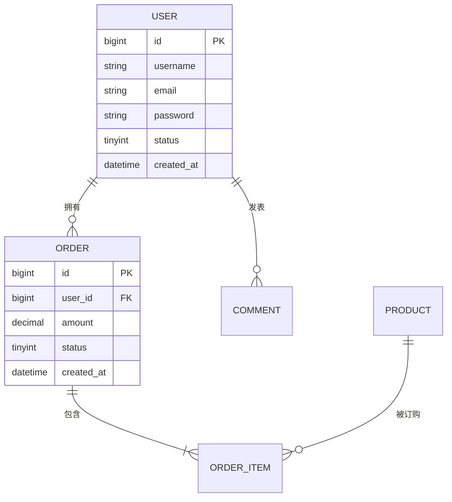

# [模块名称] - 数据库设计

| 版本 | 日期 | 作者 | 说明 |
|------|------|------|------|
| 1.0 | YYYY-MM-DD | [Your Name] | 初始版本 |

---

>  **填写指南**：本文档定义数据库表结构、索引、约束，是后端开发、数据库维护的重要参考。
>
> ⚠ **适用范围**：仅在完整模式（后端同时实现）下产出。
>
>  **一页纸摘要**:
> 1. 看完这页能回答:数据怎么存?表怎么设计?索引怎么建?约束怎么定?
> 2. 文档定位:开发级(技术级),数据库物理设计
> 3. 核心动作:ER 图 + 表结构 + 索引 + 约束 + SQL 示例
> 4. 何时使用:建表 / ORM 映射 / SQL 优化 / DBA 评审
> 5. 不要用于:API 字段(→03)、业务需求(→06)
>
>  **关键引用**: `reference/12-value-matrix.md` (DB 设计价值) · [`reference/13-quality-selfcheck.md`](../reference/13-quality-selfcheck.md) (DB 自检) · [`reference/15-five-field-crosscheck.md`](../reference/15-five-field-crosscheck.md) (5 字段交叉)

---

## 0. 填写指南

### 0.0 本文档价值

> **回答的核心问题**：数据怎么存？表结构？索引？枚举？校验？
> **不回答什么**：API 形态（→03）、业务逻辑（→06）
> **价值判定**：DBA 按设计建表，后端按设计写 SQL/ORM
> **所属阶段**：开发（技术级）

### 0.1 文档结构

| 板块 | 内容 | 必填 |
|------|------|------|
| **ER图** | 实体关系图 | ✅ |
| **表结构** | 字段定义、约束、注释 | ✅ |
| **索引设计** | 索引策略 | ✅ |
| **字段枚举** | 状态、类型枚举值 | ✅ |
| **数据校验** | 字段校验规则 | ✅ |

### 0.2 命名规范

| 类型 | 规范 | 示例 |
|------|------|------|
| 表名 | 小写下划线、复数名词 | sys_users |
| 主键 | id | id |
| 外键 | xxx_id | user_id |
| 索引 | idx_表名_字段 | idx_user_name |
| 唯一索引 | uk_表名_字段 | uk_user_email |
| 时间字段 | created_at / updated_at | created_at |

---

## 1. ER 实体关系图

>  **如何填写**：使用 Mermaid 绘制完整 ER 图，包含所有表和关系。



### 1.1 实体清单

| 实体 | 表名 | 说明 |
|------|------|------|
| [实体1] | [table_name] | [说明] |
| [实体2] | [table_name] | [说明] |

### 1.2 关系清单

| 关系 | 基数 | 说明 |
|------|------|------|
| [实体A] → [实体B] | 1:N | [说明] |
| [实体B] → [实体C] | N:M | [说明] |

---

## 2. 数据表结构

### 2.1 [表名A]（主表）

**表名**：`[table_name]`
**说明**：[表用途说明]
**引擎**：InnoDB
**字符集**：utf8mb4

| 字段名 | 类型 | 约束 | 默认值 | 说明 |
|--------|------|------|--------|------|
| `id` | BIGINT | PK, AUTO_INCREMENT | - | 主键 ID |
| `uuid` | VARCHAR(36) | UNIQUE, NOT NULL | - | 业务 UUID |
| `[field_name]` | [TYPE] | [约束] | [默认值] | [字段说明] |
| `status` | TINYINT | NOT NULL | 1 | 状态：1正常 0禁用 |
| `created_by` | VARCHAR(36) | NOT NULL | - | 创建人 UUID |
| `created_at` | DATETIME | NOT NULL | CURRENT_TIMESTAMP | 创建时间 |
| `updated_by` | VARCHAR(36) | NULL | - | 更新人 UUID |
| `updated_at` | DATETIME | NOT NULL | CURRENT_TIMESTAMP ON UPDATE | 更新时间 |
| `deleted_at` | DATETIME | NULL | - | 软删除时间 |

**建表 SQL**：

```sql
CREATE TABLE `[table_name]` (
  `id` bigint NOT NULL AUTO_INCREMENT COMMENT '主键ID',
  `uuid` varchar(36) NOT NULL COMMENT '业务UUID',
  `[field_name]` [type] [constraint] DEFAULT [default] COMMENT '[说明]',
  `status` tinyint NOT NULL DEFAULT '1' COMMENT '状态：1正常 0禁用',
  `created_by` varchar(36) NOT NULL COMMENT '创建人UUID',
  `created_at` datetime NOT NULL DEFAULT CURRENT_TIMESTAMP COMMENT '创建时间',
  `updated_by` varchar(36) DEFAULT NULL COMMENT '更新人UUID',
  `updated_at` datetime NOT NULL DEFAULT CURRENT_TIMESTAMP ON UPDATE CURRENT_TIMESTAMP COMMENT '更新时间',
  `deleted_at` datetime DEFAULT NULL COMMENT '软删除时间',
  PRIMARY KEY (`id`),
  UNIQUE KEY `uk_[table_name]_uuid` (`uuid`)
) ENGINE=InnoDB DEFAULT CHARSET=utf8mb4 COMMENT='[表注释]';
```

### 2.2 [表名B]（从表/关联表）

| 字段名 | 类型 | 约束 | 默认值 | 说明 |
|--------|------|------|--------|------|
| `id` | BIGINT | PK, AUTO_INCREMENT | - | 主键 ID |
| `[fk_field]` | BIGINT | FK, NOT NULL | - | 外键关联 [表名A] |
| `[field_name]` | [TYPE] | [约束] | [默认值] | [字段说明] |

---

## 3. 索引设计

### 3.1 索引清单

| 表名 | 索引名称 | 字段 | 类型 | 唯一 | 说明 |
|------|----------|------|------|------|------|
| [表名A] | `uk_[table]_uuid` | uuid | BTREE | 是 | 业务 UUID 唯一 |
| [表名A] | `idx_[table]_name` | [field] | BTREE | 否 | 普通索引 |
| [表名A] | `idx_[table]_status` | status | BTREE | 否 | 状态筛选 |
| [表名A] | `idx_[table]_created` | created_at | BTREE | 否 | 时间排序 |
| [表名B] | `idx_[table]_[field1_field2]` | [field1], [field2] | BTREE | 否 | 联合索引 |

### 3.2 索引设计原则

| 原则 | 说明 |
|------|------|
| 高频查询字段 | 为 WHERE 条件字段建索引 |
| 高频排序字段 | 为 ORDER BY 字段建索引 |
| 外键字段 | 关联字段必须建索引 |
| 联合索引 | 遵循最左前缀原则 |
| 区分度 | 区分度低的字段（如性别）不建索引 |

### 3.3 索引 SQL 示例

```sql
-- 普通索引
CREATE INDEX `idx_user_name` ON `sys_user` (`name`);

-- 唯一索引
CREATE UNIQUE INDEX `uk_user_email` ON `sys_user` (`email`);

-- 联合索引
CREATE INDEX `idx_user_status_created` ON `sys_user` (`status`, `created_at`);
```

---

## 4. 字段枚举值

### 4.1 状态枚举

| 表名 | 字段 | 枚举值 | 显示名称 | 说明 |
|------|------|--------|----------|------|
| [表名A] | `status` | 1 | 正常 | 默认状态 |
| [表名A] | `status` | 0 | 禁用 | 禁用状态 |
| [表名A] | `status` | -1 | 删除 | 软删除 |

### 4.2 业务枚举

| 表名 | 字段 | 枚举值 | 显示名称 | 说明 |
|------|------|--------|----------|------|
| [表名A] | `[field]` | [value1] | [名称1] | [说明] |
| [表名A] | `[field]` | [value2] | [名称2] | [说明] |

---

## 5. 数据校验规则

| 字段 | 校验类型 | 规则 | 错误提示 |
|------|----------|------|----------|
| 手机号 | 正则 | `^1[3-9]\d{9}$` | 请输入正确的手机号 |
| 邮箱 | 正则 | `^[\w.-]+@[\w.-]+\.\w+$` | 请输入正确的邮箱 |
| 身份证 | 正则 | `^[1-9]\d{5}(18|19|20)\d{2}(0[1-9]|1[0-2])(0[1-9]|[12]\d|3[01])\d{3}[\dXx]$` | 请输入正确的身份证号 |
| 金额 | 范围 | `> 0 且 <= 999999999.99` | 金额必须在有效范围内 |
| 密码 | 长度 | `8-32 位` | 密码长度 8-32 位 |

---

## 6. 数据策略

### 6.1 软删除

| 策略 | 实现方式 | 说明 |
|------|----------|------|
| 软删除 | `deleted_at IS NULL` | 仅查询 `deleted_at IS NULL` 的记录 |
| 恢复 | `UPDATE SET deleted_at = NULL` | 软删除可恢复 |
| 硬删除 | 仅 DBA 权限 | 重要数据禁用硬删除 |

### 6.2 数据隔离

| 策略 | 实现方式 | 说明 |
|------|----------|------|
| 多租户 | `tenant_id` 字段 | 多租户数据隔离 |
| 多组织 | `org_id` 字段 | 多组织数据隔离 |
| 权限过滤 | 应用层 RBAC | 字段级权限控制 |

### 6.3 数据归档

| 类型 | 归档策略 | 保留期 |
|------|----------|--------|
| 日志表 | 定期归档到历史库 | 6 个月 |
| 业务表 | 冷热数据分离 | 1 年 |
| 订单表 | 按年分区 | 永久 |

---

## 7. 初始化数据

### 7.1 字典数据

```sql
-- 状态字典
INSERT INTO `sys_dict` (`type`, `code`, `name`, `value`) VALUES
('status', 'normal', '正常', '1'),
('status', 'disabled', '禁用', '0');
```

### 7.2 基础数据

```sql
-- 管理员账号
INSERT INTO `sys_user` (`uuid`, `username`, `password`, `email`, `status`) VALUES
('admin-uuid-001', 'admin', '$2a$10$...', 'admin@example.com', 1);
```

---

## 8. 数据库变更管理

### 8.1 命名规范

| 类型 | 命名格式 | 示例 |
|------|----------|------|
| 新建表 | `V{version}__create_[table].sql` | V1.0.1__create_user.sql |
| 修改表 | `V{version}__alter_[table].sql` | V1.0.2__alter_user.sql |
| 索引 | `V{version}__index_[table].sql` | V1.0.3__index_user.sql |
| 数据 | `V{version}__data_[table].sql` | V1.0.4__data_user.sql |

### 8.2 变更流程

```
1. 开发编写脚本 → 2. 本地测试 → 3. 提交 SQL → 4. DBA 审核 → 5. 测试环境执行 → 6. 生产环境执行
```

---

## 9. 数据库检查清单

> ✅ **完成后逐项检查**

### 9.1 表设计

| 检查项 | 状态 |
|--------|------|
| ER 图已绘制 | ☐ |
| 实体清单已定义 | ☐ |
| 关系清单已定义 | ☐ |
| 表名遵循规范（小写下划线、复数） | ☐ |
| 必填字段已标注 NOT NULL | ☐ |
| 软删除字段已添加 | ☐ |

### 9.2 索引

| 检查项 | 状态 |
|--------|------|
| 唯一索引已建立 | ☐ |
| 外键索引已建立 | ☐ |
| 高频查询字段已索引 | ☐ |
| 联合索引遵循最左前缀 | ☐ |

### 9.3 约束

| 检查项 | 状态 |
|--------|------|
| 主键已设置 | ☐ |
| 外键关系已定义 | ☐ |
| 字段校验规则已定义 | ☐ |
| 枚举值已定义 | ☐ |

### 9.4 文档

| 检查项 | 状态 |
|--------|------|
| 建表 SQL 完整可执行 | ☐ |
| 字段注释完整 | ☐ |
| 表注释完整 | ☐ |
| 变更管理规范已制定 | ☐ |

---

*本文档基于项目模板生成，实际设计需根据业务调整。*

---

## 10. 字段类型矩阵

>  **核心目标**：精准选择字段类型，平衡存储空间、查询性能、扩展性。

### 10.1 数值类型

| 类型 | 范围 | 存储 | 适用场景 | 注意事项 |
|------|------|------|----------|----------|
| **TINYINT** | -128~127 / 0~255 | 1B | 布尔（0/1）、枚举、状态 | UNSIGNED 提升上限 |
| **SMALLINT** | -32768~32767 | 2B | 小范围计数 | - |
| **INT** | -21亿~21亿 | 4B | 业务 ID、数量、年龄 | 21 亿上限警惕 |
| **BIGINT** | -2^63~2^63-1 | 8B | 主键、雪花 ID、金额（分） | UNSIGNED 不推荐 |
| **FLOAT** | 单精度 | 4B | 科学计算 | **禁止**用于金额 |
| **DOUBLE** | 双精度 | 8B | 坐标、浮点计算 | **禁止**用于金额 |
| **DECIMAL(M,D)** | 精确小数 | M+2B | **金额**、税率、汇率 | M 总位数，D 小数位 |

**金额类型选择**：
```sql
-- ❌ 错误：浮点精度丢失
amount FLOAT

-- ✅ 正确：DECIMAL 精确
amount DECIMAL(15,2)  -- 最多 15 位，小数 2 位，最高 9999999999999.99

-- ✅ 正确：分单位存储（推荐）
amount_cents BIGINT  -- 单位：分，1.00 元存 100
```

### 10.2 字符串类型

| 类型 | 最大长度 | 字符集 | 适用 | 注意事项 |
|------|----------|--------|------|----------|
| **CHAR(N)** | 255 | 固定 | 定长：手机号、身份证、MD5 | 浪费空间但查询快 |
| **VARCHAR(N)** | 65535 字节 | 变长 | 名称、描述、文本 | n 为字符数 |
| **TINYTEXT** | 255B | 变长 | 短文本 | 不推荐 |
| **TEXT** | 64KB | 变长 | 文章、备注 | 不能建默认索引 |
| **MEDIUMTEXT** | 16MB | 变长 | 长文章、JSON | - |
| **LONGTEXT** | 4GB | 变长 | 极少使用 | 谨慎 |
| **ENUM** | 65535 | 枚举 | 状态、类型 | 慎用，加新值要 ALTER |
| **JSON** | 1GB | JSON | 配置、扩展属性 | MySQL 5.7+ |

**字符串长度选型**：
```sql
-- 手机号：CHAR(11) 比 VARCHAR(11) 性能更好
phone CHAR(11)

-- 名称：VARCHAR(64) / VARCHAR(128)
name VARCHAR(64)

-- 邮箱：VARCHAR(128)
email VARCHAR(128)

-- 长文本：TEXT
description TEXT

-- 配置：JSON（避免多列）
config JSON
```

**MySQL VARCHAR 长度与字符集**：
- utf8mb4 字符集：1 字符 = 4 字节
- 行最大：65535 字节
- 单 VARCHAR 最大字符数：(65535 - 其他字段) / 4

### 10.3 时间类型

| 类型 | 范围 | 存储 | 适用 | 注意事项 |
|------|------|------|------|----------|
| **DATE** | 1000-01-01 ~ 9999-12-31 | 3B | 生日、入住日期 | 不带时分秒 |
| **TIME** | -838:59:59 ~ 838:59:59 | 3B | 时长、营业时间 | - |
| **DATETIME** | 1000-01-01 00:00:00 ~ 9999-12-31 23:59:59 | 5B | 业务时间（创建、订单） | **推荐默认** |
| **TIMESTAMP** | 1970-01-01 ~ 2038-01-19 | 4B | 自动时间戳 | 2038 年问题 |
| **YEAR** | 1901 ~ 2155 | 1B | 年份 | 极少用 |

**时间类型选型**：
```sql
-- ✅ 推荐：DATETIME（无时区困扰，2038 安全）
created_at DATETIME DEFAULT CURRENT_TIMESTAMP
updated_at DATETIME DEFAULT CURRENT_TIMESTAMP ON UPDATE CURRENT_TIMESTAMP

-- 谨慎：TIMESTAMP（受时区影响，2038 上限）
created_at TIMESTAMP DEFAULT CURRENT_TIMESTAMP

-- 严禁：字符串存时间
created_at VARCHAR(20)  -- ❌ 无法索引、无法比较
```

**时区策略**：
- 数据库统一存 UTC 或 +08:00
- 应用层负责时区转换
- 禁止混合存储（部分 UTC 部分本地）

### 10.4 JSON 与扩展类型

| 类型 | 适用 | 优势 | 缺点 |
|------|------|------|------|
| **JSON（MySQL 5.7+）** | 半结构化配置 | 灵活、schema-less | 不能建普通索引（需函数索引） |
| **JSONB（PostgreSQL）** | 半结构化 | 二进制存储、支持索引 | - |
| **空间类型** | 地理位置、GIS | 空间查询优化 | 复杂 |
| **UUID** | 业务主键 | 全局唯一、可合并 | 存储大、索引碎片 |

**JSON 使用示例**：
```sql
-- MySQL 8.0 函数索引（按 JSON 字段值建索引）
ALTER TABLE sys_user ADD INDEX idx_user_ext_phone (
    (CAST(ext->>'$.phone' AS CHAR(11)))
);

-- 查询 JSON 字段
SELECT * FROM sys_user
WHERE JSON_EXTRACT(ext, '$.vipLevel') = 'gold';
```

### 10.5 字段类型选型决策树

```
是否固定长度？
├── 是 → CHAR(N) [如手机号/身份证/MD5]
└── 否
    │
    是否 < 64 字符？
    ├── 是 → VARCHAR(64/128/255)
    └── 否
        │
        是否 < 64KB？
        ├── 是 → TEXT
        └── 否 → MEDIUMTEXT
```

### 10.6 字段类型清单

| 检查项 | 状态 |
|--------|------|
| 金额统一 DECIMAL 或 BIGINT（分） | ☐ |
| 主键统一 BIGINT（雪花）或 UUID | ☐ |
| 时间统一 DATETIME | ☐ |
| 状态/枚举用 TINYINT 而非 VARCHAR | ☐ |
| 无 VARCHAR(255) 滥用 | ☐ |
| 字符串长度有明确业务依据 | ☐ |

---

## 11. 事务隔离级别

>  **核心目标**：在并发与一致性之间找到业务可接受的平衡点。

### 11.1 四个隔离级别

| 隔离级别 | 脏读 | 不可重复读 | 幻读 | 性能 | 适用 |
|----------|------|------------|------|------|------|
| **Read Uncommitted（读未提交）** | ✅ 可能 | ✅ 可能 | ✅ 可能 | 最高 | 极少（统计） |
| **Read Committed（读已提交）** | ❌ 避免 | ✅ 可能 | ✅ 可能 | 高 | 通用业务 |
| **Repeatable Read（可重复读）** | ❌ 避免 | ❌ 避免 | ✅ 可能（InnoDB 通过间隙锁避免） | 中 | **MySQL 默认** |
| **Serializable（串行化）** | ❌ 避免 | ❌ 避免 | ❌ 避免 | 最低 | 强一致报表 |

### 11.2 异常现象

| 现象 | 定义 | 示例 |
|------|------|------|
| **脏读** | 读到其他事务未提交的数据 | A 改 100→200，B 读到 200，A 回滚，B 数据错误 |
| **不可重复读** | 同一查询多次读，结果不一致 | A 读 100，B 改 200 并提交，A 再读变 200 |
| **幻读** | 范围查询时行数变化 | A 查 `count=10`，B 插入 1 条并提交，A 再查 `count=11` |

### 11.3 各数据库默认级别

| 数据库 | 默认级别 |
|--------|----------|
| **MySQL InnoDB** | Repeatable Read |
| **PostgreSQL** | Read Committed |
| **Oracle** | Read Committed |
| **SQL Server** | Read Committed |
| **MongoDB** | 快照隔离 |

### 11.4 InnoDB 的 RR 特殊性

MySQL InnoDB 在 RR 级别下通过 **MVCC + 间隙锁（Gap Lock）** 解决了部分幻读问题：

```sql
-- RR 级别下，SELECT ... FOR UPDATE 会加间隙锁
-- 阻塞其他事务在范围内 INSERT
SELECT * FROM orders WHERE amount > 1000 FOR UPDATE;
-- 范围 (1000, +∞) 被加锁，其他事务无法插入 amount > 1000 的行
```

### 11.5 隔离级别配置

```sql
-- 全局设置（需重启）
SET GLOBAL transaction_isolation = 'READ-COMMITTED';

-- 当前会话
SET SESSION transaction_isolation = 'REPEATABLE-READ';

-- 查看当前隔离级别
SELECT @@transaction_isolation;
```

```java
// Spring 事务
@Transactional(isolation = Isolation.READ_COMMITTED)
public void updateOrder() { ... }
```

### 11.6 选型建议

| 场景 | 推荐级别 | 原因 |
|------|----------|------|
| 通用业务（CRUD） | **Read Committed** | 性能与一致性平衡 |
| 金融核心（账务） | **Repeatable Read** | 避免不可重复读 |
| 报表/统计 | **Read Uncommitted** 或 RC | 性能优先 |
| 强一致对账 | **Serializable** | 必要时串行化 |

### 11.7 事务清单

| 检查项 | 状态 |
|--------|------|
| 隔离级别已显式设定 | ☐ |
| 业务可接受的并发异常已识别 | ☐ |
| 死锁防护策略已制定 | ☐ |
| 大事务已拆分（小事务优先） | ☐ |
| 事务超时已设置（避免长时间持有） | ☐ |

---

## 12. 慢查询治理

>  **核心目标**：将慢 SQL 消灭在开发阶段，线上持续监控 0 慢 SQL。

### 12.1 慢 SQL 定义

| 等级 | 阈值 | 严重程度 |
|------|------|----------|
| **轻** | 100ms ~ 500ms | 关注 |
| **中** | 500ms ~ 1s | 优化 |
| **重** | 1s ~ 5s | 立即优化 |
| **严重** | > 5s | **必须**优化（已影响 SLA） |

**MySQL 慢日志配置**：
```ini
# my.cnf
slow_query_log = 1
slow_query_log_file = /var/log/mysql/slow.log
long_query_time = 1
log_queries_not_using_indexes = 1
```

### 12.2 EXPLAIN 执行计划

**关键字段解读**：

| 字段 | 含义 | 关键值 |
|------|------|--------|
| **type** | 访问类型 | `system` > `const` > `eq_ref` > `ref` > `range` > `index` > `ALL`（全表扫描 ❌） |
| **key** | 实际使用的索引 | - |
| **rows** | 扫描行数 | 越小越好 |
| **Extra** | 额外信息 | `Using filesort` ❌ `Using temporary` ❌ `Using index` ✅ |

**EXPLAIN 示例**：
```sql
EXPLAIN SELECT * FROM orders WHERE user_id = 1001 AND status = 1 ORDER BY created_at DESC;

-- 期望结果：
-- type=ref, key=idx_user_status_created, rows=10, Extra=Using index
```

### 12.3 慢 SQL 优化手段

| 手段 | 适用 |
|------|------|
| **加索引** | 90% 场景 |
| **覆盖索引** | 避免回表 |
| **索引下推（ICP）** | 减少回表次数 |
| **改写 SQL** | 避免 `SELECT *` / 避免 `IN` 子查询 |
| **小表驱动大表** | JOIN 顺序 |
| **分页优化** | 深度分页用主键范围 |
| **强制索引** | `FORCE INDEX(idx_xxx)` 优化器误判时 |
| **物化视图** | 复杂聚合 |

**深度分页优化**：
```sql
-- ❌ 慢：LIMIT 1000000, 10 扫描 100 万行
SELECT * FROM orders ORDER BY id LIMIT 1000000, 10;

-- ✅ 快：先定位主键
SELECT * FROM orders WHERE id > 1000000 ORDER BY id LIMIT 10;
```

### 12.4 SQL 审计（开发阶段拦截）

| 工具 | 语言 | 规则 |
|------|------|------|
| **MyBatis 拦截器** | Java | 拦截 `SELECT *` / 无 WHERE / 大 LIMIT |
| **Archery** | Python | SQL 审核平台（开源） |
| **Yearning** | Go | 自动化 SQL 审核 |
| **SOAR** | Go | SQL 优化器/审核器 |
| **DBA 评审** | 人工 | 大表变更必审 |

**MyBatis 拦截器示例**：
```java
@Intercepts(@Signature(type = Executor.class, method = "query", ...))
public class SlowSqlInterceptor implements Interceptor {
    @Override
    public Object intercept(Invocation invocation) {
        long start = System.currentTimeMillis();
        Object result = invocation.proceed();
        long cost = System.currentTimeMillis() - start;
        if (cost > 500) {
            log.warn("慢SQL: {}ms, sql={}", cost, getSql(invocation));
        }
        return result;
    }
}
```

### 12.5 慢查询治理清单

| 检查项 | 状态 |
|--------|------|
| 慢日志已开启（阈值 1s） | ☐ |
| 慢日志定期分析（pt-query-digest） | ☐ |
| EXPLAIN 已加入开发规范 | ☐ |
| SQL 审计平台已部署 | ☐ |
| 索引评审机制已建立 | ☐ |
| 慢 SQL 告警已配置 | ☐ |

---

## 13. 读写分离

>  **核心目标**：通过主从架构分担读压力，提升系统整体 QPS。

### 13.1 主从架构

```
                ┌─────────────────┐
                │   Master        │
                │   (写)          │
                └────────┬────────┘
                         │ binlog
        ┌────────────────┼────────────────┐
        ▼                ▼                ▼
   ┌─────────┐      ┌─────────┐      ┌─────────┐
   │ Slave 1 │      │ Slave 2 │      │ Slave 3 │
   │ (读)    │      │ (读)    │      │ (读)    │
   └─────────┘      └─────────┘      └─────────┘
```

| 角色 | 职责 | 数量 |
|------|------|------|
| **Master** | 写、DDL | 1（推荐 1，写性能） |
| **Slave** | 读 | ≥ 2（高可用） |
| **延迟从** | 报表、BI | 1（允许大延迟） |

### 13.2 主从复制模式

| 模式 | 原理 | 延迟 | 适用 |
|------|------|------|------|
| **异步（默认）** | Master 写完立即返回，binlog 异步推 Slave | 0~秒级 | 通用（容忍少量不一致） |
| **半同步** | Master 等至少 1 个 Slave ACK | 10ms 级 | 金融级 |
| **同步** | 等所有 Slave ACK | 高 | 极少 |

### 13.3 读写分离实现

| 方案 | 配置 | 适用 |
|------|------|------|
| **应用层** | Spring AbstractRoutingDataSource | Java |
| **中间件** | MyCat / Sharding-JDBC / ProxySQL | 通用 |
| **驱动层** | mysql-router / MaxScale | MySQL 官方 |

**Spring 抽象数据源示例**：
```java
public class DynamicDataSource extends AbstractRoutingDataSource {
    @Override
    protected Object determineCurrentLookupKey() {
        return TransactionSynchronizationManager.isCurrentTransactionReadOnly()
            ? "slave" : "master";
    }
}

@Configuration
public class DataSourceConfig {
    @Bean
    public DataSource dataSource() {
        Map<Object, Object> map = new HashMap<>();
        map.put("master", masterDataSource());
        map.put("slave", slaveDataSource());
        return new DynamicDataSource(map);
    }
}
```

### 13.4 主从延迟问题

| 场景 | 解决方案 |
|------|----------|
| **写后立即读** | `Hint` 强制走主库 |
| **延迟监控** | `seconds_behind_master` 监控告警 |
| **读到旧数据** | 缓存预读 / 业务接受 |
| **强制主库读** | `SELECT ... FROM xxx /*FORCE_MASTER*/` |

**强制主库读（Sharding-JDBC）**：
```java
@Hint("master")
public List<Order> listCurrentUserOrders(Long userId) {
    // 强制走 master，避免延迟
    return orderRepository.findByUserId(userId);
}
```

### 13.5 读写分离清单

| 检查项 | 状态 |
|--------|------|
| 主从架构已部署 | ☐ |
| 读写分离路由已实现 | ☐ |
| 主从延迟已监控 | ☐ |
| 写后立即读场景已识别 + 强制主库 | ☐ |
| 读 QPS 已分流到从库 | ☐ |

---

## 14. 连接池配置

>  **核心目标**：合理配置连接池，平衡性能与资源消耗。

### 14.1 HikariCP（推荐）

**关键参数**：

| 参数 | 推荐值 | 说明 |
|------|--------|------|
| `maximumPoolSize` | 20-50 | 最大连接数，公式 `(核心数 × 2) + 有效硬盘数` |
| `minimumIdle` | = max | 固定大小池（推荐） |
| `connectionTimeout` | 30000 (30s) | 获取连接超时 |
| `idleTimeout` | 600000 (10min) | 空闲连接回收（一般不用） |
| `maxLifetime` | 1800000 (30min) | 连接最大生命周期 |
| `validationTimeout` | 5000 | 校验超时 |
| `leakDetectionThreshold` | 60000 | 连接泄漏检测 |

**Spring Boot 配置**：
```yaml
spring:
  datasource:
    hikari:
      maximum-pool-size: 30
      minimum-idle: 30
      connection-timeout: 30000
      max-lifetime: 1800000
      leak-detection-threshold: 60000
      pool-name: OrderHikariCP
      data-source-properties:
        cachePrepStmts: true
        prepStmtCacheSize: 250
        prepStmtCacheSqlLimit: 2048
        useServerPrepStmts: true
```

### 14.2 Druid（阿里）

**关键参数**：
```yaml
spring:
  datasource:
    druid:
      initial-size: 5
      min-idle: 10
      max-active: 50
      max-wait: 60000
      validation-query: SELECT 1
      test-while-idle: true
      time-between-eviction-runs-millis: 60000
      min-evictable-idle-time-millis: 300000
      filters: stat,wall,slf4j
      # 监控：/druid/index.html
      stat-view-servlet:
        enabled: true
        login-username: admin
        login-password: admin
```

**对比**：

| 维度 | HikariCP | Druid |
|------|----------|-------|
| 性能 | ⭐⭐⭐⭐⭐ | ⭐⭐⭐⭐ |
| 监控 | 弱（需 Micrometer） | **强**（内置 Web 控制台） |
| 防火墙 SQL 审计 | ❌ | ✅ WallFilter |
| 易用性 | ⭐⭐⭐⭐⭐ | ⭐⭐⭐⭐ |
| 适用 | 高性能首选 | 需要监控/审计 |

### 14.3 连接数计算

**公式**：
- `connections = ((核心数 × 2) + 有效磁盘数)`
- 8 核 SSD → `(8 × 2) + 1 = 17` → 推荐 20

**经验值**：
- 4C8G 单实例：20~30
- 8C16G 单实例：30~50
- DB 总连接数：`实例数 × 单实例连接数` < DB `max_connections`（默认 151）

### 14.4 常见问题

| 问题 | 现象 | 排查 |
|------|------|------|
| **连接泄漏** | 等待连接超时 | 开启 `leakDetectionThreshold` |
| **连接耗尽** | `Connection is not available` | 监控 + 慢 SQL |
| **连接失效** | Communications link failure | `test-while-idle=true` |
| **DB 端满** | `Too many connections` | DB `max_connections` |

### 14.5 连接池清单

| 检查项 | 状态 |
|--------|------|
| 连接池已选型（HikariCP/Druid） | ☐ |
| 最大连接数已合理配置 | ☐ |
| 泄漏检测已开启 | ☐ |
| 连接监控已接入 | ☐ |
| 慢 SQL 排查有标准流程 | ☐ |

---

## 15. ORM 选型对比

>  **核心目标**：选择适合项目规模与团队的 ORM 框架。

### 15.1 主流 ORM 对比

| ORM | 语言/框架 | 类型 | 优势 | 劣势 | 适用 |
|-----|-----------|------|------|------|------|
| **MyBatis** | Java | 半自动（SQL 中心） | 灵活、可控、性能高 | 需手写 SQL、XML 维护 | 复杂查询、性能敏感 |
| **MyBatis-Plus** | Java | MyBatis 增强 | 单表零 SQL、分页插件 | 多表仍需手写 | 通用首选 |
| **Hibernate** | Java | 全自动 | 强大 HQL、二级缓存 | 复杂 SQL 难写、性能损耗 | 快速开发 |
| **Spring Data JPA** | Java | JPA 标准 | Repository 模式、标准化 | 复杂查询能力弱 | 简单 CRUD |
| **Prisma** | Node.js | TypeScript 优先 | 类型安全、Migration 友好 | 复杂 SQL 弱 | 现代 Node.js |
| **Drizzle** | Node.js | SQL-Like | 轻量、类型安全 | 生态较新 | Serverless |
| **Sequelize** | Node.js | 全自动 | 成熟、文档丰富 | TS 体验一般 | 老项目 |
| **TypeORM** | Node.js | 装饰器 | 类似 JPA | 性能一般 | 中型项目 |
| **GORM** | Go | 全自动 | 链式 API | 复杂 SQL 难 | Go 项目 |
| **SQLAlchemy** | Python | 全自动 | Pythonic、强大 | 学习曲线 | Django 之外 |
| **Django ORM** | Python | 全自动 | 与 Django 集成 | 性能一般 | Django 项目 |

### 15.2 选型决策树

```
项目规模？
├── 小型（CRUD 为主）
│   ├── Java → Spring Data JPA / MyBatis-Plus
│   ├── Node → Prisma
│   └── Python → Django ORM / SQLAlchemy
│
├── 中型（复杂业务）
│   ├── Java → MyBatis-Plus（默认） / MyBatis（复杂 SQL）
│   ├── Node → Prisma + Raw SQL
│   └── Python → SQLAlchemy
│
└── 大型（性能敏感）
    ├── Java → MyBatis（手写 SQL 调优）
    ├── Node → Drizzle
    └── Go → GORM / sqlx
```

### 15.3 N+1 查询问题

**问题**：Hibernate/JPA 常见，一次查询 + N 次子查询

```java
// ❌ N+1
List<Order> orders = orderRepository.findAll();
for (Order o : orders) {
    o.getItems().size();  // 每次都查一次 DB
}

// ✅ 解决：JOIN FETCH
@Query("SELECT o FROM Order o JOIN FETCH o.items WHERE o.userId = :userId")
List<Order> findByUserIdWithItems(@Param("userId") Long userId);

// ✅ MyBatis-Plus：自动填充
orderRepository.selectList(
    Wrappers.<Order>lambdaQuery()
        .eq(Order::getUserId, userId)
        .select(Order::getId, Order::getName)
);
```

### 15.4 通用建议

| 原则 | 说明 |
|------|------|
| **复杂 SQL 用 MyBatis** | 性能可控 |
| **单表 CRUD 用 JPA/MyBatis-Plus** | 高效 |
| **避免 N+1** | JOIN FETCH / 批量预加载 |
| **禁止 SELECT *** | 只取必要字段 |
| **分页交给 ORM** | 避免手写 LIMIT 容易出错 |
| **二级缓存谨慎** | 一致性问题 |

### 15.5 ORM 清单

| 检查项 | 状态 |
|--------|------|
| ORM 已选型 | ☐ |
| 选型理由已文档化 | ☐ |
| 团队对所选 ORM 熟练 | ☐ |
| N+1 问题排查有标准方法 | ☐ |
| 复杂 SQL 有方案（手写/JOIN FETCH） | ☐ |

---

## 16. 分库分表

>  **核心目标**：解决单库单表数据量过大的问题（> 5000 万行 / > 100GB）。

### 16.1 何时分库分表

| 指标 | 单库上限 | 单表上限 |
|------|----------|----------|
| 数据量 | 1 亿行 | 5000 万行 |
| 存储 | 500GB | 50GB |
| QPS | 1 万 | 5000 |
| 字段数 | - | ≤ 50 |

**如果单表 > 5000 万行 / > 50GB → 考虑分表**
**如果写 QPS > 5000 → 考虑分库**

### 16.2 分片策略

| 策略 | 优点 | 缺点 | 适用 |
|------|------|------|------|
| **按用户 ID 哈希** | 数据均匀、扩容哈希迁移 | 跨用户查询复杂 | C 端用户数据 |
| **按时间（按月/按年）** | 历史数据自然归档 | 冷热不均 | 日志、订单 |
| **按地域** | 业务清晰 | 数据不均 | 跨地域业务 |
| **按业务** | 业务隔离 | 跨业务 JOIN 难 | 业务清晰 |
| **一致性 Hash** | 扩缩容只迁移部分 | 哈希偏斜 | 分布式缓存 |

### 16.3 中间件选型

| 中间件 | 类型 | 语言 | 特点 | 适用 |
|--------|------|------|------|------|
| **Sharding-JDBC** | 客户端 | Java | 嵌入应用、性能高 | Java 应用首选 |
| **ShardingSphere-Proxy** | 代理 | Java | 透明代理、跨语言 | 多语言接入 |
| **Vitess** | 代理 | Go | YouTube 出品、K8s 友好 | 大型项目 |
| **MyCat** | 代理 | Java | 老牌、稳定 | 老项目 |
| **TDDL** | 客户端 | Java | 阿里出品 | 阿里系 |
| **DRDS** | 云服务 | - | 阿里云 | 阿里云用户 |

### 16.4 Sharding-JDBC 配置示例

```yaml
# application.yml
spring:
  shardingsphere:
    datasource:
      names: ds0,ds1
      ds0:
        type: com.zaxxer.hikari.HikariDataSource
        jdbc-url: jdbc:mysql://10.0.0.1:3306/order_0
      ds1:
        type: com.zaxxer.hikari.HikariDataSource
        jdbc-url: jdbc:mysql://10.0.0.2:3306/order_1
    rules:
      sharding:
        tables:
          orders:
            actual-data-nodes: ds$->{0..1}.orders_$->{0..15}
            database-strategy:
              inline:
                sharding-column: user_id
                algorithm-expression: ds$->{user_id % 2}
            table-strategy:
              inline:
                sharding-column: user_id
                algorithm-expression: orders_$->{user_id % 16}
            key-generator:
              type: SNOWFLAKE
              props:
                worker-id: 1
```

### 16.5 分片带来的问题

| 问题 | 解决方案 |
|------|----------|
| **跨库 JOIN** | 宽表冗余 / 内存组装 / 数据中台 |
| **跨库事务** | 分布式事务（Seata）/ 最终一致 |
| **全局主键** | 雪花算法 / UUID / 号段 |
| **分页** | 改用 ES / 各自分页后合并 |
| **扩容** | 一致性 Hash / 双倍扩容 + 灰度迁移 |
| **数据迁移** | 全量 + 增量 + 双写 + 校验 |

### 16.6 扩容方案

```
v1: 4 库 × 8 表 = 32 表
      ↓ 容量预警
v2: 8 库 × 16 表 = 128 表（双倍扩容）

步骤：
1. 部署 8 库 × 16 表结构
2. 双写（新旧表）
3. 全量迁移历史数据
4. 数据校验
5. 切读流量到新表
6. 停止双写
7. 下线旧表
```

### 16.7 分库分表清单

| 检查项 | 状态 |
|--------|------|
| 分片键已选型（高频查询字段） | ☐ |
| 分片中间件已选型 | ☐ |
| 跨库 JOIN 方案已设计 | ☐ |
| 分布式主键已选型（雪花） | ☐ |
| 扩容方案已设计 | ☐ |
| 数据迁移工具已就绪 | ☐ |

---

## 17. 数据血缘

>  **核心目标**：表级、字段级的数据来源与流向可追溯。

### 17.1 血缘层级

| 层级 | 内容 | 工具 |
|------|------|------|
| **表级血缘** | A 表数据从哪来、到哪去 | Atlas / DataHub / OpenMetadata |
| **字段级血缘** | 字段级别的转换与流向 | Apache Atlas / DataHub |
| **变更追溯** | schema 变更历史、影响范围 | 自动化元数据管理 |
| **作业血缘** | ETL/任务间的依赖 | Airflow / DolphinScheduler |

### 17.2 血缘示例

```
[业务库 MySQL]                          [数仓 Hive]                           [应用库 ES]
  sys_user ─┐                            ods_user (贴源层) ─┐                 user_search
  sys_order │                            ods_order           │
            ├─→ ETL 同步 ─→              dwd_user (明细层)   ├─→ 聚合 ─→      dws_user_active
            │                            dwd_order           │                user_profile
  dwd_user ─┘                            dws_user_daily ────┘
                                          │
                                          ↓ ADS 层
                                       ads_report_daily
```

### 17.3 工具对比

| 工具 | 血缘层级 | 部署 | 优势 | 适用 |
|------|----------|------|------|------|
| **Apache Atlas** | 表/字段 | 中 | Hadoop 生态完善 | 大数据平台 |
| **DataHub（LinkedIn）** | 表/字段/作业 | 中 | 现代、活跃 | 通用 |
| **OpenMetadata** | 表/字段/作业 | 轻 | 现代化、UI 友好 | 中小团队 |
| **Metacat（Netflix）** | 表/字段 | 中 | 元数据服务化 | 大型 |
| **自研轻量** | 表 | - | 简单可控 | 小团队 |

### 17.4 数据字典

| 字段 | 描述 | 来源 | 加工逻辑 | 消费者 |
|------|------|------|----------|--------|
| user_id | 用户 ID | sys_user.id | 直接同步 | 订单、行为、报表 |
| order_amount | 订单金额 | order 表 | sum(amount) where status=paid | 报表、BI |

### 17.5 血缘价值

| 场景 | 价值 |
|------|------|
| **变更影响评估** | 改一张表，能立刻知道哪些下游报表/服务受影响 |
| **数据问题排查** | 报表数据异常，快速定位到上游哪张表出了问题 |
| **新人入职** | 快速理解数据全貌 |
| **合规审计** | GDPR/个保法要求数据流向可追溯 |

### 17.6 血缘清单

| 检查项 | 状态 |
|--------|------|
| 元数据管理平台已部署 | ☐ |
| 表级血缘已采集 | ☐ |
| 字段级血缘已采集（核心表） | ☐ |
| 变更影响评估流程已建立 | ☐ |
| 数据字典已维护 | ☐ |

---

## 18. 跨库查询

>  **核心目标**：分库分表后解决跨库 JOIN/聚合问题。

### 18.1 跨库查询场景

| 场景 | 难度 | 方案 |
|------|------|------|
| 跨库 JOIN | 高 | 宽表 / 数据中台 / 应用层组装 |
| 跨库聚合 | 中 | 数仓 / 离线 / 实时计算 |
| 跨库分页 | 高 | 各自分页 + 内存合并 |
| 跨库事务 | 高 | 分布式事务（Seata） |
| 全局查询 | 高 | ES / 数据中台 |

### 18.2 跨库 JOIN 解决方案

#### 方案 1：宽表冗余（推荐）

把关联字段冗余到主表，避免 JOIN：

```sql
-- ❌ 跨库 JOIN
SELECT o.*, u.name
FROM orders_0 o
JOIN user_db.sys_user u ON o.user_id = u.id;

-- ✅ 宽表冗余：orders 表冗余 user_name
CREATE TABLE orders (
    id BIGINT,
    user_id BIGINT,
    user_name VARCHAR(64),  -- 冗余自 user
    amount DECIMAL(15,2),
    ...
);
```

**代价**：写入时同步更新冗余字段（可通过 MQ 异步）

#### 方案 2：应用层组装

```java
public OrderDetailVO getOrderDetail(Long orderId) {
    Order order = orderRepository.findById(orderId);
    User user = userClient.getById(order.getUserId());  // 远程调用
    return OrderDetailVO.of(order, user);
}
```

#### 方案 3：数据中台 + 宽表

将分库数据汇总到 ODS/DWD/ADS 层（数仓），查询走数仓。

### 18.3 ES 同步方案

```
MySQL (分库分表)
   ↓ Canal / Maxwell 监听 binlog
Kafka
   ↓ 消费同步
Elasticsearch
   ↓ 查询
应用层
```

**Canal 示例**：
```java
// Canal Server 监听 binlog，发布到 Kafka
// Canal Client 消费，写入 ES
@KafkaListener(topics = "canal-orders")
public void onMessage(CanalMessage msg) {
    if (msg.getType() == CanalMessage.Type.UPDATE) {
        esClient.index("orders", msg.getId(), msg.getData());
    }
}
```

### 18.4 实时宽表

通过 Flink / Spark Streaming 实时 JOIN 多个数据源，输出宽表到 ES / HBase / Redis。

```
订单库 (分库)  ─┐
                 ├─→ Flink Stream Join → 宽表 → Redis/ES
用户库 (单库)  ─┘
```

### 18.5 跨库查询清单

| 检查项 | 状态 |
|--------|------|
| 跨库 JOIN 场景已识别 | ☐ |
| 宽表冗余策略已制定 | ☐ |
| ES 同步链路已建立（如需） | ☐ |
| 数据中台已规划（如需） | ☐ |
| 实时宽表方案已评估 | ☐ |


## 摘要(降级输出,200 字内)

> 模板定位摘要(全受众可见)。完整定义见下方各章。
> 模板定位:0.0 本文档价值

**核心决策**:
- **公式**:- `connections = ((核心数 × 2) + 有效磁盘数)`

**关键数字/对象**:见完整版

**完整版见**:`12-数据库设计.md`(主受众可访问)
