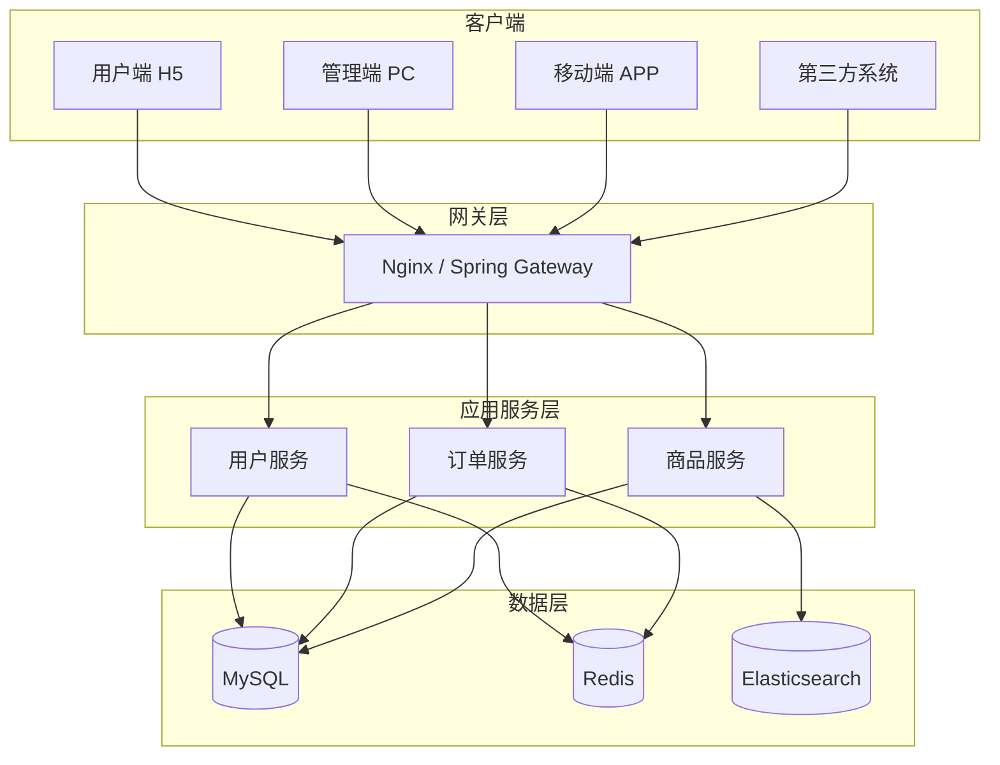

# [项目名称] - 架构设计

| 版本 | 日期 | 作者 | 说明 |
|------|------|------|------|
| 1.0 | YYYY-MM-DD | [Your Name] | 初始版本 |

---

> 📖 **填写指南**：本文档描述系统的整体架构、模块划分、技术选型、关键流程，是技术评审和实施的重要参考。
>
> ⚠️ **适用范围**：仅在完整模式（后端同时实现）下产出。
>
> 📌 **一页纸摘要**:
> 1. 看完这页能回答:系统怎么搭?模块怎么分?技术怎么选?性能/安全/扩展策略?
> 2. 文档定位:架构级,系统全貌与技术决策
> 3. 核心动作:架构概览 + 模块划分 + 数据架构 + 部署架构 + 关键技术决策
> 4. 何时使用:架构评审 / 新人理解 / 技术选型 / 故障排查
> 5. 不要用于:产品功能(→06)、API 字段(→03)
>
> 🔗 **关键引用**: `reference/12-value-matrix.md` (架构价值) · [`reference/13-quality-selfcheck.md`](../reference/13-quality-selfcheck.md) (架构自检) · [`reference/15-five-field-crosscheck.md`](../reference/15-five-field-crosscheck.md) (5 字段交叉) · [`reference/16-common-pitfalls.md`](../reference/16-common-pitfalls.md) (架构常见错误)

---

## 0. 填写指南

### 0.0 本文档价值

> **回答的核心问题**：技术怎么选？怎么搭？性能/安全/扩展策略？
> **不回答什么**：产品功能（→06）、具体 API（→03）
> **价值判定**：架构师评审/新人理解系统全貌
> **所属阶段**：开发（技术级）

### 0.1 文档结构

| 板块 | 内容 | 必填 |
|------|------|------|
| **架构概览** | 整体架构图、技术选型 | ✅ |
| **模块划分** | 业务模块、技术模块 | ✅ |
| **数据架构** | 数据流向、存储策略 | ✅ |
| **关键流程** | 核心业务流程 | ✅ |
| **非功能设计** | 性能、安全、可扩展性 | ✅ |

### 0.2 设计原则

| 原则 | 说明 |
|------|------|
| 简单 | 优先选择简单方案 |
| 演进 | 支持平滑演进 |
| 解耦 | 模块间松耦合 |
| 容错 | 设计降级和容错 |
| 监控 | 可观测性内建 |

---

## 1. 架构概览

⭐ **关键决策**：
- **架构分层 4 层**：表现层（Web/H5/小程序）/ 网关层（路由+鉴权+限流）/ 业务层（微服务/单体模块）/ 数据层（DB/缓存/搜索）
- **架构风格 3 选 1**：单体（快速起步）/ 微服务（> 5 团队规模）/ Serverless（流量波动大）
- **关键约束先识别**：合规（等保/数据出境）/ 性能（QPS/延迟）/ 团队（人数/技能）→ 决定架构选型
- **避免过早微服务**：< 5 人团队用单体，> 50 人再考虑拆分

### 1.1 整体架构图

> 📝 **如何填写**：使用 ASCII 或 Mermaid 绘制整体架构图。



### 1.2 技术选型

| 层级 | 技术 | 版本 | 选型理由 |
|------|------|------|----------|
| 前端框架 | [React/Vue] | [version] | [理由] |
| UI 组件库 | [Ant Design/Element] | [version] | [理由] |
| 后端语言 | [Java/Node.js] | [version] | [理由] |
| 后端框架 | [Spring Boot/Express] | [version] | [理由] |
| 数据库 | [MySQL/PostgreSQL] | [version] | [理由] |
| 缓存 | [Redis] | [version] | [理由] |
| 消息队列 | [RabbitMQ/Kafka] | [version] | [理由] |
| 搜索引擎 | [Elasticsearch] | [version] | [理由] |
| 网关 | [Nginx/Spring Gateway] | [version] | [理由] |
| 监控 | [Prometheus/Grafana] | [version] | [理由] |

---

## 2. 模块划分

### 2.1 业务模块

| 模块 | 说明 | 优先级 |
|------|------|--------|
| [模块1] | [业务说明] | P0 |
| [模块2] | [业务说明] | P0 |
| [模块3] | [业务说明] | P1 |

### 2.2 技术模块

| 模块 | 说明 |
|------|------|
| [common] | 公共组件、工具类、常量 |
| [config] | 全局配置 |
| [security] | 认证、授权、加密 |
| [logging] | 日志记录 |
| [exception] | 异常处理 |
| [cache] | 缓存管理 |
| [mq] | 消息队列 |

### 2.3 模块依赖关系

```
[模块A] ──> [common]
   │
   ├──> [模块B] ──> [common]
   │
   └──> [模块C] ──> [common] ──> [cache]
```

---

## 3. 数据架构

### 3.1 数据流向

```
用户操作 ──> 前端 ──> 后端 API ──> Service ──> Repository ──> 数据库
   │                                                              │
   │                                                              │
   └─── 缓存读 ←────── 缓存 ←── Service ←── 热点数据              │
                                                                   │
                                  └── 异步 ──> 消息队列 ──> ES    │
```

### 3.2 数据存储策略

| 数据类型 | 存储 | 同步策略 |
|----------|------|----------|
| 业务核心数据 | MySQL | 主从同步 |
| 缓存数据 | Redis | 主从同步 |
| 搜索数据 | Elasticsearch | 异步同步 |
| 日志数据 | ELK | 异步收集 |
| 文件 | OSS/MinIO | 同步上传 |

### 3.3 分库分表策略

| 表 | 当前数据量 | 预估数据量 | 策略 | 分片键 |
|----|------------|------------|------|--------|
| [表A] | [数量] | [数量] | [不分/水平/垂直] | [字段] |
| [表B] | [数量] | [数量] | [不分/水平/垂直] | [字段] |

---

## 4. 关键流程

### 4.1 用户注册流程

```
用户提交注册
    │
    ▼
┌───────────┐
│  参数校验  │
└─────┬─────┘
      │
      ▼
┌───────────┐    已存在    ┌────────────┐
│ 唯一性检查  │ ────────> │ 返回错误提示 │
└─────┬─────┘           └────────────┘
      │ 未存在
      ▼
┌───────────┐
│ 密码加密  │
└─────┬─────┘
      │
      ▼
┌───────────┐
│ 写入数据库│
└─────┬─────┘
      │
      ▼
┌───────────┐
│ 发送激活邮件│
└─────┬─────┘
      │
      ▼
  返回结果
```

### 4.2 订单处理流程

```
下单 ──> 创建订单 ──> 锁定库存 ──> 支付 ──> 扣减库存 ──> 发货 ──> 完成
  │         │            │          │          │          │         │
  │         │            │          │          │          │         │
  ▼         ▼            ▼          ▼          ▼          ▼         ▼
[记录]   [持久化]    [Redis锁]  [支付回调]  [DB更新]  [物流]   [状态]
```

### 4.3 关键流程清单

| 流程 | 优先级 | 说明 |
|------|--------|------|
| 用户注册 | P0 | 详见 4.1 |
| 用户登录 | P0 | - |
| 订单创建 | P0 | 详见 4.2 |
| 订单支付 | P0 | - |
| [其他流程] | P1 | - |

---

## 5. 非功能设计

### 5.1 性能设计

| 维度 | 目标 | 实现方式 |
|------|------|----------|
| 响应时间 | API P95 ≤ 500ms | 缓存、索引、SQL优化 |
| 吞吐量 | ≥ 1000 QPS | 水平扩展、负载均衡 |
| 并发 | ≥ 10000 | 异步、消息队列 |
| 可用性 | ≥ 99.9% | 主从、限流、降级 |

### 5.2 安全设计

| 维度 | 实现方式 |
|------|----------|
| 认证 | JWT / Session |
| 授权 | RBAC / ABAC |
| 传输 | HTTPS / TLS 1.2+ |
| 存储 | 敏感数据加密、密码哈希 |
| 防注入 | 参数化查询、白名单 |
| 防XSS | 输入过滤、输出转义 |
| 防CSRF | Token 验证、SameSite Cookie |

### 5.3 可扩展性设计

| 维度 | 实现方式 |
|------|----------|
| 水平扩展 | 无状态服务、负载均衡 |
| 垂直扩展 | 配置升级、容量评估 |
| 模块化 | 微服务化（未来） |
| 异步化 | 消息队列、事件驱动 |
| 配置化 | 开关、规则引擎 |

### 5.4 可观测性设计

| 维度 | 工具 | 说明 |
|------|------|------|
| 日志 | ELK | 集中日志收集 |
| 监控 | Prometheus | 指标监控 |
| 告警 | AlertManager | 异常告警 |
| 链路追踪 | SkyWalking | 分布式追踪 |
| 性能分析 | Grafana | 性能大盘 |

### 5.5 容错设计

| 场景 | 策略 |
|------|------|
| 服务宕机 | 健康检查、自动重启 |
| 数据库故障 | 主从切换、读写分离 |
| 缓存故障 | 降级到数据库 |
| 第三方故障 | 超时、重试、熔断 |
| 流量激增 | 限流、削峰、熔断 |

---

## 6. 部署架构

⭐ **关键决策**：
- **3 环境分离**：开发 / 测试 / 生产，**禁止直连生产调试**
- **灰度发布 4 阶段**：5% → 25% → 50% → 100%，每阶段观察 10-30min
- **多活 vs 主备**：核心业务 ≥ 2 机房（同城双活 / 异地灾备），非核心单机房
- **回滚 1 分钟**：每次发布保留上一版本镜像 + 1min 内可回滚的脚本

### 6.1 部署拓扑

```
┌─────────────────────────────────────────────────┐
│                     互联网                        │
└────────────────────────┬────────────────────────┘
                         │
                         ▼
                ┌──────────────────┐
                │  负载均衡 SLB     │
                └────────┬─────────┘
                         │
         ┌───────────────┼───────────────┐
         │               │               │
         ▼               ▼               ▼
   ┌──────────┐   ┌──────────┐   ┌──────────┐
   │ Web 节点1│   │ Web 节点2│   │ Web 节点3│
   └────┬─────┘   └────┬─────┘   └────┬─────┘
        │               │               │
        └───────────────┼───────────────┘
                        │
                        ▼
              ┌──────────────────┐
              │  应用服务集群     │
              └────────┬─────────┘
                       │
        ┌──────────────┼──────────────┐
        │              │              │
        ▼              ▼              ▼
   ┌─────────┐   ┌─────────┐   ┌─────────┐
   │ MySQL  │   │  Redis  │   │   MQ    │
   │ 主从集群 │   │  集群   │   │  集群   │
   └─────────┘   └─────────┘   └─────────┘
```

### 6.2 环境规划

| 环境 | 用途 | 配置 | 部署方式 |
|------|------|------|----------|
| dev | 开发联调 | 最低 | 手动 |
| test | 测试验收 | 测试 | 手动 |
| staging | 预发布 | 生产级 | 自动 |
| production | 生产环境 | 生产级 | 蓝绿发布 |

---

## 7. 架构决策记录（ADR）

⭐ **关键决策**：
- **ADR 6 段式**：标题（动词+对象）/ 状态（提案/通过/废弃）/ 背景（为什么做）/ 决策（做什么）/ 备选方案（≥ 2 个）/ 后果（正面+负面）
- **每架构决策 1 份 ADR**：不要把多个决策塞到 1 份
- **ADR 不删除**：废弃的 ADR 标"Superseded by ADR-005"，保留历史
- **决策依据 3 维度**：技术成熟度 / 团队能力 / 业务价值（不只看技术）

> 📝 **如何填写**：记录关键架构决策及理由。

### ADR-001: [决策标题]

| 项目 | 内容 |
|------|------|
| 状态 | [提议/已接受/已弃用] |
| 日期 | YYYY-MM-DD |
| 决策人 | [@负责人] |

**背景**：[为什么需要做这个决策]

**决策**：[最终方案]

**理由**：[为什么选这个方案]

**影响**：[影响范围]

**备选方案**：
- [方案1]：[未选理由]
- [方案2]：[未选理由]

---

## 8. 风险评估

| 风险 | 概率 | 影响 | 应对措施 |
|------|------|------|----------|
| [风险1] | 高/中/低 | 高/中/低 | [措施] |
| [风险2] | 高/中/低 | 高/中/低 | [措施] |

---

## 9. 架构检查清单

> ✅ **完成后逐项检查**

### 9.1 架构完整性

| 检查项 | 状态 |
|--------|------|
| 整体架构图已绘制 | ☐ |
| 技术选型理由已说明 | ☐ |
| 模块划分清晰 | ☐ |
| 依赖关系明确 | ☐ |

### 9.2 关键流程

| 检查项 | 状态 |
|--------|------|
| 核心业务流程已定义 | ☐ |
| 异常流程已考虑 | ☐ |
| 流程图清晰可读 | ☐ |

### 9.3 非功能设计

| 检查项 | 状态 |
|--------|------|
| 性能目标已定义 | ☐ |
| 安全方案已设计 | ☐ |
| 可扩展性已考虑 | ☐ |
| 可观测性已规划 | ☐ |
| 容错降级已设计 | ☐ |

---

## 12. 云原生与基础设施

### 12.1 容器化

**Dockerfile 规范**：
```dockerfile
# 多阶段构建
FROM node:20-alpine AS builder
WORKDIR /app
COPY package*.json ./
RUN npm ci
COPY . .
RUN npm run build

FROM node:20-alpine AS runner
WORKDIR /app
RUN addgroup -g 1001 -S nodejs && adduser -S nodejs -u 1001
COPY --from=builder /app/dist ./dist
COPY --from=builder /app/node_modules ./node_modules
USER nodejs
EXPOSE 3000
HEALTHCHECK --interval=30s --timeout=3s \
  CMD wget -qO- http://localhost:3000/health || exit 1
CMD ["node", "dist/main.js"]
```

**镜像规范**：
- 基础镜像：Alpine（< 100MB）
- 时区：UTC + 配置 TZ=Asia/Shanghai
- 用户：非 root 运行
- HEALTHCHECK 必备
- 镜像打 tag：`<service>:<git-sha>-<date>`

### 12.2 K8s 部署清单

```yaml
apiVersion: apps/v1
kind: Deployment
metadata:
  name: user-service
  namespace: production
spec:
  replicas: 3
  selector:
    matchLabels:
      app: user-service
  template:
    metadata:
      labels:
        app: user-service
        version: v1.0.0
    spec:
      containers:
      - name: app
        image: registry.example.com/user-service:v1.0.0
        ports:
        - containerPort: 3000
        resources:
          requests:
            cpu: 500m
            memory: 512Mi
          limits:
            cpu: 2000m
            memory: 2Gi
        readinessProbe:
          httpGet: { path: /health/ready, port: 3000 }
          initialDelaySeconds: 10
          periodSeconds: 5
        livenessProbe:
          httpGet: { path: /health/live, port: 3000 }
          initialDelaySeconds: 30
          periodSeconds: 10
        env:
        - name: NODE_ENV
          value: production
        - name: DB_HOST
          valueFrom:
            secretKeyRef: { name: db-secret, key: host }
```

### 12.3 Service Mesh（Istio）

**场景适用**：
- 微服务 ≥ 20 个
- 跨语言（Go + Java + Node）
- 精细流量管理（金丝雀、镜像）
- 全链路 mTLS

**核心能力**：
- 流量管理：VirtualService、DestinationRule
- 安全：mTLS、AuthorizationPolicy
- 可观测：自动采集指标
- 灰度：基于 Header / 权重

### 12.4 服务网格 vs 微服务框架

| 维度 | Istio Service Mesh | Spring Cloud / Dubbo |
|------|---------------------|----------------------|
| 侵入性 | 无侵入 | 强侵入 |
| 性能 | 略差（sidecar） | 高 |
| 多语言 | ✅ 通用 | ❌ 单语言 |
| 学习成本 | 高 | 中 |
| 适用 | 大型复杂系统 | 单一语言团队 |

---

## 13. CI/CD 流水线

### 13.1 完整流水线

```
代码提交 → 静态检查 → 单元测试 → 镜像构建 → 推送镜像仓库
  ↓
触发部署 → 预发环境 → 自动化测试 → 灰度发布（10%）→ 全量
  ↓
监控观察 → 异常告警 → 自动/手动回滚
```

### 13.2 GitHub Actions 示例

```yaml
name: CI
on:
  push:
    branches: [main, develop]
  pull_request:
    branches: [main]

jobs:
  test:
    runs-on: ubuntu-latest
    steps:
      - uses: actions/checkout@v4
      - uses: actions/setup-node@v4
        with: { node-version: '20' }
      - run: npm ci
      - run: npm run lint
      - run: npm run test:coverage
      - run: npm run build
      
  build-and-push:
    needs: test
    if: github.ref == 'refs/heads/main'
    runs-on: ubuntu-latest
    steps:
      - uses: actions/checkout@v4
      - name: Login to Registry
        uses: docker/login-action@v3
        with:
          registry: registry.example.com
          username: ${{ secrets.REGISTRY_USER }}
          password: ${{ secrets.REGISTRY_PASS }}
      - name: Build and Push
        uses: docker/build-push-action@v5
        with:
          push: true
          tags: registry.example.com/${{ github.event.repository.name }}:${{ github.sha }}
```

### 13.3 灰度发布策略

| 策略 | 描述 | 工具 |
|------|------|------|
| **蓝绿部署** | 两套环境，瞬间切换 | K8s + SLB |
| **滚动发布** | 逐步替换旧实例 | K8s default |
| **金丝雀** | 小流量先验证 | Istio / Argo Rollouts |
| **A/B 测试** | 按用户分桶对比 | Feature Flag 平台 |
| **影子流量** | 复制生产流量到新版本 | Istio mirror |

### 13.4 部署门禁

| 门禁 | 条件 |
|------|------|
| 代码门禁 | 测试覆盖率 ≥ 60%、Lint 0 错、Sonar 0 漏洞 |
| 镜像门禁 | 漏洞扫描通过、镜像签名 |
| 预发门禁 | 自动化测试 100% 通过 |
| 灰度门禁 | 1% 错误率 < 0.5%、P95 < 基线 2x |

---

## 14. 可观测性

### 14.1 三大支柱

| 支柱 | 工具 | 用途 |
|------|------|------|
| **Metrics（指标）** | Prometheus + Grafana | 数值型、聚合、告警 |
| **Logs（日志）** | ELK / Loki | 详细事件、排查 |
| **Traces（链路）** | Jaeger / SkyWalking / Tempo | 跨服务追踪 |

### 14.2 RED 指标（服务级）

| 指标 | 含义 | 采集 |
|------|------|------|
| **Rate** | 请求速率 | HTTP QPS |
| **Errors** | 错误率 | 4xx/5xx 占比 |
| **Duration** | 时延 | P50/P95/P99 |

### 14.3 USE 指标（资源级）

| 指标 | 含义 | 采集 |
|------|------|------|
| **Utilization** | 使用率 | CPU/Mem/Disk |
| **Saturation** | 饱和度 | 队列长度、连接数 |
| **Errors** | 错误 | OOM、磁盘 IO 错误 |

### 14.4 关键监控指标

| 类别 | 指标 | 阈值 |
|------|------|------|
| **应用** | QPS、错误率、P95/P99、并发 | 动态基线 |
| **JVM** | GC 时间、堆使用、线程数 | GC > 1%、堆 > 80% |
| **Node** | Event Loop Lag、Heap | Lag > 100ms |
| **DB** | 慢查询、连接数、主从延迟 | 慢查询 > 1s、延迟 > 5s |
| **Redis** | 命中率、内存、连接 | 命中 < 90% |
| **业务** | 订单成功率、支付成功率 | 业务自定义 |

### 14.5 告警分级

| 级别 | 响应 | 通道 |
|------|------|------|
| **P0 紧急** | 立即（5min） | 电话 + 短信 + 企微 |
| **P1 重要** | 15min | 短信 + 企微 |
| **P2 警告** | 30min | 企微群 |
| **P3 提示** | 4h | 邮件日报 |

### 14.6 链路追踪规范

```javascript
// OpenTelemetry 初始化
const { NodeSDK } = require('@opentelemetry/sdk-node');
const { OTLPTraceExporter } = require('@opentelemetry/exporter-trace-otlp-http');

const sdk = new NodeSDK({
  traceExporter: new OTLPTraceExporter({
    url: 'http://otel-collector:4318/v1/traces'
  }),
  serviceName: 'user-service',
  serviceVersion: '1.0.0'
});
sdk.start();
```

**traceID 传递**：HTTP Header `traceparent` 全链路

---

## 15. SLO 与错误预算

### 15.1 SLO 设定

| SLO 类型 | 公式 | 示例 |
|----------|------|------|
| **可用性 SLO** | 成功请求数 / 总请求数 ≥ 99.9% | 99.9% |
| **时延 SLO** | 慢请求数 / 总请求数 ≤ 0.1%（阈值 1s） | P95 < 500ms |
| **吞吐量 SLO** | 成功完成业务数 / 时间 | 每分钟 ≥ 1000 单 |

### 15.2 错误预算

```
月度错误预算 = 总请求 × (1 - SLO) = 1 亿 × 0.001 = 100 万次
```

**预算使用规则**：
- 预算消耗 < 50%：正常发布
- 预算消耗 50-80%：谨慎发布，优先稳定性
- 预算消耗 > 80%：冻结非必要发布，专项优化

### 15.3 SLO 仪表盘

| 维度 | 指标 |
|------|------|
| **当前可用性** | 过去 30 天滚动 SLO |
| **预算剩余** | 剩余可错误次数 / 总预算 |
| **错误趋势** | 每日错误数时间序列 |
| **TOP 错误** | 错误数排序的接口列表 |

---

## 16. 容灾与多活

### 16.1 灾备等级

| 等级 | 描述 | RTO | RPO | 成本 |
|------|------|-----|-----|------|
| **L0** | 单机房 | - | - | 1x |
| **L1** | 同城双活 | 分钟级 | 秒级 | 2x |
| **L2** | 同城双活 + 异地热备 | 30min | 分钟级 | 3x |
| **L3** | 异地多活 | 小时级 | 秒-分钟 | 5x |
| **L4** | 同城多活 + 异地多活 | 分钟级 | 0 | 8x+ |

### 16.2 同城双活架构

```
        流量调度（GSLB / DNS）
              │
       ┌──────┴──────┐
       ▼             ▼
    北京机房        上海机房
    ├─ 应用集群     ├─ 应用集群
    ├─ DB（主）     ├─ DB（备）
    └─ Redis 主     └─ Redis 从
       │             ▲
       └── 同步复制 ──┘
```

**要点**：
- 写操作走主库，读操作两边都读
- 主从延迟监控（< 1s）
- 自动故障转移（VIP 漂移）

### 16.3 异地多活

**挑战**：
- 数据同步延迟
- 数据冲突解决
- 流量调度复杂
- 运维成本高

**方案**：
- 按用户/地域分片
- 每个分片单元化（独立 DB）
- 全局 ID 设计

### 16.4 备份策略

| 数据 | 备份方式 | 频率 | 保留 | 验证 |
|------|----------|------|------|------|
| 数据库 | 全量 + 增量 binlog | 日/小时 | 30 天 | 月度恢复演练 |
| 文件 | OSS 跨区复制 | 实时 | 永久 | 季度验证 |
| 配置 | Git 管理 | 每次变更 | 永久 | 变更评审 |
| 日志 | 异步归档 | 实时 | 180 天 | 周度抽查 |

---

## 17. 成本与资源

### 17.1 成本结构

| 类别 | 占比 | 优化手段 |
|------|------|----------|
| 计算（ECS/容器） | 40% | 弹性伸缩、混部、Spot |
| 数据库（RDS） | 25% | 读写分离、归档、降配 |
| 存储（OSS/磁盘） | 15% | 冷热分层、压缩 |
| 网络（CDN/带宽） | 10% | CDN 优化、协议升级 |
| 中间件（Redis/MQ） | 5% | 规格评估、按需 |
| 其他（监控/日志） | 5% | 日志分级、采样 |

### 17.2 FinOps 实践

| 实践 | 描述 |
|------|------|
| **成本可见** | 标签管理、按服务/团队分账 |
| **预算管控** | 月度预算 + 超额告警 |
| **资源优化** | 闲置资源清理、规格合理化 |
| **弹性策略** | Spot 实例、定时伸缩 |
| **架构优化** | 异步化、缓存、避免冗余 |

### 17.3 资源标签规范

```yaml
标签格式：
  project: customer-cdp
  env: production
  service: user-service
  owner: backend-team
  cost-center: marketing
  tier: critical
```

---

## 18. 安全架构

### 18.1 安全分层

| 层级 | 措施 | 工具 |
|------|------|------|
| **网络** | WAF、DDoS、ACL | 云 WAF、安全组 |
| **应用** | 输入验证、SQL 注入、XSS | 自研 + 框架 |
| **数据** | 加密、脱敏、备份 | KMS、脱敏中间件 |
| **认证** | OAuth2、JWT、SSO | Keycloak / 自研 |
| **授权** | RBAC、ABAC | Casbin / 自研 |
| **审计** | 操作日志、行为审计 | ELK + 审计 DB |
| **合规** | 等保、GDPR、PCI DSS | 外部审计 |

### 18.2 OWASP Top 10 防御

| 风险 | 防御 |
|------|------|
| **注入** | 参数化查询、ORM、输入验证 |
| **认证失效** | 多因素、密码策略、会话管理 |
| **敏感数据泄露** | 加密传输、加密存储、最小化 |
| **XXE** | 禁用外部实体、JSON 替代 |
| **访问控制失效** | 最小权限、服务端校验 |
| **安全配置错误** | 基线镜像、自动化扫描 |
| **XSS** | 输出转义、CSP |
| **不安全反序列化** | JSON 替代、签名 |
| **组件漏洞** | SCA 扫描、及时更新 |
| **日志不足** | 完整审计、监控告警 |

### 18.3 密钥管理

```javascript
// 不要硬编码密钥
const aws = require('aws-sdk');
const ssm = new aws.SSM();

// 启动时拉取密钥
async function getSecret(name) {
  const data = await ssm.getParameter({
    Name: name,
    WithDecryption: true
  }).promise();
  return data.Parameter.Value;
}

const DB_PASSWORD = await getSecret('/prod/db/password');
```

### 18.4 零信任架构

| 原则 | 实现 |
|------|------|
| **永不信任** | 所有请求都需认证 |
| **最小权限** | RBAC + 资源级控制 |
| **持续验证** | 短期 token + 定期重认证 |
| **微分段** | 服务间 mTLS |
| **全审计** | 完整操作日志 |

### 18.5 数据安全

| 阶段 | 措施 |
|------|------|
| **采集** | 最小化、用户授权 |
| **传输** | TLS 1.3、证书 pinning |
| **存储** | AES-256 加密、KMS 托管密钥 |
| **使用** | 脱敏展示、权限控制 |
| **销毁** | 物理销毁、密钥轮转 |
| **审计** | 访问日志保留 3 年 |

---

## 19. 架构决策记录（ADR）

### 19.1 ADR 模板

```markdown
# ADR-001: 选择 PostgreSQL 作为主数据库

## 状态
已采纳 (2026-01-15)

## 背景
需要为新业务选择主数据库。当前团队熟悉 MySQL，但业务对 JSON、地理信息、全文检索有要求。

## 决策
选择 PostgreSQL 15 作为主数据库。

## 备选方案
1. MySQL 8.0 - 团队熟悉，生态成熟
2. TiDB - 分布式，水平扩展
3. OceanBase - 国产化，金融级

## 理由
- PostgreSQL 原生支持 JSONB、PostGIS、tsvector
- 性能与 MySQL 相当
- 开源、长期可维护
- 团队愿意学习

## 后果
- 需要 2 周时间培训
- 运维工具链需要补充
- 未来支持复杂查询和地理信息

## 后续
- 2026-Q1 完成 PoC
- 2026-Q2 实施迁移
```

### 19.2 ADR 列表

| ID | 标题 | 状态 | 日期 |
|----|------|------|------|
| ADR-001 | 主数据库选型 | 已采纳 | 2026-01-15 |
| ADR-002 | 微服务框架选型 | 已采纳 | 2026-01-20 |
| ADR-003 | 消息队列选型 | 评审中 | 2026-02-01 |
| ADR-004 | 前端框架选型 | 已采纳 | 2026-01-10 |
| ADR-005 | 部署架构（K8s vs 传统） | 已采纳 | 2026-01-25 |

---

## 段完成度自检（更新）

- [x] 1-11. 原基础章节完整
- [x] 12. 云原生（容器 + K8s + Service Mesh）
- [x] 13. CI/CD（流水线 + 灰度 + 门禁）
- [x] 14. 可观测性（Metrics/Logs/Traces + 告警）
- [x] 15. SLO 与错误预算
- [x] 16. 容灾与多活（4 级 + 备份策略）
- [x] 17. 成本与 FinOps
- [x] 18. 安全架构（OWASP + 零信任 + 数据安全）
- [x] 19. ADR（架构决策记录）

**完整价值**：覆盖系统的设计、实施、运维、优化、演进全生命周期


## 摘要(降级输出,200 字内)

> 模板定位摘要(全受众可见)。完整定义见下方各章。
> 模板定位:0.0 本文档价值

**模板说明**:`[项目名称] - 架构设计`

**关键数字/对象**:见完整版

**完整版见**:`13-架构设计.md`(主受众可访问)
