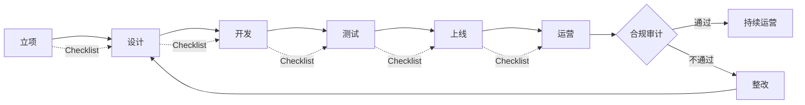

# [项目名称] - 合规清单

| 版本 | 日期 | 作者 | 说明 |
|------|------|------|------|
| 1.0 | YYYY-MM-DD | [Your Name] | 初始版本 |

---

> 📖 **填写指南**：本文档梳理项目涉及的法规要求，输出可作为开发、测试、运营合规检查依据的清单（≥ 30 项）。
>
> ⚠️ **适用范围**：所有商业项目都应产出（合规是底线）。
>
> 📌 **一页纸摘要**:
> 1. 看完这页能回答:项目涉及哪些法规?通用/行业/跨境合规点是什么?Checklist 有哪些?
> 2. 文档定位:调研级(合规),法规清单与检查表
> 3. 核心动作:法规梳理 + Checklist + 风险评级 + 审批流程
> 4. 何时使用:立项 / 开发 / 上线 / 运营 全周期合规检查
> 5. 不要用于:产品功能(→06)、技术选型(→13)
>
> 🔗 **关键引用**: `reference/12-value-matrix.md` (合规清单价值) · [`reference/13-quality-selfcheck.md`](../reference/13-quality-selfcheck.md) (合规自检) · [`reference/15-five-field-crosscheck.md`](../reference/15-five-field-crosscheck.md) (5 字段交叉) · [`reference/16-common-pitfalls.md`](../reference/16-common-pitfalls.md) (合规常见错误)

---

## 0. 填写指南

### 0.0 本文档价值

> **回答的核心问题**：
> 1. 项目涉及哪些法规？（1 适用法规）
> 2. 通用法规要求是什么？（2 通用法规）
> 3. 行业专项要求是什么？（3 行业专项）
> 4. 跨境/全球化要求是什么？（4 跨境全球化）
> 5. 等级保护要求是什么？（5 等级保护）
> 6. 项目具体的合规 Checklist 是什么？（6-9 各阶段 Checklist）
> 7. 风险等级如何？需要哪些审批？（10 风险评级）
>
> **集成上游**：本文档的法规版本由 `openPRD-chrome-devtools-integration` 验证时效性，避免使用过期法规。
>
> **不回答什么**：本项目功能设计（→06-PRD）、技术选型（→13-架构）
>
> **价值判定**：用户读完后能回答"我们要遵守哪些法规？如何做才合规？"

### 0.1 文档结构

| 板块 | 内容 | 必填 |
|------|------|------|
| **适用法规** | 法规清单 | ✅ |
| **通用法规** | PIPL/网络安全/数据安全 | ✅ |
| **行业专项** | 行业准入 | ✅（视行业）|
| **跨境全球化** | 跨境数据 | ✅（视场景）|
| **等级保护** | 等保 2-3 级 | ✅（视场景）|
| **设计/开发/运营/上线 Checklist** | ≥ 30 项 | ✅ |
| **风险评级** | 等级 + 应对 | ✅ |

### 0.2 合规维度

| 维度 | 适用范围 | 重点 |
|------|----------|------|
| **通用法规** | 所有项目 | 个人信息保护、数据安全、网安 |
| **行业准入** | 金融/医疗/教育/出版等 | 牌照、备案、许可 |
| **跨境全球化** | 涉及境外/港澳台 | 数据出境、GDPR |
| **等级保护** | 政企/金融/医疗 | 等保 2.0 二级/三级 |
| **行业专项** | 各行业 | 如：广告法、价格法、电商法 |

### 0.6 必含项自检

- [ ] ≥ 30 项 Checklist
- [ ] 所有法规版本已验证时效性
- [ ] 关键条款有引用（具体到条款号）
- [ ] 风险等级明确（高/中/低）
- [ ] 各阶段 Checklist 完整（设计/开发/运营/上线）

### 0.7 合规全生命周期



---

## 1. 适用法规识别

⭐ **关键决策**：
- **法规适用 4 维度**：项目类型（数据处理 / 内容 / 交易 / 社交）+ 行业（金融/医疗/教育）+ 用户范围（境内/跨境）+ 数据敏感度（一般/重要/敏感/核心）
- **必须先识别再开发**：合规清单在 PRD 阶段就产出，**不是上线前补**
- **高风险触发条件**（任一满足 → 强合规）：处理个人信息 > 100 万 / 跨境传输 / 涉及金融交易 / 医疗健康数据 / 未成年人数据

### 1.1 项目基本信息

| 维度 | 内容 |
|------|------|
| **项目类型** | [如：CRM 系统 / 电商平台 / 内容平台] |
| **所属行业** | [如：金融 / 医疗 / 政企 / 互联网] |
| **用户范围** | 国内 / 港澳台 / 海外 |
| **数据敏感度** | 一般 / 重要 / 敏感 / 核心 |
| **是否处理个人信息** | 是 / 否 |
| **是否跨境** | 是 / 否 |

### 1.2 适用法规清单

| # | 法规 | 适用条款 | 等级 | 验证时效 |
|---|------|----------|------|----------|
| 1 | 《个人信息保护法》 | 全部 | 必 | 2026-XX 验证 |
| 2 | 《数据安全法》 | 全部 | 必 | 2026-XX 验证 |
| 3 | 《网络安全法》 | 全部 | 必 | 2026-XX 验证 |
| 4 | 《关键信息基础设施安全保护条例》 | 视情况 | 视 | 2026-XX 验证 |
| 5 | [行业法规] | [条款] | 视 | 2026-XX 验证 |
| ... | | | | |

### 1.3 法规版本验证

> ⚠️ **重要**：所有引用的法规必须验证时效性，避免使用过期版本。

```javascript
// 使用 openPRD-chrome-devtools-integration 验证
// 1. 打开国家法律法规数据库 https://flk.npc.gov.cn
// 2. 搜索具体法规
// 3. 验证版本时效性
// 4. 提取关键条款
```

---

## 2. 通用法规（基础）

### 2.1 《个人信息保护法》（PIPL）

#### 2.1.1 适用范围

- 处理境内自然人个人信息
- 境外处理境内自然人个人信息（提供产品/服务/分析）

#### 2.1.2 关键义务

| 条款 | 要求 | 本项目实施 |
|------|------|------------|
| 第 13 条 | 处理个人信息的合法基础（同意/合同/法定义务等）| ✅ 用户协议 + 单独同意 |
| 第 14 条 | 同意应自愿、明确、具体 | ✅ 弹窗 + 勾选 |
| 第 17 条 | 告知处理目的、方式、范围 | ✅ 隐私政策 |
| 第 23 条 | 敏感个人信息需单独同意 | ✅ 人脸/身份证/位置单独同意 |
| 第 24 条 | 自动化决策需透明 + 可拒绝 | ✅ 用户可关闭推荐 |
| 第 27 条 | 不得过度收集 | ✅ 最小化原则 |
| 第 39 条 | 数据出境需通过安全评估/认证/标准合同 | 视情况 |
| 第 44 条 | 知情权、决定权、查询权、复制权、更正权、删除权 | ✅ 用户中心提供 |
| 第 51 条 | 采取相应的安全措施 | ✅ 加密 + 脱敏 + 审计 |
| 第 58 条 | 大型平台需建立个人信息保护独立机构 | 视情况 |

#### 2.1.3 用户权利实现

| 权利 | 条款 | 本项目功能 |
|------|------|------------|
| 知情权 | 第 44 条 | 隐私政策 + 弹窗 |
| 决定权 | 第 44 条 | 授权管理 |
| 查询权 | 第 45 条 | 我的数据 |
| 复制权 | 第 45 条 | 数据导出 |
| 更正权 | 第 46 条 | 资料修改 |
| 删除权 | 第 47 条 | 注销账户 |
| 可携带权 | - | 数据导出（JSON/CSV）|
| 解释权 | 第 48 条 | 算法解释（自动化决策）|

#### 2.1.4 合规 Checklist（个人信息保护）

- [ ] **数据收集**
  - [ ] 收集前明示告知（弹窗/协议）
  - [ ] 单独同意（敏感信息）
  - [ ] 最小化原则（不超范围）
  - [ ] 来源合法（不购买数据）
- [ ] **数据存储**
  - [ ] 加密存储（敏感信息）
  - [ ] 境内存储（涉及出境需评估）
  - [ ] 保留期限（超出删除）
  - [ ] 访问控制（最小权限）
- [ ] **数据使用**
  - [ ] 用途一致（不变相使用）
  - [ ] 自动化决策透明
  - [ ] 不歧视性使用
  - [ ] 第三方共享需同意
- [ ] **数据删除**
  - [ ] 注销后删除（除法律保留）
  - [ ] 撤回同意后停止处理
  - [ ] 第三方同步删除
  - [ ] 删除验证（不可恢复）
- [ ] **用户权利**
  - [ ] 知情（隐私政策）
  - [ ] 查询/复制（用户中心）
  - [ ] 更正/删除（用户中心）
  - [ ] 注销（5 个工作日）
  - [ ] 投诉举报（专门通道）

### 2.2 《数据安全法》

#### 2.2.1 关键义务

| 条款 | 要求 | 本项目实施 |
|------|------|------------|
| 第 21 条 | 数据分类分级保护 | ✅ 4 级分类 |
| 第 27 条 | 重要数据处理者义务 | 视情况 |
| 第 32 条 | 数据收集合法性 | ✅ 合法来源 |
| 第 36 条 | 外国司法/执法机构数据请求需经主管机关批准 | ✅ 合规审查 |

#### 2.2.2 数据分类分级

| 级别 | 定义 | 示例 | 保护措施 |
|------|------|------|----------|
| **核心** | 影响国家安全/公共利益 | - | 加密 + 审计 + 物理隔离 |
| **重要** | 影响组织/个人重大权益 | 身份证号、人脸 | 加密 + 访问控制 |
| **一般** | 涉及个人权益 | 手机号、姓名 | 加密 + 权限 |
| **其他** | 不涉及个人 | 公开数据 | 备份 |

### 2.3 《网络安全法》

#### 2.3.1 关键义务

| 条款 | 要求 | 本项目实施 |
|------|------|------------|
| 第 21 条 | 等级保护 | ✅ 等保三级（如适用）|
| 第 22 条 | 网络产品和服务安全 | ✅ 供应商审查 |
| 第 24 条 | 实名认证 | ✅ 手机号实名 |
| 第 27 条 | 禁止危害网络安全 | ✅ 内容审核 |
| 第 37 条 | 关键信息基础设施境内运营 | 视情况 |
| 第 41 条 | 个人信息保护 | 详见 2.1 |
| 第 42 条 | 不得泄露/篡改/毁损 | ✅ 加密 + 备份 |
| 第 47 条 | 网络安全事件应急预案 | ✅ 应急预案 |

#### 2.3.2 等保 2.0 要求（详见第 5 节）

---

## 3. 行业专项法规

### 3.1 [行业 1] - [法规名称]

#### 3.1.1 适用范围

[描述]

#### 3.1.2 关键义务

| 条款 | 要求 | 本项目实施 |
|------|------|------------|
| [条款] | [要求] | [实施] |
| [条款] | [要求] | [实施] |
| [条款] | [要求] | [实施] |

#### 3.1.3 行业专项 Checklist

- [ ] 行业准入资质（牌照/备案/许可）
- [ ] 行业数据规范（如：金融数据）
- [ ] 行业技术规范（如：医疗 HL7）
- [ ] 行业内容规范（如：广告法）
- [ ] 行业用户协议特殊条款
- [ ] 行业投诉处理机制

### 3.2 跨境/港澳台（如适用）

#### 3.2.1 跨境数据

- [ ] 数据出境安全评估（处理 100 万人以上）
- [ ] 标准合同（处理 10-100 万人）
- [ ] 个人信息保护认证（处理 < 10 万人）
- [ ] 申报/备案

#### 3.2.2 港澳台

- [ ] 港澳台个人信息公开规则
- [ ] 跨境数据流协议
- [ ] 两岸四地合规审查

### 3.3 海外（如适用）

- [ ] GDPR（欧盟用户）
- [ ] CCPA（加州用户）
- [ ] LGPD（巴西用户）
- [ ] 其他地区法规

---

## 4. 等级保护（等保 2.0）

⭐ **关键决策**：
- **等保 2 级**：一般企业内部系统、不存重要数据
- **等保 3 级**：处理 50-100 万个人信息 / 重要数据 / 金融/医疗/政府系统（**最常见**）
- **等保 4 级**：国家安全/公共安全关键信息基础设施（极少）
- **2 级系统可"自主保护"**，**3 级及以上必须公安备案 + 每年测评**

### 4.1 定级

| 项目 | 内容 |
|------|------|
| **等级** | 二级 / 三级 / 四级 |
| **理由** | [如：处理 XX 万用户个人信息 / 重要数据] |
| **备案** | 公安机关备案号 |

### 4.2 安全要求（等保三级）

| 类别 | 要求 | 实施 |
|------|------|------|
| **物理安全** | 机房、门禁、监控 | ✅ 阿里云/腾讯云 |
| **网络安全** | 边界防护、访问控制、入侵检测 | ✅ WAF + 防火墙 + IDS |
| **主机安全** | 身份鉴别、访问控制、审计 | ✅ SSH Key + sudo + auditd |
| **应用安全** | 身份鉴别、访问控制、SQL 注入防护 | ✅ RBAC + 参数化查询 |
| **数据安全** | 加密、备份、完整性 | ✅ AES-256 + 异地备份 |
| **安全管理** | 制度、人员、运维 | ✅ 安全团队 + 制度 |

### 4.3 测评要求

- [ ] 每年一次等级测评
- [ ] 整改不符合项
- [ ] 测评报告备案
- [ ] 重大变更重新测评

---

## 5. 数据保护 Checklist

### 5.1 数据生命周期合规

| 阶段 | 要求 | 本项目实施 | 状态 |
|------|------|------------|------|
| **收集** | 合法、最小、告知 | 弹窗 + 协议 | ✅ |
| **存储** | 加密、分类、备份 | AES-256 + 异地 | ✅ |
| **使用** | 范围一致、最小权限 | RBAC | ✅ |
| **传输** | 加密传输 | TLS 1.3 | ✅ |
| **共享** | 单独同意、协议 | 第三方协议 | ✅ |
| **删除** | 主动删除、不可恢复 | 物理删除 | ✅ |

### 5.2 个人信息保护 Checklist

- [ ] 隐私政策更新（每年）
- [ ] 用户协议更新
- [ ] Cookie 政策
- [ ] 单独同意机制
- [ ] 撤回同意机制
- [ ] 自动化决策解释
- [ ] 用户权利响应流程
- [ ] 数据保护影响评估（DPIA）

### 5.3 数据安全 Checklist

- [ ] 分类分级（4 级）
- [ ] 加密存储（敏感）
- [ ] 加密传输（全链路）
- [ ] 访问控制（最小权限）
- [ ] 审计日志（全留痕）
- [ ] 备份恢复（3-2-1 策略）
- [ ] 应急响应（预案 + 演练）
- [ ] 定期评估（每半年）

---

## 6. 设计阶段 Checklist

### 6.1 需求阶段

- [ ] 个人信息保护影响评估（PIPIA / DPIA）
- [ ] 法规适用性分析
- [ ] 数据流图（DFD）
- [ ] 风险评估报告
- [ ] 合规审批通过

### 6.2 架构设计

- [ ] 隐私设计（Privacy by Design）
- [ ] 默认隐私（Privacy by Default）
- [ ] 数据最小化设计
- [ ] 加密方案设计
- [ ] 访问控制设计
- [ ] 审计设计
- [ ] 等保方案设计
- [ ] 数据生命周期设计

### 6.3 用户体验设计

- [ ] 隐私政策可读性（< 1500 字）
- [ ] 同意弹窗设计
- [ ] 用户权利行使入口
- [ ] 撤回同意入口
- [ ] 投诉举报入口
- [ ] 注销流程设计

---

## 7. 开发阶段 Checklist

### 7.1 编码

- [ ] 输入校验（防 SQL 注入/XSS）
- [ ] 输出编码（防 XSS）
- [ ] 加密算法（不使用 MD5/SHA1）
- [ ] 密钥管理（使用 KMS）
- [ ] 密码存储（bcrypt/Argon2）
- [ ] 会话管理（超时 + 失效）
- [ ] 错误处理（不泄露敏感信息）

### 7.2 测试

- [ ] 安全测试（OWASP Top 10）
- [ ] 渗透测试（上线前）
- [ ] 漏洞扫描（每月）
- [ ] 性能测试（不影响安全）
- [ ] 合规测试（数据保护）
- [ ] 隐私测试（用户权利）

### 7.3 部署

- [ ] HTTPS 强制
- [ ] HSTS 启用
- [ ] 安全头（CSP/X-Frame-Options）
- [ ] 密钥配置（不硬编码）
- [ ] 审计日志启用
- [ ] 备份验证
- [ ] 灾备演练

---

## 8. 运营阶段 Checklist

### 8.1 日常运营

- [ ] 监控告警（异常访问/操作）
- [ ] 审计日志审查（每周）
- [ ] 漏洞修复（72 小时内）
- [ ] 安全事件响应（24 小时内）
- [ ] 备份验证（每月）
- [ ] 权限审查（每季度）
- [ ] 合规审计（每年）

### 8.2 用户服务

- [ ] 用户权利响应（5 个工作日）
- [ ] 投诉处理（15 个工作日）
- [ ] 隐私咨询（48 小时响应）
- [ ] 数据导出（7 个工作日）
- [ ] 账户注销（5 个工作日）

### 8.3 第三方管理

- [ ] 供应商安全评估
- [ ] 数据处理协议（DPA）
- [ ] 第三方合规审计
- [ ] 数据共享协议
- [ ] 退出机制

---

## 9. 上线/变更 Checklist

### 9.1 上线前

- [ ] 安全测试通过
- [ ] 渗透测试通过
- [ ] 合规审查通过
- [ ] 隐私政策更新
- [ ] 用户协议更新
- [ ] 应急预案就绪
- [ ] 客服培训完成
- [ ] 法务签字

### 9.2 变更

- [ ] 变更影响评估
- [ ] 隐私影响评估（如涉及个人信息）
- [ ] 用户通知（重大变更）
- [ ] 重新获得同意（如涉及新收集）
- [ ] 合规审批
- [ ] 重新测评（如涉及等保）

---

## 10. 风险评级

⭐ **关键决策**：**合规风险 4 象限**（可能性 × 影响）—— 拒绝"概率低就忽略"和"影响小就放过"两种极端。

```mermaid
quadrantChart
    title 合规风险 4 象限
    x-axis 低可能性 --> 高可能性
    y-axis 低影响 --> 高影响
    quadrant-1 高优(立即修复)
    quadrant-2 中优(季度计划)
    quadrant-3 监控(年度复评)
    quadrant-4 待评估
    PII明文存储: [0.6, 0.9]
    未成年人保护: [0.7, 0.85]
    跨境传输未报备: [0.5, 0.8]
    隐私政策未更新: [0.8, 0.4]
```


### 10.1 风险矩阵

| 风险 | 可能性 | 影响 | 等级 | 应对措施 |
|------|--------|------|------|----------|
| 个人信息泄露 | 中 | 高 | 🔴 高 | 加密 + 审计 + 应急 |
| 数据出境不合规 | 中 | 高 | 🔴 高 | 安全评估 + 合同 |
| 用户权利不响应 | 低 | 中 | 🟡 中 | 流程 + SLA |
| 监管处罚 | 中 | 高 | 🔴 高 | 法务 + 培训 |
| 等保不达标 | 低 | 高 | 🟡 中 | 测评 + 整改 |

### 10.2 审批流

| 等级 | 审批人 |
|------|--------|
| 🔴 高 | CEO + CTO + 法务总监 |
| 🟡 中 | CTO + 法务经理 |
| 🟢 低 | 项目经理 + 法务专员 |

### 10.3 应急预案

| 事件 | 响应时间 | 责任人 |
|------|----------|--------|
| 个人信息泄露 | 24h 内通知用户 + 72h 通知监管 | CISO + 法务 |
| 数据丢失 | 4h 恢复 | 运维 + DBA |
| 系统被攻击 | 1h 隔离 | 安全团队 |
| 监管检查 | 24h 配合 | 法务 + 合规 |

---

## 11. 法规更新追踪

| 法规 | 最新版本 | 生效日期 | 影响评估 | 行动项 |
|------|----------|----------|----------|--------|
| 《个人信息保护法》 | 2021-08-XX | 2021-11-01 | 已实施 | 持续监控 |
| 《数据出境安全评估办法》 | 2022-07-XX | 2022-09-01 | 视情况 | 评估 |
| ... | | | | |

---

## 12. 自检清单

### 12.1 完整性

- [ ] ≥ 30 项 Checklist
- [ ] 通用法规 + 行业专项 + 跨境 + 等保 5 类齐全
- [ ] 设计/开发/运营/上线 4 阶段齐全

### 12.2 数据严谨性

- [ ] 所有法规版本已验证时效性
- [ ] 关键条款有引用（具体到条款号）
- [ ] 风险等级已评估

### 12.3 决策可用性

- [ ] Checklist 可直接用于开发/测试/运营检查
- [ ] 风险应对有具体措施
- [ ] 审批流明确

---

**文档完成。** 后续详见：项目整体（02）→ 架构设计（13-含等保方案）→ 测试用例（07-含合规测试）。


## 摘要(降级输出,200 字内)

> 模板定位摘要(全受众可见)。完整定义见下方各章。
> 模板定位:0.0 本文档价值

**模板说明**:`[项目名称] - 合规清单`

**关键数字/对象**:见完整版

**完整版见**:`14-合规清单模板.md`(主受众可访问)
