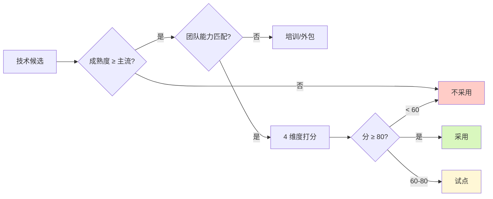

# [项目名称] - 技术趋势研究

| 版本 | 日期 | 作者 | 说明 |
|------|------|------|------|
| 1.0 | YYYY-MM-DD | [Your Name] | 初始版本 |

---

> 📖 **填写指南**：本文档研究项目涉及的 7 大技术领域（AI/云原生/前端/数据/安全/通信/国产化），输出技术成熟度矩阵和本项目选型建议。
>
> ⚠️ **适用范围**：所有技术项目都应产出（避免基于训练数据的过期 API）。
>
> 📌 **一页纸摘要**:
> 1. 看完这页能回答:7 大技术领域最新趋势是什么?成熟度如何?本项目该选什么技术?
> 2. 文档定位:调研级(技术),技术成熟度 + 选型建议
> 3. 核心动作:7 领域趋势 + 成熟度矩阵 + 选型建议 + 风险与应对
> 4. 何时使用:技术选型 / 架构评审 / 新技术评估
> 5. 不要用于:本项目架构(→13)、API 字段(→03)
>
> 🔗 **关键引用**: `reference/12-value-matrix.md` (技术趋势价值) · [`reference/13-quality-selfcheck.md`](../reference/13-quality-selfcheck.md) (技术自检) · [`reference/15-five-field-crosscheck.md`](../reference/15-five-field-crosscheck.md) (5 字段交叉) · [`reference/16-common-pitfalls.md`](../reference/16-common-pitfalls.md) (技术常见错误)

---

## 0. 填写指南

### 0.0 本文档价值

> **回答的核心问题**：
> 1. 7 大技术领域（AI/云原生/前端/数据/安全/通信/国产化）的最新趋势是什么？（2-8 各领域趋势）
> 2. 各技术的成熟度如何？（1 成熟度矩阵）
> 3. 本项目应该选什么技术？（9 选型建议）
> 4. 为什么选这些技术？理由是什么？（9.2 选型理由）
> 5. 有什么技术风险？（9.3 风险与应对）
>
> **集成上游**：本文档的库/框架版本由 `openPRD-context7-integration` 实时查询，确保使用最新 API。
>
> **不回答什么**：本项目具体技术架构（→13-架构）、接口设计（→03-接口）
>
> **价值判定**：用户读完后能回答"我们用什么技术？为什么？有什么风险？"

### 0.1 文档结构

| 板块 | 内容 | 必填 |
|------|------|------|
| **成熟度矩阵** | 7 领域 × 5 等级 | ✅ |
| **AI 与 LLM** | 大模型/Agent/MCP | ✅ |
| **云原生** | Serverless/容器/Service Mesh | ✅ |
| **前端与多端** | 框架/微前端/移动端 | ✅ |
| **数据与数据库** | NewSQL/时序/图 | ✅ |
| **安全合规** | 零信任/隐私计算 | ✅ |
| **通信协议** | WebSocket/QUIC/gRPC | ✅ |
| **国产化信创** | 芯片/OS/数据库/中间件 | ✅（视场景）|
| **本项目选型** | 推荐技术栈 + 理由 + 风险 | ✅ |

### 0.2 技术成熟度评级

| 等级 | 定义 | 建议 |
|------|------|------|
| **🚀 主流** | 大规模生产使用 | 放心用 |
| **⚡ 早期主流** | 部分公司使用，主流方向 | 试点 |
| **🧪 试验** | 小范围验证 | 关注 |
| **🔬 探索** | 学术界/前沿 | 调研 |
| **⚠️ 衰退** | 已被替代 | 避免 |

### 0.6 必含项自检

- [ ] 7 大领域齐全
- [ ] 每个领域 ≥ 3 个关键技术
- [ ] 成熟度矩阵完整
- [ ] 选型建议具体到版本
- [ ] 风险与应对措施

---

## 1. 技术成熟度矩阵

⭐ **关键决策**：
- **3 档成熟度**：🚀 主流（生产可用）/ ⚡ 早期主流（小范围试点）/ 🧪 试验（仅调研）
- **本项目建议 4 档**：✅ 使用 / ⚠️ 试点 / 🔬 调研 / ❌ 不采用
- **评估 3 维度**：成熟度 × 团队能力 × 业务价值（**任一维度低 → 降档**）
- **避免**："技术新 → 我们也要用"（不是选型的充分理由）

### 1.1 7 大领域 × 关键技术的成熟度

| 领域 | 技术 | 成熟度 | 本项目建议 |
|------|------|--------|------------|
| **AI 与 LLM** | GPT-4 / Claude / 通义千问 | 🚀 主流 | ✅ 使用 API |
| | 开源 LLM (Llama/Qwen) | ⚡ 早期主流 | ✅ 私有化场景 |
| | Agent 框架 (LangChain/AutoGen) | ⚡ 早期主流 | ⚠️ 试点 |
| | MCP (Model Context Protocol) | 🧪 试验 | 🔬 调研 |
| | RAG 增强检索 | ⚡ 早期主流 | ✅ 使用 |
| **云原生** | Kubernetes | 🚀 主流 | ✅ 使用 |
| | Serverless (Lambda/云函数) | ⚡ 早期主流 | ✅ 试点 |
| | Service Mesh (Istio) | ⚡ 早期主流 | ⚠️ 评估 |
| | 容器化 (Docker) | 🚀 主流 | ✅ 必用 |
| **前端** | React 18+ | 🚀 主流 | ✅ 使用 |
| | Vue 3 | 🚀 主流 | ✅ 使用 |
| | Next.js 14+ / Nuxt 3 | ⚡ 早期主流 | ✅ 使用 |
| | 微前端 (qiankun/MicroApp) | ⚡ 早期主流 | ⚠️ 评估 |
| | React Server Components | 🧪 试验 | 🔬 调研 |
| **数据** | PostgreSQL 15+ | 🚀 主流 | ✅ 使用 |
| | MySQL 8 | 🚀 主流 | ✅ 使用 |
| | Redis 7 | 🚀 主流 | ✅ 使用 |
| | ClickHouse | ⚡ 早期主流 | ✅ 大数据场景 |
| | 国产数据库 (OceanBase/TiDB) | ⚡ 早期主流 | ✅ 信创场景 |
| **安全** | 零信任架构 | ⚡ 早期主流 | ⚠️ 评估 |
| | 隐私计算 (联邦学习/MPC) | 🧪 试验 | 🔬 调研 |
| | WAF / RASP | 🚀 主流 | ✅ 必用 |
| **通信** | gRPC | 🚀 主流 | ✅ 内部服务 |
| | WebSocket | 🚀 主流 | ✅ 实时场景 |
| | Server-Sent Events (SSE) | ⚡ 早期主流 | ✅ 推送场景 |
| | QUIC / HTTP/3 | ⚡ 早期主流 | ⚠️ 评估 |
| **国产化** | 信创芯片 (鲲鹏/海光/飞腾) | ⚡ 早期主流 | ✅ 政企场景 |
| | 国产 OS (统信UOS/麒麟) | ⚡ 早期主流 | ✅ 政企场景 |
| | 国产数据库 | ⚡ 早期主流 | ✅ 政企场景 |
| | 国产中间件 (东方通/宝兰德) | ⚡ 早期主流 | ✅ 政企场景 |

### 1.2 趋势雷达图

```mermaid
%%{init: {"radar": {"polygon": true}} }%%
radar
    title 7 大技术领域对本项目的重要性
    axes ["AI/LLM", "云原生", "前端/多端", "数据/DB", "安全/合规", "通信协议", "国产化信创"]
    "重要性": [9, 8, 9, 9, 8, 7, 6]
    "成熟度": [8, 9, 9, 9, 8, 9, 6]
```

---

## 2. AI 与 LLM 趋势

⭐ **关键决策**：
- **3 选 1 策略**：通用场景 GPT-4o / Claude 4.5（能力最强）/ 国内场景 通义/文心/DeepSeek（合规）/ 私有化 Llama 4（数据敏感）
- **成本控制**：用小模型（Qwen 7B/14B）做 80% 任务 + 大模型做 20% 复杂任务
- **RAG vs Fine-tune**：**优先 RAG**（数据更新快、成本低、可解释），仅在垂直领域术语密集时用 Fine-tune
- **Agent 框架**：2026 仍处早期，**小范围试点**，避免大规模生产

### 2.1 大模型发展现状

| 模型 | 提供方 | 上下文 | 能力 | 成本 | 适用 |
|------|--------|--------|------|------|------|
| GPT-4o | OpenAI | 128K | 多模态 | 中 | 通用 |
| Claude 4.5 | Anthropic | 200K | 推理 | 中 | 复杂任务 |
| 通义千问 Qwen3 | 阿里 | 128K | 中文优 | 低 | 国内 |
| 文心一言 4.0 | 百度 | 128K | 中文优 | 低 | 国内 |
| DeepSeek V3 | DeepSeek | 64K | 推理 | 低 | 国内 |
| Llama 4 | Meta | 128K | 开源 | 自建 | 私有化 |

**来源**：[context7 实时查询](https://context7.com) - 2026-XX 验证

### 2.2 Agent 框架

| 框架 | 特点 | 成熟度 | 适用 |
|------|------|--------|------|
| LangChain | 最早、生态全 | ⚡ 早期主流 | 复杂应用 |
| LlamaIndex | RAG 强 | ⚡ 早期主流 | 检索场景 |
| AutoGen (微软) | 多 Agent | ⚡ 早期主流 | 协作场景 |
| CrewAI | 角色化 | 🧪 试验 | 简单协作 |
| LangGraph | 工作流 | ⚡ 早期主流 | 状态机 |

### 2.3 MCP (Model Context Protocol)

> **2026 最新趋势**：Anthropic 提出的 MCP 协议正在成为 Agent 与工具/数据源连接的标准。

- **优势**：标准化、安全、跨模型
- **成熟度**：🧪 试验 → ⚡ 早期主流
- **本项目建议**：🔬 调研，关注发展

### 2.4 RAG vs 微调

| 维度 | RAG | 微调 |
|------|-----|------|
| 成本 | 低 | 高 |
| 时效性 | 实时 | 滞后 |
| 数据量 | 小 | 大 |
| 适用 | 知识库、客服 | 风格、专业领域 |
| 本项目 | ✅ 优先 | ⚠️ 评估 |

### 2.5 选型建议

- **首选**：国内大模型 API（合规、成本）
- **私有化**：开源模型（Llama/Qwen）+ GPU 集群
- **RAG**：先 RAG 后微调
- **Agent**：从简单 Agent 开始，避免过度设计

---

## 3. 云原生趋势

### 3.1 容器编排

| 技术 | 成熟度 | 优势 | 适用 |
|------|--------|------|------|
| Kubernetes | 🚀 主流 | 生态成熟 | 大规模 |
| Docker Swarm | ⚠️ 衰退 | 简单 | 小规模 |
| Nomad | ⚡ 早期主流 | 轻量 | 中小规模 |

### 3.2 Serverless

| 平台 | 成熟度 | 优势 | 限制 |
|------|--------|------|------|
| AWS Lambda | 🚀 主流 | 成熟、冷启动快 | 厂商绑定 |
| 阿里云函数计算 | ⚡ 早期主流 | 国内、合规 | 生态弱 |
| 腾讯云 SCF | ⚡ 早期主流 | 微信生态 | 场景有限 |
| Vercel | ⚡ 早期主流 | 前端友好 | 仅边缘 |

### 3.3 Service Mesh

| 方案 | 成熟度 | 复杂度 | 适用 |
|------|--------|--------|------|
| Istio | ⚡ 早期主流 | 高 | 大型 |
| Linkerd | ⚡ 早期主流 | 中 | 中型 |
| Consul Connect | ⚡ 早期主流 | 中 | 多语言 |

### 3.4 可观测性

| 工具 | 类型 | 特点 |
|------|------|------|
| Prometheus | 监控 | 标准 |
| Grafana | 可视化 | 生态强 |
| Loki | 日志 | 轻量 |
| Tempo / Jaeger | 链路追踪 | 标准 |
| OpenTelemetry | 标准 | 跨平台 |

### 3.5 选型建议

- **编排**：Kubernetes（必选）
- **Serverless**：评估后选择（成本/性能）
- **Mesh**：中小规模不上，大规模评估
- **可观测性**：Prometheus + Grafana + Loki + Tempo

---

## 4. 前端与多端趋势

### 4.1 框架对比

| 框架 | 成熟度 | 学习曲线 | 生态 | 适用 |
|------|--------|----------|------|------|
| React 18+ | 🚀 主流 | 中 | 最强 | 通用 |
| Vue 3 | 🚀 主流 | 低 | 强 | 国内首选 |
| Svelte 5 | ⚡ 早期主流 | 低 | 弱 | 小项目 |
| Solid.js | ⚡ 早期主流 | 中 | 弱 | 性能优先 |
| Angular 18+ | ⚡ 早期主流 | 高 | 强 | 大型政企 |

### 4.2 元框架

| 框架 | 特点 | 成熟度 | 适用 |
|------|------|--------|------|
| Next.js 15+ | React 元框架 | ⚡ 早期主流 | SSR/SSG |
| Nuxt 3 | Vue 元框架 | ⚡ 早期主流 | SSR/SSG |
| Remix | 全栈 | ⚡ 早期主流 | 全栈 |
| SvelteKit | Svelte 元框架 | ⚡ 早期主流 | 轻量 |

### 4.3 微前端

| 方案 | 成熟度 | 适用 |
|------|--------|------|
| qiankun | ⚡ 早期主流 | 阿里系 |
| MicroApp | ⚡ 早期主流 | 京东系 |
| Module Federation | ⚡ 早期主流 | Webpack 5 |
| wujie | ⚡ 早期主流 | 腾讯系 |

### 4.4 移动端

| 方案 | 成熟度 | 适用 |
|------|--------|------|
| React Native | ⚡ 早期主流 | 跨平台 |
| Flutter | ⚡ 早期主流 | 高性能 |
| uni-app | 🚀 主流 | 国内多端 |
| Taro | 🚀 主流 | 京东系 |
| 原生（Swift/Kotlin） | 🚀 主流 | 极致体验 |

### 4.5 性能优化

- **首屏**：SSR/SSG + 骨架屏 + 预加载
- **包体积**：Tree Shaking + Code Splitting + 懒加载
- **运行时**：虚拟列表 + 防抖节流 + Web Worker
- **网络**：HTTP/3 + Brotli + CDN

### 4.6 选型建议

- **主框架**：React 18+ 或 Vue 3（看团队）
- **元框架**：Next.js/Nuxt 3（如需 SSR）
- **微前端**：复杂业务评估，简单业务不上
- **移动端**：H5 优先，复杂场景用 uni-app

---

## 5. 数据与数据库趋势

### 5.1 关系型数据库

| 数据库 | 成熟度 | 优势 | 适用 |
|--------|--------|------|------|
| PostgreSQL 15+ | 🚀 主流 | 强、标准 | 通用首选 |
| MySQL 8 | 🚀 主流 | 成熟、生态 | 通用 |
| OceanBase | ⚡ 早期主流 | 分布式、高性能 | 大规模 |
| TiDB | ⚡ 早期主流 | HTAP | 大规模 |
| openGauss | ⚡ 早期主流 | 国产 | 信创 |

### 5.2 NoSQL

| 类型 | 数据库 | 成熟度 | 适用 |
|------|--------|--------|------|
| KV | Redis 7 | 🚀 主流 | 缓存 |
| 文档 | MongoDB | ⚠️ 衰退 | 内容 |
| 文档 | PostgreSQL JSONB | 🚀 主流 | 替代 Mongo |
| 搜索 | Elasticsearch | ⚡ 早期主流 | 全文搜索 |
| 时序 | InfluxDB / TDengine | ⚡ 早期主流 | 时序数据 |
| 图 | Neo4j | ⚡ 早期主流 | 关系图 |

### 5.3 大数据

| 方案 | 成熟度 | 适用 |
|------|--------|------|
| ClickHouse | ⚡ 早期主流 | OLAP 首选 |
| Apache Doris | ⚡ 早期主流 | 国产 OLAP |
| StarRocks | ⚡ 早期主流 | 实时数仓 |
| Snowflake | 🚀 主流 | 云数仓 |
| Apache Hudi / Iceberg | ⚡ 早期主流 | 数据湖 |

### 5.4 选型建议

- **OLTP**：PostgreSQL 15+ 或 MySQL 8
- **缓存**：Redis 7
- **搜索**：Elasticsearch
- **OLAP**：ClickHouse
- **时序**：TDengine（国产）
- **信创**：OceanBase / openGauss

---

## 6. 安全合规趋势

### 6.1 零信任架构

- **理念**：永不信任，持续验证
- **核心**：身份认证 + 设备验证 + 最小权限
- **成熟度**：⚡ 早期主流
- **本项目建议**：⚠️ 大型企业评估

### 6.2 隐私计算

| 技术 | 成熟度 | 适用 |
|------|--------|------|
| 联邦学习 | 🧪 试验 | AI 训练 |
| 多方安全计算（MPC） | 🧪 试验 | 数据共享 |
| 可信执行环境（TEE） | ⚡ 早期主流 | 数据处理 |
| 差分隐私 | 🧪 试验 | 统计发布 |

### 6.3 密钥管理

- **KMS**：阿里云/腾讯云/AWS KMS
- **HSM**：硬件加密机
- **Vault**：开源密钥管理

### 6.4 选型建议

- **认证**：OAuth 2.0 + OIDC
- **API 网关**：Kong / APISIX
- **WAF**：阿里云/腾讯云 WAF
- **密钥管理**：云 KMS
- **审计**：全链路日志

---

## 7. 通信协议趋势

### 7.1 内部通信

| 协议 | 成熟度 | 优势 | 适用 |
|------|--------|------|------|
| gRPC | 🚀 主流 | 高性能、跨语言 | 微服务 |
| HTTP/JSON | 🚀 主流 | 简单、生态 | 通用 |
| Thrift | ⚠️ 衰退 | - | - |
| Dubbo | ⚡ 早期主流 | Java 生态 | 国内 Java |

### 7.2 实时通信

| 协议 | 成熟度 | 适用 |
|------|--------|------|
| WebSocket | 🚀 主流 | 双向实时 |
| Server-Sent Events (SSE) | ⚡ 早期主流 | 单向推送 |
| MQTT | 🚀 主流 | IoT |
| QUIC / HTTP/3 | ⚡ 早期主流 | 低延迟 |

### 7.3 消息队列

| 队列 | 成熟度 | 优势 | 适用 |
|------|--------|------|------|
| Apache Kafka | 🚀 主流 | 高吞吐 | 大数据 |
| RabbitMQ | ⚡ 早期主流 | 灵活 | 复杂路由 |
| RocketMQ | ⚡ 早期主流 | 国产 | 金融级 |
| Apache Pulsar | ⚡ 早期主流 | 云原生 | 大规模 |
| Redis Streams | 🚀 主流 | 轻量 | 小规模 |

### 7.4 选型建议

- **内部**：gRPC（性能）/ HTTP（通用）
- **实时**：WebSocket（双向）/ SSE（单向）
- **队列**：Kafka（大数据）/ RocketMQ（金融）
- **IoT**：MQTT

---

## 8. 国产化信创趋势

### 8.1 信创全景

| 层级 | 国产方案 | 成熟度 |
|------|----------|--------|
| **芯片** | 鲲鹏 / 海光 / 飞腾 / 龙芯 | ⚡ 早期主流 |
| **操作系统** | 统信 UOS / 麒麟 / 欧拉 | ⚡ 早期主流 |
| **数据库** | OceanBase / TiDB / openGauss / 达梦 / 人大金仓 | ⚡ 早期主流 |
| **中间件** | 东方通 / 宝兰德 / 中创 | ⚡ 早期主流 |
| **应用服务器** | 东方通 TongWeb / 普元 | ⚡ 早期主流 |
| **浏览器** | 360 / 奇安信 / 红芯 | ⚡ 早期主流 |

### 8.2 政策驱动

- **2+8 行业**：2（党政）+ 8（金融/电信/电力/石油/交通/教育/医疗/航空）
- **时间表**：2027 年央国企 100% 信创
- **影响**：涉及政企的项目必须考虑

### 8.3 选型建议

- **场景判断**：是否涉及信创
- **如需信创**：选择"国测"认证的产品
- **兼容性测试**：在信创环境完整测试
- **双轨策略**：X86 + 信创 双架构

---

## 9. 本项目选型建议

⭐ **关键决策**：
- **选型 4 维度打分**：技术成熟度（30%）+ 团队能力匹配（30%）+ 业务价值（25%）+ 维护成本（15%）
- **必须 ≥ 80 分才采用**（60-80 试点，< 60 不采用）
- **避免供应商绑定**：核心系统至少 2 个备选方案
- **技术债预警**：每季度回顾"已采用"清单，淘汰落后技术




### 9.1 推荐技术栈

#### 9.1.1 前端

| 层 | 技术 | 版本 | 理由 |
|----|------|------|------|
| 框架 | React | 18+ | 生态最强 |
| 元框架 | Next.js | 15+ | SSR + 路由 |
| UI | Ant Design | 5+ | 企业级 |
| 状态 | Zustand / Redux Toolkit | - | 视复杂度 |
| 工具 | Vite | 5+ | 构建快 |
| 移动端 | uni-app | - | 跨端 |

#### 9.1.2 后端

| 层 | 技术 | 版本 | 理由 |
|----|------|------|------|
| 语言 | Node.js | 20 LTS / Python 3.12 | 团队栈 |
| 框架 | NestJS / FastAPI | - | 企业级 |
| 数据库 | PostgreSQL | 15+ | 强、标准 |
| 缓存 | Redis | 7 | 主流 |
| 队列 | RabbitMQ / RocketMQ | - | 视规模 |
| 搜索 | Elasticsearch | 8+ | 全文 |

#### 9.1.3 基础设施

| 层 | 技术 | 理由 |
|----|------|------|
| 容器 | Docker + Kubernetes | 标准 |
| CI/CD | GitHub Actions / GitLab CI | 标准 |
| 监控 | Prometheus + Grafana | 标准 |
| 日志 | Loki + Promtail | 轻量 |
| 链路追踪 | OpenTelemetry + Tempo | 标准 |

#### 9.1.4 AI 能力

| 能力 | 选型 | 理由 |
|------|------|------|
| 通用 LLM | 通义千问 Qwen3 | 国内、合规 |
| 私有化 | Qwen2.5 / Llama 3 | 开源 |
| Agent | LangChain | 生态全 |
| RAG | LlamaIndex | 检索强 |
| 嵌入 | bge-large | 中文强 |

### 9.2 选型理由

| 维度 | 选择 | 理由 |
|------|------|------|
| **性能** | PostgreSQL + Redis | 性能足够 |
| **成本** | Serverless + 国内云 | 成本可控 |
| **合规** | 国内云 + 信创 | 满足要求 |
| **生态** | React + NestJS | 招人容易 |
| **可维护** | 主流技术 | 长期支持 |

### 9.3 风险与应对

| 风险 | 等级 | 应对 |
|------|------|------|
| 框架版本快速迭代 | 🟡 中 | 锁定主版本，定期升级 |
| LLM 成本高 | 🟡 中 | RAG + 缓存 + 限流 |
| 信创兼容性 | 🟡 中 | 双轨测试 + 兼容性认证 |
| 技术债务 | 🟢 低 | 重构周期 |

---

## 10. 自检清单

### 10.1 完整性

- [ ] 7 大领域齐全
- [ ] 每个领域 ≥ 3 个关键技术
- [ ] 成熟度矩阵完整

### 10.2 数据严谨性

- [ ] 关键库/框架版本已 context7 验证
- [ ] 12 个月内的数据为主
- [ ] 来源可追溯

### 10.3 决策可用性

- [ ] 选型具体到版本
- [ ] 选型理由明确
- [ ] 风险与应对有具体措施

---

**文档完成。** 后续详见：架构设计（13-含本项目选型）→ 接口文档（03-含 API 规范）→ 测试用例（07-含兼容性测试）。


## 摘要(降级输出,200 字内)

> 模板定位摘要(全受众可见)。完整定义见下方各章。
> 模板定位:0.0 本文档价值

**模板说明**:`[项目名称] - 技术趋势研究`

**关键数字/对象**:见完整版

**完整版见**:`14-技术趋势模板.md`(主受众可访问)
