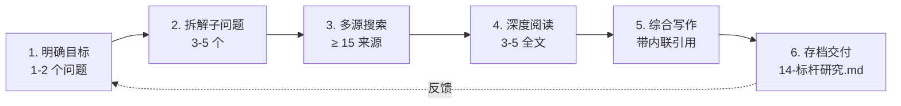
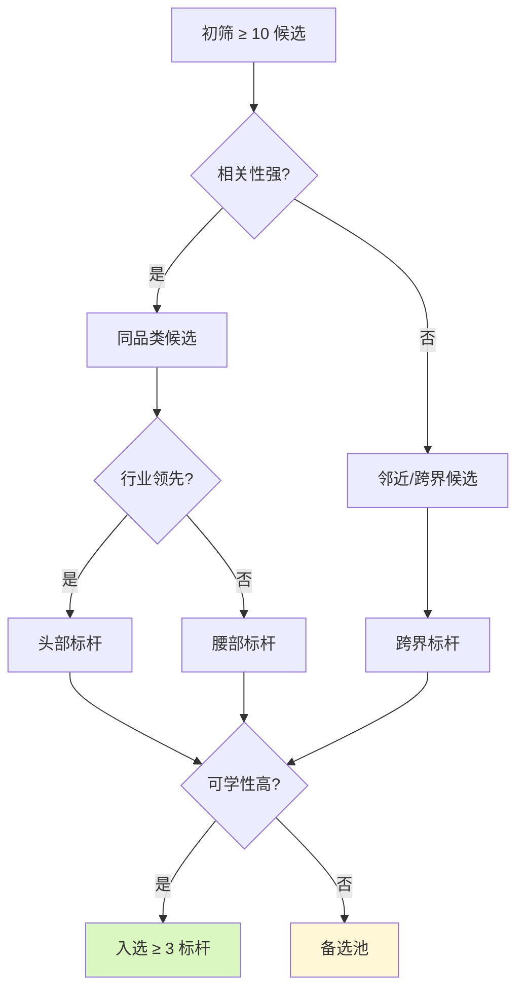
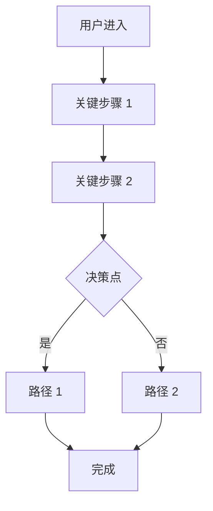

# [行业/品类] - 标杆研究

| 版本 | 日期 | 作者 | 说明 |
|------|------|------|------|
| 1.0 | YYYY-MM-DD | [Your Name] | 初始版本 |

---

> 📖 **填写指南**：本文档深度研究 3-5 个行业标杆（含跨界），提炼可复用的最佳实践，为本项目的产品设计和技术选型提供参考。
>
> ⚠️ **适用范围**：复杂项目、跨行业项目、需要快速学习的领域。
>
> 📌 **一页纸摘要**:
> 1. 看完这页能回答:谁是我们的标杆?他们的最佳实践是什么?对我有什么启示?
> 2. 文档定位:调研级,行业标杆深度研究
> 3. 核心动作:标杆选择 + 标杆档案 + 横向对比 + 最佳实践 + 启示
> 4. 何时使用:复杂项目立项 / 跨行业借鉴 / 产品/技术决策
> 5. 不要用于:本项目功能(→06)、技术选型(→13)
>
> 🔗 **关键引用**: `reference/12-value-matrix.md` (标杆研究价值) · [`reference/13-quality-selfcheck.md`](../reference/13-quality-selfcheck.md) (研究自检) · [`reference/15-five-field-crosscheck.md`](../reference/15-five-field-crosscheck.md) (5 字段交叉) · [`reference/16-common-pitfalls.md`](../reference/16-common-pitfalls.md) (调研常见错误)

---

## 0. 填写指南

### 0.0 本文档价值

> **回答的核心问题**：
> 1. 谁是我们的标杆？为什么选他们？（1 标杆选择）
> 2. 每个标杆的详细研究（产品/技术/运营/数据）是什么？（2-4 标杆档案）
> 3. 标杆之间的横向对比如何？（5 横向对比）
> 4. 标杆的最佳实践有哪些可复用？（6 最佳实践）
> 5. 这些实践对本项目有什么具体启示？（7 启示）
> 6. 数据来源是否可靠？置信度如何？（8 置信度）
>
> **集成上游**：本文档的所有"数据/事实/案例"由 `openPRD-deep-research` 6 步法深度研究支撑，确保专业性。
>
> **不回答什么**：本项目具体功能（→06-PRD）、技术选型（→13-架构）
>
> **价值判定**：用户读完后能回答"行业里谁做得好？好在哪？我们可以学什么？"

### 0.1 文档结构

| 板块 | 内容 | 必填 |
|------|------|------|
| **标杆选择** | 选择标准 + 标杆清单 | ✅ |
| **标杆档案** | ≥ 3 个标杆详细研究 | ✅ |
| **横向对比** | 维度对比 | ✅ |
| **最佳实践** | 可复用模式 | ✅ |
| **本项目启示** | 具体可执行建议 | ✅ |
| **置信度评级** | 数据可靠性 | ✅ |

### 0.2 标杆选择标准

| 维度 | 标准 | 权重 |
|------|------|------|
| **相关性** | 与本项目品类相同或邻近 | 30% |
| **领先性** | 行业头部 / 创新引领者 | 25% |
| **可学性** | 实践可复用、文档公开 | 20% |
| **数据可获得** | 公开资料丰富 | 15% |
| **差异性** | 不同模式都有代表 | 10% |

### 0.3 标杆研究 6 步法（深度研究方法论）

| 步骤 | 动作 | 输出 |
|------|------|------|
| 1. 明确目标 | 1-2 个澄清问题 | 研究范围 |
| 2. 拆解子问题 | 3-5 个子问题 | 研究大纲 |
| 3. 多源搜索 | ≥ 15 个来源 | 原始资料 |
| 4. 深度阅读 | 抓 3-5 个全文 | 关键信息 |
| 5. 综合写作 | 带内联引用 | 研究报告 |
| 6. 存档交付 | 14-标杆研究.md | 最终文档 |

### 0.6 必含项自检

- [ ] ≥ 3 个标杆（每个含 5 维度研究：产品/技术/运营/数据/团队）
- [ ] ≥ 15 个来源
- [ ] 60%+ 来源在 12 个月内
- [ ] ≥ 3 个可复用的最佳实践
- [ ] ≥ 5 条对本项目的具体启示
- [ ] 数据置信度评级（A/B/C/D）

### 0.7 标杆研究流程



---

## 1. 标杆选择

⭐ **关键决策**：
- **初筛 ≥ 10 个**（3 类各 ≥ 3：同品类头部 / 同品类腰部 / 邻近品类头部 + 跨界标杆）
- **综合分 = 相关性 × 0.4 + 领先性 × 0.4 + 可学性 × 0.2**（不要平均权重）
- **最终 ≥ 3 个**：1 个直接对标 + 1 个创新借鉴 + 1 个跨界启发
- **避免**："只挑行业第一" → 学不到东西；"只挑小厂" → 没有标杆价值



### 1.1 候选清单（≥ 10 个初筛）

| 候选 | 类型 | 相关性 | 领先性 | 可学性 | 综合分 | 选择 |
|------|------|--------|--------|--------|--------|------|
| 标杆 1 | 同品类头部 | 9 | 9 | 8 | 8.7 | ✅ |
| 标杆 2 | 同品类腰部 | 8 | 6 | 9 | 7.7 | ✅ |
| 标杆 3 | 邻近品类头部 | 6 | 9 | 7 | 7.3 | ✅ |
| 标杆 4 | 同品类创新者 | 9 | 8 | 6 | 7.7 | ⚠️ 备选 |
| 标杆 5 | 跨界标杆 | 5 | 9 | 9 | 7.7 | ⚠️ 备选 |
| ... | | | | | | |

### 1.2 最终选择（≥ 3 个）

| 标杆 | 选择理由 | 类型 |
|------|----------|------|
| 标杆 A | 行业第一，相关性最强 | 同品类头部 |
| 标杆 B | 创新引领者，模式可学 | 同品类创新者 |
| 标杆 C | 不同模式，对比参考 | 同品类差异化 |

---

## 2. 标杆 A - [名称] 详细研究

### 2.1 基础档案

| 维度 | 内容 | 来源 |
|------|------|------|
| **公司名称** | [名称] | [官网](URL) |
| **成立时间** | YYYY | 维基百科 |
| **创始人** | [姓名] | 公开资料 |
| **融资情况** | A/B/C/D/IPO | Crunchbase |
| **团队规模** | XX 人 | LinkedIn |
| **主要市场** | [国家/地区] | 公司简介 |
| **MAU/DAU** | XX 万 | 公开演讲 |
| **ARR/营收** | XX 亿美元 | 财报/年报 |

### 2.2 产品深度研究

#### 2.2.1 产品定位

```
[标杆 A] 是 [品类] 赛道的 [定位] 玩家，
面向 [目标用户] 提供 [核心服务]，
核心差异化在于 [差异化点 1] + [差异化点 2] + [差异化点 3]。
```

#### 2.2.2 核心功能拆解

| 模块 | 核心功能 | 详细描述 |
|------|----------|----------|
| [模块 1] | [功能] | [具体描述] |
| [模块 1] | [功能] | [具体描述] |
| [模块 2] | [功能] | [具体描述] |
| ... | ... | ... |

#### 2.2.3 关键产品流程



#### 2.2.4 用户体验亮点

- **亮点 1**：[如：onboarding 引导做得极好，转化率 XX%]
- **亮点 2**：[如：核心操作 3 步内完成]
- **亮点 3**：[如：空状态有引导]

### 2.3 技术深度研究

#### 2.3.1 技术栈

| 层 | 技术 | 推断依据 |
|----|------|----------|
| 前端 | React + Next.js | Wappalyzer |
| 后端 | Go + gRPC | 招聘信息 |
| 数据库 | PostgreSQL + Redis | 公开演讲 |
| 大数据 | Spark + Kafka | 技术博客 |
| AI | PyTorch + 自研 LLM | 论文 |
| 部署 | AWS + Kubernetes | 招聘 |

#### 2.3.2 架构亮点

- **亮点 1**：[如：Serverless 架构降低运营成本 40%]
- **亮点 2**：[如：多区域部署，P99 延迟 < 100ms]
- **亮点 3**：[如：自研数据库中间件，支撑千万 QPS]

#### 2.3.3 技术债务（如公开）

- [技术债务 1]：[描述] - **影响**：[范围]
- [技术债务 2]：[描述] - **影响**：[范围]

### 2.4 运营深度研究

#### 2.4.1 增长策略

| 阶段 | 策略 | 效果 |
|------|------|------|
| 0-1 | SEO + 内容营销 | 月增 XX 用户 |
| 1-10 | 渠道代理 + 大客户直销 | 月增 XX 用户 |
| 10-100 | 平台化 + 生态 | 月增 XX 用户 |

#### 2.4.2 用户运营

- **留存策略**：[如：每日签到 + 等级体系 + 积分商城]
- **拉新策略**：[如：裂变分享 + 推荐有礼]
- **活跃策略**：[如：任务系统 + 排行榜]

#### 2.4.3 商业化路径

| 阶段 | 模式 | ARR |
|------|------|-----|
| 0-1 | 免费 | 0 |
| 1-10 | 订阅 | XX 万 |
| 10-100 | 平台抽佣 | XX 千万 |
| 100+ | 生态 | XX 亿 |

### 2.5 数据深度研究

| 指标 | 数值 | 同比 | 环比 | 来源 |
|------|------|------|------|------|
| MAU | XX 万 | +XX% | +XX% | 季报 |
| DAU | XX 万 | +XX% | +XX% | 季报 |
| 付费率 | XX% | +XXpp | -XXpp | 季报 |
| ARPU | ¥XX | +XX% | -XX% | 季报 |
| LTV | ¥XX | - | - | 公开演讲 |
| CAC | ¥XX | - | - | 公开演讲 |
| LTV/CAC | XX | - | - | 计算 |

### 2.6 团队与文化

| 维度 | 内容 |
|------|------|
| **团队规模** | XX 人（研发 XX、产品 XX、运营 XX、销售 XX）|
| **核心文化** | [如：工程师文化 / 客户成功文化 / 数据驱动] |
| **关键决策** | [如：早期聚焦中小企业，后期拓展大客户] |
| **踩过的坑** | [如：曾尝试硬件方向，损失 XX 万] |

### 2.7 关键洞察

> **我们能从标杆 A 学到的 3 件事**：

1. **[洞察 1]**：[具体洞察] - **本项目可借鉴**：[具体行动]
2. **[洞察 2]**：[具体洞察] - **本项目可借鉴**：[具体行动]
3. **[洞察 3]**：[具体洞察] - **本项目可借鉴**：[具体行动]

> **我们不能学的 1 件事**：

1. **[反例 1]**：[具体反例] - **原因**：[为什么不适合]

---

## 3. 标杆 B - [名称] 详细研究

> 同 2 模板

---

## 4. 标杆 C - [名称] 详细研究

> 同 2 模板

---

## 5. 横向对比

### 5.1 维度对比表

| 维度 | 标杆 A | 标杆 B | 标杆 C | 行业平均 | 本项目 |
|------|--------|--------|--------|----------|--------|
| **产品定位** | 高端通用 | 中端垂直 | 低端通用 | - | [定位] |
| **核心功能** | 完整 | 核心 | 基础 | - | [范围] |
| **价格** | 高 | 中 | 低 | - | [定价] |
| **技术栈** | 现代 | 传统 | 现代 | - | [选型] |
| **用户规模** | 大 | 中 | 大 | - | [目标] |
| **商业模式** | 订阅 | 订阅+服务 | 免费增值 | - | [模式] |
| **核心优势** | 品牌 | 行业 | 流量 | - | [优势] |
| **核心劣势** | 价格 | 规模 | 商业化 | - | [劣势] |

### 5.2 可比指标雷达图

```mermaid
%%{init: {"radar": {"polygon": true}} }%%
radar
    title 标杆能力对比
    axes ["产品力", "技术力", "运营力", "商业化", "增长力", "品牌力"]
    "标杆A": [9, 8, 7, 8, 9, 10]
    "标杆B": [7, 6, 9, 7, 6, 5]
    "标杆C": [6, 7, 8, 5, 9, 7]
    "本项目": [7, 7, 6, 5, 6, 4]
```

### 5.3 关键发现

1. **产品力**：标杆 A 最强，我们需要追赶
2. **技术力**：标杆 A 领先，本项目应聚焦差异化
3. **运营力**：标杆 B/C 强，本项目应学习
4. ...

---

## 6. 最佳实践提炼

⭐ **关键决策**：
- **可复用性三档**：高（直接抄，1 周内可落地）/ 中（需要改造，1 月内可落地）/ 低（仅参考方向）
- **必含 4 类实践**：产品功能 / UX 细节 / 技术架构 / 商业模式
- **每类 ≥ 3 条**：避免"提炼 1 条就完事"
- **避坑**：禁止"标杆这么做，我们也要这么做" — 必须回答"为什么我们适用"

### 6.1 产品最佳实践

| 实践 | 标杆 | 描述 | 可复用性 |
|------|------|------|----------|
| Onboarding 引导 | A | 3 步内完成新手引导 | 高 |
| 空状态设计 | A | 都有引导文案+CTA | 高 |
| 关键操作 3 步原则 | B | 减少路径 | 中 |
| 个性化推荐 | A/C | 千人千面 | 中 |

### 6.2 技术最佳实践

| 实践 | 标杆 | 描述 | 可复用性 |
|------|------|------|----------|
| Serverless 降本 | A | 成本降低 40% | 高 |
| 多区域部署 | A | P99 < 100ms | 中（视规模）|
| 自研 LLM | A | 行业模型 | 低（成本高）|
| 中台化 | B | 复用能力 | 中 |

### 6.3 运营最佳实践

| 实践 | 标杆 | 描述 | 可复用性 |
|------|------|------|----------|
| 裂变分享 | C | 邀请有礼 | 高 |
| 任务系统 | A/B | 提升活跃 | 高 |
| 等级体系 | A | 提升付费 | 中 |
| 客户成功 | B | 提升续费 | 高 |

### 6.4 商业化最佳实践

| 实践 | 标杆 | 描述 | 可复用性 |
|------|------|------|----------|
| 免费增值 | A/C | 拉新 → 转化 | 高 |
| 订阅分级 | A/B/C | 4-5 档 | 高 |
| 企业版 | A/B | 高客单 | 中 |
| 平台抽佣 | A | 生态化 | 低（视场景）|

---

## 7. 对本项目的启示

⭐ **关键决策**：
- **3 层落地路径**：立即做（1 周内） / 短期做（1 季度内） / 长期做（半年以上）
- **资源约束评估**：每条启示标注所需资源（人力/预算/技术依赖）
- **成功指标**：每条启示配 1 个可量化指标（如"实施后转化率提升 5%"）


### 7.1 产品设计启示

| 启示 | 来源 | 行动项 | 优先级 |
|------|------|--------|--------|
| 优化 onboarding | 标杆 A | 设计 3 步引导 | P0 |
| 空状态统一 | 标杆 A | 设计空状态组件库 | P1 |
| 关键路径 ≤ 3 步 | 标杆 B | 重构核心流程 | P1 |

### 7.2 技术选型启示

| 启示 | 来源 | 行动项 | 优先级 |
|------|------|--------|--------|
| 评估 Serverless | 标杆 A | P0/P1 试点 | P1 |
| 自研 vs 第三方 AI | 标杆 A | 评估成本 | P1 |
| 中台化评估 | 标杆 B | 长期规划 | P2 |

### 7.3 运营策略启示

| 启示 | 来源 | 行动项 | 优先级 |
|------|------|--------|--------|
| 裂变机制 | 标杆 C | 一期上线 | P0 |
| 客户成功体系 | 标杆 B | 二期上线 | P1 |
| 等级体系 | 标杆 A | 二期上线 | P1 |

### 7.4 商业化启示

| 启示 | 来源 | 行动项 | 优先级 |
|------|------|--------|--------|
| 免费版策略 | 标杆 A/C | 一期上线 | P0 |
| 订阅分级 | 标杆 A | 二期上线 | P1 |
| 企业版 | 标杆 A/B | 三期评估 | P2 |

### 7.5 应避免的坑

| 反例 | 来源 | 原因 |
|------|------|------|
| 盲目跟进大客户定制 | 标杆 B 早期 | 毛利低、周期长 |
| 重技术轻运营 | 标杆 C 早期 | 增长乏力 |
| 频繁改变定位 | 标杆 A 早期 | 团队迷茫 |

---

## 8. 数据置信度评级

### 8.1 评级标准

| 等级 | 标准 |
|------|------|
| **A 高置信** | ≥ 3 个独立来源 + 12 个月内 + 一手数据 |
| **B 中置信** | 2 个来源 或 12-24 个月前 + 一手数据 |
| **C 低置信** | 1 个来源 或 > 24 个月前 |
| **D 推论** | 基于公开信息的合理推断（需标注）|

### 8.2 关键数据置信度

| 数据 | 标杆 | 等级 | 来源数 | 时效 | 备注 |
|------|------|------|--------|------|------|
| MAU | A | A | 5 | 3 月内 | - |
| 技术栈 | A | B | 2 | 12 月内 | 招聘推断 |
| 商业化数据 | B | C | 1 | 6 月内 | 财报 |
| 团队规模 | C | D | 0 | - | 招聘推断 |
| 关键洞察 | - | B | 3+ | - | 多源印证 |

### 8.3 局限与风险

- **数据局限**：[如：部分数据来自第三方估算]
- **时效风险**：[如：技术栈可能已升级]
- **地域差异**：[如：海外标杆不适用国内]

---

## 9. 引用清单

### 9.1 来源类型分布

| 类型 | 数量 | 占比 |
|------|------|------|
| 官方文档/官网 | 5 | 33% |
| 行业报告 | 4 | 27% |
| 媒体报道 | 3 | 20% |
| 第三方分析 | 2 | 13% |
| 用户评价 | 1 | 7% |
| **合计** | **15+** | **100%** |

### 9.2 详细引用

1. [标杆 A 官网](https://example.com) - 2026-03-XX 访问
2. [标杆 A 2025 财报](https://example.com/annual-report) - 2025-XX
3. [标杆 B 招聘信息](https://example.com/jobs) - 2026-02-XX 访问
4. [标杆 C 创始人访谈](https://example.com/interview) - 2025-XX
5. [行业分析报告 - Gartner](https://example.com/gartner) - 2026-01
6. ...

---

## 10. 自检清单

### 10.1 完整性

- [ ] ≥ 3 个标杆
- [ ] 每个标杆 5 维度研究（产品/技术/运营/数据/团队）
- [ ] ≥ 15 个来源
- [ ] ≥ 3 条可复用最佳实践
- [ ] ≥ 5 条本项目启示

### 10.2 数据严谨性

- [ ] 60%+ 来源 12 个月内
- [ ] 关键数据置信度评级
- [ ] 局限与风险已标注

### 10.3 决策可用性

- [ ] 启示含具体行动项
- [ ] 行动项有优先级
- [ ] 应避免的坑有具体原因

---

**文档完成。** 后续详见：竞品分析（14-竞品）→ 行业分析（14-行业）→ PRD 借鉴设计（06-PRD）。


## 摘要(降级输出,200 字内)

> 模板定位摘要(全受众可见)。完整定义见下方各章。
> 模板定位:0.0 本文档价值

**模板说明**:`[行业/品类] - 标杆研究`

**关键数字/对象**:见完整版

**完整版见**:`14-标杆研究模板.md`(主受众可访问)
