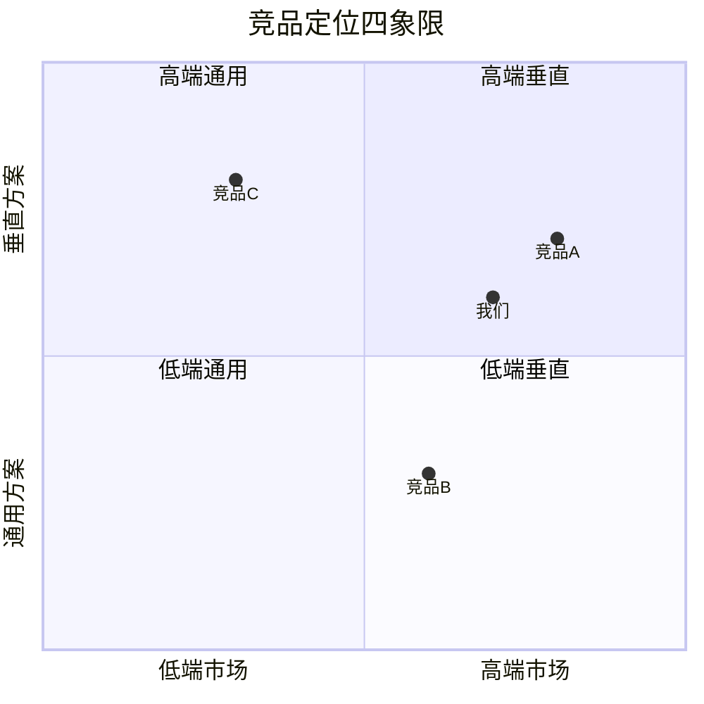
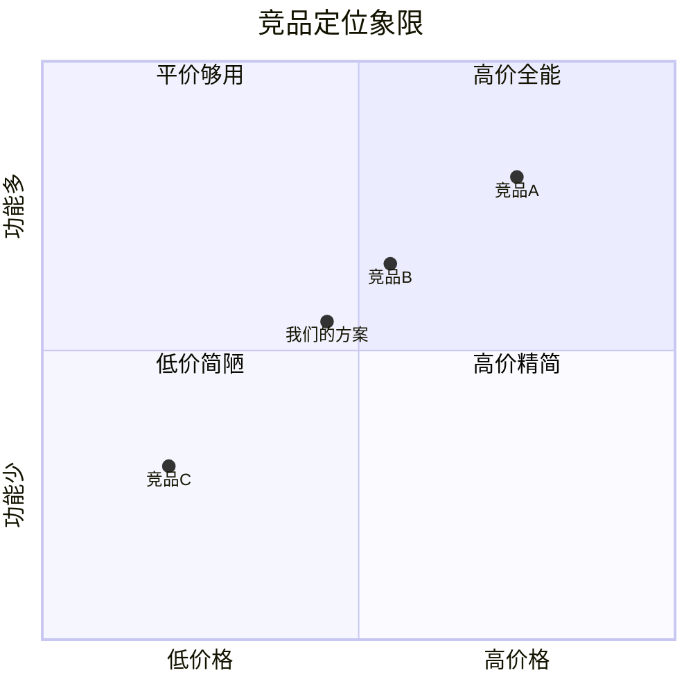

# [行业/品类] - 竞品分析报告

| 版本 | 日期 | 作者 | 说明 |
|------|------|------|------|
| 1.0 | YYYY-MM-DD | [Your Name] | 初始版本 |

---

> 📖 **填写指南**：本文档分析目标品类的核心竞品，输出可作为产品决策依据的 Battle Card（销售工具）和差异化策略。
>
> ⚠️ **适用范围**：所有商业项目都应产出（除非强合规要求禁止调研竞品）。
>
> 📌 **一页纸摘要**:
> 1. 看完这页能回答:谁是我们的竞品?他们强在哪?我们怎么差异化?
> 2. 文档定位:调研级(竞品),竞品画像 + 横向对比 + Battle Card
> 3. 核心动作:竞品识别 + 画像 + 功能矩阵 + 波特五力 + Battle Card
> 4. 何时使用:产品决策 / 销售支持 / 战略规划
> 5. 不要用于:行业规模(→14-行业分析)、技术选型(→14-技术趋势)
>
> 🔗 **关键引用**: `reference/12-value-matrix.md` (竞品分析价值) · [`reference/13-quality-selfcheck.md`](../reference/13-quality-selfcheck.md) (竞品自检) · [`reference/15-five-field-crosscheck.md`](../reference/15-five-field-crosscheck.md) (5 字段交叉) · [`reference/16-common-pitfalls.md`](../reference/16-common-pitfalls.md) (竞品常见错误)

---

## 0. 填写指南

### 0.0 本文档价值

> **回答的核心问题**：
> 1. 谁是我们的直接竞品、间接竞品、潜在竞品？（1 竞品概览）
> 2. 各竞品的产品定位、目标用户、核心功能、商业模式是什么？（2-3 画像 + 商业模式）
> 3. 各竞品的功能矩阵如何？优劣势分别在哪？（4-5 功能矩阵 + SWOT）
> 4. 行业竞争格局如何？波特五力评分？（6 波特五力）
> 5. 我们与各竞品的差异化策略是什么？（7 Battle Card + 差异化）
> 6. 竞品给我们带来哪些机会与威胁？（8 风险与机会）
>
> **集成上游**：本文档的"产品截图/官网/价格"由 `openPRD-chrome-devtools-integration` 抓取，确保数据时效性。
>
> **不回答什么**：行业整体规模与趋势（→14-行业分析）、技术选型（→14-技术趋势）
>
> **价值判定**：用户读完后能回答"我们怎么打？差异化卖点是什么？"

### 0.1 文档结构

| 板块 | 内容 | 必填 |
|------|------|------|
| **竞品概览** | 直接/间接/潜在竞品分类 | ✅ |
| **竞品画像** | 每个竞品详细档案（≥ 3 个） | ✅ |
| **功能矩阵** | 横纵双向对比 | ✅ |
| **商业模式** | 定价/收入/客户分层 | ✅ |
| **SWOT** | 各竞品 + 自身 | ✅ |
| **波特五力** | 5 维度评分 | ✅ |
| **Battle Card** | 销售工具 | ✅ |
| **差异化策略** | 我们的取胜路径 | ✅ |

### 0.2 竞品分级标准

| 级别 | 定义 | 调研深度 |
|------|------|----------|
| **T1 直接竞品** | 同品类、同用户群、同商业模式 | 详细（产品+价格+技术栈+用户）|
| **T2 间接竞品** | 同品类或同用户群，但模式不同 | 中等（产品+价格+定位）|
| **T3 潜在竞品** | 邻近品类可能切入 | 简要（产品+定位）|

### 0.3 调研方法

| 维度 | 工具 | 产出 |
|------|------|------|
| 官网抓取 | openPRD-chrome-devtools-integration | a11y 快照 + 截图 + Lighthouse |
| 截图解读 | openPRD-minimax-integration | UI 模式提取 |
| 价格/定价 | 抓取 + 用户调研 | 定价表 |
| 用户评价 | 第三方平台（App Store/微博/知乎）| 痛点 + 期望 |
| 技术栈 | Wappalyzer / BuiltWith | 技术选型 |

### 0.6 必含项自检

- [ ] ≥ 3 个 T1 直接竞品（每个含产品/价格/技术/用户/优劣势 5 维度）
- [ ] ≥ 3 个 T2 间接竞品
- [ ] 功能矩阵覆盖率 ≥ 80%
- [ ] 波特五力评分（每维度 1-5 分 + 理由）
- [ ] Battle Card（每竞品 1 张，含定位/差异化/销售话术/常见反驳）
- [ ] 差异化策略（≥ 3 条可执行路径）

---

## 1. 竞品概览

⭐ **关键决策**：
- **3 层竞品分类**：T1 直接（同形态同客户）/ T2 间接（同客户不同形态）/ T3 潜在（不同客户但有跨界能力，如大厂）
- **每类 ≥ 3 个**：直接竞品 ≥ 3、间接 ≥ 3、潜在 ≥ 2
- **调研深度梯度**：T1 详细（功能/BP/价格/UI 全维度） / T2 中等（功能 + BP） / T3 简要（仅定位 + 威胁点）

### 1.1 竞品分类全景

| 分类 | 竞品 | 市场份额 | 核心定位 | 调研深度 |
|------|------|----------|----------|----------|
| **T1 直接竞品** | 竞品 A | XX% | [定位] | 详细 |
| | 竞品 B | XX% | [定位] | 详细 |
| | 竞品 C | XX% | [定位] | 详细 |
| **T2 间接竞品** | 竞品 D | - | [定位] | 中等 |
| | 竞品 E | - | [定位] | 中等 |
| | 竞品 F | - | [定位] | 中等 |
| **T3 潜在竞品** | 竞品 G | - | [定位] | 简要 |
| | 竞品 H | - | [定位] | 简要 |

### 1.2 市场格局可视化



---

## 2. 竞品画像（每竞品 1 份详细档案）

### 2.1 竞品 A - [名称]

#### 2.1.1 基础信息

| 维度 | 内容 |
|------|------|
| **公司名称** | [名称] |
| **成立时间** | YYYY |
| **融资轮次** | A/B/C/D/IPO |
| **团队规模** | XX 人 |
| **官网** | [URL] |
| **主要客户** | [客户类型] |
| **MAU/DAU** | XX 万 |
| **ARR/营收** | XX 亿 |

#### 2.1.2 产品定位

```
[竞品 A] 是 [品类] 赛道的 [头部/腰部/尾部] 玩家，
面向 [目标用户]，提供 [核心服务]，
差异化优势在于 [差异化点 1] 和 [差异化点 2]。
```

#### 2.1.3 核心功能（按模块）

| 模块 | 核心功能 | 亮点 |
|------|----------|------|
| [模块 1] | 功能 1 / 功能 2 / 功能 3 | [亮点] |
| [模块 2] | 功能 1 / 功能 2 | [亮点] |
| [模块 3] | 功能 1 / 功能 2 / 功能 3 / 功能 4 | [亮点] |

#### 2.1.4 商业模式

| 维度 | 内容 |
|------|------|
| **定价模式** | SaaS 订阅 / 买断 / 增值服务 / 抽佣 / 免费增值 |
| **价格区间** | ¥XX-XX /月 或 ¥XX-XX /年 |
| **客户分层** | 免费版 / 基础版 / 专业版 / 企业版 |
| **获客渠道** | 内容营销 / SEM / 渠道代理 / 直销 |
| **LTV/CAC** | XX / XX |

#### 2.1.5 技术栈

| 维度 | 技术 | 来源 |
|------|------|------|
| 前端 | React + Next.js | Wappalyzer |
| 后端 | Java + Spring Cloud | 招聘信息 |
| 数据库 | MySQL + Redis + ES | 公开演讲 |
| 部署 | AWS / 阿里云 | 招聘 JD |
| AI 能力 | 自研 LLM / 调用 OpenAI | 公开论文 |

#### 2.1.6 用户评价（来自第三方）

| 平台 | 评分 | 正面反馈 | 负面反馈 |
|------|------|----------|----------|
| App Store | 4.5/5 | 速度快、UI 好 | 价格贵、客服慢 |
| 知乎 | - | 功能强大 | 学习成本高 |
| 微博 | - | 行业第一 | 广告多 |

#### 2.1.7 优劣势（SWOT）

| | 正面 | 负面 |
|------|------|------|
| **内部** | **优势（S）**：品牌强、用户基数大 | **劣势（W）**：价格高、创新慢 |
| **外部** | **机会（O）**：行业增长 | **威胁（T）**：新进入者 |

#### 2.1.8 截图与设计

> 截图保存路径：`assets/competitors/竞品A-*.png`

- 首页截图：[描述]
- 核心功能截图：[描述]
- 移动端截图：[描述]
- UI 风格总结：[如：深色主题 / 极简 / 数据密集]

#### 2.1.9 性能基准（Lighthouse）

| 指标 | 桌面 | 移动 |
|------|------|------|
| Performance | 85 | 65 |
| Accessibility | 90 | 88 |
| Best Practices | 92 | 90 |
| SEO | 95 | - |

### 2.2 竞品 B - [名称]

> 同 2.1 模板

### 2.3 竞品 C - [名称]

> 同 2.1 模板

---

## 3. 功能矩阵对比

⭐ **关键决策**：**2x2 定位象限**（横轴：价格 / 纵轴：功能完整度）确定每个竞品在市场上的位置，**避免"我们比所有竞品都好"的虚妄结论**。



### 3.1 主功能矩阵

| 功能模块 | 我们的方案 | 竞品 A | 竞品 B | 竞品 C | 行业最佳 |
|----------|------------|--------|--------|--------|----------|
| **用户管理** | ✅ 完整 | ✅ 完整 | ⚠️ 部分 | ✅ 完整 | 完整 |
| 用户注册 | 微信/手机/邮箱 | 微信/手机 | 仅手机 | 微信/手机/邮箱 | 3 种以上 |
| 用户画像 | ✅ 360° | ⚠️ 基础 | ✅ 360° | ⚠️ 基础 | 360° |
| **核心功能** | | | | | |
| [功能 1] | ✅ | ✅ | ❌ | ⚠️ | ✅ |
| [功能 2] | ✅ | ⚠️ | ✅ | ✅ | ✅ |
| [功能 3] | ⚠️ | ✅ | ✅ | ✅ | ✅ |
| **运营能力** | | | | | |
| 营销工具 | ✅ 5 种 | ✅ 8 种 | ⚠️ 3 种 | ✅ 6 种 | 6 种以上 |
| 数据看板 | ✅ 3 层 | ✅ 4 层 | ⚠️ 2 层 | ✅ 3 层 | 3 层以上 |
| A/B 测试 | ✅ | ✅ | ❌ | ⚠️ | ✅ |
| **技术能力** | | | | | |
| API 开放 | ✅ | ✅ | ❌ | ⚠️ | ✅ |
| AI 集成 | ✅ | ✅ | ⚠️ | ✅ | ✅ |
| 移动端 | H5/小程序 | App+H5 | App | App+H5 | App+H5+小程序 |

**图例**：✅ 支持 ｜ ⚠️ 部分支持 ｜ ❌ 不支持

### 3.2 详细功能差异说明

#### 3.2.1 [功能 1]

- **我们的实现**：[简要描述]
- **竞品 A**：[简要描述] - **优势**：[差异] - **劣势**：[差异]
- **竞品 B**：[简要描述]
- **行业最佳实践**：[简要描述]

---

## 4. 商业模式对比

### 4.1 定价对比

| 维度 | 我们的方案 | 竞品 A | 竞品 B | 竞品 C |
|------|------------|--------|--------|--------|
| 免费版 | ✅ 有（限制功能）| ✅ 有 | ❌ 无 | ✅ 有 |
| 基础版 | ¥99/月 | ¥199/月 | - | ¥149/月 |
| 专业版 | ¥499/月 | ¥999/月 | ¥799/月 | ¥699/月 |
| 企业版 | 联系销售 | 联系销售 | 联系销售 | 联系销售 |
| 价格策略 | 低价渗透 | 高端定位 | 单一报价 | 中端主流 |

### 4.2 收入结构

| 收入来源 | 我们的方案 | 竞品 A | 竞品 B | 竞品 C |
|----------|------------|--------|--------|--------|
| 订阅费 | 60% | 70% | 80% | 65% |
| 增值服务 | 20% | 15% | 10% | 20% |
| 抽佣 | 10% | 5% | 0% | 5% |
| 解决方案 | 10% | 10% | 10% | 10% |

---

## 5. 用户体验对比

### 5.1 关键流程对比

#### 5.1.1 注册流程

| 步骤 | 我们的方案 | 竞品 A | 竞品 B | 竞品 C |
|------|------------|--------|--------|--------|
| 1 | 手机号验证码 | 微信扫码 | 手机+邮箱 | 微信 |
| 2 | 完善资料 | 立即使用 | 邮箱验证 | 立即使用 |
| 3 | 开始使用 | 开始使用 | 完善资料 | 完善资料 |
| **总耗时** | 30s | 10s | 2min | 30s |
| **跳出率** | XX% | XX% | XX% | XX% |

### 5.2 UI/UX 风格对比

| 维度 | 我们的方案 | 竞品 A | 竞品 B | 竞品 C |
|------|------------|--------|--------|--------|
| 主题 | 浅色 | 深色 | 浅色 | 双主题 |
| 风格 | 现代简洁 | 数据密集 | 商务专业 | 极简 |
| 主色 | #1890ff | #1890ff | #2b2b2b | #ff6b35 |
| 信息密度 | 中 | 高 | 中 | 低 |
| 移动端 | 良好 | 优秀 | 一般 | 良好 |

---

## 6. 波特五力分析

| 力量 | 评分 | 理由 |
|------|------|------|
| **供应商议价能力** | 2/5 | 云服务/短信等供应商多，可替代 |
| **购买者议价能力** | 4/5 | 客户选择多，价格敏感 |
| **新进入者威胁** | 3/5 | 行业门槛中等，大厂可能切入 |
| **替代品威胁** | 2/5 | 暂无明显替代品 |
| **同业竞争强度** | 4/5 | 头部 3 家 + 长尾多家 |
| **行业吸引力** | 3/5 | 中等 - 增长但竞争激烈 |

### 6.1 详细分析

#### 供应商议价（2/5）
- 云服务：阿里云/腾讯云/AWS 竞争激烈
- 短信：阿里云/腾讯云/容联 3 家
- 支付：微信/支付宝双寡头
- 结论：议价能力低

#### 购买者议价（4/5）
- 客户选择多：3 家头部 + 多家腰部
- 切换成本低
- 结论：议价能力高，需差异化

（其他维度同理分析）

---

## 7. SWOT 矩阵

⭐ **关键决策**：
- **S/W 来自内部资源审计**（不是"我觉得"，要列数据/事实）
- **O/T 来自外部市场扫描**（PEST + 波特五力）
- **S-O 战略（增长）**：用优势抓机会（最优先）
- **W-O 战略（扭转）**：补短板抓机会
- **S-T 战略（防御）**：用优势防威胁
- **W-T 战略（回避）**：承认劣势 + 减少暴露

### 7.1 我们的方案

| | 正面 | 负面 |
|------|------|------|
| **内部** | **优势（S）**：<br>1. AI 能力强<br>2. 价格优势<br>3. 团队执行力强 | **劣势（W）**：<br>1. 品牌弱<br>2. 用户基数小<br>3. 行业 know-how 浅 |
| **外部** | **机会（O）**：<br>1. 行业增长 30%<br>2. 政策支持<br>3. 大厂未深度切入 | **威胁（T）**：<br>1. 大厂可能切入<br>2. 价格战<br>3. 技术快速迭代 |

### 7.2 各竞品 SWOT（简要）

| 竞品 | S | W | O | T |
|------|---|---|---|---|
| 竞品 A | 品牌/用户 | 价格/创新 | - | 新进入者 |
| 竞品 B | 技术/AI | 体验/价格 | - | 巨头切入 |
| 竞品 C | 行业 know-how | 规模/技术 | - | 资金 |

---

## 8. Battle Card（销售工具）

### 8.1 应对竞品 A 的 Battle Card

#### 一句话定位
> [竞品 A] 是行业老大但价格贵、迭代慢；我们 [差异化点 1] + [差异化点 2] 更适合 [目标场景]。

#### 差异化卖点

| 我们 | 竞品 A |
|------|--------|
| ✅ AI 能力更强（自研 LLM） | ⚠️ 调用第三方 |
| ✅ 价格低 30-50% | ❌ 高端定价 |
| ✅ 移动端体验更好 | ⚠️ 重 PC |
| ✅ 部署灵活（SaaS + 私有化） | ⚠️ 仅 SaaS |

#### 常见客户疑问与应对

**Q1：你们比 [竞品 A] 便宜这么多，是不是功能不如他们？**
> 不是。我们采用更现代的技术栈（如 Serverless），运营成本低 40%。功能覆盖度 95%，且 AI 能力更强。

**Q2：[竞品 A] 是行业第一，你们怎么竞争？**
> 第一不代表最优。客户最终选择的是 ROI，不是品牌。我们已服务 XX 家客户，包括 [知名客户 1/2/3]。

**Q3：如果 [竞品 A] 降价呢？**
> 他们的成本结构决定无法降到我们的水平。我们有信心持续保持价格优势。

#### 适用客户

- ✅ 预算敏感（< ¥10 万/年）
- ✅ 重视 AI 能力
- ✅ 需要移动端
- ❌ 一定要"行业第一"品牌的客户

### 8.2 应对竞品 B 的 Battle Card

> 同 8.1 模板

### 8.3 应对竞品 C 的 Battle Card

> 同 8.1 模板

---

## 9. 差异化策略

⭐ **关键决策**：
- **差异化 4 维度**：产品功能 / 用户体验 / 商业模式 / 品牌定位（至少选 2 个差异化点）
- **可防御性**：功能差异化易被抄，UX/品牌难抄 → 优先后两者
- **用户感知度**：差异化必须"用户能 5 秒感知"，如"3 步完成 vs 竞品 8 步"

### 9.1 我们的差异化打法

#### 策略 1：[如：AI 优先]

- **做什么**：AI 能力领先竞品 6 个月
- **怎么做**：自研 LLM + 行业模型
- **预期效果**：成为"AI 最强"的代名词
- **风险**：研发投入大，周期长

#### 策略 2：[如：价格优势]

- **做什么**：同等功能价格低 30%
- **怎么做**：Serverless 架构降低运营成本
- **预期效果**：快速获客
- **风险**：可能被价格战拖垮

#### 策略 3：[如：垂直深耕]

- **做什么**：专注 [行业] 场景
- **怎么做**：行业 know-how + 定制化
- **预期效果**：高客户粘性
- **风险**：天花板有限

### 9.2 不做什么（明确边界）

- ❌ 不做大客户定制（毛利低、周期长）
- ❌ 不做免费版（避免被低端锁死）
- ❌ 不做跨行业（专注核心行业）

---

## 10. 风险与机会

### 10.1 来自竞品的威胁

| 风险 | 等级 | 应对 |
|------|------|------|
| 竞品 A 突然降价 | 🔴 高 | 提前储备 2 个版本降价空间 |
| 竞品 B 开放 API | 🟡 中 | 我们必须更早开放 |
| 大厂切入 | 🟡 中 | 强化垂直深耕 |

### 10.2 我们的机会

| 机会 | 等级 | 行动 |
|------|------|------|
| 行业增长 30% | 🟢 高 | 加大市场投放 |
| 政策支持 | 🟢 高 | 申请政府背书 |
| 竞品体验差 | 🟡 中 | 主打体验 |

---

## 11. 自检清单

### 11.1 完整性

- [ ] ≥ 3 个 T1 直接竞品详细档案
- [ ] ≥ 3 个 T2 间接竞品
- [ ] 功能矩阵覆盖率 ≥ 80%
- [ ] 商业模式对比完整

### 11.2 数据可信度

- [ ] 所有数据有来源（截图/官网/用户评价）
- [ ] 价格信息已验证（截图保存）
- [ ] 技术栈有公开来源（招聘 JD/演讲）

### 11.3 决策可用性

- [ ] Battle Card 可直接给销售使用
- [ ] 差异化策略有具体行动项
- [ ] 风险与机会有等级评估

---

**文档完成。** 后续详见：行业分析（14-行业）→ 技术趋势（14-技术）→ PRD 差异化设计（06-PRD）。


## 摘要(降级输出,200 字内)

> 模板定位摘要(全受众可见)。完整定义见下方各章。
> 模板定位:0.0 本文档价值

**模板说明**:`[行业/品类] - 竞品分析报告`

**关键数字/对象**:见完整版

**完整版见**:`14-竞品分析报告模板.md`(主受众可访问)
