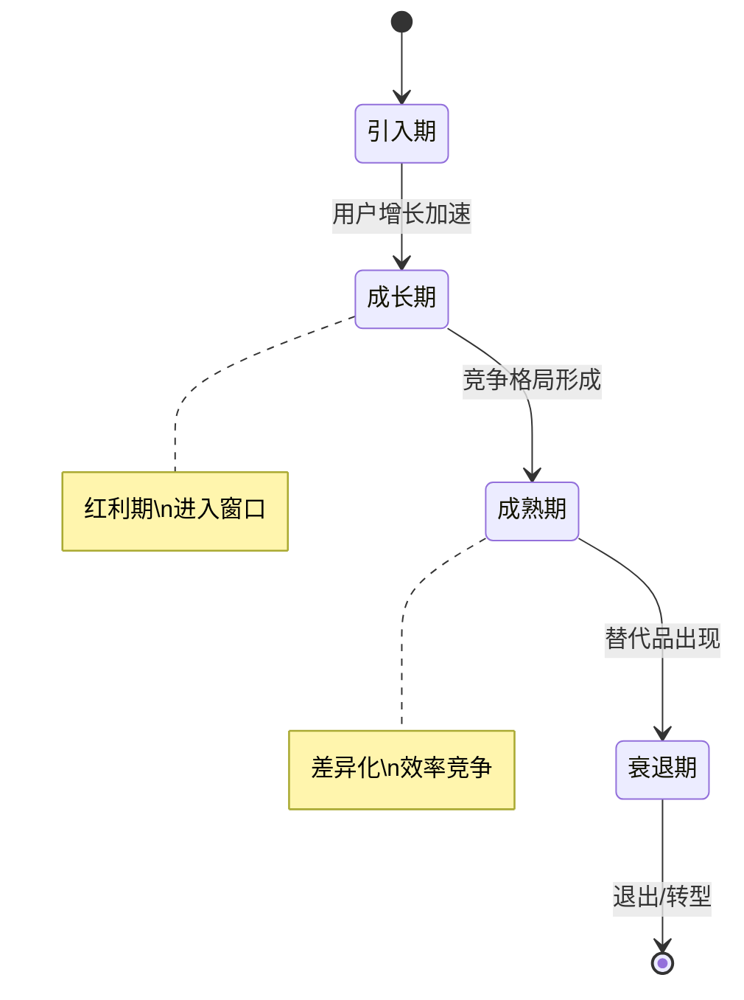
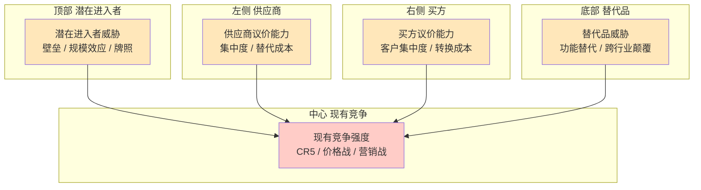

# [行业名称] - 行业分析报告

| 版本 | 日期 | 作者 | 说明 |
|------|------|------|------|
| 1.0 | YYYY-MM-DD | [Your Name] | 初始版本 |

---

> 📖 **填写指南**：本文档分析目标行业的特点、典型业务流程、行业术语、标杆产品、监管要求等，为产品设计和技术方案提供行业背景。
>
> ⚠️ **适用范围**：仅在涉及特定行业时产出。
>
> 📌 **一页纸摘要**:
> 1. 看完这页能回答:行业特点/规模/趋势是什么?典型业务流程?术语规范?监管要求?
> 2. 文档定位:调研级(行业),行业背景与最佳实践
> 3. 核心动作:行业概况 + 特点 + 业务流程 + 术语 + 技术 + 标杆 + 启示
> 4. 何时使用:行业进入决策 / 行业背景学习 / 合规设计
> 5. 不要用于:本项目功能(→06)、技术选型(→13)、竞品细节(→14-竞品分析)
>
> 🔗 **关键引用**: `reference/12-value-matrix.md` (行业分析价值) · [`reference/13-quality-selfcheck.md`](../reference/13-quality-selfcheck.md) (行业自检) · [`reference/15-five-field-crosscheck.md`](../reference/15-five-field-crosscheck.md) (5 字段交叉) · [`reference/16-common-pitfalls.md`](../reference/16-common-pitfalls.md) (行业常见错误)

---

## 0. 填写指南

### 0.0 本文档价值

> **回答的核心问题**：
> 1. 这是一个什么样的行业？市场规模多大？增长趋势如何？（1 行业概况）
> 2. 行业有哪些独特特点？典型用户群体与痛点是什么？（2 行业特点）
> 3. 行业典型业务流程是什么？术语规范有哪些？（3-4 业务流程与术语）
> 4. 行业技术要点和标杆产品是什么？（5-6 技术与标杆）
> 5. 这些行业洞察对我们项目有什么启示？（7 对本项目启示）
>
> **集成上游**：本文档的「数据/事实/案例」由 `parags/deep-research-pro` 深度研究支撑（15-30 来源，60%+ 12 个月内），确保专业性。
>
> **不回答什么**：本项目具体功能（→06-PRD）、技术选型（→13-架构）、竞品功能细节（→11-Mock）
>
> **价值判定**：用户读完后能回答"我们要不要做这个行业？怎么做能赢？"

### 0.1 文档结构

| 板块 | 内容 | 必填 |
|------|------|------|
| **行业概览** | 市场规模、发展趋势 | ✅ |
| **业务流程** | 典型业务场景、关键节点 | ✅ |
| **行业术语** | 专业术语、缩写 | ✅ |
| **标杆产品** | 头部玩家、参考产品 | ✅ |
| **合规要求** | 监管、隐私、安全 | ✅ |

### 0.2 行业分类

| 分类 | 行业 | 特殊要求 |
|------|------|----------|
| 2C | 电商、社交、内容 | 用户体验、流量 |
| 2B | SaaS、企业服务 | 权限、流程 |
| 监管 | 金融、医疗、政务 | 合规、审计 |
| 工具 | 效率、开发 | 性能、集成 |

### 0.6 深度研究方法论（来自 parags/deep-research-pro）

> 本文档的所有"数据/事实/案例"必须经过 6 步法深度研究，禁止凭空编造。

| 步骤 | 动作 | 工具 |
|------|------|------|
| 1. Understand the Goal | 1-2 个澄清问题 | 用户对话 |
| 2. Plan the Research | 拆 3-5 个子问题 | - |
| 3. Execute Multi-Source Search | 15-30 个来源 | DDG web + news 搜索 |
| 4. Deep-Read Key Sources | 抓 3-5 个全文 | curl + python 解析 |
| 5. Synthesize & Write Report | 带内联引用 | 报告模板 |
| 6. Save & Deliver | 存到 14 文件 | 文件系统 |

**质量门禁**：
- ✅ 每个数据/事实有 `[来源名](URL)` 内联引用
- ✅ 15+ 来源（深度模式）
- ✅ 60%+ 来源在 12 个月内
- ✅ 至少 1 个市场规模量化数据
- ✅ 至少 1 个 PEST 政治/政策类来源

### 0.7 行业生命周期



---

## 1. 行业概览

⭐ **关键决策**：
- **行业定义边界**：用 1 句话定义（如"为企业提供 X 服务的市场"），避免宽泛到失去分析价值
- **市场规模数据源优先级**：IDC/Gartner > 艾瑞/CNNIC > 行业协会 > 公司财报（依次降级）
- **生命周期判定**：看 5 年 CAGR ≥ 20% → 成长期 / 5-10% → 成熟期 / < 0% → 衰退期
- **增长率归因**：拆解为"用户数增长 × ARPU 增长"，避免"行业增长 X%"的空洞结论

### 1.1 行业定义

> 📝 **如何填写**：用一段话定义这个行业，包括其核心服务和目标客户。

```
[行业名称] 是指 [行业定义]，主要服务 [目标客户]，提供 [核心服务]。
```

### 1.2 市场规模

| 指标 | 数值 | 来源 |
|------|------|------|
| 全球市场规模 | [XXX] | [来源] |
| 中国市场规模 | [XXX] | [来源] |
| 年增长率 | [XXX]% | [来源] |
| 预期规模（5年） | [XXX] | [来源] |

### 1.3 发展趋势

| 趋势 | 说明 | 对产品的影响 |
|------|------|--------------|
| [趋势1] | [描述] | [影响] |
| [趋势2] | [描述] | [影响] |
| [趋势3] | [描述] | [影响] |

### 1.4 行业生命周期

| 阶段 | 判断依据 | 当前阶段 |
|------|----------|----------|
| 引入期 | 用户少、增长慢 | - |
| 成长期 | 用户增长快、竞争激烈 | - |
| 成熟期 | 增长稳定、格局固化 | ✅ 当前 |
| 衰退期 | 用户流失、规模下降 | - |

---

## 2. 业务特点

⭐ **关键决策**：
- **用户细分维度**：优先用 JTBD（待完成的任务）而非人口属性（如"中小企业 HR"而非"30-40 岁女性"）
- **场景优先级**：高频高客单 > 高频低客单 > 低频高客单 > 低频低客单（决定产品 MVP 切入）
- **痛点权重排序**：按"频次 × 痛感 × 付费意愿"打分，避免"用户都说重要"的全重要陷阱

### 2.1 典型用户

| 用户类型 | 占比 | 核心需求 |
|----------|------|----------|
| [用户类型1] | [X%] | [需求] |
| [用户类型2] | [X%] | [需求] |

### 2.2 业务场景

| 场景 | 描述 | 频次 |
|------|------|------|
| [场景1] | [详细描述] | 高/中/低 |
| [场景2] | [详细描述] | 高/中/低 |
| [场景3] | [详细描述] | 高/中/低 |

### 2.3 痛点分析

| 痛点 | 严重程度 | 解决方向 |
|------|----------|----------|
| [痛点1] | 高/中/低 | [方向] |
| [痛点2] | 高/中/低 | [方向] |
| [痛点3] | 高/中/低 | [方向] |

---

## 3. 典型业务流程

### 3.1 [核心业务1] 流程

> 📝 **如何填写**：使用流程图描述核心业务流程。

```
客户咨询 ──> 需求评估 ──> 方案设计 ──> 合同签订 ──> 服务交付 ──> 售后服务
   │            │            │            │            │            │
   ▼            ▼            ▼            ▼            ▼            ▼
[CRM记录]  [评估报告]  [方案文档]  [合同管理]  [交付物]   [客服系统]
```

### 3.2 [核心业务2] 流程

```
[步骤1] ──> [步骤2] ──> [步骤3] ──> [步骤4]
   │           │           │           │
   ▼           ▼           ▼           ▼
[数据]      [数据]      [数据]      [数据]
```

### 3.3 流程关键节点

| 节点 | 耗时 | 关键角色 | 系统支撑 |
|------|------|----------|----------|
| [节点1] | [时间] | [角色] | [系统] |
| [节点2] | [时间] | [角色] | [系统] |

---

## 4. 行业术语

### 4.1 核心术语

| 术语 | 英文 | 定义 |
|------|------|------|
| [术语1] | [English] | [定义] |
| [术语2] | [English] | [定义] |
| [术语3] | [English] | [定义] |

### 4.2 缩写对照

| 缩写 | 全称 | 中文 |
|------|------|------|
| [Abbr1] | [Full Name] | [中文] |
| [Abbr2] | [Full Name] | [中文] |

### 4.3 度量单位

| 单位 | 含义 | 应用场景 |
|------|------|----------|
| [单位1] | [含义] | [场景] |
| [单位2] | [含义] | [场景] |

---

## 5. 行业角色

### 5.1 价值链

⭐ **关键决策**：**波特五力分析**（供应商议价/买方议价/潜在进入者/替代品/现有竞争）必须 5 项齐全，**禁止只列 1-2 项**。



### 5.2 主要角色

| 角色 | 职责 | 关注点 |
|------|------|--------|
| [角色1] | [职责] | [关注点] |
| [角色2] | [职责] | [关注点] |
| [角色3] | [职责] | [关注点] |

---

## 6. 标杆产品

### 6.1 头部产品分析

| 产品 | 公司 | 定位 | 核心优势 | 借鉴点 |
|------|------|------|----------|--------|
| [产品1] | [公司] | [定位] | [优势] | [借鉴] |
| [产品2] | [公司] | [定位] | [优势] | [借鉴] |
| [产品3] | [公司] | [定位] | [优势] | [借鉴] |

### 6.2 功能对比

| 功能 | 产品A | 产品B | 产品C | 本产品 |
|------|-------|-------|-------|--------|
| [功能1] | ✅ | ✅ | ✅ | 计划中 |
| [功能2] | ✅ | ✅ | ❌ | 计划中 |
| [功能3] | ✅ | ❌ | ✅ | 不做 |

### 6.3 商业模式

| 产品 | 收费模式 | 价格区间 | 用户规模 |
|------|----------|----------|----------|
| [产品1] | [模式] | [价格] | [规模] |
| [产品2] | [模式] | [价格] | [规模] |

---

## 7. 合规要求

### 7.1 监管机构

| 机构 | 监管范围 | 主要法规 |
|------|----------|----------|
| [机构1] | [范围] | [法规] |
| [机构2] | [范围] | [法规] |

### 7.2 法规要求

| 法规 | 适用范围 | 核心要求 |
|------|----------|----------|
| [法规1] | [范围] | [要求] |
| [法规2] | [范围] | [要求] |

### 7.3 数据合规

| 要求 | 说明 | 实现方式 |
|------|------|----------|
| 隐私保护 | [说明] | [方式] |
| 数据本地化 | [说明] | [方式] |
| 数据加密 | [说明] | [方式] |
| 审计日志 | [说明] | [方式] |

### 7.4 资质要求

| 资质 | 适用范围 | 申请难度 |
|------|----------|----------|
| [资质1] | [范围] | 高/中/低 |
| [资质2] | [范围] | 高/中/低 |

---

## 8. 技术特点

### 8.1 行业技术特征

| 特征 | 说明 | 对技术的影响 |
|------|------|--------------|
| [特征1] | [说明] | [影响] |
| [特征2] | [说明] | [影响] |

### 8.2 关键技术要求

| 技术 | 要求 | 行业标准 |
|------|------|----------|
| 性能 | [指标] | [标准] |
| 安全 | [要求] | [标准] |
| 可用性 | [指标] | [标准] |
| 合规 | [要求] | [标准] |

### 8.3 常用技术栈

| 层级 | 主流选择 | 占比 |
|------|----------|------|
| 前端 | [技术] | [X%] |
| 后端 | [技术] | [X%] |
| 数据库 | [技术] | [X%] |

---

## 9. 行业风险

| 风险 | 概率 | 影响 | 应对措施 |
|------|------|------|----------|
| 政策变化 | 高/中/低 | 高/中/低 | [措施] |
| 技术变革 | 高/中/低 | 高/中/低 | [措施] |
| 竞争加剧 | 高/中/低 | 高/中/低 | [措施] |
| 需求变化 | 高/中/低 | 高/中/低 | [措施] |

### 9.1 研究方法说明

> 本文产出经 `parags/deep-research-pro` 6 步法深度研究。

| 项目 | 数值 |
|------|------|
| 搜索查询数 | [N] |
| 分析来源数 | [M] |
| 报告生成日期 | YYYY-MM-DD |
| 来源时间窗 | 12 个月内占 [X]% |
| 总体置信度 | 高 / 中 / 低 |
| 子问题清单 | [列出 3-5 个研究子问题] |

**质量红线**：
- 🚫 无来源的事实 = 不写
- 🚫 单一来源的断言 = 标注"待验证"
- ✅ 关键数据 = 至少 2 个高评级来源交叉验证
- ✅ 政策/法规 = 至少 1 个政府/协会来源

### 9.2 未解答问题（gap acknowledgment）

| 主题 | 缺口 | 后续补研方式 |
|------|------|--------------|
| [如：行业最新政策影响] | 缺乏 2025 Q4 后政策数据 | 等待工信部/行业协会发布 |
| [如：细分市场数据] | 子细分市场规模未公开 | 委托第三方定制研究 |
| [如：海外市场] | 境外市场份额数据不足 | 接入海外数据源 |

---

## 10. 行业分析结论

### 10.1 关键洞察

| # | 洞察 | 影响 |
|---|------|------|
| 1 | [洞察1] | [影响] |
| 2 | [洞察2] | [影响] |
| 3 | [洞察3] | [影响] |

### 10.2 产品建议

| 建议 | 优先级 | 说明 |
|------|--------|------|
| [建议1] | P0 | [说明] |
| [建议2] | P1 | [说明] |

### 10.3 关键决策点

| 决策点 | 建议 | 理由 |
|--------|------|------|
| [决策点1] | [建议] | [理由] |
| [决策点2] | [建议] | [理由] |

---

## 11. 参考资料

| 资料 | 类型 | 链接 |
|------|------|------|
| [资料1] | 报告 | [链接] |
| [资料2] | 文章 | [链接] |
| [资料3] | 数据 | [链接] |

### 11.4 数据置信度评级

| 来源类型 | 占比 | 评级 | 示例 |
|----------|------|------|------|
| 行业研究报告（艾瑞/IDC/Gartner） | 30% | 高 | IDC《2025 中国 SaaS 行业报告》 |
| 政府/协会官方数据 | 20% | 高 | 工信部年度统计 |
| 上市公司财报 | 15% | 高 | 某上市公司 2024 年报 |
| 主流财经/科技媒体 | 20% | 中 | 36 氪、虎嗅、财新 |
| 行业自媒体/博客 | 10% | 中 | 行业 KOL 文章 |
| 论坛/评论区 | 5% | 低 | 知乎、Reddit |

**置信度评级**：
- 高：3+ 个高评级来源一致
- 中：1-2 个高评级 或 3+ 个中评级一致
- 低：仅 1 个来源 或 来源时效超 24 个月

---

## 12. 行业分析检查清单

> ✅ **完成后逐项检查**

### 12.1 行业基础

| 检查项 | 状态 |
|--------|------|
| 行业定义清晰 | ☐ |
| 市场规模数据已收集 | ☐ |
| 发展趋势已分析 | ☐ |
| 行业生命周期已判断 | ☐ |

### 12.2 业务理解

| 检查项 | 状态 |
|--------|------|
| 典型用户已识别 | ☐ |
| 业务场景已梳理 | ☐ |
| 痛点已分析 | ☐ |
| 核心业务流程已绘制 | ☐ |

### 12.3 行业知识

| 检查项 | 状态 |
|--------|------|
| 行业术语已整理 | ☐ |
| 价值链已分析 | ☐ |
| 标杆产品已对比 | ☐ |

### 12.4 合规

| 检查项 | 状态 |
|--------|------|
| 监管机构已识别 | ☐ |
| 法规要求已整理 | ☐ |
| 数据合规已考虑 | ☐ |
| 资质要求已明确 | ☐ |

### 12.5 决策支持

| 检查项 | 状态 |
|--------|------|
| 关键洞察已提炼 | ☐ |
| 产品建议已给出 | ☐ |
| 关键决策点已列明 | ☐ |

---

## 13. 行业五力分析（Porter's Five Forces）

### 13.1 五力评估

| 力量 | 强度 | 解释 |
|------|------|------|
| **现有竞争** | 高/中/低 | 头部玩家数量、份额集中度、价格战 |
| **新进入者威胁** | 高/中/低 | 进入门槛、资本要求、技术壁垒 |
| **替代品威胁** | 高/中/低 | 跨行业替代、新技术颠覆 |
| **供应商议价** | 高/中/低 | 集中度、可替代性、转换成本 |
| **客户议价** | 高/中/低 | 客户集中度、产品差异、转换成本 |

### 13.2 五力雷达图（文字版）

```
           替代品
            ▲
            │
   供应商 ──┼── 客户
   议价力   │   议价力
            │
   ◄────────┼────────►
   新进入者  │  现有竞争
   威胁      │  强度
```

### 13.3 战略含义

| 力量组合 | 战略方向 |
|----------|----------|
| 现有竞争 + 替代品 都高 | 差异化、垂直深耕 |
| 新进入者威胁高 | 建立壁垒、规模效应 |
| 客户议价高 | 提升粘性、平台化 |
| 供应商议价高 | 自研、多源 |

---

## 14. PEST 宏观分析

### 14.1 政治 Political

| 因素 | 影响 | 趋势 |
|------|------|------|
| 行业政策 | [影响] | ↑/→/↓ |
| 监管力度 | [影响] | ↑/→/↓ |
| 政府补贴 | [影响] | ↑/→/↓ |
| 中美关系 | [影响] | ↑/→/↓ |
| 出口管制 | [影响] | ↑/→/↓ |

### 14.2 经济 Economic

| 因素 | 影响 | 趋势 |
|------|------|------|
| GDP 增速 | [影响] | ↑/→/↓ |
| 通胀水平 | [影响] | ↑/→/↓ |
| 利率环境 | [影响] | ↑/→/↓ |
| 行业景气度 | [影响] | ↑/→/↓ |
| 资本市场 | [影响] | ↑/→/↓ |

### 14.3 社会 Social

| 因素 | 影响 | 趋势 |
|------|------|------|
| 人口结构 | [影响] | ↑/→/↓ |
| 消费升级/降级 | [影响] | ↑/→/↓ |
| 用户习惯 | [影响] | ↑/→/↓ |
| 价值观变化 | [影响] | ↑/→/↓ |
| 媒体环境 | [影响] | ↑/→/↓ |

### 14.4 技术 Technological

| 因素 | 影响 | 趋势 |
|------|------|------|
| AI / 大模型 | [影响] | ↑/→/↓ |
| 5G / 6G | [影响] | ↑/→/↓ |
| 物联网 | [影响] | ↑/→/↓ |
| 区块链 | [影响] | ↑/→/↓ |
| 隐私计算 | [影响] | ↑/→/↓ |

---

## 15. 标杆深度分析

### 15.1 标杆选择标准

- 头部 Top 3
- 不同业务模式（直接竞品 + 跨界参考）
- 公开数据可得
- 可学习的成功要素

### 15.2 标杆 A：[产品名]

| 维度 | 详情 |
|------|------|
| 公司 | [公司名] |
| 创立时间 | [年份] |
| 用户规模 | [数字] |
| 营收规模 | [数字] |
| 融资轮次 | [轮次] |
| 核心定位 | [定位] |
| 目标用户 | [用户] |
| 商业模型 | [模型] |

**成功要素**：
1. [要素 1]
2. [要素 2]
3. [要素 3]

**可借鉴**：
- [借鉴 1]
- [借鉴 2]

**不可借鉴**：
- [限制 1]（如依赖特定资源/政策）
- [限制 2]

### 15.3 标杆 B：[产品名]

（同 15.2 模板）

### 15.4 标杆对比矩阵

| 维度 | 标杆 A | 标杆 B | 标杆 C | 本产品 |
|------|--------|--------|--------|--------|
| 用户规模 | | | | |
| 营收 | | | | |
| 增速 | | | | |
| ARPU | | | | |
| 留存率 | | | | |
| NPS | | | | |
| 技术能力 | | | | |
| 市场份额 | | | | |

---

## 16. 市场规模细化

### 16.1 TAM / SAM / SOM

```
TAM（Total Addressable Market）— 总可寻址市场
   │ 全球/全国行业的理论最大规模
   │ 例：中国 SaaS 市场总规模 ¥5000 亿
   │
   └── SAM（Serviceable Addressable Market）— 可服务市场
       │ 我们产品形态可触达的部分
       │ 例：中后台 SaaS ¥800 亿
       │
       └── SOM（Serviceable Obtainable Market）— 可获得市场
           │ 短期内（3年）实际可获得份额
           │ 例：CRM 子赛道 ¥80 亿
```

| 层级 | 市场规模 | 占比 | 信心 |
|------|----------|------|------|
| TAM | [数值] | 100% | 中 |
| SAM | [数值] | [X%] | 中 |
| SOM | [数值] | [Y%] | 低 |

### 16.2 自上而下 vs 自下而上

| 方法 | 公式 | 适用 |
|------|------|------|
| **自上而下** | TAM = 行业总规模 × 我们可触达比例 | 已有行业数据 |
| **自下而上** | 客户数 × ARPU × 购买频次 | 客户画像清晰 |

**自下而上示例**：
```
目标客户数 = 1 万家企业
× ARPU = ¥5 万/年
× 购买率 = 30%
= SOM = ¥1.5 亿/年
```

### 16.3 市场细分矩阵

| 细分 | 规模 | 增速 | 利润率 | 我们的优先级 |
|------|------|------|--------|--------------|
| 细分 1 | 大 | 高 | 高 | P0 主攻 |
| 细分 2 | 中 | 高 | 中 | P1 关注 |
| 细分 3 | 大 | 低 | 中 | P2 备选 |
| 细分 4 | 小 | 高 | 高 | 长尾 |

---

## 17. 趋势与时间线

### 17.1 技术成熟度曲线

⭐ **关键决策**：**Gartner Hype Cycle 5 阶段**（技术萌芽 / 期望膨胀 / 幻灭低谷 / 复苏爬升 / 生产力成熟），**判断当前阶段决定投资策略**：
- **萌芽期**：长期 R&D 投入，5-10 年回报
- **膨胀期**：警惕泡沫，2-3 年内 70% 玩家消失
- **低谷期**：抄底机会，技术成熟但市场情绪低
- **爬升期**：商业化加速（最佳投资窗口）
- **成熟期**：差异化竞争，拼运营效率

```
        期望膨胀
   ▲     ╱╲
         ╱  ╲
        ╱    ╲       ╱──── 启蒙期
       ╱      ╲    ╱
      ╱        ╲  ╱
     ╱          ╲╱
    ╱            ╲───────── 稳步爬升
   ╱              ╲───── 实质生产
  └────────────────────────► 时间
     萌芽 狂热 幻灭 爬升 成熟
```

**当前阶段判断**：
- [技术/品类] 当前处于 [萌芽/膨胀/幻灭/爬升/成熟] 期

### 17.2 关键时间线

| 时点 | 事件 | 影响 |
|------|------|------|
| 2024 Q3 | 法规 X 生效 | 强制合规 |
| 2025 Q1 | 标杆 Y 上市 | 行业整合 |
| 2025 Q4 | 技术 Z 突破 | 新范式 |
| 2026 H1 | 政策红利 | 增量市场 |

### 17.3 颠覆性创新风险

| 来源 | 概率 | 时点 | 应对 |
|------|------|------|------|
| 跨行业巨头 | 中 | 24 个月 | 差异化、垂直 |
| 开源社区 | 中 | 18 个月 | 拥抱、参与 |
| 监管变化 | 高 | 12 个月 | 合规优先 |
| 新技术 | 中 | 36 个月 | 预研、POC |

---

## 18. 风险与不确定性

### 18.1 风险矩阵

| 风险 | 概率 | 影响 | 等级 | 应对 |
|------|------|------|------|------|
| 政策变化 | 高 | 高 | 🔴 严重 | 合规前置、关注政策 |
| 竞争加剧 | 中 | 高 | 🟡 重要 | 差异化、快速迭代 |
| 客户流失 | 中 | 中 | 🟡 重要 | 提升粘性、服务 |
| 技术变革 | 中 | 中 | 🟡 重要 | 持续投入、跟踪 |
| 人才流失 | 中 | 中 | 🟡 重要 | 激励、文化 |
| 资金链 | 低 | 高 | 🟡 重要 | 多元融资、节制 |
| 供应链 | 低 | 中 | 🟢 一般 | 多源、备份 |
| 舆情危机 | 中 | 中 | 🟡 重要 | 公关预案 |

### 18.2 黑天鹅 vs 灰犀牛

| 类型 | 特征 | 应对 |
|------|------|------|
| **黑天鹅** | 不可预测、影响大 | 提高韧性、应急预案 |
| **灰犀牛** | 可预见、影响大 | 提前防范、监测指标 |

### 18.3 敏感性分析

| 关键变量 | 基准 | -20% | +20% | 关键阈值 |
|----------|------|------|------|----------|
| 客户增长率 | [X%] | -20% → 收入 -X% | +20% → 收入 +X% | < [阈值] 触发预警 |
| ARPU | [Y 元] | -20% → 收入 -X% | +20% → 收入 +X% | < [阈值] 触发预警 |
| 留存率 | [Z%] | -20% → LTV -X% | +20% → LTV +X% | < [阈值] 触发预警 |
| CAC | [W 元] | -20% → ROI +X% | +20% → ROI -X% | > [阈值] 触发预警 |

---

## 19. 数据源与置信度

### 19.1 一手数据

| 来源 | 类型 | 时效 | 置信度 |
|------|------|------|--------|
| 公司内部业务数据 | 行为/交易 | 实时 | 极高 |
| 用户调研 | 态度/意图 | 月/季 | 高 |
| 销售拜访 | 客户反馈 | 周 | 高 |
| 客户成功 | 使用行为 | 日 | 极高 |

### 19.2 二手数据

| 来源类型 | 权威性 | 偏向性 | 适用 |
|----------|--------|--------|------|
| **Gartner / IDC / 艾瑞 / 易观** | 高 | 商业 | 市场规模、技术趋势 |
| **政府统计 / 协会** | 极高 | 中立 | 行业总量、政策 |
| **上市公司财报** | 高 | 偏正 | 财务、行业数据 |
| **学术论文** | 高 | 中立 | 深层机制、理论 |
| **主流财经媒体** | 中 | 略偏 | 趋势、案例 |
| **行业自媒体** | 中 | 强偏 | 快速信息、观点 |
| **论坛/知乎/Reddit** | 低 | 强偏 | 情绪、边缘观点 |

### 19.3 置信度评级

| 评级 | 标准 |
|------|------|
| **高** | 3+ 个高权威来源一致 + 数据 < 12 个月 |
| **中** | 1-2 个高权威 或 3+ 个中权威 + < 18 个月 |
| **低** | 仅 1 个来源 或 单一权威 + < 24 个月 |
| **未验证** | 无可靠来源 / 推测 |

### 19.4 数据冲突处理

| 情况 | 处理 |
|------|------|
| **数据差异 < 20%** | 标注范围、取均值 |
| **数据差异 20-50%** | 多源对照、归因分析 |
| **数据差异 > 50%** | 标注"分歧大"、选择最权威 |
| **来源时效不同** | 优先新数据 + 解释旧数据失效原因 |

### 19.5 引用规范

```
[来源类型] 数据内容，YYYY-MM（数据时间）
例：艾瑞咨询《中国 CRM 市场报告》，2025-03
例：IDC Worldwide Spending on AI, 2024-Q4
```

---

## 20. 行业分析检查清单（更新）

### 20.1 基础研究

- [ ] 行业定义明确
- [ ] 市场规模量化（TAM/SAM/SOM）
- [ ] 增长趋势分析（含 CAGR）
- [ ] 行业生命周期判断
- [ ] 五力分析完成
- [ ] PEST 宏观分析完成

### 20.2 竞争与标杆

- [ ] 主要竞品识别（≥ 5 家）
- [ ] 标杆深度分析（≥ 3 家）
- [ ] 商业模式对比
- [ ] 功能/特性对比矩阵
- [ ] 市场份额数据

### 20.3 行业知识

- [ ] 行业术语表（≥ 20 个）
- [ ] 典型业务流程
- [ ] 价值链分析
- [ ] 用户画像与场景
- [ ] 痛点排序

### 20.4 风险与趋势

- [ ] 风险矩阵
- [ ] 技术成熟度判断
- [ ] 颠覆性创新预判
- [ ] 关键时间线事件
- [ ] 敏感性分析

### 20.5 数据与决策

- [ ] 关键洞察提炼（≥ 5 条）
- [ ] 产品建议（按优先级）
- [ ] 关键决策点（≥ 3 个）
- [ ] 数据源全部标注
- [ ] 置信度评级覆盖
- [ ] 未解答问题承认

### 20.6 文档质量

- [ ] 15+ 来源（深度模式）
- [ ] 60%+ 来源 12 个月内
- [ ] 至少 1 个政府/协会来源
- [ ] 关键数据交叉验证
- [ ] 通俗易懂、图文并茂

---

## 段价值（总结）

**本文档产出后**：
- 产品决策：是否进入、如何定位、瞄准哪个细分
- 技术决策：技术栈、性能指标、合规边界
- 战略决策：投资优先级、合作策略、风险预案
- 业务决策：定价、销售策略、市场推广

**未覆盖范围**（由其他文档产出）：
- 具体功能设计 → 06-PRD
- 技术架构 → 13-架构设计
- 竞品功能细节 → 14-竞品分析
- 标杆产品研究 → 14-标杆研究
- 法规清单 → 14-合规清单
- 技术趋势 → 14-技术趋势

---

*本文档由行业分析师或产品负责人编写，团队参考使用。*


## 摘要(降级输出,200 字内)

> 模板定位摘要(全受众可见)。完整定义见下方各章。
> 模板定位:0.0 本文档价值

**模板说明**:`[行业名称] - 行业分析报告`

**关键数字/对象**:见完整版

**完整版见**:`14-行业分析报告.md`(主受众可访问)
