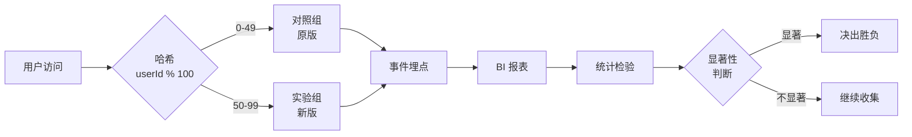

# [项目名称] - A/B 测试设计方案

| 版本 | 日期 | 作者 | 说明 |
|------|------|------|------|
| 1.0 | YYYY-MM-DD | [Your Name] | 初始版本（v4.3 新增模板） |

---

> 📖 **填写指南**：本文档用于产品 / 增长 / 数据科学团队设计 A/B 测试，输出可执行的上线方案、显著性判断、决策结论。
>
> 📌 **一页纸摘要**:
> 1. 看完这页能回答:测什么?怎么分流量?多久能出结论?谁负责?
> 2. 文档定位:测试级(实验),假设 + 流量 + 显著性 + 决策 + RACI
> 3. 核心动作:H0/H1 假设 → 流量分配 → 显著性检验 → 周期决策 → RACI
> 4. 何时使用:功能上线前 / 营销活动 / 增长实验 / 定价调整
> 5. 不要用于:用户调研(→用户调研报告)、需求定义(→06)
>
> 🔗 **关键引用**: `reference/12-value-matrix.md` (实验价值) · [`reference/13-quality-selfcheck.md`](../reference/13-quality-selfcheck.md) (实验自检) · [`reference/15-five-field-crosscheck.md`](../reference/15-five-field-crosscheck.md) (5 字段交叉) · [`reference/16-common-pitfalls.md`](../reference/16-common-pitfalls.md) (实验常见错误)
>
> **所属阶段**：测试
> **价值判定**：必含(凡涉及线上对比/灰度/增长的变更都应产出)

---

## 0. 填写指南

### 0.0 本文档价值

> **回答的核心问题**：
> 1. 我们想验证什么假设？（H0 / H1）
> 2. 流量怎么分？分多久？样本量够吗？
> 3. 用什么方法判断显著？怎么避免假阳/假阴？
> 4. 早停 / 继续 / 决出胜负的判定阈值是什么？
> 5. 谁提需求 / 谁实现 / 谁分析 / 谁拍板？
>
> **不回答什么**：产品需求定义(→06)、技术选型(→13)
>
> **价值判定**：实验团队 1 小时内可启动、数据分析师有标准可依、决策者有门槛可判
>
> **所属阶段**：测试（实验管理子阶段）

### 0.1 文档结构

| 章节 | 内容 | 主笔 | 必含 |
|------|------|------|------|
| 1. 实验信息 | 编号、目标、负责人 | PM | [必填] |
| 2. 假设设计 | H0 / H1 / 指标 / MDE | PM + 数据 | [必填] |
| 3. 流量分配 | 比例 / 哈希键 / 灰度 | 数据 + 研发 | [必填] |
| 4. 显著性方法 | t 检验 / 卡方 / Bayesian | 数据 | [必填] |
| 5. 周期决策表 | 早停 / 继续 / 决胜 | 数据 | [必填] |
| 6. RACI 矩阵 | 4 角色 × 5 任务 | PM | [必填] |
| 7. 风险与回滚 | SRM 检查 / 异常熔断 | 研发 + 数据 | [可选] |
| 8. 结果复盘 | 结论 / 后续动作 | PM | [可选] |

### 0.2 实验分级

| 级别 | 流量占比 | 持续时长 | 评审级别 |
|------|----------|----------|----------|
| **E1 探索** | ≤ 1% | 1-3 天 | PM 自决 |
| **E2 验证** | 1-10% | 1-2 周 | 产品 + 数据 |
| **E3 决策** | 10-50% | 2-4 周 | 产品 + 业务 + 高管 |
| **E4 全量** | 100% | 持续 | 全量发布评审 |

---

## 1. 实验基本信息

| 字段 | 内容 |
|------|------|
| **实验编号** | EXP-YYYYMMDD-NNN |
| **实验名称** | [简明描述，如"新注册流程对转化率的影响"] |
| **实验类型** | UI 改版 / 流程优化 / 算法 / 定价 / 营销 |
| **实验级别** | E1 / E2 / E3 / E4 |
| **提需求方** | [姓名 + 部门] |
| **实现方** | [研发 TL] |
| **分析方** | [数据科学家] |
| **决策方** | [产品 / 业务 / 高管] |
| **计划开始** | YYYY-MM-DD |
| **计划结束** | YYYY-MM-DD |

---

## 2. 假设设计

### 2.1 假设陈述

> ⭐ **决策点**：采用"如果 X，那么 Y，因为 Z"的句式；本节是整个实验的灵魂。
> 决策理由：模糊假设 = 无法证伪 = 实验失败也说不清为什么。

**H0（原假设）**：[对照组] 和 [实验组] 在 [核心指标] 上无显著差异。

**H1（备择假设）**：[实验组] 的 [核心指标] 显著 [优于/低于] [对照组]。

**假设的业务逻辑**：[为什么我们会看到差异？背后机制是什么？]

### 2.2 指标体系

| 指标层级 | 指标名 | 计算方式 | 期望方向 | 优先级 |
|----------|--------|----------|----------|--------|
| **北极星** | [如：注册转化率] | 成功注册数 / 访问数 | 上升 | OEC |
| **核心指标** | [如：7 日留存] | 7 日内回访 / 总注册 | 上升 | P0 |
| **护栏指标** | [如：注册耗时] | 注册完成时间 P50 | 下降 | P0 |
| **反向指标** | [如：投诉率] | 投诉数 / 注册数 | 持平或下降 | P0 |
| **探索指标** | [如：分享率] | 分享事件 / DAU | - | P1 |

> **OEC（Overall Evaluation Criterion）**：北极星指标是"成功"的最终判据；多指标同时显著不一致时，以 OEC 为准。

### 2.3 最小可检测效应 MDE

> ⭐ **决策点**：MDE 不能拍脑袋，必须基于"业务可接受的最低提升"反推。
> 决策理由：MDE 太小 → 样本量爆炸 → 实验周期过长；MDE 太大 → 微小但有价值的提升被忽略。

| 参数 | 值 | 说明 |
|------|----|------|
| **基准值** | 当前核心指标 = X% | 取近 30 天数据 |
| **MDE（相对）** | 提升 Y%（相对）| 如 5% / 10% |
| **α（显著性）** | 0.05 | 默认双尾 |
| **β（统计功效）** | 0.80 | 默认 |
| **计算样本量** | N = [公式代入] | 每组样本量 |
| **预估实验周期** | N / 日均流量 | 天 |

> MDE 计算公式（双样本比例检验）：
> ```
> n = (Z_{α/2} + Z_β)² × [p1(1-p1) + p2(1-p2)] / (p2 - p1)²
> ```

---

## 3. 流量分配

### 3.1 分配方案选择

> ⭐ **决策点**：3 种分配方式各有适用场景，本节给出选型决策树。
> 决策理由：选错分配 = 实验数据不可信 = 大量返工。

| 方案 | 比例 | 适用场景 | 风险 |
|------|------|----------|------|
| **50/50** | 1:1 | 大流量、需快速决策 | 一半用户用旧版 2-4 周 |
| **90/10** | 9:1 | 大改版、风险高 | 样本量需求翻 10 倍 |
| **多臂老虎机** | 动态 | 长期运行、追求收益最大化 | 实现复杂、需要 MAB 平台 |
| **灰度逐步放大** | 1% → 5% → 20% → 50% | 大型改版 | 周期长、多轮评审 |

**本实验选择**：[方案 + 理由]

### 3.2 分桶规则



| 字段 | 内容 |
|------|------|
| **哈希键** | `userId`（必填，禁 `user_id` / `uid`） |
| **哈希算法** | MurmurHash3 / MD5 / FNV |
| **取模基数** | 100（50/50）/ 1000（更细粒度） |
| **桶号范围** | 对照组 [0, 49]、实验组 [50, 99] |
| **白名单** | 内部员工、QA 账号固定入实验组 |

> **5 字段交叉**：实验分组标识 `experimentId` 和 `bucketId` 必须在 03 接口文档 / 11 Mock 数据 / 12 数据库设计 4 处命名一致（参考 reference/15）。

#### 3.2.1 5 字段全量定义（与 reference/15 §1 速查表保持一致）

| 字段 | 命名规范 | 类型 | 本实验中的具体取值 | 出现位置数 | 备注 |
|------|----------|------|-------------------|------------|------|
| **userId** | 统一 `userId`（禁 `user_id` / `uid` / `userID` / `UserId`） | string（UUID v4 推荐） | `userId`（分桶键，禁其他拼写） | 4 处 | 7+ 文档中出现 |
| **status** | 统一 `status`（禁 `state` / `Status` / `STATUS`） | enum | EXPERIMENT_RUNNING / EXPERIMENT_PAUSED / EXPERIMENT_DONE | 4 处 | 跨端 5 处必须一致 |
| **必填规则** | 统一"必填 / 可选" | 字段级 | experimentId 必填 / bucketId 必填 / exposureLogId 可选 | 2 处 | 4 处文档标注一致 |
| **错误码** | 6 位数字 AABBCC | string | 110001 用户不在白名单 / 110002 实验已结束 / 110003 桶号越界 | 3 处 | 必须有"错误码总表" |
| **P0 功能名** | 中文名 + 英文标识 | string | 实验创建 `ExperimentCreate` / 分桶 `UserBucketing` / 显著性分析 `SignificanceAnalysis` | 4 处 | 3-8 个为宜 |

**A/B 测试特有字段**（在 5 字段之外的扩展字段）：

| 字段 | 命名规范 | 类型 | 出现位置数 | 备注 |
|------|----------|------|------------|------|
| **experimentId** | 统一 `experimentId`（禁 `exp_id` / `eid`） | string | 4 处 | 实验唯一标识 |
| **bucketId** | 统一 `bucketId`（禁 `bucket_id` / `bid`） | string | 4 处 | 用户分桶标识 |
| **exposureLogId** | 统一 `exposureLogId`（禁 `exposure_id`） | string | 3 处 | 曝光日志 ID |

> **必填规则详细**：5 字段必填性必须在以下 4 处文档标注一致：① 06-PRD §字段定义 / ② 03-接口文档 §字段表 / ③ 12-数据库设计 §DDL / ④ 11-Mock 数据文档 §示例。
> **验证命令**：`grep -E "\b(user_id|uid|userID|UserId|exp_id|bucket_id|exposure_id)\b" <4 个文档>` 期望 0 命中。

### 3.3 SRM 样本比例失衡检查

> **SRM（Sample Ratio Mismatch）**：实际分组比例与设计比例偏差 > 1%，需立即熔断。
> 计算：χ² = (实际 - 期望)² / 期望 × 组数；P < 0.001 视为严重失衡。

---

## 4. 显著性检验方法

### 4.1 方法选型

| 指标类型 | 数据分布 | 推荐方法 | 备选 |
|----------|----------|----------|------|
| **连续型**（耗时、金额） | 近似正态 | 双样本 t 检验 | Mann-Whitney U |
| **二分类**（转化、点击） | 二项分布 | 双比例 Z 检验 | 卡方检验 |
| **计数型**（次数、PV） | 泊松分布 | 泊松回归 | 负二项回归 |
| **多分类** | 多项分布 | 卡方检验 | 多项 logistic |
| **复杂场景** | 混合 | Bayesian | 序贯检验 |

### 4.2 双样本 t 检验详细配置

> 适用：连续型指标（如订单金额、停留时长）

| 参数 | 配置 |
|------|------|
| **H0** | μ_treatment = μ_control |
| **H1** | μ_treatment ≠ μ_control（双尾）/ >（单尾）|
| **α** | 0.05 |
| **功效** | 0.80 |
| **方差齐性** | Levene 检验 P > 0.05 视为齐性 |
| **多重比较** | Bonferroni 校正：α' = α / k（k = 指标数） |

### 4.3 双比例 Z 检验详细配置

> 适用：转化率、点击率、注册率等

| 参数 | 配置 |
|------|------|
| **H0** | p_treatment = p_control |
| **H1** | p_treatment > p_control（单尾更常用）|
| **α** | 0.05（双尾）/ 0.025（单尾）|
| **合并比例** | p_pool = (x1 + x2) / (n1 + n2) |
| **Z 统计量** | (p1 - p2) / sqrt(p_pool × (1-p_pool) × (1/n1 + 1/n2)) |

### 4.4 Bayesian 方法

> 适用：样本量小、需给出"提升概率"决策语

| 要素 | 说明 |
|------|------|
| **先验分布** | Beta(1, 1) 或历史数据拟合 |
| **后验采样** | MCMC 10000 次 |
| **决策语** | "实验组 > 对照组的概率 = 95%" |
| **优势** | 直接给出"胜出概率"、可中途看、适合小样本 |

### 4.5 序贯检验（可选）

> 适用：希望早停、节省流量

| 参数 | 配置 |
|------|------|
| **α 花费函数** | O'Brien-Fleming（前期严格，后期放松） |
| **中期分析次数** | 3-5 次（避免过度偷看） |
| **最终 α** | 仍保持 0.05（序贯消耗后） |

---

## 5. 周期决策表

### 5.1 三类决策

| 决策 | 触发条件 | 后续动作 |
|------|----------|----------|
| **早停** | SRM 严重失衡 / 数据异常 / 严重负向 | 立即熔断 + 复盘 |
| **继续** | 未达预设样本量 + 无显著 + 无负向 | 继续收集至样本量 |
| **决出胜负** | 达到样本量 + 显著 + 护栏 OK | 100% 全量 / 保留对照 |

### 5.2 决策阈值矩阵

| 指标状态 | 核心指标显著 | 护栏指标 OK | 决策 |
|----------|--------------|-------------|------|
| 状态 A | 显著 + 正向 | 全部持平 | [必填] 全量发布 |
| 状态 B | 显著 + 正向 | 1 项恶化但可接受 | [可选] 有条件全量 |
| 状态 C | 显著 + 负向 | - | [必填] 熔断 + 复盘 |
| 状态 D | 不显著 | 全部持平 | [可选] 延长或放弃 |
| 状态 E | 不显著 | 1 项恶化 | [必填] 立即熔断 |
| 状态 F | 显著 + 正向 | 1 项严重恶化 | [必填] 拒绝全量 |

### 5.3 决策时点检查表

- [ ] 实验运行 ≥ 7 天（覆盖工作日/周末）
- [ ] 达到预设样本量
- [ ] SRM 检验通过（P > 0.001）
- [ ] 护栏指标无严重恶化
- [ ] 数据完整性 > 99%
- [ ] 反向指标无异常

> ⭐ **决策点**：实验第 7 天 / 14 天 / 21 天固定做中期评审，避免"边走边看"导致假阳率上升。

---

## 6. RACI 矩阵

| 任务 | 提需求方 | 实现方 | 分析方 | 决策方 | 备注 |
|------|----------|--------|--------|--------|------|
| 假设与指标设计 | R | C | C | A | PM 主笔 |
| 流量分配与埋点 | C | R | C | I | 研发落地 |
| 实验配置上线 | I | R | C | I | 灰度发布 |
| 数据监控日报 | I | C | R | I | 每日发送 |
| 中期评审 | C | I | R | A | 第 7/14 天 |
| 显著性判断 | I | I | R | A | 数据科学家 |
| 全量决策 | C | I | R | A | 决策方拍板 |
| 复盘与归档 | R | C | C | I | 输出结论 |

> R = Responsible（执行）/ A = Accountable（最终负责）/ C = Consulted（咨询）/ I = Informed（知会）

---

## 7. 风险与回滚

### 7.1 风险登记表

| 编号 | 风险 | 等级 | 缓解策略 | 责任人 |
|------|------|------|----------|--------|
| R-01 | SRM 样本失衡 | 高 | 每日监控 + 立即熔断 | 数据 |
| R-02 | 埋点漏报/重报 | 高 | 灰度期间人工核对 | 研发 |
| R-03 | 节假日效应 | 中 | 排除节假日数据 | 数据 |
| R-04 | 新用户 vs 老用户混淆 | 中 | 切片分析 | 数据 |
| R-05 | 实验组负向影响留存 | 高 | 7 日留作护栏 + 30 日扩展观察 | 产品 |
| R-06 | 哈希函数不稳定 | 中 | 冻结用户桶号 | 研发 |

### 7.2 回滚预案

| 触发条件 | 回滚动作 | 责任人 | SLA |
|----------|----------|--------|-----|
| P0 故障 | 5 分钟内切回对照组 | 研发 OnCall | 5 分钟 |
| SRM 失衡 | 1 小时内停止入组 | 数据 | 1 小时 |
| 核心指标下降 > 10% | 24 小时内决定是否熔断 | 产品 | 24 小时 |

---

## 8. 结果复盘（实验结束后填写）

| 字段 | 内容 |
|------|------|
| **实验结论** | 显著正向 / 显著负向 / 无显著差异 |
| **提升幅度** | [X% ± 置信区间] |
| **护栏情况** | 全部 OK / N 项恶化 |
| **最终决策** | 全量发布 / 保留对照 / 放弃 / 继续迭代 |
| **业务影响** | 预估年化收益 XXX 万元 |
| **后续动作** | 1. ... 2. ... 3. ... |

### 8.1 经验沉淀

- 学到了什么？
- 假设哪里错了？
- 下次怎么改进？

---

## 9. 必含项自检

- [ ] H0 / H1 明确陈述
- [ ] OEC 北极星指标 + P0 护栏指标 ≥ 3 个
- [ ] MDE 反推样本量，实验周期可执行
- [ ] 流量分配方案 + 哈希键 + SRM 检查机制
- [ ] 显著性方法 + α / 功效 / 多重比较校正
- [ ] 决策阈值表（6 种状态全覆盖）
- [ ] RACI 4 角色 × 8 任务明确
- [ ] 回滚预案 + SLA
- [ ] 实验编号 / `experimentId` 与 03 / 11 / 12 文档一致（reference/15）

---

## 摘要(降级输出,200 字内)

> ⚠️ 待 v4.2.2 填充
>
> 模板定位：测试级(实验管理),5 必含 = 假设 + 流量 + 显著性 + 决策 + RACI。核心交付:H0/H1 假设陈述、MDE 反推样本量、3 种流量分配选型、t/Z/Bayesian 显著性方法、6 状态决策矩阵、4 角色 RACI。决策点 3 处(假设句式/MDE 反推/分配选型)。Mermaid 1 张(分桶时序)。RACI + 5 字段交叉(reference/15)是质量底线。
