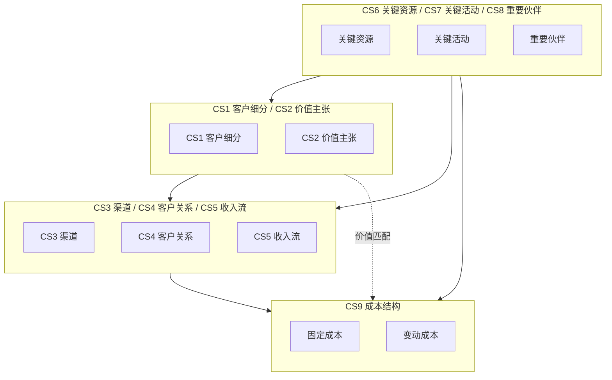
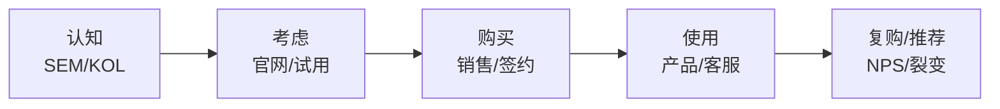
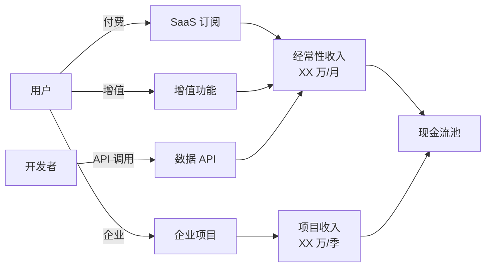

# [项目名称] - 商业模式画布（BMC）

| 版本 | 日期 | 作者 | 说明 |
|------|------|------|------|
| 1.0 | YYYY-MM-DD | [Your Name] | 初始版本（v4.3 新增模板） |

---

> 📖 **填写指南**：本文档用 Osterwalder 9 宫格画布描述商业模式，适用于新业务立项、商业模式迭代、投融资 BP。
>
> 📌 **一页纸摘要**:
> 1. 看完这页能回答:为谁?解决什么?怎么收钱?成本几何?
> 2. 文档定位:调研级(商业模式),9 宫格画布 + 收入流链路
> 3. 核心动作:CS1-CS9 填写 + 收入流图 + 成本结构拆分
> 4. 何时使用:新业务立项 / 商业模式复盘 / 投融资 BP / 战略转型
> 5. 不要用于:产品功能(→06)、技术选型(→13)
>
> 🔗 **关键引用**: `reference/12-value-matrix.md` (BMC 价值) · [`reference/13-quality-selfcheck.md`](../reference/13-quality-selfcheck.md) (BMC 自检) · [`reference/15-five-field-crosscheck.md`](../reference/15-five-field-crosscheck.md) (5 字段交叉) · [`reference/16-common-pitfalls.md`](../reference/16-common-pitfalls.md) (BMC 常见错误)
>
> **所属阶段**：调研 / 设计
> **价值判定**：必含(任何商业项目立项前都应产出)

---

## 0. 填写指南

### 0.0 本文档价值

> **回答的核心问题**：
> 1. 客户是谁？（CS1 客户细分）
> 2. 提供什么价值？（CS2 价值主张）
> 3. 怎么触达 / 怎么服务 / 怎么收钱？（CS3-CS5）
> 4. 需要什么资源 / 做什么关键动作 / 谁是伙伴？（CS6-CS8）
> 5. 主要成本是什么？（CS9 成本结构）
>
> **不回答什么**：产品功能(→06)、技术实现(→09/04)
>
> **价值判定**：投资人 5 分钟看懂商业逻辑、团队明确"靠什么赚钱"
>
> **所属阶段**：调研（商业分析子阶段）

### 0.1 9 宫格速查

| 编号 | 区块 | 核心问题 | 必含项 |
|------|------|----------|--------|
| **CS1** | 客户细分 | 为谁服务？| 细分类型 + 关键特征 |
| **CS2** | 价值主张 | 解决什么问题？| 3-5 个核心价值点 |
| **CS3** | 渠道 | 怎么触达？| 渠道类型 + 触点 |
| **CS4** | 客户关系 | 怎么维护？| 关系类型 + 自动化程度 |
| **CS5** | 收入流 | 怎么收钱？| 定价模式 + 单价 + LTV |
| **CS6** | 关键资源 | 需要什么？| 4 类资源：物理/知识/人力/财务 |
| **CS7** | 关键活动 | 关键动作？| 3-5 个关键动作 |
| **CS8** | 重要伙伴 | 合作方？| 4 类伙伴：战略/竞合/合资/供应 |
| **CS9** | 成本结构 | 主要成本？| 固定 + 变动 + 规模经济 |

### 0.2 填写原则

- **每格 ≤ 50 字**：要的是"电梯演讲"，不是"百科全书"
- **数字优先**：能写百分比/金额的写数字；写"大量用户"无效
- **相互校验**：CS1-CS2 闭环、CS2-CS5 闭环、CS6-CS9 闭环
- **可证伪**：每个结论都能被一句话反驳，否则就是空话

---

## 1. 9 宫格画布总览

### 1.1 画布填写表

| 区块 | 内容 | 填写要求 |
|------|------|----------|
| **CS1 客户细分** | [填] | 至少 2 个细分 |
| **CS2 价值主张** | [填] | 3-5 条 |
| **CS3 渠道** | [填] | 触达 + 交付 |
| **CS4 客户关系** | [填] | 关系类型 + 维护成本 |
| **CS5 收入流** | [填] | 定价 + 单价 + LTV |
| **CS6 关键资源** | [填] | 4 类各列 1-2 项 |
| **CS7 关键活动** | [填] | 3-5 个 |
| **CS8 重要伙伴** | [填] | 4 类各列 1 项 |
| **CS9 成本结构** | [填] | 固定 + 变动 |

---

## 2. CS1 客户细分

> ⭐ **决策点**：客户细分不是按"年龄/性别"分，而是按"待完成任务(JTBD)"分。
> 决策理由：人口学细分难以指导产品和定价；JTBD 细分直接对应差异化价值主张。

| 细分编号 | 细分名称 | 关键特征 | 规模 | ARPU | 优先级 |
|----------|----------|----------|------|------|--------|
| SEG-1 | [如：中小企业 HR] | 50-500 人、需快速招人 | XX 万家 | X 万元/年 | P0 |
| SEG-2 | [如：大企业 HR] | 500+ 人、需定制 | X 万家 | XX 万元/年 | P1 |
| SEG-3 | [如：猎头公司] | 候选人资源 + 撮合 | X 千家 | X 万元/年 | P2 |

### 2.1 客户画像

**SEG-1 画像**：

- **人口学**：行业、规模、地域
- **痛点**：3 个核心痛点
- **决策链**：使用者 / 影响者 / 决策者 / 付款人
- **替代方案**：当前在用什么替代

---

## 3. CS2 价值主张

> ⭐ **决策点**：价值主张要"差异化"，不要"全面"。
> 决策理由：全面 = 无重点 = 用户记不住 = 转化率低。

| 价值点 | 解决痛点 | 差异化 | 可量化 |
|--------|----------|--------|--------|
| VP-1 [快] | [招聘周期长] | [比传统快 50%] | [7 天 vs 14 天] |
| VP-2 [准] | [候选人匹配度低] | [AI 智能匹配] | [匹配准确率 +30%] |
| VP-3 [省] | [招聘成本高] | [按效果付费] | [成本降低 40%] |
| VP-4 [安全] | [合规风险] | [数据本地化] | [通过等保三级] |

### 3.1 价值主张画布（VPC）

| | 客户任务 | 痛点 | 收益 |
|---|----------|------|------|
| 功能性 | 招到合适的人 | 周期长、质量低 | 快速 + 精准 |
| 情感性 | 减少焦虑 | 担心招错人 | 数据可信赖 |
| 社交性 | 树立雇主品牌 | 候选人体验差 | 体验流畅 |

---

## 4. CS3 渠道

| 渠道类型 | 渠道 | 用途 | 成本占比 | 转化率 |
|----------|------|------|----------|--------|
| **触达** | 百度 SEM | 获客 | XX% | X% |
| **触达** | 行业 KOL | 品牌 | XX% | X% |
| **触达** | 异业合作 | 客户转介 | XX% | X% |
| **交付** | SaaS 平台 | 服务交付 | XX% | - |
| **交付** | 客户成功 | 大客户 | XX% | NPS XX |
| **售后** | 在线客服 | 答疑 | XX% | 满意度 X% |

### 4.1 渠道阶段漏斗

---

## 5. CS4 客户关系

| 客户细分 | 关系类型 | 自动化程度 | 维护成本 | 续约率 |
|----------|----------|------------|----------|--------|
| SEG-1 | 自助 + 社区 | 高 | 低 | XX% |
| SEG-1 | 在线客服 | 中 | 中 | XX% |
| SEG-2 | 客户经理 1v1 | 低 | 高 | XX% |

### 5.1 关系类型决策树

| 场景 | 推荐关系 |
|------|----------|
| 高 LTV + 复杂需求 | 客户经理 1v1 |
| 中 LTV + 标准需求 | 在线客服 + 知识库 |
| 低 LTV + 高频需求 | 自助 + 社区 |
| 平台型双边 | 撮合 + 评价 |

---

## 6. CS5 收入流

> ⭐ **决策点**：定价模式选择影响获客难度、续约率、长期 LTV。
> 决策理由：订阅制现金流稳但获客难；按次付费获客易但波动大。

| 收入来源 | 定价模式 | 单价 | 月销量 | 年收入 | 占比 |
|----------|----------|------|--------|--------|------|
| 基础 SaaS | 订阅（月） | X 元/月 | X 万 | X 百万 | XX% |
| 增值功能 | 用量计费 | Y 元/次 | X 万 | X 百万 | XX% |
| 高级服务 | 项目制 | Z 万元/次 | X | X 百万 | XX% |
| 数据 API | 调用计费 | 0.1 元/次 | X 千万 | X 百万 | XX% |

### 6.1 收入流链路图

### 6.2 单位经济模型（LTV / CAC）

| 指标 | 数值 | 行业基准 | 评级 |
|------|------|----------|------|
| **ARPU** | X 元/月 | Y 元/月 | [高/中/低] |
| **毛利率** | XX% | YY% | [高/中/低] |
| **CAC（获客成本）** | X 元 | Y 元 | [高/中/低] |
| **LTV（生命周期价值）** | X 元 | Y 元 | [高/中/低] |
| **LTV / CAC** | X | 3 为健康 | [健康/危险/不健康] |
| **回本周期** | X 个月 | < 12 月 | [快/慢] |

---

## 7. CS6 关键资源

> 4 类资源：物理 / 知识 / 人力 / 财务

| 资源类型 | 资源项 | 关键程度 | 现状 | 缺口 |
|----------|--------|----------|------|------|
| **物理** | [如：办公场地] | 中 | 有 | - |
| **物理** | [如：服务器] | 高 | 自建 | - |
| **知识** | [如：行业数据库] | 高 | 需采购 | 缺 |
| **知识** | [如：AI 模型] | 高 | 自研 | - |
| **人力** | [如：AI 工程师] | 高 | 5 人 | 缺 3 人 |
| **人力** | [如：行业销售] | 高 | 3 人 | 缺 5 人 |
| **财务** | [如：现金流] | 高 | X 个月 | 需融资 |

---

## 8. CS7 关键活动

| 活动 | 描述 | 频次 | 关键资源 | 风险 |
|------|------|------|----------|------|
| ACT-1 | [如：AI 模型迭代] | 周 | 数据 + 工程师 | 数据质量 |
| ACT-2 | [如：大客户 BD] | 月 | 销售 | 决策链长 |
| ACT-3 | [如：客户成功] | 周 | 客服 | 流失 |
| ACT-4 | [如：合规审计] | 季 | 法务 | 监管变化 |
| ACT-5 | [如：技术研发] | 持续 | 工程师 | 技术债 |

---

## 9. CS8 重要伙伴

| 伙伴类型 | 伙伴 | 价值 | 替代成本 |
|----------|------|------|----------|
| **战略** | [如：云厂商] | 算力 + 联合方案 | 高 |
| **竞合** | [如：友商 A] | 流量互换 | 中 |
| **合资** | [如：行业客户] | 行业 know-how | 中 |
| **供应** | [如：数据源] | 数据 | 低 |

---

## 10. CS9 成本结构

| 成本类型 | 项目 | 月成本 | 占比 | 优化空间 |
|----------|------|--------|------|----------|
| **固定** | 人力 | X 万 | XX% | - |
| **固定** | 场地 | X 万 | XX% | 中 |
| **固定** | 研发投入 | X 万 | XX% | - |
| **变动** | 获客 | X 万 | XX% | 大 |
| **变动** | 云服务 | X 万 | XX% | 大 |
| **变动** | 客服 | X 万 | XX% | 中 |

### 10.1 规模经济点

| 阶段 | 用户规模 | 单位成本 | 关键杠杆 |
|------|----------|----------|----------|
| 起步 | 0-1K | X 元 | 人力为主 |
| 增长 | 1K-10K | X 元 | 自动化 |
| 规模 | 10K-100K | X 元 | 边际成本递减 |
| 平台 | 100K+ | X 元 | 网络效应 |

---

## 11. 画布一致性校验

> 9 宫格不是独立 9 个块，是相互验证的体系。

| 校验对 | 验证问题 | 状态 |
|--------|----------|------|
| CS1 ↔ CS2 | 价值主张是否针对真实客户细分？| [ ] |
| CS2 ↔ CS5 | 用户是否愿意为价值付费？| [ ] |
| CS1 ↔ CS4 | 客户关系类型是否匹配客户预期？| [ ] |
| CS5 ↔ CS9 | 收入能否覆盖成本？| [ ] |
| CS6 ↔ CS7 | 资源能否支撑关键活动？| [ ] |
| CS7 ↔ CS8 | 关键活动是否依赖关键伙伴？| [ ] |
| CS1 ↔ CS3 | 渠道是否触达目标客户？| [ ] |
| CS5 ↔ CS4 | 客户关系投入是否匹配收入贡献？| [ ] |

---

## 12. 必含项自检

- [ ] 9 宫格全部填写（每格 ≥ 30 字）
- [ ] 客户细分 ≥ 2 类
- [ ] 价值主张 3-5 条（具体 + 量化）
- [ ] 收入流链路图（Mermaid）
- [ ] 单位经济模型（LTV / CAC ≥ 3）
- [ ] 成本结构（固定 + 变动）
- [ ] 画布一致性校验 8 项
- [ ] 1 张 9 宫格总览图（Mermaid）

---

## 摘要(降级输出,200 字内)

> ⚠️ 待 v4.2.2 填充
>
> 模板定位：调研级(商业模式),9 宫格画布 + 收入流链路。核心交付:CS1 客户细分(≥2)、CS2 价值主张(3-5条量化)、CS3 渠道(触达+交付)、CS4 客户关系、CS5 收入流(定价+LTV/CAC)、CS6 关键资源(4类)、CS7 关键活动(3-5)、CS8 重要伙伴(4类)、CS9 成本结构(固定+变动)。决策点 3 处(细分按JTBD/价值主张差异化/定价模式选型)。Mermaid 2 张(9 宫格+收入流)。画布一致性 8 项校验是质量底线。
