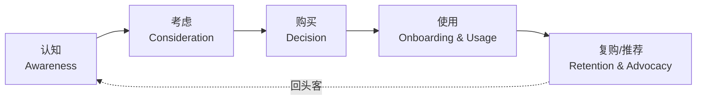
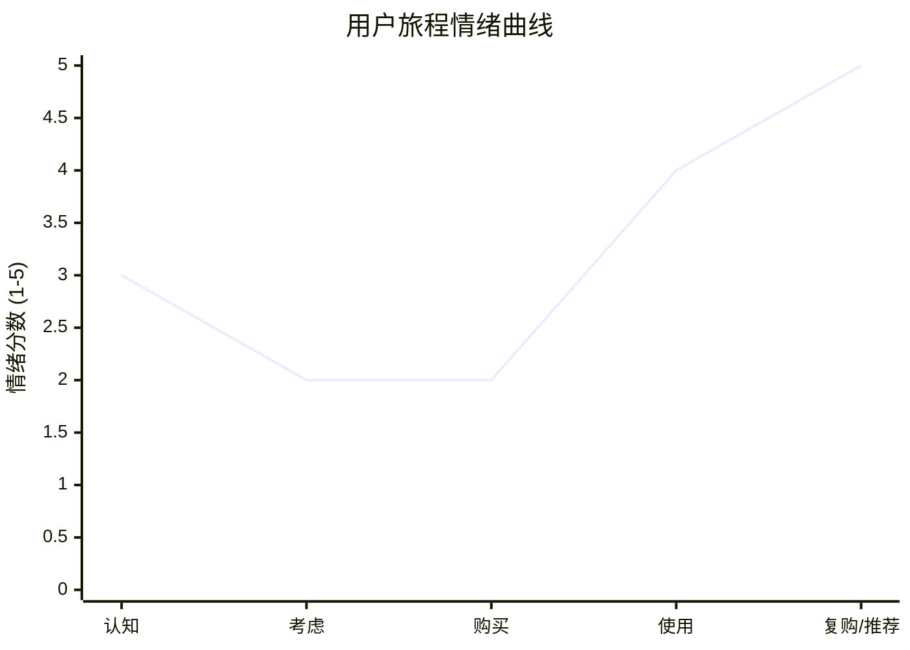

# [项目名称] - 用户旅程地图（CJM）

| 版本 | 日期 | 作者 | 说明 |
|------|------|------|------|
| 1.0 | YYYY-MM-DD | [Your Name] | 初始版本（v4.3 新增模板） |

---

> 📖 **填写指南**：本文档以 Persona 为锚点，描绘用户完成核心任务的全旅程，识别痛点与机会点。
>
> 📌 **一页纸摘要**:
> 1. 看完这页能回答:用户走过的路?每个阶段情绪?痛点在哪?机会在哪?
> 2. 文档定位:调研级(用户旅程),Persona + 5 阶段 + 触点 + 情绪 + 痛点 + 机会
> 3. 核心动作:锚定 Persona → 拆解阶段 → 触点表 → 情绪曲线 → 痛点机会
> 4. 何时使用:产品设计 / 体验优化 / 跨部门对齐 / 服务设计
> 5. 不要用于:功能定义(→06)、技术实现(→09/04)
>
> 🔗 **关键引用**: `reference/12-value-matrix.md` (CJM 价值) · [`reference/13-quality-selfcheck.md`](../reference/13-quality-selfcheck.md) (CJM 自检) · [`reference/15-five-field-crosscheck.md`](../reference/15-five-field-crosscheck.md) (5 字段交叉) · [`reference/16-common-pitfalls.md`](../reference/16-common-pitfalls.md) (CJM 常见错误)
>
> **所属阶段**：调研 / 设计
> **价值判定**：必含(凡涉及 C 端用户或多角色 B 端项目都应产出)

---

## 0. 填写指南

### 0.0 本文档价值

> **回答的核心问题**：
> 1. 用户是谁？（锚定哪个 Persona）
> 2. 用户走过的 5 个阶段是什么？（认知/考虑/购买/使用/复购）
> 3. 每个阶段用户做什么 / 接触什么？（行为 + 触点）
> 4. 每个阶段情绪如何？（情绪曲线）
> 5. 每个阶段痛点是什么？对应机会是什么？（痛点 → 机会）
>
> **不回答什么**：功能列表(→06)、技术实现(→09/04)
>
> **价值判定**：跨部门对"用户体验"有共同语言、产品决策有据可依
>
> **所属阶段**：调研（用户体验子阶段）

### 0.1 文档结构

| 章节 | 内容 | 主笔 | 必含 |
|------|------|------|------|
| 1. 锚定 Persona | 来源、引用、特征 | 调研 | [必填] |
| 2. 场景概述 | 核心任务、起点、终点 | 调研 | [必填] |
| 3. 阶段划分 | 5 阶段定义 | 调研 | [必填] |
| 4. 触点表 | 阶段 × 触点 | 调研 + 产品 | [必填] |
| 5. 情绪曲线 | 1-5 分 + Mermaid 图 | 调研 | [必填] |
| 6. 痛点清单 | 阶段 × 痛点 | 调研 + 用户 | [必填] |
| 7. 机会点 | 阶段 × 机会 + 责任人 | 产品 | [必填] |
| 8. 优先级矩阵 | 影响 × 频次 | 产品 | [可选] |

### 0.2 Persona 锚点

> CJM 必须基于一个**具体**的 Persona，而不是"用户"。
> 原因：泛化"用户" = 旅程模糊 = 痛点泛化 = 机会无落点。

**本旅程锚定**：PER-[XX] [Persona 名称]（详见 `06b-产品需求-用户与需求.md` §1 Persona 章节）

| 字段 | 内容 |
|------|------|
| **Persona 编号** | PER-01 |
| **Persona 名称** | [如：刚毕业的运营小白] |
| **核心 JTBD** | [如：在 1 周内独立完成一场 1000 人活动] |
| **关键特征** | 3-5 条 |
| **使用频次** | 高/中/低 |

### 0.3 情绪评分标准

| 分数 | 含义 | 典型语言 |
|------|------|----------|
| 1 分 | 极度沮丧 | "再也不用这产品了" |
| 2 分 | 不满 | "勉强能用，但很烦" |
| 3 分 | 中性 | "能用，没感觉" |
| 4 分 | 满意 | "还不错" |
| 5 分 | 惊喜 | "太棒了，要推荐给朋友" |

---

## 1. 锚定的 Persona

> 引用 `06b-产品需求-用户与需求.md` §1 中已定义的 Persona，本节不再重复，仅做引用与扩展。

### 1.1 Persona 速查

| 维度 | 内容 |
|------|------|
| **姓名** | [如：小李] |
| **年龄/职业** | [如：25 岁，运营专员] |
| **核心目标** | [如：高效组织线上活动] |
| **核心痛点** | [如：流程繁琐、工具割裂] |
| **典型场景** | [如：周一接到活动需求，周三要上线] |
| **技术熟练度** | [如：能熟练使用 SaaS，但不会写代码] |
| **决策权** | [如：执行层，无采购权] |

### 1.2 Persona 扩展画像

| 维度 | 详情 |
|------|------|
| **日常生活** | 9 点上班，20 点下班，常加班到 22 点 |
| **工作工具** | 微信、钉钉、WPS、Notion |
| **信息获取** | 小红书、知乎、朋友推荐 |
| **付费意愿** | 个人不付费；公司报销敏感 |

---

## 2. 场景概述

### 2.1 核心任务

> Persona 在 [时间窗口] 内，完成 [核心任务]，达成 [期望结果]。

| 字段 | 内容 |
|------|------|
| **任务** | [如：举办一场 1000 人线上直播活动] |
| **起点** | [如：接到活动需求] |
| **终点** | [如：活动复盘完成] |
| **时间窗** | [如：3-7 天] |
| **成功标准** | [如：1000 人报名 + 满意度 ≥ 4.0] |
| **失败标准** | [如：报名 < 500 或 投诉 > 10 起] |

### 2.2 旅程覆盖范围

| 范围 | 包含 |
|------|------|
| **In Scope** | 主路径 + 2 个典型分支 |
| **Out of Scope** | 极端异常（系统宕机等）|

---

## 3. 阶段划分

### 3.1 5 阶段定义

| 阶段 | 用户目标 | 关键问题 | 持续时间 |
|------|----------|----------|----------|
| **认知** | 知道产品存在 | "这能解决我的问题吗？" | 1-7 天 |
| **考虑** | 评估产品 | "比我现在用的好在哪？" | 1-3 天 |
| **购买** | 注册/付费 | "值得注册试试吗？" | < 1 天 |
| **使用** | 完成核心任务 | "能顺利完成任务吗？" | 3-7 天 |
| **复购/推荐** | 持续使用或推荐 | "值得继续用/告诉朋友吗？" | 持续 |

### 3.2 阶段与触点对应

| 阶段 | 触点 | 用户行为 | 用户想法 |
|------|------|----------|----------|
| 认知 | SEM / 朋友推荐 | 搜索"活动工具" | "这种工具多吗？" |
| 考虑 | 官网 / 评测 | 看功能对比 | "能不能用得起？" |
| 购买 | 注册页 | 填写资料 | "麻烦吗？要绑卡吗？" |
| 使用 | 产品主流程 | 一步步操作 | "这个按钮在哪？" |
| 复购 | 续费提示 / 社群 | 看 ROI | "下个月还续费吗？" |

---

## 4. 触点表

> ⭐ **决策点**：触点要"全"，不能只列数字触点。
> 决策理由：用户旅程是"多感官多渠道"的，遗漏触点 = 痛点被掩盖。

### 4.1 触点全景

| 阶段 | 触点类型 | 触点名称 | 渠道 | 用户动作 | 触点情绪 |
|------|----------|----------|------|----------|----------|
| 认知 | 数字 | SEM 搜索结果 | 百度 | 点击进入官网 | 中性 |
| 认知 | 数字 | 公众号推文 | 微信 | 扫二维码关注 | 中性 |
| 认知 | 口碑 | 朋友推荐 | 微信 | 询问使用感受 | 信任 |
| 考虑 | 数字 | 官网首页 | Web | 浏览功能介绍 | 中性 |
| 考虑 | 数字 | 产品 Demo 视频 | B站 | 观看 3 分钟 | 兴趣 |
| 考虑 | 数字 | 用户评价 | 知乎 | 阅读真实反馈 | 犹豫 |
| 购买 | 数字 | 注册页 | Web | 填手机号 + 验证码 | 警惕 |
| 购买 | 人工 | 销售 1v1 | 微信 | 询问价格 | 紧张 |
| 使用 | 数字 | 引导教程 | App | 3 步引导 | 期待 |
| 使用 | 数字 | 产品主流程 | App | 创建活动 | 流畅 |
| 使用 | 人工 | 在线客服 | 微信 | 提问问题 | 焦虑 |
| 使用 | 物理 | 邮件通知 | 邮箱 | 收到活动提醒 | 惊喜 |
| 复购 | 数字 | 数据看板 | App | 查看活动 ROI | 满意 |
| 复购 | 数字 | 续费提示 | App | 收到续费推送 | 中性 |
| 复购 | 口碑 | 推荐链接 | Web | 分享给朋友 | 主动 |

### 4.2 触点渠道分类

| 渠道大类 | 子渠道 | 触点数 | 占比 |
|----------|--------|--------|------|
| **数字自服务** | Web / App | 8 | 53% |
| **数字互动** | 微信 / 邮件 | 4 | 27% |
| **人工服务** | 销售 / 客服 | 2 | 13% |
| **口碑** | 朋友 / 社群 | 1 | 7% |
| **合计** | - | **15** | 100% |

---

## 5. 情绪曲线

### 5.1 情绪评分表

| 阶段 | 情绪分 | 用户语言（典型引用）|
|------|--------|---------------------|
| 认知 | 3 | "好像是这么回事，但不确定" |
| 考虑 | 2 | "和 XX 工具差不多，价格还贵一点" |
| 购买 | 2 | "又要手机号，又要企业认证，烦" |
| 使用 | 4 | "比想象的简单，10 分钟搭好框架" |
| 复购 | 5 | "下次活动还用！省了 2 个实习生" |

### 5.2 情绪曲线图

### 5.3 情绪拐点分析

| 拐点 | 阶段 | 描述 | 改进方向 |
|------|------|------|----------|
| **谷底 1** | 考虑 | 和竞品同质化 | 强化差异化 |
| **谷底 2** | 购买 | 注册摩擦大 | 简化流程 |
| **峰值 1** | 使用 | 主流程顺畅 | 保持并放大 |
| **峰值 2** | 复购 | ROI 显著 | 强化口碑传播 |

---

## 6. 痛点清单

| 编号 | 阶段 | 痛点描述 | 严重度 | 频次 | 影响范围 | 来源 |
|------|------|----------|--------|------|----------|------|
| P-01 | 认知 | 和竞品功能相似，无差异化记忆点 | 高 | 高 | 100% | 用户访谈 #3 |
| P-02 | 考虑 | 官网无价格信息，需加销售微信 | 中 | 高 | 80% | 数据分析 |
| P-03 | 购买 | 注册需企业认证，个人开发者放弃 | 高 | 中 | 30% | 漏斗分析 |
| P-04 | 购买 | 实名认证需 1-2 小时 | 中 | 高 | 60% | 用户反馈 |
| P-05 | 使用 | 第一次创建活动，找不到入口 | 高 | 高 | 50% | 热图分析 |
| P-06 | 使用 | 数据看板加载慢（>5 秒）| 中 | 中 | 40% | 性能监控 |
| P-07 | 使用 | 客服响应慢（>30 分钟）| 中 | 低 | 10% | 客服记录 |
| P-08 | 复购 | 续费推送太频繁，嫌烦 | 中 | 中 | 20% | NPS 反馈 |
| P-09 | 复购 | 推荐链接无奖励机制 | 低 | 高 | 70% | 调研 |

---

## 7. 机会点

> 痛点 → 机会 → 责任 → 排期，4 步闭环。

| 编号 | 对应痛点 | 机会点 | 价值 | 成本 | 优先级 | 责任人 | 排期 |
|------|----------|--------|------|------|--------|--------|------|
| O-01 | P-01 | 突出"AI 智能 + 3 分钟上手"差异化文案 | 高 | 低 | P0 | 市场 | 2 周 |
| O-02 | P-02 | 官网增加价格透明页 | 中 | 低 | P0 | 产品 | 1 周 |
| O-03 | P-03 | 增加个人版注册（功能受限）| 高 | 中 | P0 | 产品 + 研发 | 4 周 |
| O-04 | P-05 | 首次使用引导 + 模板库 | 高 | 中 | P0 | 产品 + 研发 | 3 周 |
| O-05 | P-06 | 看板性能优化（< 2 秒）| 中 | 中 | P1 | 研发 | 6 周 |
| O-06 | P-07 | 客服 AI 预处理 + SLA 监控 | 中 | 中 | P1 | 客服 + AI | 8 周 |
| O-07 | P-08 | 续费推送个性化（按使用频次）| 低 | 中 | P2 | 增长 | 4 周 |
| O-08 | P-09 | 推荐奖励（双向返现）| 高 | 中 | P1 | 增长 | 6 周 |

### 7.1 机会点价值评估矩阵

| | 成本高 | 成本中 | 成本低 |
|---|--------|--------|--------|
| **价值高** | 慎重 | P0 | P0 |
| **价值中** | 暂缓 | P1 | P0 |
| **价值低** | 放弃 | P2 | P2 |

---

## 8. 关键触点优先级矩阵

| 触点 | 影响度 | 满意度 | 优先级 | 改进策略 |
|------|--------|--------|--------|----------|
| 官网首页 | 高 | 低 | 优 | 重新设计 |
| 注册页 | 高 | 低 | 优 | 简化流程 |
| 引导教程 | 中 | 中 | 维 | 持续优化 |
| 产品主流程 | 高 | 高 | 维 | 保持 |
| 数据看板 | 中 | 中 | 维 | 性能优化 |
| 在线客服 | 中 | 中 | 维 | SLA 提升 |
| 续费推送 | 中 | 低 | 改 | 个性化 |
| 推荐链接 | 中 | 中 | 维 | 加奖励 |

> 优 = 优先改进 / 维 = 维持现状 / 改 = 改善

---

## 9. 跨旅程对比（可选）

> 如果有多个 Persona，可横向对比

| 旅程阶段 | Persona 1（小李）| Persona 2（王经理）| Persona 3（张总）|
|----------|------------------|---------------------|-------------------|
| 认知 | 小红书 | 朋友推荐 | 行业大会 |
| 考虑 | 看价格 | 看 ROI | 看安全合规 |
| 购买 | 个人注册 | 团队注册 | 企业采购 |
| 使用 | 每天用 | 每周用 | 每月看报表 |
| 复购 | 看便利 | 看数据 | 看战略价值 |

---

## 10. 必含项自检

- [ ] 锚定 1 个具体 Persona（PER-XX）
- [ ] 5 阶段全覆盖（认知/考虑/购买/使用/复购）
- [ ] 触点表 ≥ 15 个触点
- [ ] 情绪评分 5 阶段 + Mermaid 曲线图
- [ ] 痛点清单 ≥ 5 条（每条含严重度/频次/来源）
- [ ] 机会点 ≥ 5 条（每条含价值/成本/优先级/责任人/排期）
- [ ] 痛点 → 机会 → 责任 → 排期 4 步闭环
- [ ] Persona 引用自 `06b-产品需求-用户与需求.md` §1

---

## 摘要(降级输出,200 字内)

> ⚠️ 待 v4.2.2 填充
>
> 模板定位:调研级(用户体验),Persona + 5 阶段 + 触点 + 情绪 + 痛点 + 机会。核心交付:锚定 1 个具体 Persona、5 阶段(认知/考虑/购买/使用/复购)、触点表 ≥15 个、情绪 1-5 分曲线、痛点清单(严重度/频次/范围/来源)、机会点(价值/成本/优先级/责任人/排期)、痛→机→责→期 4 步闭环。决策点 1 处(锚定具体 Persona)。Mermaid 2 张(阶段流程+情绪曲线 xychart-beta)。触点"全"是质量底线,不能只列数字触点。
