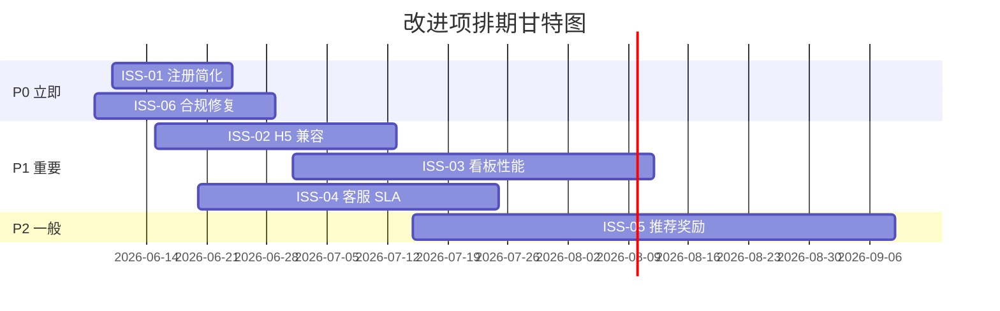

# [项目名称] - 上线后复盘报告（PLR）

| 版本 | 日期 | 作者 | 说明 |
|------|------|------|------|
| 1.0 | YYYY-MM-DD | [Your Name] | 初始版本（v4.3 新增模板） |

---

> 📖 **填写指南**：本文档用于项目上线 30/60/90 天后的系统复盘，包含指标对照、ROI、OKR、问题清单与改进项。
>
> 📌 **一页纸摘要**:
> 1. 看完这页能回答:达成预期了吗?ROI 如何?问题清单?改什么?
> 2. 文档定位:复盘级(治理),30/60/90 天指标 + ROI + OKR + 改进项
> 3. 核心动作:指标对照 → ROI 复盘 → OKR → 问题清单 → Lessons → 改进项
> 4. 何时使用:30/60/90 天固定复盘 / 重大版本发布后 / 季度复盘
> 5. 不要用于:需求定义(→06)、技术实现(→09/04)
>
> 🔗 **关键引用**: `reference/12-value-matrix.md` (复盘价值) · [`reference/13-quality-selfcheck.md`](../reference/13-quality-selfcheck.md) (复盘自检) · [`reference/15-five-field-crosscheck.md`](../reference/15-five-field-crosscheck.md) (5 字段交叉) · [`reference/16-common-pitfalls.md`](../reference/16-common-pitfalls.md) (复盘常见错误)
>
> **所属阶段**：复盘 / 治理
> **价值判定**：必含(任何重大版本上线后都应产出)

---

## 0. 填写指南

### 0.0 本文档价值

> **回答的核心问题**：
> 1. 30/60/90 天指标是否达成预期？（指标对照）
> 2. 实际 ROI 与预期 ROI 差距多大？（ROI 复盘）
> 3. OKR 各项达成度如何？（OKR 达成度）
> 4. 上线后遇到哪些问题？严重度排序？（问题清单）
> 5. 团队学到了什么？（Lessons Learned）
> 6. 下一步改什么？谁负责？何时完成？（改进项）
>
> **不回答什么**：需求定义(→06)、技术实现(→09/04)
>
> **价值判定**：高管 5 分钟看懂项目成败、团队明确改进行动
>
> **所属阶段**：复盘

### 0.1 文档结构

| 章节 | 内容 | 主笔 | 必含 |
|------|------|------|------|
| 1. 复盘基本信息 | 项目、上线日期、复盘类型 | PM | [必填] |
| 2. 30/60/90 天指标对照 | 预期 vs 实际 | 数据 | [必填] |
| 3. ROI 复盘 | 投入 vs 收益 | 财务 + PM | [必填] |
| 4. OKR 达成度 | O 1-3 + KR 1-N 评分 | 全体 | [必填] |
| 5. 问题清单 | 严重度 × 频次 | 全体 | [必填] |
| 6. Lessons Learned | 团队学到什么 | 全体 | [必填] |
| 7. 改进项 + 排期 | 谁/何时/做什么 | PM | [必填] |
| 8. 复盘会议纪要 | 参与人/决议/待办 | PM | [可选] |

### 0.2 复盘类型

| 类型 | 时点 | 重点 |
|------|------|------|
| **30 天复盘** | 上线 30 天后 | 基础指标是否健康、有无重大问题 |
| **60 天复盘** | 上线 60 天后 | 用户行为是否稳定、ROI 趋势 |
| **90 天复盘** | 上线 90 天后 | 是否达成 OKR、是否进入稳态 |
| **季度复盘** | 每季度 | 与其他项目对比、整体策略 |
| **项目结项** | 里程碑 | 项目收尾、经验沉淀 |

> ⭐ **决策点**：3 个时点(30/60/90)是"刚性节点"，不允许合并或跳过。
> 决策理由：30 天看健康度，60 天看留存，90 天看 LTV——三者考察维度不同。

---

## 1. 复盘基本信息

| 字段 | 内容 |
|------|------|
| **项目名称** | [项目名称] |
| **上线日期** | YYYY-MM-DD |
| **本次复盘类型** | 30 天 / 60 天 / 90 天 / 季度 / 结项 |
| **复盘日期** | YYYY-MM-DD |
| **复盘会议时间** | YYYY-MM-DD HH:MM |
| **参与人** | [PM + 研发 TL + 数据 + 业务 + 高管] |
| **复盘主持** | [姓名] |
| **关联文档** | 02-项目整体 / 06-产品需求 / 13-架构设计 |

---

## 2. 30 / 60 / 90 天指标对照

### 2.1 指标对照表

> 引用 02-项目整体说明 §3 立项时设定的目标指标。

| 指标层级 | 指标名 | 预期 | 30 天 | 60 天 | 90 天 | 达成度 | 评级 |
|----------|--------|------|-------|-------|-------|--------|------|
| **北极星** | 月活用户 | X 万 | Y 万 | Z 万 | W 万 | XX% | A/B/C |
| **核心** | 注册转化率 | X% | Y% | Z% | W% | XX% | A/B/C |
| **核心** | 7 日留存 | X% | Y% | Z% | W% | XX% | A/B/C |
| **核心** | 次日留存 | X% | Y% | Z% | W% | XX% | A/B/C |
| **护栏** | 崩溃率 | < 0.1% | 0.X% | 0.Y% | 0.Z% | 达标 | A/B/C |
| **护栏** | P99 响应 | < 500ms | XXX | YYY | ZZZ | 达标 | A/B/C |
| **护栏** | 投诉率 | < 0.5% | 0.X% | 0.Y% | 0.Z% | 达标 | A/B/C |
| **探索** | 推荐系数 | ≥ 1.2 | 1.X | 1.Y | 1.Z | - | - |

### 2.2 指标评级标准

| 评级 | 达成度区间 | 含义 |
|------|------------|------|
| **A 优秀** | ≥ 100% | 超出预期 |
| **B 合格** | 80% - 100% | 接近预期 |
| **C 待改进** | 50% - 80% | 明显差距 |
| **D 不合格** | < 50% | 严重不达 |

### 2.3 指标偏差分析

> ⭐ **决策点**：偏差必须给"原因 + 改进"双闭环，不允许只罗列数字。

| 指标 | 偏差 | 偏差原因 | 改进动作 |
|------|------|----------|----------|
| 月活 | -20% | 推广预算砍半 | 申请追加预算 |
| 注册转化率 | -10% | 注册流程复杂 | 简化注册（已排期）|
| 7 日留存 | -15% | 新手引导缺失 | 增加引导（已上线）|
| P99 响应 | 达标 | - | 保持监控 |

---

## 3. ROI 复盘

### 3.1 投入回顾

| 投入类型 | 立项预算 | 实际投入 | 偏差 | 说明 |
|----------|----------|----------|------|------|
| **人力** | X 人月 | Y 人月 | +Z% | 含研发 + 测试 + 设计 |
| **研发** | X 万 | Y 万 | -Z% | 服务器 + 工具采购 |
| **推广** | X 万 | Y 万 | +Z% | 渠道投放 |
| **运营** | X 万 | Y 万 | 0% | 内容 + 客服 |
| **合计** | **X 万** | **Y 万** | **+Z%** | - |

### 3.2 收益回顾

| 收益类型 | 立项预期 | 实际收益 | 偏差 | 说明 |
|----------|----------|----------|------|------|
| **直接收益** | X 万/月 | Y 万/月 | -Z% | 订阅 + 增值 |
| **间接收益** | X 万/月 | Y 万/月 | -Z% | 复购 + 推荐 |
| **成本节省** | X 万/月 | Y 万/月 | +Z% | 替代原有工具 |
| **合计** | **X 万/月** | **Y 万/月** | **-Z%** | - |

### 3.3 ROI 计算

| 维度 | 公式 | 立项预期 | 实际 | 评级 |
|------|------|----------|------|------|
| **回收周期** | 总投入 / 月净收益 | X 个月 | Y 个月 | A/B/C |
| **首年 ROI** | (年收益 - 年投入) / 年投入 | X% | Y% | A/B/C |
| **3 年 ROI** | (3年收益 - 3年投入) / 3年投入 | X% | Y% | A/B/C |
| **NPV** | DCF 折现 | X 万 | Y 万 | A/B/C |

### 3.4 偏差归因

| 偏差来源 | 影响金额 | 占比 | 是否可控 |
|----------|----------|------|----------|
| 推广未达预期 | -X 万 | 50% | 部分可控 |
| 注册转化率低 | -X 万 | 30% | 可控 |
| 客单价偏低 | -X 万 | 20% | 可控 |
| **合计** | **-X 万** | 100% | - |

---

## 4. OKR 达成度

### 4.1 立项 OKR 回顾

> 引用 02-项目整体说明 §3.1 OKR 章节

**Objective 1**：[定性目标]

| KR 编号 | Key Result | 目标值 | 实际值 | 达成度 | 评分 (0-1) |
|---------|-----------|--------|--------|--------|-----------|
| KR1.1 | [定量结果 1] | X | Y | XX% | 0.X |
| KR1.2 | [定量结果 2] | X | Y | XX% | 0.X |
| KR1.3 | [定量结果 3] | X | Y | XX% | 0.X |

**Objective 1 总评分**：[0.X]

**Objective 2**：[定性目标]

| KR 编号 | Key Result | 目标值 | 实际值 | 达成度 | 评分 (0-1) |
|---------|-----------|--------|--------|--------|-----------|
| KR2.1 | [定量结果 1] | X | Y | XX% | 0.X |
| KR2.2 | [定量结果 2] | X | Y | XX% | 0.X |

**Objective 2 总评分**：[0.X]

**Objective 3**：[定性目标]

| KR 编号 | Key Result | 目标值 | 实际值 | 达成度 | 评分 (0-1) |
|---------|-----------|--------|--------|--------|-----------|
| KR3.1 | [定量结果 1] | X | Y | XX% | 0.X |

**Objective 3 总评分**：[0.X]

### 4.2 OKR 整体达成度

| 维度 | 评分 | 评级 |
|------|------|------|
| Objective 1 | 0.X | 优秀/合格/待改进 |
| Objective 2 | 0.X | 优秀/合格/待改进 |
| Objective 3 | 0.X | 优秀/合格/待改进 |
| **整体** | **0.X** | - |

> OKR 评分 ≥ 0.7 为优秀，0.4-0.7 为合格，< 0.4 为不达标。

---

## 5. 问题清单

> 按"严重度 × 频次"排序，P0 必立即处理。

| 编号 | 问题描述 | 严重度 | 频次 | 影响范围 | 触发阶段 | 责任部门 | 状态 |
|------|----------|--------|------|----------|----------|----------|------|
| ISS-01 | 注册流程漏斗最大流失点 | 高 | 高 | 60% 用户 | 购买 | 产品 | 已修复 |
| ISS-02 | 移动端 H5 兼容性问题 | 高 | 中 | 30% 用户 | 使用 | 研发 | 修复中 |
| ISS-03 | 数据看板加载慢 | 中 | 中 | 20% 用户 | 使用 | 研发 | 已排期 |
| ISS-04 | 客服 SLA 不达标 | 中 | 高 | 40% 用户 | 使用 | 客服 | 改进中 |
| ISS-05 | 推荐链接奖励未上线 | 低 | 高 | 100% 推荐场景 | 复购 | 增长 | 已排期 |
| ISS-06 | 合规审计 1 项未通过 | 高 | 低 | 5% 用户 | 使用 | 法务 | 修复中 |

### 5.1 问题分布图

| 阶段 | P0（立即）| P1（重要）| P2（一般）|
|------|-----------|-----------|-----------|
| 认知 | 0 | 0 | 0 |
| 考虑 | 0 | 1 | 0 |
| 购买 | 1 | 0 | 0 |
| 使用 | 1 | 2 | 0 |
| 复购 | 0 | 1 | 1 |

---

## 6. Lessons Learned

> "学到了什么"是复盘最值钱的部分。

### 6.1 做对了什么（Keep）

| 编号 | 做法 | 为什么有效 | 下次复用 |
|------|------|------------|----------|
| K-01 | 上线前做了 50 人可用性测试 | 提前发现 80% 主流程问题 | 强制流程化 |
| K-02 | 灰度发布 1% → 10% → 50% → 100% | 风险可控 | 重大版本沿用 |
| K-03 | 数据看板实时更新 | 决策快速 | 推广到所有项目 |

### 6.2 做错了什么（Drop）

| 编号 | 做法 | 错在哪 | 下次避免 |
|------|------|--------|----------|
| D-01 | 推广预算一次性砸 SEM | 转化率低、浪费 | 改用 A/B 测试分配 |
| D-02 | 注册强制企业认证 | 流失 30% 个人用户 | 提供个人版（功能受限）|
| D-03 | 上线后未监控关键指标 1 周 | 错过早期问题 | 强制日报 + 周报 |

### 6.3 待改进（Try）

| 编号 | 改进方向 | 何时尝试 | 负责人 |
|------|----------|----------|--------|
| T-01 | 上线前灰度测试覆盖更多机型 | 下个版本 | QA |
| T-02 | 引入 NPS 每周调研 | 下个月 | 用户研究 |
| T-03 | 自动化 AB 测试覆盖 | Q+1 | 数据 |

---

## 7. 改进项 + 排期

### 7.1 改进项清单

| 编号 | 改进项 | 对应问题 | 优先级 | 责任人 | 协助人 | 截止日期 | 验收标准 |
|------|--------|----------|--------|--------|--------|----------|----------|
| FIX-01 | 注册流程简化 | ISS-01 | P0 | 产品 A | 研发 B | 2026-06-24 | 注册转化率 ≥ 35% |
| FIX-02 | 合规审计修复 | ISS-06 | P0 | 法务 C | 研发 D | 2026-06-29 | 审计 100% 通过 |
| FIX-03 | H5 兼容性 | ISS-02 | P1 | 研发 E | QA F | 2026-07-13 | 兼容主流机型 95% |
| FIX-04 | 看板性能 | ISS-03 | P1 | 研发 G | 数据 H | 2026-08-12 | P99 < 2s |
| FIX-05 | 客服 SLA | ISS-04 | P1 | 客服 I | AI J | 2026-07-25 | 首响 < 5 分钟 |
| FIX-06 | 推荐奖励 | ISS-05 | P2 | 增长 K | 产品 L | 2026-09-09 | 推荐系数 ≥ 1.5 |

### 7.2 改进项进度跟踪

> 下次复盘时引用此表，更新状态。

| 编号 | 状态 | 进度 | 阻塞 | 备注 |
|------|------|------|------|------|
| FIX-01 | 进行中 | 50% | 无 | 6/20 上线 |
| FIX-02 | 待启动 | 0% | 法务资源 | 协调中 |
| FIX-03 | 进行中 | 30% | 测试机 | 采购中 |
| FIX-04 | 待启动 | 0% | 资源 | 待排期 |
| FIX-05 | 进行中 | 60% | 无 | AI 模型训练中 |
| FIX-06 | 待启动 | 0% | 财务 | 预算待批 |

---

## 8. 复盘会议纪要

### 8.1 会议基本信息

| 字段 | 内容 |
|------|------|
| **时间** | YYYY-MM-DD HH:MM - HH:MM |
| **地点** | [会议室 / 线上] |
| **主持** | [姓名] |
| **记录** | [姓名] |

### 8.2 参与者

| 角色 | 姓名 | 部门 | 是否出席 |
|------|------|------|----------|
| PM | [姓名] | 产品 | [ ] |
| 研发 TL | [姓名] | 研发 | [ ] |
| 数据 | [姓名] | 数据 | [ ] |
| 业务 | [姓名] | 业务 | [ ] |
| 高管 | [姓名] | 高管 | [ ] |

### 8.3 主要决议

| 编号 | 决议 | 决议人 | 状态 |
|------|------|--------|------|
| DEC-01 | 立即启动注册简化 | CEO | 通过 |
| DEC-02 | 增加 H5 测试覆盖率至 95% | CTO | 通过 |
| DEC-03 | 推迟推荐奖励项目至 Q+1 | PM | 通过 |

### 8.4 待办事项

| 编号 | 事项 | 责任人 | 截止 |
|------|------|--------|------|
| TODO-01 | 注册简化 PRD 评审 | PM | 6/10 |
| TODO-02 | H5 测试机型清单 | QA | 6/12 |
| TODO-03 | 客服 SLA 方案 | 客服 | 6/15 |

---

## 9. 经验沉淀与归档

### 9.1 文档归档

| 文档类型 | 归档路径 | 备注 |
|----------|----------|------|
| 复盘报告 | `archive/PLR-{项目}-90d.md` | 本文档 |
| 数据快照 | `data/{项目}-90d-snapshot.csv` | 90 天原始数据 |
| 改进项 | `tasks/{项目}-improvements.md` | 持续跟踪 |

### 9.2 知识沉淀

- 是否有通用方法论可提炼？[ 是 / 否 ]
- 是否有 SOP 可复用？[ 是 / 否 ]
- 是否需要补充进 openPRD 模板？[ 是 / 否 ]

---

## 10. 必含项自检

- [ ] 30/60/90 天指标对照（每时点 ≥ 5 个指标）
- [ ] ROI 计算（投入、收益、回收周期、首年/3 年）
- [ ] OKR 评分（每个 O + KR 0-1 评分）
- [ ] 问题清单（按严重度排序，P0 必处理）
- [ ] Lessons Learned（Keep / Drop / Try 三类）
- [ ] 改进项 + 责任人 + 截止日期（甘特图）
- [ ] 复盘会议纪要（参与人/决议/待办）
- [ ] 引用 02-项目整体说明 §3 指标体系

---

## 摘要(降级输出,200 字内)

> ⚠️ 待 v4.2.2 填充
>
> 模板定位:复盘级(治理),30/60/90 天指标 + ROI + OKR + 改进项。核心交付:3 时点指标对照(每时点 ≥5 指标、达成度+评级)、ROI 复盘(投入/收益/偏差归因)、OKR 评分(O×3 + KR×N 各 0-1 评分)、问题清单(严重度×频次排序、P0 必处理)、Lessons(Keep/Drop/Try)、改进项(责任/截止/验收标准) + 甘特图。决策点 1 处(30/60/90 三时点刚性)。Mermaid 1 张(甘特图)。指标对照必须引用 02 §3 是质量底线。
