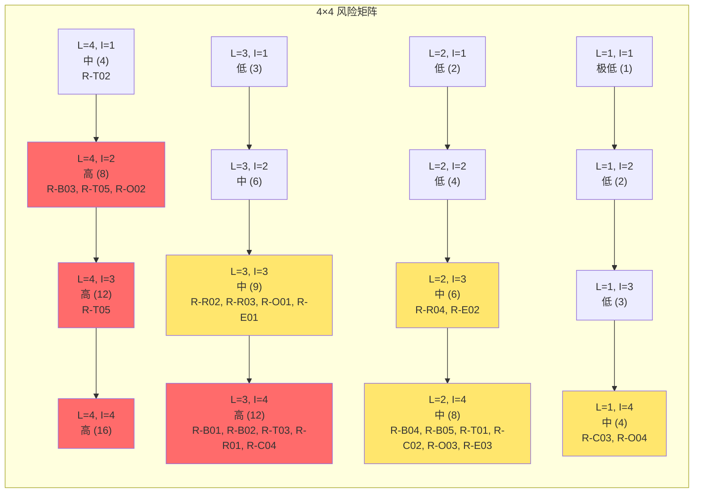
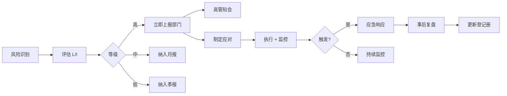

# [项目名称] - 风险矩阵与热力图

| 版本 | 日期 | 作者 | 说明 |
|------|------|------|------|
| 1.0 | YYYY-MM-DD | [Your Name] | 初始版本（v4.3 新增模板） |

---

> 📖 **填写指南**：本文档用 4×4 风险矩阵识别、评估、应对项目全生命周期风险，输出风险登记册与监控机制。
>
> 📌 **一页纸摘要**:
> 1. 看完这页能回答:有哪些风险?严重度?谁负责?怎么应对?
> 2. 文档定位:管理级(风险治理),风险登记册 + 4×4 矩阵 + 应对策略 + 监控
> 3. 核心动作:风险识别 → 评分 → 矩阵 → 应对 → 监控 → 复盘
> 4. 何时使用:项目立项 / 重大决策 / 季度风险盘点 / 重大变更
> 5. 不要用于:具体技术方案(→13)、应急响应 SOP(单独文档)
>
> 🔗 **关键引用**: `reference/12-value-matrix.md` (风险价值) · [`reference/13-quality-selfcheck.md`](../reference/13-quality-selfcheck.md) (风险自检) · [`reference/15-five-field-crosscheck.md`](../reference/15-five-field-crosscheck.md) (5 字段交叉) · [`reference/16-common-pitfalls.md`](../reference/16-common-pitfalls.md) (风险常见错误)
>
> **所属阶段**：管理 / 治理
> **价值判定**：必含(任何重大/复杂项目都应产出)

---

## 0. 填写指南

### 0.0 本文档价值

> **回答的核心问题**：
> 1. 项目有哪些已识别风险？（风险登记册）
> 2. 每个风险的严重度如何？（Likelihood × Impact 评分）
> 3. 风险在 4×4 矩阵中处于什么位置？（热力图）
> 4. 应对策略是什么？（规避/转移/降低/接受）
> 5. 谁负责监控？监控周期？（监控机制）
> 6. 风险触发后如何响应？（应急预案）
>
> **不回答什么**：具体技术方案(→13)、应急响应 SOP(单独)
>
> **价值判定**：决策者一眼看清"高风险在哪里"、执行者明确"自己该防什么"
>
> **所属阶段**：管理

### 0.1 文档结构

| 章节 | 内容 | 主笔 | 必含 |
|------|------|------|------|
| 1. 风险评估框架 | L/I 评分标准、矩阵定义 | PM | [必填] |
| 2. 风险登记册 | 全部已识别风险 | 全体 | [必填] |
| 3. 4×4 风险矩阵 | 热力图 + Mermaid | PM | [必填] |
| 4. 风险应对策略 | 4 类策略 + 选择 | PM + 责任人 | [必填] |
| 5. 风险监控机制 | 周期 + 责任人 + 升级 | PM | [必填] |
| 6. 应急预案 | 触发 → 响应 → 复盘 | 责任人 | [必填] |
| 7. 风险复盘 | 季度复盘 + 更新 | PM | [可选] |

### 0.2 风险分类

| 大类 | 子类 | 典型示例 |
|------|------|----------|
| **业务** | 市场需求、竞争、定价、用户接受度 | 竞品突然降价 |
| **技术** | 架构、性能、稳定性、安全 | 数据库选型失误 |
| **资源** | 人力、预算、时间、关键人离职 | 核心研发离职 |
| **合规** | 法规、隐私、审计、跨境 | GDPR 处罚 |
| **运营** | 客服、运维、推广、增长 | 客服 SLA 崩溃 |
| **外部** | 供应商、第三方、宏观环境 | 云厂商宕机 |

---

## 1. 风险评估框架

### 1.1 Likelihood（可能性）评分

> ⭐ **决策点**：可能性评分必须基于"历史数据 + 行业经验"，不是"我猜"。
> 决策理由：拍脑袋评分 = 全部 3 分 = 矩阵失效 = 风险无优先级。

| 分数 | 名称 | 含义 | 量化标准 |
|------|------|------|----------|
| **1** | 极低 | 不太可能发生 | < 5% 概率 |
| **2** | 低 | 某些情况下可能 | 5% - 25% |
| **3** | 中 | 某些情况下很可能 | 25% - 50% |
| **4** | 高 | 大多数情况下会发生 | 50% - 80% |
| **5** | 极高 | 几乎确定发生 | > 80% |

> 注：4×4 矩阵仅用 1-4 分；详细评分用 1-5。

### 1.2 Impact（影响）评分

| 分数 | 名称 | 含义 | 量化标准 |
|------|------|------|----------|
| **1** | 极小 | 可忽略 | < 1% 进度 / < 1% 预算 |
| **2** | 小 | 局部影响 | 1% - 5% 进度 / 1% - 5% 预算 |
| **3** | 中 | 显著影响 | 5% - 15% 进度 / 5% - 15% 预算 |
| **4** | 大 | 严重 | 15% - 30% 进度 / 15% - 30% 预算 |
| **5** | 极大 | 项目失败 | > 30% 进度 / 项目取消 |

### 1.3 风险等级 = L × I

| 风险等级 | L × I 范围 | 颜色 | 处置要求 |
|----------|------------|------|----------|
| **高风险** | 12-16 | 红 | 必须立即应对 + 高管知会 |
| **中风险** | 6-9 | 黄 | 制定应对计划 + 月度跟踪 |
| **低风险** | 2-4 | 绿 | 接受 + 季度跟踪 |
| **极低** | 1 | 灰 | 接受 + 仅记录 |

### 1.4 4×4 矩阵定义

| | I=1 极小 | I=2 小 | I=3 中 | I=4 大 |
|---|---|---|---|---|
| **L=4 高** | 中 (4) | 高 (8) | 高 (12) | 高 (16) |
| **L=3 中** | 低 (3) | 中 (6) | 中 (9) | 高 (12) |
| **L=2 低** | 低 (2) | 低 (4) | 中 (6) | 中 (8) |
| **L=1 极低** | 极低 (1) | 低 (2) | 低 (3) | 中 (4) |

---

## 2. 风险登记册

> ⭐ **决策点**：风险登记册是"活文档"，每 2 周必须更新一次，不允许"年初填、年底看"。
> 决策理由：项目环境在变，风险等级也在变；登记册僵化 = 决策失据。

### 2.1 业务风险

| 编号 | 风险描述 | 类别 | L | I | 等级 | 应对策略 | 责任人 | 触发条件 | 状态 |
|------|----------|------|---|---|------|----------|--------|----------|------|
| R-B01 | 竞品 X 突然降价 30% | 市场 | 3 | 4 | 高 | 降低 | PM | 监测到价格变化 | 监控中 |
| R-B02 | 用户付费意愿低 | 需求 | 3 | 4 | 高 | 降低 | PM + 数据 | 转化率 < 10% | 已应对 |
| R-B03 | 业务方临时变更需求 | 范围 | 4 | 3 | 高 | 规避 | PM | 需求变更 > 3 次/月 | 应对中 |
| R-B04 | 关键客户流失 | 客户 | 2 | 4 | 中 | 降低 | 客户成功 | 续约率 < 80% | 监控中 |
| R-B05 | 监管政策变化 | 合规 | 2 | 4 | 中 | 接受 | 法务 | 政策草案发布 | 监控中 |

### 2.2 技术风险

| 编号 | 风险描述 | 类别 | L | I | 等级 | 应对策略 | 责任人 | 触发条件 | 状态 |
|------|----------|------|---|---|------|----------|--------|----------|------|
| R-T01 | 数据库选型失误 | 架构 | 2 | 4 | 中 | 降低 | 架构师 | 性能瓶颈 | 应对中 |
| R-T02 | 第三方 API 不稳定 | 集成 | 4 | 2 | 中 | 转移 | 研发 | SLA < 99% | 已应对 |
| R-T03 | 高并发性能不达标 | 性能 | 3 | 4 | 高 | 降低 | 研发 | 压测未达预期 | 应对中 |
| R-T04 | 安全漏洞 | 安全 | 2 | 5 | 高 | 降低 | 安全 | 渗透测试发现 | 应对中 |
| R-T05 | 技术债累积 | 质量 | 4 | 3 | 高 | 降低 | TL | Bug 率上升 | 应对中 |

### 2.3 资源风险

| 编号 | 风险描述 | 类别 | L | I | 等级 | 应对策略 | 责任人 | 触发条件 | 状态 |
|------|----------|------|---|---|------|----------|--------|----------|------|
| R-R01 | 核心研发离职 | 人力 | 3 | 4 | 高 | 降低 | HR + TL | 提交离职申请 | 监控中 |
| R-R02 | 预算超支 | 财务 | 3 | 3 | 中 | 规避 | PM | 支出 > 90% | 监控中 |
| R-R03 | 关键岗位招聘失败 | 人力 | 3 | 3 | 中 | 转移 | HR | 3 个月未招到 | 监控中 |
| R-R04 | 第三方供应商断供 | 供应 | 2 | 3 | 低 | 转移 | 采购 | 合同到期 | 接受 |

### 2.4 合规风险

| 编号 | 风险描述 | 类别 | L | I | 等级 | 应对策略 | 责任人 | 触发条件 | 状态 |
|------|----------|------|---|---|------|----------|--------|----------|------|
| R-C01 | GDPR 处罚 | 隐私 | 2 | 5 | 高 | 规避 | 法务 + 安全 | 数据泄漏 | 已应对 |
| R-C02 | 等保测评未通过 | 安全 | 2 | 4 | 中 | 降低 | 安全 | 测评不达标 | 应对中 |
| R-C03 | 知识产权纠纷 | 法律 | 1 | 4 | 中 | 转移 | 法务 | 收到律师函 | 接受 |
| R-C04 | 跨境数据合规 | 数据 | 3 | 4 | 高 | 降低 | 法务 | 业务出海 | 应对中 |

### 2.5 运营风险

| 编号 | 风险描述 | 类别 | L | I | 等级 | 应对策略 | 责任人 | 触发条件 | 状态 |
|------|----------|------|---|---|------|----------|--------|----------|------|
| R-O01 | 客服 SLA 崩溃 | 服务 | 3 | 3 | 中 | 降低 | 客服 | 满意度 < 80% | 应对中 |
| R-O02 | 推广 ROI 不达预期 | 增长 | 4 | 3 | 高 | 降低 | 增长 | CAC > LTV/3 | 监控中 |
| R-O03 | 负面舆情 | 品牌 | 2 | 4 | 中 | 转移 | PR | 微博热搜 | 已应对 |
| R-O04 | 数据备份失败 | 运维 | 1 | 5 | 中 | 降低 | 运维 | 备份缺失 | 已应对 |

### 2.6 外部风险

| 编号 | 风险描述 | 类别 | L | I | 等级 | 应对策略 | 责任人 | 触发条件 | 状态 |
|------|----------|------|---|---|------|----------|--------|----------|------|
| R-E01 | 云厂商宕机 | 外部 | 3 | 3 | 中 | 转移 | 运维 | 服务不可用 | 已应对 |
| R-E02 | 支付通道异常 | 外部 | 2 | 3 | 低 | 转移 | 财务 | 通道失败 | 接受 |
| R-E03 | 宏观环境恶化 | 外部 | 2 | 4 | 中 | 接受 | 高管 | GDP 负增长 | 接受 |

### 2.7 风险汇总

| 风险等级 | 数量 | 占比 |
|----------|------|------|
| 高风险 | 10 | 38% |
| 中风险 | 12 | 46% |
| 低风险 | 3 | 12% |
| 极低 | 1 | 4% |
| **合计** | **26** | **100%** |

---

## 3. 4×4 风险矩阵热力图

### 3.1 矩阵图

### 3.2 风险聚类

| 风险等级 | 编号 | 数量 |
|----------|------|------|
| **高风险 (L×I ≥ 12)** | R-B01, R-B02, R-B03, R-T03, R-T04, R-T05, R-R01, R-C01, R-C04, R-O02 | 10 |
| **中风险 (6 ≤ L×I < 12)** | R-B04, R-B05, R-T01, R-T02, R-R02, R-R03, R-C02, R-C03, R-O01, R-O03, R-O04, R-E01, R-E03 | 13 |
| **低风险 (2 ≤ L×I < 6)** | R-E02, R-R04 | 2 |
| **极低 (L×I = 1)** | - | 0 |
| **合计** | - | **25** |

### 3.3 Top 10 风险（按 L×I 降序）

| 排名 | 编号 | 风险 | L | I | L×I |
|------|------|------|---|---|-----|
| 1 | R-T04 | 安全漏洞 | 2 | 5 | 10 |
| 2 | R-C01 | GDPR 处罚 | 2 | 5 | 10 |
| 3 | R-B01 | 竞品突然降价 | 3 | 4 | 12 |
| 4 | R-B02 | 用户付费意愿低 | 3 | 4 | 12 |
| 5 | R-T03 | 高并发性能 | 3 | 4 | 12 |
| 6 | R-R01 | 核心研发离职 | 3 | 4 | 12 |
| 7 | R-C04 | 跨境数据合规 | 3 | 4 | 12 |
| 8 | R-B03 | 需求频繁变更 | 4 | 3 | 12 |
| 9 | R-T05 | 技术债累积 | 4 | 3 | 12 |
| 10 | R-O02 | 推广 ROI 不达 | 4 | 3 | 12 |

---

## 4. 风险应对策略

### 4.1 4 类应对策略

| 策略 | 含义 | 适用场景 | 成本 | 典型动作 |
|------|------|----------|------|----------|
| **规避（Avoid）** | 消除风险源 | 高 L × 高 I | 高 | 不做 / 改方案 |
| **转移（Transfer）** | 把风险转给第三方 | 外部风险 | 中 | 买保险 / 签合同 |
| **降低（Mitigate）** | 降低 L 或 I | 中 L × 中 I | 中 | 加冗余 / 加监控 |
| **接受（Accept）** | 承认存在但不行动 | 低 L × 低 I | 低 | 记录 + 应急 |

### 4.2 应对策略矩阵

| | L=1 极低 | L=2 低 | L=3 中 | L=4 高 |
|---|---|---|---|---|
| **I=4 大** | 接受 | 降低 | 降低/规避 | 规避 |
| **I=3 中** | 接受 | 降低 | 降低 | 降低/规避 |
| **I=2 小** | 接受 | 接受 | 降低 | 降低 |
| **I=1 极小** | 接受 | 接受 | 接受 | 降低 |

### 4.3 详细应对计划（高风险 Top 10）

| 编号 | 风险 | 策略 | 具体动作 | 资源投入 | 截止 | 责任人 |
|------|------|------|----------|----------|------|--------|
| R-T04 | 安全漏洞 | 降低 | 1. 季度渗透测试 2. SDL 流程 3. 漏洞赏金计划 | X 万/年 | 持续 | 安全 |
| R-C01 | GDPR 处罚 | 规避 | 1. 数据本地化 2. DPIA 评估 3. 隐私设计 | X 万/年 | 上线前 | 法务 |
| R-B01 | 竞品降价 | 降低 | 1. 竞品监控 2. 差异化价值 3. 客户锁定 | X 万 | 持续 | PM |
| R-B02 | 付费意愿低 | 降低 | 1. 免费试用 2. 价格分层 3. ROI 量化 | X 万 | Q+1 | PM + 增长 |
| R-T03 | 高并发性能 | 降低 | 1. 压测 + 容量规划 2. 限流降级 3. 弹性扩容 | X 万 | 上线前 | 架构 |
| R-R01 | 核心研发离职 | 降低 | 1. AB 角机制 2. 知识沉淀 3. 薪酬竞争力 | X 万 | 持续 | HR |
| R-C04 | 跨境合规 | 降低 | 1. 法务前置 2. 本地化部署 3. 合规审计 | X 万 | 出海前 | 法务 |
| R-B03 | 需求变更 | 规避 | 1. 变更控制流程 2. 季度评审 3. 范围冻结 | 时间 | 持续 | PM |
| R-T05 | 技术债 | 降低 | 1. 20% 研发时间还债 2. 重构里程碑 3. 自动化测试 | 0.2 人 | 持续 | TL |
| R-O02 | 推广 ROI | 降低 | 1. A/B 测试 2. 渠道分散 3. 自然流量 | X 万 | 持续 | 增长 |

---

## 5. 风险监控机制

### 5.1 监控周期

| 风险等级 | 监控周期 | 评审人 | 升级机制 |
|----------|----------|--------|----------|
| **高风险** | 每周 | 部门负责人 | 立即升级至高管 |
| **中风险** | 每月 | 项目经理 | 季度升级至部门 |
| **低风险** | 每季度 | 团队 | 仅记录 |
| **极低** | 半年 | 团队 | 仅记录 |

### 5.2 风险预警指标

| 编号 | 风险 | 预警指标 | 阈值 | 监控方式 |
|------|------|----------|------|----------|
| R-T04 | 安全漏洞 | 高危漏洞数 | > 0 | 自动化扫描 |
| R-B01 | 竞品降价 | 竞品价格变化 | > 20% | 竞品监控 |
| R-B02 | 付费意愿 | 转化率 | < 10% | 数据看板 |
| R-T03 | 高并发 | P99 响应 | > 1s | 性能监控 |
| R-R01 | 研发离职 | 团队稳定性 | 流失率 > 10% | HR 月报 |
| R-O02 | 推广 ROI | CAC/LTV | < 3 | 财务月报 |

### 5.3 风险评审会议

| 类型 | 频次 | 参与人 | 议程 |
|------|------|--------|------|
| **周风险快报** | 每周一 | PM + TL | 高风险状态、新增风险 |
| **月度风险评审** | 每月 1 号 | 部门负责人 | 全部中风险评审 |
| **季度风险盘点** | 每季度初 | 高管 + 部门 | 全部风险、策略调整 |
| **专项风险评审** | 触发时 | 责任人 + 高管 | 重大新增 / 触发 |

### 5.4 风险升级流程

---

## 6. 应急预案

> 每个高风险必须有 1 个应急预案，定义"触发 → 响应 → 复盘"。

### 6.1 应急预案模板

| 字段 | 内容 |
|------|------|
| **风险编号** | R-XXX |
| **风险描述** | [简要] |
| **触发条件** | [可观测的信号] |
| **第一响应人** | [姓名 + 联系方式] |
| **响应 SLA** | [X 分钟内 / 小时内启动] |
| **响应步骤** | 1. ... 2. ... 3. ... |
| **升级路径** | 一级 → 二级 → 三级 |
| **复盘要求** | [X 天内输出复盘] |

### 6.2 应急预案示例（R-T04 安全漏洞）

**触发条件**：自动化扫描发现高危漏洞 / 外部报告安全事件

**响应步骤**：
1. 5 分钟内：安全 OnCall 收到告警
2. 30 分钟内：评估影响范围 + 紧急隔离
3. 1 小时内：发布安全公告
4. 24 小时内：修复 + 全量部署
5. 72 小时内：复盘 + 更新流程

**升级路径**：
- 一级：单个漏洞，无数据泄漏 → 安全 TL
- 二级：多个漏洞 或 PII 风险 → CTO
- 三级：数据已泄漏 → CEO + 法务 + 公关

**复盘要求**：48 小时内输出事后分析（Post-mortem）

### 6.3 应急预案清单

| 编号 | 风险 | 响应 SLA | 第一响应人 |
|------|------|----------|------------|
| R-T04 | 安全漏洞 | 5 分钟 | 安全 OnCall |
| R-C01 | GDPR | 1 小时 | DPO |
| R-B01 | 竞品降价 | 24 小时 | PM |
| R-T03 | 高并发 | 5 分钟 | 研发 OnCall |
| R-R01 | 核心离职 | 24 小时 | HR + TL |
| R-C04 | 跨境合规 | 24 小时 | 法务 |
| R-O01 | 客服崩溃 | 1 小时 | 客服主管 |
| R-O02 | 推广失效 | 24 小时 | 增长 |
| R-E01 | 云厂商宕机 | 5 分钟 | 运维 OnCall |
| R-T05 | 技术债 | 周级 | TL |

---

## 7. 风险复盘

### 7.1 复盘频率

| 复盘类型 | 频次 | 输出 |
|----------|------|------|
| **触发复盘** | 风险触发后 48 小时 | Post-mortem 文档 |
| **月度复盘** | 每月 | 风险登记册更新 |
| **季度复盘** | 每季度 | 风险盘点 + 策略调整 |
| **年度复盘** | 每年 | 风险管理体系评估 |

### 7.2 复盘内容

- 是否按预案执行？
- L/I 评分是否准确？
- 应对策略是否有效？
- 资源投入是否合理？
- 有何改进？

---

## 8. 必含项自检

- [ ] 风险评估框架（L/I 评分标准 + 4×4 矩阵）
- [ ] 风险登记册 ≥ 20 条（覆盖业务/技术/资源/合规/运营/外部 6 类）
- [ ] 4×4 矩阵热力图（Mermaid）
- [ ] 风险等级分布（高/中/低/极低）
- [ ] 4 类应对策略定义 + 选型矩阵
- [ ] 高风险 Top 10 详细应对计划（资源/截止/责任人）
- [ ] 监控机制（周期 + 评审会议 + 升级流程）
- [ ] 应急预案（高风险 1 风险 1 预案）
- [ ] 风险复盘机制（触发/季度/年度）

---

## 摘要(降级输出,200 字内)

> ⚠️ 待 v4.2.2 填充
>
> 模板定位:管理级(风险治理),风险登记册 + 4×4 矩阵 + 应对策略 + 监控 + 预案。核心交付:风险评估框架(L/I 1-4 分、等级 = L×I)、风险登记册(≥20 条覆盖 6 类业务/技术/资源/合规/运营/外部)、4×4 热力图(Mermaid, 标 Top 10 风险)、应对策略(规避/转移/降低/接受 4 类 + 选型矩阵)、高风险 Top 10 详细计划(动作/资源/截止/责任)、监控机制(周/月/季 + 升级)、应急预案(高风险 1 险 1 案)。决策点 2 处(评分基于数据/登记册活文档)。Mermaid 1 张(矩阵图)+ 1 张(升级流程)。
