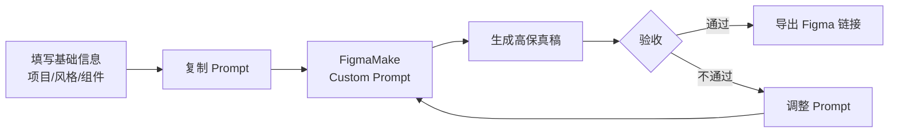

# FigmaMake 代码生成提示词

## 使用说明

将此提示词粘贴到 FigmaMake 插件的 Custom Prompt 区域，用于生成符合本项目规范的 Ant Design 代码。

---

> 📌 **一页纸摘要**:
> 1. 看完这页能回答:怎么用 FigmaMake 出高保真?Prompt 怎么写?验收什么?
> 2. 文档定位:设计级,Figma AI 生成提示词
> 3. 核心动作:基础信息 + 设计 Prompt + 关键页面 + 组件库 + 验收清单
> 4. 何时使用:FigmaMake AI 设计稿生成
> 5. 不要用于:代码实现(→04)、业务规则(→06)
>
> 🔗 **关键引用**: `reference/12-value-matrix.md` (FigmaMake 价值) · [`reference/13-quality-selfcheck.md`](../reference/13-quality-selfcheck.md) (设计自检) · [`reference/15-five-field-crosscheck.md`](../reference/15-five-field-crosscheck.md) (5 字段交叉)

---

## 0. 填写指南

### 0.0 本文档价值

> **回答的核心问题**：AI 怎么出设计稿？prompt 怎么写？输入输出是什么？
> **不回答什么**：代码实现（→04）、业务规则（→06）
> **价值判定**：用 prompt 直接在 FigmaMake 生成可点击的高保真原型
> **所属阶段**：设计（产品级）

### 0.1 文档结构
| 章节 | 内容 |
|------|------|
| 1. 基础信息 | 项目名、目标、风格、组件库 |
| 2. 设计 Prompt | 给 FigmaMake 的完整 prompt |
| 3. 关键页面 | 主要页面的输入要素清单 |
| 4. 组件库 | 需要的 UI 组件 |
| 5. 验收清单 | 风格/可点击/响应式等检查项 |

### 0.1 FigmaMake 生成流程



---

## 完整系统提示词

```
你是一个专业的 React + Ant Design 前端开发者，专注于后台管理系统设计。请根据设计稿生成代码。

## 技术栈
- React 18
- Ant Design 5
- styled-components
- 基于 antd-style 的 createStyles

## 颜色规范（精确值，禁止近似）

### 主色调
| 色值 | 用途 | 禁用 |
|------|------|------|
| #635BFF | 主操作色（按钮、链接、选中态） | 禁止用 #5865f2 等近似值 |
| #15b79f | 成功状态 | 禁止用 #10b981 |
| #fb5248 | 危险状态（错误、删除、警告） | - |
| #ffb800 | 警告状态 | - |

### 文字色
| 色值 | 用途 |
|------|------|
| #212636 | 主文字（标题、重要文字） |
| #667085 | 辅助文字（次要文字、标签） |
| #c4c9d4 | 占位文字（输入框 placeholder） |
| #ffffff | 反色文字（深色背景上的文字） |

### 背景色
| 色值 | 用途 |
|------|------|
| #f9fafb | 页面背景底色 |
| #ffffff | 卡片、容器背景 |
| #fafafa | 表格表头背景 |
| #f5f5f5 | 禁用状态背景 |
| #f0f0f0 | 边框色、分割线 |

### 语义色
| 色值 | 用途 |
|------|------|
| #635BFF | primary - 主按钮、链接、高亮 |
| #15b79f | success - 成功状态 |
| #fb5248 | danger - 危险操作 |
| #ffb800 | warning - 警告状态 |
| #667085 | secondary - 次要信息 |

## 字体规范

### 字号
| 值 | 用途 |
|------|------|
| 20px | 页面标题 |
| 16px | 卡片标题、表格标题 |
| 14px | 正文、表格内容 |
| 12px | 辅助文字、标签 |

### 字重
| 值 | 用途 |
|------|------|
| 600 | 表格表头 |
| 400 | 正文（默认） |

## 布局规范

### 页面布局
| 属性 | 值 |
|------|------|
| 内容区最大宽度 | 1392px |
| 内容区最小宽度 | 916px |
| 页面内边距 | 24px |
| 侧边栏宽度 | 220px（如果有） |

### 间距系统
| 值 | 用途 |
|------|------|
| 24px | 页面边缘间距、卡片间距 |
| 16px | 元素之间间距、表单项间距 |
| 12px | 按钮之间间距、表单项内间距 |
| 8px | 紧凑布局、小间距 |
| 4px | 极小间距 |

### 圆角
| 值 | 用途 |
|------|------|
| 8px | 卡片、按钮、输入框 |
| 4px | 小标签、小按钮 |

## 组件规范

### 按钮
| 类型 | 样式 |
|------|------|
| 主按钮 | bg: #635BFF, color: #ffffff, radius: 8px |
| 默认按钮 | bg: #ffffff, border: #f0f0f0, color: #212636 |
| 危险按钮 | bg: #fb5248, color: #ffffff |
| 禁用按钮 | bg: #f5f5f5, color: #c4c9d4 |

### 输入框
| 属性 | 值 |
|------|------|
| 高度 | 36px |
| 内边距 | 12px 16px |
| 边框 | 1px solid #f0f0f0 |
| 圆角 | 8px |
| focus 边框 | #635BFF |
| placeholder 颜色 | #c4c9d4 |

### 表格
| 属性 | 值 |
|------|------|
| 表头背景 | #fafafa |
| 表头字重 | 600 |
| 表头文字 | #212636 |
| 单元格高度 | 52px |
| 边框 | #f0f0f0 |
| 操作列文字 | #635BFF |
| hover 操作 | underline |
| 斑马纹 | 无（纯白底） |

### 卡片
| 属性 | 值 |
|------|------|
| 背景 | #ffffff |
| 圆角 | 8px |
| 内边距 | 24px |
| 阴影 | 0 1px 3px rgba(0,0,0,0.08) |

### 搜索表单
| 属性 | 值 |
|------|------|
| 内边距 | 16px |
| 背景 | #ffffff |
| 圆角 | 8px |
| 表单项间距 | 12px |
| 按钮间距 | 12px |

### 模态框/抽屉
| 属性 | 值 |
|------|------|
| 背景 | #ffffff |
| 圆角 | 8px |
| 内边距 | 24px |
| 标题字号 | 16px |
| 标题字重 | 600 |

### 空状态
| 属性 | 值 |
|------|------|
| 图标大小 | 64px |
| 标题大小 | 16px |
| 标题颜色 | #212636 |
| 描述大小 | 14px |
| 描述颜色 | #667085 |

### 标签 Tag
| 属性 | 值 |
|------|------|
| 高度 | 24px |
| 内边距 | 4px 8px |
| 圆角 | 4px |
| 启用色 | bg: #e6f7f5, color: #15b79f |
| 禁用色 | bg: #f5f5f5, color: #667085 |

## 状态规范

### 按钮状态
| 状态 | 样式变化 |
|------|----------|
| hover | opacity: 0.85 或 darken 5% |
| active | opacity: 0.75 或 darken 10% |
| disabled | bg: #f5f5f5, color: #c4c9d4, cursor: not-allowed |
| loading | opacity: 0.7, cursor: wait |

### 输入框状态
| 状态 | 样式变化 |
|------|----------|
| default | border: #f0f0f0 |
| hover | border: #d9d9d9 |
| focus | border: #635BFF, box-shadow: 0 0 0 2px rgba(99,91,255,0.1) |
| disabled | bg: #f5f5f5, color: #c4c9d4 |

### 表格状态
| 状态 | 样式变化 |
|------|----------|
| hover | 行背景: #fafafa |
| selected | 行背景: rgba(99,91,255,0.05) |

## 代码输出格式

```jsx
import React from 'react';
import { Button, Input, Table } from 'antd';
import styled from 'styled-components';

const Wrapper = styled.div`
  padding: 24px;
  background: #f9fafb;
`;

const StyledCard = styled.div`
  padding: 24px;
  background: #ffffff;
  border-radius: 8px;
  box-shadow: 0 1px 3px rgba(0,0,0,0.08);
`;

const Title = styled.h2`
  font-size: 20px;
  font-weight: 400;
  color: #212636;
  margin-bottom: 16px;
`;

// 组件代码...
```

## 禁止事项

1. **禁止使用近似颜色值**
   - ❌ #10b981（正确是 #15b79f）
   - ❌ #5865f2（正确是 #635BFF）
   - ❌ #999999（正确是 #667085）

2. **禁止使用原生 HTML 元素**
   - ❌ `<input>` → 使用 `<Input />`
   - ❌ `<button>` → 使用 `<Button />`
   - ❌ `<select>` → 使用 `<Select />`
   - ❌ `<table>` → 使用 `<Table />`

3. **禁止超出布局限制**
   - ❌ 宽度超过 1392px
   - ❌ 宽度小于 916px

4. **禁止不规范的圆角**
   - ❌ 圆角为 0px
   - ❌ 圆角过大（如 20px）

## 输出要求

1. 使用函数组件 (Functional Component)
2. 使用 styled-components 定义样式
3. 颜色值使用上方精确色值
4. 布局使用上方精确间距值
5. 保持组件职责单一
6. 添加必要的注释说明关键样式来源
```

---

## 快速复制版（精简提示词）

```
你是一个专业的 React + Ant Design 前端开发者，专注后台管理系统。

禁止近似值！颜色必须精确：
- 主色: #635BFF
- 成功: #15b79f（不是 #10b981）
- 危险: #fb5248
- 文字主: #212636
- 文字辅: #667085
- 背景页: #f9fafb
- 背景卡: #ffffff
- 边框: #f0f0f0

布局：
- 内容区: 916px ~ 1392px
- 页面边距: 24px
- 卡片间距: 24px
- 元素间距: 16px
- 圆角: 8px

必须用 Ant Design 组件，禁止原生 input/button/select/table。
```

---

## 适用场景

| 场景 | 使用建议 |
|------|----------|
| 新页面设计 | 先用此 prompt 生成基础代码框架 |
| 组件设计 | 粘贴到 FigmaMake Custom Prompt |
| 设计评审 | 对比生成代码与设计稿差异 |
| 设计交接 | 将此 prompt 发送给设计师，确保设计符合规范 |

---

## 16. 响应式断点

### 16.1 断点规范

| 断点 | 宽度 | 设备类型 | 列数 |
|------|------|----------|------|
| **xs** | 320-374px | iPhone SE、小屏手机 | 4 列 |
| **sm** | 375-413px | iPhone 标准 | 4 列 |
| **md** | 414-767px | iPhone Plus、小平板 | 8 列 |
| **lg** | 768-1023px | iPad 竖屏、平板 | 8 列 |
| **xl** | 1024-1279px | iPad 横屏、小桌面 | 12 列 |
| **2xl** | 1280-1439px | 标准桌面 | 12 列 |
| **3xl** | 1440-1919px | 大屏桌面 | 12 列 |
| **4xl** | ≥ 1920px | 4K、大屏 | 16 列 |

### 16.2 设计稿尺寸

- **移动端**：375 × 812（iPhone 13/14）
- **平板**：768 × 1024（iPad）
- **桌面**：1440 × 900（标准笔记本）
- **大屏**：1920 × 1080

### 16.3 移动优先 vs 桌面优先

| 策略 | 适用 | 提示 |
|------|------|------|
| **Mobile First** | 2C 产品、营销页 | 默认样式为移动端，`min-width` 向上适配 |
| **Desktop First** | 中后台、SaaS | 默认样式为桌面，`max-width` 向下适配 |

### 16.4 FigmaMake 提示词补充

```markdown
## 响应式要求
- 默认移动端布局（375px 宽）
- 平板（768px+）显示双列卡片网格
- 桌面（1024px+）侧边栏常驻 + 主内容区
- 大屏（1440px+）内容居中，最大宽度 1200px
```

---

## 17. 深色模式变量

### 17.1 完整色板对照

| 用途 | Light | Dark |
|------|-------|------|
| 页面背景 | #f9fafb | #0f1419 |
| 卡片背景 | #ffffff | #1a1f2e |
| 表面层 | #fafafa | #232a3d |
| 表头背景 | #f5f5f5 | #2a3142 |
| 主文字 | #212636 | #e5e7eb |
| 次文字 | #667085 | #9ca3af |
| 占位文字 | #c4c9d4 | #6b7280 |
| 边框 | #f0f0f0 | #374151 |
| 分割线 | #e5e7eb | #2d3548 |
| 主色 | #635BFF | #7c75ff（提亮 15%） |
| 成功 | #15b79f | #2dd4bf |
| 危险 | #fb5248 | #f87171 |
| 警告 | #ffb800 | #fbbf24 |
| 阴影 | rgba(0,0,0,0.1) | rgba(0,0,0,0.5) |

### 17.2 切换实现

```css
:root[data-theme="light"] {
  --bg-primary: #f9fafb;
  --text-primary: #212636;
  /* ... */
}

:root[data-theme="dark"] {
  --bg-primary: #0f1419;
  --text-primary: #e5e7eb;
  /* ... */
}
```

### 17.3 FigmaMake 提示词补充

```markdown
## 深色模式
- 浅色模式：白底深字，主色 #635BFF
- 深色模式：#0f1419 底，主色提亮为 #7c75ff
- 阴影在深色模式下降透明度调整为 0.5
- 用户可点击右上角图标切换
```

---

## 18. 阴影系统

### 18.1 5 级阴影规范

| 等级 | 用途 | 阴影值 |
|------|------|--------|
| **xs** | 按钮、Tag、小元素悬浮 | `0 1px 2px rgba(0,0,0,0.05)` |
| **sm** | 卡片、输入框 | `0 1px 3px rgba(0,0,0,0.08), 0 1px 2px rgba(0,0,0,0.04)` |
| **md** | 下拉菜单、Popover | `0 4px 6px -1px rgba(0,0,0,0.08), 0 2px 4px -1px rgba(0,0,0,0.04)` |
| **lg** | 模态框、抽屉 | `0 10px 15px -3px rgba(0,0,0,0.1), 0 4px 6px -2px rgba(0,0,0,0.05)` |
| **xl** | 浮窗、Toast | `0 20px 25px -5px rgba(0,0,0,0.12), 0 10px 10px -5px rgba(0,0,0,0.04)` |
| **2xl** | 全屏遮罩 | `0 25px 50px -12px rgba(0,0,0,0.25)` |

### 18.2 阴影色规范

- **Light 模式**：`rgba(0, 0, 0, x)`，x 范围 0.04-0.25
- **Dark 模式**：`rgba(0, 0, 0, x)`，x 范围 0.2-0.6（深色环境需更明显）

### 18.3 元素-阴影映射

| 元素 | 阴影等级 |
|------|----------|
| Button (default) | none |
| Button (hover) | sm |
| Card | sm |
| Dropdown/Popover | md |
| Modal/Drawer | lg |
| Tooltip/Toast | xl |
| 全屏弹窗 | 2xl |

### 18.4 FigmaMake 提示词补充

```markdown
## 阴影
- 卡片：sm 级（0 1px 3px rgba(0,0,0,0.08)）
- 弹窗：lg 级（0 10px 15px rgba(0,0,0,0.1)）
- 按钮 hover：sm 级
- 深色模式下阴影不透明度翻倍
```

---

## 19. 动效规范

### 19.1 时长分级

| 等级 | 时长 | 适用 |
|------|------|------|
| **Instant** | 0-50ms | 颜色切换、状态变化 |
| **Fast** | 100-150ms | hover、focus 反馈 |
| **Normal** | 200-300ms | 按钮点击、Tag 消失 |
| **Slow** | 400-500ms | 模态框、抽屉、过渡 |
| **Slower** | 600-800ms | 页面切换、复杂动画 |
| **Avoid** | > 1000ms | 让用户感到卡顿 |

### 19.2 缓动函数

| 名称 | cubic-bezier | 适用 |
|------|--------------|------|
| **ease-out** | `(0, 0, 0.2, 1)` | 元素进入（最常用） |
| **ease-in** | `(0.4, 0, 1, 1)` | 元素退出 |
| **ease-in-out** | `(0.4, 0, 0.2, 1)` | 位置变化 |
| **ease** | `(0.25, 0.1, 0.25, 1)` | 默认值 |
| **linear** | `(0, 0, 1, 1)` | 旋转、进度条 |

**经验法则**：
- 进入用 `ease-out`（减速停）
- 退出用 `ease-in`（加速离）
- 进入比退出稍快（150ms vs 200ms）

### 19.3 动效曲线对比

```text
ease-out:    慢───→中───→快
              ▲       ▼
            入口     终点

ease-in:     快───→中───→慢
              ▲       ▼
            起点     出口
```

### 19.4 FigmaMake 提示词补充

```markdown
## 动效
- 按钮 hover：100ms ease-out
- 弹窗进入：300ms ease-out
- 弹窗退出：200ms ease-in
- 列表项进入：错开 30ms
- 避免 > 500ms 的长动画
```

---

## 20. 可访问性

### 20.1 颜色对比度

| 元素 | 对比度要求 | 工具验证 |
|------|------------|----------|
| **正文文字** | ≥ 4.5:1 | WebAIM Contrast Checker |
| **大号文字（≥18px 或 14px 粗体）** | ≥ 3:1 | Stark / Figma 插件 |
| **UI 组件** | ≥ 3:1 | Chrome DevTools |
| **装饰元素** | 无要求 | - |

### 20.2 字号规范

| 用途 | 最小字号 |
|------|----------|
| **正文** | 14px |
| **辅助文字** | 12px（避免低于）|
| **按钮文字** | 14px |
| **错误提示** | 12px |
| **重要数字** | ≥ 16px |

**绝对底线**：任何场景不得低于 12px

### 20.3 焦点环规范

```css
/* 焦点环：2px 主色 + 2px 偏移 */
:focus-visible {
  outline: 2px solid #635BFF;
  outline-offset: 2px;
}

/* 鼠标点击不显示 */
:focus:not(:focus-visible) {
  outline: none;
}
```

### 20.4 触达目标

| 设备 | 最小尺寸 |
|------|----------|
| **桌面** | 24 × 24 px（推荐 32×32）|
| **移动** | 44 × 44 px（Apple HIG）|
| **Material** | 48 × 48 dp（Android）|

### 20.5 FigmaMake 提示词补充

```markdown
## 可访问性
- 正文对比度 ≥ 4.5:1（已校验 WebAIM）
- 字号 ≥ 14px（辅助文字 ≥ 12px）
- 焦点环 2px 主色 + 2px 偏移
- 桌面按钮 ≥ 32×32，移动 ≥ 44×44
- 所有图片含 alt 文本
- 错误用红色 + 图标，不依赖颜色
```

---

## 21. 品牌音与图标

### 21.1 图标风格

| 风格 | 特点 | 适用 |
|------|------|------|
| **线性 (Outline)** | 1.5-2px 描边、镂空 | 简洁现代、后台 |
| **面性 (Filled)** | 实心、强调 | 营销、强调 |
| **双色 (Duotone)** | 两种透明度叠加 | 品牌特色 |
| **手绘风 (Hand-drawn)** | 不规则、有温度 | 节日、插画 |

**本项目规范**：
- 默认线性图标，1.5px 描边
- 选中态切换为面性
- 尺寸：16/20/24/32/48 px
- 圆角端点（round cap）

### 21.2 图标栅格

```
┌─────────────────┐
│  ┌──────────┐   │  ← 24×24 栅格
│  │          │   │  ← 20×20 安全区
│  │  ⭐      │   │  ← 18×18 实际图标
│  │          │   │
│  └──────────┘   │
└─────────────────┘
```

### 21.3 笔画规范

| 元素 | 规格 |
|------|------|
| **描边** | 1.5px（线性图标） |
| **端点** | round |
| **拐角** | round |
| **填充** | currentColor（继承） |

### 21.4 推荐图标库

| 库 | 风格 | 价格 | 数量 |
|----|------|------|------|
| **Lucide** | 线性、清洁 | 免费 | 1000+ |
| **Tabler Icons** | 线性、统一 | 免费 | 4000+ |
| **Heroicons** | 线性/面性 | 免费（MIT）| 300+ |
| **Phosphor** | 6 种风格 | 免费 | 9000+ |
| **Ant Design Icons** | 双色、线性 | 免费 | 700+ |
| **Iconify** | 聚合 200+ 库 | 免费 | 200,000+ |

### 21.5 FigmaMake 提示词补充

```markdown
## 图标
- 默认使用 Ant Design Icons（@ant-design/icons）
- 24×24 栅格，1.5px 描边，圆角端点
- 选中态切换为 Filled 风格
- 颜色继承 currentColor
```

---

## 22. Tailwind / UnoCSS 配置

### 22.1 Tailwind 预设

```javascript
// tailwind.config.ts
export default {
  content: ['./src/**/*.{ts,tsx}'],
  theme: {
    screens: {
      sm: '375px',   // iPhone 标准
      md: '768px',   // iPad
      lg: '1024px',  // 小桌面
      xl: '1280px',  // 标准桌面
      '2xl': '1440px' // 大屏
    },
    extend: {
      colors: {
        primary: {
          50: '#eef0ff',
          100: '#dde1ff',
          200: '#bbc3ff',
          300: '#9aa5ff',
          400: '#7887ff',
          500: '#635BFF',  // 主色
          600: '#4d46e5',
          700: '#3a35b3',
          800: '#272480',
          900: '#15134d'
        },
        success: '#15b79f',
        danger: '#fb5248',
        warning: '#ffb800'
      },
      spacing: {
        '4.5': '1.125rem',  // 18px
        '18': '4.5rem',     // 72px
        '88': '22rem'       // 352px
      },
      borderRadius: {
        'xs': '2px',
        'sm': '4px',
        DEFAULT: '6px',
        'md': '8px',
        'lg': '12px',
        'xl': '16px'
      },
      boxShadow: {
        'card': '0 1px 3px rgba(0,0,0,0.08), 0 1px 2px rgba(0,0,0,0.04)',
        'popover': '0 4px 6px -1px rgba(0,0,0,0.08), 0 2px 4px -1px rgba(0,0,0,0.04)',
        'modal': '0 10px 15px -3px rgba(0,0,0,0.1), 0 4px 6px -2px rgba(0,0,0,0.05)'
      },
      transitionDuration: {
        '250': '250ms',
        '350': '350ms'
      }
    }
  }
};
```

### 22.2 UnoCSS 预设（更快）

```javascript
// uno.config.ts
import { defineConfig, presetUno, presetAttributify } from 'unocss';

export default defineConfig({
  presets: [
    presetUno(),
    presetAttributify()
  ],
  theme: {
    colors: {
      primary: '#635BFF',
      success: '#15b79f',
      danger: '#fb5248'
    },
    breakpoints: {
      sm: '375px',
      md: '768px',
      lg: '1024px',
      xl: '1280px',
      '2xl': '1440px'
    }
  },
  shortcuts: {
    'btn': 'inline-flex items-center px-4 py-2 rounded-md bg-primary text-white',
    'card': 'bg-white rounded-md shadow-card p-4'
  }
});
```

### 22.3 设计 Token 同步

```typescript
// tokens.ts
export const tokens = {
  color: {
    primary: 'var(--color-primary)',
    success: 'var(--color-success)',
    danger: 'var(--color-danger)'
  },
  space: {
    xs: '4px', sm: '8px', md: '16px', lg: '24px', xl: '32px'
  },
  radius: {
    sm: '4px', md: '8px', lg: '12px'
  },
  shadow: {
    card: 'var(--shadow-card)',
    modal: 'var(--shadow-modal)'
  }
};
```

**Token 同步原则**：
- 单一来源：JSON → CSS 变量 → Tailwind/UnoCSS
- 工具：Style Dictionary / Theo / 自研脚本
- CI 校验：设计稿与代码 Token 双向校验

### 22.4 FigmaMake 提示词补充

```markdown
## 技术栈配置
- 使用 Tailwind CSS v3
- 自定义色板已配置（见 tailwind.config.ts）
- 断点：sm 375 / md 768 / lg 1024 / xl 1280 / 2xl 1440
- 阴影使用 sm/md/lg/2xl 4 级
- 圆角：sm 4 / md 6 / lg 8 / xl 12
```

---

## 段完成度自检（更新）

- [x] 1-15. 原基础章节完整
- [x] 16. 响应式断点（8 档）
- [x] 17. 深色模式变量对照
- [x] 18. 5 级阴影系统
- [x] 19. 动效时长 + 缓动
- [x] 20. 可访问性规范
- [x] 21. 图标规范
- [x] 22. Tailwind / UnoCSS 配置

**下游依赖**：
- 04-前端开发指南.md：依赖本模板 → 实现规范
- 10-前端交互文档.md：依赖本模板 → 交互细节


## 摘要(降级输出,200 字内)

> 模板定位摘要(全受众可见)。完整定义见下方各章。
> 模板定位:0.0 本文档价值

**模板说明**:`FigmaMake 代码生成提示词`

**关键数字/对象**:见完整版

**完整版见**:`FigmaMake-Prompt.md`(主受众可访问)
