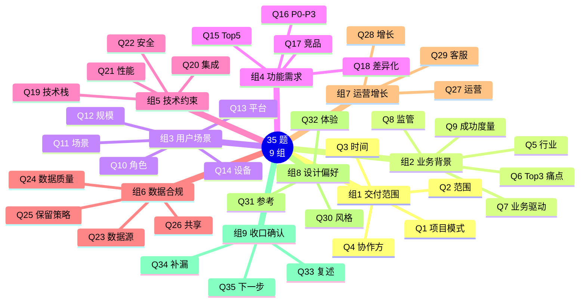
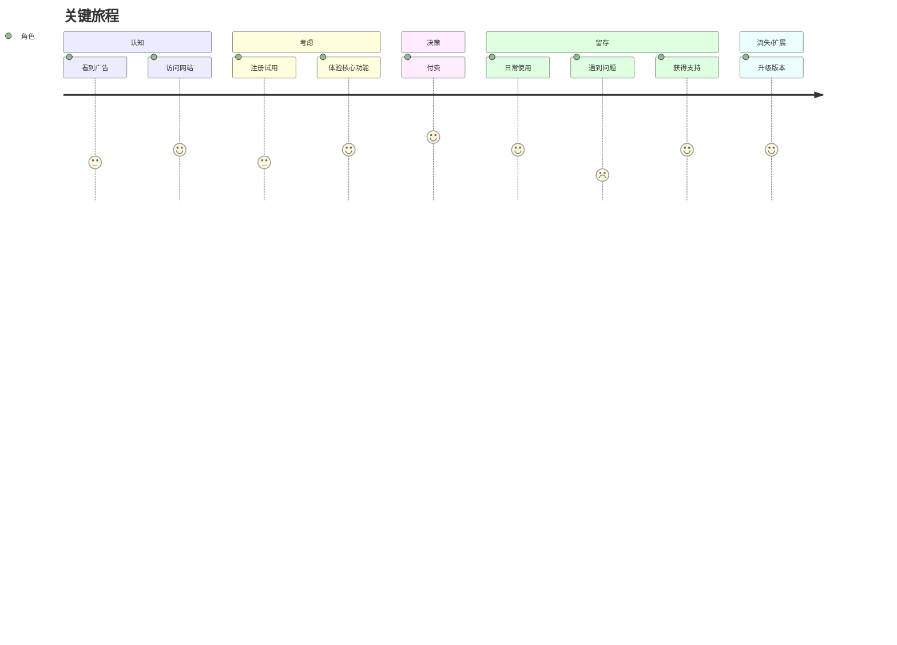

# [需求名称] - 用户需求调研报告

| 版本 | 日期 | 作者 | 说明 |
|------|------|------|------|
| 1.0 | YYYY-MM-DD | [Your Name] | 初始版本 |

---

> 📖 **填写指南**：本文档用于记录 35 题深度用户调研（9 组）的结果，是需求分析、产品设计、技术选型的关键依据。
>
> ⚠️ **2026-06-03 升级**：从 21 题扩展到 35 题（9 组），覆盖深度业务/数据合规/运营增长。
>
> 📌 **一页纸摘要**:
> 1. 看完这页能回答:用户是谁?痛点是什么?优先级是什么?有什么约束?
> 2. 文档定位:调研级(用户),35 题深度调研结果汇总
> 3. 核心动作:9 组问题 + 答案 + 洞察 + 优先级 + 待澄清
> 4. 何时使用:需求分析 / 产品设计 / 立项决策
> 5. 不要用于:本项目功能(→06)、技术选型(→13)
>
> 🔗 **关键引用**: `reference/12-value-matrix.md` (用户调研价值) · [`reference/13-quality-selfcheck.md`](../reference/13-quality-selfcheck.md) (调研自检) · [`reference/15-five-field-crosscheck.md`](../reference/15-five-field-crosscheck.md) (5 字段交叉) · [`reference/16-common-pitfalls.md`](../reference/16-common-pitfalls.md) (调研常见错误)

---

## 0. 填写指南

### 0.0 本文档价值

> **回答的核心问题**：
> 1. **交付范围**：项目模式、范围、时间、协作方是什么？（组 1）
> 2. **业务背景**：行业痛点、Top3 痛点、业务驱动、监管、成功度量？（组 2）
> 3. **用户与场景**：用户角色、场景、规模、平台、设备？（组 3）
> 4. **功能需求**：Top5 功能、P0-P3 优先级、竞品、差异化？（组 4）
> 5. **技术约束**：技术栈、集成、性能、安全合规？（组 5）
> 6. **数据与合规**：数据源、质量、保留、共享？（组 6）⭐
> 7. **运营与增长**：运营策略、增长手段、客服？（组 7）
> 8. **设计偏好**：风格、参考、体验？（组 8）
> 9. **收口确认**：理解复述、补漏、下一步？（组 9）⭐
>
> **集成上游**：本文档的 35 题问卷详见 `openPRD-user-research/reference/questionnaire.md`。
>
> **不回答什么**：行业宏观（→14-行业）、技术选型（→14-技术趋势）
>
> **价值判定**：用户读完后能明确"我们要为谁解决什么问题、为什么这样做能赢"

### 0.1 9 组 35 题结构

| 组 | 主题 | 题目数 | 必答 | 输出 |
|----|------|--------|------|------|
| **组 1** | 交付范围 | 4 | ⭐ 全部 | 项目模式、范围、时间、协作方 |
| **组 2** | 业务背景 | 5 | - | 背景、痛点、驱动、监管、度量 |
| **组 3** | 用户与场景 | 5 | - | 角色、场景、规模、平台、设备 |
| **组 4** | 功能需求 | 4 | - | Top5、P0-P3、竞品、差异化 |
| **组 5** | 技术约束 | 4 | - | 栈、集成、性能、安全 |
| **组 6** | 数据与合规 | 4 | ⭐ 全部 | 源、质量、保留、共享 |
| **组 7** | 运营与增长 | 3 | - | 运营、增长、客服 |
| **组 8** | 设计偏好 | 3 | - | 风格、参考、体验 |
| **组 9** | 收口确认 | 3 | ⭐ 全部 | 复述、补漏、下一步 |
| **合计** | - | **35** | **18 必答** | - |

### 0.2 调研方法选择

| 方法 | 适用场景 | 样本量 | 周期 |
|------|----------|--------|------|
| 用户访谈 | 深度理解需求和动机 | 5-8 人 | 2-4 周 |
| 可用性测试 | 评估特定设计或流程 | 5-8 人 | 1-2 周 |
| 问卷调查 | 量化态度和偏好 | 100+ | 1-2 周 |
| 卡片分类 | 信息架构决策 | 15-30 人 | 1 周 |
| 现场观察 | 理解真实工作场景 | 3-5 人 | 1-2 周 |
| A/B 测试 | 量化方案效果 | 大流量 | 持续 |

### 0.3 调研质量评级

| 等级 | 标准 |
|------|------|
| **A 高** | ≥ 5 个用户引用 + 2 种方法 + 数据完整 |
| **B 中** | 3-5 个用户引用 + 1 种方法 + 数据完整 |
| **C 低** | < 3 个用户引用 或 数据不完整 |

### 0.6 必含项自检

- [ ] 35 题全部回答（必答 18 题 100%）
- [ ] ≥ 2 种调研方法
- [ ] ≥ 5 个用户引用
- [ ] Q33 复述确认（理解一致）
- [ ] Q35 下一步确认（行动明确）
- [ ] 调研质量评级 A/B/C

### 0.7 35 题 9 组结构



---

## 1. 用户调研基本信息

### 1.1 调研背景

| 维度 | 内容 |
|------|------|
| **调研主题** | [产品/项目名称] |
| **调研周期** | YYYY-MM-DD ~ YYYY-MM-DD |
| **调研负责人** | [姓名] |
| **调研方法** | [访谈/问卷/可用性测试/...] |
| **样本量** | XX 人 |
| **质量评级** | A / B / C |

### 1.2 调研执行情况

| 任务 | 计划 | 实际 | 备注 |
|------|------|------|------|
| 关键问题（Q1+Q2） | YYYY-MM-DD | YYYY-MM-DD | 启动门槛 |
| 剩余问答（Q3-Q35） | 持续 | 持续 | 与 5 路行业研究并行 |
| 收口确认（Q33-Q35） | YYYY-MM-DD | YYYY-MM-DD | 启动文档产出前 |

---

## 2. 组 1：交付范围（必答 4 题）⭐

### Q1. 项目模式

**问题**：本次项目是**后端同时实现**，还是**只考虑前端**（使用Mock数据）？

**回答**：

- [ ] A. 后端同时实现（完整模式 - 含数据库/后端/部署）
- [ ] B. 只考虑前端（简化模式 - 仅 Mock 数据）

**对调研的影响**：
- 选 A：需要调研后端技术栈、数据库选型、部署架构
- 选 B：只需关注前端体验和 Mock 数据真实性

### Q2. 需求范围

**问题**：本次需求覆盖哪些产品/功能？明确 In/Out Scope。

**回答**：

```
In Scope（必做）：
1. [功能/产品 1]
2. [功能/产品 2]
3. [功能/产品 3]

Out of Scope（不做）：
1. [功能/产品 1]
2. [功能/产品 2]
```

### Q3. 时间节点

**问题**：项目交付时间节点？分期计划？

**回答**：

| 阶段 | 时间 | 交付物 |
|------|------|--------|
| 一期 | YYYY-MM | [功能] |
| 二期 | YYYY-MM | [功能] |
| 三期 | TBD | [功能] |

### Q4. 协作方

**问题**：涉及哪些部门/团队？谁是决策方？谁是干系方？

**回答**：

| 角色 | 部门/团队 | 姓名 | 职责 |
|------|----------|------|------|
| 决策方 | [部门] | [姓名] | 最终拍板 |
| 产品负责人 | [部门] | [姓名] | 需求决策 |
| 技术负责人 | [部门] | [姓名] | 技术决策 |
| 业务方 | [部门] | [姓名] | 业务验收 |
| 法务 | [部门] | [姓名] | 合规审查 |
| 安全 | [部门] | [姓名] | 安全审查 |

---

## 3. 组 2：业务背景（5 题）

### Q5. 业务背景

**问题**：当前业务现状是什么？为什么要做这个项目？

**回答**：

[用户原话/整理]

### Q6. Top 3 痛点

**问题**：当前最痛的 3 个问题是什么？每个问题的严重程度和频次？

**回答**：

| 排名 | 痛点 | 严重程度 | 频次 | 影响范围 |
|------|------|----------|------|----------|
| 1 | [痛点 1] | 高/中/低 | 高/中/低 | XX 人/订单 |
| 2 | [痛点 2] | 高/中/低 | 高/中/低 | XX 人/订单 |
| 3 | [痛点 3] | 高/中/低 | 高/中/低 | XX 人/订单 |

### Q7. 业务驱动

**问题**：这个项目背后的业务驱动是什么？战略意义？

**回答**：

```
业务驱动：
- [驱动 1：如：客户数据资产化]
- [驱动 2：如：精细化运营]
- [驱动 3：如：合规要求]

战略意义：
- [意义 1]
- [意义 2]
```

### Q8. 行业监管

**问题**：项目涉及哪些行业监管要求？合规边界？

**回答**：

| 法规 | 影响 | 重点 |
|------|------|------|
| [法规 1] | [高/中/低] | [重点] |
| [法规 2] | [高/中/低] | [重点] |

### Q9. 成功度量

**问题**：项目成功的度量标准是什么？KPI/OPI 是什么？

**回答**：

| 指标 | 目标值 | 度量方式 |
|------|--------|----------|
| [指标 1] | XX | [方式] |
| [指标 2] | XX | [方式] |
| [指标 3] | XX | [方式] |

---

## 4. 组 3：用户与场景（5 题）

### Q10. 用户角色

**问题**：涉及哪些用户角色？每个角色的核心诉求？

**回答**：

| 角色 | 描述 | 核心诉求 | 量级 |
|------|------|----------|------|
| 角色 1 | [描述] | [诉求] | XX 万 |
| 角色 2 | [描述] | [诉求] | XX 万 |
| 角色 3 | [描述] | [诉求] | XX 万 |

### Q11. 关键场景

**问题**：3-5 个最关键的用户使用场景是什么？每个场景的完整流程？

**回答**：

#### 场景 1：[名称]
- **谁**：[角色]
- **什么场景下**：[触发条件]
- **做什么**：[操作步骤]
- **为什么**：[目的]
- **衡量**：成功 = [标准]

### Q12. 用户规模

**问题**：总用户量、活跃用户量、目标增长量是多少？

**回答**：

| 指标 | 数值 | 备注 |
|------|------|------|
| 总用户量 | XX 万 | 截至 YYYY-MM |
| DAU | XX 万 | - |
| MAU | XX 万 | - |
| 付费用户 | XX 万 | 转化率 XX% |
| 目标增长 | XX%/年 | - |

### Q13. 平台

**问题**：用户主要在哪些平台使用？PC / 移动 / 小程序 / 平板 / 其他？

**回答**：

| 平台 | 占比 | 优先级 |
|------|------|--------|
| PC Web | XX% | P0/P1/P2 |
| H5 | XX% | P0/P1/P2 |
| iOS App | XX% | P0/P1/P2 |
| Android App | XX% | P0/P1/P2 |
| 微信小程序 | XX% | P0/P1/P2 |
| 钉钉/企微 | XX% | P0/P1/P2 |
| 其他 | XX% | P0/P1/P2 |

### Q14. 设备

**问题**：用户主要使用什么设备？屏幕分辨率、操作系统版本？

**回答**：

| 设备 | 占比 | 主流配置 |
|------|------|----------|
| iPhone | XX% | iOS 14+, iPhone 11+ |
| Android | XX% | Android 9+, 主流机型 |
| Windows PC | XX% | Win 10/11, Chrome/Edge |
| Mac | XX% | macOS 12+, Safari/Chrome |
| 平板 | XX% | iPad/Android |

---

## 5. 组 4：功能需求（4 题）

### Q15. Top 5 功能

**问题**：你认为最重要的 5 个功能是什么？每个功能的优先级和理由？

**回答**：

| 排名 | 功能 | 优先级 | 理由 | 用户引用 |
|------|------|--------|------|----------|
| 1 | [功能] | P0/P1/P2 | [理由] | "..." |
| 2 | [功能] | P0/P1/P2 | [理由] | "..." |
| ... | | | | |

### Q16. P0-P3 优先级

**问题**：所有功能需求按 P0-P3 优先级排序？每期交付什么？

**回答**：

| 优先级 | 标准 | 功能清单 | 数量 |
|--------|------|----------|------|
| **P0** | 一期必做 | 1. ... 2. ... 3. ... | XX 个 |
| **P1** | 二期必做 | 1. ... 2. ... 3. ... | XX 个 |
| **P2** | 三期必做 | 1. ... 2. ... 3. ... | XX 个 |
| **P3** | 远期考虑 | 1. ... 2. ... 3. ... | XX 个 |

### Q17. 竞品参考

**问题**：用户/团队是否参考过某些竞品？最欣赏/最讨厌的点？

**回答**：

| 竞品 | 角色 | 最欣赏 | 最讨厌 | 借鉴/避免 |
|------|------|--------|--------|-----------|
| [竞品 1] | 参考 | [点] | [点] | 借鉴 X / 避免 Y |
| [竞品 2] | 参考 | [点] | [点] | 借鉴 X / 避免 Y |
| [竞品 3] | 竞对 | [点] | [点] | - |

### Q18. 差异化

**问题**：相比竞品，本项目最希望突出的差异化是什么？

**回答**：

```
差异化 1：[如：AI 能力]
差异化 2：[如：价格优势]
差异化 3：[如：垂直深耕]
```

---

## 6. 组 5：技术约束（4 题）

### Q19. 技术栈

**问题**：团队熟悉的技术栈？是否有必须使用的技术？是否有禁止使用的技术？

**回答**：

| 维度 | 选择 | 备注 |
|------|------|------|
| 前端框架 | React / Vue / 其他 | [版本/原因] |
| 后端语言 | Node.js / Java / Go / Python | [原因] |
| 数据库 | PostgreSQL / MySQL / MongoDB | [原因] |
| 缓存 | Redis / Memcached | - |
| 部署 | AWS / 阿里云 / 腾讯云 | [原因] |
| **必须用** | [如：必须用 React] | - |
| **禁止用** | [如：禁止用 MySQL 5.7 以下] | - |

### Q20. 系统集成

**问题**：需要与哪些现有系统集成？集成方式？

**回答**：

| 系统 | 集成方式 | 数据流向 | 频率 |
|------|----------|----------|------|
| [系统 1] | API / 数据库 / 文件 / 消息队列 | 双向/单向 | 实时/批/分钟/小时/天 |
| [系统 2] | API / 数据库 / 文件 / 消息队列 | 双向/单向 | 实时/批/分钟/小时/天 |
| [系统 3] | API / 数据库 / 文件 / 消息队列 | 双向/单向 | 实时/批/分钟/小时/天 |

### Q21. 性能要求

**问题**：性能指标？并发量？响应时间？数据量？

**回答**：

| 指标 | 目标 |
|------|------|
| 并发用户 | XX |
| 峰值 QPS | XX |
| P99 响应 | ≤ XX ms |
| P95 响应 | ≤ XX ms |
| 数据量 | XX 万 / XX 亿 |
| 增长预期 | XX% / 年 |

### Q22. 安全合规

**问题**：需要满足哪些安全合规要求？

**回答**：

| 要求 | 适用 | 等级 |
|------|------|------|
| 等保 | 二级 / 三级 | 高/中/低 |
| 个人信息保护法 | 适用 | 必 |
| 数据安全法 | 适用 | 必 |
| 行业专项 | [如：金融] | [等级] |
| 跨境合规 | GDPR / CCPA / 其他 | [等级] |

---

## 7. 组 6：数据与合规（必答 4 题）⭐

### Q23. 数据源

**问题**：项目的数据从哪些来源获取？每类数据量级？更新频率？

**回答**：

| 数据源 | 数据类型 | 量级 | 更新频率 | 接入方式 |
|--------|----------|------|----------|----------|
| [源 1] | 业务订单 | XX 万/天 | 实时/批 | API/数据库/文件 |
| [源 2] | 用户行为 | XX 万/天 | 实时/批 | 埋点 SDK |
| [源 3] | 外部数据 | XX 万 | 天/周/月 | 第三方 API |
| [源 4] | 历史数据 | XX 亿 | 一次性 | ETL |

### Q24. 数据质量

**问题**：历史数据质量如何？数据清洗规则？

**回答**：

| 维度 | 现状 | 目标 |
|------|------|------|
| 完整性 | XX% | 100% |
| 准确性 | XX% | 99%+ |
| 一致性 | XX% | 99%+ |
| 唯一性 | XX% | 99%+ |
| 时效性 | XX% | 99%+ |

### Q25. 数据保留

**问题**：各类数据保留多久？过期后如何处理？

**回答**：

| 数据类型 | 在线保留 | 归档保留 | 过期处理 |
|----------|----------|----------|----------|
| 业务数据 | XX 年 | XX 年 | 删除/匿名化 |
| 日志数据 | XX 天 | XX 月 | 删除 |
| 用户数据 | 账户生命周期 | 注销后 XX 天 | 删除 |
| 监管数据 | XX 年 | 永久 | 归档 |

### Q26. 数据共享

**问题**：数据是否需要共享给第三方？共享范围？授权机制？

**回答**：

| 共享对象 | 共享内容 | 共享方式 | 授权 |
|----------|----------|----------|------|
| 关联方 | [字段] | API/文件 | 协议+用户同意 |
| 政府/监管 | [字段] | 报送 | 法定 |
| 第三方服务商 | [字段] | API | 协议+用户同意 |
| 公开 | 匿名/汇总 | 公开 | - |

---

## 8. 组 7：运营与增长（3 题）

### Q27. 运营策略

**问题**：项目上线后如何运营？运营团队？运营预算？

**回答**：

```
运营团队：[团队规模]
运营策略：
- [策略 1：如：内容运营]
- [策略 2：如：活动运营]
- [策略 3：如：用户运营]
运营预算：[预算/季度]
```

### Q28. 增长手段

**问题**：如何获客？如何激活？如何留存？如何变现？如何裂变？

**回答**：

| 阶段 | 手段 | 目标 |
|------|------|------|
| 获客 | [如：内容营销、渠道投放] | XX 万/月 |
| 激活 | [如：新手任务、引导] | 转化率 XX% |
| 留存 | [如：签到、推送、个性化] | 次日留存 XX% |
| 变现 | [如：订阅、广告、抽佣] | ARPU XX |
| 裂变 | [如：邀请有礼、拼团] | 分享率 XX% |

### Q29. 客服

**问题**：客服团队？客服渠道？客服工具？

**回答**：

```
客服团队：XX 人
客服渠道：
- [如：在线客服]
- [如：电话]
- [如：企微]
- [如：工单]
客服工具：[如：智齿/容联]
SLA：响应 ≤ 30s / 解决 ≤ 24h
```

---

## 9. 组 8：设计偏好（3 题）

### Q30. 风格

**问题**：偏好的视觉风格？颜色？调性？

**回答**：

| 维度 | 偏好 |
|------|------|
| 整体风格 | 商务专业 / 科技现代 / 活泼年轻 / 极简克制 |
| 主色调 | [颜色 + hex] |
| 辅助色 | [颜色 + hex] |
| 调性 | 严谨 / 友好 / 高效 / 高端 |

### Q31. 参考设计

**问题**：是否有具体的设计参考？参考图？参考网站？

**回答**：

| 参考 | 类型 | 借鉴点 |
|------|------|--------|
| [产品 1] | 同品类 | 布局/颜色/组件 |
| [产品 2] | 跨品类 | 交互/动效 |
| [产品 3] | 风格 | 视觉/品牌 |

### Q32. 体验

**问题**：希望强调哪些体验？避免哪些体验问题？

**回答**：

```
强调：
- [如：极致性能]
- [如：易学易用]
- [如：专业感]

避免：
- [如：功能堆砌]
- [如：花哨动效]
- [如：广告弹窗]
```

---

## 10. 组 9：收口确认（必答 3 题）⭐

### Q33. 理解复述

**问题**：请用您自己的话描述本次需求，确认我的理解。

**回答**：

> 用户原话：
> "..."

> 主 Agent 复述理解：
> "您要做的是 [产品名]，核心解决 [痛点]，面向 [用户群]，关键功能包括 [功能 1/2/3]，采用 [技术栈]，一期 YYYY-MM 上线。对吗？"

> 用户确认：[是/否/补充]

### Q34. 补漏

**问题**：还有哪些重要信息没有问到？或您觉得需要补充的？

**回答**：

```
补充 1：[用户主动补充]
补充 2：[用户主动补充]
```

### Q35. 下一步

**问题**：下一步我们做什么？您希望我们如何推进？

**回答**：

```
下一步行动：
1. [行动 1：如：开始 5 路行业研究]
2. [行动 2：如：补充 X 个用户访谈]
3. [行动 3：如：内部评审]

时间节点：
- [日期]：阶段产出
- [日期]：评审
```

---

## 11. 用户画像

### 11.1 Persona A - [角色名]

| 维度 | 描述 |
|------|------|
| **姓名** | [虚拟名] |
| **年龄** | XX |
| **职位** | [职位] |
| **工作年限** | XX 年 |
| **典型一天** | [描述] |
| **核心目标** | [目标] |
| **最大痛点** | [痛点] |
| **现有方案** | [方案] |
| **触达渠道** | [渠道] |
| **使用频率** | [频次] |
| **决策权重** | 高/中/低 |
| **AARRR 阶段** | A/A/A/R/R |
| **用户引用** | "..." |

### 11.2 Persona B - [角色名]

> 同 11.1 模板

### 11.3 Persona C - [角色名]

> 同 11.1 模板

---

## 12. 需求与痛点汇总

### 12.1 核心需求（按 Kano 分类）

| 类别 | 需求 | 优先级 |
|------|------|--------|
| **必备 (Must-be)** | [如：登录注册] | P0 |
| **期望 (One-dimensional)** | [如：搜索功能] | P1 |
| **兴奋 (Attractive)** | [如：AI 推荐] | P2 |

### 12.2 痛点排序

| 排名 | 痛点 | 影响用户 | 频次 | 现有方案 | 我们的方案 |
|------|------|----------|------|----------|------------|
| 1 | [痛点 1] | XX 角色 | 高 | [方案] | [方案] |
| 2 | [痛点 2] | XX 角色 | 高 | [方案] | [方案] |
| 3 | [痛点 3] | XX 角色 | 中 | [方案] | [方案] |

---

## 13. 用户旅程

### 13.1 关键旅程 1：[旅程名]



### 13.2 旅程中的痛点与机会

| 阶段 | 痛点 | 机会 | 我们的方案 |
|------|------|------|------------|
| 认知 | [痛点] | [机会] | [方案] |
| 考虑 | [痛点] | [机会] | [方案] |
| 决策 | [痛点] | [机会] | [方案] |
| 留存 | [痛点] | [机会] | [方案] |

---

## 14. 调研洞察

### 14.1 关键 Insight

> **Insight 1**：[关键洞察]
> - **依据**：[用户引用 + 数据]
> - **影响**：[对产品/技术/运营的影响]
> - **行动**：[具体行动项]

> **Insight 2**：[关键洞察]
> - **依据**：[用户引用 + 数据]
> - **影响**：[对产品/技术/运营的影响]
> - **行动**：[具体行动项]

> **Insight 3**：[关键洞察]
> - **依据**：[用户引用 + 数据]
> - **影响**：[对产品/技术/运营的影响]
> - **行动**：[具体行动项]

### 14.2 假设与验证

| 假设 | 验证方法 | 结果 | 行动 |
|------|----------|------|------|
| [假设 1] | [方法] | 验证/推翻 | [行动] |
| [假设 2] | [方法] | 验证/推翻 | [行动] |

### 14.3 未确认事项

| 事项 | 状态 | 下一步 |
|------|------|--------|
| [事项 1] | 待确认 | [行动] |
| [事项 2] | 待确认 | [行动] |

---

## 15. 后续行动建议

### 15.1 立即行动

| # | 行动 | 负责人 | 时间 |
|---|------|--------|------|
| 1 | [行动] | [人] | YYYY-MM-DD |
| 2 | [行动] | [人] | YYYY-MM-DD |
| 3 | [行动] | [人] | YYYY-MM-DD |

### 15.2 后续调研

| # | 调研 | 方法 | 时间 |
|---|------|------|------|
| 1 | [调研] | [方法] | YYYY-MM |
| 2 | [调研] | [方法] | YYYY-MM |

### 15.3 风险与应对

| 风险 | 等级 | 应对 |
|------|------|------|
| [风险 1] | 高/中/低 | [应对] |
| [风险 2] | 高/中/低 | [应对] |

---

## 16. 自检清单

### 16.1 完整性

- [ ] 35 题全部回答
- [ ] 必答 18 题 100%
- [ ] ≥ 2 种调研方法
- [ ] ≥ 5 个用户引用
- [ ] ≥ 3 个 Persona
- [ ] ≥ 3 个关键旅程

### 16.2 数据严谨性

- [ ] 关键数据有来源
- [ ] 痛点有量化（影响/频次）
- [ ] 优先级有理由
- [ ] 假设有验证方法

### 16.3 决策可用性

- [ ] Q33 复述已确认
- [ ] Q35 下一步已明确
- [ ] 风险与应对已列出
- [ ] 调研质量评级 A/B/C 已标注

---

**文档完成。** 后续详见：行业研究（14-行业）→ 项目整体（02）→ 产品需求（06）。


## 摘要(降级输出,200 字内)

> 模板定位摘要(全受众可见)。完整定义见下方各章。
> 模板定位:0.0 本文档价值

**核心决策**:
- **运营与增长**:运营策略、增长手段、客服？（组 7）
- **集成上游**:本文档的 35 题问卷详见 `openPRD-user-research/reference/questionnaire.md`。
- **问题**:本次项目是**…
